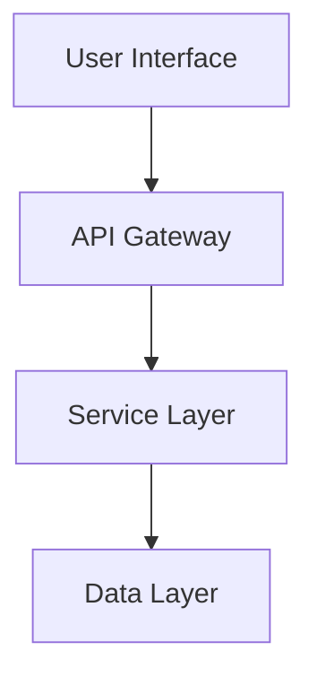

# ✨ Guía Completa de Gestión de Features - 2025

> **📌 REFERENCIA PRINCIPAL:** Para el contexto completo del ecosistema, consulta **[MASTER_GUIDE_2025.md](./MASTER_GUIDE_2025.md)** - La fuente definitiva del sistema Prompt Manager Lite V.

## 🎯 Objetivo
Establecer un framework completo para planificar, documentar, implementar y gestionar features con trazabilidad completa, feature flags, A/B testing y métricas de adopción.

## 📁 Estructura de Archivos

### **Organización de Features:**
```bash
prompt-manager-lite-v/
├── streaming_files/
│   └── features/
│       ├── template.md                # Template base para features
│       ├── manifest.json              # Manifiesto local de features
│       └── F###-{slug}/              # Carpetas individuales de features
│           ├── feature.md            # Especificación principal
│           ├── technical-design.md   # Diseño técnico detallado
│           ├── pendingtask.md        # Tareas pendientes
│           ├── test-plan.md          # Plan de testing
│           ├── rollout-plan.md       # Plan de rollout
│           └── assets/               # Mockups, diagramas, etc.
├── real_structure_documentation/
│   ├── docs/
│   │   ├── DOC030-FeatureIndex.md   # Índice central de features
│   │   └── DOC029-ProjectRoadmap.md # Roadmap del proyecto
│   └── schemas/
│       └── master_blueprint_parts/
│           └── featureIndex.json     # Schema de features
└── tools/
    ├── feature-flag-manager.py       # Gestor de feature flags
    └── feature-metrics.py            # Métricas de adopción
```

## 🧩 Convenciones y Estándares 2025

### **Nomenclatura de Features:**
```bash
# Formato: F{###}-{descripcion-corta}
F001-user-authentication
F002-payment-integration
F003-realtime-notifications
```

### **Frontmatter Completo:**
```yaml
---
title: "[FEATURE_NAME]"
featureId: "F###"
status: draft|design|development|testing|staged|rolled-out|deprecated
priority: P0-critical|P1-high|P2-medium|P3-low
impact: high|medium|low
effort: XS|S|M|L|XL
owner: "@[PRODUCT_OWNER]"
techLead: "@[TECH_LEAD]"
designer: "@[UX_DESIGNER]"
startDate: "[YYYY-MM-DD]"
targetDate: "[YYYY-MM-DD]"
releaseDate: "[YYYY-MM-DD]"
epicLink: "[JIRA/GITHUB_EPIC]"
schemaRefs:
  - real_structure_documentation/schemas/master_blueprint_parts/featureIndex.json
  - real_structure_documentation/schemas/master_blueprint_parts/productDefinition.json
featureFlags:
  - name: "[FLAG_NAME]"
    environment: "production|staging|development"
    percentage: 0-100
tags:
  - core-functionality
  - user-experience
  - performance
  - security
  - monetization
---
```

## 📝 Template Completo de Feature Specification

```markdown
# Feature Specification: [FEATURE_NAME]

## 🎯 Executive Summary
**Business Value:** [VALUE_PROPOSITION]
**User Impact:** [NUMBER] usuarios ([PERCENTAGE]%)
**Revenue Impact:** $[AMOUNT] estimado anual
**Strategic Alignment:** [OKR/GOAL_REFERENCE]

## 📋 Problem Statement
### Current State
[DESCRIPCIÓN_DEL_PROBLEMA_ACTUAL]

### Desired State
[DESCRIPCIÓN_DEL_ESTADO_DESEADO]

### Success Metrics
- **Primary KPI:** [METRIC] - Target: [VALUE]
- **Secondary KPIs:**
  - [METRIC_1]: [TARGET_1]
  - [METRIC_2]: [TARGET_2]
  - [METRIC_3]: [TARGET_3]

## 👥 User Stories
### Story 1: [PERSONA] - [NEED]
**As a** [PERSONA]
**I want to** [ACTION]
**So that** [BENEFIT]

**Acceptance Criteria:**
- [ ] [CRITERIA_1]
- [ ] [CRITERIA_2]
- [ ] [CRITERIA_3]

## 🏗️ Technical Design
### Architecture Overview


### API Changes
```json
{
  "endpoint": "/api/v2/[RESOURCE]",
  "method": "POST",
  "request": {
    "field1": "type",
    "field2": "type"
  },
  "response": {
    "status": "success",
    "data": {}
  }
}
```

### Database Changes
```sql
ALTER TABLE [TABLE_NAME]
ADD COLUMN [COLUMN_NAME] [TYPE];
```

## 🚀 Implementation Plan
### Phase 1: Foundation (Week 1-2)
- [ ] Backend API implementation
- [ ] Database schema updates
- [ ] Unit tests

### Phase 2: Integration (Week 3-4)
- [ ] Frontend implementation
- [ ] Integration tests
- [ ] Documentation

### Phase 3: Polish (Week 5)
- [ ] Performance optimization
- [ ] Security review
- [ ] UAT

## 🎛️ Feature Flags Configuration
```yaml
feature_flags:
  [FEATURE_NAME]_enabled:
    description: "Main toggle for [FEATURE_NAME]"
    default: false
    rollout:
      - environment: development
        enabled: true
        percentage: 100
      - environment: staging
        enabled: true
        percentage: 100
      - environment: production
        enabled: false
        percentage: 0
```

## 📊 A/B Testing Plan
### Hypothesis
[HYPOTHESIS_STATEMENT]

### Variants
- **Control:** [CURRENT_EXPERIENCE]
- **Treatment:** [NEW_EXPERIENCE]

### Success Criteria
- Statistical significance: 95%
- Minimum sample size: [NUMBER]
- Primary metric improvement: >[PERCENTAGE]%

## 🚦 Rollout Strategy
### Stage 1: Internal Testing (Day 1-3)
- 100% internal employees
- Monitor error rates
- Gather feedback

### Stage 2: Beta Users (Day 4-7)
- 5% beta users
- Monitor performance metrics
- Collect user feedback

### Stage 3: Gradual Rollout (Week 2-3)
- Day 8: 10%
- Day 10: 25%
- Day 12: 50%
- Day 14: 100%

### Rollback Criteria
- Error rate > [THRESHOLD]%
- Performance degradation > [THRESHOLD]ms
- User complaints > [THRESHOLD]

## ⚠️ Risks & Mitigations
| Risk | Probability | Impact | Mitigation |
|------|------------|--------|------------|
| [RISK_1] | High/Med/Low | High/Med/Low | [MITIGATION_1] |
| [RISK_2] | High/Med/Low | High/Med/Low | [MITIGATION_2] |

## 📈 Monitoring & Analytics
### Dashboards
- **Business Metrics:** [DASHBOARD_LINK]
- **Technical Metrics:** [DASHBOARD_LINK]
- **User Analytics:** [DASHBOARD_LINK]

### Alerts
```yaml
alerts:
  - name: "[FEATURE]_error_rate"
    condition: "error_rate > 1%"
    severity: "critical"
    channel: "#alerts-critical"
  - name: "[FEATURE]_latency"
    condition: "p95_latency > 500ms"
    severity: "warning"
    channel: "#alerts-performance"
```
```

## 🔄 Workflow Completo de Gestión de Features

### **FASE 1: Ideación y Propuesta**
```bash
# 1. Crear propuesta inicial
mkdir -p streaming_files/proposals/P###-{feature-proposal}/
cp streaming_files/proposals/template.md streaming_files/proposals/P###/proposal.md

# 2. Validar con stakeholders
# Recoger feedback y refinar

# 3. Aprobar y convertir a feature
mkdir -p streaming_files/features/F###-{feature-name}/
cp streaming_files/features/template.md streaming_files/features/F###/feature.md
```

### **FASE 2: Diseño y Especificación**
```bash
# 1. Crear diseño técnico
touch streaming_files/features/F###/technical-design.md

# 2. Definir user stories
# Documentar en feature.md

# 3. Plan de testing
touch streaming_files/features/F###/test-plan.md

# 4. Actualizar roadmap
# Editar DOC029-ProjectRoadmap.md
```

### **FASE 3: Implementación**
```bash
# 1. Desarrollo iterativo
status: "development"

# 2. Feature flags setup
python3 tools/feature-flag-manager.py create F###

# 3. Testing continuo
# Unit tests, integration tests, E2E tests
```

### **FASE 4: Rollout y Monitoreo**
```bash
# 1. Deploy a staging
status: "staged"

# 2. Rollout gradual
python3 tools/feature-flag-manager.py rollout F### --percentage 5

# 3. Monitorear métricas
python3 tools/feature-metrics.py monitor F###

# 4. Completar rollout
status: "rolled-out"
```

## 📊 Métricas y KPIs de Features

### **Framework de Métricas HEART:**
```yaml
Happiness:
  - user_satisfaction_score
  - net_promoter_score
  - app_store_rating

Engagement:
  - daily_active_users
  - session_duration
  - interactions_per_session

Adoption:
  - new_user_signups
  - feature_adoption_rate
  - time_to_first_action

Retention:
  - 7_day_retention
  - 30_day_retention
  - churn_rate

Task_Success:
  - completion_rate
  - error_rate
  - time_to_complete
```

### **Dashboard de Features:**
```markdown
## 📈 Feature Performance Dashboard

### Active Features
| Feature | Status | Adoption | Performance | Health |
|---------|--------|----------|-------------|--------|
| F001 | 100% rolled out | 87% | 99.9% uptime | 🟢 |
| F002 | 50% rollout | 42% | 99.5% uptime | 🟡 |
| F003 | In development | - | - | ⚪ |

### This Quarter
- **Shipped:** 5 features
- **In Progress:** 3 features
- **Planned:** 7 features
- **Success Rate:** 92%
```

## 🎛️ Feature Flags Management

### **Configuración de Feature Flags:**
```javascript
// feature-flags.config.js
export const featureFlags = {
  F001_NEW_CHECKOUT: {
    name: 'new_checkout_flow',
    description: 'Redesigned checkout experience',
    environments: {
      development: { enabled: true, percentage: 100 },
      staging: { enabled: true, percentage: 100 },
      production: { enabled: true, percentage: 25 }
    },
    targeting: {
      users: ['beta_testers', 'employees'],
      regions: ['US', 'CA'],
      devices: ['mobile', 'desktop']
    },
    dependencies: ['F000_BASE_FEATURE'],
    killSwitch: true
  }
};
```

### **SDK Integration:**
```python
# Python example
from feature_flags import FeatureFlag

@FeatureFlag('F001_NEW_CHECKOUT')
def checkout_process(user):
    # New checkout implementation
    pass

# Check flag programmatically
if FeatureFlag.is_enabled('F001_NEW_CHECKOUT', user):
    show_new_experience()
else:
    show_legacy_experience()
```

## ✅ Checklist Completo de Feature Development

### **Pre-Development:**
- [ ] Business case documentado
- [ ] User research completado
- [ ] Technical feasibility validada
- [ ] Recursos asignados
- [ ] Dependencies identificadas

### **Design Phase:**
- [ ] User stories escritas
- [ ] Mockups/wireframes creados
- [ ] Technical design aprobado
- [ ] API contracts definidos
- [ ] Test plan documentado

### **Development:**
- [ ] Code implementation completa
- [ ] Unit tests (>80% coverage)
- [ ] Integration tests
- [ ] Code review aprobado
- [ ] Documentation actualizada

### **Testing:**
- [ ] QA testing completo
- [ ] Performance testing
- [ ] Security review
- [ ] Accessibility testing
- [ ] UAT sign-off

### **Rollout:**
- [ ] Feature flags configurados
- [ ] Monitoring/alerts setup
- [ ] Rollout plan ejecutado
- [ ] Metrics tracking activo
- [ ] Communication enviada

### **Post-Launch:**
- [ ] Metrics review (Day 1, 7, 30)
- [ ] User feedback collected
- [ ] Bugs addressed
- [ ] Success criteria validated
- [ ] Retrospective completed

## 🧪 Testing y Validación

### **Estrategia de Testing:**
```yaml
# test-strategy.yml
testing_pyramid:
  unit_tests:
    coverage_target: 80%
    frameworks: [Jest, PyTest, JUnit]
    
  integration_tests:
    coverage_target: 60%
    scope: [API, Database, Services]
    
  e2e_tests:
    coverage_target: 40%
    tools: [Cypress, Selenium, Playwright]
    
  performance_tests:
    tools: [JMeter, K6, Gatling]
    targets:
      - response_time_p95: <500ms
      - throughput: >1000 req/s
      - error_rate: <0.1%
```

### **Comandos de Validación:**
```bash
# 1. Verificar feature specification
python3 tools/validate_feature.py F###

# 2. Ejecutar tests
npm test -- --feature=F###
pytest tests/features/F###/

# 3. Performance testing
k6 run tests/performance/F###.js

# 4. Generate coverage report
npm run coverage -- --feature=F###
```

## 🎯 Mejores Prácticas 2025

### **DO's:**
- ✅ Usar feature flags para todo rollout
- ✅ Implementar A/B testing para validar hipótesis
- ✅ Documentar decisiones técnicas y trade-offs
- ✅ Mantener features pequeñas y enfocadas
- ✅ Medir impacto real vs esperado

### **DON'Ts:**
- ❌ Lanzar features sin métricas
- ❌ Ignorar feedback de usuarios
- ❌ Saltarse fases de testing
- ❌ Hacer rollout 100% sin validación gradual
- ❌ Dejar feature flags obsoletos activos

## 📚 Referencias
- **Master Guide:** [MASTER_GUIDE_2025.md](./MASTER_GUIDE_2025.md)
- **Feature Index:** `real_structure_documentation/docs/DOC030-FeatureIndex.md`
- **Roadmap:** `real_structure_documentation/docs/DOC029-ProjectRoadmap.md`
- **Product Definition:** `real_structure_documentation/docs/DOC002-ProductDefinition.md`

---

**Última Actualización:** 2025-01-18
**Versión:** 2.0 (Enhanced para 2025)
**Próxima Revisión:** Mensual
