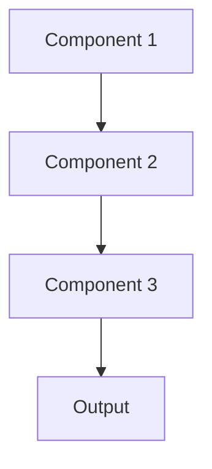

# 💡 Guía Completa de Proposals & RFCs - 2025

> **📌 REFERENCIA PRINCIPAL:** Para el contexto completo del ecosistema, consulta **[MASTER_GUIDE_2025.md](./MASTER_GUIDE_2025.md)** - La fuente definitiva del sistema Prompt Manager Lite V.

## 🎯 Objetivo
Establecer un framework estructurado para propuestas técnicas, RFCs (Request for Comments), ideas de mejora y decisiones arquitectónicas con análisis de impacto, evaluación de alternativas y proceso de aprobación transparente.

## 📁 Estructura de Archivos

### **Organización de Proposals:**
```bash
prompt-manager-lite-v/
├── streaming_files/
│   └── proposals/
│       ├── template.md                # Template base para proposals
│       ├── idea_spec.md               # Template para especificaciones
│       ├── rfc_template.md            # Template para RFCs
│       ├── manifest.json              # Manifiesto local de proposals
│       └── P###-{slug}/               # Carpetas individuales de proposals
│           ├── proposal.md            # Documento principal
│           ├── technical-analysis.md  # Análisis técnico detallado
│           ├── impact-assessment.md   # Evaluación de impacto
│           ├── alternatives.md        # Alternativas consideradas
│           ├── implementation-plan.md # Plan de implementación
│           ├── pendingtask.md         # Tareas pendientes
│           └── assets/                # Diagramas, mockups, etc.
├── real_structure_documentation/
│   ├── docs/
│   │   ├── DOC029-ProjectRoadmap.md  # Roadmap del proyecto
│   │   ├── DOC017-ADR-Index.md       # Architecture Decision Records
│   │   └── DOC022-ReleaseProcess.md  # Proceso de release
│   └── schemas/
│       └── master_blueprint_parts/
│           ├── qualityGoals.json      # Schema de objetivos
│           └── projectManagement.json # Schema de gestión
└── tools/
    ├── proposal-validator.py          # Validador de proposals
    ├── rfc-processor.py               # Procesador de RFCs
    └── decision-tracker.py            # Tracker de decisiones
```

## 🧩 Convenciones y Estándares 2025

### **Nomenclatura de Proposals:**
```bash
# Formato: P{###}-{descripcion-corta}
P001-api-redesign
P002-performance-optimization
P003-security-enhancement
P004-architecture-migration
```

### **Frontmatter Completo:**
```yaml
---
title: "[PROPOSAL_TITLE]"
proposalId: "P###"
type: feature|enhancement|architecture|process|security
status: draft|review|feedback|approved|rejected|implemented
priority: P0-critical|P1-high|P2-medium|P3-low
impact: breaking|major|minor|patch
effort: XS|S|M|L|XL
author: "@[AUTHOR_NAME]"
reviewers:
  - "@[REVIEWER_1]"
  - "@[REVIEWER_2]"
approver: "@[APPROVER]"
createdDate: "[YYYY-MM-DD]"
reviewDate: "[YYYY-MM-DD]"
decisionDate: "[YYYY-MM-DD]"
implementationDate: "[YYYY-MM-DD]"
relatedProposals:
  - "P###"
  - "P###"
schemaRefs:
  - real_structure_documentation/schemas/master_blueprint_parts/qualityGoals.json
  - real_structure_documentation/schemas/master_blueprint_parts/projectManagement.json
tags:
  - architecture
  - performance
  - scalability
  - security
  - user-experience
---
```

## 📝 Template Completo de Proposal/RFC

```markdown
# Proposal: [PROPOSAL_TITLE]

## 📋 Executive Summary
**One-liner:** [BRIEF_DESCRIPTION]
**Value Proposition:** [BUSINESS_VALUE]
**Estimated Impact:** [USERS/REVENUE/PERFORMANCE]
**Implementation Timeline:** [DURATION]

## 🎯 Problem Statement
### Context
[CURRENT_SITUATION_DESCRIPTION]

### Pain Points
1. **[PAIN_POINT_1]:** [DESCRIPTION]
2. **[PAIN_POINT_2]:** [DESCRIPTION]
3. **[PAIN_POINT_3]:** [DESCRIPTION]

### Success Criteria
- [ ] [SUCCESS_CRITERIA_1]
- [ ] [SUCCESS_CRITERIA_2]
- [ ] [SUCCESS_CRITERIA_3]

## 💡 Proposed Solution
### Overview
[SOLUTION_DESCRIPTION]

### Key Components


### Technical Approach
```yaml
architecture:
  frontend:
    - [TECHNOLOGY_1]
    - [TECHNOLOGY_2]
  backend:
    - [TECHNOLOGY_3]
    - [TECHNOLOGY_4]
  infrastructure:
    - [TECHNOLOGY_5]
    - [TECHNOLOGY_6]
```

## 🔄 Alternatives Considered
### Alternative 1: [NAME]
**Pros:**
- ✅ [ADVANTAGE_1]
- ✅ [ADVANTAGE_2]

**Cons:**
- ❌ [DISADVANTAGE_1]
- ❌ [DISADVANTAGE_2]

**Why not chosen:** [REASONING]

### Alternative 2: [NAME]
**Pros:**
- ✅ [ADVANTAGE_1]
- ✅ [ADVANTAGE_2]

**Cons:**
- ❌ [DISADVANTAGE_1]
- ❌ [DISADVANTAGE_2]

**Why not chosen:** [REASONING]

## 📊 Impact Analysis
### Technical Impact
| Component | Change Required | Risk Level | Mitigation |
|-----------|----------------|------------|------------|
| [COMPONENT_1] | [CHANGE_1] | Low/Med/High | [MITIGATION_1] |
| [COMPONENT_2] | [CHANGE_2] | Low/Med/High | [MITIGATION_2] |

### Business Impact
- **Revenue:** [IMPACT_DESCRIPTION]
- **User Experience:** [IMPACT_DESCRIPTION]
- **Operations:** [IMPACT_DESCRIPTION]
- **Compliance:** [IMPACT_DESCRIPTION]

### Resource Requirements
```yaml
team:
  engineers: [NUMBER]
  designers: [NUMBER]
  qa: [NUMBER]
  
budget:
  development: $[AMOUNT]
  infrastructure: $[AMOUNT]
  licensing: $[AMOUNT]
  
timeline:
  phase1: [DURATION]
  phase2: [DURATION]
  phase3: [DURATION]
```

## 🚀 Implementation Plan
### Phase 1: Foundation ([DURATION])
- [ ] [TASK_1]
- [ ] [TASK_2]
- [ ] [TASK_3]

### Phase 2: Core Development ([DURATION])
- [ ] [TASK_4]
- [ ] [TASK_5]
- [ ] [TASK_6]

### Phase 3: Rollout ([DURATION])
- [ ] [TASK_7]
- [ ] [TASK_8]
- [ ] [TASK_9]

## ⚠️ Risks and Mitigations
| Risk | Probability | Impact | Mitigation Strategy |
|------|------------|--------|--------------------|
| [RISK_1] | High/Med/Low | High/Med/Low | [STRATEGY_1] |
| [RISK_2] | High/Med/Low | High/Med/Low | [STRATEGY_2] |

## 📈 Success Metrics
### Primary KPIs
- **[METRIC_1]:** Target [VALUE]
- **[METRIC_2]:** Target [VALUE]

### Secondary KPIs
- **[METRIC_3]:** Target [VALUE]
- **[METRIC_4]:** Target [VALUE]

## 🔍 Open Questions
1. **Q:** [QUESTION_1]
   **A:** [ANSWER_OR_PENDING]

2. **Q:** [QUESTION_2]
   **A:** [ANSWER_OR_PENDING]

## 📚 References
- [REFERENCE_1]
- [REFERENCE_2]
- [REFERENCE_3]

## 📝 Decision Record
**Decision:** [APPROVED/REJECTED/DEFERRED]
**Date:** [YYYY-MM-DD]
**Approver:** @[APPROVER]
**Rationale:** [DECISION_REASONING]
**Next Steps:** [ACTION_ITEMS]
```

## 🔄 Workflow Completo de Proposals

### **FASE 1: Ideación y Drafting**
```bash
# 1. Crear proposal inicial
mkdir -p streaming_files/proposals/P###-{proposal-name}/
cp streaming_files/proposals/template.md streaming_files/proposals/P###/proposal.md

# 2. Documentar problema y solución
status: "draft"

# 3. Análisis técnico preliminar
touch streaming_files/proposals/P###/technical-analysis.md
```

### **FASE 2: Review y Feedback**
```bash
# 1. Submit for review
status: "review"

# 2. Collect feedback
python3 tools/proposal-validator.py P### --check-completeness

# 3. Iterate based on feedback
status: "feedback"

# 4. Final review round
python3 tools/rfc-processor.py P### --generate-summary
```

### **FASE 3: Decisión**
```bash
# 1. Present to decision makers
# Include metrics, risks, alternatives

# 2. Record decision
status: "approved" | "rejected" | "deferred"

# 3. Update ADR if approved
python3 tools/decision-tracker.py record P### --adr
```

### **FASE 4: Implementación (si aprobado)**
```bash
# 1. Convert to feature
mkdir -p streaming_files/features/F###-{feature-from-proposal}/
cp streaming_files/proposals/P###/proposal.md streaming_files/features/F###/

# 2. Create implementation tasks
status: "implemented"

# 3. Track progress
python3 tools/proposal-validator.py P### --track-implementation
```

## 📊 Métricas y Evaluación de Proposals

### **Framework de Evaluación RICE:**
```yaml
Reach:
  description: "How many users/systems affected?"
  scoring:
    - 10: >80% of users
    - 5: 30-80% of users
    - 3: 10-30% of users
    - 1: <10% of users

Impact:
  description: "How much impact per user?"
  scoring:
    - 3: Massive impact
    - 2: High impact
    - 1: Medium impact
    - 0.5: Low impact
    - 0.25: Minimal impact

Confidence:
  description: "How confident in estimates?"
  scoring:
    - 100%: High confidence
    - 80%: Medium confidence
    - 50%: Low confidence

Effort:
  description: "Person-months required"
  scoring:
    - XS: <0.5 months
    - S: 0.5-1 month
    - M: 1-3 months
    - L: 3-6 months
    - XL: >6 months

RICE_Score: (Reach * Impact * Confidence) / Effort
```

### **Dashboard de Proposals:**
```markdown
## 📈 Proposals Dashboard

### Active Proposals
| ID | Title | Status | RICE Score | Priority | Decision Date |
|----|-------|--------|------------|----------|---------------|
| P001 | API Redesign | Review | 85 | P1 | 2025-02-01 |
| P002 | Cache Layer | Approved | 120 | P0 | 2025-01-15 |
| P003 | Security Audit | Draft | 45 | P2 | TBD |

### Quarterly Stats
- **Submitted:** 15 proposals
- **Approved:** 8 (53%)
- **Rejected:** 4 (27%)
- **Deferred:** 3 (20%)
- **Average Review Time:** 8 days
```

## 🎯 Tipos de Proposals y Templates

### **1. Feature Proposal:**
```markdown
# Focus: New functionality
- User stories and acceptance criteria
- UI/UX mockups
- Technical design
- Rollout strategy
```

### **2. Architecture Proposal (ADR):**
```markdown
# Focus: System design decisions
- Current architecture issues
- Proposed changes
- Migration strategy
- Performance implications
```

### **3. Process Improvement:**
```markdown
# Focus: Workflow optimization
- Current process pain points
- Proposed improvements
- Change management plan
- Success metrics
```

### **4. Security Enhancement:**
```markdown
# Focus: Security improvements
- Threat model
- Vulnerability assessment
- Mitigation strategies
- Compliance requirements
```

### **5. Performance Optimization:**
```markdown
# Focus: System performance
- Performance baselines
- Optimization targets
- Implementation approach
- Benchmark results
```

## ✅ Checklist Completo de Proposals

### **Proposal Creation:**
- [ ] Clear problem statement
- [ ] Business justification
- [ ] Technical feasibility assessed
- [ ] Alternatives documented
- [ ] Impact analysis completed

### **Technical Review:**
- [ ] Architecture diagram included
- [ ] API contracts defined
- [ ] Database changes documented
- [ ] Security review completed
- [ ] Performance impact analyzed

### **Business Review:**
- [ ] ROI calculated
- [ ] Resource requirements defined
- [ ] Timeline realistic
- [ ] Risks identified and mitigated
- [ ] Success metrics defined

### **Decision Readiness:**
- [ ] All stakeholder feedback addressed
- [ ] Open questions resolved
- [ ] Implementation plan detailed
- [ ] Rollback strategy defined
- [ ] Communication plan ready

### **Post-Decision:**
- [ ] Decision recorded in ADR
- [ ] Roadmap updated
- [ ] Feature ticket created (if approved)
- [ ] Team notified
- [ ] Next steps documented

## 🧪 Validación y Testing

### **Comandos de Validación:**
```bash
# 1. Validar completitud del proposal
python3 tools/proposal-validator.py P### --check-all

# 2. Verificar RICE scoring
python3 tools/proposal-validator.py P### --calculate-rice

# 3. Check dependencies
python3 tools/proposal-validator.py P### --check-dependencies

# 4. Generate review report
python3 tools/rfc-processor.py P### --generate-report

# 5. Export for presentation
python3 tools/proposal-validator.py P### --export-slides
```

### **Review Automation:**
```yaml
# .github/workflows/proposal-review.yml
name: Proposal Review
on:
  pull_request:
    paths:
      - 'streaming_files/proposals/**'

jobs:
  validate:
    runs-on: ubuntu-latest
    steps:
      - name: Check proposal format
        run: python3 tools/proposal-validator.py --pr
      
      - name: Calculate RICE score
        run: python3 tools/proposal-validator.py --rice
      
      - name: Generate summary
        run: python3 tools/rfc-processor.py --summary
      
      - name: Post review comment
        uses: actions/github-script@v6
        with:
          script: |
            // Post validation results as PR comment
```

## 🎯 Mejores Prácticas 2025

### **DO's:**
- ✅ Usar data para justificar proposals
- ✅ Incluir múltiples alternativas
- ✅ Definir métricas de éxito claras
- ✅ Involucrar stakeholders temprano
- ✅ Documentar todas las decisiones
- ✅ Mantener proposals concisos (<5 páginas)

### **DON'Ts:**
- ❌ Proponer sin análisis de impacto
- ❌ Ignorar feedback de reviewers
- ❌ Subestimar esfuerzo requerido
- ❌ Omitir riesgos y mitigaciones
- ❌ Proceder sin aprobación formal

## 💡 Tips para Proposals Exitosos

1. **Start with Why:** Clarifica el problema antes de la solución
2. **Be Data-Driven:** Usa métricas y evidencia
3. **Think Holistically:** Considera todo el ecosistema
4. **Plan for Scale:** Diseña para el futuro
5. **Embrace Feedback:** Itera basado en input

## 📚 Referencias
- **Master Guide:** [MASTER_GUIDE_2025.md](./MASTER_GUIDE_2025.md)
- **Project Roadmap:** `real_structure_documentation/docs/DOC029-ProjectRoadmap.md`
- **ADR Index:** `real_structure_documentation/docs/DOC017-ADR-Index.md`
- **Release Process:** `real_structure_documentation/docs/DOC022-ReleaseProcess.md`

---

**Última Actualización:** 2025-01-18
**Versión:** 2.0 (Enhanced para 2025 con RFC best practices)
**Próxima Revisión:** Mensual
