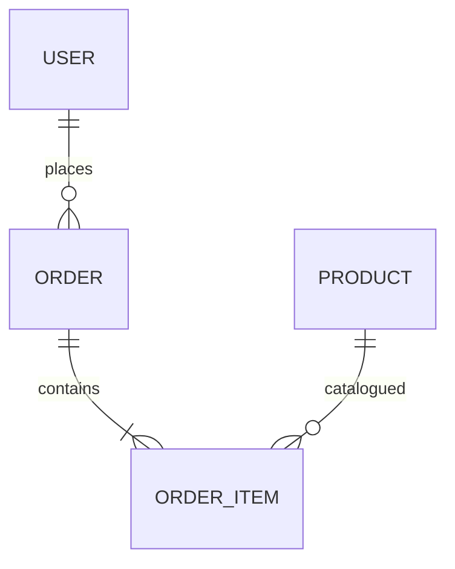

# Schema Playbook — dataModel

Propósito: describir entidades, atributos y relaciones a nivel lógico (ERD/UML).

Ubicación: `schemas/master_blueprint_parts/dataModel.json`

Claves:
- `diagram.type`: ERD | UML Class Diagram | Conceptual Model
- `diagram.format`: Mermaid | PlantUML | Image URL | ASCII
- `diagram.source`: script Mermaid/PlantUML o URL

Pasos:
1) Elegir `type` y `format` del diagrama.
2) Escribir `source` (p.ej. Mermaid) representando entidades y relaciones.
3) Alinear nombres y cardinalidades con `dataModelDictionary.json`.

Checklist:
- [ ] Diagrama definido y renderizable.
- [ ] Entidades y relaciones reflejan el diccionario de datos.
- [ ] Consistencia con API (`apiContract`).

Ejemplo Mermaid:

Referencias:
- `schemas/master_blueprint_parts/dataModelDictionary.json`
- `docs/DOC009-DataModel.md`
