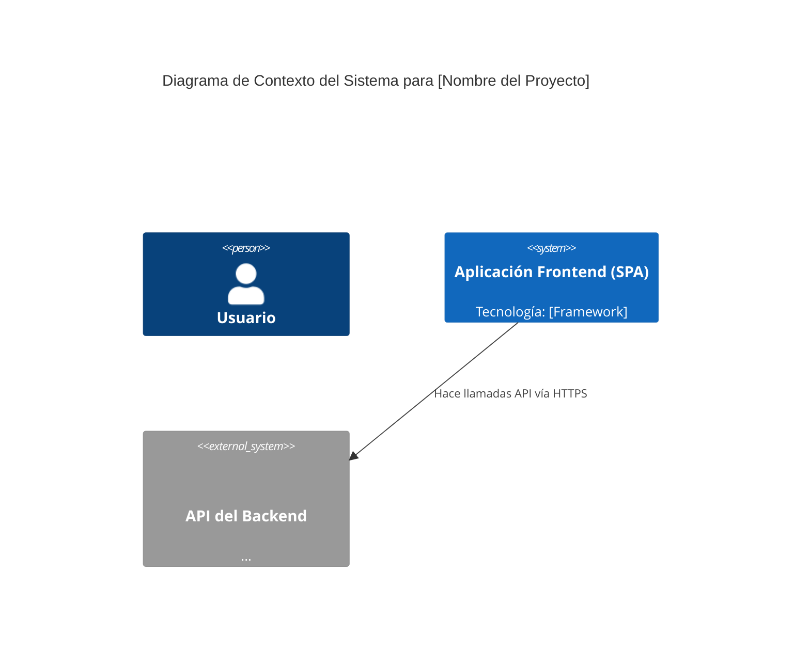
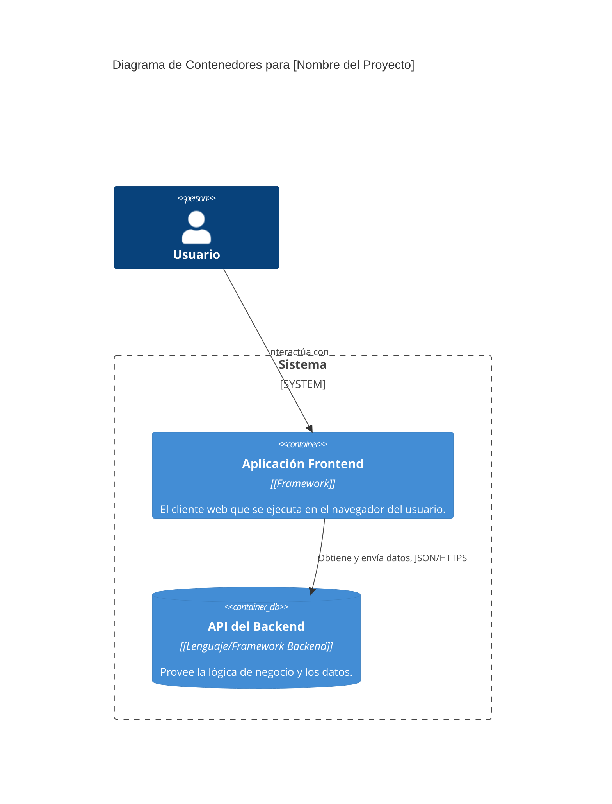

# Plantilla Maestra: Arquitectura del Frontend (Modelo C4)

> **Propósito:** Proporcionar una visión clara y en capas de la arquitectura del frontend, utilizando el Modelo C4 para ilustrar desde la estructura general hasta el nivel de componente.
> **Playbook de Referencia:** `playbook-v2-DOC004-FrontendArchitecture.md`

<!-- 
  INSTRUCCIONES PARA LA IA (System Architect Agent):
  - Tu misión es mantener este documento vivo, reflejando el estado actual de la arquitectura del frontend.
  - Debes generar y actualizar los diagramas Mermaid y el contenido basándote en el `master_blueprint.json`.
-->

## 1. Impulsores y Restricciones Arquitectónicas

[Describe los requisitos clave (ej. Rendimiento, SEO) y las restricciones (ej. presupuesto) que han influido en las decisiones de arquitectura. Extraer de `qualityGoals` y `projectScope.constraints`.]

---

## 2. El Modelo C4

### Nivel 1: Diagrama de Contexto del Sistema

(Muestra el sistema en su ecosistema, interactuando con usuarios y otros sistemas.)



### Nivel 2: Diagrama de Contenedores

(Descompone el sistema en sus contenedores de alto nivel, ej. la SPA, la API, la base de datos.)



### Nivel 3: Diagrama de Componentes

(Descompone el contenedor de la SPA en sus componentes principales.)

```mermaid
C4Component
  title Diagrama de Componentes para la Aplicación Frontend

  Container(spa, "Aplicación Frontend", "[Framework]") {
    Component(router, "Router", "Maneja las rutas de la aplicación")
    Component(state, "Store de Estado Global", "[Librería de Estado]", "Maneja el estado de la aplicación")
    Component(apiClient, "Cliente API", "axios/fetch", "Encapsula la comunicación con el Backend")
    
    Component(pages, "Páginas/Vistas", "Componentes de alto nivel que representan una pantalla")
    Component(components, "Componentes Reutilizables", "Botones, Formularios, etc.")
  }

  Rel(router, pages, "Renderiza")
  Rel(pages, components, "Usa")
  Rel(pages, state, "Lee estado y despacha acciones")
  Rel(state, apiClient, "Ejecuta llamadas a la API")
```

---

## 3. Patrones y Decisiones Clave

-   **Patrón de Arquitectura:** [Ej. SPA, Micro-frontends, desde `architecture.frontend.architecturePattern`]
-   **Framework Principal:** [Ej. React, Vue, desde `architecture.frontend.framework`]
-   **Gestión de Estado:** [Ej. Redux, Zustand, desde `architecture.frontend.stateManagement`]
-   **Estructura de Componentes:** [Ej. Atomic Design, desde `architecture.frontend.componentStructure`]

## 4. Registro de Decisiones de Arquitectura (ADRs)

[Iterar sobre `architecture.decisionLog` para poblar la tabla con ADRs relevantes al frontend.]

| ID ADR | Título de la Decisión | Estado |
| :--- | :--- | :--- |
| `[ADR-XXX]` | `[Título]` | `[Aceptado]` |