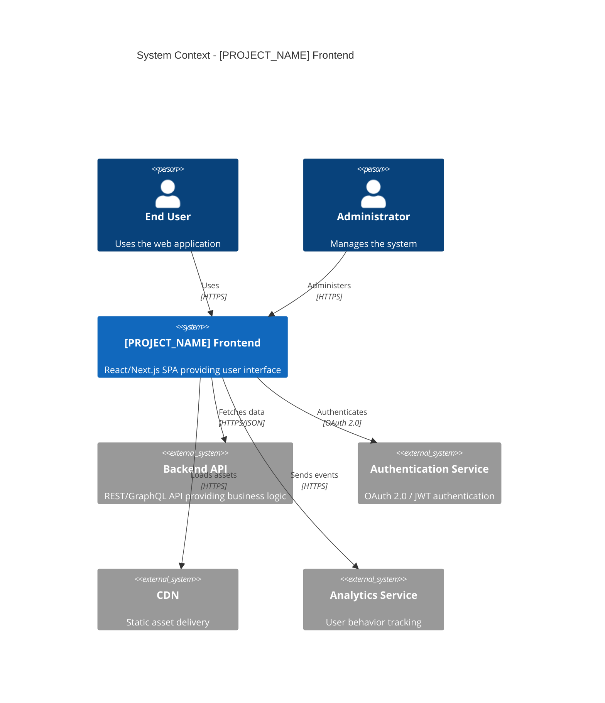
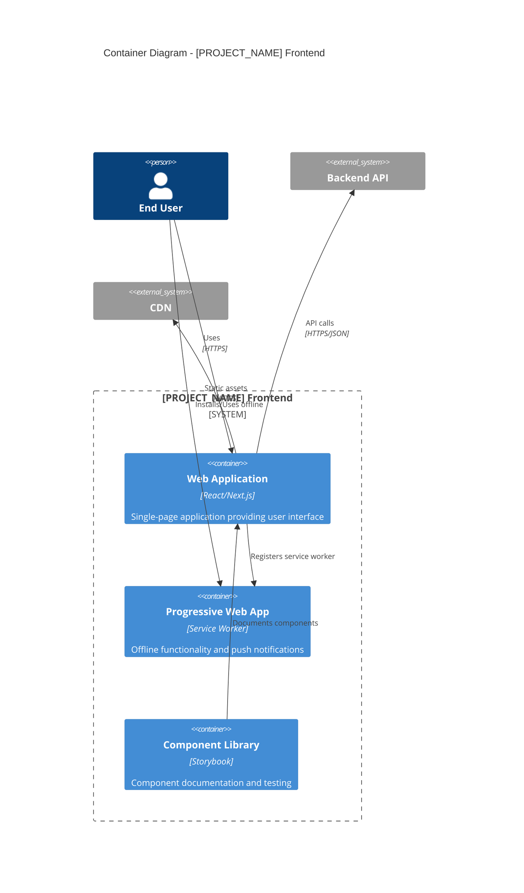
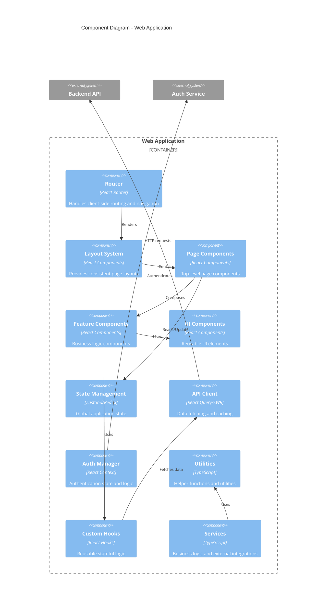

# Frontend Architecture Documentation

> **Purpose:** Comprehensive frontend architecture documentation following 2025 best practices. This document provides clear, layered views of frontend architecture using modern frameworks, performance optimization techniques, and scalable architectural patterns for building exceptional user experiences with React 19, Next.js 15, and cutting-edge web technologies.

**Document Type:** Frontend Architecture Documentation  
**Version:** 3.0  
**Last Updated:** 2025-01-15  
**Template Status:** Production Ready - Enhanced with 2025 Best Practices  

---

## Document Control

| Field | Value |
|-------|-------|
| **Project Name** | [PROJECT_NAME] |
| **Architecture Version** | [VERSION] |
| **Status** | Draft / Review / Live / Deprecated |
| **Frontend Architect** | [ARCHITECT_NAME] |
| **Tech Lead** | [TECH_LEAD_NAME] |
| **Last Updated** | [YYYY-MM-DD] |
| **Next Review** | [YYYY-MM-DD] |
| **Repository** | [GITHUB_REPO_URL] |

---

## 📋 Table of Contents

- [🎯 Architecture Overview](#-architecture-overview)
- [🏗️ Architectural Drivers](#️-architectural-drivers)
- [📐 C4 Model Architecture](#-c4-model-architecture)
- [🔧 Technology Stack](#-technology-stack)
- [🏛️ Architectural Patterns](#️-architectural-patterns)
- [⚡ Performance Strategy](#-performance-strategy)
- [🔒 Security Architecture](#-security-architecture)
- [♿ Accessibility Architecture](#-accessibility-architecture)
- [📱 Responsive Design Strategy](#-responsive-design-strategy)
- [🧪 Testing Architecture](#-testing-architecture)
- [📊 Monitoring & Analytics](#-monitoring--analytics)
- [🚀 Deployment Architecture](#-deployment-architecture)
- [📚 Architecture Decision Records](#-architecture-decision-records)

---

## 🎯 Architecture Overview

### Executive Summary
The frontend architecture for [PROJECT_NAME] is designed to deliver exceptional user experiences through modern frameworks, performance optimization, and scalable architectural patterns. Built with [PRIMARY_FRAMEWORK], the architecture emphasizes performance, maintainability, and developer experience.

### Architecture Philosophy
- **Performance First:** Core Web Vitals optimization with LCP < 2.5s, INP < 200ms, CLS < 0.1
- **Component-Driven:** Atomic design with React 19 Server Components and auto-memoization
- **Progressive Enhancement:** Works across all devices with network-aware optimizations
- **Developer Experience:** Fast development cycles with React Compiler and modern tooling
- **Accessibility First:** WCAG 2.1 AA compliance by design with automated testing
- **"Don't Make Me Wait":** Zero-latency interactions through hybrid rendering strategies

### Key Metrics & Goals (2025 Core Web Vitals)
| Metric | Target | Current | Status |
|--------|--------|---------|--------|
| **Largest Contentful Paint (LCP)** | < 2.5s | [CURRENT] | [STATUS] |
| **Interaction to Next Paint (INP)** | < 200ms | [CURRENT] | [STATUS] |
| **Cumulative Layout Shift (CLS)** | < 0.1 | [CURRENT] | [STATUS] |
| **First Contentful Paint (FCP)** | < 1.8s | [CURRENT] | [STATUS] |
| **Time to First Byte (TTFB)** | < 800ms | [CURRENT] | [STATUS] |
| **Bundle Size (Initial)** | < 200KB | [CURRENT] | [STATUS] |
| **Bundle Size (Total)** | < 1MB | [CURRENT] | [STATUS] |

---

## 🏗️ Architectural Drivers

### Functional Requirements
- **User Experience:** Intuitive, responsive, and accessible interface
- **Performance:** Fast loading and smooth interactions across devices
- **Scalability:** Support for growing user base and feature set
- **Maintainability:** Clean, modular code that's easy to update
- **Cross-Platform:** Consistent experience across browsers and devices

### Quality Attributes

#### Performance Requirements (2025 Standards)
- **Core Web Vitals:** LCP < 2.5s, INP < 200ms, CLS < 0.1 (Google's 2025 thresholds)
- **Runtime Performance:** 60 FPS interactions with React 19 concurrent features
- **Bundle Optimization:** Route-based splitting, React.lazy(), and dynamic imports
- **Caching Strategy:** Stale-while-revalidate (SWR) with Next.js App Router caching
- **Network Awareness:** Adaptive loading based on connection quality

#### Scalability Requirements
- **Component Reusability:** 80%+ component reuse with design system integration
- **Team Scalability:** Micro-frontend architecture for multiple development teams
- **Feature Scalability:** Server Components and streaming for incremental loading
- **Performance Scalability:** Maintains Core Web Vitals as app grows
- **State Management:** Granular state with React 19 use() hook and context optimization

#### Maintainability Requirements
- **Code Quality:** TypeScript 5.x strict mode with React 19 types
- **Documentation:** Living documentation with Storybook 8.x and automated component docs
- **Refactoring Safety:** 80%+ test coverage with React Testing Library and Playwright
- **Dependency Management:** Automated security scanning with Dependabot and npm audit
- **Code Standards:** ESLint 9.x, Prettier 3.x, and React Compiler integration

### Technical Constraints
- **Browser Support:** Modern browsers with ES2022+ support (Chrome 100+, Firefox 100+, Safari 15+, Edge 100+)
- **Device Support:** Desktop, tablet, mobile with responsive design and touch optimization
- **Network Conditions:** Works on 3G networks with offline-first PWA capabilities
- **Accessibility:** WCAG 2.1 AA compliance with automated axe-core testing
- **SEO Requirements:** Server-side rendering with Next.js App Router and metadata API
- **Performance Budget:** Lighthouse scores 90+ across all metrics

### Business Constraints
- **Development Timeline:** [TIMELINE_CONSTRAINT]
- **Team Size:** [TEAM_SIZE] frontend developers
- **Budget:** [BUDGET_CONSTRAINT]
- **Compliance:** [REGULATORY_REQUIREMENTS]
- **Integration:** Must integrate with [EXISTING_SYSTEMS]

---

## 📐 C4 Model Architecture

### Level 1: System Context Diagram

Shows the frontend application in its ecosystem, interacting with users and external systems.



### Level 2: Container Diagram

Decomposes the frontend system into its high-level containers and their interactions.



### Level 3: Component Diagram

Decomposes the web application container into its main components and their relationships.



### Level 4: Code Structure

Detailed view of the codebase organization and module relationships.

```
src/
├── 📁 app/                    # App Router (Next.js 13+)
│   ├── 📁 (auth)/            # Route groups
│   ├── 📁 dashboard/         # Dashboard pages
│   ├── layout.tsx            # Root layout
│   └── page.tsx              # Home page
├── 📁 components/            # Reusable UI components
│   ├── 📁 ui/               # Basic UI elements
│   ├── 📁 forms/            # Form components
│   └── 📁 layout/           # Layout components
├── 📁 features/             # Feature-based modules
│   ├── 📁 auth/             # Authentication feature
│   ├── 📁 dashboard/        # Dashboard feature
│   └── 📁 profile/          # User profile feature
├── 📁 lib/                  # Utilities and configurations
│   ├── 📁 api/              # API client and types
│   ├── 📁 auth/             # Authentication logic
│   ├── 📁 hooks/            # Custom React hooks
│   └── 📁 utils/            # Helper functions
├── 📁 styles/               # Global styles and themes
├── 📁 types/                # TypeScript type definitions
└── 📁 __tests__/            # Test files
```

---

## 🔧 Technology Stack

### Core Framework & Runtime
| Technology | Version | Purpose | Justification |
|------------|---------|---------|---------------|
| **React** | 19.x | Core framework | Server Components, concurrent features, React Compiler auto-optimization |
| **Next.js** | 15.x | Full-stack framework | App Router, Server Actions, built-in optimizations, hybrid rendering |
| **TypeScript** | 5.x | Type safety | Enhanced developer experience, React 19 type improvements |
| **Node.js** | 22.x LTS | Build runtime | Latest LTS with performance improvements and security updates |

### UI & Styling
| Technology | Version | Purpose | Justification |
|------------|---------|---------|---------------|
| **Tailwind CSS** | 4.x | Utility-first CSS | Zero-runtime CSS, excellent DX, design system integration |
| **Shadcn/ui** | Latest | Component library | Accessible, customizable, TypeScript-first components |
| **Framer Motion** | 11.x | Animations | Performant animations with React 19 concurrent features |
| **CSS Modules** | Latest | Component styling | Scoped styles, zero-runtime overhead |

### State Management & Data Fetching
| Technology | Version | Purpose | Justification |
|------------|---------|---------|---------------|
| **React Built-in State** | 19.x | Local state | useState, useReducer, useContext sufficient for most cases |
| **Zustand** | 5.x | Global state | Lightweight, TypeScript-first, minimal boilerplate |
| **TanStack Query** | 5.x | Server state | Stale-while-revalidate, caching, background updates |
| **React Hook Form** | 7.x | Form management | Performant, minimal re-renders, excellent validation |

### Build Tools & Development
| Technology | Version | Purpose | Justification |
|------------|---------|---------|---------------|
| **Turbopack** | Latest | Build system | Next.js 15 default, 10x faster than Webpack |
| **React Compiler** | Latest | Optimization | Automatic memoization, eliminates manual useMemo/useCallback |
| **ESLint** | 9.x | Code linting | React 19 rules, accessibility linting |
| **Prettier** | 3.x | Code formatting | Consistent code style across team |
| **Husky** | 9.x | Git hooks | Pre-commit quality checks and testing |

### Testing & Quality Assurance
| Technology | Version | Purpose | Justification |
|------------|---------|---------|---------------|
| **Vitest** | 2.x | Unit testing | Fast, Vite-powered, excellent React 19 support |
| **React Testing Library** | 16.x | Component testing | User-centric testing, accessibility-focused |
| **Playwright** | 1.x | E2E testing | Cross-browser, reliable, excellent debugging |
| **Storybook** | 8.x | Component development | Visual testing, documentation, design system |

### Performance & Monitoring
| Technology | Version | Purpose | Justification |
|------------|---------|---------|---------------|
| **Vercel Analytics** | Latest | Core Web Vitals monitoring | Real user monitoring, Core Web Vitals tracking |
| **Sentry** | Latest | Error tracking | Performance monitoring, error reporting, user feedback |
| **React DevTools Profiler** | Latest | Performance profiling | Component performance analysis, React 19 optimization |
| **Lighthouse CI** | Latest | Performance auditing | Automated Core Web Vitals testing in CI/CD |

---

## 🏛️ Architectural Patterns

### Primary Architecture Pattern
**Hybrid Rendering with Server Components** - Combines SSR, SSG, ISR, and CSR based on content requirements. React 19 Server Components handle data fetching and rendering on the server, while Client Components manage interactivity. This approach optimizes Core Web Vitals by reducing JavaScript bundle size and improving initial page load performance.

### Component Architecture
**Atomic Design Pattern**
- **Atoms:** Basic UI elements (buttons, inputs, labels)
- **Molecules:** Simple component combinations (form fields, search boxes)
- **Organisms:** Complex UI components (headers, forms, lists)
- **Templates:** Page-level layouts and structures
- **Pages:** Specific instances of templates with real content

### State Management Pattern
**Granular State with React 19 Built-ins + Zustand** - Prioritize React's built-in state management (useState, useReducer, useContext) for local state. Use Zustand only for truly global state that needs to be shared across multiple components. This approach reduces bundle size and leverages React 19's improved state management capabilities.

```typescript
// React built-in state for local component state
function UserProfile({ userId }: { userId: string }) {
  const [userName, setUserName] = useState("");
  const [userStats, setUserStats] = useState(null);
  const [activities, setActivities] = useState([]);
  
  // TanStack Query for server state
  const { data: userData } = useQuery({
    queryKey: ['user', userId],
    queryFn: () => fetchUserData(userId),
    staleTime: 5 * 60 * 1000, // 5 minutes
  });
}

// Zustand for global state (only when necessary)
interface GlobalState {
  theme: 'light' | 'dark';
  user: User | null;
  notifications: Notification[];
}

const useGlobalStore = create<GlobalState>((set) => ({
  theme: 'light',
  user: null,
  notifications: [],
  setTheme: (theme) => set({ theme }),
  setUser: (user) => set({ user }),
}));
```

### Data Flow Pattern
**Unidirectional Data Flow**
1. **Actions** trigger state changes
2. **State** updates trigger component re-renders
3. **Components** dispatch new actions
4. **Side effects** handle async operations

### Routing Pattern
**Next.js App Router with File-based Routing** - Leverages Next.js 15 App Router for file-based routing with layouts, loading states, and error boundaries. Supports parallel routes, intercepting routes, and route groups for complex navigation patterns.

```typescript
// App Router structure
app/
├── layout.tsx                 # Root layout
├── page.tsx                   # Home page
├── loading.tsx                # Global loading UI
├── error.tsx                  # Global error UI
├── not-found.tsx             # 404 page
├── (auth)/                   # Route group
│   ├── login/page.tsx
│   └── register/page.tsx
├── dashboard/
│   ├── layout.tsx            # Dashboard layout
│   ├── page.tsx              # Dashboard home
│   ├── @analytics/           # Parallel route
│   │   └── page.tsx
│   └── settings/
│       └── page.tsx
└── api/                      # API routes
    └── users/
        └── route.ts
```

### Error Handling Pattern
**Error Boundaries + Global Error Handling**
- React Error Boundaries for component-level errors
- Global error handler for unhandled promises
- User-friendly error messages and recovery options
- Automatic error reporting to monitoring service

---

## ⚡ Performance Strategy

### Core Web Vitals Optimization (2025 Standards)

#### Largest Contentful Paint (LCP) < 2.5s
- **Next.js Image Optimization:** Automatic WebP/AVIF conversion, responsive images, lazy loading
- **Server Components:** Render data-heavy components on server to reduce client-side work
- **Critical Resource Preloading:** Preload fonts, critical images, and above-the-fold assets
- **Streaming with Suspense:** Stream page content as it becomes available

#### Interaction to Next Paint (INP) < 200ms (Replaced FID in 2025)
- **React 19 Concurrent Features:** Automatic batching, transitions, and time slicing
- **React Compiler:** Automatic memoization eliminates manual optimization
- **Code Splitting:** Route-based splitting with React.lazy() and dynamic imports
- **Event Handler Optimization:** Debounce expensive operations, use React 19 transitions

#### Cumulative Layout Shift (CLS) < 0.1
- **Aspect Ratio Containers:** Use CSS aspect-ratio for media containers
- **Font Loading Strategy:** Use next/font for automatic font optimization
- **Skeleton Loading:** Consistent placeholder dimensions for dynamic content
- **Transform-based Animations:** Use CSS transforms and opacity for smooth animations

```typescript
// Example: Optimized component with React 19 features
'use client';

import { Suspense, startTransition } from 'react';
import { useOptimistic } from 'react';

function OptimizedComponent() {
  const [optimisticState, addOptimistic] = useOptimistic(
    state,
    (currentState, optimisticValue) => {
      // Optimistic updates for better perceived performance
      return [...currentState, optimisticValue];
    }
  );

  const handleAction = (formData: FormData) => {
    startTransition(() => {
      addOptimistic(formData.get('value'));
      // Server action call
    });
  };

  return (
    <Suspense fallback={<Skeleton />}>
      {/* Component content */}
    </Suspense>
  );
}
```

### Bundle Optimization Strategy

#### Code Splitting Implementation (2025 Best Practices)
```typescript
// Next.js App Router automatic code splitting
// Each page.tsx is automatically split

// Dynamic imports for heavy components
const HeavyChart = dynamic(() => import('./components/HeavyChart'), {
  loading: () => <ChartSkeleton />,
  ssr: false, // Client-side only if needed
});

// Conditional loading based on user permissions
const AdminPanel = dynamic(() => import('./components/AdminPanel'), {
  loading: () => <AdminSkeleton />,
});

// Feature-based splitting with React 19
const AdvancedFeatures = lazy(() => 
  import('./features/advanced').then(module => ({
    default: module.AdvancedFeatures
  }))
);

// Bundle splitting configuration in next.config.js
const nextConfig = {
  experimental: {
    optimizePackageImports: ['@mui/material', 'lodash'],
  },
  webpack: (config) => {
    config.optimization.splitChunks = {
      chunks: 'all',
      cacheGroups: {
        vendor: {
          test: /[\\/]node_modules[\\/]/,
          name: 'vendors',
          chunks: 'all',
        },
      },
    };
    return config;
  },
};
```

#### Bundle Analysis & Monitoring
- **Webpack Bundle Analyzer:** Regular bundle size analysis
- **Bundle Size Limits:** CI/CD bundle size checks
- **Dependency Auditing:** Regular dependency cleanup
- **Performance Budgets:** Enforce performance constraints

### Caching Strategy

#### Browser Caching
- **Static Assets:** Long-term caching with content hashing
- **API Responses:** Appropriate cache headers
- **Service Worker:** Offline-first caching strategy
- **CDN Integration:** Global edge caching

#### Application-Level Caching (2025 Strategies)
```typescript
// TanStack Query v5 with advanced caching
const queryClient = new QueryClient({
  defaultOptions: {
    queries: {
      staleTime: 5 * 60 * 1000, // 5 minutes
      gcTime: 10 * 60 * 1000, // Garbage collection time (renamed from cacheTime)
      refetchOnWindowFocus: false,
      retry: (failureCount, error) => {
        // Smart retry logic
        if (error.status === 404) return false;
        return failureCount < 3;
      },
    },
  },
});

// Next.js App Router caching strategies
// Static data caching
async function getStaticData() {
  const res = await fetch('https://api.example.com/data', {
    next: { revalidate: 3600 }, // Revalidate every hour
  });
  return res.json();
}

// Dynamic data with SWR pattern
async function getDynamicData() {
  const res = await fetch('https://api.example.com/dynamic', {
    next: { revalidate: 0 }, // Always fresh
  });
  return res.json();
}

// Client-side caching with React 19 use() hook
function DataComponent() {
  const data = use(fetchData()); // Automatic caching and suspense
  return <div>{data.content}</div>;
}
```

### Performance Monitoring (2025 Approach)
- **Real User Monitoring (RUM):** Vercel Analytics for Core Web Vitals tracking
- **React DevTools Profiler:** Component-level performance analysis with React 19 features
- **Lighthouse CI:** Automated Core Web Vitals testing in CI/CD pipeline
- **Performance Budgets:** Bundle size limits and Core Web Vitals thresholds
- **React Scan:** Identify slow components and unnecessary re-renders
- **Web Vitals Library:** Custom Core Web Vitals tracking and reporting

```typescript
// Custom Core Web Vitals tracking
import { getCLS, getFID, getFCP, getLCP, getTTFB } from 'web-vitals';

function sendToAnalytics(metric) {
  // Send to your analytics service
  analytics.track('Core Web Vital', {
    name: metric.name,
    value: metric.value,
    id: metric.id,
  });
}

// Track all Core Web Vitals
getCLS(sendToAnalytics);
getFID(sendToAnalytics); // Will be replaced by INP
getFCP(sendToAnalytics);
getLCP(sendToAnalytics);
getTTFB(sendToAnalytics);
```

---

## 🔒 Security Architecture

### Authentication & Authorization
- **Authentication Method:** [AUTH_METHOD]
- **Token Management:** Secure token storage and refresh
- **Role-Based Access Control:** Fine-grained permissions
- **Session Management:** Secure session handling

### Content Security Policy (CSP)
```http
Content-Security-Policy: 
  default-src 'self';
  script-src 'self' 'unsafe-inline' https://trusted-cdn.com;
  style-src 'self' 'unsafe-inline';
  img-src 'self' data: https:;
  connect-src 'self' https://api.example.com;
```

### Data Protection
- **Input Sanitization:** XSS prevention
- **CSRF Protection:** Anti-CSRF tokens
- **Secure Communication:** HTTPS everywhere
- **Sensitive Data:** No sensitive data in client-side code

### Dependency Security
- **Vulnerability Scanning:** Automated dependency auditing
- **Regular Updates:** Keep dependencies current
- **License Compliance:** Track and validate licenses
- **Supply Chain Security:** Verify package integrity

---

## ♿ Accessibility Architecture

### WCAG 2.1 AA Compliance (2025 Standards)
- **Perceivable:** Alt text, 4.5:1 color contrast, responsive text scaling up to 200%
- **Operable:** Full keyboard navigation, focus management, no seizure-inducing content
- **Understandable:** Clear language, consistent navigation, error identification
- **Robust:** Semantic HTML5, ARIA attributes, assistive technology compatibility
- **Automated Testing:** axe-core integration in CI/CD pipeline
- **Manual Testing:** Screen reader testing with NVDA, JAWS, and VoiceOver

### Implementation Strategy (2025 Best Practices)
```typescript
// Accessibility-first component with TypeScript and React 19
interface ButtonProps extends React.ButtonHTMLAttributes<HTMLButtonElement> {
  variant?: 'primary' | 'secondary' | 'danger';
  size?: 'sm' | 'md' | 'lg';
  loading?: boolean;
  children: React.ReactNode;
}

const Button = forwardRef<HTMLButtonElement, ButtonProps>(
  ({ children, variant = 'primary', size = 'md', loading, disabled, ...props }, ref) => {
    return (
      <button
        ref={ref}
        className={cn(
          'btn',
          `btn-${variant}`,
          `btn-${size}`,
          loading && 'btn-loading'
        )}
        disabled={disabled || loading}
        aria-disabled={disabled || loading}
        aria-describedby={loading ? 'loading-text' : undefined}
        {...props}
      >
        {loading && (
          <>
            <Spinner aria-hidden="true" />
            <span id="loading-text" className="sr-only">
              Loading...
            </span>
          </>
        )}
        {children}
      </button>
    );
  }
);

Button.displayName = 'Button';

// Form component with accessibility features
function AccessibleForm() {
  const [errors, setErrors] = useState<Record<string, string>>({});
  
  return (
    <form role="form" aria-labelledby="form-title">
      <h2 id="form-title">Contact Form</h2>
      
      <div className="form-group">
        <label htmlFor="email" className="required">
          Email Address
        </label>
        <input
          id="email"
          type="email"
          required
          aria-describedby={errors.email ? 'email-error' : 'email-help'}
          aria-invalid={!!errors.email}
        />
        <div id="email-help" className="help-text">
          We'll never share your email with anyone else.
        </div>
        {errors.email && (
          <div id="email-error" className="error-text" role="alert">
            {errors.email}
          </div>
        )}
      </div>
    </form>
  );
}
```

### Testing & Validation (2025 Approach)
- **Automated Testing:** axe-core with @axe-core/react, eslint-plugin-jsx-a11y
- **Component Testing:** React Testing Library with accessibility queries
- **E2E Testing:** Playwright with accessibility assertions
- **Manual Testing:** Screen reader testing (NVDA, JAWS, VoiceOver, TalkBack)
- **User Testing:** Testing with disabled users and accessibility consultants
- **Compliance Auditing:** Regular WCAG 2.1 AA audits with automated tools

```typescript
// Accessibility testing examples
import { render, screen } from '@testing-library/react';
import { axe, toHaveNoViolations } from 'jest-axe';

expect.extend(toHaveNoViolations);

describe('Button Component Accessibility', () => {
  it('should not have accessibility violations', async () => {
    const { container } = render(
      <Button onClick={() => {}}>Click me</Button>
    );
    const results = await axe(container);
    expect(results).toHaveNoViolations();
  });

  it('should be accessible via keyboard', () => {
    render(<Button onClick={() => {}}>Click me</Button>);
    const button = screen.getByRole('button', { name: /click me/i });
    
    button.focus();
    expect(button).toHaveFocus();
    
    fireEvent.keyDown(button, { key: 'Enter' });
    // Assert button action was triggered
  });

  it('should have proper ARIA attributes when loading', () => {
    render(<Button loading>Submit</Button>);
    const button = screen.getByRole('button');
    
    expect(button).toHaveAttribute('aria-disabled', 'true');
    expect(button).toHaveAttribute('aria-describedby');
  });
});
```

---

## 📱 Responsive Design Strategy

### Breakpoint System
```css
/* Mobile-first responsive breakpoints */
:root {
  --breakpoint-sm: 640px;   /* Small devices */
  --breakpoint-md: 768px;   /* Medium devices */
  --breakpoint-lg: 1024px;  /* Large devices */
  --breakpoint-xl: 1280px;  /* Extra large devices */
}
```

### Layout Strategy
- **Mobile-First:** Design for mobile, enhance for desktop
- **Flexible Grids:** CSS Grid and Flexbox layouts
- **Fluid Typography:** Responsive font scaling
- **Touch-Friendly:** Minimum 44px touch targets

### Performance Considerations
- **Responsive Images:** Multiple image sizes and formats
- **Conditional Loading:** Load desktop features only on desktop
- **Network-Aware:** Adapt to connection quality
- **Device Capabilities:** Leverage device-specific features

---

## 🧪 Testing Architecture

### Testing Strategy (2025 Best Practices)
- **Unit Tests:** Component testing with Vitest and React Testing Library
- **Integration Tests:** Feature testing with React 19 Server Components
- **End-to-End Tests:** Critical user journeys with Playwright
- **Visual Regression Tests:** Storybook visual testing and Chromatic
- **Accessibility Tests:** Automated axe-core testing in all test levels
- **Performance Tests:** Core Web Vitals testing in CI/CD pipeline

### Testing Implementation (2025 Standards)
```typescript
// Vitest + React Testing Library with React 19 support
import { describe, it, expect, vi } from 'vitest';
import { render, screen, fireEvent, waitFor } from '@testing-library/react';
import userEvent from '@testing-library/user-event';
import { axe, toHaveNoViolations } from 'jest-axe';

expect.extend(toHaveNoViolations);

describe('Button Component', () => {
  it('renders with correct text and is accessible', async () => {
    const { container } = render(<Button>Click me</Button>);
    
    // Test content
    expect(screen.getByRole('button', { name: /click me/i })).toBeInTheDocument();
    
    // Test accessibility
    const results = await axe(container);
    expect(results).toHaveNoViolations();
  });

  it('handles user interactions correctly', async () => {
    const user = userEvent.setup();
    const handleClick = vi.fn();
    
    render(<Button onClick={handleClick}>Click me</Button>);
    
    const button = screen.getByRole('button', { name: /click me/i });
    
    // Test mouse interaction
    await user.click(button);
    expect(handleClick).toHaveBeenCalledTimes(1);
    
    // Test keyboard interaction
    await user.keyboard('{Enter}');
    expect(handleClick).toHaveBeenCalledTimes(2);
  });

  it('shows loading state correctly', async () => {
    render(<Button loading>Submit</Button>);
    
    const button = screen.getByRole('button');
    expect(button).toBeDisabled();
    expect(button).toHaveAttribute('aria-disabled', 'true');
    expect(screen.getByText('Loading...')).toBeInTheDocument();
  });
});

// Server Component testing
describe('ServerComponent', () => {
  it('renders server-fetched data', async () => {
    // Mock server action
    const mockData = { title: 'Test Title', content: 'Test Content' };
    vi.mocked(fetchData).mockResolvedValue(mockData);
    
    render(await ServerComponent({ id: '1' }));
    
    expect(screen.getByText('Test Title')).toBeInTheDocument();
    expect(screen.getByText('Test Content')).toBeInTheDocument();
  });
});

// E2E testing with Playwright
import { test, expect } from '@playwright/test';

test('user can complete checkout flow', async ({ page }) => {
  await page.goto('/checkout');
  
  // Test Core Web Vitals
  const lcp = await page.evaluate(() => {
    return new Promise((resolve) => {
      new PerformanceObserver((list) => {
        const entries = list.getEntries();
        const lastEntry = entries[entries.length - 1];
        resolve(lastEntry.startTime);
      }).observe({ entryTypes: ['largest-contentful-paint'] });
    });
  });
  
  expect(lcp).toBeLessThan(2500); // LCP < 2.5s
  
  // Test user flow
  await page.fill('[data-testid="email"]', 'user@example.com');
  await page.fill('[data-testid="card-number"]', '4242424242424242');
  await page.click('[data-testid="submit-button"]');
  
  await expect(page.locator('[data-testid="success-message"]')).toBeVisible();
});
```

### Test Coverage Goals (2025 Standards)
- **Unit Tests:** 80%+ code coverage with branch coverage
- **Integration Tests:** All critical user flows and Server Component interactions
- **E2E Tests:** Core business functionality with Core Web Vitals validation
- **Accessibility Tests:** 100% of interactive components with axe-core
- **Visual Regression Tests:** All UI components in Storybook
- **Performance Tests:** Core Web Vitals thresholds in CI/CD pipeline

---

## 📊 Monitoring & Analytics

### Performance Monitoring
- **Core Web Vitals:** LCP, FID, CLS tracking
- **Custom Metrics:** Business-specific performance indicators
- **Error Tracking:** JavaScript error monitoring
- **User Experience:** Real user monitoring (RUM)

### Analytics Implementation (2025 Best Practices)
```typescript
// Privacy-first analytics with Core Web Vitals tracking
import { getCLS, getFID, getFCP, getLCP, getTTFB } from 'web-vitals';

interface AnalyticsEvent {
  name: string;
  properties: Record<string, any>;
  timestamp: string;
  sessionId: string;
  userId?: string;
}

class Analytics {
  private sessionId: string;
  private userId?: string;

  constructor() {
    this.sessionId = crypto.randomUUID();
    this.initCoreWebVitals();
  }

  private initCoreWebVitals() {
    // Track Core Web Vitals
    getCLS((metric) => this.trackWebVital('CLS', metric));
    getFID((metric) => this.trackWebVital('FID', metric));
    getFCP((metric) => this.trackWebVital('FCP', metric));
    getLCP((metric) => this.trackWebVital('LCP', metric));
    getTTFB((metric) => this.trackWebVital('TTFB', metric));
  }

  private trackWebVital(name: string, metric: any) {
    this.track(`Core Web Vital: ${name}`, {
      value: metric.value,
      rating: metric.rating,
      delta: metric.delta,
      id: metric.id,
    });
  }

  track(eventName: string, properties: Record<string, any> = {}) {
    const event: AnalyticsEvent = {
      name: eventName,
      properties: {
        ...properties,
        url: window.location.href,
        referrer: document.referrer,
        viewport: `${window.innerWidth}x${window.innerHeight}`,
        connection: (navigator as any).connection?.effectiveType,
      },
      timestamp: new Date().toISOString(),
      sessionId: this.sessionId,
      userId: this.userId,
    };

    // Send to analytics service (respecting privacy)
    if (this.hasConsent()) {
      this.sendEvent(event);
    }
  }

  private hasConsent(): boolean {
    // Check user consent for analytics
    return localStorage.getItem('analytics-consent') === 'true';
  }

  private async sendEvent(event: AnalyticsEvent) {
    try {
      await fetch('/api/analytics', {
        method: 'POST',
        headers: { 'Content-Type': 'application/json' },
        body: JSON.stringify(event),
      });
    } catch (error) {
      console.error('Analytics error:', error);
    }
  }
}

// Usage in React components
function useAnalytics() {
  const analytics = useMemo(() => new Analytics(), []);
  
  const trackPageView = useCallback((page: string) => {
    analytics.track('Page View', { page });
  }, [analytics]);

  const trackUserAction = useCallback((action: string, properties?: Record<string, any>) => {
    analytics.track('User Action', { action, ...properties });
  }, [analytics]);

  return { trackPageView, trackUserAction };
}
```

### Business Intelligence
- **User Behavior:** Page views, user flows, conversion funnels
- **Feature Usage:** Feature adoption and engagement metrics
- **Performance Impact:** Correlation between performance and business metrics
- **A/B Testing:** Experiment tracking and analysis

---

## 🚀 Deployment Architecture

### Build & Deployment Pipeline (2025 Standards)
1. **Code Commit** → Trigger CI/CD pipeline with GitHub Actions
2. **Quality Checks** → ESLint 9.x, Prettier, TypeScript, accessibility linting
3. **Testing** → Vitest unit tests, Playwright E2E tests, accessibility tests
4. **Build Process** → Turbopack optimization, React Compiler, bundle analysis
5. **Performance Audit** → Lighthouse CI with Core Web Vitals validation
6. **Security Scan** → Dependency audit, SAST scanning, container scanning
7. **Deployment** → Preview → Staging → Production with feature flags
8. **Monitoring** → Real-time performance monitoring and error tracking

```yaml
# GitHub Actions workflow example
name: CI/CD Pipeline

on:
  push:
    branches: [main, develop]
  pull_request:
    branches: [main]

jobs:
  quality:
    runs-on: ubuntu-latest
    steps:
      - uses: actions/checkout@v4
      - uses: actions/setup-node@v4
        with:
          node-version: '22'
          cache: 'npm'
      
      - run: npm ci
      - run: npm run lint
      - run: npm run type-check
      - run: npm run test:unit
      - run: npm run test:a11y

  performance:
    runs-on: ubuntu-latest
    steps:
      - uses: actions/checkout@v4
      - run: npm ci
      - run: npm run build
      - run: npm run lighthouse-ci
      
  e2e:
    runs-on: ubuntu-latest
    steps:
      - uses: actions/checkout@v4
      - run: npm ci
      - run: npx playwright install
      - run: npm run test:e2e

  deploy:
    needs: [quality, performance, e2e]
    runs-on: ubuntu-latest
    if: github.ref == 'refs/heads/main'
    steps:
      - run: npm run deploy
```

### Environment Strategy
| Environment | Purpose | Deployment Trigger | URL |
|-------------|---------|-------------------|-----|
| **Development** | Local development | Manual | localhost:3000 |
| **Preview** | Feature previews | Pull requests | [PREVIEW_URL] |
| **Staging** | Pre-production testing | Merge to develop | [STAGING_URL] |
| **Production** | Live application | Merge to main | [PRODUCTION_URL] |

### Infrastructure (2025 Stack)
- **Hosting Platform:** Vercel with Edge Runtime and global deployment
- **CDN:** Vercel Edge Network with automatic optimization
- **Domain Management:** Vercel Domains with automatic SSL/TLS
- **Database:** Vercel Postgres or PlanetScale for serverless scaling
- **File Storage:** Vercel Blob for optimized asset delivery
- **Monitoring:** Vercel Analytics + Sentry for comprehensive observability

---

## 📚 Architecture Decision Records

### ADR Index

| ADR ID | Title | Status | Date | Impact |
|--------|-------|--------|------|--------|
| [ADR-001] | [DECISION_TITLE] | Accepted | [DATE] | [IMPACT_LEVEL] |
| [ADR-002] | [DECISION_TITLE] | Accepted | [DATE] | [IMPACT_LEVEL] |
| [ADR-003] | [DECISION_TITLE] | Proposed | [DATE] | [IMPACT_LEVEL] |

### Recent Architectural Decisions

#### ADR-001: [RECENT_DECISION_TITLE]
**Status:** Accepted  
**Date:** [DATE]  
**Context:** [DECISION_CONTEXT]  
**Decision:** [DECISION_MADE]  
**Consequences:** [POSITIVE_AND_NEGATIVE_CONSEQUENCES]

#### ADR-002: [ANOTHER_DECISION_TITLE]
**Status:** Accepted  
**Date:** [DATE]  
**Context:** [DECISION_CONTEXT]  
**Decision:** [DECISION_MADE]  
**Consequences:** [POSITIVE_AND_NEGATIVE_CONSEQUENCES]

### Pending Decisions
- **[PENDING_DECISION_1]:** [BRIEF_DESCRIPTION]
- **[PENDING_DECISION_2]:** [BRIEF_DESCRIPTION]

---

## Architecture Evolution

### Current Architecture Maturity
- **Level:** 4/5 (Advanced) - Modern React 19 + Next.js 15 architecture
- **Strengths:** 
  - React 19 Server Components and concurrent features
  - Excellent Core Web Vitals performance
  - Comprehensive accessibility compliance
  - Strong TypeScript integration
  - Automated testing and quality assurance
- **Areas for Improvement:** 
  - Micro-frontend architecture for larger teams
  - Advanced performance monitoring and alerting
  - Enhanced security scanning and compliance
  - AI-powered code optimization and suggestions

### Planned Improvements
1. **Short-term (1-3 months):** 
   - Implement React 19 use() hook for data fetching
   - Upgrade to Next.js 15 with Turbopack
   - Enhance Core Web Vitals monitoring
   - Add React Compiler for automatic optimization

2. **Medium-term (3-6 months):** 
   - Implement micro-frontend architecture
   - Add advanced performance budgets
   - Enhance accessibility testing automation
   - Implement progressive web app features

3. **Long-term (6+ months):** 
   - Explore React Server Components streaming
   - Implement AI-powered code optimization
   - Add advanced security scanning
   - Evaluate emerging web technologies

### Technology Roadmap
- **Framework Updates:** 
  - React 19 stable release adoption
  - Next.js 15 with Turbopack and enhanced App Router
  - TypeScript 5.x with improved React integration
  
- **New Technologies:** 
  - React Compiler for automatic optimization
  - Web Components integration
  - WebAssembly for performance-critical operations
  - Edge computing with Vercel Edge Runtime
  
- **Deprecations:** 
  - Legacy class components (if any remaining)
  - Manual memoization (replaced by React Compiler)
  - First Input Delay (FID) metric (replaced by INP)
  - Webpack (replaced by Turbopack)

---

**Document Information:**
- **Template Version:** 3.0 - Enhanced with 2025 Best Practices
- **Last Updated:** 2025-01-15
- **Compatibility:** React 19, Next.js 15, and cutting-edge 2025 web technologies
- **Standards:** C4 Model, Core Web Vitals optimization, WCAG 2.1 AA compliance
- **Review Cycle:** Quarterly or as needed for major architectural changes
- **Research Sources:** Strapi React/Next.js 2025 guide, Core Web Vitals updates, C4 Model documentation