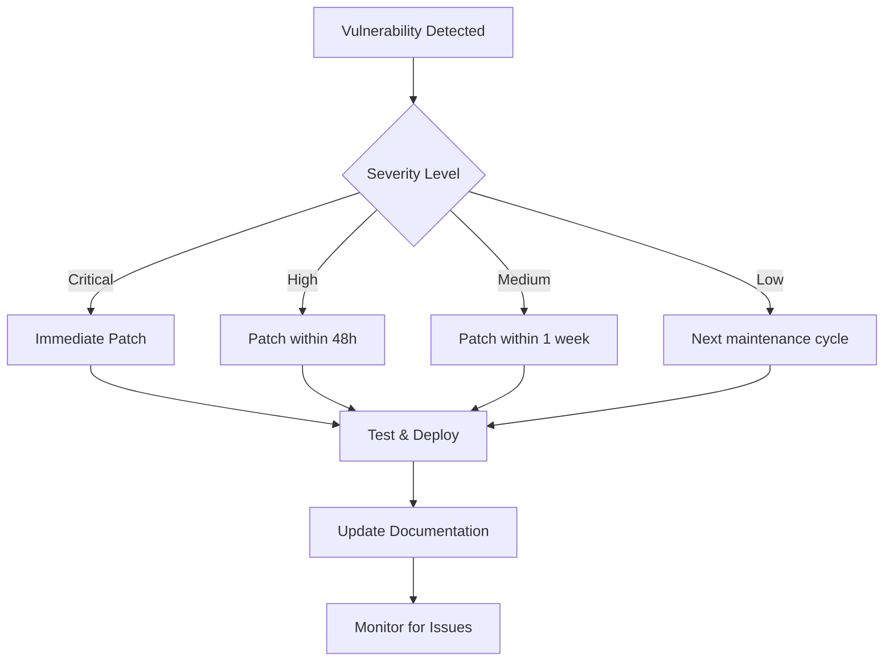
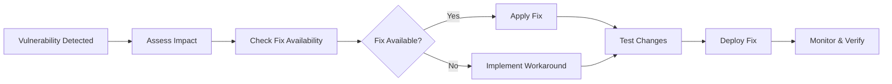

# Frontend Dependencies Management Documentation

> **Purpose:** Comprehensive frontend dependency management documentation following 2025 best practices. This document provides systematic approaches to dependency security, performance optimization, license compliance, and supply chain protection for modern web applications.

**Document Type:** Frontend Dependencies Management  
**Version:** 3.0  
**Last Updated:** 2025-01-15  
**Template Status:** Production Ready - Enhanced with 2025 Best Practices

---

## Document Control

| Field | Value |
|-------|-------|
| **Project Name** | [PROJECT_NAME] |
| **Package Manager** | [npm/yarn/pnpm] |
| **Node.js Version** | [NODE_VERSION] |
| **Package Manager Version** | [PACKAGE_MANAGER_VERSION] |
| **Last Security Audit** | [YYYY-MM-DD] |
| **Next Review** | [YYYY-MM-DD] |
| **Dependency Count** | Production: [COUNT] / Development: [COUNT] |

---

## 📋 Table of Contents

- [🎯 Dependency Management Overview](#-dependency-management-overview)
- [📦 Package Manager Configuration](#-package-manager-configuration)
- [🔒 Security Management](#-security-management)
- [📊 Production Dependencies](#-production-dependencies)
- [🛠️ Development Dependencies](#-development-dependencies)
- [⚡ Performance Impact Analysis](#-performance-impact-analysis)
- [📜 License Compliance](#-license-compliance)
- [🔍 Vulnerability Management](#-vulnerability-management)
- [🚀 Automated Dependency Updates](#-automated-dependency-updates)
- [📈 Dependency Health Monitoring](#-dependency-health-monitoring)
- [🔧 Troubleshooting Guide](#-troubleshooting-guide)

---

## 🎯 Dependency Management Overview

### Management Philosophy
- **Security First:** Zero-tolerance for critical vulnerabilities in production
- **Performance Conscious:** Monitor bundle size impact of every dependency
- **License Compliant:** Ensure all dependencies meet legal requirements
- **Supply Chain Secure:** Verify package integrity and maintainer reputation
- **Automated Maintenance:** Leverage tools for continuous dependency health

### Key Metrics & Targets
| Metric | Target | Current | Status |
|--------|--------|---------|--------|
| **Critical Vulnerabilities** | 0 | [CURRENT] | [STATUS] |
| **High Vulnerabilities** | 0 | [CURRENT] | [STATUS] |
| **Bundle Size Impact** | < 500KB total | [CURRENT] | [STATUS] |
| **Outdated Dependencies** | < 10% | [CURRENT] | [STATUS] |
| **License Compliance** | 100% | [CURRENT] | [STATUS] |

### Dependency Categories
- **Core Framework:** React, Next.js, TypeScript
- **UI & Styling:** Component libraries, CSS frameworks
- **State Management:** Global state, server state, form state
- **Development Tools:** Build tools, testing, linting
- **Security Tools:** Vulnerability scanning, audit tools

---

## 📦 Package Manager Configuration

### Package Manager Selection (2025 Recommendation)
**Primary Choice:** npm (Node.js 22.x built-in) with performance optimizations

```json
// .npmrc configuration
registry=https://registry.npmjs.org/
save-exact=true
package-lock=true
audit-level=moderate
fund=false
prefer-offline=true
progress=false
```

### Lock File Management
- **File:** `package-lock.json` (npm) / `yarn.lock` (Yarn) / `pnpm-lock.yaml` (pnpm)
- **Version Control:** Always commit lock files
- **CI/CD:** Use `npm ci` for deterministic installs
- **Security:** Lock files enable vulnerability scanning

### Package.json Best Practices
```json
{
  "name": "@organization/project-name",
  "version": "1.0.0",
  "type": "module",
  "engines": {
    "node": ">=22.0.0",
    "npm": ">=10.0.0"
  },
  "packageManager": "npm@10.0.0",
  "scripts": {
    "audit": "npm audit --audit-level=moderate",
    "audit:fix": "npm audit fix",
    "outdated": "npm outdated",
    "update:check": "npx npm-check-updates",
    "licenses": "npx license-checker --summary"
  },
  "dependencies": {},
  "devDependencies": {},
  "peerDependencies": {},
  "overrides": {}
}
```

---

## 🔒 Security Management

### Security Audit Process
1. **Daily Automated Scans:** CI/CD pipeline integration
2. **Weekly Manual Reviews:** Comprehensive dependency analysis
3. **Immediate Response:** Critical vulnerability patches within 24 hours
4. **Quarterly Deep Audits:** Full supply chain security review

### Security Tools Integration
```bash
# npm built-in security audit
npm audit --audit-level=moderate

# Enhanced security scanning with Snyk
npx snyk test
npx snyk monitor

# Supply chain security with Socket
npx @socketsecurity/cli scan

# License compliance check
npx license-checker --summary
```

### Vulnerability Response Workflow


### Security Configuration
```json
// package.json security settings
{
  "scripts": {
    "preinstall": "npx audit-ci --config audit-ci.json",
    "postinstall": "npm audit --audit-level=moderate"
  },
  "audit-ci": {
    "moderate": true,
    "high": true,
    "critical": true,
    "allowlist": []
  }
}
```

---

## 📊 Production Dependencies

### Core Framework Dependencies
| Package | Version | License | Bundle Impact | Security Status | Last Updated |
|---------|---------|---------|---------------|-----------------|--------------|
| **react** | ^19.0.0 | MIT | 45KB | ✅ Secure | [DATE] |
| **next** | ^15.0.0 | MIT | 280KB | ✅ Secure | [DATE] |
| **typescript** | ^5.0.0 | Apache-2.0 | 0KB (dev-time) | ✅ Secure | [DATE] |

### UI & Styling Dependencies
| Package | Version | License | Bundle Impact | Security Status | Last Updated |
|---------|---------|---------|---------------|-----------------|--------------|
| **@tailwindcss/typography** | ^0.5.0 | MIT | 12KB | ✅ Secure | [DATE] |
| **framer-motion** | ^11.0.0 | MIT | 85KB | ✅ Secure | [DATE] |
| **lucide-react** | ^0.400.0 | ISC | 15KB | ✅ Secure | [DATE] |

### State Management Dependencies
| Package | Version | License | Bundle Impact | Security Status | Last Updated |
|---------|---------|---------|---------------|-----------------|--------------|
| **zustand** | ^5.0.0 | MIT | 8KB | ✅ Secure | [DATE] |
| **@tanstack/react-query** | ^5.0.0 | MIT | 45KB | ✅ Secure | [DATE] |
| **react-hook-form** | ^7.0.0 | MIT | 25KB | ✅ Secure | [DATE] |

### Utility Dependencies
| Package | Version | License | Bundle Impact | Security Status | Last Updated |
|---------|---------|---------|---------------|-----------------|--------------|
| **clsx** | ^2.0.0 | MIT | 1KB | ✅ Secure | [DATE] |
| **date-fns** | ^3.0.0 | MIT | 20KB | ✅ Secure | [DATE] |
| **zod** | ^3.0.0 | MIT | 15KB | ✅ Secure | [DATE] |

### Production Dependencies Summary
- **Total Count:** [COUNT] packages
- **Total Bundle Size:** [SIZE]KB (gzipped)
- **License Distribution:** MIT: [COUNT], Apache-2.0: [COUNT], ISC: [COUNT]
- **Security Status:** [SECURE_COUNT] secure, [VULNERABLE_COUNT] with issues

---

## 🛠️ Development Dependencies

### Build & Development Tools
| Package | Version | License | Purpose | Security Status | Last Updated |
|---------|---------|---------|---------|-----------------|--------------|
| **@types/react** | ^19.0.0 | MIT | TypeScript types | ✅ Secure | [DATE] |
| **@types/node** | ^22.0.0 | MIT | Node.js types | ✅ Secure | [DATE] |
| **eslint** | ^9.0.0 | MIT | Code linting | ✅ Secure | [DATE] |
| **prettier** | ^3.0.0 | MIT | Code formatting | ✅ Secure | [DATE] |
| **typescript** | ^5.0.0 | Apache-2.0 | Type checking | ✅ Secure | [DATE] |

### Testing Dependencies
| Package | Version | License | Purpose | Security Status | Last Updated |
|---------|---------|---------|---------|-----------------|--------------|
| **vitest** | ^2.0.0 | MIT | Unit testing | ✅ Secure | [DATE] |
| **@testing-library/react** | ^16.0.0 | MIT | Component testing | ✅ Secure | [DATE] |
| **@playwright/test** | ^1.0.0 | Apache-2.0 | E2E testing | ✅ Secure | [DATE] |
| **jest-axe** | ^9.0.0 | MIT | Accessibility testing | ✅ Secure | [DATE] |

### Security & Quality Tools
| Package | Version | License | Purpose | Security Status | Last Updated |
|---------|---------|---------|---------|-----------------|--------------|
| **husky** | ^9.0.0 | MIT | Git hooks | ✅ Secure | [DATE] |
| **lint-staged** | ^15.0.0 | MIT | Staged file linting | ✅ Secure | [DATE] |
| **@commitlint/cli** | ^19.0.0 | MIT | Commit linting | ✅ Secure | [DATE] |

### Development Dependencies Summary
- **Total Count:** [COUNT] packages
- **License Distribution:** MIT: [COUNT], Apache-2.0: [COUNT]
- **Security Status:** [SECURE_COUNT] secure, [VULNERABLE_COUNT] with issues
- **Purpose Distribution:** Build: [COUNT], Testing: [COUNT], Quality: [COUNT]

---

## ⚡ Performance Impact Analysis

### Bundle Size Analysis
```bash
# Analyze bundle composition
npx webpack-bundle-analyzer build/static/js/*.js

# Check package sizes before installing
npx bundlephobia [package-name]

# Analyze dependency tree
npm ls --depth=0
```

### Performance Metrics
| Category | Target | Current | Status |
|----------|--------|---------|--------|
| **Initial Bundle** | < 200KB | [CURRENT] | [STATUS] |
| **Total Bundle** | < 1MB | [CURRENT] | [STATUS] |
| **Dependency Count** | < 50 | [CURRENT] | [STATUS] |
| **Tree Shaking Efficiency** | > 80% | [CURRENT] | [STATUS] |

### Large Dependencies Monitoring
| Package | Size (gzipped) | Justification | Alternatives Considered |
|---------|----------------|---------------|------------------------|
| [PACKAGE_NAME] | [SIZE]KB | [JUSTIFICATION] | [ALTERNATIVES] |

### Bundle Optimization Strategies
- **Code Splitting:** Dynamic imports for large dependencies
- **Tree Shaking:** Import only used functions
- **Bundle Analysis:** Regular size monitoring
- **Alternative Evaluation:** Lighter alternatives for heavy packages

---

## 📜 License Compliance

### License Categories
| License Type | Count | Risk Level | Commercial Use | Copyleft |
|--------------|-------|------------|----------------|----------|
| **MIT** | [COUNT] | Low | ✅ Allowed | ❌ No |
| **Apache-2.0** | [COUNT] | Low | ✅ Allowed | ❌ No |
| **ISC** | [COUNT] | Low | ✅ Allowed | ❌ No |
| **BSD-3-Clause** | [COUNT] | Low | ✅ Allowed | ❌ No |
| **GPL-3.0** | [COUNT] | High | ⚠️ Restricted | ✅ Yes |

### License Compliance Tools
```bash
# Generate license report
npx license-checker --summary --out licenses.json

# Check for problematic licenses
npx license-checker --failOn 'GPL-3.0;AGPL-3.0'

# Generate attribution file
npx license-checker --customPath license-format.json > ATTRIBUTIONS.md
```

### Compliance Workflow
1. **Pre-installation:** License check before adding dependencies
2. **Automated Scanning:** CI/CD license validation
3. **Legal Review:** Quarterly legal team review
4. **Documentation:** Maintain attribution files

---

## 🔍 Vulnerability Management

### Current Vulnerability Status
```bash
# Run comprehensive security audit
npm audit --audit-level=moderate

# Generate detailed vulnerability report
npm audit --json > vulnerability-report.json
```

### Vulnerability Categories
| Severity | Count | Action Required | Timeline |
|----------|-------|-----------------|----------|
| **Critical** | [COUNT] | Immediate patch | < 24 hours |
| **High** | [COUNT] | Priority patch | < 48 hours |
| **Moderate** | [COUNT] | Scheduled patch | < 1 week |
| **Low** | [COUNT] | Next maintenance | Next cycle |

### Vulnerability Response Process


### Security Monitoring Tools
- **npm audit:** Built-in vulnerability scanning
- **Snyk:** Advanced vulnerability management
- **Socket Security:** Supply chain protection
- **GitHub Dependabot:** Automated security updates
- **OWASP Dependency Check:** Open source scanning

---

## 🚀 Automated Dependency Updates

### Update Strategy
- **Security Updates:** Automated with immediate deployment
- **Minor Updates:** Weekly automated updates with testing
- **Major Updates:** Manual review and testing required
- **Breaking Changes:** Planned updates with migration guides

### Automation Tools Configuration
```yaml
# .github/dependabot.yml
version: 2
updates:
  - package-ecosystem: "npm"
    directory: "/"
    schedule:
      interval: "weekly"
      day: "monday"
      time: "09:00"
    open-pull-requests-limit: 10
    reviewers:
      - "frontend-team"
    assignees:
      - "tech-lead"
    commit-message:
      prefix: "deps"
      include: "scope"
```

### Update Workflow
```bash
# Check for outdated packages
npm outdated

# Interactive update tool
npx npm-check-updates --interactive

# Update with testing
npm update && npm test && npm run build
```

### Update Validation Process
1. **Automated Testing:** Full test suite execution
2. **Bundle Analysis:** Size impact assessment
3. **Security Scan:** Vulnerability check post-update
4. **Performance Testing:** Core Web Vitals validation
5. **Manual Review:** Critical dependency changes

---

## 📈 Dependency Health Monitoring

### Health Metrics Dashboard
| Metric | Current | Target | Trend |
|--------|---------|--------|-------|
| **Maintenance Score** | [SCORE]/100 | > 80 | [TREND] |
| **Security Score** | [SCORE]/100 | > 90 | [TREND] |
| **Popularity Score** | [SCORE]/100 | > 70 | [TREND] |
| **Update Frequency** | [DAYS] days | < 30 | [TREND] |

### Monitoring Tools
```bash
# Package health analysis
npx npm-check --update

# Dependency tree analysis
npm ls --depth=2

# Package popularity and maintenance
npx package-quality [package-name]
```

### Health Indicators
- **Last Updated:** How recently the package was updated
- **Download Count:** Weekly npm downloads
- **GitHub Stars:** Community adoption
- **Open Issues:** Unresolved problems
- **Maintainer Activity:** Recent commits and releases

### Risk Assessment Matrix
| Risk Level | Criteria | Action Required |
|------------|----------|-----------------|
| **Low** | Active maintenance, high popularity | Monitor |
| **Medium** | Moderate activity, some issues | Plan replacement |
| **High** | Inactive, security issues | Immediate replacement |
| **Critical** | Abandoned, critical vulnerabilities | Emergency replacement |

---

## 🔧 Troubleshooting Guide

### Common Issues & Solutions

#### Dependency Conflicts
```bash
# Check for conflicting versions
npm ls

# Resolve peer dependency warnings
npm install --legacy-peer-deps

# Clear npm cache
npm cache clean --force
```

#### Security Vulnerabilities
```bash
# Automatic fix for vulnerabilities
npm audit fix

# Force fix with breaking changes
npm audit fix --force

# Manual override for false positives
npm audit --audit-level=high
```

#### Bundle Size Issues
```bash
# Analyze bundle composition
npx webpack-bundle-analyzer build/static/js/*.js

# Find duplicate dependencies
npx duplicate-package-checker-webpack-plugin

# Check package sizes
npx bundlephobia [package-name]
```

#### License Compliance Issues
```bash
# Check for problematic licenses
npx license-checker --failOn 'GPL-3.0;AGPL-3.0'

# Generate compliance report
npx license-checker --summary --csv > licenses.csv
```

### Emergency Procedures

#### Critical Vulnerability Response
1. **Immediate Assessment:** Determine exploit risk
2. **Temporary Mitigation:** Implement workarounds
3. **Patch Application:** Update vulnerable packages
4. **Testing & Validation:** Ensure functionality
5. **Deployment:** Emergency release if necessary
6. **Monitoring:** Watch for issues post-deployment

#### Dependency Failure Recovery
1. **Rollback:** Revert to last known good state
2. **Investigation:** Identify root cause
3. **Alternative Solution:** Find replacement packages
4. **Testing:** Validate alternative approach
5. **Documentation:** Update dependency decisions

---

## Maintenance Schedule

### Daily Tasks
- Automated security scans
- Vulnerability monitoring
- CI/CD dependency checks

### Weekly Tasks
- Dependency update review
- Bundle size analysis
- License compliance check

### Monthly Tasks
- Comprehensive security audit
- Dependency health assessment
- Performance impact review

### Quarterly Tasks
- Full dependency review
- Legal compliance audit
- Technology stack evaluation
- Documentation updates

---

**Document Information:**
- **Template Version:** 3.0 - Enhanced with 2025 Best Practices
- **Last Updated:** 2025-01-15
- **Compatibility:** npm 10.x, Node.js 22.x, modern dependency management
- **Standards:** Security-first approach, automated monitoring, compliance management
- **Review Cycle:** Monthly or as needed for security updates
- **Research Sources:** Snyk npm best practices, OWASP dependency guidelines, npm security documentation