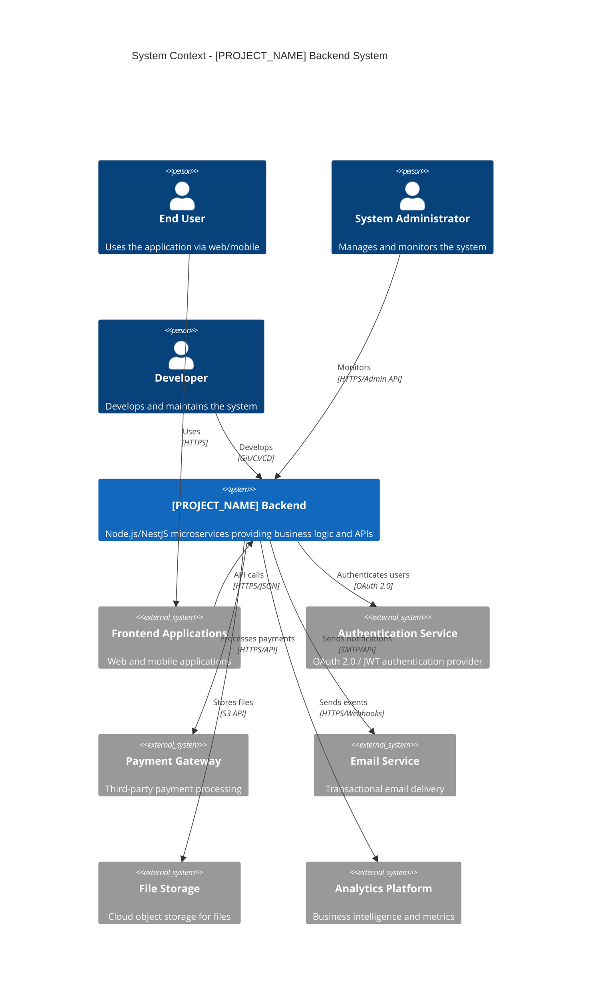
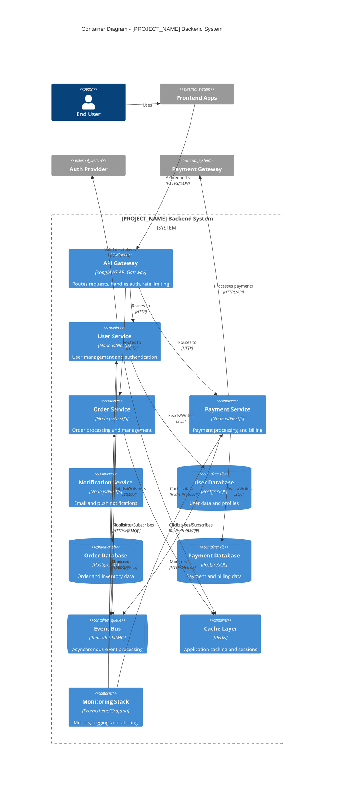
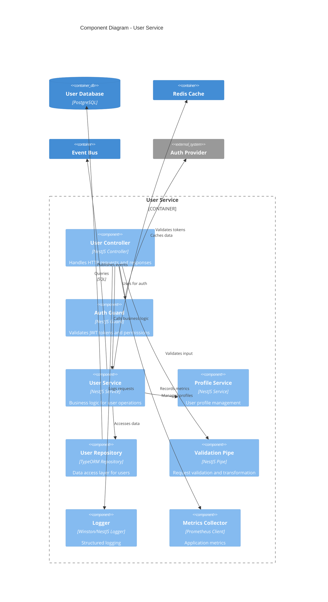

# Backend Architecture Documentation

> **Purpose:** Comprehensive backend architecture documentation following 2025 best practices. This document provides clear, layered views of backend architecture using the C4 Model, modern frameworks, microservices patterns, and cloud-native approaches for building scalable, resilient, and maintainable backend systems.

**Document Type:** Backend Architecture Documentation  
**Version:** 3.0  
**Last Updated:** 2025-01-15  
**Template Status:** Production Ready - Enhanced with 2025 Best Practices

---

## Document Control

| Field | Value |
|-------|-------|
| **Project Name** | [PROJECT_NAME] |
| **Architecture Version** | [VERSION] |
| **Status** | Draft / Review / Live / Deprecated |
| **Backend Architect** | [ARCHITECT_NAME] |
| **Tech Lead** | [TECH_LEAD_NAME] |
| **Last Updated** | [YYYY-MM-DD] |
| **Next Review** | [YYYY-MM-DD] |
| **Repository** | [GITHUB_REPO_URL] |

---

## 📋 Table of Contents

- [🎯 Architecture Overview](#-architecture-overview)
- [🏗️ Architectural Drivers](#️-architectural-drivers)
- [📐 C4 Model Architecture](#-c4-model-architecture)
- [🔧 Technology Stack](#-technology-stack)
- [🏛️ Architectural Patterns](#️-architectural-patterns)
- [⚡ Performance & Scalability](#-performance--scalability)
- [🔒 Security Architecture](#-security-architecture)
- [📊 Data Architecture](#-data-architecture)
- [🌐 API Design](#-api-design)
- [🔄 Event-Driven Architecture](#-event-driven-architecture)
- [☁️ Cloud-Native Architecture](#️-cloud-native-architecture)
- [🧪 Testing Architecture](#-testing-architecture)
- [📈 Monitoring & Observability](#-monitoring--observability)
- [🚀 Deployment Architecture](#-deployment-architecture)
- [📚 Architecture Decision Records](#-architecture-decision-records)

---

## 🎯 Architecture Overview

### Executive Summary
The backend architecture for [PROJECT_NAME] is designed to deliver high-performance, scalable, and maintainable services using modern 2025 best practices. Built with [PRIMARY_FRAMEWORK], the architecture emphasizes cloud-native patterns, microservices design, and event-driven communication.

### Architecture Philosophy
- **Cloud-Native First:** Designed for containerization, orchestration, and serverless deployment
- **Microservices Ready:** Loosely coupled services with clear boundaries and responsibilities
- **Event-Driven:** Asynchronous communication patterns for scalability and resilience
- **API-First:** Well-designed APIs as the foundation for all interactions
- **Security by Design:** Zero-trust security model with defense in depth
- **Observability Built-in:** Comprehensive monitoring, logging, and tracing from day one

### Key Metrics & Goals
| Metric | Target | Current | Status |
|--------|--------|---------|--------|
| **API Response Time (P95)** | < 200ms | [CURRENT] | [STATUS] |
| **System Availability** | 99.9% | [CURRENT] | [STATUS] |
| **Throughput** | 10,000 RPS | [CURRENT] | [STATUS] |
| **Error Rate** | < 0.1% | [CURRENT] | [STATUS] |
| **Mean Time to Recovery** | < 5 minutes | [CURRENT] | [STATUS] |

---

## 🏗️ Architectural Drivers

### Functional Requirements
- **High Performance:** Sub-200ms API response times under normal load
- **Scalability:** Support for 10x traffic growth without architectural changes
- **Reliability:** 99.9% uptime with graceful degradation
- **Security:** Enterprise-grade security with compliance requirements
- **Integration:** Seamless integration with external services and systems

### Quality Attributes

#### Performance Requirements
- **Throughput:** Handle 10,000+ requests per second
- **Latency:** P95 response time < 200ms, P99 < 500ms
- **Concurrency:** Support 50,000+ concurrent connections
- **Resource Efficiency:** Optimal CPU and memory utilization

#### Scalability Requirements
- **Horizontal Scaling:** Auto-scaling based on demand
- **Database Scaling:** Read replicas and sharding strategies
- **Caching:** Multi-layer caching for performance optimization
- **Load Distribution:** Intelligent load balancing and traffic routing

#### Reliability Requirements
- **Fault Tolerance:** Circuit breakers and bulkhead patterns
- **Data Consistency:** ACID transactions where needed, eventual consistency elsewhere
- **Backup & Recovery:** Automated backups with point-in-time recovery
- **Disaster Recovery:** Multi-region deployment with failover capabilities

### Technical Constraints
- **Technology Stack:** [FRAMEWORK_CONSTRAINT] with [DATABASE_CONSTRAINT]
- **Cloud Provider:** [CLOUD_PROVIDER] with specific service requirements
- **Compliance:** [REGULATORY_REQUIREMENTS] (GDPR, SOC2, HIPAA, etc.)
- **Integration:** Must integrate with [EXISTING_SYSTEMS]
- **Performance Budget:** [PERFORMANCE_CONSTRAINTS]

### Business Constraints
- **Development Timeline:** [TIMELINE_CONSTRAINT]
- **Team Size:** [TEAM_SIZE] backend developers
- **Budget:** [BUDGET_CONSTRAINT]
- **Operational Complexity:** [COMPLEXITY_CONSTRAINT]
- **Vendor Dependencies:** [VENDOR_CONSTRAINTS]

---

## 📐 C4 Model Architecture

### Level 1: System Context Diagram

Shows the backend system in its ecosystem, interacting with users, external systems, and services.



### Level 2: Container Diagram

Decomposes the backend system into its high-level containers and their interactions.



### Level 3: Component Diagram

Decomposes a service container into its main components and their relationships.



### Level 4: Code Structure

Detailed view of the codebase organization and module relationships.

```
src/
├── 📁 modules/                 # Feature modules
│   ├── 📁 user/               # User management module
│   │   ├── controllers/       # HTTP controllers
│   │   ├── services/          # Business logic services
│   │   ├── repositories/      # Data access layer
│   │   ├── dto/              # Data transfer objects
│   │   ├── entities/         # Database entities
│   │   └── user.module.ts    # Module definition
│   ├── 📁 order/             # Order management module
│   └── 📁 payment/           # Payment processing module
├── 📁 common/                 # Shared utilities
│   ├── 📁 guards/            # Authentication guards
│   ├── 📁 interceptors/      # Request/response interceptors
│   ├── 📁 pipes/             # Validation pipes
│   ├── 📁 filters/           # Exception filters
│   └── 📁 decorators/        # Custom decorators
├── 📁 config/                # Configuration management
├── 📁 database/              # Database configuration
├── 📁 events/                # Event handling
├── 📁 health/                # Health checks
└── main.ts                   # Application entry point
```

---

## 🔧 Technology Stack

### Core Framework & Runtime
| Technology | Version | Purpose | Justification |
|------------|---------|---------|---------------|
| **Node.js** | 22.x LTS | Runtime environment | Latest LTS with performance improvements and security updates |
| **NestJS** | 10.x | Backend framework | Enterprise-grade, TypeScript-first, modular architecture |
| **TypeScript** | 5.x | Type safety | Enhanced developer experience and code quality |
| **Express** | 4.x | HTTP server | Battle-tested, high-performance web server |

### Database & Storage
| Technology | Version | Purpose | Justification |
|------------|---------|---------|---------------|
| **PostgreSQL** | 16.x | Primary database | ACID compliance, advanced features, excellent performance |
| **Redis** | 7.x | Caching & sessions | High-performance in-memory data store |
| **TypeORM** | 0.3.x | ORM | TypeScript-first ORM with excellent NestJS integration |
| **Prisma** | 5.x | Alternative ORM | Type-safe database client with excellent DX |

### Message Queue & Events
| Technology | Version | Purpose | Justification |
|------------|---------|---------|---------------|
| **RabbitMQ** | 3.x | Message broker | Reliable message queuing with advanced routing |
| **Redis Pub/Sub** | 7.x | Event streaming | Simple pub/sub for real-time events |
| **Apache Kafka** | 3.x | Event streaming | High-throughput event streaming for large scale |

### API & Communication
| Technology | Version | Purpose | Justification |
|------------|---------|---------|---------------|
| **GraphQL** | 16.x | API query language | Flexible, efficient API with strong typing |
| **REST** | - | API architecture | Standard HTTP-based APIs for simplicity |
| **gRPC** | Latest | Service communication | High-performance RPC for service-to-service |
| **WebSocket** | - | Real-time communication | Bidirectional real-time communication |

### Security & Authentication
| Technology | Version | Purpose | Justification |
|------------|---------|---------|---------------|
| **JWT** | Latest | Token-based auth | Stateless authentication with good security |
| **OAuth 2.0** | 2.1 | Authorization framework | Industry standard for secure authorization |
| **Passport.js** | 0.7.x | Authentication middleware | Comprehensive authentication strategies |
| **Helmet** | 7.x | Security headers | HTTP security headers for protection |

### Testing & Quality
| Technology | Version | Purpose | Justification |
|------------|---------|---------|---------------|
| **Jest** | 29.x | Testing framework | Comprehensive testing with excellent TypeScript support |
| **Supertest** | 7.x | HTTP testing | API endpoint testing |
| **TestContainers** | Latest | Integration testing | Real database testing with containers |
| **ESLint** | 9.x | Code linting | Code quality and consistency |

### Monitoring & Observability
| Technology | Version | Purpose | Justification |
|------------|---------|---------|---------------|
| **Prometheus** | Latest | Metrics collection | Industry-standard metrics and monitoring |
| **Grafana** | Latest | Metrics visualization | Powerful dashboards and alerting |
| **Jaeger** | Latest | Distributed tracing | Request tracing across microservices |
| **Winston** | 3.x | Logging | Structured logging with multiple transports |

---

## 🏛️ Architectural Patterns

### Primary Architecture Pattern
**Microservices with Event-Driven Communication** - Services are loosely coupled and communicate through events and APIs. Each service owns its data and business logic, enabling independent development, deployment, and scaling.

### Service Architecture Patterns

#### Domain-Driven Design (DDD)
- **Bounded Contexts:** Clear service boundaries based on business domains
- **Aggregates:** Consistent data models within service boundaries
- **Domain Events:** Business events that trigger cross-service communication
- **Value Objects:** Immutable objects representing business concepts

#### CQRS (Command Query Responsibility Segregation)
```typescript
// Command side - Write operations
@Injectable()
export class CreateUserCommandHandler {
  async execute(command: CreateUserCommand): Promise<User> {
    const user = new User(command.userData);
    await this.userRepository.save(user);
    await this.eventBus.publish(new UserCreatedEvent(user));
    return user;
  }
}

// Query side - Read operations
@Injectable()
export class GetUserQueryHandler {
  async execute(query: GetUserQuery): Promise<UserView> {
    return this.userViewRepository.findById(query.userId);
  }
}
```

#### Event Sourcing
```typescript
@Injectable()
export class UserAggregate {
  private events: DomainEvent[] = [];

  createUser(userData: CreateUserData): void {
    const event = new UserCreatedEvent(userData);
    this.apply(event);
    this.events.push(event);
  }

  private apply(event: DomainEvent): void {
    switch (event.constructor) {
      case UserCreatedEvent:
        this.handleUserCreated(event as UserCreatedEvent);
        break;
    }
  }
}
```

### Communication Patterns

#### Synchronous Communication
- **REST APIs:** For simple request-response patterns
- **GraphQL:** For flexible data fetching
- **gRPC:** For high-performance service-to-service communication

#### Asynchronous Communication
- **Event Bus:** For domain events and loose coupling
- **Message Queues:** For reliable task processing
- **Pub/Sub:** For real-time notifications

### Data Management Patterns

#### Database per Service
Each microservice owns its data and database, ensuring loose coupling and independent scaling.

#### Saga Pattern
```typescript
@Injectable()
export class OrderSaga {
  @SagaStart()
  async handleOrderCreated(event: OrderCreatedEvent): Promise<void> {
    // Step 1: Reserve inventory
    await this.commandBus.execute(new ReserveInventoryCommand(event.orderId));
  }

  @SagaOrchestrationStep()
  async handleInventoryReserved(event: InventoryReservedEvent): Promise<void> {
    // Step 2: Process payment
    await this.commandBus.execute(new ProcessPaymentCommand(event.orderId));
  }

  @SagaOrchestrationStep()
  async handlePaymentFailed(event: PaymentFailedEvent): Promise<void> {
    // Compensate: Release inventory
    await this.commandBus.execute(new ReleaseInventoryCommand(event.orderId));
  }
}
```

---

## ⚡ Performance & Scalability

### Performance Optimization Strategies

#### Caching Strategy
```typescript
@Injectable()
export class UserService {
  @Cacheable('user', 300) // Cache for 5 minutes
  async getUserById(id: string): Promise<User> {
    return this.userRepository.findById(id);
  }

  @CacheEvict('user')
  async updateUser(id: string, data: UpdateUserData): Promise<User> {
    return this.userRepository.update(id, data);
  }
}
```

#### Database Optimization
- **Connection Pooling:** Optimized database connection management
- **Query Optimization:** Indexed queries and query analysis
- **Read Replicas:** Separate read and write operations
- **Database Sharding:** Horizontal partitioning for large datasets

#### API Optimization
```typescript
@Controller('users')
export class UserController {
  @Get()
  @UseInterceptors(CacheInterceptor)
  @CacheTTL(300)
  async getUsers(
    @Query() pagination: PaginationDto,
    @Query() filters: UserFiltersDto
  ): Promise<PaginatedResponse<User>> {
    return this.userService.getUsers(pagination, filters);
  }
}
```

### Scalability Patterns

#### Horizontal Scaling
- **Load Balancing:** Distribute traffic across multiple instances
- **Auto Scaling:** Automatic scaling based on metrics
- **Service Mesh:** Advanced traffic management and observability

#### Vertical Scaling
- **Resource Optimization:** CPU and memory optimization
- **Performance Profiling:** Identify and fix bottlenecks
- **Garbage Collection Tuning:** Node.js GC optimization

### Performance Monitoring
```typescript
@Injectable()
export class MetricsService {
  private readonly httpRequestDuration = new Histogram({
    name: 'http_request_duration_seconds',
    help: 'Duration of HTTP requests in seconds',
    labelNames: ['method', 'route', 'status_code'],
  });

  recordHttpRequest(method: string, route: string, statusCode: number, duration: number): void {
    this.httpRequestDuration
      .labels(method, route, statusCode.toString())
      .observe(duration);
  }
}
```

---

## 🔒 Security Architecture

### Security-First Design Principles
- **Zero Trust:** Never trust, always verify
- **Defense in Depth:** Multiple layers of security
- **Principle of Least Privilege:** Minimal access rights
- **Security by Design:** Security considerations from the start

### Authentication & Authorization
```typescript
@Injectable()
export class JwtAuthGuard implements CanActivate {
  async canActivate(context: ExecutionContext): Promise<boolean> {
    const request = context.switchToHttp().getRequest();
    const token = this.extractTokenFromHeader(request);
    
    if (!token) {
      throw new UnauthorizedException();
    }

    try {
      const payload = await this.jwtService.verifyAsync(token);
      request.user = payload;
      return true;
    } catch {
      throw new UnauthorizedException();
    }
  }
}

@Injectable()
export class RolesGuard implements CanActivate {
  canActivate(context: ExecutionContext): boolean {
    const requiredRoles = this.reflector.getAllAndOverride<Role[]>(ROLES_KEY, [
      context.getHandler(),
      context.getClass(),
    ]);

    if (!requiredRoles) {
      return true;
    }

    const { user } = context.switchToHttp().getRequest();
    return requiredRoles.some((role) => user.roles?.includes(role));
  }
}
```

### Data Protection
```typescript
@Injectable()
export class EncryptionService {
  private readonly algorithm = 'aes-256-gcm';
  private readonly key = Buffer.from(process.env.ENCRYPTION_KEY, 'hex');

  encrypt(text: string): EncryptedData {
    const iv = crypto.randomBytes(16);
    const cipher = crypto.createCipher(this.algorithm, this.key);
    cipher.setAAD(Buffer.from('additional-data'));
    
    let encrypted = cipher.update(text, 'utf8', 'hex');
    encrypted += cipher.final('hex');
    
    const authTag = cipher.getAuthTag();
    
    return {
      encrypted,
      iv: iv.toString('hex'),
      authTag: authTag.toString('hex'),
    };
  }
}
```

### API Security
```typescript
@Controller('api/v1')
@UseGuards(JwtAuthGuard, RateLimitGuard)
@UseInterceptors(SecurityHeadersInterceptor)
export class SecureController {
  @Post('sensitive-operation')
  @Roles(Role.ADMIN)
  @UseGuards(RolesGuard)
  @ApiSecurity('bearer')
  async performSensitiveOperation(
    @Body() data: SensitiveOperationDto,
    @User() user: UserPayload
  ): Promise<OperationResult> {
    // Audit log
    this.auditService.log({
      action: 'SENSITIVE_OPERATION',
      userId: user.id,
      timestamp: new Date(),
      metadata: { operation: data.operation }
    });

    return this.operationService.execute(data, user);
  }
}
```

### Security Monitoring
```typescript
@Injectable()
export class SecurityMonitoringService {
  async detectAnomalousActivity(userId: string, action: string): Promise<void> {
    const recentActions = await this.getRecentActions(userId);
    
    if (this.isAnomalous(recentActions, action)) {
      await this.alertService.sendSecurityAlert({
        type: 'ANOMALOUS_ACTIVITY',
        userId,
        action,
        timestamp: new Date(),
        severity: 'HIGH'
      });
      
      // Temporarily restrict user
      await this.userService.temporaryRestriction(userId);
    }
  }
}
```

---

## 📊 Data Architecture

### Database Design Principles
- **Single Responsibility:** Each service owns its data
- **ACID Compliance:** Strong consistency where needed
- **Eventual Consistency:** Acceptable for cross-service data
- **Data Sovereignty:** Clear data ownership and boundaries

### Data Models
```typescript
@Entity('users')
export class User {
  @PrimaryGeneratedColumn('uuid')
  id: string;

  @Column({ unique: true })
  email: string;

  @Column()
  @Exclude()
  passwordHash: string;

  @Column({ type: 'jsonb' })
  profile: UserProfile;

  @CreateDateColumn()
  createdAt: Date;

  @UpdateDateColumn()
  updatedAt: Date;

  @VersionColumn()
  version: number;
}

@Entity('orders')
export class Order {
  @PrimaryGeneratedColumn('uuid')
  id: string;

  @Column()
  userId: string;

  @Column({ type: 'enum', enum: OrderStatus })
  status: OrderStatus;

  @Column({ type: 'decimal', precision: 10, scale: 2 })
  totalAmount: number;

  @OneToMany(() => OrderItem, item => item.order, { cascade: true })
  items: OrderItem[];

  @CreateDateColumn()
  createdAt: Date;
}
```

### Data Access Patterns
```typescript
@Injectable()
export class UserRepository {
  constructor(
    @InjectRepository(User)
    private readonly repository: Repository<User>,
    private readonly cacheManager: Cache
  ) {}

  async findById(id: string): Promise<User | null> {
    const cacheKey = `user:${id}`;
    const cached = await this.cacheManager.get<User>(cacheKey);
    
    if (cached) {
      return cached;
    }

    const user = await this.repository.findOne({ where: { id } });
    
    if (user) {
      await this.cacheManager.set(cacheKey, user, 300); // 5 minutes
    }

    return user;
  }

  async save(user: User): Promise<User> {
    const saved = await this.repository.save(user);
    await this.cacheManager.del(`user:${saved.id}`);
    return saved;
  }
}
```

### Data Migration Strategy
```typescript
@Migration(1640995200000)
export class CreateUserTable1640995200000 implements MigrationInterface {
  public async up(queryRunner: QueryRunner): Promise<void> {
    await queryRunner.createTable(
      new Table({
        name: 'users',
        columns: [
          {
            name: 'id',
            type: 'uuid',
            isPrimary: true,
            generationStrategy: 'uuid',
            default: 'uuid_generate_v4()',
          },
          {
            name: 'email',
            type: 'varchar',
            isUnique: true,
          },
          {
            name: 'password_hash',
            type: 'varchar',
          },
          {
            name: 'created_at',
            type: 'timestamp',
            default: 'CURRENT_TIMESTAMP',
          },
        ],
      }),
      true
    );
  }

  public async down(queryRunner: QueryRunner): Promise<void> {
    await queryRunner.dropTable('users');
  }
}
```

---

## 🌐 API Design

### RESTful API Design
```typescript
@Controller('api/v1/users')
@ApiTags('Users')
export class UserController {
  @Get()
  @ApiOperation({ summary: 'Get all users' })
  @ApiResponse({ status: 200, description: 'Users retrieved successfully' })
  async getUsers(
    @Query() pagination: PaginationDto,
    @Query() filters: UserFiltersDto
  ): Promise<PaginatedResponse<UserDto>> {
    return this.userService.getUsers(pagination, filters);
  }

  @Get(':id')
  @ApiOperation({ summary: 'Get user by ID' })
  @ApiParam({ name: 'id', description: 'User ID' })
  async getUserById(@Param('id', ParseUUIDPipe) id: string): Promise<UserDto> {
    return this.userService.getUserById(id);
  }

  @Post()
  @ApiOperation({ summary: 'Create new user' })
  @ApiBody({ type: CreateUserDto })
  async createUser(@Body() createUserDto: CreateUserDto): Promise<UserDto> {
    return this.userService.createUser(createUserDto);
  }
}
```

### GraphQL API Design
```typescript
@Resolver(() => User)
export class UserResolver {
  constructor(private readonly userService: UserService) {}

  @Query(() => [User])
  async users(
    @Args('pagination', { nullable: true }) pagination?: PaginationInput,
    @Args('filters', { nullable: true }) filters?: UserFiltersInput
  ): Promise<User[]> {
    return this.userService.getUsers(pagination, filters);
  }

  @Query(() => User)
  async user(@Args('id') id: string): Promise<User> {
    return this.userService.getUserById(id);
  }

  @Mutation(() => User)
  async createUser(@Args('input') input: CreateUserInput): Promise<User> {
    return this.userService.createUser(input);
  }

  @ResolveField(() => [Order])
  async orders(@Parent() user: User): Promise<Order[]> {
    return this.orderService.getOrdersByUserId(user.id);
  }
}
```

### API Versioning Strategy
```typescript
@Controller({ path: 'users', version: '1' })
export class UserV1Controller {
  // V1 implementation
}

@Controller({ path: 'users', version: '2' })
export class UserV2Controller {
  // V2 implementation with breaking changes
}

// Version-specific DTOs
export class CreateUserV1Dto {
  @IsString()
  name: string;

  @IsEmail()
  email: string;
}

export class CreateUserV2Dto extends CreateUserV1Dto {
  @IsOptional()
  @IsString()
  firstName?: string;

  @IsOptional()
  @IsString()
  lastName?: string;
}
```

---

## 🔄 Event-Driven Architecture

### Event Design Patterns
```typescript
// Domain Event
export class UserCreatedEvent implements DomainEvent {
  constructor(
    public readonly userId: string,
    public readonly email: string,
    public readonly timestamp: Date = new Date()
  ) {}
}

// Event Handler
@EventsHandler(UserCreatedEvent)
export class UserCreatedHandler implements IEventHandler<UserCreatedEvent> {
  constructor(
    private readonly emailService: EmailService,
    private readonly analyticsService: AnalyticsService
  ) {}

  async handle(event: UserCreatedEvent): Promise<void> {
    // Send welcome email
    await this.emailService.sendWelcomeEmail(event.email);
    
    // Track user registration
    await this.analyticsService.track('user_registered', {
      userId: event.userId,
      timestamp: event.timestamp,
    });
  }
}
```

### Event Sourcing Implementation
```typescript
@Injectable()
export class EventStore {
  async saveEvents(streamId: string, events: DomainEvent[], expectedVersion: number): Promise<void> {
    const eventData = events.map((event, index) => ({
      streamId,
      eventType: event.constructor.name,
      eventData: JSON.stringify(event),
      version: expectedVersion + index + 1,
      timestamp: new Date(),
    }));

    await this.eventRepository.save(eventData);
  }

  async getEvents(streamId: string, fromVersion?: number): Promise<DomainEvent[]> {
    const events = await this.eventRepository.find({
      where: {
        streamId,
        ...(fromVersion && { version: MoreThan(fromVersion) }),
      },
      order: { version: 'ASC' },
    });

    return events.map(event => this.deserializeEvent(event));
  }
}
```

### Saga Pattern Implementation
```typescript
@Injectable()
export class OrderProcessingSaga {
  @SagaStart()
  async handleOrderCreated(event: OrderCreatedEvent): Promise<void> {
    const sagaId = event.orderId;
    
    // Start the saga
    await this.sagaRepository.create({
      id: sagaId,
      status: SagaStatus.STARTED,
      currentStep: 'INVENTORY_RESERVATION',
      data: { orderId: event.orderId, userId: event.userId },
    });

    // First step: Reserve inventory
    await this.commandBus.execute(
      new ReserveInventoryCommand(event.orderId, event.items)
    );
  }

  @SagaStep('INVENTORY_RESERVATION')
  async handleInventoryReserved(event: InventoryReservedEvent): Promise<void> {
    await this.updateSagaStep(event.orderId, 'PAYMENT_PROCESSING');
    
    // Next step: Process payment
    await this.commandBus.execute(
      new ProcessPaymentCommand(event.orderId, event.amount)
    );
  }

  @SagaCompensation('INVENTORY_RESERVATION')
  async compensateInventoryReservation(sagaId: string): Promise<void> {
    const saga = await this.sagaRepository.findById(sagaId);
    await this.commandBus.execute(
      new ReleaseInventoryCommand(saga.data.orderId)
    );
  }
}
```

---

## ☁️ Cloud-Native Architecture

### Containerization Strategy
```dockerfile
# Multi-stage Dockerfile for Node.js application
FROM node:22-alpine AS builder

WORKDIR /app
COPY package*.json ./
RUN npm ci --only=production && npm cache clean --force

FROM node:22-alpine AS runtime

# Create non-root user
RUN addgroup -g 1001 -S nodejs
RUN adduser -S nestjs -u 1001

WORKDIR /app

# Copy built application
COPY --from=builder --chown=nestjs:nodejs /app/node_modules ./node_modules
COPY --chown=nestjs:nodejs dist ./dist

USER nestjs

EXPOSE 3000

HEALTHCHECK --interval=30s --timeout=3s --start-period=5s --retries=3 \
  CMD curl -f http://localhost:3000/health || exit 1

CMD ["node", "dist/main.js"]
```

### Kubernetes Deployment
```yaml
apiVersion: apps/v1
kind: Deployment
metadata:
  name: user-service
  labels:
    app: user-service
spec:
  replicas: 3
  selector:
    matchLabels:
      app: user-service
  template:
    metadata:
      labels:
        app: user-service
    spec:
      containers:
      - name: user-service
        image: user-service:latest
        ports:
        - containerPort: 3000
        env:
        - name: DATABASE_URL
          valueFrom:
            secretKeyRef:
              name: database-secret
              key: url
        resources:
          requests:
            memory: "256Mi"
            cpu: "250m"
          limits:
            memory: "512Mi"
            cpu: "500m"
        livenessProbe:
          httpGet:
            path: /health
            port: 3000
          initialDelaySeconds: 30
          periodSeconds: 10
        readinessProbe:
          httpGet:
            path: /health/ready
            port: 3000
          initialDelaySeconds: 5
          periodSeconds: 5
---
apiVersion: v1
kind: Service
metadata:
  name: user-service
spec:
  selector:
    app: user-service
  ports:
  - protocol: TCP
    port: 80
    targetPort: 3000
  type: ClusterIP
```

### Service Mesh Integration
```yaml
apiVersion: networking.istio.io/v1alpha3
kind: VirtualService
metadata:
  name: user-service
spec:
  http:
  - match:
    - uri:
        prefix: /api/v1/users
    route:
    - destination:
        host: user-service
        port:
          number: 80
    fault:
      delay:
        percentage:
          value: 0.1
        fixedDelay: 5s
    retries:
      attempts: 3
      perTryTimeout: 2s
```

---

## 🧪 Testing Architecture

### Testing Strategy
```typescript
// Unit Test Example
describe('UserService', () => {
  let service: UserService;
  let repository: Repository<User>;

  beforeEach(async () => {
    const module: TestingModule = await Test.createTestingModule({
      providers: [
        UserService,
        {
          provide: getRepositoryToken(User),
          useClass: Repository,
        },
      ],
    }).compile();

    service = module.get<UserService>(UserService);
    repository = module.get<Repository<User>>(getRepositoryToken(User));
  });

  it('should create a user', async () => {
    const userData = { email: 'test@example.com', name: 'Test User' };
    const expectedUser = { id: '1', ...userData };

    jest.spyOn(repository, 'save').mockResolvedValue(expectedUser as User);

    const result = await service.createUser(userData);

    expect(result).toEqual(expectedUser);
    expect(repository.save).toHaveBeenCalledWith(userData);
  });
});

// Integration Test Example
describe('UserController (e2e)', () => {
  let app: INestApplication;

  beforeEach(async () => {
    const moduleFixture: TestingModule = await Test.createTestingModule({
      imports: [AppModule],
    }).compile();

    app = moduleFixture.createNestApplication();
    await app.init();
  });

  it('/users (POST)', () => {
    return request(app.getHttpServer())
      .post('/users')
      .send({ email: 'test@example.com', name: 'Test User' })
      .expect(201)
      .expect((res) => {
        expect(res.body.email).toBe('test@example.com');
        expect(res.body.id).toBeDefined();
      });
  });
});
```

### Test Database Strategy
```typescript
// Test Container Setup
export class TestDatabaseModule {
  static async forRoot(): Promise<DynamicModule> {
    const container = await new PostgreSqlContainer()
      .withDatabase('testdb')
      .withUsername('testuser')
      .withPassword('testpass')
      .start();

    return {
      module: TestDatabaseModule,
      providers: [
        {
          provide: 'DATABASE_CONNECTION',
          useValue: container.getConnectionUri(),
        },
      ],
      exports: ['DATABASE_CONNECTION'],
    };
  }
}
```

---

## 📈 Monitoring & Observability

### Metrics Collection
```typescript
@Injectable()
export class MetricsService {
  private readonly httpRequestsTotal = new Counter({
    name: 'http_requests_total',
    help: 'Total number of HTTP requests',
    labelNames: ['method', 'route', 'status_code'],
  });

  private readonly httpRequestDuration = new Histogram({
    name: 'http_request_duration_seconds',
    help: 'Duration of HTTP requests in seconds',
    labelNames: ['method', 'route'],
    buckets: [0.1, 0.3, 0.5, 0.7, 1, 3, 5, 7, 10],
  });

  recordHttpRequest(method: string, route: string, statusCode: number, duration: number): void {
    this.httpRequestsTotal.labels(method, route, statusCode.toString()).inc();
    this.httpRequestDuration.labels(method, route).observe(duration);
  }
}
```

### Distributed Tracing
```typescript
@Injectable()
export class TracingService {
  private tracer: Tracer;

  constructor() {
    this.tracer = trace.getTracer('user-service');
  }

  async traceOperation<T>(name: string, operation: () => Promise<T>): Promise<T> {
    const span = this.tracer.startSpan(name);
    
    try {
      const result = await operation();
      span.setStatus({ code: SpanStatusCode.OK });
      return result;
    } catch (error) {
      span.setStatus({
        code: SpanStatusCode.ERROR,
        message: error.message,
      });
      throw error;
    } finally {
      span.end();
    }
  }
}
```

### Health Checks
```typescript
@Controller('health')
export class HealthController {
  constructor(
    private health: HealthCheckService,
    private db: TypeOrmHealthIndicator,
    private redis: RedisHealthIndicator,
  ) {}

  @Get()
  @HealthCheck()
  check() {
    return this.health.check([
      () => this.db.pingCheck('database'),
      () => this.redis.checkHealth('redis'),
    ]);
  }

  @Get('ready')
  @HealthCheck()
  readiness() {
    return this.health.check([
      () => this.db.pingCheck('database'),
      () => this.redis.checkHealth('redis'),
      () => this.checkExternalServices(),
    ]);
  }

  private async checkExternalServices(): Promise<HealthIndicatorResult> {
    // Check external service dependencies
    return { 'external-services': { status: 'up' } };
  }
}
```

---

## 🚀 Deployment Architecture

### CI/CD Pipeline
```yaml
# .github/workflows/deploy.yml
name: Deploy Backend Services

on:
  push:
    branches: [main]
  pull_request:
    branches: [main]

jobs:
  test:
    runs-on: ubuntu-latest
    steps:
      - uses: actions/checkout@v4
      - uses: actions/setup-node@v4
        with:
          node-version: '22'
          cache: 'npm'
      
      - run: npm ci
      - run: npm run lint
      - run: npm run test
      - run: npm run test:e2e

  build:
    needs: test
    runs-on: ubuntu-latest
    steps:
      - uses: actions/checkout@v4
      - uses: docker/build-push-action@v5
        with:
          push: true
          tags: ${{ secrets.REGISTRY }}/user-service:${{ github.sha }}

  deploy:
    needs: build
    runs-on: ubuntu-latest
    if: github.ref == 'refs/heads/main'
    steps:
      - uses: azure/k8s-deploy@v1
        with:
          manifests: |
            k8s/deployment.yaml
            k8s/service.yaml
          images: |
            ${{ secrets.REGISTRY }}/user-service:${{ github.sha }}
```

### Infrastructure as Code
```typescript
// Pulumi infrastructure definition
import * as k8s from "@pulumi/kubernetes";
import * as aws from "@pulumi/aws";

// Create EKS cluster
const cluster = new aws.eks.Cluster("backend-cluster", {
  version: "1.28",
  instanceType: "t3.medium",
  desiredCapacity: 3,
  minSize: 1,
  maxSize: 10,
});

// Deploy user service
const userService = new k8s.apps.v1.Deployment("user-service", {
  metadata: { name: "user-service" },
  spec: {
    replicas: 3,
    selector: { matchLabels: { app: "user-service" } },
    template: {
      metadata: { labels: { app: "user-service" } },
      spec: {
        containers: [{
          name: "user-service",
          image: "user-service:latest",
          ports: [{ containerPort: 3000 }],
          resources: {
            requests: { memory: "256Mi", cpu: "250m" },
            limits: { memory: "512Mi", cpu: "500m" },
          },
        }],
      },
    },
  },
}, { provider: cluster.provider });
```

### Environment Configuration
```typescript
// Configuration management
@Injectable()
export class ConfigService {
  private readonly config: Config;

  constructor() {
    this.config = {
      port: parseInt(process.env.PORT || '3000'),
      database: {
        host: process.env.DB_HOST || 'localhost',
        port: parseInt(process.env.DB_PORT || '5432'),
        username: process.env.DB_USERNAME || 'postgres',
        password: process.env.DB_PASSWORD || 'password',
        database: process.env.DB_NAME || 'app',
      },
      redis: {
        host: process.env.REDIS_HOST || 'localhost',
        port: parseInt(process.env.REDIS_PORT || '6379'),
      },
      jwt: {
        secret: process.env.JWT_SECRET || 'secret',
        expiresIn: process.env.JWT_EXPIRES_IN || '1h',
      },
    };
  }

  get<T extends keyof Config>(key: T): Config[T] {
    return this.config[key];
  }
}
```

---

## 📚 Architecture Decision Records

### ADR Index

| ADR ID | Title | Status | Date | Impact |
|--------|-------|--------|------|--------|
| [ADR-001] | [DECISION_TITLE] | Accepted | [DATE] | [IMPACT_LEVEL] |
| [ADR-002] | [DECISION_TITLE] | Accepted | [DATE] | [IMPACT_LEVEL] |
| [ADR-003] | [DECISION_TITLE] | Proposed | [DATE] | [IMPACT_LEVEL] |

### Recent Architectural Decisions

#### ADR-001: Microservices Architecture with Event-Driven Communication
**Status:** Accepted  
**Date:** [DATE]  
**Context:** Need for scalable, maintainable backend architecture that supports independent team development and deployment.  
**Decision:** Adopt microservices architecture with event-driven communication using NestJS and RabbitMQ.  
**Consequences:** 
- **Positive:** Independent scaling, team autonomy, technology diversity, fault isolation
- **Negative:** Increased complexity, network latency, eventual consistency challenges

#### ADR-002: PostgreSQL as Primary Database with Redis Caching
**Status:** Accepted  
**Date:** [DATE]  
**Context:** Need for reliable, ACID-compliant database with high-performance caching layer.  
**Decision:** Use PostgreSQL for primary data storage with Redis for caching and session management.  
**Consequences:**
- **Positive:** Strong consistency, excellent performance, mature ecosystem
- **Negative:** Additional infrastructure complexity, cache invalidation challenges

#### ADR-003: JWT-based Authentication with OAuth 2.0
**Status:** Accepted  
**Date:** [DATE]  
**Context:** Need for stateless authentication that scales across microservices.  
**Decision:** Implement JWT-based authentication with OAuth 2.0 for third-party integrations.  
**Consequences:**
- **Positive:** Stateless, scalable, standard protocol
- **Negative:** Token management complexity, security considerations

### Pending Decisions
- **[PENDING_DECISION_1]:** [BRIEF_DESCRIPTION]
- **[PENDING_DECISION_2]:** [BRIEF_DESCRIPTION]

---

## Architecture Evolution

### Current Architecture Maturity
- **Level:** 4/5 (Advanced) - Modern microservices with event-driven patterns
- **Strengths:** 
  - Scalable microservices architecture
  - Comprehensive observability and monitoring
  - Strong security implementation
  - Cloud-native deployment patterns
  - Automated testing and CI/CD
- **Areas for Improvement:** 
  - Service mesh implementation
  - Advanced chaos engineering
  - Multi-region deployment
  - AI/ML integration capabilities

### Planned Improvements
1. **Short-term (1-3 months):** 
   - Implement service mesh (Istio)
   - Enhanced monitoring and alerting
   - Performance optimization
   - Security hardening

2. **Medium-term (3-6 months):** 
   - Multi-region deployment
   - Advanced caching strategies
   - Event sourcing implementation
   - Chaos engineering practices

3. **Long-term (6+ months):** 
   - AI/ML integration platform
   - Advanced analytics and insights
   - Edge computing capabilities
   - Next-generation database technologies

### Technology Roadmap
- **Framework Updates:** 
  - NestJS 11.x with enhanced features
  - Node.js 23.x with performance improvements
  - TypeScript 5.x with advanced type features
  
- **New Technologies:** 
  - Service mesh (Istio/Linkerd)
  - Event streaming (Apache Kafka)
  - AI/ML integration (TensorFlow.js)
  - Edge computing capabilities
  
- **Deprecations:** 
  - Legacy REST endpoints (migrate to GraphQL)
  - Monolithic components (split into microservices)
  - Synchronous communication (move to async where possible)

---

**Document Information:**
- **Template Version:** 3.0 - Enhanced with 2025 Best Practices
- **Last Updated:** 2025-01-15
- **Compatibility:** Node.js 22.x, NestJS 10.x, modern backend technologies
- **Standards:** C4 Model, microservices patterns, cloud-native architecture
- **Review Cycle:** Quarterly or as needed for major architectural changes
- **Research Sources:** Backend frameworks 2025 guide, C4 model documentation, microservices best practices