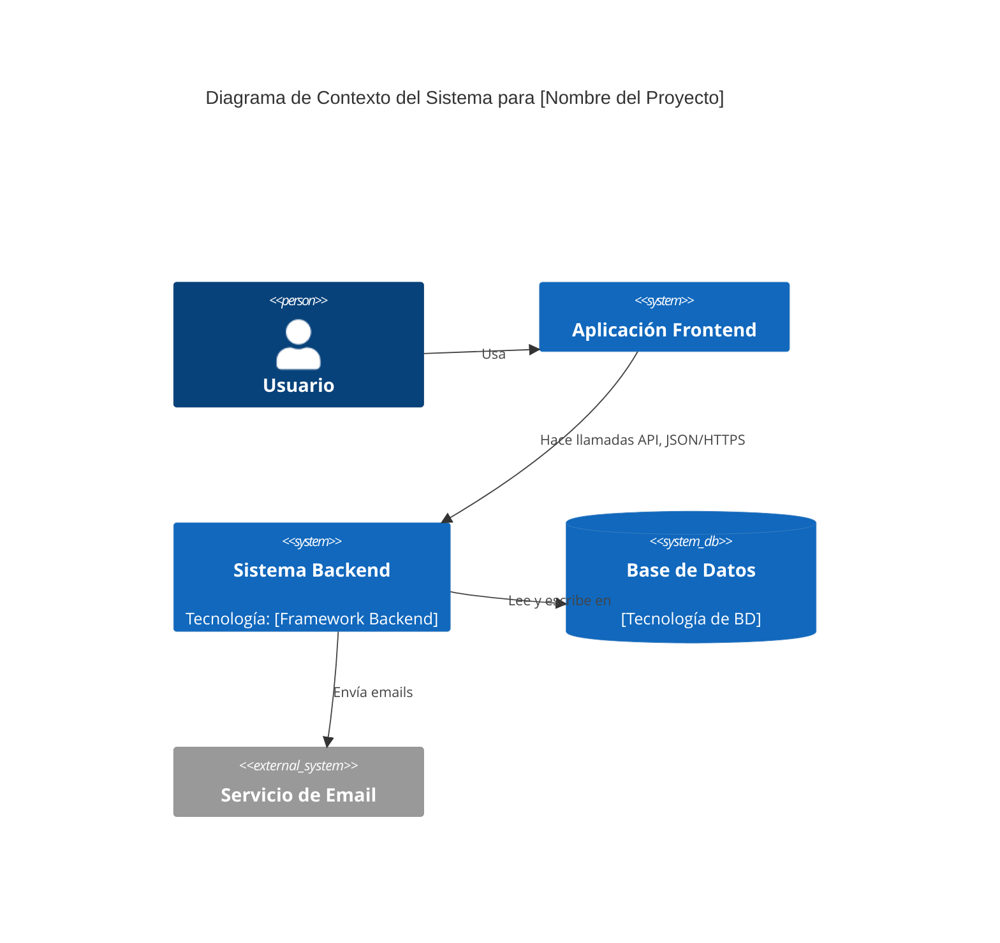
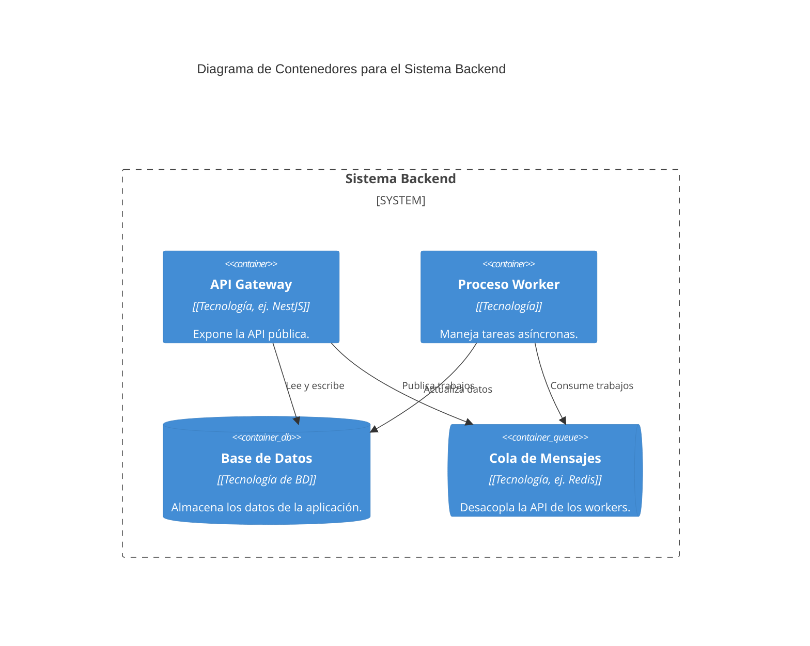

# Plantilla Maestra: Arquitectura del Backend (Modelo C4)

> **Propósito:** Proporcionar una visión clara y en capas de la arquitectura del backend, utilizando el Modelo C4 para una comprensión universal desde el contexto hasta el componente.
> **Playbook de Referencia:** `playbook-v2-DOC006-BackendArchitecture.md`

<!-- 
  INSTRUCCIONES PARA LA IA (System Architect Agent):
  - Tu misión es mantener este documento vivo, reflejando el estado actual de la arquitectura del backend.
  - Debes generar y actualizar los diagramas Mermaid y el contenido basándote en el `master_blueprint.json`.
-->

## 1. Impulsores y Restricciones Arquitectónicas

[Describe los requisitos clave (ej. Escalabilidad, Seguridad) y las restricciones (ej. presupuesto) que han influido en las decisiones de arquitectura. Extraer de `qualityGoals` y `projectScope.constraints`.]

---

## 2. El Modelo C4

### Nivel 1: Diagrama de Contexto del Sistema

(Muestra el sistema en su ecosistema, interactuando con usuarios y otros sistemas.)



### Nivel 2: Diagrama de Contenedores

(Descompone el sistema Backend en sus contenedores de alto nivel.)



### Nivel 3: Diagrama de Componentes

(Descompone el contenedor de la API en sus componentes principales.)

```mermaid
C4Component
  title Diagrama de Componentes para la API

  Container(api, "API Gateway") {
    Component(router, "Router", "Maneja el enrutamiento de las peticiones")
    Component(controllers, "Controladores", "Manejan la lógica de la petición/respuesta")
    Component(services, "Servicios", "Contienen la lógica de negocio")
    Component(repositories, "Repositorios", "Abstraen el acceso a datos")
    Component(orm, "ORM", "[Nombre del ORM]", "Mapea objetos a la base de datos")
  }

  Rel(router, controllers, "Enruta a")
  Rel(controllers, services, "Usa")
  Rel(services, repositories, "Usa")
  Rel(repositories, orm, "Usa")
```

---

## 3. Patrones y Decisiones Clave

-   **Patrón de Arquitectura:** [Ej. Monolito, Microservicios, desde `architecture.backend.architecturePattern`]
-   **Framework Principal:** [Ej. NestJS, Django, desde `architecture.backend.framework`]
-   **Base de Datos:** [Ej. PostgreSQL, desde `architecture.backend.database`]
-   **Autenticación:** [Ej. JWT, OAuth2, desde `architecture.backend.authentication`]

## 4. Registro de Decisiones de Arquitectura (ADRs)

[Iterar sobre `architecture.decisionLog` para poblar la tabla con ADRs relevantes al backend.]

| ID ADR | Título de la Decisión | Estado |
| :--- | :--- | :--- |
| `[ADR-XXX]` | `[Título]` | `[Aceptado]` |