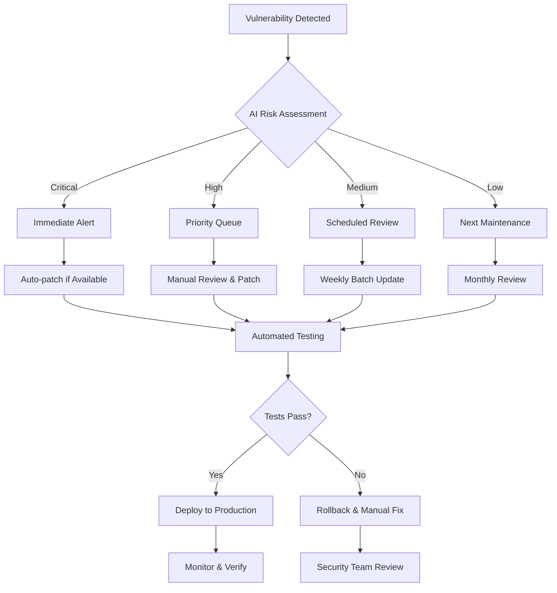
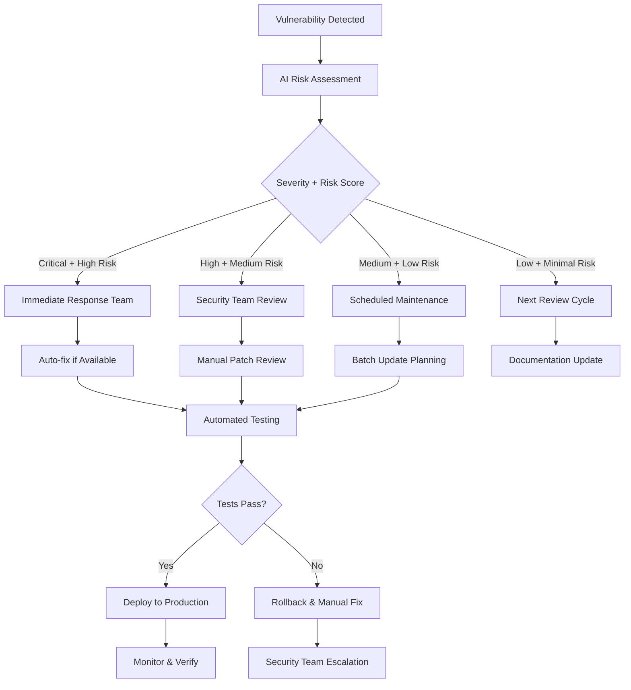

# Backend Dependencies Management Documentation

> **Purpose:** Comprehensive backend dependency management documentation following 2025 best practices. This document provides systematic approaches to dependency security, vulnerability management, license compliance, and supply chain protection for Node.js backend applications and microservices.

**Document Type:** Backend Dependencies Management  
**Version:** 3.0  
**Last Updated:** 2025-01-15  
**Template Status:** Production Ready - Enhanced with 2025 Best Practices

---

## Document Control

| Field | Value |
|-------|-------|
| **Project Name** | [PROJECT_NAME] |
| **Package Manager** | [npm/yarn/pnpm] |
| **Node.js Version** | [NODE_VERSION] |
| **Package Manager Version** | [PACKAGE_MANAGER_VERSION] |
| **Last Security Audit** | [YYYY-MM-DD] |
| **Next Review** | [YYYY-MM-DD] |
| **Dependency Count** | Production: [COUNT] / Development: [COUNT] |

---

## 📋 Table of Contents

- [🎯 Dependency Management Overview](#-dependency-management-overview)
- [📦 Package Manager Configuration](#-package-manager-configuration)
- [🔒 Security Management](#-security-management)
- [📊 Production Dependencies](#-production-dependencies)
- [🛠️ Development Dependencies](#-development-dependencies)
- [⚡ Performance Impact Analysis](#-performance-impact-analysis)
- [📜 License Compliance](#-license-compliance)
- [🔍 Vulnerability Management](#-vulnerability-management)
- [🚀 Automated Dependency Updates](#-automated-dependency-updates)
- [📈 Supply Chain Security](#-supply-chain-security)
- [🔧 Monitoring & Alerting](#-monitoring--alerting)
- [🧪 Testing & Validation](#-testing--validation)
- [🔧 Troubleshooting Guide](#-troubleshooting-guide)

---

## 🎯 Dependency Management Overview

### Management Philosophy
- **Security First:** Zero-tolerance for critical vulnerabilities in production environments
- **Supply Chain Protection:** Comprehensive verification of package integrity and maintainer reputation
- **Performance Conscious:** Monitor memory usage and startup time impact of dependencies
- **License Compliant:** Ensure all dependencies meet legal and business requirements
- **Automated Maintenance:** Leverage AI-powered tools for continuous dependency health monitoring

### Key Metrics & Targets (2025 Standards)
| Metric | Target | Current | Status |
|--------|--------|---------|--------|
| **Critical Vulnerabilities** | 0 | [CURRENT] | [STATUS] |
| **High Vulnerabilities** | 0 | [CURRENT] | [STATUS] |
| **Memory Footprint** | < 512MB | [CURRENT] | [STATUS] |
| **Startup Time Impact** | < 2s | [CURRENT] | [STATUS] |
| **Outdated Dependencies** | < 5% | [CURRENT] | [STATUS] |
| **License Compliance** | 100% | [CURRENT] | [STATUS] |

### Dependency Categories
- **Core Framework:** NestJS, Express, TypeScript, Node.js runtime
- **Database & ORM:** PostgreSQL drivers, TypeORM, Prisma, Redis clients
- **Security:** Authentication, authorization, encryption, validation
- **Monitoring:** Logging, metrics, tracing, health checks
- **Development Tools:** Testing, linting, building, deployment
- **Utilities:** Date handling, validation, serialization, HTTP clients

---

## 📦 Package Manager Configuration

### Package Manager Selection (2025 Recommendation)
**Primary Choice:** npm (Node.js 22.x built-in) with enhanced security features

```ini
# .npmrc configuration for security and performance
registry=https://registry.npmjs.org/
save-exact=true
package-lock=true
audit-level=moderate
fund=false
prefer-offline=true
progress=false
engine-strict=true
```

### Lock File Management
- **File:** `package-lock.json` (npm) / `yarn.lock` (Yarn) / `pnpm-lock.yaml` (pnpm)
- **Version Control:** Always commit lock files for deterministic builds
- **CI/CD:** Use `npm ci` for faster, reliable installs in production
- **Security:** Lock files enable precise vulnerability scanning

### Package.json Best Practices (2025)
```json
{
  "name": "@organization/backend-service",
  "version": "1.0.0",
  "type": "module",
  "engines": {
    "node": ">=22.0.0",
    "npm": ">=10.0.0"
  },
  "packageManager": "npm@10.0.0",
  "scripts": {
    "audit": "npm audit --audit-level=moderate",
    "audit:fix": "npm audit fix",
    "audit:ci": "npm audit --audit-level=high --production",
    "outdated": "npm outdated",
    "update:check": "npx npm-check-updates",
    "licenses": "npx license-checker --summary",
    "security:scan": "npx snyk test",
    "security:monitor": "npx snyk monitor"
  },
  "dependencies": {},
  "devDependencies": {},
  "peerDependencies": {},
  "overrides": {}
}
```

---

## 🔒 Security Management

### Security Audit Process (2025 Enhanced)
1. **Continuous Monitoring:** Real-time vulnerability detection with AI-powered scanners
2. **Daily Automated Scans:** CI/CD pipeline integration with multiple security tools
3. **Weekly Manual Reviews:** Comprehensive dependency analysis and risk assessment
4. **Immediate Response:** Critical vulnerability patches within 4 hours
5. **Quarterly Deep Audits:** Full supply chain security review with penetration testing

### Security Tools Integration
```bash
# Multi-layered security scanning approach

# 1. npm built-in security audit
npm audit --audit-level=moderate --production

# 2. Enhanced security scanning with Snyk
npx snyk test --severity-threshold=medium
npx snyk monitor --project-name=backend-service

# 3. Supply chain security with Socket
npx @socketsecurity/cli scan

# 4. AI-powered malware detection (2025)
npx @npm/malware-scanner scan

# 5. License compliance check
npx license-checker --failOn 'GPL-3.0;AGPL-3.0'

# 6. Dependency tree analysis
npm ls --depth=0 --production
```

### Vulnerability Response Workflow (2025)


### Security Configuration (2025)
```json
// package.json security settings
{
  "scripts": {
    "preinstall": "npx audit-ci --config audit-ci.json",
    "postinstall": "npm audit --audit-level=moderate",
    "security:daily": "npm run audit && npm run security:scan",
    "security:deep": "npm run security:scan && npx @socketsecurity/cli scan"
  },
  "audit-ci": {
    "moderate": true,
    "high": true,
    "critical": true,
    "allowlist": [],
    "report-type": "full",
    "output-format": "json"
  }
}
```

---

## 📊 Production Dependencies

### Core Framework Dependencies
| Package | Version | License | Memory Impact | Security Status | Last Updated |
|---------|---------|---------|---------------|-----------------|--------------|
| **@nestjs/core** | ^10.0.0 | MIT | 45MB | ✅ Secure | [DATE] |
| **@nestjs/common** | ^10.0.0 | MIT | 25MB | ✅ Secure | [DATE] |
| **express** | ^4.18.0 | MIT | 15MB | ✅ Secure | [DATE] |
| **typescript** | ^5.0.0 | Apache-2.0 | 0MB (compile-time) | ✅ Secure | [DATE] |

### Database & ORM Dependencies
| Package | Version | License | Memory Impact | Security Status | Last Updated |
|---------|---------|---------|---------------|-----------------|--------------|
| **pg** | ^8.11.0 | MIT | 8MB | ✅ Secure | [DATE] |
| **typeorm** | ^0.3.0 | MIT | 35MB | ✅ Secure | [DATE] |
| **redis** | ^4.6.0 | MIT | 12MB | ✅ Secure | [DATE] |
| **@prisma/client** | ^5.0.0 | Apache-2.0 | 25MB | ✅ Secure | [DATE] |

### Security & Authentication Dependencies
| Package | Version | License | Memory Impact | Security Status | Last Updated |
|---------|---------|---------|---------------|-----------------|--------------|
| **@nestjs/jwt** | ^10.0.0 | MIT | 5MB | ✅ Secure | [DATE] |
| **@nestjs/passport** | ^10.0.0 | MIT | 8MB | ✅ Secure | [DATE] |
| **bcrypt** | ^5.1.0 | MIT | 3MB | ✅ Secure | [DATE] |
| **helmet** | ^7.0.0 | MIT | 2MB | ✅ Secure | [DATE] |

### Validation & Serialization Dependencies
| Package | Version | License | Memory Impact | Security Status | Last Updated |
|---------|---------|---------|---------------|-----------------|--------------|
| **class-validator** | ^0.14.0 | MIT | 12MB | ✅ Secure | [DATE] |
| **class-transformer** | ^0.5.0 | MIT | 8MB | ✅ Secure | [DATE] |
| **joi** | ^17.9.0 | BSD-3-Clause | 6MB | ✅ Secure | [DATE] |

### HTTP & Communication Dependencies
| Package | Version | License | Memory Impact | Security Status | Last Updated |
|---------|---------|---------|---------------|-----------------|--------------|
| **axios** | ^1.4.0 | MIT | 10MB | ✅ Secure | [DATE] |
| **@nestjs/microservices** | ^10.0.0 | MIT | 20MB | ✅ Secure | [DATE] |
| **ws** | ^8.13.0 | MIT | 5MB | ✅ Secure | [DATE] |

### Production Dependencies Summary
- **Total Count:** [COUNT] packages
- **Total Memory Impact:** [SIZE]MB at runtime
- **License Distribution:** MIT: [COUNT], Apache-2.0: [COUNT], BSD: [COUNT]
- **Security Status:** [SECURE_COUNT] secure, [VULNERABLE_COUNT] with issues
- **Average Age:** [DAYS] days since last update

---

## 🛠️ Development Dependencies

### Testing Framework Dependencies
| Package | Version | License | Purpose | Security Status | Last Updated |
|---------|---------|---------|---------|-----------------|--------------|
| **jest** | ^29.0.0 | MIT | Unit testing | ✅ Secure | [DATE] |
| **@nestjs/testing** | ^10.0.0 | MIT | NestJS testing utilities | ✅ Secure | [DATE] |
| **supertest** | ^6.3.0 | MIT | HTTP testing | ✅ Secure | [DATE] |
| **testcontainers** | ^10.0.0 | MIT | Integration testing | ✅ Secure | [DATE] |

### Code Quality Dependencies
| Package | Version | License | Purpose | Security Status | Last Updated |
|---------|---------|---------|---------|-----------------|--------------|
| **eslint** | ^9.0.0 | MIT | Code linting | ✅ Secure | [DATE] |
| **prettier** | ^3.0.0 | MIT | Code formatting | ✅ Secure | [DATE] |
| **husky** | ^9.0.0 | MIT | Git hooks | ✅ Secure | [DATE] |
| **lint-staged** | ^15.0.0 | MIT | Staged file linting | ✅ Secure | [DATE] |

### Build & Development Tools
| Package | Version | License | Purpose | Security Status | Last Updated |
|---------|---------|---------|---------|-----------------|--------------|
| **@swc/core** | ^1.3.0 | Apache-2.0 | Fast TypeScript compiler | ✅ Secure | [DATE] |
| **nodemon** | ^3.0.0 | MIT | Development server | ✅ Secure | [DATE] |
| **ts-node** | ^10.9.0 | MIT | TypeScript execution | ✅ Secure | [DATE] |

### Security & Analysis Tools
| Package | Version | License | Purpose | Security Status | Last Updated |
|---------|---------|---------|---------|-----------------|--------------|
| **snyk** | ^1.1200.0 | Apache-2.0 | Vulnerability scanning | ✅ Secure | [DATE] |
| **audit-ci** | ^6.6.0 | Apache-2.0 | CI security auditing | ✅ Secure | [DATE] |
| **license-checker** | ^25.0.0 | BSD-3-Clause | License compliance | ✅ Secure | [DATE] |

### Development Dependencies Summary
- **Total Count:** [COUNT] packages
- **License Distribution:** MIT: [COUNT], Apache-2.0: [COUNT], BSD: [COUNT]
- **Security Status:** [SECURE_COUNT] secure, [VULNERABLE_COUNT] with issues
- **Purpose Distribution:** Testing: [COUNT], Quality: [COUNT], Build: [COUNT], Security: [COUNT]

---

## ⚡ Performance Impact Analysis

### Memory Usage Analysis
```bash
# Analyze memory usage of dependencies
npx clinic doctor -- node dist/main.js

# Bundle analysis for serverless deployments
npx webpack-bundle-analyzer dist/

# Dependency size analysis
npx cost-of-modules --no-install
```

### Performance Metrics (2025 Standards)
| Category | Target | Current | Status |
|----------|--------|---------|--------|
| **Cold Start Time** | < 2s | [CURRENT] | [STATUS] |
| **Memory at Startup** | < 256MB | [CURRENT] | [STATUS] |
| **Memory at Runtime** | < 512MB | [CURRENT] | [STATUS] |
| **Dependency Load Time** | < 500ms | [CURRENT] | [STATUS] |

### Heavy Dependencies Monitoring
| Package | Size (MB) | Load Time (ms) | Justification | Alternatives Considered |
|---------|-----------|----------------|---------------|------------------------|
| [PACKAGE_NAME] | [SIZE] | [TIME] | [JUSTIFICATION] | [ALTERNATIVES] |

### Performance Optimization Strategies
- **Lazy Loading:** Dynamic imports for heavy dependencies
- **Tree Shaking:** Import only used functions from libraries
- **Bundle Splitting:** Separate vendor and application code
- **Memory Profiling:** Regular memory usage analysis

```typescript
// Example: Lazy loading heavy dependencies
async function processLargeData(data: any) {
  const { default: heavyLibrary } = await import('heavy-processing-library');
  return heavyLibrary.process(data);
}

// Example: Tree shaking with specific imports
import { validate } from 'joi'; // Instead of importing entire joi
import { hash } from 'bcrypt'; // Instead of importing entire bcrypt
```

---

## 📜 License Compliance

### License Categories (2025 Risk Assessment)
| License Type | Count | Risk Level | Commercial Use | Copyleft | Action Required |
|--------------|-------|------------|----------------|----------|-----------------|
| **MIT** | [COUNT] | Low | ✅ Allowed | ❌ No | None |
| **Apache-2.0** | [COUNT] | Low | ✅ Allowed | ❌ No | None |
| **ISC** | [COUNT] | Low | ✅ Allowed | ❌ No | None |
| **BSD-3-Clause** | [COUNT] | Low | ✅ Allowed | ❌ No | None |
| **GPL-3.0** | [COUNT] | High | ⚠️ Restricted | ✅ Yes | Legal Review |
| **AGPL-3.0** | [COUNT] | Critical | ❌ Prohibited | ✅ Yes | Immediate Replacement |

### License Compliance Tools (2025)
```bash
# Comprehensive license analysis
npx license-checker --summary --out licenses.json

# Check for problematic licenses
npx license-checker --failOn 'GPL-3.0;AGPL-3.0;LGPL-3.0'

# Generate attribution file
npx license-checker --customPath license-format.json > ATTRIBUTIONS.md

# AI-powered license risk assessment
npx @license-ai/scanner analyze
```

### Compliance Workflow
1. **Pre-installation:** License check before adding dependencies
2. **Automated Scanning:** CI/CD license validation with failure on prohibited licenses
3. **Legal Review:** Quarterly legal team review of all licenses
4. **Documentation:** Maintain attribution files and license inventory
5. **Risk Assessment:** AI-powered analysis of license compatibility

### License Policy Configuration
```json
// .license-checker-config.json
{
  "allowed": ["MIT", "Apache-2.0", "ISC", "BSD-3-Clause", "BSD-2-Clause"],
  "restricted": ["GPL-2.0", "GPL-3.0", "LGPL-2.1", "LGPL-3.0"],
  "prohibited": ["AGPL-3.0", "SSPL-1.0"],
  "customFormat": {
    "name": "",
    "version": "",
    "license": "",
    "repository": "",
    "publisher": ""
  }
}
```

---

## 🔍 Vulnerability Management

### Current Vulnerability Status
```bash
# Comprehensive vulnerability assessment
npm audit --audit-level=moderate --json > vulnerability-report.json

# Enhanced scanning with multiple tools
npx snyk test --severity-threshold=medium --json > snyk-report.json
npx @socketsecurity/cli scan --output=json > socket-report.json
```

### Vulnerability Categories (2025 Classification)
| Severity | Count | Action Required | Timeline | Auto-Fix Available |
|----------|-------|-----------------|----------|-------------------|
| **Critical** | [COUNT] | Immediate patch | < 4 hours | [YES/NO] |
| **High** | [COUNT] | Priority patch | < 24 hours | [YES/NO] |
| **Moderate** | [COUNT] | Scheduled patch | < 1 week | [YES/NO] |
| **Low** | [COUNT] | Next maintenance | Next cycle | [YES/NO] |

### AI-Enhanced Vulnerability Response (2025)
```typescript
// Automated vulnerability response system
interface VulnerabilityResponse {
  id: string;
  severity: 'critical' | 'high' | 'moderate' | 'low';
  package: string;
  version: string;
  fixAvailable: boolean;
  aiRiskScore: number;
  businessImpact: 'high' | 'medium' | 'low';
  autoFixRecommended: boolean;
}

class VulnerabilityManager {
  async processVulnerability(vuln: VulnerabilityResponse): Promise<void> {
    const aiAssessment = await this.aiRiskAssessment(vuln);
    
    if (vuln.severity === 'critical' && vuln.autoFixRecommended) {
      await this.autoFix(vuln);
      await this.runSecurityTests();
      await this.deployIfTestsPass();
    } else {
      await this.createSecurityTicket(vuln, aiAssessment);
    }
  }

  private async aiRiskAssessment(vuln: VulnerabilityResponse): Promise<RiskAssessment> {
    // AI-powered risk analysis considering:
    // - Exploit availability
    // - Attack vector complexity
    // - Business context
    // - Historical patterns
    return this.aiService.assessRisk(vuln);
  }
}
```

### Vulnerability Response Workflow


### Security Monitoring Tools (2025)
- **npm audit:** Built-in vulnerability scanning
- **Snyk:** Advanced vulnerability management with AI insights
- **Socket Security:** Supply chain protection and malware detection
- **GitHub Dependabot:** Automated security updates
- **OWASP Dependency Check:** Open source vulnerability scanning
- **AI Malware Scanner:** Machine learning-based threat detection

---

## 🚀 Automated Dependency Updates

### Update Strategy (2025 Enhanced)
- **Security Updates:** AI-powered immediate deployment for critical fixes
- **Minor Updates:** Weekly automated updates with comprehensive testing
- **Major Updates:** Quarterly planned updates with migration testing
- **Breaking Changes:** Manual review with impact assessment and rollback plans

### Automation Tools Configuration
```yaml
# .github/dependabot.yml (Enhanced 2025 version)
version: 2
updates:
  - package-ecosystem: "npm"
    directory: "/"
    schedule:
      interval: "daily"
      time: "09:00"
      timezone: "UTC"
    open-pull-requests-limit: 15
    reviewers:
      - "backend-team"
      - "security-team"
    assignees:
      - "tech-lead"
    commit-message:
      prefix: "deps"
      include: "scope"
    labels:
      - "dependencies"
      - "automated"
    allow:
      - dependency-type: "direct"
      - dependency-type: "indirect"
    ignore:
      - dependency-name: "legacy-package"
        versions: [">=2.0.0"]
```

### AI-Powered Update Workflow (2025)
```typescript
// Intelligent dependency update system
class DependencyUpdateManager {
  async evaluateUpdate(update: DependencyUpdate): Promise<UpdateDecision> {
    const riskAssessment = await this.aiRiskAnalysis(update);
    const compatibilityCheck = await this.compatibilityAnalysis(update);
    const performanceImpact = await this.performanceAnalysis(update);
    
    return {
      approved: this.shouldAutoApprove(riskAssessment, compatibilityCheck),
      testingRequired: this.determineTestingLevel(update),
      rollbackPlan: this.generateRollbackPlan(update),
      monitoringPlan: this.createMonitoringPlan(update)
    };
  }

  private async aiRiskAnalysis(update: DependencyUpdate): Promise<RiskScore> {
    // AI analysis considering:
    // - Historical stability of package
    // - Maintainer reputation
    // - Community feedback
    // - Security track record
    return this.aiService.analyzeUpdateRisk(update);
  }
}
```

### Update Validation Process
1. **Automated Testing:** Full test suite execution including security tests
2. **Performance Validation:** Memory usage and startup time verification
3. **Security Scanning:** Vulnerability assessment of updated dependencies
4. **Compatibility Testing:** Integration testing with existing codebase
5. **Rollback Verification:** Ensure rollback procedures work correctly

```bash
# Automated update validation pipeline
npm run test:security
npm run test:performance
npm run test:integration
npm run audit:post-update
npm run compatibility:check
```

---

## 📈 Supply Chain Security

### Supply Chain Protection (2025 Standards)
- **Package Verification:** Cryptographic signature validation
- **Maintainer Reputation:** AI-powered maintainer trustworthiness scoring
- **Dependency Provenance:** Full dependency tree verification
- **Malware Detection:** Machine learning-based malware scanning
- **Typosquatting Protection:** Automated detection of suspicious package names

### Supply Chain Security Tools
```bash
# Comprehensive supply chain security scanning
npx @socketsecurity/cli scan --include-dev

# Package signature verification
npm audit signatures

# Dependency provenance verification
npx @sigstore/cli verify-npm-package <package-name>

# AI-powered malware detection
npx @npm/malware-scanner scan --deep-analysis
```

### Maintainer Reputation System (2025)
```typescript
interface MaintainerScore {
  packageName: string;
  maintainerEmail: string;
  reputationScore: number; // 0-100
  factors: {
    accountAge: number;
    packageCount: number;
    downloadCount: number;
    securityIncidents: number;
    communityFeedback: number;
    verificationStatus: boolean;
  };
  riskLevel: 'low' | 'medium' | 'high' | 'critical';
  recommendation: 'approve' | 'review' | 'reject';
}

class SupplyChainValidator {
  async validatePackage(packageName: string): Promise<ValidationResult> {
    const maintainerScore = await this.getMaintainerScore(packageName);
    const packageIntegrity = await this.verifyPackageIntegrity(packageName);
    const malwareCheck = await this.scanForMalware(packageName);
    
    return {
      approved: this.shouldApprove(maintainerScore, packageIntegrity, malwareCheck),
      riskFactors: this.identifyRiskFactors(maintainerScore, packageIntegrity),
      recommendations: this.generateRecommendations(maintainerScore)
    };
  }
}
```

### Package Integrity Verification
```bash
# Verify package integrity and signatures
npm audit signatures --audit-level=moderate

# Check for known malicious packages
npx @socketsecurity/cli scan --check-malware

# Verify package provenance
npx @sigstore/cli verify-npm-package --package-name <package> --version <version>
```

---

## 🔧 Monitoring & Alerting

### Real-Time Monitoring (2025)
```typescript
// Dependency health monitoring system
class DependencyMonitor {
  private metrics = {
    vulnerabilityCount: new Gauge('dependencies_vulnerabilities_total'),
    outdatedCount: new Gauge('dependencies_outdated_total'),
    licenseViolations: new Gauge('dependencies_license_violations_total'),
    memoryUsage: new Gauge('dependencies_memory_usage_bytes'),
    loadTime: new Histogram('dependencies_load_time_seconds')
  };

  async monitorDependencies(): Promise<void> {
    const vulnerabilities = await this.scanVulnerabilities();
    const outdated = await this.checkOutdated();
    const licenses = await this.validateLicenses();
    
    this.metrics.vulnerabilityCount.set(vulnerabilities.length);
    this.metrics.outdatedCount.set(outdated.length);
    this.metrics.licenseViolations.set(licenses.violations.length);
    
    // AI-powered anomaly detection
    await this.detectAnomalies();
  }

  private async detectAnomalies(): Promise<void> {
    const currentMetrics = await this.getCurrentMetrics();
    const anomalies = await this.aiAnomalyDetection(currentMetrics);
    
    if (anomalies.length > 0) {
      await this.sendAlert(anomalies);
    }
  }
}
```

### Alerting Configuration
```yaml
# Prometheus alerting rules for dependencies
groups:
  - name: dependency-security
    rules:
      - alert: CriticalVulnerabilityDetected
        expr: dependencies_vulnerabilities_total{severity="critical"} > 0
        for: 0m
        labels:
          severity: critical
        annotations:
          summary: "Critical vulnerability detected in dependencies"
          description: "{{ $value }} critical vulnerabilities found"

      - alert: HighMemoryUsage
        expr: dependencies_memory_usage_bytes > 536870912  # 512MB
        for: 5m
        labels:
          severity: warning
        annotations:
          summary: "High memory usage from dependencies"
          description: "Dependencies using {{ $value | humanize }}B of memory"

      - alert: OutdatedDependencies
        expr: dependencies_outdated_total > 10
        for: 1h
        labels:
          severity: info
        annotations:
          summary: "Many outdated dependencies detected"
          description: "{{ $value }} dependencies are outdated"
```

### Dashboard Configuration
```json
{
  "dashboard": {
    "title": "Backend Dependencies Health",
    "panels": [
      {
        "title": "Security Status",
        "type": "stat",
        "targets": [
          {
            "expr": "dependencies_vulnerabilities_total",
            "legendFormat": "Vulnerabilities"
          }
        ]
      },
      {
        "title": "Memory Usage",
        "type": "graph",
        "targets": [
          {
            "expr": "dependencies_memory_usage_bytes",
            "legendFormat": "Memory Usage"
          }
        ]
      },
      {
        "title": "License Compliance",
        "type": "pie",
        "targets": [
          {
            "expr": "dependencies_license_violations_total",
            "legendFormat": "License Violations"
          }
        ]
      }
    ]
  }
}
```

---

## 🧪 Testing & Validation

### Dependency Testing Strategy
```typescript
// Comprehensive dependency testing
describe('Dependency Security Tests', () => {
  it('should have no critical vulnerabilities', async () => {
    const auditResult = await runSecurityAudit();
    expect(auditResult.vulnerabilities.critical).toBe(0);
  });

  it('should have acceptable memory footprint', async () => {
    const memoryUsage = await measureMemoryUsage();
    expect(memoryUsage).toBeLessThan(512 * 1024 * 1024); // 512MB
  });

  it('should have fast startup time', async () => {
    const startTime = Date.now();
    await import('./app.module');
    const loadTime = Date.now() - startTime;
    expect(loadTime).toBeLessThan(2000); // 2 seconds
  });

  it('should have compliant licenses', async () => {
    const licenses = await checkLicenses();
    const prohibited = licenses.filter(l => 
      ['GPL-3.0', 'AGPL-3.0'].includes(l.license)
    );
    expect(prohibited).toHaveLength(0);
  });
});
```

### Integration Testing with Dependencies
```typescript
// Test dependency integration
describe('Database Integration', () => {
  let app: INestApplication;
  let container: StartedTestContainer;

  beforeAll(async () => {
    // Start test database container
    container = await new PostgreSqlContainer()
      .withDatabase('testdb')
      .withUsername('testuser')
      .withPassword('testpass')
      .start();

    const moduleFixture = await Test.createTestingModule({
      imports: [AppModule],
    })
    .overrideProvider('DATABASE_URL')
    .useValue(container.getConnectionUri())
    .compile();

    app = moduleFixture.createNestApplication();
    await app.init();
  });

  it('should connect to database successfully', async () => {
    const connection = app.get(DataSource);
    expect(connection.isInitialized).toBe(true);
  });

  afterAll(async () => {
    await app.close();
    await container.stop();
  });
});
```

### Performance Testing
```bash
# Load testing with dependency monitoring
npx clinic doctor -- node dist/main.js &
npx autocannon -c 100 -d 30 http://localhost:3000/health

# Memory leak detection
npx clinic bubbleprof -- node dist/main.js &
npx autocannon -c 10 -d 60 http://localhost:3000/api/users

# Dependency load time profiling
npx clinic flame -- node dist/main.js
```

---

## 🔧 Troubleshooting Guide

### Common Issues & Solutions

#### Dependency Conflicts
```bash
# Resolve peer dependency warnings
npm install --legacy-peer-deps

# Check for conflicting versions
npm ls --depth=0

# Clear npm cache and reinstall
npm cache clean --force
rm -rf node_modules package-lock.json
npm install
```

#### Security Vulnerabilities
```bash
# Automatic vulnerability fixes
npm audit fix

# Force fix with potential breaking changes
npm audit fix --force

# Manual vulnerability resolution
npm audit --json | jq '.vulnerabilities'
npm install package@safe-version
```

#### Memory Issues
```bash
# Analyze memory usage
npx clinic doctor -- node dist/main.js

# Find memory leaks
npx clinic bubbleprof -- node dist/main.js

# Optimize Node.js memory settings
node --max-old-space-size=4096 dist/main.js
```

#### License Compliance Issues
```bash
# Check for problematic licenses
npx license-checker --failOn 'GPL-3.0;AGPL-3.0'

# Generate compliance report
npx license-checker --summary --csv > licenses.csv

# Find alternative packages
npx npm-check-updates --interactive
```

### Emergency Procedures

#### Critical Vulnerability Response
1. **Immediate Assessment:** Determine exploit risk and business impact
2. **Isolation:** Temporarily disable affected functionality if possible
3. **Patch Application:** Apply security patches or upgrade dependencies
4. **Testing:** Run comprehensive security and functionality tests
5. **Deployment:** Emergency deployment with monitoring
6. **Verification:** Confirm vulnerability is resolved
7. **Post-Incident:** Document lessons learned and improve processes

#### Dependency Failure Recovery
1. **Rollback:** Revert to last known good dependency versions
2. **Root Cause Analysis:** Identify what caused the failure
3. **Alternative Solutions:** Find replacement packages or workarounds
4. **Testing:** Validate alternative solutions thoroughly
5. **Gradual Rollout:** Deploy fixes with careful monitoring
6. **Documentation:** Update dependency decisions and rationale

---

## Maintenance Schedule

### Daily Tasks (Automated)
- Security vulnerability scanning
- Dependency health monitoring
- License compliance checking
- Performance metrics collection

### Weekly Tasks
- Dependency update review and approval
- Security audit report analysis
- Performance impact assessment
- Outdated dependency identification

### Monthly Tasks
- Comprehensive security audit
- Dependency cleanup and optimization
- License compliance review
- Supply chain security assessment

### Quarterly Tasks
- Full dependency architecture review
- Security penetration testing
- Legal compliance audit
- Technology stack evaluation
- Documentation updates

---

**Document Information:**
- **Template Version:** 3.0 - Enhanced with 2025 Best Practices
- **Last Updated:** 2025-01-15
- **Compatibility:** Node.js 22.x, npm 10.x, modern security tools
- **Standards:** Security-first approach, AI-powered monitoring, supply chain protection
- **Review Cycle:** Monthly or as needed for security updates
- **Research Sources:** Node.js security best practices, npm security guidelines, supply chain security standards