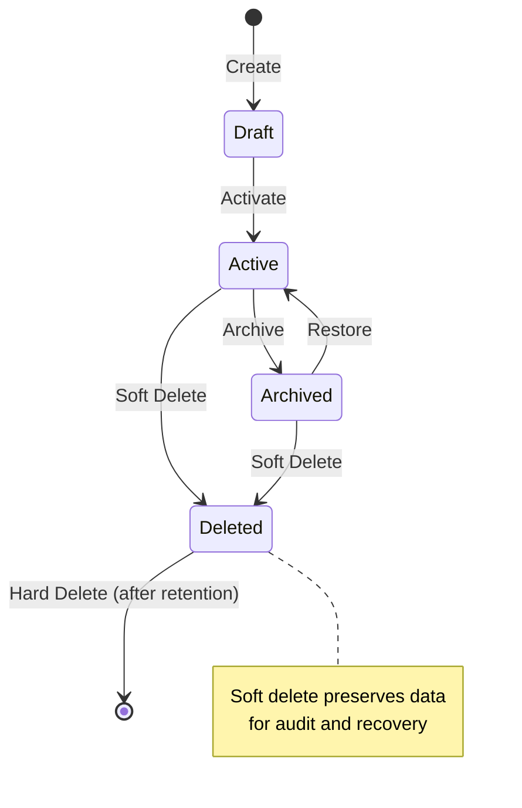
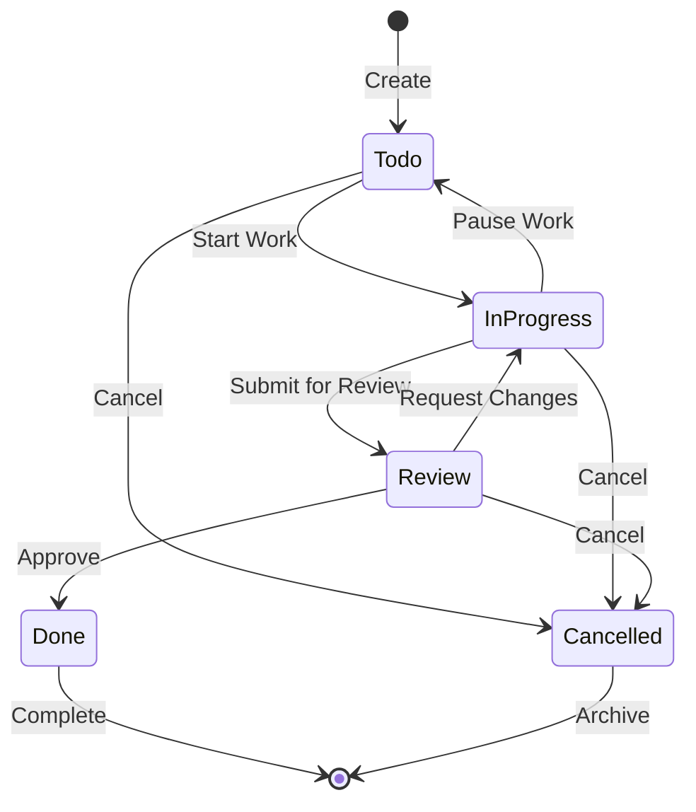

# Data Model Documentation
> **Purpose:** Comprehensive data model documentation following 2025 best practices. This document provides clear, visual, and textual representation of the data architecture, serving as the single source of truth for developers, data architects, and stakeholders with modern data governance and privacy considerations.

**Document Type:** Data Model Documentation  
**Version:** 3.0  
**Last Updated:** 2025-01-15  
**Template Status:** Production Ready - Enhanced with 2025 Best Practices

---

## Document Control
| Field | Value |
|-------|-------|
| **Project Name** | [PROJECT_NAME] |
| **Database Technology** | [DATABASE_TECHNOLOGY] |
| **Model Version** | [MODEL_VERSION] |
| **Schema Version** | [SCHEMA_VERSION] |
| **Last Updated** | [YYYY-MM-DD] |
| **Next Review** | [YYYY-MM-DD] |
| **Data Architect** | [ARCHITECT_NAME] |

---

## 📋 Table of Contents
- [🎯 Data Model Overview](#-data-model-overview)
- [🏗️ Architecture & Design Principles](#️-architecture--design-principles)
- [📊 Entity Relationship Diagram](#-entity-relationship-diagram)
- [📝 Entity Definitions](#-entity-definitions)
- [🔗 Relationships & Constraints](#-relationships--constraints)
- [🔒 Data Security & Privacy](#-data-security--privacy)
- [📈 Performance & Indexing](#-performance--indexing)
- [🔄 Data Lifecycle Management](#-data-lifecycle-management)
- [📋 Views & Materialized Views](#-views--materialized-views)
- [🧪 Data Validation & Quality](#-data-validation--quality)
- [📊 Analytics & Reporting](#-analytics--reporting)
- [🔧 Migration & Versioning](#-migration--versioning)
- [📚 Data Dictionary](#-data-dictionary)

---

## 🎯 Data Model Overview

### Executive Summary
The [PROJECT_NAME] data model is designed following 2025 best practices for modern applications. Built with scalability, performance, and data governance in mind, it supports [MAIN_PURPOSE] while ensuring data integrity, privacy compliance, and optimal query performance.

### Data Model Philosophy
- **Domain-Driven Design:** Entities reflect business domains and bounded contexts
- **Privacy by Design:** GDPR, CCPA compliance built into the data structure
- **Performance First:** Optimized for read/write patterns and query performance
- **Scalability Ready:** Designed for horizontal scaling and partitioning
- **Data Quality:** Built-in validation and consistency checks
- **Audit Trail:** Complete data lineage and change tracking

### Key Metrics & Goals
| Metric | Target | Current | Status |
|--------|--------|---------|--------|
| **Query Performance (P95)** | < 50ms | [CURRENT] | [STATUS] |
| **Data Consistency** | 99.99% | [CURRENT] | [STATUS] |
| **Storage Efficiency** | > 80% | [CURRENT] | [STATUS] |
| **Privacy Compliance** | 100% | [CURRENT] | [STATUS] |
| **Data Quality Score** | > 95% | [CURRENT] | [STATUS] |

### Database Technology Stack
- **Primary Database:** [DATABASE_TYPE] [VERSION]
- **ORM/Query Builder:** [ORM_TECHNOLOGY]
- **Migration Tool:** [MIGRATION_TOOL]
- **Backup Strategy:** [BACKUP_STRATEGY]
- **Monitoring:** [MONITORING_TOOLS]

---

## 🏗️ Architecture & Design Principles

### Database Design Patterns (2025)

#### Domain-Driven Design (DDD)
- **Bounded Contexts:** Clear data boundaries aligned with business domains
- **Aggregates:** Consistent data clusters with transactional boundaries
- **Value Objects:** Immutable data structures for business concepts
- **Domain Events:** Data change events for cross-context communication

#### Data Modeling Principles
- **Normalization:** 3NF for transactional data, denormalization for analytics
- **Single Source of Truth:** Each data element has one authoritative source
- **Data Lineage:** Complete traceability of data origins and transformations
- **Schema Evolution:** Backward-compatible schema changes with versioning

#### Performance Optimization
- **Indexing Strategy:** Composite indexes for common query patterns
- **Partitioning:** Horizontal partitioning for large tables
- **Caching Layer:** Redis/Memcached for frequently accessed data
- **Read Replicas:** Separate read and write workloads

### Data Governance Framework
- **Data Classification:** Public, Internal, Confidential, Restricted
- **Access Control:** Role-based access with principle of least privilege
- **Data Retention:** Automated lifecycle management and archival
- **Compliance:** GDPR, CCPA, HIPAA compliance built-in

---

## 📊 Entity Relationship Diagram

### High-Level ERD
```mermaid
erDiagram
    [ENTITY_1] {
        [ID_TYPE] [ID_FIELD] PK "[ID_DESCRIPTION]"
        [FIELD_TYPE_1] [FIELD_1] UK "[FIELD_1_DESCRIPTION]"
        [FIELD_TYPE_2] [FIELD_2] "[FIELD_2_DESCRIPTION]"
        [FIELD_TYPE_3] [FIELD_3] "[FIELD_3_DESCRIPTION]"
        [FIELD_TYPE_4] [FIELD_4] "[FIELD_4_DESCRIPTION]"
        [FIELD_TYPE_5] [FIELD_5] "[FIELD_5_DESCRIPTION]"
        [FIELD_TYPE_6] [FIELD_6] "[FIELD_6_DESCRIPTION]"
        [FIELD_TYPE_7] [FIELD_7] "[FIELD_7_DESCRIPTION]"
        [FIELD_TYPE_8] [FIELD_8] "[FIELD_8_DESCRIPTION]"
        [FIELD_TYPE_9] [FIELD_9] "[FIELD_9_DESCRIPTION]"
        [FIELD_TYPE_10] [FIELD_10] "[FIELD_10_DESCRIPTION]"
        [FIELD_TYPE_11] [FIELD_11] "[FIELD_11_DESCRIPTION]"
    }
    
    [ENTITY_2] {
        [ID_TYPE] [ID_FIELD] PK "[ENTITY_2_ID_DESCRIPTION]"
        [FIELD_TYPE_1] [FIELD_1] "[ENTITY_2_FIELD_1_DESCRIPTION]"
        [FIELD_TYPE_2] [FIELD_2] UK "[ENTITY_2_FIELD_2_DESCRIPTION]"
        [FIELD_TYPE_3] [FIELD_3] "[ENTITY_2_FIELD_3_DESCRIPTION]"
        [FIELD_TYPE_4] [FIELD_4] "[ENTITY_2_FIELD_4_DESCRIPTION]"
        [FIELD_TYPE_5] [FIELD_5] "[ENTITY_2_FIELD_5_DESCRIPTION]"
        [FIELD_TYPE_6] [FIELD_6] "[ENTITY_2_FIELD_6_DESCRIPTION]"
        [FIELD_TYPE_7] [FIELD_7] "[ENTITY_2_FIELD_7_DESCRIPTION]"
        [FIELD_TYPE_8] [FIELD_8] "[ENTITY_2_FIELD_8_DESCRIPTION]"
    }
    
    [JUNCTION_ENTITY_1] {
        [ID_TYPE] [ID_FIELD] PK "[JUNCTION_ID_DESCRIPTION]"
        [ID_TYPE] [FOREIGN_KEY_1] FK "[FK_1_DESCRIPTION]"
        [ID_TYPE] [FOREIGN_KEY_2] FK "[FK_2_DESCRIPTION]"
        [FIELD_TYPE_1] [FIELD_1] "[JUNCTION_FIELD_1_DESCRIPTION]"
        [FIELD_TYPE_2] [FIELD_2] "[JUNCTION_FIELD_2_DESCRIPTION]"
        [FIELD_TYPE_3] [FIELD_3] "[JUNCTION_FIELD_3_DESCRIPTION]"
        [FIELD_TYPE_4] [FIELD_4] "[JUNCTION_FIELD_4_DESCRIPTION]"
        [FIELD_TYPE_5] [FIELD_5] "[JUNCTION_FIELD_5_DESCRIPTION]"
    }
    
    [ENTITY_3] {
        [ID_TYPE] [ID_FIELD] PK "[ENTITY_3_ID_DESCRIPTION]"
        [ID_TYPE] [FOREIGN_KEY_1] FK "[ENTITY_3_FK_1_DESCRIPTION]"
        [ID_TYPE] [FOREIGN_KEY_2] FK "[ENTITY_3_FK_2_DESCRIPTION]"
        [FIELD_TYPE_1] [FIELD_1] "[ENTITY_3_FIELD_1_DESCRIPTION]"
        [FIELD_TYPE_2] [FIELD_2] UK "[ENTITY_3_FIELD_2_DESCRIPTION]"
        [FIELD_TYPE_3] [FIELD_3] "[ENTITY_3_FIELD_3_DESCRIPTION]"
        [FIELD_TYPE_4] [FIELD_4] "[ENTITY_3_FIELD_4_DESCRIPTION]"
        [FIELD_TYPE_5] [FIELD_5] "[ENTITY_3_FIELD_5_DESCRIPTION]"
        [FIELD_TYPE_6] [FIELD_6] "[ENTITY_3_FIELD_6_DESCRIPTION]"
        [FIELD_TYPE_7] [FIELD_7] "[ENTITY_3_FIELD_7_DESCRIPTION]"
        [FIELD_TYPE_8] [FIELD_8] "[ENTITY_3_FIELD_8_DESCRIPTION]"
        [FIELD_TYPE_9] [FIELD_9] "[ENTITY_3_FIELD_9_DESCRIPTION]"
    }
    
    [ENTITY_4] {
        [ID_TYPE] [ID_FIELD] PK "[ENTITY_4_ID_DESCRIPTION]"
        [ID_TYPE] [FOREIGN_KEY_1] FK "[ENTITY_4_FK_1_DESCRIPTION]"
        [ID_TYPE] [FOREIGN_KEY_2] FK "[ENTITY_4_FK_2_DESCRIPTION]"
        [ID_TYPE] [FOREIGN_KEY_3] FK "[ENTITY_4_FK_3_DESCRIPTION]"
        [FIELD_TYPE_1] [FIELD_1] "[ENTITY_4_FIELD_1_DESCRIPTION]"
        [FIELD_TYPE_2] [FIELD_2] "[ENTITY_4_FIELD_2_DESCRIPTION]"
        [FIELD_TYPE_3] [FIELD_3] "[ENTITY_4_FIELD_3_DESCRIPTION]"
        [FIELD_TYPE_4] [FIELD_4] "[ENTITY_4_FIELD_4_DESCRIPTION]"
        [FIELD_TYPE_5] [FIELD_5] "[ENTITY_4_FIELD_5_DESCRIPTION]"
        [FIELD_TYPE_6] [FIELD_6] "[ENTITY_4_FIELD_6_DESCRIPTION]"
        [FIELD_TYPE_7] [FIELD_7] "[ENTITY_4_FIELD_7_DESCRIPTION]"
        [FIELD_TYPE_8] [FIELD_8] "[ENTITY_4_FIELD_8_DESCRIPTION]"
        [FIELD_TYPE_9] [FIELD_9] "[ENTITY_4_FIELD_9_DESCRIPTION]"
    }
    
    [ENTITY_5] {
        [ID_TYPE] [ID_FIELD] PK "[ENTITY_5_ID_DESCRIPTION]"
        [ID_TYPE] [FOREIGN_KEY_1] FK "[ENTITY_5_FK_1_DESCRIPTION]"
        [ID_TYPE] [FOREIGN_KEY_2] FK "[ENTITY_5_FK_2_DESCRIPTION]"
        [FIELD_TYPE_1] [FIELD_1] "[ENTITY_5_FIELD_1_DESCRIPTION]"
        [FIELD_TYPE_2] [FIELD_2] "[ENTITY_5_FIELD_2_DESCRIPTION]"
        [FIELD_TYPE_3] [FIELD_3] "[ENTITY_5_FIELD_3_DESCRIPTION]"
        [FIELD_TYPE_4] [FIELD_4] "[ENTITY_5_FIELD_4_DESCRIPTION]"
        [FIELD_TYPE_5] [FIELD_5] "[ENTITY_5_FIELD_5_DESCRIPTION]"
    }
    
    [AUDIT_ENTITY] {
        [ID_TYPE] [ID_FIELD] PK "[AUDIT_ID_DESCRIPTION]"
        [ID_TYPE] [FOREIGN_KEY_1] FK "[AUDIT_FK_1_DESCRIPTION]"
        [FIELD_TYPE_1] [FIELD_1] "[AUDIT_FIELD_1_DESCRIPTION]"
        [ID_TYPE] [FIELD_2] "[AUDIT_FIELD_2_DESCRIPTION]"
        [FIELD_TYPE_2] [FIELD_3] "[AUDIT_FIELD_3_DESCRIPTION]"
        [FIELD_TYPE_3] [FIELD_4] "[AUDIT_FIELD_4_DESCRIPTION]"
        [FIELD_TYPE_4] [FIELD_5] "[AUDIT_FIELD_5_DESCRIPTION]"
        [FIELD_TYPE_5] [FIELD_6] "[AUDIT_FIELD_6_DESCRIPTION]"
        [FIELD_TYPE_6] [FIELD_7] "[AUDIT_FIELD_7_DESCRIPTION]"
        [FIELD_TYPE_7] [FIELD_8] "[AUDIT_FIELD_8_DESCRIPTION]"
    }
    
    %% Relationships
    [ENTITY_1] ||--o{ [JUNCTION_ENTITY_1] : "[RELATIONSHIP_1]"
    [ENTITY_2] ||--o{ [JUNCTION_ENTITY_1] : "[RELATIONSHIP_2]"
    [ENTITY_2] ||--o{ [ENTITY_3] : "[RELATIONSHIP_3]"
    [ENTITY_1] ||--o{ [ENTITY_3] : "[RELATIONSHIP_4]"
    [ENTITY_3] ||--o{ [ENTITY_4] : "[RELATIONSHIP_5]"
    [ENTITY_1] ||--o{ [ENTITY_4] : "[RELATIONSHIP_6]"
    [ENTITY_1] ||--o{ [ENTITY_4] : "[RELATIONSHIP_7]"
    [ENTITY_4] ||--o{ [ENTITY_5] : "[RELATIONSHIP_8]"
    [ENTITY_1] ||--o{ [ENTITY_5] : "[RELATIONSHIP_9]"
    [ENTITY_1] ||--o{ [AUDIT_ENTITY] : "[RELATIONSHIP_10]"
```

### Domain-Specific ERDs

#### [DOMAIN_1] Domain
```mermaid
erDiagram
    [DOMAIN_1_ENTITY_1] {
        [ID_TYPE] [ID_FIELD] PK
        [FIELD_TYPE_1] [FIELD_1] UK
        [FIELD_TYPE_2] [FIELD_2]
        [FIELD_TYPE_3] [FIELD_3]
        [FIELD_TYPE_4] [FIELD_4]
        [FIELD_TYPE_5] [FIELD_5]
        [FIELD_TYPE_6] [FIELD_6]
        [FIELD_TYPE_7] [FIELD_7]
        [FIELD_TYPE_8] [FIELD_8]
        [FIELD_TYPE_9] [FIELD_9]
        [FIELD_TYPE_10] [FIELD_10]
    }
    
    [DOMAIN_1_ENTITY_2] {
        [ID_TYPE] [ID_FIELD] PK
        [ID_TYPE] [FOREIGN_KEY_1] FK
        [FIELD_TYPE_1] [FIELD_1] UK
        [FIELD_TYPE_2] [FIELD_2] UK
        [FIELD_TYPE_3] [FIELD_3]
        [FIELD_TYPE_4] [FIELD_4]
        [FIELD_TYPE_5] [FIELD_5]
        [FIELD_TYPE_6] [FIELD_6]
        [FIELD_TYPE_7] [FIELD_7]
    }
    
    [DOMAIN_1_ENTITY_3] {
        [ID_TYPE] [ID_FIELD] PK
        [ID_TYPE] [FOREIGN_KEY_1] FK
        [FIELD_TYPE_1] [FIELD_1] UK
        [FIELD_TYPE_2] [FIELD_2]
        [FIELD_TYPE_3] [FIELD_3]
        [FIELD_TYPE_4] [FIELD_4]
    }
    
    [DOMAIN_1_ENTITY_1] ||--o{ [DOMAIN_1_ENTITY_2] : "[DOMAIN_1_RELATIONSHIP_1]"
    [DOMAIN_1_ENTITY_1] ||--o{ [DOMAIN_1_ENTITY_3] : "[DOMAIN_1_RELATIONSHIP_2]"
```

#### [DOMAIN_2] Domain
```mermaid
erDiagram
    [DOMAIN_2_ENTITY_1] {
        [ID_TYPE] [ID_FIELD] PK
        [ID_TYPE] [FOREIGN_KEY_1] FK
        [FIELD_TYPE_1] [FIELD_1]
        [FIELD_TYPE_2] [FIELD_2] UK
        [FIELD_TYPE_3] [FIELD_3]
        [FIELD_TYPE_4] [FIELD_4]
        [FIELD_TYPE_5] [FIELD_5]
        [FIELD_TYPE_6] [FIELD_6]
    }
    
    [DOMAIN_2_ENTITY_2] {
        [ID_TYPE] [ID_FIELD] PK
        [ID_TYPE] [FOREIGN_KEY_1] FK
        [ID_TYPE] [FOREIGN_KEY_2] FK
        [FIELD_TYPE_1] [FIELD_1]
        [FIELD_TYPE_2] [FIELD_2]
        [FIELD_TYPE_3] [FIELD_3]
        [FIELD_TYPE_4] [FIELD_4]
        [FIELD_TYPE_5] [FIELD_5]
        [FIELD_TYPE_6] [FIELD_6]
        [FIELD_TYPE_7] [FIELD_7]
    }
    
    [DOMAIN_2_ENTITY_3] {
        [ID_TYPE] [ID_FIELD] PK
        [ID_TYPE] [FOREIGN_KEY_1] FK
        [ID_TYPE] [FOREIGN_KEY_2] FK
        [FIELD_TYPE_1] [FIELD_1]
        [FIELD_TYPE_2] [FIELD_2]
    }
    
    [DOMAIN_2_ENTITY_1] ||--o{ [DOMAIN_2_ENTITY_2] : "[DOMAIN_2_RELATIONSHIP_1]"
    [DOMAIN_2_ENTITY_2] ||--o{ [DOMAIN_2_ENTITY_3] : "[DOMAIN_2_RELATIONSHIP_2]"
    [DOMAIN_2_ENTITY_2] ||--o{ [DOMAIN_2_ENTITY_3] : "[DOMAIN_2_RELATIONSHIP_3]"
```

---

## 📝 Entity Definitions

### Core Entities

#### [ENTITY_1] Entity
```sql
CREATE TABLE [TABLE_1] (
    [ID_FIELD] [ID_TYPE] PRIMARY KEY DEFAULT [ID_DEFAULT],
    [FIELD_1] [FIELD_1_TYPE] UNIQUE NOT NULL,
    [FIELD_2] [FIELD_2_TYPE] NOT NULL,
    [FIELD_3] [FIELD_3_TYPE] NOT NULL,
    [FIELD_4] [FIELD_4_TYPE] NOT NULL,
    [FIELD_5] [FIELD_5_TYPE] DEFAULT [FIELD_5_DEFAULT],
    [FIELD_6] [FIELD_6_TYPE] DEFAULT [FIELD_6_DEFAULT],
    [FIELD_7] [FIELD_7_TYPE] DEFAULT [FIELD_7_DEFAULT],
    [FIELD_8] [FIELD_8_TYPE] DEFAULT [FIELD_8_DEFAULT],
    [FIELD_9] [FIELD_9_TYPE],
    [FIELD_10] [FIELD_10_TYPE] DEFAULT [FIELD_10_DEFAULT],
    [FIELD_11] [FIELD_11_TYPE] DEFAULT [FIELD_11_DEFAULT]
);

-- Indexes
CREATE INDEX [INDEX_1] ON [TABLE_1]([FIELD_1]);
CREATE INDEX [INDEX_2] ON [TABLE_1]([FIELD_6]);
CREATE INDEX [INDEX_3] ON [TABLE_1]([FIELD_7]);
CREATE INDEX [INDEX_4] ON [TABLE_1]([FIELD_9]);

-- Constraints
ALTER TABLE [TABLE_1] ADD CONSTRAINT [CONSTRAINT_1] 
    CHECK ([FIELD_1] ~* '[VALIDATION_PATTERN]');
```

**Business Rules:**
- [FIELD_1] must be unique across the system
- [FIELD_4] must be hashed using [HASH_METHOD] with minimum [HASH_ROUNDS] rounds
- [FIELD_5] data is stored as [DATA_TYPE] for flexibility
- [FIELD_6] changes trigger audit log entries
- [FIELD_1] verification required for account activation

#### [ENTITY_2] Entity
```sql
CREATE TABLE [TABLE_2] (
    [ID_FIELD] [ID_TYPE] PRIMARY KEY DEFAULT [ID_DEFAULT],
    [FIELD_1] [FIELD_1_TYPE] NOT NULL,
    [FIELD_2] [FIELD_2_TYPE] UNIQUE NOT NULL,
    [FIELD_3] [FIELD_3_TYPE],
    [FIELD_4] [FIELD_4_TYPE] DEFAULT [FIELD_4_DEFAULT],
    [FIELD_5] [FIELD_5_TYPE] DEFAULT [FIELD_5_DEFAULT],
    [FIELD_6] [FIELD_6_TYPE] DEFAULT [FIELD_6_DEFAULT],
    [FIELD_7] [FIELD_7_TYPE] DEFAULT [FIELD_7_DEFAULT],
    [FIELD_8] [FIELD_8_TYPE] DEFAULT [FIELD_8_DEFAULT]
);

-- Indexes
CREATE INDEX [INDEX_1] ON [TABLE_2]([FIELD_2]);
CREATE INDEX [INDEX_2] ON [TABLE_2]([FIELD_5]);
CREATE INDEX [INDEX_3] ON [TABLE_2]([FIELD_8]);

-- Constraints
ALTER TABLE [TABLE_2] ADD CONSTRAINT [CONSTRAINT_1] 
    CHECK ([FIELD_2] ~* '[VALIDATION_PATTERN]');
```

**Business Rules:**
- [ENTITY_2] [FIELD_2] must be URL-friendly ([SLUG_FORMAT])
- [FIELD_1] must be unique within the system
- [FIELD_4] stored as [DATA_TYPE] for [CONFIGURATION_TYPE] configurations
- Soft delete through [FIELD_8] flag

#### [ENTITY_3] Entity
```sql
CREATE TABLE [TABLE_3] (
    [ID_FIELD] [ID_TYPE] PRIMARY KEY DEFAULT [ID_DEFAULT],
    [FOREIGN_KEY_1] [ID_TYPE] NOT NULL REFERENCES [TABLE_2]([ID_FIELD]) ON DELETE CASCADE,
    [FOREIGN_KEY_2] [ID_TYPE] NOT NULL REFERENCES [TABLE_1]([ID_FIELD]) ON DELETE RESTRICT,
    [FIELD_1] [FIELD_1_TYPE] NOT NULL,
    [FIELD_2] [FIELD_2_TYPE] NOT NULL,
    [FIELD_3] [FIELD_3_TYPE],
    [FIELD_4] [FIELD_4_TYPE] DEFAULT [FIELD_4_DEFAULT],
    [FIELD_5] [FIELD_5_TYPE] DEFAULT [FIELD_5_DEFAULT],
    [FIELD_6] [FIELD_6_TYPE] DEFAULT [FIELD_6_DEFAULT],
    [FIELD_7] [FIELD_7_TYPE] DEFAULT [FIELD_7_DEFAULT],
    [FIELD_8] [FIELD_8_TYPE] DEFAULT [FIELD_8_DEFAULT],
    [FIELD_9] [FIELD_9_TYPE],
    UNIQUE([FOREIGN_KEY_1], [FIELD_2])
);

-- Indexes
CREATE INDEX [INDEX_1] ON [TABLE_3]([FOREIGN_KEY_1]);
CREATE INDEX [INDEX_2] ON [TABLE_3]([FOREIGN_KEY_2]);
CREATE INDEX [INDEX_3] ON [TABLE_3]([FIELD_5]);
CREATE INDEX [INDEX_4] ON [TABLE_3]([FIELD_6]);
CREATE INDEX [INDEX_5] ON [TABLE_3]([FIELD_7]);
```

**Business Rules:**
- [ENTITY_3] [FIELD_2] must be unique within [ENTITY_2]
- Creator cannot be deleted while owning [TABLE_3]
- Archived [TABLE_3] have [FIELD_9] timestamp
- [FIELD_4] stores custom fields and integrations

#### [ENTITY_4] Entity
```sql
CREATE TABLE [TABLE_4] (
    [ID_FIELD] [ID_TYPE] PRIMARY KEY DEFAULT [ID_DEFAULT],
    [FOREIGN_KEY_1] [ID_TYPE] NOT NULL REFERENCES [TABLE_3]([ID_FIELD]) ON DELETE CASCADE,
    [FOREIGN_KEY_2] [ID_TYPE] REFERENCES [TABLE_1]([ID_FIELD]) ON DELETE SET NULL,
    [FOREIGN_KEY_3] [ID_TYPE] NOT NULL REFERENCES [TABLE_1]([ID_FIELD]) ON DELETE RESTRICT,
    [FIELD_1] [FIELD_1_TYPE] NOT NULL,
    [FIELD_2] [FIELD_2_TYPE],
    [FIELD_3] [FIELD_3_TYPE] DEFAULT [FIELD_3_DEFAULT],
    [FIELD_4] [FIELD_4_TYPE] DEFAULT [FIELD_4_DEFAULT],
    [FIELD_5] [FIELD_5_TYPE] DEFAULT [FIELD_5_DEFAULT],
    [FIELD_6] [FIELD_6_TYPE],
    [FIELD_7] [FIELD_7_TYPE] DEFAULT [FIELD_7_DEFAULT],
    [FIELD_8] [FIELD_8_TYPE] DEFAULT [FIELD_8_DEFAULT],
    [FIELD_9] [FIELD_9_TYPE]
);

-- Indexes
CREATE INDEX [INDEX_1] ON [TABLE_4]([FOREIGN_KEY_1]);
CREATE INDEX [INDEX_2] ON [TABLE_4]([FOREIGN_KEY_2]);
CREATE INDEX [INDEX_3] ON [TABLE_4]([FOREIGN_KEY_3]);
CREATE INDEX [INDEX_4] ON [TABLE_4]([FIELD_4]);
CREATE INDEX [INDEX_5] ON [TABLE_4]([FIELD_3]);
CREATE INDEX [INDEX_6] ON [TABLE_4]([FIELD_6]);
CREATE INDEX [INDEX_7] ON [TABLE_4]([FIELD_7]);

-- Composite indexes for common queries
CREATE INDEX [COMPOSITE_INDEX_1] ON [TABLE_4]([FOREIGN_KEY_1], [FIELD_4]);
CREATE INDEX [COMPOSITE_INDEX_2] ON [TABLE_4]([FOREIGN_KEY_2], [FIELD_4]);
```

**Business Rules:**
- [TABLE_4] belong to [TABLE_3] and are deleted with [TABLE_3]
- Assigned [TABLE_1] can be unassigned (NULL) if [TABLE_1] is deleted
- Completed [TABLE_4] have [FIELD_9] timestamp
- [FIELD_6] are optional but indexed for performance

### Audit & Logging Entities

#### [AUDIT_ENTITY] Entity
```sql
CREATE TABLE [AUDIT_TABLE] (
    [ID_FIELD] [ID_TYPE] PRIMARY KEY DEFAULT [ID_DEFAULT],
    [FOREIGN_KEY_1] [ID_TYPE] REFERENCES [TABLE_1]([ID_FIELD]) ON DELETE SET NULL,
    [FIELD_1] [FIELD_1_TYPE] NOT NULL,
    [FIELD_2] [ID_TYPE] NOT NULL,
    [FIELD_3] [FIELD_3_TYPE] NOT NULL,
    [FIELD_4] [FIELD_4_TYPE],
    [FIELD_5] [FIELD_5_TYPE],
    [FIELD_6] [FIELD_6_TYPE],
    [FIELD_7] [FIELD_7_TYPE],
    [FIELD_8] [FIELD_8_TYPE] DEFAULT [FIELD_8_DEFAULT]
);

-- Indexes
CREATE INDEX [INDEX_1] ON [AUDIT_TABLE]([FOREIGN_KEY_1]);
CREATE INDEX [INDEX_2] ON [AUDIT_TABLE]([FIELD_1], [FIELD_2]);
CREATE INDEX [INDEX_3] ON [AUDIT_TABLE]([FIELD_3]);
CREATE INDEX [INDEX_4] ON [AUDIT_TABLE]([FIELD_8]);

-- Partitioning by [PARTITION_STRATEGY] for performance
CREATE TABLE [AUDIT_TABLE]_[PARTITION_NAME] PARTITION OF [AUDIT_TABLE]
    FOR VALUES FROM ('[PARTITION_START]') TO ('[PARTITION_END]');
```

**Business Rules:**
- All data changes are logged automatically via triggers
- [FOREIGN_KEY_1] can be NULL for system-generated changes
- [FIELD_4]/[FIELD_5] values stored as [DATA_TYPE] for flexibility
- Partitioned by [PARTITION_STRATEGY] for performance and archival

---

## 🔗 Relationships & Constraints

### Primary Relationships

#### User-Organization Membership
```sql
CREATE TABLE user_organizations (
    id UUID PRIMARY KEY DEFAULT gen_random_uuid(),
    user_id UUID NOT NULL REFERENCES users(id) ON DELETE CASCADE,
    organization_id UUID NOT NULL REFERENCES organizations(id) ON DELETE CASCADE,
    role organization_role DEFAULT 'member',
    permissions JSONB DEFAULT '{}',
    joined_at TIMESTAMP WITH TIME ZONE DEFAULT NOW(),
    updated_at TIMESTAMP WITH TIME ZONE DEFAULT NOW(),
    active BOOLEAN DEFAULT TRUE,
    UNIQUE(user_id, organization_id)
);

-- Indexes
CREATE INDEX idx_user_organizations_user_id ON user_organizations(user_id);
CREATE INDEX idx_user_organizations_org_id ON user_organizations(organization_id);
CREATE INDEX idx_user_organizations_role ON user_organizations(role);
CREATE INDEX idx_user_organizations_active ON user_organizations(active);
```

**Relationship Rules:**
- Many-to-many relationship between users and organizations
- One user can have only one role per organization
- Permissions stored as JSONB for granular access control
- Soft delete through active flag

#### Task Dependencies
```sql
CREATE TABLE task_dependencies (
    id UUID PRIMARY KEY DEFAULT gen_random_uuid(),
    task_id UUID NOT NULL REFERENCES tasks(id) ON DELETE CASCADE,
    depends_on_task_id UUID NOT NULL REFERENCES tasks(id) ON DELETE CASCADE,
    dependency_type dependency_type DEFAULT 'blocks',
    created_at TIMESTAMP WITH TIME ZONE DEFAULT NOW(),
    UNIQUE(task_id, depends_on_task_id),
    CHECK(task_id != depends_on_task_id)
);

-- Indexes
CREATE INDEX idx_task_dependencies_task_id ON task_dependencies(task_id);
CREATE INDEX idx_task_dependencies_depends_on ON task_dependencies(depends_on_task_id);
```

**Relationship Rules:**
- Tasks can depend on other tasks within the same project
- Circular dependencies prevented by application logic
- Dependency types: blocks, relates_to, duplicates

### Referential Integrity

#### Foreign Key Constraints
```sql
-- Cascade deletes for owned entities
ALTER TABLE projects ADD CONSTRAINT fk_projects_organization
    FOREIGN KEY (organization_id) REFERENCES organizations(id) ON DELETE CASCADE;

-- Restrict deletes for referenced entities
ALTER TABLE projects ADD CONSTRAINT fk_projects_created_by
    FOREIGN KEY (created_by) REFERENCES users(id) ON DELETE RESTRICT;

-- Set null for optional references
ALTER TABLE tasks ADD CONSTRAINT fk_tasks_assigned_to
    FOREIGN KEY (assigned_to) REFERENCES users(id) ON DELETE SET NULL;
```

#### Check Constraints
```sql
-- Email format validation
ALTER TABLE users ADD CONSTRAINT chk_users_email_format 
    CHECK (email ~* '^[A-Za-z0-9._%+-]+@[A-Za-z0-9.-]+\.[A-Za-z]{2,}$');

-- Date consistency
ALTER TABLE tasks ADD CONSTRAINT chk_tasks_completed_date
    CHECK (completed_at IS NULL OR completed_at >= created_at);

-- Status transitions
ALTER TABLE tasks ADD CONSTRAINT chk_tasks_status_completion
    CHECK (
        (status = 'done' AND completed_at IS NOT NULL) OR
        (status != 'done' AND completed_at IS NULL)
    );
```

---

## 🔒 Data Security & Privacy

### Data Classification

#### Sensitivity Levels
| Level | Description | Examples | Access Control |
|-------|-------------|----------|----------------|
| **Public** | Publicly available data | Organization names, public project info | No restrictions |
| **Internal** | Internal business data | Project details, task assignments | Organization members |
| **Confidential** | Sensitive business data | User profiles, private projects | Role-based access |
| **Restricted** | Highly sensitive data | Passwords, personal data | Encrypted, audit logged |

#### Personal Data (GDPR/CCPA Compliance)
```sql
-- Personal data identification
CREATE TABLE personal_data_inventory (
    id UUID PRIMARY KEY DEFAULT gen_random_uuid(),
    table_name VARCHAR(100) NOT NULL,
    column_name VARCHAR(100) NOT NULL,
    data_category personal_data_category NOT NULL,
    processing_purpose TEXT NOT NULL,
    retention_period INTERVAL,
    created_at TIMESTAMP WITH TIME ZONE DEFAULT NOW(),
    UNIQUE(table_name, column_name)
);

-- Data subject requests tracking
CREATE TABLE data_subject_requests (
    id UUID PRIMARY KEY DEFAULT gen_random_uuid(),
    user_id UUID NOT NULL REFERENCES users(id),
    request_type data_request_type NOT NULL,
    status request_status DEFAULT 'pending',
    requested_at TIMESTAMP WITH TIME ZONE DEFAULT NOW(),
    completed_at TIMESTAMP WITH TIME ZONE,
    notes TEXT
);
```

### Encryption & Security

#### Column-Level Encryption
```sql
-- Sensitive data encryption
CREATE EXTENSION IF NOT EXISTS pgcrypto;

-- Encrypted personal data
ALTER TABLE users ADD COLUMN phone_encrypted BYTEA;
ALTER TABLE users ADD COLUMN ssn_encrypted BYTEA;

-- Encryption functions
CREATE OR REPLACE FUNCTION encrypt_personal_data(data TEXT, key TEXT)
RETURNS BYTEA AS $$
BEGIN
    RETURN pgp_sym_encrypt(data, key);
END;
$$ LANGUAGE plpgsql;
```

#### Access Control
```sql
-- Row-level security
ALTER TABLE projects ENABLE ROW LEVEL SECURITY;

-- Policy for organization members
CREATE POLICY project_access_policy ON projects
    FOR ALL TO application_role
    USING (
        organization_id IN (
            SELECT organization_id 
            FROM user_organizations 
            WHERE user_id = current_setting('app.current_user_id')::UUID
            AND active = TRUE
        )
    );
```

### Data Retention & Archival

#### Retention Policies
```sql
-- Automated data retention
CREATE TABLE data_retention_policies (
    id UUID PRIMARY KEY DEFAULT gen_random_uuid(),
    table_name VARCHAR(100) NOT NULL,
    retention_period INTERVAL NOT NULL,
    archive_strategy retention_strategy DEFAULT 'delete',
    created_at TIMESTAMP WITH TIME ZONE DEFAULT NOW()
);

-- Retention policy examples
INSERT INTO data_retention_policies (table_name, retention_period, archive_strategy) VALUES
('audit_logs', INTERVAL '7 years', 'archive'),
('user_sessions', INTERVAL '30 days', 'delete'),
('deleted_tasks', INTERVAL '1 year', 'delete');
```

---

## 📈 Performance & Indexing

### Indexing Strategy

#### Primary Indexes
```sql
-- B-tree indexes for equality and range queries
CREATE INDEX idx_tasks_project_status ON tasks(project_id, status);
CREATE INDEX idx_tasks_assignee_due_date ON tasks(assigned_to, due_date);
CREATE INDEX idx_audit_logs_entity_date ON audit_logs(entity_type, entity_id, created_at);

-- Partial indexes for common filters
CREATE INDEX idx_active_users ON users(id) WHERE status = 'active';
CREATE INDEX idx_pending_tasks ON tasks(id) WHERE status IN ('todo', 'in_progress');

-- Expression indexes for computed values
CREATE INDEX idx_users_full_name ON users(LOWER(first_name || ' ' || last_name));
```

#### JSONB Indexes
```sql
-- GIN indexes for JSONB columns
CREATE INDEX idx_users_profile_gin ON users USING GIN(profile);
CREATE INDEX idx_tasks_metadata_gin ON tasks USING GIN(metadata);

-- Specific JSONB path indexes
CREATE INDEX idx_users_profile_skills ON users USING GIN((profile->'skills'));
CREATE INDEX idx_tasks_metadata_labels ON tasks USING GIN((metadata->'labels'));
```

### Query Optimization

#### Common Query Patterns
```sql
-- Optimized user dashboard query
EXPLAIN (ANALYZE, BUFFERS) 
SELECT 
    p.id,
    p.name,
    COUNT(t.id) as task_count,
    COUNT(t.id) FILTER (WHERE t.status = 'done') as completed_tasks
FROM projects p
LEFT JOIN tasks t ON p.id = t.project_id
WHERE p.organization_id = $1
  AND p.status = 'active'
GROUP BY p.id, p.name
ORDER BY p.updated_at DESC
LIMIT 20;

-- Index to support this query
CREATE INDEX idx_projects_org_status_updated ON projects(organization_id, status, updated_at);
```

#### Materialized Views
```sql
-- User activity summary
CREATE MATERIALIZED VIEW user_activity_summary AS
SELECT 
    u.id as user_id,
    u.email,
    COUNT(DISTINCT p.id) as project_count,
    COUNT(t.id) as total_tasks,
    COUNT(t.id) FILTER (WHERE t.status = 'done') as completed_tasks,
    MAX(t.updated_at) as last_activity
FROM users u
LEFT JOIN tasks t ON u.id = t.assigned_to
LEFT JOIN projects p ON t.project_id = p.id
WHERE u.status = 'active'
GROUP BY u.id, u.email;

-- Refresh strategy
CREATE INDEX idx_user_activity_summary_user_id ON user_activity_summary(user_id);
```

### Partitioning Strategy

#### Time-Based Partitioning
```sql
-- Partition audit logs by month
CREATE TABLE audit_logs (
    id UUID NOT NULL,
    user_id UUID,
    entity_type VARCHAR(100) NOT NULL,
    entity_id UUID NOT NULL,
    action audit_action NOT NULL,
    old_values JSONB,
    new_values JSONB,
    ip_address INET,
    user_agent TEXT,
    created_at TIMESTAMP WITH TIME ZONE NOT NULL DEFAULT NOW()
) PARTITION BY RANGE (created_at);

-- Create monthly partitions
CREATE TABLE audit_logs_y2025m01 PARTITION OF audit_logs
    FOR VALUES FROM ('2025-01-01') TO ('2025-02-01');
CREATE TABLE audit_logs_y2025m02 PARTITION OF audit_logs
    FOR VALUES FROM ('2025-02-01') TO ('2025-03-01');
```

---

## 🔄 Data Lifecycle Management

### Data States & Transitions

#### Entity Lifecycle


#### Task Lifecycle


### Automated Data Management

#### Triggers for Data Consistency
```sql
-- Automatic timestamp updates
CREATE OR REPLACE FUNCTION update_updated_at_column()
RETURNS TRIGGER AS $$
BEGIN
    NEW.updated_at = NOW();
    RETURN NEW;
END;
$$ LANGUAGE plpgsql;

-- Apply to all tables with updated_at
CREATE TRIGGER update_users_updated_at 
    BEFORE UPDATE ON users
    FOR EACH ROW EXECUTE FUNCTION update_updated_at_column();

-- Audit log trigger
CREATE OR REPLACE FUNCTION audit_trigger_function()
RETURNS TRIGGER AS $$
BEGIN
    INSERT INTO audit_logs (
        user_id,
        entity_type,
        entity_id,
        action,
        old_values,
        new_values,
        ip_address,
        user_agent
    ) VALUES (
        COALESCE(current_setting('app.current_user_id', true)::UUID, NULL),
        TG_TABLE_NAME,
        COALESCE(NEW.id, OLD.id),
        TG_OP,
        CASE WHEN TG_OP = 'DELETE' THEN row_to_json(OLD) ELSE NULL END,
        CASE WHEN TG_OP = 'INSERT' OR TG_OP = 'UPDATE' THEN row_to_json(NEW) ELSE NULL END,
        inet_client_addr(),
        current_setting('app.user_agent', true)
    );
    RETURN COALESCE(NEW, OLD);
END;
$$ LANGUAGE plpgsql;
```

#### Data Archival Process
```sql
-- Automated archival function
CREATE OR REPLACE FUNCTION archive_old_data()
RETURNS void AS $$
BEGIN
    -- Archive completed tasks older than 2 years
    UPDATE tasks 
    SET metadata = metadata || '{"archived": true}'::jsonb
    WHERE status = 'done' 
      AND completed_at < NOW() - INTERVAL '2 years'
      AND NOT (metadata ? 'archived');
    
    -- Delete old audit logs (keep 7 years)
    DELETE FROM audit_logs 
    WHERE created_at < NOW() - INTERVAL '7 years';
    
    -- Archive inactive user sessions
    DELETE FROM user_sessions 
    WHERE expires_at < NOW() - INTERVAL '30 days';
END;
$$ LANGUAGE plpgsql;

-- Schedule archival job
SELECT cron.schedule('archive-old-data', '0 2 * * 0', 'SELECT archive_old_data();');
```

---

## 📋 Views & Materialized Views

### Reporting Views

#### User Dashboard View
```sql
CREATE VIEW user_dashboard AS
SELECT 
    u.id as user_id,
    u.first_name,
    u.last_name,
    u.email,
    COUNT(DISTINCT uo.organization_id) as organization_count,
    COUNT(DISTINCT p.id) as project_count,
    COUNT(t.id) as total_tasks,
    COUNT(t.id) FILTER (WHERE t.status = 'todo') as pending_tasks,
    COUNT(t.id) FILTER (WHERE t.status = 'in_progress') as active_tasks,
    COUNT(t.id) FILTER (WHERE t.status = 'done') as completed_tasks,
    COUNT(t.id) FILTER (WHERE t.due_date < NOW() AND t.status != 'done') as overdue_tasks
FROM users u
LEFT JOIN user_organizations uo ON u.id = uo.user_id AND uo.active = true
LEFT JOIN projects p ON uo.organization_id = p.organization_id
LEFT JOIN tasks t ON u.id = t.assigned_to
WHERE u.status = 'active'
GROUP BY u.id, u.first_name, u.last_name, u.email;
```

#### Project Analytics View
```sql
CREATE VIEW project_analytics AS
SELECT 
    p.id as project_id,
    p.name,
    p.status,
    o.name as organization_name,
    COUNT(t.id) as total_tasks,
    COUNT(t.id) FILTER (WHERE t.status = 'done') as completed_tasks,
    COUNT(t.id) FILTER (WHERE t.status != 'done') as pending_tasks,
    ROUND(
        COUNT(t.id) FILTER (WHERE t.status = 'done')::numeric / 
        NULLIF(COUNT(t.id), 0) * 100, 2
    ) as completion_percentage,
    COUNT(DISTINCT t.assigned_to) as team_size,
    AVG(EXTRACT(EPOCH FROM (t.completed_at - t.created_at))/86400) as avg_completion_days
FROM projects p
JOIN organizations o ON p.organization_id = o.id
LEFT JOIN tasks t ON p.id = t.project_id
WHERE p.status = 'active'
GROUP BY p.id, p.name, p.status, o.name;
```

### Materialized Views for Performance

#### Daily Activity Summary
```sql
CREATE MATERIALIZED VIEW daily_activity_summary AS
SELECT 
    DATE(created_at) as activity_date,
    COUNT(*) FILTER (WHERE entity_type = 'tasks' AND action = 'INSERT') as tasks_created,
    COUNT(*) FILTER (WHERE entity_type = 'tasks' AND action = 'UPDATE') as tasks_updated,
    COUNT(*) FILTER (WHERE entity_type = 'projects' AND action = 'INSERT') as projects_created,
    COUNT(DISTINCT user_id) as active_users
FROM audit_logs
WHERE created_at >= CURRENT_DATE - INTERVAL '90 days'
GROUP BY DATE(created_at)
ORDER BY activity_date DESC;

-- Refresh schedule
CREATE INDEX idx_daily_activity_summary_date ON daily_activity_summary(activity_date);
```

#### User Performance Metrics
```sql
CREATE MATERIALIZED VIEW user_performance_metrics AS
SELECT 
    u.id as user_id,
    u.email,
    COUNT(t.id) as total_tasks_assigned,
    COUNT(t.id) FILTER (WHERE t.status = 'done') as tasks_completed,
    COUNT(t.id) FILTER (WHERE t.due_date < NOW() AND t.status != 'done') as overdue_tasks,
    AVG(EXTRACT(EPOCH FROM (t.completed_at - t.created_at))/86400) as avg_completion_days,
    COUNT(c.id) as comments_made,
    MAX(t.updated_at) as last_task_activity
FROM users u
LEFT JOIN tasks t ON u.id = t.assigned_to
LEFT JOIN comments c ON u.id = c.user_id
WHERE u.status = 'active'
  AND (t.created_at IS NULL OR t.created_at >= CURRENT_DATE - INTERVAL '90 days')
GROUP BY u.id, u.email;

-- Refresh strategy
REFRESH MATERIALIZED VIEW CONCURRENTLY user_performance_metrics;
```

---

## 🧪 Data Validation & Quality

### Data Quality Rules

#### Validation Functions
```sql
-- Email validation
CREATE OR REPLACE FUNCTION is_valid_email(email TEXT)
RETURNS BOOLEAN AS $$
BEGIN
    RETURN email ~* '^[A-Za-z0-9._%+-]+@[A-Za-z0-9.-]+\.[A-Za-z]{2,}$';
END;
$$ LANGUAGE plpgsql IMMUTABLE;

-- Phone number validation
CREATE OR REPLACE FUNCTION is_valid_phone(phone TEXT)
RETURNS BOOLEAN AS $$
BEGIN
    RETURN phone ~ '^\+?[1-9]\d{1,14}$';
END;
$$ LANGUAGE plpgsql IMMUTABLE;

-- JSON schema validation
CREATE OR REPLACE FUNCTION validate_json_schema(data JSONB, schema JSONB)
RETURNS BOOLEAN AS $$
BEGIN
    -- Implement JSON schema validation logic
    -- This is a simplified example
    RETURN jsonb_typeof(data) = 'object';
END;
$$ LANGUAGE plpgsql IMMUTABLE;
```

#### Data Quality Checks
```sql
-- Data quality monitoring
CREATE TABLE data_quality_checks (
    id UUID PRIMARY KEY DEFAULT gen_random_uuid(),
    check_name VARCHAR(255) NOT NULL,
    table_name VARCHAR(100) NOT NULL,
    column_name VARCHAR(100),
    check_type quality_check_type NOT NULL,
    check_query TEXT NOT NULL,
    threshold_value NUMERIC,
    last_run TIMESTAMP WITH TIME ZONE,
    last_result NUMERIC,
    status check_status DEFAULT 'pending',
    created_at TIMESTAMP WITH TIME ZONE DEFAULT NOW()
);

-- Example quality checks
INSERT INTO data_quality_checks (check_name, table_name, check_type, check_query, threshold_value) VALUES
('Email Format Validation', 'users', 'format', 'SELECT COUNT(*) FROM users WHERE NOT is_valid_email(email)', 0),
('Null Email Check', 'users', 'completeness', 'SELECT COUNT(*) FROM users WHERE email IS NULL', 0),
('Task Title Length', 'tasks', 'validity', 'SELECT COUNT(*) FROM tasks WHERE LENGTH(title) < 3', 0),
('Future Due Dates', 'tasks', 'consistency', 'SELECT COUNT(*) FROM tasks WHERE due_date < created_at', 0);
```

### Data Monitoring

#### Quality Metrics Dashboard
```sql
CREATE VIEW data_quality_dashboard AS
SELECT 
    table_name,
    COUNT(*) as total_checks,
    COUNT(*) FILTER (WHERE status = 'passed') as passed_checks,
    COUNT(*) FILTER (WHERE status = 'failed') as failed_checks,
    ROUND(
        COUNT(*) FILTER (WHERE status = 'passed')::numeric / 
        COUNT(*) * 100, 2
    ) as quality_score,
    MAX(last_run) as last_check_run
FROM data_quality_checks
GROUP BY table_name
ORDER BY quality_score DESC;
```

#### Automated Quality Monitoring
```sql
-- Quality check execution function
CREATE OR REPLACE FUNCTION run_data_quality_checks()
RETURNS void AS $$
DECLARE
    check_record RECORD;
    result_count NUMERIC;
BEGIN
    FOR check_record IN 
        SELECT * FROM data_quality_checks WHERE status != 'disabled'
    LOOP
        EXECUTE check_record.check_query INTO result_count;
        
        UPDATE data_quality_checks 
        SET 
            last_run = NOW(),
            last_result = result_count,
            status = CASE 
                WHEN result_count <= COALESCE(threshold_value, 0) THEN 'passed'
                ELSE 'failed'
            END
        WHERE id = check_record.id;
    END LOOP;
END;
$$ LANGUAGE plpgsql;

-- Schedule quality checks
SELECT cron.schedule('data-quality-checks', '0 */6 * * *', 'SELECT run_data_quality_checks();');
```

---

## 📊 Analytics & Reporting

### Business Intelligence Views

#### Executive Dashboard Metrics
```sql
CREATE VIEW executive_dashboard AS
SELECT 
    'users' as metric_category,
    'Total Active Users' as metric_name,
    COUNT(*)::text as metric_value,
    'count' as metric_type
FROM users WHERE status = 'active'

UNION ALL

SELECT 
    'projects' as metric_category,
    'Active Projects' as metric_name,
    COUNT(*)::text as metric_value,
    'count' as metric_type
FROM projects WHERE status = 'active'

UNION ALL

SELECT 
    'tasks' as metric_category,
    'Completion Rate' as metric_name,
    ROUND(
        COUNT(*) FILTER (WHERE status = 'done')::numeric / 
        COUNT(*) * 100, 1
    )::text || '%' as metric_value,
    'percentage' as metric_type
FROM tasks
WHERE created_at >= CURRENT_DATE - INTERVAL '30 days';
```

#### Time Series Analytics
```sql
CREATE VIEW monthly_growth_metrics AS
SELECT 
    DATE_TRUNC('month', created_at) as month,
    COUNT(*) FILTER (WHERE entity_type = 'users') as new_users,
    COUNT(*) FILTER (WHERE entity_type = 'projects') as new_projects,
    COUNT(*) FILTER (WHERE entity_type = 'tasks') as new_tasks,
    COUNT(DISTINCT user_id) as active_users
FROM audit_logs
WHERE action = 'INSERT'
  AND created_at >= CURRENT_DATE - INTERVAL '12 months'
GROUP BY DATE_TRUNC('month', created_at)
ORDER BY month;
```

### Data Export & Integration

#### API Data Views
```sql
-- Simplified views for API consumption
CREATE VIEW api_users AS
SELECT 
    id,
    email,
    first_name,
    last_name,
    status,
    created_at,
    last_login
FROM users
WHERE status = 'active';

CREATE VIEW api_projects AS
SELECT 
    p.id,
    p.name,
    p.slug,
    p.description,
    p.status,
    p.visibility,
    o.name as organization_name,
    p.created_at,
    p.updated_at
FROM projects p
JOIN organizations o ON p.organization_id = o.id
WHERE p.status != 'deleted';
```

---

## 🔧 Migration & Versioning

### Schema Versioning Strategy

#### Migration Framework
```sql
-- Schema version tracking
CREATE TABLE schema_migrations (
    version VARCHAR(50) PRIMARY KEY,
    description TEXT NOT NULL,
    applied_at TIMESTAMP WITH TIME ZONE DEFAULT NOW(),
    applied_by VARCHAR(100) DEFAULT current_user,
    checksum VARCHAR(64)
);

-- Migration example
-- Migration: 20250115_001_add_user_preferences.sql
BEGIN;

-- Add preferences column to users table
ALTER TABLE users ADD COLUMN preferences JSONB DEFAULT '{}';

-- Create index for JSONB queries
CREATE INDEX idx_users_preferences_gin ON users USING GIN(preferences);

-- Update schema version
INSERT INTO schema_migrations (version, description, checksum) VALUES
('20250115_001', 'Add user preferences JSONB column', 'abc123def456');

COMMIT;
```

#### Backward Compatibility
```sql
-- Maintain backward compatibility with views
CREATE VIEW users_legacy AS
SELECT 
    id,
    email,
    first_name || ' ' || last_name as full_name,
    status,
    created_at,
    updated_at
FROM users;

-- Gradual column deprecation
ALTER TABLE users ADD COLUMN full_name_deprecated VARCHAR(255);
UPDATE users SET full_name_deprecated = first_name || ' ' || last_name;

-- Add deprecation notice
COMMENT ON COLUMN users.full_name_deprecated IS 
'DEPRECATED: Use first_name and last_name separately. Will be removed in v2.0';
```

### Data Migration Procedures

#### Safe Migration Process
```sql
-- Migration validation function
CREATE OR REPLACE FUNCTION validate_migration(migration_version VARCHAR(50))
RETURNS BOOLEAN AS $$
DECLARE
    row_count_before INTEGER;
    row_count_after INTEGER;
BEGIN
    -- Pre-migration validation
    SELECT COUNT(*) INTO row_count_before FROM users;
    
    -- Perform migration steps here
    -- ...
    
    -- Post-migration validation
    SELECT COUNT(*) INTO row_count_after FROM users;
    
    -- Validate data integrity
    IF row_count_before != row_count_after THEN
        RAISE EXCEPTION 'Migration validation failed: row count mismatch';
    END IF;
    
    RETURN TRUE;
END;
$$ LANGUAGE plpgsql;
```

#### Rollback Procedures
```sql
-- Rollback tracking
CREATE TABLE migration_rollbacks (
    id UUID PRIMARY KEY DEFAULT gen_random_uuid(),
    migration_version VARCHAR(50) NOT NULL,
    rollback_sql TEXT NOT NULL,
    created_at TIMESTAMP WITH TIME ZONE DEFAULT NOW()
);

-- Example rollback
INSERT INTO migration_rollbacks (migration_version, rollback_sql) VALUES
('20250115_001', 'ALTER TABLE users DROP COLUMN preferences; DROP INDEX idx_users_preferences_gin;');
```

---

## 📚 Data Dictionary

### Complete Entity Reference

#### Users Table
| Column | Type | Constraints | Description | Privacy Level |
|--------|------|-------------|-------------|---------------|
| id | UUID | PRIMARY KEY | Unique user identifier | Internal |
| email | VARCHAR(255) | UNIQUE, NOT NULL | User email address | Confidential |
| first_name | VARCHAR(100) | NOT NULL | User first name | Confidential |
| last_name | VARCHAR(100) | NOT NULL | User last name | Confidential |
| password_hash | VARCHAR(255) | NOT NULL | Encrypted password | Restricted |
| profile | JSONB | DEFAULT '{}' | User profile data | Confidential |
| status | ENUM | DEFAULT 'active' | Account status | Internal |
| created_at | TIMESTAMP | DEFAULT NOW() | Account creation time | Internal |
| updated_at | TIMESTAMP | DEFAULT NOW() | Last update time | Internal |
| last_login | TIMESTAMP | NULL | Last login time | Internal |
| email_verified | BOOLEAN | DEFAULT FALSE | Email verification status | Internal |
| preferences | JSONB | DEFAULT '{}' | User preferences | Confidential |

#### Organizations Table
| Column | Type | Constraints | Description | Privacy Level |
|--------|------|-------------|-------------|---------------|
| id | UUID | PRIMARY KEY | Organization identifier | Internal |
| name | VARCHAR(255) | NOT NULL | Organization name | Public |
| slug | VARCHAR(100) | UNIQUE, NOT NULL | URL-friendly identifier | Public |
| description | TEXT | NULL | Organization description | Public |
| settings | JSONB | DEFAULT '{}' | Organization settings | Internal |
| plan | ENUM | DEFAULT 'free' | Subscription plan | Internal |
| created_at | TIMESTAMP | DEFAULT NOW() | Creation time | Internal |
| updated_at | TIMESTAMP | DEFAULT NOW() | Last update time | Internal |
| active | BOOLEAN | DEFAULT TRUE | Organization status | Internal |

#### Projects Table
| Column | Type | Constraints | Description | Privacy Level |
|--------|------|-------------|-------------|---------------|
| id | UUID | PRIMARY KEY | Project identifier | Internal |
| organization_id | UUID | FK, NOT NULL | Organization reference | Internal |
| created_by | UUID | FK, NOT NULL | Creator user reference | Internal |
| name | VARCHAR(255) | NOT NULL | Project name | Internal |
| slug | VARCHAR(100) | NOT NULL | URL-friendly identifier | Internal |
| description | TEXT | NULL | Project description | Internal |
| metadata | JSONB | DEFAULT '{}' | Project metadata | Internal |
| status | ENUM | DEFAULT 'draft' | Project status | Internal |
| visibility | ENUM | DEFAULT 'private' | Project visibility | Internal |
| created_at | TIMESTAMP | DEFAULT NOW() | Creation time | Internal |
| updated_at | TIMESTAMP | DEFAULT NOW() | Last update time | Internal |
| archived_at | TIMESTAMP | NULL | Archive time | Internal |

### Enumeration Types

#### User Status
```sql
CREATE TYPE user_status AS ENUM ('active', 'inactive', 'suspended', 'deleted');
```

#### Organization Plan
```sql
CREATE TYPE organization_plan AS ENUM ('free', 'pro', 'enterprise');
```

#### Project Status
```sql
CREATE TYPE project_status AS ENUM ('draft', 'active', 'archived', 'deleted');
```

#### Task Priority
```sql
CREATE TYPE task_priority AS ENUM ('low', 'medium', 'high', 'urgent');
```

#### Task Status
```sql
CREATE TYPE task_status AS ENUM ('todo', 'in_progress', 'review', 'done', 'cancelled');
```

---

## Support & Maintenance

### Documentation Maintenance
- **Review Schedule:** Monthly review of data model accuracy
- **Update Process:** Version-controlled changes with migration scripts
- **Stakeholder Communication:** Notify teams of schema changes
- **Performance Monitoring:** Regular query performance analysis

### Data Governance
- **Data Stewardship:** Assigned data owners for each domain
- **Quality Monitoring:** Automated data quality checks
- **Privacy Compliance:** Regular GDPR/CCPA compliance audits
- **Access Reviews:** Quarterly access permission reviews

### Disaster Recovery
- **Backup Strategy:** Daily automated backups with point-in-time recovery
- **Replication:** Multi-region read replicas for disaster recovery
- **Testing:** Monthly disaster recovery testing procedures
- **Documentation:** Detailed recovery procedures and contact information

---

**Document Information:**
- **Template Version:** 3.0 - Enhanced with 2025 Best Practices
- **Last Updated:** 2025-01-15
- **Compatibility:** PostgreSQL 14+, modern data governance standards
- **Standards:** Domain-driven design, GDPR compliance, performance optimization
- **Review Cycle:** Monthly or with major schema changes
- **Research Sources:** Data modeling best practices 2025, database design patterns, privacy regulations