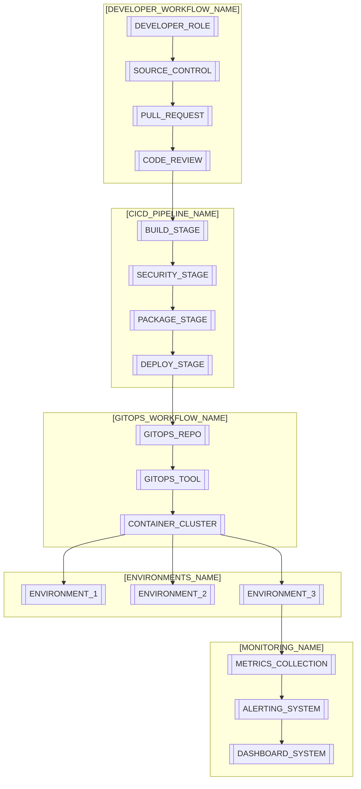
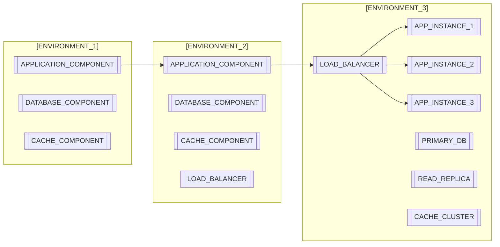
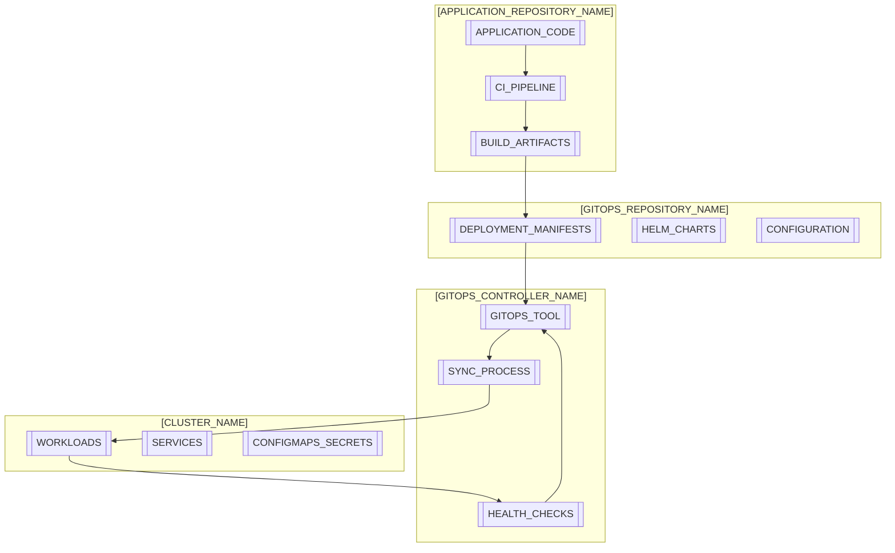
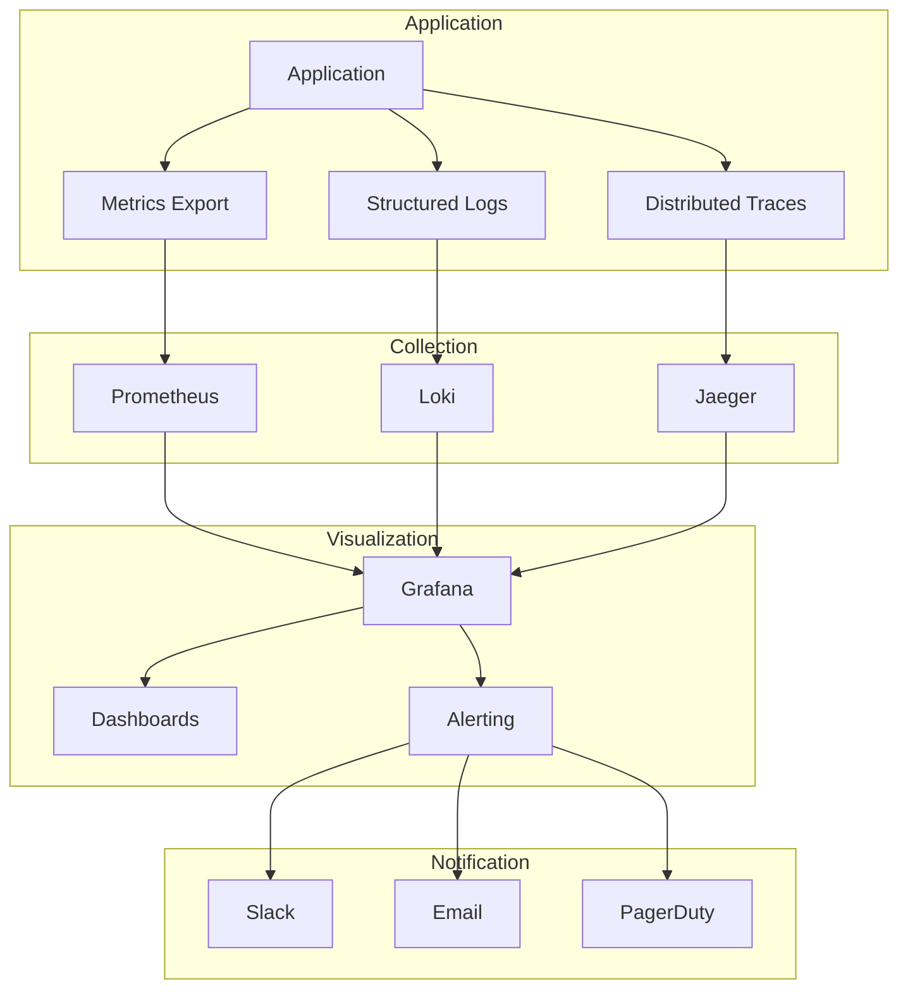
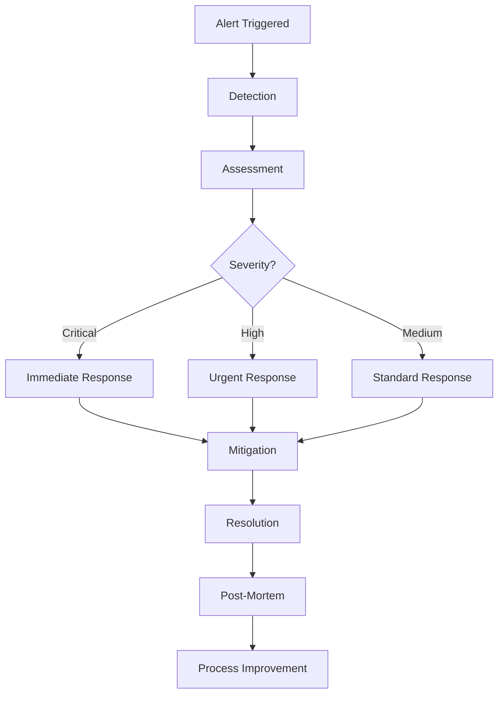

# Deployment Documentation
> **Purpose:** Comprehensive deployment guide following 2025 DevOps best practices. This document provides clear, step-by-step instructions for deploying applications across all environments with modern CI/CD practices, GitOps workflows, and cloud-native deployment strategies.

**Document Type:** Deployment Documentation  
**Version:** 3.0  
**Last Updated:** 2025-01-15  
**Template Status:** Production Ready - Enhanced with 2025 Best Practices

---

## Document Control
| Field | Value |
|-------|-------|
| **Project Name** | [PROJECT_NAME] |
| **Infrastructure Provider** | [CLOUD_PROVIDER] |
| **Deployment Strategy** | [DEPLOYMENT_STRATEGY] |
| **CI/CD Platform** | [CICD_PLATFORM] |
| **Last Updated** | [YYYY-MM-DD] |
| **Next Review** | [YYYY-MM-DD] |
| **DevOps Engineer** | [ENGINEER_NAME] |

---

## 📋 Table of Contents
- [🎯 Deployment Overview](#-deployment-overview)
- [🏗️ Infrastructure Architecture](#️-infrastructure-architecture)
- [🔧 Prerequisites & Setup](#-prerequisites--setup)
- [🌍 Environment Configuration](#-environment-configuration)
- [🚀 CI/CD Pipeline](#-cicd-pipeline)
- [📦 Deployment Strategies](#-deployment-strategies)
- [🔄 GitOps Workflow](#-gitops-workflow)
- [🛡️ Security & Compliance](#️-security--compliance)
- [📊 Monitoring & Observability](#-monitoring--observability)
- [🔙 Rollback Procedures](#-rollback-procedures)
- [🧪 Testing & Validation](#-testing--validation)
- [📈 Performance Optimization](#-performance-optimization)
- [🚨 Incident Response](#-incident-response)
- [📚 Troubleshooting Guide](#-troubleshooting-guide)

---

## 🎯 Deployment Overview

### Executive Summary
The [PROJECT_NAME] deployment strategy follows 2025 DevOps best practices, emphasizing GitOps workflows, progressive delivery, immutable infrastructure, and comprehensive observability. Our deployment approach ensures high availability, security, and rapid recovery capabilities.

### Deployment Philosophy
- **GitOps-First:** Git as single source of truth for infrastructure and applications
- **Progressive Delivery:** Gradual rollouts with feature flags and canary deployments
- **Immutable Infrastructure:** Infrastructure as Code with immutable deployments
- **Shift-Left Security:** Security integrated throughout the deployment pipeline
- **Observability-Driven:** Comprehensive monitoring and logging from deployment
- **AI-Enhanced:** Intelligent automation and predictive deployment optimization

### Key Metrics & Goals
| Metric | Target | Current | Status |
|--------|--------|---------|--------|
| **Deployment Frequency** | Multiple per day | [CURRENT] | [STATUS] |
| **Lead Time** | < 1 hour | [CURRENT] | [STATUS] |
| **MTTR (Mean Time to Recovery)** | < 15 minutes | [CURRENT] | [STATUS] |
| **Change Failure Rate** | < 5% | [CURRENT] | [STATUS] |
| **Deployment Success Rate** | > 99% | [CURRENT] | [STATUS] |

### Technology Stack
- **Cloud Provider:** [CLOUD_PROVIDER]
- **Container Platform:** [CONTAINER_PLATFORM]
- **CI/CD Platform:** [CICD_PLATFORM]
- **GitOps Tool:** [GITOPS_TOOL]
- **Infrastructure as Code:** [IAC_TOOL]
- **Monitoring:** [MONITORING_STACK]
- **Security Scanning:** [SECURITY_TOOLS]

---

## 🏗️ Infrastructure Architecture

### High-Level Architecture


### Environment Architecture


### Infrastructure Components

#### Core Infrastructure
- **[CONTAINER_PLATFORM] Clusters:** [DEPLOYMENT_TOPOLOGY] for [AVAILABILITY_STRATEGY]
- **Load Balancers:** [LOAD_BALANCER_TYPE] with [SSL_STRATEGY]
- **Databases:** [DATABASE_TOPOLOGY] with [BACKUP_STRATEGY]
- **Caching:** [CACHE_TECHNOLOGY] for [CACHING_PURPOSE]
- **Storage:** [STORAGE_TYPE] for [STORAGE_PURPOSE]
- **Networking:** [NETWORK_ARCHITECTURE] with [SECURITY_GROUPS]

#### Security Infrastructure
- **Identity & Access:** [IAM_SYSTEM] with [ACCESS_PRINCIPLE]
- **Secrets Management:** [SECRETS_MANAGER]
- **Network Security:** [SECURITY_TOOLS]
- **Certificate Management:** [CERTIFICATE_STRATEGY]
- **Compliance:** [COMPLIANCE_STANDARDS]

---

## 🔧 Prerequisites & Setup

### Required Tools & Access

#### Development Tools
```bash
# Required CLI tools
[RUNTIME_1] --version          # [RUNTIME_1] [VERSION_1]+
[CONTAINERIZATION_TOOL] --version        # [CONTAINERIZATION_TOOL] [VERSION_2]+
[CLUSTER_CLI] version         # [CLUSTER_CLI]
[PACKAGE_MANAGER] version           # [PACKAGE_MANAGER] [VERSION_3]+
[IAC_TOOL] --version    # [IAC_TOOL] [VERSION_4]+
[CLOUD_CLI] --version          # [CLOUD_CLI] [VERSION_5]+
```

#### Access Requirements
- **[SOURCE_CONTROL]:** [ACCESS_LEVEL_1] to [REPOSITORY_TYPE]
- **[CONTAINER_REGISTRY]:** [ACCESS_LEVEL_2] to [REGISTRY_TYPE]
- **[CLOUD_PROVIDER]:** [IAM_PERMISSIONS]
- **[CONTAINER_PLATFORM] Cluster:** [CLUSTER_ACCESS] with [DEPLOYMENT_PERMISSIONS]
- **[MONITORING_SYSTEMS]:** Access to [MONITORING_DASHBOARDS]

#### Environment Setup
```bash
# Clone repository
[SOURCE_CONTROL_COMMAND] clone [REPOSITORY_URL]
cd [PROJECT_NAME]

# Install dependencies
[DEPENDENCY_INSTALL_COMMAND]

# Configure [CLOUD_PROVIDER] CLI
[CLOUD_CLI] configure

# Configure [CLUSTER_CLI]
[CLOUD_CLI] [CLUSTER_UPDATE_COMMAND] --region [REGION] --name [CLUSTER_NAME]

# Verify access
[CLUSTER_CLI] get nodes
[IAC_TOOL] version
```

### Local Development Setup
```bash
# Environment variables
export PROJECT_NAME="[PROJECT_NAME]"
export [CLOUD_REGION_VAR]="[CLOUD_REGION]"
export CLUSTER_NAME="[CLUSTER_NAME]"
export REGISTRY_URL="[REGISTRY_URL]"

# [CONTAINERIZATION_TOOL] setup
[CONTAINERIZATION_TOOL] network create [NETWORK_NAME]

# Local database
[CONTAINERIZATION_TOOL] run -d --name [DATABASE_CONTAINER] \
  --network [NETWORK_NAME] \
  -e [DB_NAME_VAR]=[DATABASE_NAME] \
  -e [DB_USER_VAR]=[DATABASE_USER] \
  -e [DB_PASS_VAR]=[DATABASE_PASSWORD] \
  -p [DB_PORT]:[DB_PORT] \
  [DATABASE_IMAGE]

# Local [CACHE_SERVICE]
[CONTAINERIZATION_TOOL] run -d --name [CACHE_CONTAINER] \
  --network [NETWORK_NAME] \
  -p [CACHE_PORT]:[CACHE_PORT] \
  [CACHE_IMAGE]
```

---

## 🌍 Environment Configuration

### Environment Matrix
| Environment | Purpose | URL | Database | Monitoring |
|-------------|---------|-----|----------|------------|
| **[ENVIRONMENT_1]** | [ENV_1_PURPOSE] | [ENV_1_URL] | [ENV_1_DATABASE] | [ENV_1_MONITORING] |
| **[ENVIRONMENT_2]** | [ENV_2_PURPOSE] | [ENV_2_URL] | [ENV_2_DATABASE] | [ENV_2_MONITORING] |
| **[ENVIRONMENT_3]** | [ENV_3_PURPOSE] | [ENV_3_URL] | [ENV_3_DATABASE] | [ENV_3_MONITORING] |

### Environment Variables

#### [FRONTEND_TYPE] Configuration
| Variable | Description | [ENVIRONMENT_1] | [ENVIRONMENT_2] | [ENVIRONMENT_3] |
|----------|-------------|-------------|---------|------------|
| `[FRONTEND_API_VAR]` | Backend API endpoint | [ENV_1_API_URL] | [ENV_2_API_URL] | [ENV_3_API_URL] |
| `[FRONTEND_ENV_VAR]` | Environment identifier | [ENV_1_IDENTIFIER] | [ENV_2_IDENTIFIER] | [ENV_3_IDENTIFIER] |
| `[FRONTEND_ERROR_VAR]` | Error tracking DSN | [ENV_1_ERROR_DSN] | [ENV_2_ERROR_DSN] | [ENV_3_ERROR_DSN] |
| `[FRONTEND_ANALYTICS_VAR]` | Analytics tracking ID | [ENV_1_ANALYTICS] | [ENV_2_ANALYTICS] | [ENV_3_ANALYTICS] |
| `[FRONTEND_FLAGS_VAR]` | Feature flag configuration | [ENV_1_FLAGS] | [ENV_2_FLAGS] | [ENV_3_FLAGS] |

#### [BACKEND_TYPE] Configuration
| Variable | Description | [ENVIRONMENT_1] | [ENVIRONMENT_2] | [ENVIRONMENT_3] |
|----------|-------------|-------------|---------|------------|
| `[RUNTIME_ENV_VAR]` | [RUNTIME_1] environment | [ENV_1_IDENTIFIER] | [ENV_2_IDENTIFIER] | [ENV_3_IDENTIFIER] |
| `[PORT_VAR]` | Application port | [ENV_1_PORT] | [ENV_2_PORT] | [ENV_3_PORT] |
| `[DATABASE_URL_VAR]` | Database connection | [ENV_1_DB_CONNECTION] | [ENV_2_DB_CONNECTION] | [ENV_3_DB_CONNECTION] |
| `[CACHE_URL_VAR]` | [CACHE_SERVICE] connection | [ENV_1_CACHE_CONNECTION] | [ENV_2_CACHE_CONNECTION] | [ENV_3_CACHE_CONNECTION] |
| `[AUTH_SECRET_VAR]` | [AUTH_METHOD] signing secret | [ENV_1_AUTH_SECRET] | [ENV_2_AUTH_SECRET] | [ENV_3_AUTH_SECRET] |
| `[CLOUD_REGION_VAR]` | [CLOUD_PROVIDER] region | [ENV_1_REGION] | [ENV_2_REGION] | [ENV_3_REGION] |
| `[LOG_LEVEL_VAR]` | Logging level | [ENV_1_LOG_LEVEL] | [ENV_2_LOG_LEVEL] | [ENV_3_LOG_LEVEL] |

### Kubernetes Configuration

#### Namespace Setup
```yaml
# namespaces.yaml
apiVersion: v1
kind: Namespace
metadata:
  name: [APP_NAME]-[ENVIRONMENT_1]
  labels:
    environment: [ENVIRONMENT_1]
---
apiVersion: v1
kind: Namespace
metadata:
  name: [APP_NAME]-[ENVIRONMENT_2]
  labels:
    environment: [ENVIRONMENT_2]
---
apiVersion: v1
kind: Namespace
metadata:
  name: [APP_NAME]-[ENVIRONMENT_3]
  labels:
    environment: [ENVIRONMENT_3]
```

#### ConfigMap Example
```yaml
# configmap.yaml
apiVersion: v1
kind: ConfigMap
metadata:
  name: [APP_NAME]-config
  namespace: [APP_NAME]-[ENVIRONMENT_3]
data:
  [RUNTIME_ENV_VAR]: "[ENV_3_IDENTIFIER]"
  [PORT_VAR]: "[ENV_3_PORT]"
  [LOG_LEVEL_VAR]: "[ENV_3_LOG_LEVEL]"
  [CACHE_HOST_VAR]: "[CACHE_SERVICE]-cluster.[APP_NAME]-[ENVIRONMENT_3].svc.cluster.local"
  [CACHE_PORT_VAR]: "[CACHE_PORT]"
```

#### Secret Management
```yaml
# secrets.yaml
apiVersion: v1
kind: Secret
metadata:
  name: [APP_NAME]-secrets
  namespace: [APP_NAME]-[ENVIRONMENT_3]
type: Opaque
data:
  [DATABASE_URL_VAR]: [BASE64_ENCODED_DB_URL]
  [AUTH_SECRET_VAR]: [BASE64_ENCODED_AUTH_SECRET]
  [CLOUD_ACCESS_KEY_VAR]: [BASE64_ENCODED_ACCESS_KEY]
  [CLOUD_SECRET_KEY_VAR]: [BASE64_ENCODED_SECRET_KEY]
```

---

## 🚀 CI/CD Pipeline

### Pipeline Architecture

```mermaid
graph LR
    subgraph "[SOURCE_CONTROL_STAGE]"
        COMMIT[[CODE_COMMIT]]
        PR[[PULL_REQUEST]]
    end
    
    subgraph "[CI_PIPELINE_STAGE]"
        BUILD[[BUILD_AND_TEST]]
        LINT[[CODE_QUALITY]]
        SECURITY[[SECURITY_SCAN]]
        UNIT[[UNIT_TESTS]]
        INTEGRATION[[INTEGRATION_TESTS]]
    end
    
    subgraph "[CD_PIPELINE_STAGE]"
        PACKAGE[[PACKAGE_ARTIFACTS]]
        DEPLOY_DEV[[DEPLOY_TO_ENV1]]
        E2E[[E2E_TESTS]]
        DEPLOY_STAGING[[DEPLOY_TO_ENV2]]
        APPROVAL[[MANUAL_APPROVAL]]
        DEPLOY_PROD[[DEPLOY_TO_ENV3]]
    end
    
    subgraph "[POST_DEPLOYMENT_STAGE]"
        SMOKE[[SMOKE_TESTS]]
        MONITOR[[HEALTH_CHECKS]]
        NOTIFY[[NOTIFICATIONS]]
    end
    
    COMMIT --> BUILD
    PR --> BUILD
    BUILD --> LINT
    LINT --> SECURITY
    SECURITY --> UNIT
    UNIT --> INTEGRATION
    INTEGRATION --> PACKAGE
    PACKAGE --> DEPLOY_DEV
    DEPLOY_DEV --> E2E
    E2E --> DEPLOY_STAGING
    DEPLOY_STAGING --> APPROVAL
    APPROVAL --> DEPLOY_PROD
    DEPLOY_PROD --> SMOKE
    SMOKE --> MONITOR
    MONITOR --> NOTIFY
```


### [CICD_PLATFORM] Workflow
```yaml
# [WORKFLOW_PATH]/[WORKFLOW_FILE]
name: [WORKFLOW_NAME]

on:
  push:
    branches: [[MAIN_BRANCH], [DEVELOP_BRANCH]]
  pull_request:
    branches: [[MAIN_BRANCH]]

env:
  REGISTRY: [CONTAINER_REGISTRY]
  IMAGE_NAME: ${{ [REPOSITORY_VARIABLE] }}

jobs:
  [BUILD_JOB_NAME]:
    runs-on: [RUNNER_TYPE]
    steps:
      - name: [CHECKOUT_STEP_NAME]
        uses: [CHECKOUT_ACTION]

      - name: [SETUP_RUNTIME_STEP]
        uses: [SETUP_RUNTIME_ACTION]
        with:
          [RUNTIME_VERSION_PARAM]: '[RUNTIME_VERSION]'
          cache: '[PACKAGE_MANAGER]'

      - name: [INSTALL_DEPENDENCIES_STEP]
        run: [INSTALL_COMMAND]

      - name: [LINTING_STEP]
        run: [LINT_COMMAND]

      - name: [UNIT_TESTS_STEP]
        run: [UNIT_TEST_COMMAND]

      - name: [SECURITY_AUDIT_STEP]
        run: [SECURITY_AUDIT_COMMAND]

      - name: [BUILD_STEP]
        run: [BUILD_COMMAND]

  [SECURITY_JOB_NAME]:
    runs-on: [RUNNER_TYPE]
    needs: [BUILD_JOB_NAME]
    steps:
      - name: [CHECKOUT_STEP_NAME]
        uses: [CHECKOUT_ACTION]

      - name: [VULNERABILITY_SCAN_STEP]
        uses: [VULNERABILITY_SCANNER_ACTION]
        with:
          scan-type: '[SCAN_TYPE]'
          scan-ref: '[SCAN_REFERENCE]'

      - name: [SECURITY_TEST_STEP]
        uses: [SECURITY_TEST_ACTION]
        with:
          target: '[SECURITY_TEST_TARGET]'

  [BUILD_PUSH_JOB_NAME]:
    runs-on: [RUNNER_TYPE]
    needs: [[BUILD_JOB_NAME], [SECURITY_JOB_NAME]]
    if: [BRANCH_CONDITION]
    steps:
      - name: [CHECKOUT_STEP_NAME]
        uses: [CHECKOUT_ACTION]

      - name: [REGISTRY_LOGIN_STEP]
        uses: [REGISTRY_LOGIN_ACTION]
        with:
          registry: ${{ env.REGISTRY }}
          username: ${{ [USERNAME_VARIABLE] }}
          password: ${{ [PASSWORD_SECRET] }}

      - name: [BUILD_PUSH_STEP]
        uses: [BUILD_PUSH_ACTION]
        with:
          context: [BUILD_CONTEXT]
          push: [PUSH_FLAG]
          tags: |
            ${{ env.REGISTRY }}/${{ env.IMAGE_NAME }}:[LATEST_TAG]
            ${{ env.REGISTRY }}/${{ env.IMAGE_NAME }}:${{ [COMMIT_SHA_VARIABLE] }}

  [DEPLOY_ENV2_JOB_NAME]:
    runs-on: [RUNNER_TYPE]
    needs: [BUILD_PUSH_JOB_NAME]
    environment: [ENVIRONMENT_2]
    steps:
      - name: [DEPLOY_ENV2_STEP]
        run: |
          # Update [GITOPS_TOOL] repository with new image tag
          echo "Deploying to [ENVIRONMENT_2] with image: ${{ [COMMIT_SHA_VARIABLE] }}"

  [DEPLOY_ENV3_JOB_NAME]:
    runs-on: [RUNNER_TYPE]
    needs: [DEPLOY_ENV2_JOB_NAME]
    environment: [ENVIRONMENT_3]
    if: [BRANCH_CONDITION]
    steps:
      - name: [DEPLOY_ENV3_STEP]
        run: |
          # Update [GITOPS_TOOL] repository with new image tag
          echo "Deploying to [ENVIRONMENT_3] with image: ${{ [COMMIT_SHA_VARIABLE] }}"
```

### Pipeline Stages Explained

#### 1. [BUILD_TEST_STAGE_NAME]
- **Code Quality:** [CODE_QUALITY_TOOLS]
- **Unit Testing:** [UNIT_TEST_FRAMEWORK] with coverage reporting
- **Integration Testing:** [INTEGRATION_TEST_TYPES]
- **Security Scanning:** [SECURITY_SCAN_TYPES]
- **Build Artifacts:** [BUILD_ARTIFACT_PROCESS]

#### 2. [SECURITY_STAGE_NAME]
- **[SAST_TYPE]:** [SAST_DESCRIPTION]
- **[DAST_TYPE]:** [DAST_DESCRIPTION]
- **[CONTAINER_SCAN_TYPE]:** [CONTAINER_SCAN_DESCRIPTION]
- **[DEPENDENCY_SCAN_TYPE]:** [DEPENDENCY_SCAN_DESCRIPTION]
- **[COMPLIANCE_TYPE]:** [COMPLIANCE_DESCRIPTION]

#### 3. [DEPLOYMENT_STAGE_NAME]
- **[ARTIFACT_PACKAGING_TYPE]:** [ARTIFACT_PACKAGING_DESCRIPTION]
- **[ENVIRONMENT_PROMOTION_TYPE]:** [ENVIRONMENT_PROMOTION_DESCRIPTION]
- **[CONFIG_MANAGEMENT_TYPE]:** [CONFIG_MANAGEMENT_DESCRIPTION]
- **[DATABASE_MIGRATION_TYPE]:** [DATABASE_MIGRATION_DESCRIPTION]
- **[HEALTH_CHECK_TYPE]:** [HEALTH_CHECK_DESCRIPTION]

---

## 📦 Deployment Strategies

### Progressive Delivery Approach

#### Blue-Green Deployment
```yaml
# [BLUE_GREEN_CONFIG_FILE]
apiVersion: [ROLLOUT_API_VERSION]
kind: Rollout
metadata:
  name: [APP_NAME]-rollout
spec:
  replicas: [REPLICA_COUNT]
  strategy:
    blueGreen:
      activeService: [APP_NAME]-active
      previewService: [APP_NAME]-preview
      autoPromotionEnabled: [AUTO_PROMOTION_FLAG]
      scaleDownDelaySeconds: [SCALE_DOWN_DELAY]
      prePromotionAnalysis:
        templates:
        - templateName: [ANALYSIS_TEMPLATE_1]
        args:
        - name: [ANALYSIS_ARG_1]
          value: [APP_NAME]-preview
      postPromotionAnalysis:
        templates:
        - templateName: [ANALYSIS_TEMPLATE_1]
        args:
        - name: [ANALYSIS_ARG_1]
          value: [APP_NAME]-active
  selector:
    matchLabels:
      app: [APP_NAME]
  template:
    metadata:
      labels:
        app: [APP_NAME]
    spec:
      containers:
      - name: [CONTAINER_NAME]
        image: [IMAGE_NAME]:[IMAGE_TAG]
        ports:
        - containerPort: [CONTAINER_PORT]
```

#### Canary Deployment
```yaml
# [CANARY_CONFIG_FILE]
apiVersion: [ROLLOUT_API_VERSION]
kind: Rollout
metadata:
  name: [APP_NAME]-canary
spec:
  replicas: [REPLICA_COUNT]
  strategy:
    canary:
      steps:
      - setWeight: [WEIGHT_STEP_1]
      - pause: {duration: [PAUSE_DURATION_1]}
      - setWeight: [WEIGHT_STEP_2]
      - pause: {duration: [PAUSE_DURATION_1]}
      - setWeight: [WEIGHT_STEP_3]
      - pause: {duration: [PAUSE_DURATION_2]}
      - setWeight: [WEIGHT_STEP_4]
      canaryService: [APP_NAME]-canary
      stableService: [APP_NAME]-stable
      trafficRouting:
        [TRAFFIC_ROUTING_PROVIDER]:
          virtualService:
            name: [APP_NAME]-vs
            routes:
            - [ROUTE_NAME]
      analysis:
        templates:
        - templateName: [ANALYSIS_TEMPLATE_1]
        startingStep: [ANALYSIS_START_STEP]
        args:
        - name: [ANALYSIS_ARG_1]
          value: [APP_NAME]-canary
```

#### Feature Flag Integration
```javascript
// [FEATURE_FLAGS_FILE]
import { [FEATURE_FLAG_PROVIDER] } from '[FEATURE_FLAG_SDK]';

const client = [FEATURE_FLAG_PROVIDER].init(process.env.[FEATURE_FLAG_SDK_KEY]);

export const getFeatureFlag = async (flagKey, user, defaultValue = [DEFAULT_FLAG_VALUE]) => {
  try {
    await client.waitForInitialization();
    return await client.variation(flagKey, user, defaultValue);
  } catch (error) {
    console.error('[FEATURE_FLAG_ERROR_MESSAGE]:', error);
    return defaultValue;
  }
};

// Usage in application
const [FEATURE_FLAG_VARIABLE] = await getFeatureFlag('[FEATURE_FLAG_KEY]', {
  key: [USER_ID_VARIABLE],
  email: [USER_EMAIL_VARIABLE],
  custom: { environment: process.env.[ENVIRONMENT_VARIABLE] }
});
```

### Deployment Patterns

#### Rolling Updates
```yaml
# [ROLLING_UPDATE_CONFIG_FILE]
apiVersion: [DEPLOYMENT_API_VERSION]
kind: Deployment
metadata:
  name: [APP_NAME]-deployment
spec:
  replicas: [REPLICA_COUNT]
  strategy:
    type: RollingUpdate
    rollingUpdate:
      maxUnavailable: [MAX_UNAVAILABLE]
      maxSurge: [MAX_SURGE]
  selector:
    matchLabels:
      app: [APP_NAME]
  template:
    metadata:
      labels:
        app: [APP_NAME]
    spec:
      containers:
      - name: [CONTAINER_NAME]
        image: [IMAGE_NAME]:[IMAGE_TAG]
        readinessProbe:
          httpGet:
            path: [HEALTH_CHECK_PATH]
            port: [CONTAINER_PORT]
          initialDelaySeconds: [READINESS_INITIAL_DELAY]
          periodSeconds: [READINESS_PERIOD]
        livenessProbe:
          httpGet:
            path: [HEALTH_CHECK_PATH]
            port: [CONTAINER_PORT]
          initialDelaySeconds: [LIVENESS_INITIAL_DELAY]
          periodSeconds: [LIVENESS_PERIOD]
```

#### Immutable Deployments
```bash
#!/bin/bash
# [IMMUTABLE_DEPLOYMENT_SCRIPT]

# Build immutable image
[IMAGE_TAG_VARIABLE]=$([VERSION_COMMAND])
[CONTAINER_BUILD_COMMAND] -t [APP_NAME]:$[IMAGE_TAG_VARIABLE] .

# Push to registry
[CONTAINER_PUSH_COMMAND] [REGISTRY_URL]/[APP_NAME]:$[IMAGE_TAG_VARIABLE]

# Deploy new version
[DEPLOYMENT_COMMAND] set image deployment/[APP_NAME]-deployment [CONTAINER_NAME]=[REGISTRY_URL]/[APP_NAME]:$[IMAGE_TAG_VARIABLE]

# Wait for rollout
[DEPLOYMENT_COMMAND] rollout status deployment/[APP_NAME]-deployment

# Verify deployment
[DEPLOYMENT_COMMAND] get pods -l app=[APP_NAME]
```

---

## 🔄 GitOps Workflow

### GitOps Architecture


### ArgoCD Application Configuration
```yaml
# [GITOPS_APPLICATION_CONFIG_FILE]
apiVersion: [GITOPS_API_VERSION]
kind: Application
metadata:
  name: [APP_NAME]-[ENVIRONMENT_3]
  namespace: [GITOPS_NAMESPACE]
spec:
  project: [GITOPS_PROJECT]
  source:
    repoURL: [GITOPS_REPOSITORY_URL]
    targetRevision: [TARGET_REVISION]
    path: [ENVIRONMENT_PATH]/[ENVIRONMENT_3]
    helm:
      valueFiles:
      - [VALUES_FILE]
      - [ENV_SPECIFIC_VALUES_FILE]
  destination:
    server: [CLUSTER_SERVER_URL]
    namespace: [APP_NAME]-[ENVIRONMENT_3]
  syncPolicy:
    automated:
      prune: [AUTO_PRUNE_FLAG]
      selfHeal: [AUTO_HEAL_FLAG]
      allowEmpty: [ALLOW_EMPTY_FLAG]
    syncOptions:
    - [SYNC_OPTION_1]
    - [SYNC_OPTION_2]
    - [SYNC_OPTION_3]
    retry:
      limit: [RETRY_LIMIT]
      backoff:
        duration: [BACKOFF_DURATION]
        factor: [BACKOFF_FACTOR]
        maxDuration: [MAX_BACKOFF_DURATION]
```

### Helm Chart Structure
```
[CHARTS_DIRECTORY]/
├── [APP_NAME]/
│   ├── [CHART_METADATA_FILE]
│   ├── [DEFAULT_VALUES_FILE]
│   ├── [TEMPLATES_DIRECTORY]/
│   │   ├── [DEPLOYMENT_TEMPLATE]
│   │   ├── [SERVICE_TEMPLATE]
│   │   ├── [INGRESS_TEMPLATE]
│   │   ├── [CONFIGMAP_TEMPLATE]
│   │   └── [SECRET_TEMPLATE]
│   └── [VALUES_DIRECTORY]/
│       ├── [ENV1_VALUES_FILE]
│       ├── [ENV2_VALUES_FILE]
│       └── [ENV3_VALUES_FILE]
```

#### Helm Values Example
```yaml
# [ENV3_VALUES_FILE]
replicaCount: [ENV3_REPLICA_COUNT]

image:
  repository: [IMAGE_REPOSITORY]
  tag: "[IMAGE_TAG]"
  pullPolicy: [PULL_POLICY]

service:
  type: [SERVICE_TYPE]
  port: [SERVICE_PORT]
  targetPort: [TARGET_PORT]

ingress:
  enabled: [INGRESS_ENABLED]
  className: "[INGRESS_CLASS]"
  annotations:
    [CERT_MANAGER_ANNOTATION]: "[CERT_ISSUER]"
    [RATE_LIMIT_ANNOTATION]: "[RATE_LIMIT_VALUE]"
  hosts:
    - host: [DOMAIN_NAME]
      paths:
        - path: [PATH]
          pathType: [PATH_TYPE]
  tls:
    - secretName: [TLS_SECRET_NAME]
      hosts:
        - [DOMAIN_NAME]

resources:
  limits:
    cpu: [CPU_LIMIT]
    memory: [MEMORY_LIMIT]
  requests:
    cpu: [CPU_REQUEST]
    memory: [MEMORY_REQUEST]

autoscaling:
  enabled: [AUTOSCALING_ENABLED]
  minReplicas: [MIN_REPLICAS]
  maxReplicas: [MAX_REPLICAS]
  targetCPUUtilizationPercentage: [CPU_TARGET]
  targetMemoryUtilizationPercentage: [MEMORY_TARGET]

nodeSelector:
  [NODE_SELECTOR_KEY]: [NODE_SELECTOR_VALUE]

tolerationsL [TOLERATIONS_LIST]

affinity:
  podAntiAffinity:
    preferredDuringSchedulingIgnoredDuringExecution:
    - weight: [AFFINITY_WEIGHT]
      podAffinityTerm:
        labelSelector:
          matchExpressions:
          - key: [LABEL_KEY]
            operator: [OPERATOR]
            values:
            - [APP_NAME]
        topologyKey: [TOPOLOGY_KEY]
```

---

## 🛡️ Security & Compliance

### Security-First Deployment

#### Container Security
```dockerfile
# Dockerfile with security best practices
FROM node:18-alpine AS builder

# Create non-root user
RUN addgroup -g 1001 -S nodejs
RUN adduser -S nextjs -u 1001

# Set working directory
WORKDIR /app

# Copy package files
COPY package*.json ./

# Install dependencies
RUN npm ci --only=production && npm cache clean --force

# Copy source code
COPY . .

# Build application
RUN npm run build

# Production stage
FROM node:18-alpine AS runner

# Install security updates
RUN apk update && apk upgrade

# Create non-root user
RUN addgroup -g 1001 -S nodejs
RUN adduser -S nextjs -u 1001

WORKDIR /app

# Copy built application
COPY --from=builder --chown=nextjs:nodejs /app/dist ./dist
COPY --from=builder --chown=nextjs:nodejs /app/node_modules ./node_modules
COPY --from=builder --chown=nextjs:nodejs /app/package.json ./package.json

# Switch to non-root user
USER nextjs

# Expose port
EXPOSE 3000

# Health check
HEALTHCHECK --interval=30s --timeout=3s --start-period=5s --retries=3 \
  CMD curl -f http://localhost:3000/health || exit 1

# Start application
CMD ["npm", "start"]
```

#### Security Scanning Pipeline
```yaml
# security-scan.yml
name: Security Scan

on:
  push:
    branches: [main, develop]
  pull_request:
    branches: [main]

jobs:
  security-scan:
    runs-on: ubuntu-latest
    steps:
      - name: Checkout code
        uses: actions/checkout@v4

      - name: Run Trivy vulnerability scanner
        uses: aquasecurity/trivy-action@master
        with:
          scan-type: 'fs'
          scan-ref: '.'
          format: 'sarif'
          output: 'trivy-results.sarif'

      - name: Upload Trivy scan results
        uses: github/codeql-action/upload-sarif@v2
        with:
          sarif_file: 'trivy-results.sarif'

      - name: Run Snyk security scan
        uses: snyk/actions/node@master
        env:
          SNYK_TOKEN: ${{ secrets.SNYK_TOKEN }}
        with:
          args: --severity-threshold=high

      - name: Run OWASP ZAP scan
        uses: zaproxy/action-baseline@v0.7.0
        with:
          target: 'http://localhost:3000'
```

#### Network Security Policies
```yaml
# network-policy.yaml
apiVersion: networking.k8s.io/v1
kind: NetworkPolicy
metadata:
  name: app-network-policy
  namespace: app-production
spec:
  podSelector:
    matchLabels:
      app: myapp
  policyTypes:
  - Ingress
  - Egress
  ingress:
  - from:
    - namespaceSelector:
        matchLabels:
          name: ingress-nginx
    ports:
    - protocol: TCP
      port: 8080
  egress:
  - to:
    - namespaceSelector:
        matchLabels:
          name: database
    ports:
    - protocol: TCP
      port: 5432
  - to: []
    ports:
    - protocol: TCP
      port: 443
    - protocol: TCP
      port: 80
```

### Compliance & Governance

#### RBAC Configuration
```yaml
# rbac.yaml
apiVersion: rbac.authorization.k8s.io/v1
kind: Role
metadata:
  namespace: app-production
  name: app-deployer
rules:
- apiGroups: [""]
  resources: ["pods", "services", "configmaps", "secrets"]
  verbs: ["get", "list", "watch", "create", "update", "patch", "delete"]
- apiGroups: ["apps"]
  resources: ["deployments", "replicasets"]
  verbs: ["get", "list", "watch", "create", "update", "patch", "delete"]
---
apiVersion: rbac.authorization.k8s.io/v1
kind: RoleBinding
metadata:
  name: app-deployer-binding
  namespace: app-production
subjects:
- kind: ServiceAccount
  name: app-deployer
  namespace: app-production
roleRef:
  kind: Role
  name: app-deployer
  apiGroup: rbac.authorization.k8s.io
```

#### Pod Security Standards
```yaml
# pod-security-policy.yaml
apiVersion: v1
kind: Pod
metadata:
  name: secure-app
  annotations:
    seccomp.security.alpha.kubernetes.io/pod: runtime/default
spec:
  securityContext:
    runAsNonRoot: true
    runAsUser: 1001
    fsGroup: 1001
    seccompProfile:
      type: RuntimeDefault
  containers:
  - name: app
    image: myapp:latest
    securityContext:
      allowPrivilegeEscalation: false
      readOnlyRootFilesystem: true
      runAsNonRoot: true
      runAsUser: 1001
      capabilities:
        drop:
        - ALL
    volumeMounts:
    - name: tmp
      mountPath: /tmp
    - name: cache
      mountPath: /app/cache
  volumes:
  - name: tmp
    emptyDir: {}
  - name: cache
    emptyDir: {}
```

---

## 📊 Monitoring & Observability

### Observability Stack


### Prometheus Configuration
```yaml
# prometheus-config.yaml
global:
  scrape_interval: 15s
  evaluation_interval: 15s

rule_files:
  - "alert-rules.yml"

scrape_configs:
  - job_name: 'kubernetes-pods'
    kubernetes_sd_configs:
    - role: pod
    relabel_configs:
    - source_labels: [__meta_kubernetes_pod_annotation_prometheus_io_scrape]
      action: keep
      regex: true
    - source_labels: [__meta_kubernetes_pod_annotation_prometheus_io_path]
      action: replace
      target_label: __metrics_path__
      regex: (.+)

alerting:
  alertmanagers:
  - static_configs:
    - targets:
      - alertmanager:9093
```

### Application Metrics
```javascript
// metrics.js
import prometheus from 'prom-client';

// Create a Registry
const register = new prometheus.Registry();

// Add default metrics
prometheus.collectDefaultMetrics({ register });

// Custom metrics
const httpRequestDuration = new prometheus.Histogram({
  name: 'http_request_duration_seconds',
  help: 'Duration of HTTP requests in seconds',
  labelNames: ['method', 'route', 'status_code'],
  buckets: [0.1, 0.3, 0.5, 0.7, 1, 3, 5, 7, 10]
});

const httpRequestTotal = new prometheus.Counter({
  name: 'http_requests_total',
  help: 'Total number of HTTP requests',
  labelNames: ['method', 'route', 'status_code']
});

const activeConnections = new prometheus.Gauge({
  name: 'active_connections',
  help: 'Number of active connections'
});

register.registerMetric(httpRequestDuration);
register.registerMetric(httpRequestTotal);
register.registerMetric(activeConnections);

// Middleware for Express
export const metricsMiddleware = (req, res, next) => {
  const start = Date.now();
  
  res.on('finish', () => {
    const duration = (Date.now() - start) / 1000;
    const labels = {
      method: req.method,
      route: req.route?.path || req.path,
      status_code: res.statusCode
    };
    
    httpRequestDuration.observe(labels, duration);
    httpRequestTotal.inc(labels);
  });
  
  next();
};

// Metrics endpoint
export const metricsHandler = async (req, res) => {
  res.set('Content-Type', register.contentType);
  res.end(await register.metrics());
};
```

### Grafana Dashboard
```json
{
  "dashboard": {
    "title": "Application Dashboard",
    "panels": [
      {
        "title": "Request Rate",
        "type": "graph",
        "targets": [
          {
            "expr": "rate(http_requests_total[5m])",
            "legendFormat": "{{method}} {{route}}"
          }
        ]
      },
      {
        "title": "Response Time",
        "type": "graph",
        "targets": [
          {
            "expr": "histogram_quantile(0.95, rate(http_request_duration_seconds_bucket[5m]))",
            "legendFormat": "95th percentile"
          }
        ]
      },
      {
        "title": "Error Rate",
        "type": "singlestat",
        "targets": [
          {
            "expr": "rate(http_requests_total{status_code=~\"5..\"}[5m]) / rate(http_requests_total[5m]) * 100",
            "legendFormat": "Error Rate %"
          }
        ]
      }
    ]
  }
}
```

### Alert Rules
```yaml
# alert-rules.yml
groups:
- name: application-alerts
  rules:
  - alert: HighErrorRate
    expr: rate(http_requests_total{status_code=~"5.."}[5m]) / rate(http_requests_total[5m]) > 0.05
    for: 5m
    labels:
      severity: critical
    annotations:
      summary: "High error rate detected"
      description: "Error rate is {{ $value | humanizePercentage }} for the last 5 minutes"

  - alert: HighResponseTime
    expr: histogram_quantile(0.95, rate(http_request_duration_seconds_bucket[5m])) > 1
    for: 5m
    labels:
      severity: warning
    annotations:
      summary: "High response time detected"
      description: "95th percentile response time is {{ $value }}s"

  - alert: PodCrashLooping
    expr: rate(kube_pod_container_status_restarts_total[15m]) > 0
    for: 5m
    labels:
      severity: critical
    annotations:
      summary: "Pod is crash looping"
      description: "Pod {{ $labels.pod }} in namespace {{ $labels.namespace }} is crash looping"
```

---

## 🔙 Rollback Procedures

### Automated Rollback Strategies

#### Health Check-Based Rollback
```yaml
# rollback-policy.yaml
apiVersion: argoproj.io/v1alpha1
kind: AnalysisTemplate
metadata:
  name: success-rate
spec:
  args:
  - name: service-name
  metrics:
  - name: success-rate
    interval: 30s
    count: 5
    successCondition: result[0] >= 0.95
    failureLimit: 3
    provider:
      prometheus:
        address: http://prometheus:9090
        query: |
          sum(rate(http_requests_total{service="{{args.service-name}}",status_code!~"5.."}[2m])) /
          sum(rate(http_requests_total{service="{{args.service-name}}"}[2m]))
```

#### Manual Rollback Commands
```bash
#!/bin/bash
# rollback.sh

# Get current deployment
CURRENT_REVISION=$(kubectl rollout history deployment/app-deployment -n app-production --revision=0 | tail -1 | awk '{print $1}')
PREVIOUS_REVISION=$((CURRENT_REVISION - 1))

echo "Current revision: $CURRENT_REVISION"
echo "Rolling back to revision: $PREVIOUS_REVISION"

# Rollback deployment
kubectl rollout undo deployment/app-deployment -n app-production --to-revision=$PREVIOUS_REVISION

# Wait for rollback to complete
kubectl rollout status deployment/app-deployment -n app-production --timeout=300s

# Verify rollback
kubectl get pods -n app-production -l app=myapp

# Check application health
kubectl exec -n app-production deployment/app-deployment -- curl -f http://localhost:8080/health

echo "Rollback completed successfully"
```

#### Database Rollback Strategy
```sql
-- Database migration rollback
-- migrations/rollback_v2.1.0.sql

BEGIN;

-- Rollback schema changes
ALTER TABLE users DROP COLUMN new_feature_column;

-- Rollback data changes
UPDATE users SET status = 'active' WHERE status = 'new_status';

-- Verify rollback
SELECT COUNT(*) FROM users WHERE status NOT IN ('active', 'inactive');

-- If verification passes, commit
COMMIT;

-- If verification fails, rollback
-- ROLLBACK;
```

### Rollback Decision Matrix
| Scenario | Trigger | Action | Recovery Time |
|----------|---------|--------|---------------|
| **High Error Rate** | >5% 5xx errors | Automatic rollback | < 2 minutes |
| **Performance Degradation** | >2s response time | Automatic rollback | < 2 minutes |
| **Health Check Failure** | Health endpoint fails | Automatic rollback | < 1 minute |
| **Memory/CPU Issues** | Resource exhaustion | Automatic rollback | < 3 minutes |
| **Database Issues** | Connection failures | Manual rollback | < 5 minutes |
| **Security Incident** | Security alert | Manual rollback | < 1 minute |

---

## 🧪 Testing & Validation

### Testing Pipeline

```mermaid
graph LR
    subgraph "Pre-Deployment"
        UNIT[Unit Tests]
        INTEGRATION[Integration Tests]
        CONTRACT[Contract Tests]
        SECURITY[Security Tests]
    end
    
    subgraph "Post-Deployment"
        SMOKE[Smoke Tests]
        E2E[E2E Tests]
        LOAD[Load Tests]
        CHAOS[Chaos Tests]
    end
    
    subgraph "Continuous"
        SYNTHETIC[Synthetic Tests]
        MONITOR[Health Monitoring]
        ALERTS[Alert Validation]
    end
    
    UNIT --> INTEGRATION
    INTEGRATION --> CONTRACT
    CONTRACT --> SECURITY
    SECURITY --> SMOKE
    SMOKE --> E2E
    E2E --> LOAD
    LOAD --> CHAOS
    CHAOS --> SYNTHETIC
    SYNTHETIC --> MONITOR
    MONITOR --> ALERTS
```


### Automated Testing
```javascript
// smoke-tests.js
import axios from 'axios';

const BASE_URL = process.env.BASE_URL || 'http://localhost:3000';

describe('Smoke Tests', () => {
  test('Health endpoint responds', async () => {
    const response = await axios.get(`${BASE_URL}/health`);
    expect(response.status).toBe(200);
    expect(response.data.status).toBe('healthy');
  });

  test('API endpoints are accessible', async () => {
    const endpoints = ['/api/users', '/api/projects', '/api/tasks'];
    
    for (const endpoint of endpoints) {
      const response = await axios.get(`${BASE_URL}${endpoint}`);
      expect(response.status).toBeLessThan(500);
    }
  });

  test('Database connectivity', async () => {
    const response = await axios.get(`${BASE_URL}/api/health/database`);
    expect(response.status).toBe(200);
    expect(response.data.database).toBe('connected');
  });

  test('External service connectivity', async () => {
    const response = await axios.get(`${BASE_URL}/api/health/external`);
    expect(response.status).toBe(200);
    expect(response.data.external_services).toEqual(
      expect.objectContaining({
        redis: 'connected',
        email_service: 'connected'
      })
    );
  });
});
```

### Load Testing
```javascript
// load-test.js
import http from 'k6/http';
import { check, sleep } from 'k6';

export let options = {
  stages: [
    { duration: '2m', target: 100 }, // Ramp up
    { duration: '5m', target: 100 }, // Stay at 100 users
    { duration: '2m', target: 200 }, // Ramp up to 200 users
    { duration: '5m', target: 200 }, // Stay at 200 users
    { duration: '2m', target: 0 },   // Ramp down
  ],
  thresholds: {
    http_req_duration: ['p(95)<500'], // 95% of requests under 500ms
    http_req_failed: ['rate<0.05'],   // Error rate under 5%
  },
};

export default function () {
  const BASE_URL = 'https://api.company.com';
  
  // Test API endpoints
  let response = http.get(`${BASE_URL}/api/users`);
  check(response, {
    'status is 200': (r) => r.status === 200,
    'response time < 500ms': (r) => r.timings.duration < 500,
  });

  response = http.post(`${BASE_URL}/api/tasks`, {
    title: 'Load test task',
    description: 'Created during load test',
  });
  check(response, {
    'task created': (r) => r.status === 201,
  });

  sleep(1);
}
```

### Chaos Engineering
```yaml
# chaos-experiment.yaml
apiVersion: litmuschaos.io/v1alpha1
kind: ChaosEngine
metadata:
  name: app-chaos
  namespace: app-production
spec:
  appinfo:
    appns: app-production
    applabel: 'app=myapp'
    appkind: 'deployment'
  chaosServiceAccount: litmus-admin
  experiments:
  - name: pod-delete
    spec:
      components:
        env:
        - name: TOTAL_CHAOS_DURATION
          value: '30'
        - name: CHAOS_INTERVAL
          value: '10'
        - name: FORCE
          value: 'false'
  - name: container-kill
    spec:
      components:
        env:
        - name: TARGET_CONTAINER
          value: 'app'
        - name: CHAOS_DURATION
          value: '20'
```

---

## 📈 Performance Optimization

### Resource Management
```yaml
# resource-optimization.yaml
apiVersion: apps/v1
kind: Deployment
metadata:
  name: app-deployment
spec:
  replicas: 3
  template:
    spec:
      containers:
      - name: app
        image: myapp:latest
        resources:
          requests:
            memory: "256Mi"
            cpu: "250m"
          limits:
            memory: "512Mi"
            cpu: "500m"
        env:
        - name: NODE_OPTIONS
          value: "--max-old-space-size=400"
---
apiVersion: autoscaling/v2
kind: HorizontalPodAutoscaler
metadata:
  name: app-hpa
spec:
  scaleTargetRef:
    apiVersion: apps/v1
    kind: Deployment
    name: app-deployment
  minReplicas: 3
  maxReplicas: 20
  metrics:
  - type: Resource
    resource:
      name: cpu
      target:
        type: Utilization
        averageUtilization: 70
  - type: Resource
    resource:
      name: memory
      target:
        type: Utilization
        averageUtilization: 80
  behavior:
    scaleDown:
      stabilizationWindowSeconds: 300
      policies:
      - type: Percent
        value: 10
        periodSeconds: 60
    scaleUp:
      stabilizationWindowSeconds: 60
      policies:
      - type: Percent
        value: 50
        periodSeconds: 60
```

### Caching Strategy
```javascript
// caching.js
import Redis from 'ioredis';

const redis = new Redis({
  host: process.env.REDIS_HOST,
  port: process.env.REDIS_PORT,
  retryDelayOnFailover: 100,
  maxRetriesPerRequest: 3,
});

// Cache middleware
export const cacheMiddleware = (ttl = 300) => {
  return async (req, res, next) => {
    const key = `cache:${req.method}:${req.originalUrl}`;
    
    try {
      const cached = await redis.get(key);
      if (cached) {
        return res.json(JSON.parse(cached));
      }
      
      // Store original send function
      const originalSend = res.json;
      
      // Override send function to cache response
      res.json = function(data) {
        redis.setex(key, ttl, JSON.stringify(data));
        return originalSend.call(this, data);
      };
      
      next();
    } catch (error) {
      console.error('Cache error:', error);
      next();
    }
  };
};

// Database query caching
export const getCachedData = async (key, fetchFunction, ttl = 300) => {
  try {
    const cached = await redis.get(key);
    if (cached) {
      return JSON.parse(cached);
    }
    
    const data = await fetchFunction();
    await redis.setex(key, ttl, JSON.stringify(data));
    return data;
  } catch (error) {
    console.error('Cache error:', error);
    return await fetchFunction();
  }
};
```

### Database Optimization
```sql
-- Database performance optimization

-- Indexes for common queries
CREATE INDEX CONCURRENTLY idx_users_email_active 
ON users(email) WHERE status = 'active';

CREATE INDEX CONCURRENTLY idx_tasks_project_status_created 
ON tasks(project_id, status, created_at);

CREATE INDEX CONCURRENTLY idx_audit_logs_created_at_entity 
ON audit_logs(created_at, entity_type) WHERE created_at >= NOW() - INTERVAL '30 days';

-- Partitioning for large tables
CREATE TABLE audit_logs_2025_01 PARTITION OF audit_logs
FOR VALUES FROM ('2025-01-01') TO ('2025-02-01');

-- Connection pooling configuration
-- postgresql.conf
max_connections = 200
shared_buffers = 256MB
effective_cache_size = 1GB
work_mem = 4MB
maintenance_work_mem = 64MB
checkpoint_completion_target = 0.9
wal_buffers = 16MB
default_statistics_target = 100
```

---

## 🚨 Incident Response

### Incident Response Workflow


### Incident Severity Levels
| Severity | Description | Response Time | Escalation |
|----------|-------------|---------------|------------|
| **Critical** | Service completely down | 5 minutes | Immediate page |
| **High** | Major functionality impaired | 15 minutes | Phone call |
| **Medium** | Minor functionality affected | 1 hour | Email/Slack |
| **Low** | Cosmetic or documentation issues | 24 hours | Ticket |

### Runbook Templates
```markdown
# Incident Runbook: High CPU Usage

## Symptoms
- High CPU utilization alerts
- Slow response times
- Potential service degradation

## Investigation Steps
1. Check current CPU usage:
   ```bash
   kubectl top pods -n app-production
   ```

2. Check application metrics:
   ```bash
   curl http://prometheus:9090/api/v1/query?query=rate(cpu_usage_seconds_total[5m])
   ```

3. Review recent deployments:
   ```bash
   kubectl rollout history deployment/app-deployment -n app-production
   ```

## Mitigation Steps
1. Scale up replicas:
   ```bash
   kubectl scale deployment app-deployment --replicas=10 -n app-production
   ```

2. If issue persists, rollback:
   ```bash
   kubectl rollout undo deployment/app-deployment -n app-production
   ```

3. Monitor recovery:
   ```bash
   kubectl get pods -n app-production -w
   ```

## Post-Incident Actions
- [ ] Document root cause
- [ ] Update monitoring thresholds
- [ ] Review resource limits
- [ ] Schedule post-mortem meeting
```

### Automated Incident Response
```yaml
# incident-response.yaml
apiVersion: v1
kind: ConfigMap
metadata:
  name: incident-response-scripts
data:
  scale-up.sh: |
    #!/bin/bash
    kubectl scale deployment app-deployment --replicas=10 -n app-production
    echo "Scaled up to 10 replicas due to high load"
  
  emergency-rollback.sh: |
    #!/bin/bash
    kubectl rollout undo deployment/app-deployment -n app-production
    kubectl rollout status deployment/app-deployment -n app-production
    echo "Emergency rollback completed"
  
  health-check.sh: |
    #!/bin/bash
    for i in {1..10}; do
      if curl -f http://app-service/health; then
        echo "Health check passed"
        exit 0
      fi
      sleep 30
    done
    echo "Health check failed after 5 minutes"
    exit 1
```

---

## 📚 Troubleshooting Guide

### Common Issues & Solutions

#### Deployment Failures
```bash
# Check deployment status
kubectl describe deployment app-deployment -n app-production

# Check pod events
kubectl get events -n app-production --sort-by='.lastTimestamp'

# Check pod logs
kubectl logs -f deployment/app-deployment -n app-production

# Check resource constraints
kubectl describe nodes
kubectl top nodes
kubectl top pods -n app-production
```

#### Database Connection Issues
```bash
# Test database connectivity
kubectl exec -it deployment/app-deployment -n app-production -- \
  psql $DATABASE_URL -c "SELECT 1;"

# Check database pod status
kubectl get pods -n database -l app=postgresql

# Check database logs
kubectl logs -f deployment/postgresql -n database

# Verify secrets
kubectl get secret app-secrets -n app-production -o yaml
```

#### Performance Issues
```bash
# Check application metrics
curl http://prometheus:9090/api/v1/query?query=rate(http_requests_total[5m])

# Check resource usage
kubectl top pods -n app-production

# Check HPA status
kubectl get hpa -n app-production

# Check node resources
kubectl describe nodes
```

### Diagnostic Commands
```bash
#!/bin/bash
# diagnostic.sh - Comprehensive system diagnostics

echo "=== Deployment Status ==="
kubectl get deployments -n app-production

echo "=== Pod Status ==="
kubectl get pods -n app-production -o wide

echo "=== Service Status ==="
kubectl get services -n app-production

echo "=== Ingress Status ==="
kubectl get ingress -n app-production

echo "=== Recent Events ==="
kubectl get events -n app-production --sort-by='.lastTimestamp' | tail -20

echo "=== Resource Usage ==="
kubectl top pods -n app-production

echo "=== HPA Status ==="
kubectl get hpa -n app-production

echo "=== Application Logs (last 50 lines) ==="
kubectl logs --tail=50 deployment/app-deployment -n app-production

echo "=== Health Check ==="
kubectl exec deployment/app-deployment -n app-production -- curl -f http://localhost:8080/health
```

### Emergency Procedures
```bash
#!/bin/bash
# emergency-procedures.sh

# Emergency scale up
emergency_scale_up() {
  echo "Scaling up application..."
  kubectl scale deployment app-deployment --replicas=20 -n app-production
  kubectl rollout status deployment/app-deployment -n app-production
}

# Emergency rollback
emergency_rollback() {
  echo "Performing emergency rollback..."
  kubectl rollout undo deployment/app-deployment -n app-production
  kubectl rollout status deployment/app-deployment -n app-production
}

# Circuit breaker activation
activate_circuit_breaker() {
  echo "Activating circuit breaker..."
  kubectl patch configmap app-config -n app-production \
    --patch '{"data":{"CIRCUIT_BREAKER_ENABLED":"true"}}'
  kubectl rollout restart deployment/app-deployment -n app-production
}

# Maintenance mode
enable_maintenance_mode() {
  echo "Enabling maintenance mode..."
  kubectl patch ingress app-ingress -n app-production \
    --patch '{"metadata":{"annotations":{"nginx.ingress.kubernetes.io/default-backend":"maintenance-service"}}}'
}

# Usage
case "$1" in
  scale-up)
    emergency_scale_up
    ;;
  rollback)
    emergency_rollback
    ;;
  circuit-breaker)
    activate_circuit_breaker
    ;;
  maintenance)
    enable_maintenance_mode
    ;;
  *)
    echo "Usage: $0 {scale-up|rollback|circuit-breaker|maintenance}"
    exit 1
    ;;
esac
```

---

## Support & Maintenance

### Documentation Maintenance
- **Review Schedule:** Weekly review of deployment procedures
- **Update Process:** Version-controlled changes with approval workflow
- **Team Communication:** Notify teams of deployment changes
- **Performance Monitoring:** Regular deployment performance analysis

### Continuous Improvement
- **Deployment Metrics:** Track DORA metrics for continuous improvement
- **Automation Enhancement:** Identify manual processes for automation
- **Security Updates:** Regular security scanning and updates
- **Cost Optimization:** Monitor and optimize cloud resource usage

### Team Training
- **Onboarding:** New team member deployment training
- **Regular Training:** Monthly deployment best practices sessions
- **Incident Response:** Quarterly incident response drills
- **Tool Updates:** Training on new deployment tools and practices

---

**Document Information:**
- **Template Version:** 3.0 - Enhanced with 2025 Best Practices
- **Last Updated:** 2025-01-15
- **Compatibility:** Kubernetes, Docker, modern CI/CD platforms
- **Standards:** GitOps, DevSecOps, progressive delivery, observability
- **Review Cycle:** Monthly or with major infrastructure changes
- **Research Sources:** DevOps best practices 2025, GitOps workflows, cloud-native deployment patterns