# Testing Strategy Documentation
> **Purpose:** Comprehensive testing strategy following 2025 QA best practices. This document defines our approach to software quality, detailing testing methodologies, AI-powered automation, shift-left practices, and modern testing frameworks for delivering high-quality software at speed.

**Document Type:** Testing Strategy Documentation  
**Version:** 3.0  
**Last Updated:** 2025-01-15  
**Template Status:** Production Ready - Enhanced with 2025 Best Practices

---

## Document Control
| Field | Value |
|-------|-------|
| **Project Name** | [PROJECT_NAME] |
| **Testing Framework** | [TESTING_FRAMEWORK] |
| **QA Lead** | [QA_LEAD_NAME] |
| **Coverage Target** | [COVERAGE_TARGET] |
| **Last Updated** | [YYYY-MM-DD] |
| **Next Review** | [YYYY-MM-DD] |
| **Test Environment** | [TEST_ENVIRONMENT] |

---

## 📋 Table of Contents
- [🎯 Testing Philosophy & Strategy](#-testing-philosophy--strategy)
- [🏗️ Testing Architecture](#️-testing-architecture)
- [🔄 Shift-Left Testing Approach](#-shift-left-testing-approach)
- [🤖 AI-Powered Testing](#-ai-powered-testing)
- [📊 Testing Pyramid & Levels](#-testing-pyramid--levels)
- [🛠️ Testing Tools & Frameworks](#️-testing-tools--frameworks)
- [🚀 Test Automation Strategy](#-test-automation-strategy)
- [📱 Cross-Platform Testing](#-cross-platform-testing)
- [🔒 Security Testing](#-security-testing)
- [⚡ Performance Testing](#-performance-testing)
- [♿ Accessibility Testing](#-accessibility-testing)
- [📊 Test Data Management](#-test-data-management)
- [📈 Metrics & Reporting](#-metrics--reporting)
- [🔄 Continuous Testing](#-continuous-testing)
- [📚 Test Documentation](#-test-documentation)

---

## 🎯 Testing Philosophy & Strategy

### Executive Summary
Our testing strategy embraces 2025 QA best practices, focusing on AI-driven automation, shift-left testing, and continuous quality assurance. We prioritize early defect detection, comprehensive coverage, and rapid feedback loops to deliver exceptional software quality at the speed of modern development.

### Testing Philosophy
- **Quality by Design:** Build quality into every stage of development
- **Shift-Left Approach:** Test early, test often, prevent rather than detect
- **AI-Enhanced Testing:** Leverage artificial intelligence for smarter testing
- **Risk-Based Testing:** Focus efforts on high-risk, high-impact areas
- **Continuous Feedback:** Provide rapid, actionable feedback to development teams
- **Collaborative Quality:** Quality is everyone's responsibility, not just QA

### Quality Objectives
| Objective | Target | Current | Status |
|-----------|--------|---------|--------|
| **Code Coverage** | > 90% | [CURRENT] | [STATUS] |
| **Defect Escape Rate** | < 2% | [CURRENT] | [STATUS] |
| **Test Execution Time** | < 30 minutes | [CURRENT] | [STATUS] |
| **Mean Time to Feedback** | < 10 minutes | [CURRENT] | [STATUS] |
| **Test Automation Rate** | > 80% | [CURRENT] | [STATUS] |

### Success Metrics (DORA for QA)
- **Test Deployment Frequency:** How often we deploy test updates
- **Test Lead Time:** Time from test creation to execution
- **Test Recovery Time:** Time to fix broken tests
- **Test Change Failure Rate:** Percentage of test changes that cause issues
---


## 🏗️ Testing Architecture

### Testing Ecosystem Overview
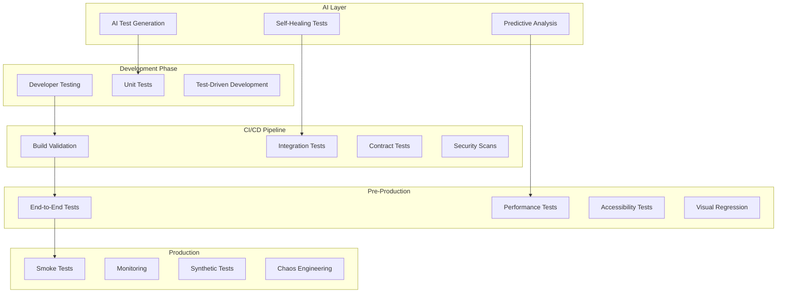

### Quality Gates
| Gate | Criteria | Tools | Action on Failure |
|------|----------|-------|-------------------|
| **[UNIT_TEST_GATE_NAME]** | >[COVERAGE_THRESHOLD]% coverage, all tests pass | [UNIT_TEST_TOOLS] | [UNIT_GATE_ACTION] |
| **[INTEGRATION_GATE_NAME]** | All API tests pass | [INTEGRATION_TEST_TOOLS] | [INTEGRATION_GATE_ACTION] |
| **[SECURITY_GATE_NAME]** | No [VULNERABILITY_LEVELS] vulnerabilities | [SECURITY_TEST_TOOLS] | [SECURITY_GATE_ACTION] |
| **[PERFORMANCE_GATE_NAME]** | Response time <[RESPONSE_TIME_LIMIT], no memory leaks | [PERFORMANCE_TEST_TOOLS] | [PERFORMANCE_GATE_ACTION] |
| **[ACCESSIBILITY_GATE_NAME]** | [ACCESSIBILITY_STANDARD] compliance | [ACCESSIBILITY_TEST_TOOLS] | [ACCESSIBILITY_GATE_ACTION] |

---

## 🔄 Shift-Left Testing Approach

### Early Testing Integration
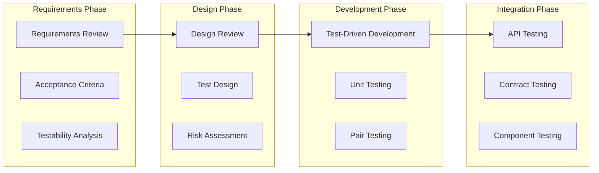

### Three Amigos Sessions
**Participants:** Product Owner, Developer, QA Engineer

**Process:**
1. **Story Analysis:** Review user story and acceptance criteria
2. **Test Scenario Creation:** Collaborate on test scenarios
3. **Risk Identification:** Identify potential issues and edge cases
4. **Definition of Done:** Agree on completion criteria

**Example Session Agenda:**
```markdown
## Three Amigos Session: [FEATURE_NAME]

### Story Review ([STORY_REVIEW_DURATION] min)
- Review user story and acceptance criteria
- Clarify requirements and edge cases

### Test Scenario Design ([SCENARIO_DESIGN_DURATION] min)
- Happy path scenarios
- Error handling scenarios
- Security considerations
- Performance requirements

### Risk Assessment ([RISK_ASSESSMENT_DURATION] min)
- Technical risks
- Business risks
- User experience risks

### Action Items ([ACTION_ITEMS_DURATION] min)
- Test automation tasks
- Development considerations
- Documentation updates
```

### Shift-Left Implementation
```javascript
// Example: Test-Driven Development
describe('[FEATURE_UNDER_TEST]', () => {
  // Write test first
  test('[TEST_DESCRIPTION_SUCCESS]', async () => {
    const [TEST_DATA_VARIABLE] = { [FIELD_1]: '[TEST_VALUE_1]', [FIELD_2]: '[TEST_VALUE_2]' };
    const result = await [SERVICE_NAME].[METHOD_NAME]([TEST_DATA_VARIABLE]);
    
    expect(result.[SUCCESS_PROPERTY]).toBe([SUCCESS_VALUE]);
    expect(result.[TOKEN_PROPERTY]).toBeDefined();
    expect(result.[USER_PROPERTY].[FIELD_1]).toBe([TEST_DATA_VARIABLE].[FIELD_1]);
  });
  
  test('[TEST_DESCRIPTION_FAILURE]', async () => {
    const [TEST_DATA_VARIABLE] = { [FIELD_1]: '[TEST_VALUE_1]', [FIELD_2]: '[INVALID_TEST_VALUE]' };
    const result = await [SERVICE_NAME].[METHOD_NAME]([TEST_DATA_VARIABLE]);
    
    expect(result.[SUCCESS_PROPERTY]).toBe([FAILURE_VALUE]);
    expect(result.[ERROR_PROPERTY]).toBe('[ERROR_MESSAGE]');
  });
});

// Then implement the functionality
class [SERVICE_CLASS_NAME] {
  async [METHOD_NAME]([CREDENTIALS_PARAM]) {
    // Implementation follows test requirements
    const [USER_VARIABLE] = await this.[REPOSITORY_NAME].[FIND_METHOD]([CREDENTIALS_PARAM].[FIELD_1]);
    
    if (![USER_VARIABLE] || !await this.[VERIFY_METHOD]([CREDENTIALS_PARAM].[FIELD_2], [USER_VARIABLE].[HASH_FIELD])) {
      return { [SUCCESS_PROPERTY]: [FAILURE_VALUE], [ERROR_PROPERTY]: '[ERROR_MESSAGE]' };
    }
    
    const [TOKEN_VARIABLE] = this.[GENERATE_TOKEN_METHOD]([USER_VARIABLE]);
    return { [SUCCESS_PROPERTY]: [SUCCESS_VALUE], [TOKEN_PROPERTY]: [TOKEN_VARIABLE], [USER_PROPERTY]: { [FIELD_1]: [USER_VARIABLE].[FIELD_1] } };
  }
}
```

---

## 🤖 AI-Powered Testing

### AI Testing Capabilities
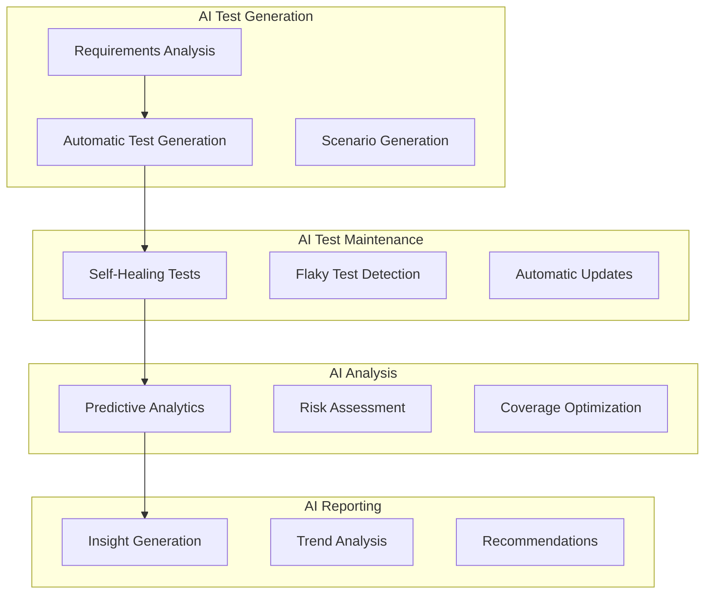

### AI Test Generation Example
```python
# AI-powered test generation using natural language
from [AI_TEST_GENERATOR_MODULE] import [TEST_GENERATOR_CLASS]

generator = [TEST_GENERATOR_CLASS]()

# Generate tests from requirements
requirements = """
[REQUIREMENTS_TEXT]:
1. [REQUIREMENT_1]
2. [REQUIREMENT_2]
3. [REQUIREMENT_3]
4. [REQUIREMENT_4]
"""

test_suite = generator.generate_tests(
    requirements=requirements,
    test_type="[TEST_TYPE]",
    framework="[TEST_FRAMEWORK]",
    coverage_target=[COVERAGE_TARGET]
)

# Generated test example
class [TEST_CLASS_NAME]:
    def [TEST_METHOD_NAME](self):
        """AI Generated: [TEST_DESCRIPTION]"""
        [TEST_DATA_VARIABLE] = {
            "[FIELD_1]": "[TEST_VALUE_1]",
            "[FIELD_2]": "[TEST_VALUE_2]",
            "[FIELD_3]": "[TEST_VALUE_3]"
        }
        
        response = self.client.post("[API_ENDPOINT]", json=[TEST_DATA_VARIABLE])
        
        assert response.status_code == [SUCCESS_STATUS_CODE]
        assert response.json()["[FIELD_1]"] == [TEST_DATA_VARIABLE]["[FIELD_1]"]
        assert "[SENSITIVE_FIELD]" not in response.json()
    
    def [NEGATIVE_TEST_METHOD_NAME](self):
        """AI Generated: [NEGATIVE_TEST_DESCRIPTION]"""
        # AI automatically generates edge cases
        pass
```

### Self-Healing Test Implementation
```javascript
// Self-healing test with AI-powered element detection
class [SELF_HEALING_TEST_CLASS] {
  constructor() {
    this.[AI_DETECTOR_PROPERTY] = new [AI_ELEMENT_DETECTOR_CLASS]();
    this.[HEALING_STRATEGIES_PROPERTY] = new [HEALING_STRATEGIES_CLASS]();
  }
  
  async [FIND_ELEMENT_METHOD](selector, context = '[DEFAULT_CONTEXT]') {
    try {
      return await this.[PAGE_PROPERTY].$(selector);
    } catch (error) {
      console.log(`Element not found: ${selector}. Attempting self-healing...`);
      
      // AI-powered element detection
      const newSelector = await this.[AI_DETECTOR_PROPERTY].[FIND_SIMILAR_METHOD]({
        originalSelector: selector,
        context: context,
        screenshot: await this.[PAGE_PROPERTY].screenshot(),
        pageSource: await this.[PAGE_PROPERTY].content()
      });
      
      if (newSelector) {
        console.log(`Self-healed selector: ${newSelector}`);
        await this.[HEALING_STRATEGIES_PROPERTY].[UPDATE_TEST_METHOD](selector, newSelector);
        return await this.[PAGE_PROPERTY].$(newSelector);
      }
      
      throw new Error(`Could not heal selector: ${selector}`);
    }
  }
}

// Usage in test
test('[TEST_DESCRIPTION]', async () => {
  const [SELF_HEALING_INSTANCE] = new [SELF_HEALING_TEST_CLASS]();
  
  await [SELF_HEALING_INSTANCE].[FIND_ELEMENT_METHOD]('[EMAIL_SELECTOR]', '[EMAIL_CONTEXT]')
    .then(element => element.type('[TEST_EMAIL]'));
  
  await [SELF_HEALING_INSTANCE].[FIND_ELEMENT_METHOD]('[PASSWORD_SELECTOR]', '[PASSWORD_CONTEXT]')
    .then(element => element.type('[TEST_PASSWORD]'));
  
  await [SELF_HEALING_INSTANCE].[FIND_ELEMENT_METHOD]('[SUBMIT_SELECTOR]', '[SUBMIT_CONTEXT]')
    .then(element => element.click());
  
  await expect([PAGE_VARIABLE]).toHaveURL('[SUCCESS_URL]');
});
```

### Predictive Test Analytics
```python
# AI-powered test failure prediction
class [PREDICTIVE_ANALYTICS_CLASS]:
    def __init__(self):
        self.[ML_MODEL_PROPERTY] = [LOAD_MODEL_FUNCTION]('[MODEL_FILE_PATH]')
        self.[FEATURE_EXTRACTOR_PROPERTY] = [FEATURE_EXTRACTOR_CLASS]()
    
    def [PREDICT_FAILURES_METHOD](self, [CODE_CHANGES_PARAM], [TEST_SUITE_PARAM]):
        """Predict which tests are likely to fail based on code changes"""
        features = self.[FEATURE_EXTRACTOR_PROPERTY].[EXTRACT_FEATURES_METHOD](
            code_changes=[CODE_CHANGES_PARAM],
            test_history=self.[GET_TEST_HISTORY_METHOD](),
            code_complexity=self.[ANALYZE_COMPLEXITY_METHOD]([CODE_CHANGES_PARAM])
        )
        
        predictions = self.[ML_MODEL_PROPERTY].[PREDICT_PROBA_METHOD](features)
        
        [HIGH_RISK_TESTS_VARIABLE] = [
            test for test, prob in zip([TEST_SUITE_PARAM], predictions)
            if prob[1] > [FAILURE_THRESHOLD]  # [THRESHOLD_PERCENTAGE]% probability of failure
        ]
        
        return {
            '[HIGH_RISK_TESTS_KEY]': [HIGH_RISK_TESTS_VARIABLE],
            '[RECOMMENDED_ACTIONS_KEY]': self.[GENERATE_RECOMMENDATIONS_METHOD]([HIGH_RISK_TESTS_VARIABLE]),
            '[CONFIDENCE_SCORE_KEY]': self.[CALCULATE_CONFIDENCE_METHOD](predictions)
        }
    
    def [OPTIMIZE_EXECUTION_ORDER_METHOD](self, [TEST_SUITE_PARAM]):
        """Optimize test execution order based on failure probability"""
        [FAILURE_PROBS_VARIABLE] = self.[PREDICT_FAILURE_PROBABILITIES_METHOD]([TEST_SUITE_PARAM])
        
        # Run high-risk tests first for faster feedback
        return sorted([TEST_SUITE_PARAM], key=lambda t: [FAILURE_PROBS_VARIABLE][t], reverse=True)
```---

#
# 📊 Testing Pyramid & Levels

### Modern Testing Pyramid (2025)
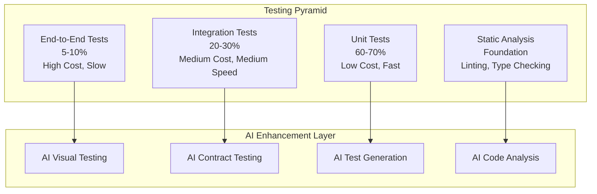

### Testing Levels Detailed

#### 1. Static Analysis & Linting
**Purpose:** Catch issues before code execution
**Tools:** ESLint, TypeScript, SonarQube, CodeQL
**Coverage Target:** 100% of codebase

```javascript
// ESLint configuration for quality gates
module.exports = {
  extends: [
    'eslint:recommended',
    '@typescript-eslint/recommended',
    'plugin:security/recommended',
    'plugin:sonarjs/recommended'
  ],
  rules: {
    'complexity': ['error', { max: 10 }],
    'max-lines-per-function': ['error', { max: 50 }],
    'no-console': 'error',
    'security/detect-sql-injection': 'error',
    'sonarjs/cognitive-complexity': ['error', 15]
  }
};
```

#### 2. Unit Testing
**Purpose:** Test individual components in isolation
**Tools:** Jest, Vitest, Testing Library
**Coverage Target:** >90%

```javascript
// Example unit test with comprehensive coverage
describe('[SERVICE_UNDER_TEST]', () => {
  let [SERVICE_INSTANCE];
  let [MOCK_REPOSITORY];
  let [MOCK_SERVICE];
  
  beforeEach(() => {
    [MOCK_REPOSITORY] = {
      [REPOSITORY_METHOD_1]: [MOCK_FUNCTION](),
      [REPOSITORY_METHOD_2]: [MOCK_FUNCTION](),
      [REPOSITORY_METHOD_3]: [MOCK_FUNCTION]()
    };
    [MOCK_SERVICE] = {
      [SERVICE_METHOD_1]: [MOCK_FUNCTION]()
    };
    
    [SERVICE_INSTANCE] = new [SERVICE_CLASS]([MOCK_REPOSITORY], [MOCK_SERVICE]);
  });
  
  describe('[METHOD_UNDER_TEST]', () => {
    test('[SUCCESS_TEST_DESCRIPTION]', async () => {
      // Arrange
      const [TEST_DATA_VARIABLE] = {
        [FIELD_1]: '[TEST_VALUE_1]',
        [FIELD_2]: '[TEST_VALUE_2]',
        [FIELD_3]: '[TEST_VALUE_3]'
      };
      const [SAVED_ENTITY_VARIABLE] = { [ID_FIELD]: [TEST_ID], ...[TEST_DATA_VARIABLE], [FIELD_3]: '[PROCESSED_VALUE]' };
      
      [MOCK_REPOSITORY].[REPOSITORY_METHOD_3].[MOCK_RESOLVED_VALUE](null);
      [MOCK_REPOSITORY].[REPOSITORY_METHOD_2].[MOCK_RESOLVED_VALUE]([SAVED_ENTITY_VARIABLE]);
      [MOCK_SERVICE].[SERVICE_METHOD_1].[MOCK_RESOLVED_VALUE](true);
      
      // Act
      const result = await [SERVICE_INSTANCE].[METHOD_UNDER_TEST]([TEST_DATA_VARIABLE]);
      
      // Assert
      expect(result).toEqual([SAVED_ENTITY_VARIABLE]);
      expect([MOCK_REPOSITORY].[REPOSITORY_METHOD_3]).toHaveBeenCalledWith([TEST_DATA_VARIABLE].[FIELD_1]);
      expect([MOCK_REPOSITORY].[REPOSITORY_METHOD_2]).toHaveBeenCalledWith(
        expect.objectContaining({
          [FIELD_1]: [TEST_DATA_VARIABLE].[FIELD_1],
          [FIELD_2]: [TEST_DATA_VARIABLE].[FIELD_2]
        })
      );
      expect([MOCK_SERVICE].[SERVICE_METHOD_1]).toHaveBeenCalledWith([SAVED_ENTITY_VARIABLE]);
    });
    
    test('[ERROR_TEST_DESCRIPTION]', async () => {
      // Arrange
      const [TEST_DATA_VARIABLE] = { [FIELD_1]: '[EXISTING_VALUE]' };
      [MOCK_REPOSITORY].[REPOSITORY_METHOD_3].[MOCK_RESOLVED_VALUE]({ [ID_FIELD]: [TEST_ID] });
      
      // Act & Assert
      await expect([SERVICE_INSTANCE].[METHOD_UNDER_TEST]([TEST_DATA_VARIABLE]))
        .rejects.toThrow('[ERROR_MESSAGE]');
      
      expect([MOCK_REPOSITORY].[REPOSITORY_METHOD_2]).not.toHaveBeenCalled();
    });
  });
});
```

#### 3. Integration Testing
**Purpose:** Test component interactions and API contracts
**Tools:** Supertest, TestContainers, Pact
**Coverage Target:** >80%

```javascript
// API Integration Tests
describe('User API Integration', () => {
  let app;
  let testDb;
  
  beforeAll(async () => {
    testDb = await setupTestDatabase();
    app = createApp({ database: testDb });
  });
  
  afterAll(async () => {
    await teardownTestDatabase(testDb);
  });
  
  describe('POST /api/users', () => {
    test('should create user and return 201', async () => {
      const userData = {
        email: 'integration@test.com',
        name: 'Integration Test',
        password: 'password123'
      };
      
      const response = await request(app)
        .post('/api/users')
        .send(userData)
        .expect(201);
      
      expect(response.body).toMatchObject({
        id: expect.any(Number),
        email: userData.email,
        name: userData.name
      });
      expect(response.body.password).toBeUndefined();
      
      // Verify database state
      const savedUser = await testDb.users.findById(response.body.id);
      expect(savedUser.email).toBe(userData.email);
    });
  });
});

// Contract Testing with Pact
describe('User Service Contract', () => {
  const provider = new Pact({
    consumer: 'Frontend App',
    provider: 'User Service',
    port: 1234
  });
  
  beforeAll(() => provider.setup());
  afterAll(() => provider.finalize());
  
  test('should get user by ID', async () => {
    await provider
      .given('user with ID 1 exists')
      .uponReceiving('a request for user 1')
      .withRequest({
        method: 'GET',
        path: '/api/users/1',
        headers: { 'Accept': 'application/json' }
      })
      .willRespondWith({
        status: 200,
        headers: { 'Content-Type': 'application/json' },
        body: {
          id: 1,
          email: 'user@example.com',
          name: 'Test User'
        }
      });
    
    const response = await axios.get('http://localhost:1234/api/users/1');
    expect(response.data.id).toBe(1);
  });
});
```

#### 4. End-to-End Testing
**Purpose:** Test complete user workflows
**Tools:** Playwright, Cypress, WebDriver
**Coverage Target:** Critical user journeys

```javascript
// E2E Test with Playwright
import { test, expect } from '@playwright/test';

test.describe('User Registration Flow', () => {
  test('should complete full registration process', async ({ page }) => {
    // Navigate to registration page
    await page.goto('/register');
    
    // Fill registration form
    await page.fill('[data-testid="email-input"]', 'e2e@test.com');
    await page.fill('[data-testid="name-input"]', 'E2E Test User');
    await page.fill('[data-testid="password-input"]', 'SecurePass123!');
    await page.fill('[data-testid="confirm-password-input"]', 'SecurePass123!');
    
    // Submit form
    await page.click('[data-testid="register-button"]');
    
    // Verify success
    await expect(page).toHaveURL('/welcome');
    await expect(page.locator('[data-testid="welcome-message"]'))
      .toContainText('Welcome, E2E Test User!');
    
    // Verify email was sent (mock verification)
    const emailRequests = await page.evaluate(() => 
      window.mockEmailService.getRequests()
    );
    expect(emailRequests).toHaveLength(1);
    expect(emailRequests[0].to).toBe('e2e@test.com');
  });
  
  test('should handle validation errors', async ({ page }) => {
    await page.goto('/register');
    
    // Submit empty form
    await page.click('[data-testid="register-button"]');
    
    // Verify validation errors
    await expect(page.locator('[data-testid="email-error"]'))
      .toContainText('Email is required');
    await expect(page.locator('[data-testid="password-error"]'))
      .toContainText('Password is required');
  });
});
```

---

## 🛠️ Testing Tools & Frameworks

### Frontend Testing Stack
```mermaid
graph TB
    subgraph "Unit Testing"
        JEST[Jest/Vitest]
        RTL[React Testing Library]
        ENZYME[Enzyme (Legacy)]
    end
    
    subgraph "Integration Testing"
        MSW[Mock Service Worker]
        STORYBOOK[Storybook]
        TESTING_PLAYGROUND[Testing Playground]
    end
    
    subgraph "E2E Testing"
        PLAYWRIGHT[Playwright]
        CYPRESS[Cypress]
        PUPPETEER[Puppeteer]
    end
    
    subgraph "Visual Testing"
        CHROMATIC[Chromatic]
        PERCY[Percy]
        APPLITOOLS[Applitools]
    end
    
    JEST --> MSW
    MSW --> PLAYWRIGHT
    PLAYWRIGHT --> CHROMATIC
```

### Backend Testing Stack
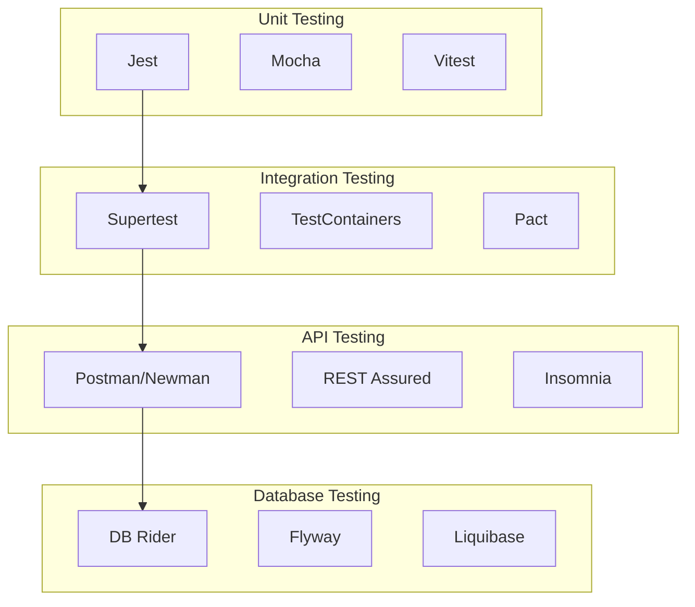

### Tool Configuration Examples

#### Jest Configuration
```javascript
// jest.config.js
module.exports = {
  testEnvironment: 'jsdom',
  setupFilesAfterEnv: ['<rootDir>/src/setupTests.js'],
  collectCoverageFrom: [
    'src/**/*.{js,jsx,ts,tsx}',
    '!src/**/*.d.ts',
    '!src/index.js',
    '!src/serviceWorker.js'
  ],
  coverageThreshold: {
    global: {
      branches: 90,
      functions: 90,
      lines: 90,
      statements: 90
    }
  },
  testMatch: [
    '<rootDir>/src/**/__tests__/**/*.{js,jsx,ts,tsx}',
    '<rootDir>/src/**/*.{spec,test}.{js,jsx,ts,tsx}'
  ],
  moduleNameMapping: {
    '^@/(.*)$': '<rootDir>/src/$1'
  },
  transform: {
    '^.+\\.(js|jsx|ts|tsx)$': 'babel-jest'
  }
};
```

#### Playwright Configuration
```javascript
// playwright.config.js
module.exports = {
  testDir: './e2e',
  timeout: 30000,
  expect: { timeout: 5000 },
  fullyParallel: true,
  forbidOnly: !!process.env.CI,
  retries: process.env.CI ? 2 : 0,
  workers: process.env.CI ? 1 : undefined,
  reporter: [
    ['html'],
    ['junit', { outputFile: 'test-results/junit.xml' }],
    ['allure-playwright']
  ],
  use: {
    baseURL: 'http://localhost:3000',
    trace: 'on-first-retry',
    screenshot: 'only-on-failure',
    video: 'retain-on-failure'
  },
  projects: [
    {
      name: 'chromium',
      use: { ...devices['Desktop Chrome'] }
    },
    {
      name: 'firefox',
      use: { ...devices['Desktop Firefox'] }
    },
    {
      name: 'webkit',
      use: { ...devices['Desktop Safari'] }
    },
    {
      name: 'Mobile Chrome',
      use: { ...devices['Pixel 5'] }
    }
  ],
  webServer: {
    command: 'npm run start',
    port: 3000,
    reuseExistingServer: !process.env.CI
  }
};
```---


## 🚀 Test Automation Strategy

### Automation Framework Architecture
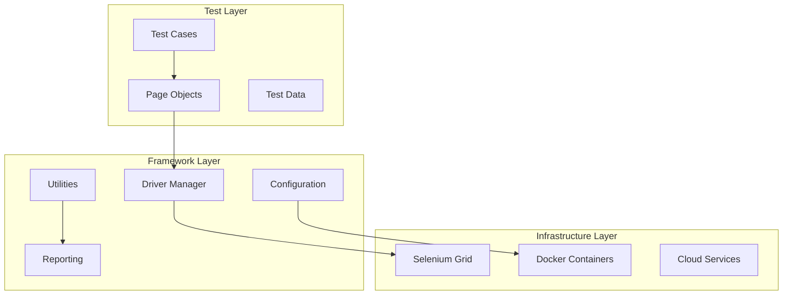

### Page Object Model Implementation
```javascript
// Base Page Object
class BasePage {
  constructor(page) {
    this.page = page;
  }
  
  async waitForElement(selector, timeout = 10000) {
    return await this.page.waitForSelector(selector, { timeout });
  }
  
  async clickElement(selector) {
    await this.waitForElement(selector);
    await this.page.click(selector);
  }
  
  async fillInput(selector, text) {
    await this.waitForElement(selector);
    await this.page.fill(selector, text);
  }
  
  async getText(selector) {
    await this.waitForElement(selector);
    return await this.page.textContent(selector);
  }
}

// Login Page Object
class LoginPage extends BasePage {
  constructor(page) {
    super(page);
    this.emailInput = '[data-testid="email-input"]';
    this.passwordInput = '[data-testid="password-input"]';
    this.loginButton = '[data-testid="login-button"]';
    this.errorMessage = '[data-testid="error-message"]';
  }
  
  async navigate() {
    await this.page.goto('/login');
  }
  
  async login(email, password) {
    await this.fillInput(this.emailInput, email);
    await this.fillInput(this.passwordInput, password);
    await this.clickElement(this.loginButton);
  }
  
  async getErrorMessage() {
    return await this.getText(this.errorMessage);
  }
  
  async isLoginSuccessful() {
    await this.page.waitForURL('/dashboard');
    return this.page.url().includes('/dashboard');
  }
}

// Usage in test
test('User login functionality', async ({ page }) => {
  const loginPage = new LoginPage(page);
  
  await loginPage.navigate();
  await loginPage.login('user@example.com', 'password123');
  
  expect(await loginPage.isLoginSuccessful()).toBe(true);
});
```

### Data-Driven Testing
```javascript
// Test data management
class TestDataManager {
  constructor() {
    this.testData = {
      users: {
        valid: {
          email: 'valid@example.com',
          password: 'ValidPass123!',
          name: 'Valid User'
        },
        invalid: {
          email: 'invalid-email',
          password: '123',
          name: ''
        }
      },
      products: [
        { id: 1, name: 'Product 1', price: 99.99 },
        { id: 2, name: 'Product 2', price: 149.99 }
      ]
    };
  }
  
  getUser(type = 'valid') {
    return this.testData.users[type];
  }
  
  getRandomProduct() {
    const products = this.testData.products;
    return products[Math.floor(Math.random() * products.length)];
  }
  
  generateUniqueEmail() {
    const timestamp = Date.now();
    return `test${timestamp}@example.com`;
  }
}

// Data-driven test example
const testData = new TestDataManager();

describe('User Registration', () => {
  const validationCases = [
    { field: 'email', value: '', error: 'Email is required' },
    { field: 'email', value: 'invalid', error: 'Invalid email format' },
    { field: 'password', value: '', error: 'Password is required' },
    { field: 'password', value: '123', error: 'Password too weak' }
  ];
  
  validationCases.forEach(({ field, value, error }) => {
    test(`should show error for invalid ${field}`, async ({ page }) => {
      const registrationPage = new RegistrationPage(page);
      const userData = testData.getUser('valid');
      userData[field] = value;
      
      await registrationPage.navigate();
      await registrationPage.fillForm(userData);
      await registrationPage.submit();
      
      expect(await registrationPage.getFieldError(field)).toBe(error);
    });
  });
});
```

### Parallel Test Execution
```javascript
// Parallel execution configuration
// playwright.config.js
module.exports = {
  workers: process.env.CI ? 4 : 2,
  fullyParallel: true,
  projects: [
    {
      name: 'chrome-desktop',
      use: { ...devices['Desktop Chrome'] },
      testDir: './tests/desktop'
    },
    {
      name: 'chrome-mobile',
      use: { ...devices['Pixel 5'] },
      testDir: './tests/mobile'
    }
  ]
};

// Test sharding for large test suites
// package.json scripts
{
  "scripts": {
    "test:shard1": "playwright test --shard=1/4",
    "test:shard2": "playwright test --shard=2/4",
    "test:shard3": "playwright test --shard=3/4",
    "test:shard4": "playwright test --shard=4/4",
    "test:parallel": "npm-run-all --parallel test:shard*"
  }
}
```

---

## 📱 Cross-Platform Testing

### Multi-Browser Testing Strategy
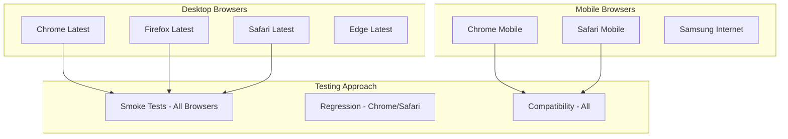

### Responsive Testing
```javascript
// Responsive design testing
const viewports = [
  { name: 'Mobile', width: 375, height: 667 },
  { name: 'Tablet', width: 768, height: 1024 },
  { name: 'Desktop', width: 1920, height: 1080 },
  { name: 'Large Desktop', width: 2560, height: 1440 }
];

describe('Responsive Design Tests', () => {
  viewports.forEach(({ name, width, height }) => {
    test(`should display correctly on ${name}`, async ({ page }) => {
      await page.setViewportSize({ width, height });
      await page.goto('/');
      
      // Take screenshot for visual comparison
      await expect(page).toHaveScreenshot(`homepage-${name.toLowerCase()}.png`);
      
      // Test responsive navigation
      if (width < 768) {
        await expect(page.locator('[data-testid="mobile-menu-button"]')).toBeVisible();
        await expect(page.locator('[data-testid="desktop-navigation"]')).toBeHidden();
      } else {
        await expect(page.locator('[data-testid="mobile-menu-button"]')).toBeHidden();
        await expect(page.locator('[data-testid="desktop-navigation"]')).toBeVisible();
      }
    });
  });
});
```

### Device-Specific Testing
```javascript
// Device emulation testing
const devices = [
  'iPhone 13',
  'iPhone 13 Pro',
  'Pixel 5',
  'Samsung Galaxy S21',
  'iPad Air',
  'iPad Pro'
];

describe('Device-Specific Tests', () => {
  devices.forEach(deviceName => {
    test(`should work on ${deviceName}`, async ({ browser }) => {
      const device = playwright.devices[deviceName];
      const context = await browser.newContext({
        ...device,
        permissions: ['geolocation', 'camera']
      });
      
      const page = await context.newPage();
      await page.goto('/');
      
      // Test touch interactions
      await page.tap('[data-testid="menu-button"]');
      await expect(page.locator('[data-testid="menu"]')).toBeVisible();
      
      // Test device-specific features
      if (device.isMobile) {
        await testMobileFeatures(page);
      }
      
      await context.close();
    });
  });
});

async function testMobileFeatures(page) {
  // Test swipe gestures
  await page.touchscreen.tap(100, 100);
  
  // Test orientation changes
  await page.setViewportSize({ width: 667, height: 375 }); // Landscape
  await expect(page.locator('[data-testid="landscape-layout"]')).toBeVisible();
}
```

---

## 🔒 Security Testing

### Security Testing Framework
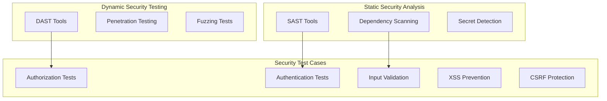

### Automated Security Tests
```javascript
// Security test suite
describe('Security Tests', () => {
  describe('Authentication Security', () => {
    test('should prevent brute force attacks', async ({ page }) => {
      const loginPage = new LoginPage(page);
      await loginPage.navigate();
      
      // Attempt multiple failed logins
      for (let i = 0; i < 6; i++) {
        await loginPage.login('user@example.com', 'wrongpassword');
        await page.waitForTimeout(100);
      }
      
      // Should be rate limited
      const errorMessage = await loginPage.getErrorMessage();
      expect(errorMessage).toContain('Too many attempts');
    });
    
    test('should enforce strong password policy', async ({ page }) => {
      const registrationPage = new RegistrationPage(page);
      await registrationPage.navigate();
      
      const weakPasswords = ['123', 'password', 'abc123'];
      
      for (const password of weakPasswords) {
        await registrationPage.fillPassword(password);
        await registrationPage.submit();
        
        const error = await registrationPage.getPasswordError();
        expect(error).toContain('Password does not meet requirements');
      }
    });
  });
  
  describe('Input Validation', () => {
    test('should prevent SQL injection', async ({ request }) => {
      const maliciousInputs = [
        "'; DROP TABLE users; --",
        "1' OR '1'='1",
        "admin'/*",
        "' UNION SELECT * FROM users --"
      ];
      
      for (const input of maliciousInputs) {
        const response = await request.post('/api/search', {
          data: { query: input }
        });
        
        // Should not return sensitive data or cause errors
        expect(response.status()).toBe(400);
        const body = await response.json();
        expect(body.error).toContain('Invalid input');
      }
    });
    
    test('should prevent XSS attacks', async ({ page }) => {
      const xssPayloads = [
        '<script>alert("XSS")</script>',
        '',
        'javascript:alert("XSS")',
        '<svg onload="alert(1)">'
      ];
      
      for (const payload of xssPayloads) {
        await page.goto('/profile');
        await page.fill('[data-testid="bio-input"]', payload);
        await page.click('[data-testid="save-button"]');
        
        // Check that script is not executed
        const alerts = [];
        page.on('dialog', dialog => {
          alerts.push(dialog.message());
          dialog.dismiss();
        });
        
        await page.reload();
        expect(alerts).toHaveLength(0);
      }
    });
  });
  
  describe('Authorization Tests', () => {
    test('should prevent unauthorized access', async ({ request }) => {
      // Test without authentication
      const response = await request.get('/api/admin/users');
      expect(response.status()).toBe(401);
      
      // Test with invalid token
      const invalidResponse = await request.get('/api/admin/users', {
        headers: { 'Authorization': 'Bearer invalid-token' }
      });
      expect(invalidResponse.status()).toBe(401);
    });
    
    test('should enforce role-based access', async ({ request }) => {
      // Login as regular user
      const userToken = await getAuthToken('user@example.com', 'password');
      
      // Try to access admin endpoint
      const response = await request.get('/api/admin/users', {
        headers: { 'Authorization': `Bearer ${userToken}` }
      });
      
      expect(response.status()).toBe(403);
    });
  });
});
```

### Security Scanning Integration
```yaml
# Security scanning in CI/CD
name: Security Tests

on: [push, pull_request]

jobs:
  security-scan:
    runs-on: ubuntu-latest
    steps:
      - uses: actions/checkout@v4
      
      - name: Run OWASP ZAP Scan
        uses: zaproxy/action-baseline@v0.7.0
        with:
          target: 'http://localhost:3000'
          
      - name: Run Snyk Security Scan
        uses: snyk/actions/node@master
        env:
          SNYK_TOKEN: ${{ secrets.SNYK_TOKEN }}
        with:
          args: --severity-threshold=high
          
      - name: Run Semgrep SAST
        uses: returntocorp/semgrep-action@v1
        with:
          config: >-
            p/security-audit
            p/secrets
            p/owasp-top-ten
```---


## ⚡ Performance Testing

### Performance Testing Strategy
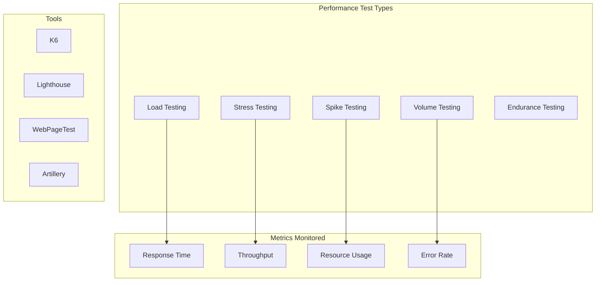

### Load Testing with K6
```javascript
// load-test.js
import http from 'k6/http';
import { check, sleep } from 'k6';
import { Rate } from 'k6/metrics';

// Custom metrics
const errorRate = new Rate('errors');

export let options = {
  stages: [
    { duration: '2m', target: 100 },   // Ramp up to 100 users
    { duration: '5m', target: 100 },   // Stay at 100 users
    { duration: '2m', target: 200 },   // Ramp up to 200 users
    { duration: '5m', target: 200 },   // Stay at 200 users
    { duration: '2m', target: 0 },     // Ramp down to 0 users
  ],
  thresholds: {
    http_req_duration: ['p(95)<500'],  // 95% of requests under 500ms
    http_req_failed: ['rate<0.05'],    // Error rate under 5%
    errors: ['rate<0.1'],              // Custom error rate under 10%
  },
};

export default function () {
  // Test user registration
  const registrationPayload = JSON.stringify({
    email: `user${Math.random()}@example.com`,
    password: 'TestPassword123!',
    name: 'Load Test User'
  });

  const registrationResponse = http.post('http://localhost:3000/api/register', registrationPayload, {
    headers: { 'Content-Type': 'application/json' },
  });

  check(registrationResponse, {
    'registration status is 201': (r) => r.status === 201,
    'registration response time < 2s': (r) => r.timings.duration < 2000,
  }) || errorRate.add(1);

  // Test user login
  const loginPayload = JSON.stringify({
    email: 'existing@example.com',
    password: 'password123'
  });

  const loginResponse = http.post('http://localhost:3000/api/login', loginPayload, {
    headers: { 'Content-Type': 'application/json' },
  });

  check(loginResponse, {
    'login status is 200': (r) => r.status === 200,
    'login response time < 1s': (r) => r.timings.duration < 1000,
    'login returns token': (r) => JSON.parse(r.body).token !== undefined,
  }) || errorRate.add(1);

  // Test API endpoints with authentication
  if (loginResponse.status === 200) {
    const token = JSON.parse(loginResponse.body).token;
    
    const apiResponse = http.get('http://localhost:3000/api/dashboard', {
      headers: { 'Authorization': `Bearer ${token}` },
    });

    check(apiResponse, {
      'API status is 200': (r) => r.status === 200,
      'API response time < 500ms': (r) => r.timings.duration < 500,
    }) || errorRate.add(1);
  }

  sleep(1);
}

// Teardown function
export function teardown(data) {
  console.log('Load test completed');
}
```

### Frontend Performance Testing
```javascript
// lighthouse-performance.js
import lighthouse from 'lighthouse';
import chromeLauncher from 'chrome-launcher';

async function runLighthouseTest(url) {
  const chrome = await chromeLauncher.launch({ chromeFlags: ['--headless'] });
  
  const options = {
    logLevel: 'info',
    output: 'json',
    onlyCategories: ['performance', 'accessibility', 'best-practices', 'seo'],
    port: chrome.port,
  };

  const runnerResult = await lighthouse(url, options);
  await chrome.kill();

  const scores = runnerResult.lhr.categories;
  
  return {
    performance: scores.performance.score * 100,
    accessibility: scores.accessibility.score * 100,
    bestPractices: scores['best-practices'].score * 100,
    seo: scores.seo.score * 100,
    metrics: {
      firstContentfulPaint: runnerResult.lhr.audits['first-contentful-paint'].numericValue,
      largestContentfulPaint: runnerResult.lhr.audits['largest-contentful-paint'].numericValue,
      cumulativeLayoutShift: runnerResult.lhr.audits['cumulative-layout-shift'].numericValue,
      totalBlockingTime: runnerResult.lhr.audits['total-blocking-time'].numericValue,
    }
  };
}

// Performance test suite
describe('Performance Tests', () => {
  const performanceThresholds = {
    performance: 90,
    accessibility: 95,
    bestPractices: 90,
    seo: 90,
    firstContentfulPaint: 2000,
    largestContentfulPaint: 4000,
    cumulativeLayoutShift: 0.1,
    totalBlockingTime: 300
  };

  test('Homepage performance meets thresholds', async () => {
    const results = await runLighthouseTest('http://localhost:3000');
    
    expect(results.performance).toBeGreaterThanOrEqual(performanceThresholds.performance);
    expect(results.accessibility).toBeGreaterThanOrEqual(performanceThresholds.accessibility);
    expect(results.bestPractices).toBeGreaterThanOrEqual(performanceThresholds.bestPractices);
    expect(results.seo).toBeGreaterThanOrEqual(performanceThresholds.seo);
    
    expect(results.metrics.firstContentfulPaint).toBeLessThanOrEqual(performanceThresholds.firstContentfulPaint);
    expect(results.metrics.largestContentfulPaint).toBeLessThanOrEqual(performanceThresholds.largestContentfulPaint);
    expect(results.metrics.cumulativeLayoutShift).toBeLessThanOrEqual(performanceThresholds.cumulativeLayoutShift);
    expect(results.metrics.totalBlockingTime).toBeLessThanOrEqual(performanceThresholds.totalBlockingTime);
  });
});
```

---

## ♿ Accessibility Testing

### Accessibility Testing Strategy
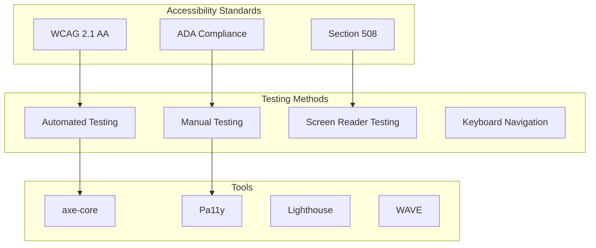

### Automated Accessibility Testing
```javascript
// accessibility-tests.js
import { test, expect } from '@playwright/test';
import AxeBuilder from '@axe-core/playwright';

test.describe('Accessibility Tests', () => {
  test('should not have any automatically detectable accessibility issues', async ({ page }) => {
    await page.goto('/');
    
    const accessibilityScanResults = await new AxeBuilder({ page })
      .withTags(['wcag2a', 'wcag2aa', 'wcag21aa'])
      .analyze();
    
    expect(accessibilityScanResults.violations).toEqual([]);
  });
  
  test('should support keyboard navigation', async ({ page }) => {
    await page.goto('/');
    
    // Test tab navigation
    await page.keyboard.press('Tab');
    let focusedElement = await page.locator(':focus');
    await expect(focusedElement).toBeVisible();
    
    // Test skip link
    await page.keyboard.press('Tab');
    const skipLink = page.locator('[data-testid="skip-link"]');
    if (await skipLink.isVisible()) {
      await page.keyboard.press('Enter');
      const mainContent = page.locator('main');
      await expect(mainContent).toBeFocused();
    }
    
    // Test form navigation
    await page.goto('/contact');
    await page.keyboard.press('Tab');
    
    const formElements = [
      '[data-testid="name-input"]',
      '[data-testid="email-input"]',
      '[data-testid="message-textarea"]',
      '[data-testid="submit-button"]'
    ];
    
    for (const selector of formElements) {
      const element = page.locator(selector);
      if (await element.isVisible()) {
        await expect(element).toBeFocused();
        await page.keyboard.press('Tab');
      }
    }
  });
  
  test('should have proper ARIA labels and roles', async ({ page }) => {
    await page.goto('/');
    
    // Check for proper heading structure
    const headings = await page.locator('h1, h2, h3, h4, h5, h6').all();
    expect(headings.length).toBeGreaterThan(0);
    
    // Check for alt text on images
    const images = await page.locator('img').all();
    for (const img of images) {
      const alt = await img.getAttribute('alt');
      expect(alt).toBeDefined();
    }
    
    // Check for form labels
    const inputs = await page.locator('input[type="text"], input[type="email"], textarea').all();
    for (const input of inputs) {
      const id = await input.getAttribute('id');
      if (id) {
        const label = page.locator(`label[for="${id}"]`);
        await expect(label).toBeVisible();
      } else {
        const ariaLabel = await input.getAttribute('aria-label');
        const ariaLabelledBy = await input.getAttribute('aria-labelledby');
        expect(ariaLabel || ariaLabelledBy).toBeDefined();
      }
    }
  });
  
  test('should have sufficient color contrast', async ({ page }) => {
    await page.goto('/');
    
    const contrastResults = await new AxeBuilder({ page })
      .withTags(['wcag2aa'])
      .include('.main-content')
      .analyze();
    
    const contrastViolations = contrastResults.violations.filter(
      violation => violation.id === 'color-contrast'
    );
    
    expect(contrastViolations).toHaveLength(0);
  });
});

// Screen reader simulation
test('should work with screen reader simulation', async ({ page }) => {
  await page.goto('/');
  
  // Simulate screen reader navigation
  const announcements = [];
  
  await page.addInitScript(() => {
    // Mock screen reader announcements
    window.screenReaderAnnouncements = [];
    
    const originalSetAttribute = Element.prototype.setAttribute;
    Element.prototype.setAttribute = function(name, value) {
      if (name === 'aria-live' || name === 'aria-label') {
        window.screenReaderAnnouncements.push({ element: this, attribute: name, value });
      }
      return originalSetAttribute.call(this, name, value);
    };
  });
  
  // Trigger form submission to test announcements
  await page.fill('[data-testid="search-input"]', 'test query');
  await page.click('[data-testid="search-button"]');
  
  // Check for proper announcements
  const screenReaderData = await page.evaluate(() => window.screenReaderAnnouncements);
  expect(screenReaderData.length).toBeGreaterThan(0);
});
```

---

## 📊 Test Data Management

### Test Data Strategy
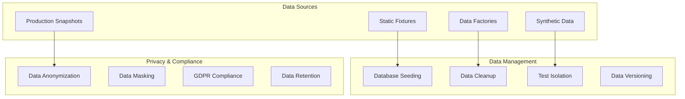

### Test Data Factory Implementation
```javascript
// test-data-factory.js
import { faker } from '@faker-js/faker';

class TestDataFactory {
  static createUser(overrides = {}) {
    return {
      id: faker.string.uuid(),
      email: faker.internet.email(),
      firstName: faker.person.firstName(),
      lastName: faker.person.lastName(),
      password: 'TestPassword123!',
      createdAt: faker.date.past(),
      updatedAt: faker.date.recent(),
      isActive: true,
      role: 'user',
      ...overrides
    };
  }
  
  static createProject(overrides = {}) {
    return {
      id: faker.string.uuid(),
      name: faker.company.name(),
      description: faker.lorem.paragraph(),
      status: 'active',
      createdBy: faker.string.uuid(),
      createdAt: faker.date.past(),
      updatedAt: faker.date.recent(),
      ...overrides
    };
  }
  
  static createTask(overrides = {}) {
    return {
      id: faker.string.uuid(),
      title: faker.lorem.sentence(),
      description: faker.lorem.paragraphs(2),
      status: faker.helpers.arrayElement(['todo', 'in_progress', 'done']),
      priority: faker.helpers.arrayElement(['low', 'medium', 'high']),
      assignedTo: faker.string.uuid(),
      projectId: faker.string.uuid(),
      dueDate: faker.date.future(),
      createdAt: faker.date.past(),
      updatedAt: faker.date.recent(),
      ...overrides
    };
  }
  
  // Create related data sets
  static createUserWithProjects(projectCount = 3) {
    const user = this.createUser();
    const projects = Array.from({ length: projectCount }, () => 
      this.createProject({ createdBy: user.id })
    );
    
    return { user, projects };
  }
  
  // Create realistic data scenarios
  static createCompleteWorkspace() {
    const users = Array.from({ length: 5 }, () => this.createUser());
    const admin = this.createUser({ role: 'admin' });
    
    const projects = Array.from({ length: 3 }, () => 
      this.createProject({ createdBy: admin.id })
    );
    
    const tasks = projects.flatMap(project => 
      Array.from({ length: faker.number.int({ min: 5, max: 15 }) }, () =>
        this.createTask({
          projectId: project.id,
          assignedTo: faker.helpers.arrayElement(users).id
        })
      )
    );
    
    return { users: [...users, admin], projects, tasks };
  }
}

// Database seeding utility
class DatabaseSeeder {
  constructor(database) {
    this.db = database;
  }
  
  async seedTestData(scenario = 'basic') {
    await this.cleanup();
    
    switch (scenario) {
      case 'basic':
        return await this.seedBasicData();
      case 'complete':
        return await this.seedCompleteWorkspace();
      case 'performance':
        return await this.seedPerformanceData();
      default:
        throw new Error(`Unknown scenario: ${scenario}`);
    }
  }
  
  async seedBasicData() {
    const user = TestDataFactory.createUser();
    const project = TestDataFactory.createProject({ createdBy: user.id });
    const tasks = Array.from({ length: 5 }, () => 
      TestDataFactory.createTask({ projectId: project.id, assignedTo: user.id })
    );
    
    await this.db.users.create(user);
    await this.db.projects.create(project);
    await this.db.tasks.createMany(tasks);
    
    return { user, project, tasks };
  }
  
  async seedCompleteWorkspace() {
    const workspace = TestDataFactory.createCompleteWorkspace();
    
    await this.db.users.createMany(workspace.users);
    await this.db.projects.createMany(workspace.projects);
    await this.db.tasks.createMany(workspace.tasks);
    
    return workspace;
  }
  
  async seedPerformanceData() {
    const users = Array.from({ length: 1000 }, () => TestDataFactory.createUser());
    const projects = Array.from({ length: 100 }, () => TestDataFactory.createProject());
    const tasks = Array.from({ length: 10000 }, () => TestDataFactory.createTask());
    
    await this.db.users.createMany(users);
    await this.db.projects.createMany(projects);
    await this.db.tasks.createMany(tasks);
    
    return { users, projects, tasks };
  }
  
  async cleanup() {
    await this.db.tasks.deleteMany();
    await this.db.projects.deleteMany();
    await this.db.users.deleteMany();
  }
}

// Usage in tests
describe('User Management', () => {
  let seeder;
  
  beforeEach(async () => {
    seeder = new DatabaseSeeder(testDatabase);
    await seeder.seedTestData('basic');
  });
  
  afterEach(async () => {
    await seeder.cleanup();
  });
  
  test('should create user successfully', async () => {
    const userData = TestDataFactory.createUser();
    const result = await userService.createUser(userData);
    
    expect(result.email).toBe(userData.email);
  });
});
```

---

## 📈 Metrics & Reporting

### Testing Metrics Dashboard
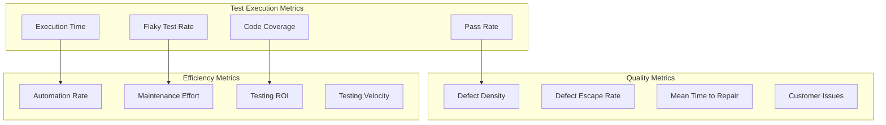

### Automated Reporting
```javascript
// test-reporter.js
class TestReporter {
  constructor() {
    this.results = {
      summary: {},
      suites: [],
      coverage: {},
      performance: {},
      accessibility: {}
    };
  }
  
  generateReport(testResults) {
    this.results.summary = this.calculateSummary(testResults);
    this.results.suites = this.processSuites(testResults);
    this.results.coverage = this.getCoverageData();
    this.results.performance = this.getPerformanceData();
    this.results.accessibility = this.getAccessibilityData();
    
    return this.results;
  }
  
  calculateSummary(testResults) {
    const total = testResults.length;
    const passed = testResults.filter(t => t.status === 'passed').length;
    const failed = testResults.filter(t => t.status === 'failed').length;
    const skipped = testResults.filter(t => t.status === 'skipped').length;
    
    return {
      total,
      passed,
      failed,
      skipped,
      passRate: (passed / total) * 100,
      duration: testResults.reduce((sum, t) => sum + t.duration, 0)
    };
  }
  
  async sendToSlack(webhook, results) {
    const message = {
      text: "Test Results Summary",
      blocks: [
        {
          type: "section",
          text: {
            type: "mrkdwn",
            text: `*Test Execution Complete*\n` +
                  `✅ Passed: ${results.summary.passed}\n` +
                  `❌ Failed: ${results.summary.failed}\n` +
                  `⏭️ Skipped: ${results.summary.skipped}\n` +
                  `📊 Pass Rate: ${results.summary.passRate.toFixed(1)}%\n` +
                  `⏱️ Duration: ${(results.summary.duration / 1000).toFixed(1)}s`
          }
        }
      ]
    };
    
    if (results.summary.failed > 0) {
      message.blocks.push({
        type: "section",
        text: {
          type: "mrkdwn",
          text: `*Failed Tests:*\n${this.getFailedTestsList(results)}`
        }
      });
    }
    
    await fetch(webhook, {
      method: 'POST',
      headers: { 'Content-Type': 'application/json' },
      body: JSON.stringify(message)
    });
  }
  
  generateHTMLReport() {
    return `
      <!DOCTYPE html>
      <html>
      <head>
        <title>Test Report</title>
        <style>
          body { font-family: Arial, sans-serif; margin: 20px; }
          .summary { background: #f5f5f5; padding: 20px; border-radius: 5px; }
          .passed { color: green; }
          .failed { color: red; }
          .skipped { color: orange; }
          table { width: 100%; border-collapse: collapse; margin-top: 20px; }
          th, td { border: 1px solid #ddd; padding: 8px; text-align: left; }
          th { background-color: #f2f2f2; }
        </style>
      </head>
      <body>
        <h1>Test Execution Report</h1>
        <div class="summary">
          <h2>Summary</h2>
          <p>Total Tests: ${this.results.summary.total}</p>
          <p class="passed">Passed: ${this.results.summary.passed}</p>
          <p class="failed">Failed: ${this.results.summary.failed}</p>
          <p class="skipped">Skipped: ${this.results.summary.skipped}</p>
          <p>Pass Rate: ${this.results.summary.passRate.toFixed(1)}%</p>
          <p>Duration: ${(this.results.summary.duration / 1000).toFixed(1)}s</p>
        </div>
        
        <h2>Test Results</h2>
        <table>
          <thead>
            <tr>
              <th>Test Suite</th>
              <th>Test Case</th>
              <th>Status</th>
              <th>Duration</th>
              <th>Error</th>
            </tr>
          </thead>
          <tbody>
            ${this.generateTestRows()}
          </tbody>
        </table>
        
        <h2>Coverage Report</h2>
        <p>Line Coverage: ${this.results.coverage.lines}%</p>
        <p>Branch Coverage: ${this.results.coverage.branches}%</p>
        <p>Function Coverage: ${this.results.coverage.functions}%</p>
      </body>
      </html>
    `;
  }
}
```

---

## Support & Maintenance

### Documentation Maintenance
- **Review Schedule:** Weekly review of test strategy effectiveness
- **Update Process:** Version-controlled changes with team approval
- **Team Communication:** Notify teams of testing practice changes
- **Performance Monitoring:** Regular analysis of test execution metrics

### Continuous Improvement
- **Test Metrics:** Track and analyze testing KPIs for improvement opportunities
- **Tool Evaluation:** Regular assessment of new testing tools and frameworks
- **Team Training:** Ongoing education on testing best practices and new technologies
- **Process Optimization:** Identify and eliminate testing bottlenecks

### Quality Assurance
- **Test Review Process:** Peer review of test cases and automation scripts
- **Quality Gates:** Enforce quality standards at each testing level
- **Risk Assessment:** Regular evaluation of testing coverage and risk areas
- **Compliance Monitoring:** Ensure adherence to testing standards and regulations

---

**Document Information:**
- **Template Version:** 3.0 - Enhanced with 2025 Best Practices
- **Last Updated:** 2025-01-15
- **Compatibility:** Modern testing frameworks, AI-powered tools, cloud platforms
- **Standards:** Shift-left testing, AI integration, accessibility compliance, security testing
- **Review Cycle:** Monthly or with major testing strategy changes
- **Research Sources:** QA trends 2025, AI-powered testing, modern testing frameworks