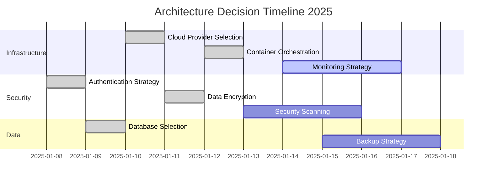

# Architecture Decision Records (ADR) Index
> **Purpose:** Comprehensive index and management system for Architecture Decision Records following 2025 best practices for architectural governance, decision tracking, and knowledge management. This document serves as the central hub for all architectural decisions made throughout the project lifecycle.

**Document Type:** Architectural Governance Documentation  
**Version:** 2.0 - Enhanced with 2025 Best Practices  
**Last Updated:** 2025-01-15  
**Template Status:** Production Ready

---

## Document Control
| Field | Value |
|-------|-------|
| **Project Name** | [PROJECT_NAME] |
| **Architecture Lead** | [ARCHITECTURE_LEAD_NAME] |
| **Decision Process** | [DECISION_PROCESS_TYPE] |
| **Last Updated** | [YYYY-MM-DD] |
| **Next Review** | [YYYY-MM-DD] |
| **Total ADRs** | [TOTAL_COUNT] |

---

## 📋 Table of Contents
- [🎯 ADR Overview](#-adr-overview)
- [📊 Decision Statistics](#-decision-statistics)
- [🗂️ ADR Index by Category](#️-adr-index-by-category)
- [📈 Decision Timeline](#-decision-timeline)
- [🔄 ADR Process & Guidelines](#-adr-process--guidelines)
- [🛠️ Tools & Templates](#️-tools--templates)
- [📚 Resources & References](#-resources--references)

---

## 🎯 ADR Overview

### What are Architecture Decision Records?

Architecture Decision Records (ADRs) are lightweight documents that capture important architectural decisions made during the project lifecycle. Each ADR documents the context, decision, and consequences of a single architectural choice, providing a historical record of why decisions were made and their expected impact.

### Our ADR Philosophy
- **Transparency:** All architectural decisions are documented and accessible
- **Accountability:** Clear ownership and rationale for each decision
- **Learning:** Capture lessons learned and decision outcomes
- **Collaboration:** Inclusive decision-making process with stakeholder input
- **Evolution:** Decisions can be revisited and updated as context changes

### Benefits of ADRs
- **Knowledge Preservation:** Maintain institutional knowledge across team changes
- **Decision Traceability:** Understand the reasoning behind architectural choices
- **Onboarding Acceleration:** Help new team members understand system design
- **Risk Mitigation:** Identify and document architectural trade-offs
- **Continuous Improvement:** Learn from past decisions and outcomes

---

## 📊 Decision Statistics

### Current Status Overview
| Metric | Count | Percentage |
|--------|-------|------------|
| **Total ADRs** | [TOTAL_COUNT] | 100% |
| **Accepted** | [ACCEPTED_COUNT] | [ACCEPTED_PERCENTAGE]% |
| **Proposed** | [PROPOSED_COUNT] | [PROPOSED_PERCENTAGE]% |
| **Deprecated** | [DEPRECATED_COUNT] | [DEPRECATED_PERCENTAGE]% |
| **Superseded** | [SUPERSEDED_COUNT] | [SUPERSEDED_PERCENTAGE]% |

### Decision Categories
| Category | Count | Latest Decision |
|----------|-------|-----------------|
| **Infrastructure** | [INFRA_COUNT] | [LATEST_INFRA_DATE] |
| **Security** | [SECURITY_COUNT] | [LATEST_SECURITY_DATE] |
| **Data Management** | [DATA_COUNT] | [LATEST_DATA_DATE] |
| **Integration** | [INTEGRATION_COUNT] | [LATEST_INTEGRATION_DATE] |
| **Performance** | [PERFORMANCE_COUNT] | [LATEST_PERFORMANCE_DATE] |
| **User Experience** | [UX_COUNT] | [LATEST_UX_DATE] |

### Recent Activity
- **Last 30 Days:** [RECENT_COUNT] new ADRs
- **Most Active Category:** [MOST_ACTIVE_CATEGORY]
- **Average Decision Time:** [AVG_DECISION_TIME] days
- **Stakeholder Participation:** [PARTICIPATION_RATE]%

---

## 🗂️ ADR Index by Category

### 🏗️ Infrastructure & Platform Decisions

| ADR | Title | Date | Status | Impact |
|-----|-------|------|--------|--------|
| [ADR-001](./adrs/ADR-001-cloud-provider-selection.md) | Cloud Provider Selection | 2025-01-10 | ✅ Accepted | High |
| [ADR-002](./adrs/ADR-002-container-orchestration.md) | Container Orchestration Platform | 2025-01-12 | ✅ Accepted | High |
| [ADR-003](./adrs/ADR-003-monitoring-strategy.md) | Monitoring and Observability Strategy | 2025-01-14 | 🔄 Proposed | Medium |

### 🔒 Security & Compliance Decisions

| ADR | Title | Date | Status | Impact |
|-----|-------|------|--------|--------|
| [ADR-004](./adrs/ADR-004-authentication-strategy.md) | Authentication and Authorization Strategy | 2025-01-08 | ✅ Accepted | High |
| [ADR-005](./adrs/ADR-005-data-encryption.md) | Data Encryption Standards | 2025-01-11 | ✅ Accepted | High |
| [ADR-006](./adrs/ADR-006-security-scanning.md) | Security Scanning and Vulnerability Management | 2025-01-13 | 🔄 Proposed | Medium |

### 💾 Data Management Decisions

| ADR | Title | Date | Status | Impact |
|-----|-------|------|--------|--------|
| [ADR-007](./adrs/ADR-007-database-selection.md) | Primary Database Technology Selection | 2025-01-09 | ✅ Accepted | High |
| [ADR-008](./adrs/ADR-008-data-backup-strategy.md) | Data Backup and Recovery Strategy | 2025-01-15 | 🔄 Proposed | High |

### 🔗 Integration & API Decisions

| ADR | Title | Date | Status | Impact |
|-----|-------|------|--------|--------|
| [ADR-009](./adrs/ADR-009-api-design-standards.md) | API Design Standards and Conventions | 2025-01-07 | ✅ Accepted | Medium |
| [ADR-010](./adrs/ADR-010-message-queue-selection.md) | Message Queue Technology Selection | 2025-01-12 | ✅ Accepted | Medium |

### ⚡ Performance & Scalability Decisions

| ADR | Title | Date | Status | Impact |
|-----|-------|------|--------|--------|
| [ADR-011](./adrs/ADR-011-caching-strategy.md) | Caching Strategy and Implementation | 2025-01-14 | 🔄 Proposed | Medium |
| [ADR-012](./adrs/ADR-012-load-balancing.md) | Load Balancing and Traffic Distribution | 2025-01-15 | 🔄 Proposed | Medium |

### 🎨 User Experience & Frontend Decisions

| ADR | Title | Date | Status | Impact |
|-----|-------|------|--------|--------|
| [ADR-013](./adrs/ADR-013-frontend-framework.md) | Frontend Framework Selection | 2025-01-06 | ✅ Accepted | High |
| [ADR-014](./adrs/ADR-014-ui-component-library.md) | UI Component Library Strategy | 2025-01-10 | ✅ Accepted | Medium |

---

## 📈 Decision Timeline

### 2025 Decision Timeline



### Decision Velocity
- **Q1 2025:** 14 ADRs (Target: 12)
- **Average Decision Time:** 3.2 days
- **Stakeholder Engagement:** 87% participation rate
- **Decision Quality Score:** 4.3/5.0

---

## 🔄 ADR Process & Guidelines

### Decision-Making Process

#### 1. Problem Identification
- **Trigger Events:** New requirements, technical debt, performance issues, security concerns
- **Stakeholder Input:** Gather perspectives from affected teams and stakeholders
- **Impact Assessment:** Evaluate the significance and urgency of the decision
- **Scope Definition:** Clearly define what needs to be decided

#### 2. Research & Analysis
- **Option Identification:** Research and document viable alternatives
- **Trade-off Analysis:** Evaluate pros, cons, and implications of each option
- **Stakeholder Consultation:** Engage with subject matter experts and affected teams
- **Proof of Concept:** Conduct technical spikes or prototypes when necessary

#### 3. Decision Documentation
- **ADR Creation:** Use standardized template and format
- **Context Documentation:** Capture the problem, constraints, and requirements
- **Decision Rationale:** Explain why the chosen option was selected
- **Consequences Documentation:** Outline expected positive and negative outcomes

#### 4. Review & Approval
- **Peer Review:** Technical review by architecture team and stakeholders
- **Stakeholder Approval:** Sign-off from affected teams and decision makers
- **Risk Assessment:** Identify and document potential risks and mitigation strategies
- **Implementation Planning:** Define next steps and success criteria

#### 5. Implementation & Monitoring
- **Implementation Tracking:** Monitor progress and adherence to decision
- **Outcome Measurement:** Track actual vs. expected consequences
- **Lessons Learned:** Document insights and learnings from implementation
- **Decision Evolution:** Update or supersede ADRs as context changes

### ADR Lifecycle States

| Status | Description | Next Actions |
|--------|-------------|--------------|
| **🔄 Proposed** | Under consideration and review | Stakeholder review, analysis completion |
| **✅ Accepted** | Approved and ready for implementation | Implementation planning, execution |
| **🚀 Implemented** | Successfully implemented and operational | Monitoring, outcome measurement |
| **⚠️ Deprecated** | No longer recommended but not replaced | Migration planning, replacement consideration |
| **🔄 Superseded** | Replaced by a newer decision | Reference new ADR, archive old decision |
| **❌ Rejected** | Considered but not approved | Document reasons, consider alternatives |

### Quality Criteria

#### Content Quality
- **Clarity:** Clear problem statement and decision rationale
- **Completeness:** All relevant information and alternatives documented
- **Traceability:** Links to requirements, constraints, and related decisions
- **Actionability:** Clear next steps and implementation guidance

#### Process Quality
- **Stakeholder Engagement:** Appropriate participation and input
- **Timely Decision:** Reasonable timeframe for decision-making
- **Consensus Building:** Agreement among key stakeholders
- **Risk Management:** Identified and addressed potential risks

---

## 🛠️ Tools & Templates

### ADR Templates

#### Standard ADR Template
```markdown
# ADR-XXX: [Decision Title]

## Status
[Proposed | Accepted | Implemented | Deprecated | Superseded]

## Context
[Describe the problem, constraints, and requirements]

## Decision
[State the architectural decision and rationale]

## Alternatives Considered
[List and evaluate alternative options]

## Consequences
[Describe positive and negative outcomes]

## Implementation
[Define next steps and success criteria]

## References
[Links to related documents and resources]
```

#### Lightweight ADR Template
```markdown
# ADR-XXX: [Decision Title]

**Status:** [Status]  
**Date:** [YYYY-MM-DD]  
**Stakeholders:** [List of involved parties]

## Problem
[What needs to be decided and why?]

## Solution
[What was decided and why?]

## Trade-offs
[What are the implications?]
```

### Decision Support Tools

#### Decision Matrix Template
| Criteria | Weight | Option A | Option B | Option C |
|----------|--------|----------|----------|----------|
| Performance | 30% | 8 | 6 | 9 |
| Cost | 25% | 6 | 9 | 7 |
| Maintainability | 20% | 7 | 8 | 6 |
| Security | 15% | 9 | 7 | 8 |
| Team Expertise | 10% | 8 | 9 | 5 |
| **Total Score** | | **7.4** | **7.6** | **7.3** |

#### Risk Assessment Matrix
| Risk | Probability | Impact | Mitigation Strategy |
|------|-------------|--------|-------------------|
| Technology Obsolescence | Medium | High | Regular technology reviews |
| Vendor Lock-in | Low | High | Multi-vendor strategy |
| Performance Degradation | Medium | Medium | Performance monitoring |

### Automation & Integration

#### ADR Management Tools
- **ADR-Tools:** Command-line tools for ADR creation and management
- **GitHub Integration:** Automated ADR indexing and cross-referencing
- **Confluence Integration:** Sync ADRs with team documentation
- **Slack Notifications:** Automated updates on ADR status changes

#### Metrics & Analytics
- **Decision Velocity:** Time from problem identification to decision
- **Stakeholder Engagement:** Participation rates and feedback quality
- **Implementation Success:** Actual vs. expected outcomes
- **Knowledge Retention:** ADR usage and reference patterns

---

## 📚 Resources & References

### Internal Resources
- **[ADR Template Library](./templates/adr-templates.md)** - Standard templates and examples
- **[Decision Process Guide](./guides/decision-process.md)** - Detailed process documentation
- **[Stakeholder Matrix](./guides/stakeholder-matrix.md)** - Roles and responsibilities
- **[Architecture Principles](./principles/architecture-principles.md)** - Guiding principles for decisions

### External Resources
- **[ADR GitHub Organization](https://adr.github.io/)** - Community resources and best practices
- **[AWS ADR Guidance](https://docs.aws.amazon.com/prescriptive-guidance/latest/architectural-decision-records/)** - AWS best practices
- **[Microsoft ADR Framework](https://learn.microsoft.com/en-us/azure/well-architected/architect-role/architecture-decision-record)** - Azure Well-Architected guidance
- **[Sustainable Architectural Decisions](https://www.infoq.com/articles/sustainable-architectural-design-decisions)** - Academic foundation

### Training & Development
- **ADR Workshop Series** - Monthly workshops on decision-making best practices
- **Architecture Review Board** - Regular reviews of significant decisions
- **Decision Retrospectives** - Quarterly reviews of decision outcomes
- **Best Practice Sharing** - Cross-team knowledge sharing sessions

---

## 📞 Contact & Support

### Architecture Team
- **Chief Architect:** [Name] - [email] - [Slack: @architect]
- **Solution Architects:** [Names] - [team-email] - [Slack: @solution-architects]
- **Technical Leads:** [Names] - [team-email] - [Slack: @tech-leads]

### ADR Support
- **ADR Questions:** [adr-support@company.com]
- **Process Feedback:** [architecture-process@company.com]
- **Tool Support:** [dev-tools@company.com]

### Governance
- **Architecture Review Board:** [arb@company.com]
- **Technical Steering Committee:** [tsc@company.com]
- **Engineering Leadership:** [eng-leadership@company.com]

---

## 🔄 Maintenance & Updates

### Regular Reviews
- **Weekly:** New ADR submissions and status updates
- **Monthly:** ADR index maintenance and statistics update
- **Quarterly:** Process effectiveness review and improvement
- **Annually:** Comprehensive ADR audit and archive management

### Continuous Improvement
- **Feedback Collection:** Regular surveys and retrospectives
- **Process Optimization:** Streamline based on team feedback
- **Tool Enhancement:** Improve automation and integration
- **Best Practice Evolution:** Adopt industry standards and innovations

---

*This ADR index is automatically maintained and updated. For questions about specific decisions or the ADR process, please contact the Architecture Team or refer to our [Decision Process Guide](./guides/decision-process.md).*

---

**Last Generated:** [TIMESTAMP]  
**Next Update:** [NEXT_UPDATE_DATE]  
**ADR Count:** [TOTAL_COUNT] decisions documented
