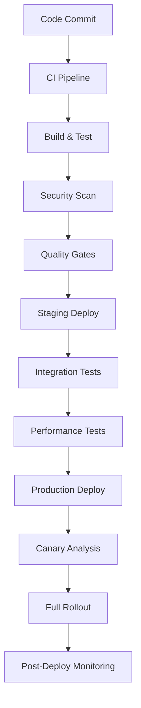

# Release Process & Management
> **Purpose:** Comprehensive release management documentation following 2025 best practices for continuous delivery, progressive deployment strategies, and automated quality gates. This guide enables safe, frequent releases through modern DevOps practices and GitOps workflows.

**Document Type:** Release Engineering & DevOps Process  
**Version:** 2.0 - Enhanced with 2025 Best Practices  
**Last Updated:** 2025-01-15  
**Template Status:** Production Ready

---

## Document Control
| Field | Value |
|-------|-------|
| **Project Name** | [PROJECT_NAME] |
| **Release Manager** | [RELEASE_MANAGER_NAME] |
| **DevOps Lead** | [DEVOPS_LEAD_NAME] |
| **Last Updated** | [YYYY-MM-DD] |
| **Next Review** | [YYYY-MM-DD] |
| **Release Cadence** | [RELEASE_FREQUENCY] |

---

## 📋 Table of Contents
- [🎯 Release Philosophy](#-release-philosophy)
- [📊 Release Strategy Overview](#-release-strategy-overview)
- [🔄 Semantic Versioning & Automation](#-semantic-versioning--automation)
- [🚀 Progressive Delivery Strategies](#-progressive-delivery-strategies)
- [⚡ Automated Release Pipeline](#-automated-release-pipeline)
- [🛡️ Quality Gates & Safety Measures](#️-quality-gates--safety-measures)
- [📈 GitOps Workflow](#-gitops-workflow)
- [🔧 Release Execution Procedures](#-release-execution-procedures)
- [📊 Monitoring & Observability](#-monitoring--observability)
- [🔄 Rollback & Recovery](#-rollback--recovery)
- [📝 Communication & Documentation](#-communication--documentation)
- [🎯 Continuous Improvement](#-continuous-improvement)

---

## 🎯 Release Philosophy

### Modern Release Principles

[RELEASE_PHILOSOPHY_DESCRIPTION] is built on [INDUSTRY_PRACTICES] that prioritize [PHILOSOPHY_PRIORITIES]:

#### 🚀 **[PRINCIPLE_1_TITLE]**
- **[PRINCIPLE_1_FEATURE_1]** reduce [FEATURE_1_BENEFIT]
- **[PRINCIPLE_1_FEATURE_2]** ensure [FEATURE_2_OUTCOME]
- **[PRINCIPLE_1_FEATURE_3]** minimizes [FEATURE_3_IMPACT]
- **[PRINCIPLE_1_FEATURE_4]** decouple [FEATURE_4_SEPARATION]

#### 🛡️ **[PRINCIPLE_2_TITLE]**
- **[PRINCIPLE_2_FEATURE_1]** prevent [FEATURE_1_PREVENTION]
- **[PRINCIPLE_2_FEATURE_2]** at [FEATURE_2_SCOPE]
- **[PRINCIPLE_2_FEATURE_3]** provide [FEATURE_3_RECOVERY]
- **[PRINCIPLE_2_FEATURE_4]** based on [FEATURE_4_DATA_SOURCE]

#### 📈 **[PRINCIPLE_3_TITLE]**
- **[PRINCIPLE_3_FEATURE_1]** through [FEATURE_1_STAGES]
- **[PRINCIPLE_3_FEATURE_2]** for [FEATURE_2_PURPOSE]
- **[PRINCIPLE_3_FEATURE_3]** to ensure [FEATURE_3_GOAL]
- **[PRINCIPLE_3_FEATURE_4]** to measure [FEATURE_4_METRICS]

#### 🤝 **[PRINCIPLE_4_TITLE]**
- **[PRINCIPLE_4_FEATURE_1]** between [FEATURE_1_TEAMS]
- **[PRINCIPLE_4_FEATURE_2]** with [FEATURE_2_VISIBILITY]
- **[PRINCIPLE_4_FEATURE_3]** focused on [FEATURE_3_FOCUS]
- **[PRINCIPLE_4_FEATURE_4]** from [FEATURE_4_SOURCES]

### Release Success Metrics

[METRICS_MEASUREMENT_DESCRIPTION]:

| Metric | Target | Current | Industry Benchmark |
|--------|--------|---------|-------------------|
| **Deployment Frequency** | Daily | [CURRENT_FREQUENCY] | Weekly (High Performers: Daily) |
| **Lead Time for Changes** | <1 day | [CURRENT_LEAD_TIME] | 1-7 days (High Performers: <1 day) |
| **Mean Time to Recovery** | <1 hour | [CURRENT_MTTR] | <1 hour (High Performers) |
| **Change Failure Rate** | <5% | [CURRENT_CFR] | 0-15% (High Performers: 0-5%) |

---

## 📊 Release Strategy Overview

### Release Types and Cadence

[RELEASE_TYPES_DESCRIPTION] to balance [BALANCE_FACTORS]:

#### 🔄 **[RELEASE_TYPE_1_NAME]**
- **Trigger:** [TYPE_1_TRIGGER]
- **Automation Level:** [TYPE_1_AUTOMATION]
- **Deployment Strategy:** [TYPE_1_STRATEGY]
- **Rollback:** [TYPE_1_ROLLBACK]
- **Best For:** [TYPE_1_USE_CASES]

#### 📅 **[RELEASE_TYPE_2_NAME]**
- **Trigger:** [TYPE_2_TRIGGER]
- **Automation Level:** [TYPE_2_AUTOMATION]
- **Deployment Strategy:** [TYPE_2_STRATEGY]
- **Rollback:** [TYPE_2_ROLLBACK]
- **Best For:** [TYPE_2_USE_CASES]

#### 🚨 **[RELEASE_TYPE_3_NAME]**
- **Trigger:** [TYPE_3_TRIGGER]
- **Automation Level:** [TYPE_3_AUTOMATION]
- **Deployment Strategy:** [TYPE_3_STRATEGY]
- **Rollback:** [TYPE_3_ROLLBACK]
- **Best For:** [TYPE_3_USE_CASES]

#### 🎯 **[RELEASE_TYPE_4_NAME]**
- **Trigger:** [TYPE_4_TRIGGER]
- **Automation Level:** [TYPE_4_AUTOMATION]
- **Deployment Strategy:** [TYPE_4_STRATEGY]
- **Rollback:** [TYPE_4_ROLLBACK]
- **Best For:** [TYPE_4_USE_CASES]

### Environment Promotion Strategy

[ENVIRONMENT_PROMOTION_DESCRIPTION]:

```mermaid
graph LR
    A[[ENVIRONMENT_1]] --> B[[ENVIRONMENT_2]]
    B --> C[[ENVIRONMENT_3]]
    C --> D[[ENVIRONMENT_4]]
    
    A --> |[FLOW_1_LABEL]| A
    B --> |[FLOW_2_LABEL]| B
    C --> |[FLOW_3_LABEL]| C
    D --> |[FLOW_4_LABEL]| D
```

#### **[ENVIRONMENT_1_NAME]**
- **Purpose:** [ENV_1_PURPOSE]
- **Deployment:** [ENV_1_DEPLOYMENT]
- **Data:** [ENV_1_DATA]
- **Monitoring:** [ENV_1_MONITORING]

#### **[ENVIRONMENT_2_NAME]**
- **Purpose:** [ENV_2_PURPOSE]
- **Deployment:** [ENV_2_DEPLOYMENT]
- **Data:** [ENV_2_DATA]
- **Monitoring:** [ENV_2_MONITORING]

#### **[ENVIRONMENT_3_NAME]**
- **Purpose:** [ENV_3_PURPOSE]
- **Deployment:** [ENV_3_DEPLOYMENT]
- **Data:** [ENV_3_DATA]
- **Monitoring:** [ENV_3_MONITORING]

#### **[ENVIRONMENT_4_NAME]**
- **Purpose:** [ENV_4_PURPOSE]
- **Deployment:** [ENV_4_DEPLOYMENT]
- **Data:** [ENV_4_DATA]
- **Monitoring:** [ENV_4_MONITORING]

---

## 🔄 Semantic Versioning & Automation

### Semantic Versioning Strategy

[VERSIONING_STRATEGY_DESCRIPTION] follows [VERSIONING_STANDARD] with [VERSION_MANAGEMENT_TYPE]:

#### **[VERSION_FORMAT_TITLE]**

```
[VERSION_COMPONENT_1]: [COMPONENT_1_DESCRIPTION]
[VERSION_COMPONENT_2]: [COMPONENT_2_DESCRIPTION]
[VERSION_COMPONENT_3]: [COMPONENT_3_DESCRIPTION]
```

#### **[PRERELEASE_IDENTIFIERS_TITLE]**
- **[PRERELEASE_TYPE_1]:** `[PRERELEASE_FORMAT_1]` - [PRERELEASE_DESC_1]
- **[PRERELEASE_TYPE_2]:** `[PRERELEASE_FORMAT_2]` - [PRERELEASE_DESC_2]
- **[PRERELEASE_TYPE_3]:** `[PRERELEASE_FORMAT_3]` - [PRERELEASE_DESC_3]

### Automated Versioning with Conventional Commits

[COMMIT_CONVENTION_DESCRIPTION] uses [COMMIT_STANDARD] to automate [AUTOMATION_SCOPE]:

#### **[COMMIT_FORMAT_TITLE]**
```
[COMMIT_FORMAT_PATTERN]

[COMMIT_BODY_PATTERN]

[COMMIT_FOOTER_PATTERN]
```

#### **[VERSION_BUMP_RULES_TITLE]**
- **[BUMP_TRIGGER_1]:** [BUMP_TYPE_1]
- **[BUMP_TRIGGER_2]:** [BUMP_TYPE_2]
- **[BUMP_TRIGGER_3]:** [BUMP_TYPE_3]
- **[BUMP_TRIGGER_4]:** [BUMP_TYPE_4]

#### **[COMMIT_EXAMPLES_TITLE]**
```bash
# [EXAMPLE_1_TYPE] ([EXAMPLE_1_VERSION_CHANGE])
[EXAMPLE_1_COMMIT_MESSAGE]

# [EXAMPLE_2_TYPE] ([EXAMPLE_2_VERSION_CHANGE])
[EXAMPLE_2_COMMIT_MESSAGE]

# [EXAMPLE_3_TYPE] ([EXAMPLE_3_VERSION_CHANGE])
[EXAMPLE_3_COMMIT_MESSAGE]

[BREAKING_CHANGE_EXAMPLE]
```

### Automated Release Tools

#### **[RELEASE_CONFIG_TITLE]**
```json
{
  "branches": ["[RELEASE_BRANCH]"],
  "plugins": [
    "[PLUGIN_1]",
    "[PLUGIN_2]",
    "[PLUGIN_3]",
    "[PLUGIN_4]",
    "[PLUGIN_5]",
    "[PLUGIN_6]"
  ]
}
```

#### **[AUTOMATION_FEATURES_TITLE]**
- **[AUTOMATION_FEATURE_1]** based on [FEATURE_1_SOURCE]
- **[AUTOMATION_FEATURE_2]** from [FEATURE_2_SOURCE]
- **[AUTOMATION_FEATURE_3]** with [FEATURE_3_DETAILS]
- **[AUTOMATION_FEATURE_4]** to [FEATURE_4_TARGET]
- **[AUTOMATION_FEATURE_5]** with [FEATURE_5_CONTENT]
- **[AUTOMATION_FEATURE_6]** for [FEATURE_6_PURPOSE]

---

## 🚀 Progressive Delivery Strategies

### Canary Deployments

[CANARY_DEPLOYMENT_DESCRIPTION] gradually expose [DEPLOYMENT_SCOPE] to [EXPOSURE_STRATEGY]:

#### **[CANARY_ROLLOUT_TITLE]**
```yaml
stages:
  - name: "[STAGE_1_NAME]"
    traffic_percentage: [STAGE_1_TRAFFIC]%
    duration: [STAGE_1_DURATION]
    success_criteria:
      - [STAGE_1_CRITERIA_1]
      - [STAGE_1_CRITERIA_2]
      
  - name: "[STAGE_2_NAME]"
    traffic_percentage: [STAGE_2_TRAFFIC]%
    duration: [STAGE_2_DURATION]
    success_criteria:
      - [STAGE_2_CRITERIA_1]
      - [STAGE_2_CRITERIA_2]
      
  - name: "Full Rollout"
    traffic_percentage: 100%
    success_criteria:
      - error_rate < 0.01%
      - response_time_p95 < 300ms
```

#### **Canary Implementation**
- **Traffic Splitting:** Istio service mesh or AWS ALB weighted routing
- **Monitoring:** Real-time metrics collection and analysis
- **Automated Promotion:** Metrics-based progression through stages
- **Rollback Triggers:** Automatic rollback on threshold violations

### Blue-Green Deployments

Blue-green deployments maintain two identical production environments:

#### **Blue-Green Process**
1. **Deploy to Inactive Environment** (Green)
2. **Run Smoke Tests** on Green environment
3. **Switch Traffic** from Blue to Green
4. **Monitor Performance** on Green environment
5. **Keep Blue as Rollback** option for immediate recovery

#### **Infrastructure Requirements**
- **Identical Environments:** Same capacity, configuration, and dependencies
- **Load Balancer Control:** Instant traffic switching capability
- **Database Compatibility:** Schema changes must be backward compatible
- **Health Check Integration:** Automated validation before traffic switch

### Feature Flags

Feature flags provide runtime control over feature activation:

#### **Flag Types and Usage**
- **Release Flags:** Control feature rollout to user segments
- **Experiment Flags:** A/B testing and gradual feature exposure
- **Operational Flags:** Circuit breakers and performance toggles
- **Permission Flags:** Role-based feature access control

#### **Flag Management Best Practices**
```javascript
// Feature flag implementation example
const featureFlags = {
  newUserDashboard: {
    enabled: true,
    rollout: {
      percentage: 50,
      userSegments: ['beta_users', 'premium_users']
    }
  },
  advancedAnalytics: {
    enabled: false,
    rollout: {
      percentage: 0,
      userSegments: []
    }
  }
};
```

#### **Flag Lifecycle Management**
- **Creation:** Clear naming conventions and documentation
- **Rollout:** Gradual exposure with monitoring
- **Cleanup:** Automated removal of obsolete flags
- **Audit:** Regular review of active flags and their usage

---

## ⚡ Automated Release Pipeline

### CI/CD Pipeline Architecture

Our release pipeline implements GitOps principles with comprehensive automation:



### Pipeline Stages

#### **Stage 1: Code Integration**
```yaml
code_integration:
  triggers:
    - push_to_main
    - pull_request_merge
  actions:
    - checkout_code
    - install_dependencies
    - run_linting
    - run_unit_tests
  quality_gates:
    - test_coverage >= 80%
    - linting_errors == 0
    - security_vulnerabilities == 0
```

#### **Stage 2: Build & Package**
```yaml
build_package:
  actions:
    - build_application
    - create_docker_image
    - scan_container_security
    - push_to_registry
  artifacts:
    - application_binary
    - docker_image
    - security_scan_report
```

#### **Stage 3: Automated Testing**
```yaml
automated_testing:
  parallel_execution:
    - integration_tests
    - api_tests
    - ui_tests
    - performance_tests
  quality_gates:
    - all_tests_pass
    - performance_regression < 5%
    - api_response_time < 200ms
```

#### **Stage 4: Security & Compliance**
```yaml
security_compliance:
  scans:
    - dependency_vulnerabilities
    - container_security
    - infrastructure_compliance
    - data_privacy_checks
  quality_gates:
    - critical_vulnerabilities == 0
    - compliance_score >= 95%
```

#### **Stage 5: Deployment**
```yaml
deployment:
  strategy: progressive_delivery
  environments:
    - staging
    - pre_production
    - production_canary
    - production_full
  monitoring:
    - health_checks
    - performance_metrics
    - business_metrics
```

### Pipeline Configuration

#### **GitHub Actions Workflow**
```yaml
name: Release Pipeline

on:
  push:
    branches: [main]
  pull_request:
    branches: [main]

jobs:
  test:
    runs-on: ubuntu-latest
    steps:
      - uses: actions/checkout@v4
      - uses: actions/setup-node@v4
        with:
          node-version: '20'
      - run: npm ci
      - run: npm run test:coverage
      - run: npm run lint
      - run: npm run security:scan

  build:
    needs: test
    runs-on: ubuntu-latest
    steps:
      - uses: actions/checkout@v4
      - run: docker build -t app:${{ github.sha }} .
      - run: docker push registry/app:${{ github.sha }}

  deploy:
    needs: build
    runs-on: ubuntu-latest
    if: github.ref == 'refs/heads/main'
    steps:
      - uses: actions/checkout@v4
      - run: kubectl set image deployment/app app=registry/app:${{ github.sha }}
      - run: kubectl rollout status deployment/app
```

---

## 🛡️ Quality Gates & Safety Measures

### Automated Quality Gates

Quality gates prevent defective code from reaching production:

#### **Code Quality Gates**
- **Test Coverage:** Minimum 80% code coverage required
- **Code Complexity:** Cyclomatic complexity < 10 per function
- **Duplication:** Code duplication < 3%
- **Maintainability:** Maintainability index > 70
- **Technical Debt:** Technical debt ratio < 5%

#### **Security Gates**
- **Vulnerability Scanning:** Zero critical vulnerabilities allowed
- **Dependency Audit:** All dependencies must be up-to-date and secure
- **Container Security:** Base images must be from approved registries
- **Secrets Detection:** No hardcoded secrets in code
- **Compliance Checks:** SOC2, GDPR, and industry-specific requirements

#### **Performance Gates**
- **Load Testing:** Application must handle expected traffic load
- **Response Time:** 95th percentile response time < 500ms
- **Memory Usage:** Memory consumption within acceptable limits
- **CPU Utilization:** CPU usage < 70% under normal load
- **Database Performance:** Query performance within SLA requirements

### Safety Mechanisms

#### **Automated Rollback Triggers**
```yaml
rollback_triggers:
  error_rate:
    threshold: 1%
    window: 5m
    action: immediate_rollback
    
  response_time:
    threshold: 1000ms
    percentile: 95
    window: 10m
    action: immediate_rollback
    
  business_metrics:
    conversion_rate_drop: 10%
    window: 15m
    action: alert_and_prepare_rollback
```

#### **Circuit Breaker Implementation**
```javascript
const circuitBreaker = {
  failureThreshold: 5,
  timeout: 60000,
  resetTimeout: 30000,
  onOpen: () => {
    // Fallback to previous version
    routeTrafficToPreviousVersion();
  },
  onHalfOpen: () => {
    // Test with limited traffic
    enableCanaryTraffic(5);
  }
};
```

---

## 📈 GitOps Workflow

### GitOps Principles

Our GitOps workflow treats Git as the single source of truth for both application and infrastructure:

#### **Repository Structure**
```
├── applications/
│   ├── frontend/
│   │   ├── src/
│   │   ├── Dockerfile
│   │   └── package.json
│   └── backend/
│       ├── src/
│       ├── Dockerfile
│       └── package.json
├── infrastructure/
│   ├── kubernetes/
│   │   ├── base/
│   │   └── overlays/
│   └── terraform/
│       ├── modules/
│       └── environments/
└── gitops/
    ├── applications/
    ├── infrastructure/
    └── policies/
```

#### **GitOps Workflow Process**
1. **Developer commits** code changes to application repository
2. **CI pipeline** builds, tests, and creates artifacts
3. **GitOps controller** updates deployment manifests
4. **ArgoCD/Flux** detects changes and applies to cluster
5. **Monitoring** validates deployment success
6. **Alerts** notify team of any issues

### ArgoCD Configuration

#### **Application Definition**
```yaml
apiVersion: argoproj.io/v1alpha1
kind: Application
metadata:
  name: web-app
  namespace: argocd
spec:
  project: default
  source:
    repoURL: https://github.com/company/app-manifests
    targetRevision: HEAD
    path: applications/web-app
  destination:
    server: https://kubernetes.default.svc
    namespace: production
  syncPolicy:
    automated:
      prune: true
      selfHeal: true
    syncOptions:
      - CreateNamespace=true
```

#### **Progressive Sync Strategy**
```yaml
apiVersion: argoproj.io/v1alpha1
kind: Rollout
metadata:
  name: web-app
spec:
  replicas: 10
  strategy:
    canary:
      steps:
      - setWeight: 10
      - pause: {duration: 10m}
      - setWeight: 50
      - pause: {duration: 10m}
      - setWeight: 100
  selector:
    matchLabels:
      app: web-app
  template:
    metadata:
      labels:
        app: web-app
    spec:
      containers:
      - name: web-app
        image: registry/web-app:latest
```

---

## 🔧 Release Execution Procedures

### Pre-Release Checklist

#### **Planning Phase (T-1 Week)**
- [ ] **Release Planning Meeting** scheduled with all stakeholders
- [ ] **Feature Freeze** implemented for release branch
- [ ] **Documentation Updates** completed for new features
- [ ] **Security Review** completed for all changes
- [ ] **Performance Testing** scheduled and resources allocated
- [ ] **Rollback Plan** documented and validated
- [ ] **Communication Plan** prepared for stakeholders

#### **Preparation Phase (T-2 Days)**
- [ ] **Release Branch** created from main branch
- [ ] **Version Bump** automated through semantic release
- [ ] **Changelog Generation** completed and reviewed
- [ ] **Dependency Updates** applied and tested
- [ ] **Security Scans** completed with zero critical issues
- [ ] **Performance Baseline** established for comparison
- [ ] **Monitoring Dashboards** configured for release metrics

#### **Final Validation (T-1 Day)**
- [ ] **Full Test Suite** executed successfully
- [ ] **Integration Tests** passing in staging environment
- [ ] **Performance Tests** meeting SLA requirements
- [ ] **Security Validation** completed
- [ ] **Database Migrations** tested and validated
- [ ] **Rollback Procedures** tested and confirmed working
- [ ] **Team Readiness** confirmed for release day

### Release Day Execution

#### **Release Execution Timeline**
```
09:00 - Release Go/No-Go Decision
09:30 - Begin Canary Deployment (5% traffic)
10:00 - Monitor Canary Metrics
10:30 - Expand to 25% traffic (if metrics healthy)
11:00 - Monitor Expanded Canary
11:30 - Expand to 50% traffic (if metrics healthy)
12:00 - Monitor Half Traffic
13:00 - Full Rollout (100% traffic)
13:30 - Post-Release Monitoring
14:00 - Release Success Confirmation
```

#### **Go/No-Go Criteria**
- [ ] **All Quality Gates** passed successfully
- [ ] **Infrastructure Health** confirmed stable
- [ ] **Team Availability** confirmed for monitoring period
- [ ] **Rollback Capability** tested and ready
- [ ] **Monitoring Systems** operational and configured
- [ ] **Communication Channels** established and tested

### Deployment Commands

#### **Automated Deployment**
```bash
# Trigger automated release pipeline
gh workflow run release.yml --ref main

# Monitor deployment progress
kubectl rollout status deployment/web-app -n production

# Check canary metrics
kubectl get rollout web-app -n production -o yaml
```

#### **Manual Deployment (Emergency)**
```bash
# Emergency hotfix deployment
kubectl set image deployment/web-app web-app=registry/web-app:hotfix-1.2.3

# Verify deployment
kubectl get pods -n production -l app=web-app

# Check application health
kubectl exec -it deployment/web-app -- curl localhost:8080/health
```

---

## 📊 Monitoring & Observability

### Release Monitoring Strategy

Comprehensive monitoring ensures release success and enables rapid issue detection:

#### **Technical Metrics**
- **Application Performance:** Response times, throughput, error rates
- **Infrastructure Health:** CPU, memory, disk, network utilization
- **Database Performance:** Query times, connection pools, deadlocks
- **External Dependencies:** API response times, third-party service health

#### **Business Metrics**
- **User Engagement:** Session duration, page views, feature usage
- **Conversion Rates:** Sign-ups, purchases, goal completions
- **Revenue Impact:** Transaction volume, average order value
- **Customer Satisfaction:** Support tickets, user feedback scores

### Monitoring Dashboard Configuration

#### **Release Dashboard Widgets**
```yaml
dashboard:
  name: "Release Monitoring"
  widgets:
    - type: "error_rate"
      query: "sum(rate(http_requests_total{status=~'5..'}[5m]))"
      threshold: 0.01
      
    - type: "response_time"
      query: "histogram_quantile(0.95, http_request_duration_seconds)"
      threshold: 0.5
      
    - type: "throughput"
      query: "sum(rate(http_requests_total[5m]))"
      
    - type: "deployment_status"
      query: "kube_deployment_status_replicas_available"
```

#### **Alert Configuration**
```yaml
alerts:
  - name: "High Error Rate"
    condition: "error_rate > 1%"
    duration: "5m"
    action: "immediate_rollback"
    
  - name: "Slow Response Time"
    condition: "response_time_p95 > 1s"
    duration: "10m"
    action: "alert_team"
    
  - name: "Low Conversion Rate"
    condition: "conversion_rate < baseline * 0.9"
    duration: "15m"
    action: "prepare_rollback"
```

### Observability Tools

#### **Metrics Collection**
- **Prometheus:** Time-series metrics collection and storage
- **Grafana:** Visualization and dashboarding
- **AlertManager:** Alert routing and notification management

#### **Distributed Tracing**
- **Jaeger:** Request tracing across microservices
- **OpenTelemetry:** Standardized observability instrumentation
- **Zipkin:** Alternative tracing solution for specific use cases

#### **Log Management**
- **ELK Stack:** Elasticsearch, Logstash, Kibana for log analysis
- **Fluentd:** Log collection and forwarding
- **Loki:** Lightweight log aggregation system

---

## 🔄 Rollback & Recovery

### Rollback Strategies

Fast, reliable rollback capabilities are essential for production safety:

#### **Automated Rollback Triggers**
- **Error Rate Spike:** >1% error rate for 5 minutes
- **Performance Degradation:** >50% increase in response time
- **Business Impact:** >10% drop in conversion rate
- **Infrastructure Issues:** Resource exhaustion or service failures

#### **Rollback Methods**

##### **1. Traffic Routing Rollback**
```bash
# Immediate traffic switch to previous version
kubectl patch rollout web-app -p '{"spec":{"strategy":{"canary":{"steps":[{"setWeight":0}]}}}}'

# Verify traffic routing
kubectl get rollout web-app -o jsonpath='{.status.canary.weights}'
```

##### **2. Container Image Rollback**
```bash
# Rollback to previous image version
kubectl rollout undo deployment/web-app -n production

# Check rollback status
kubectl rollout status deployment/web-app -n production
```

##### **3. Feature Flag Rollback**
```javascript
// Disable feature flag immediately
featureFlags.updateFlag('newFeature', {
  enabled: false,
  rollout: { percentage: 0 }
});
```

##### **4. Database Rollback**
```sql
-- Execute pre-prepared rollback script
BEGIN TRANSACTION;
-- Rollback schema changes
ALTER TABLE users DROP COLUMN new_field;
-- Rollback data changes
UPDATE users SET status = 'active' WHERE status = 'verified';
COMMIT;
```

### Recovery Procedures

#### **Incident Response Process**
1. **Detection:** Automated alerts or manual discovery
2. **Assessment:** Evaluate impact and determine rollback necessity
3. **Communication:** Notify stakeholders and update status page
4. **Rollback:** Execute appropriate rollback strategy
5. **Verification:** Confirm system stability and functionality
6. **Post-Incident:** Conduct blameless postmortem

#### **Recovery Validation Checklist**
- [ ] **Application Health:** All health checks passing
- [ ] **Performance Metrics:** Response times within SLA
- [ ] **Error Rates:** Error rates below baseline
- [ ] **Business Metrics:** Key metrics recovering to normal levels
- [ ] **User Experience:** No user-reported issues
- [ ] **Data Integrity:** No data corruption or loss

### Disaster Recovery

#### **Backup and Restore Procedures**
- **Database Backups:** Automated daily backups with point-in-time recovery
- **Configuration Backups:** Git-based configuration management
- **Infrastructure Snapshots:** Cloud provider snapshot capabilities
- **Application State:** Stateless application design for easy recovery

#### **Multi-Region Failover**
```yaml
failover_strategy:
  primary_region: "us-east-1"
  secondary_region: "us-west-2"
  failover_triggers:
    - region_unavailability > 5m
    - error_rate > 5%
    - response_time > 5s
  recovery_time_objective: 15m
  recovery_point_objective: 5m
```

---

## 📝 Communication & Documentation

### Release Communication Strategy

Effective communication ensures all stakeholders are informed throughout the release process:

#### **Stakeholder Communication Matrix**

| Stakeholder | Pre-Release | During Release | Post-Release |
|-------------|-------------|----------------|--------------|
| **Development Team** | Planning meeting, technical briefing | Real-time status updates | Retrospective, lessons learned |
| **Product Team** | Feature review, acceptance criteria | Deployment progress | Success metrics, user feedback |
| **Operations Team** | Infrastructure readiness | Monitoring alerts | Performance analysis |
| **Customer Support** | Feature training, FAQ updates | Issue escalation | Customer feedback summary |
| **Executive Team** | Release summary, risk assessment | Critical issues only | Business impact report |
| **End Users** | Feature announcements | Service status | Release notes, tutorials |

#### **Communication Channels**
- **Slack/Teams:** Real-time updates and coordination
- **Email:** Formal notifications and summaries
- **Status Page:** Public service status and incident updates
- **Documentation:** Release notes and feature documentation
- **Video Calls:** Critical decision meetings and briefings

### Release Documentation

#### **Release Notes Template**
```markdown
# Release v2.1.0 - [Release Date]

## 🎉 New Features
- **Feature Name**: Description of new functionality and user benefit
- **API Enhancement**: New endpoints and improved performance

## 🐛 Bug Fixes
- **Issue #123**: Fixed login timeout issue affecting mobile users
- **Issue #456**: Resolved data synchronization problem

## 🔧 Improvements
- **Performance**: 25% improvement in page load times
- **Security**: Updated dependencies and security patches

## ⚠️ Breaking Changes
- **API v1 Deprecation**: API v1 will be removed in v3.0.0
- **Configuration Changes**: Update config files as per migration guide

## 📋 Migration Guide
1. Update configuration files
2. Run database migrations
3. Update client applications

## 🔗 Links
- [Full Changelog](link-to-changelog)
- [Migration Guide](link-to-migration-guide)
- [Documentation](link-to-docs)
```

#### **Technical Documentation Updates**
- [ ] **API Documentation:** Updated with new endpoints and changes
- [ ] **User Guides:** New features and workflow updates
- [ ] **Architecture Diagrams:** System changes and new components
- [ ] **Runbooks:** Updated operational procedures
- [ ] **Troubleshooting Guides:** New known issues and solutions

### Post-Release Reporting

#### **Release Success Report Template**
```markdown
# Release v2.1.0 Success Report

## 📊 Key Metrics
- **Deployment Time**: 45 minutes (Target: <60 minutes)
- **Error Rate**: 0.02% (Target: <0.1%)
- **Performance Impact**: +5% improvement in response time
- **User Adoption**: 78% of users accessed new features within 24h

## ✅ Achievements
- Zero-downtime deployment achieved
- All quality gates passed
- No rollbacks required
- Positive user feedback

## 🎯 Areas for Improvement
- Canary deployment duration could be optimized
- Monitoring dashboard needs additional business metrics
- Communication timing could be improved

## 📈 Business Impact
- 15% increase in user engagement
- 8% improvement in conversion rate
- Reduced support tickets by 12%

## 🔄 Action Items
- [ ] Optimize canary deployment timing
- [ ] Add business metrics to monitoring
- [ ] Update communication templates
```

---

## 🎯 Continuous Improvement

### Release Process Optimization

Continuous improvement ensures our release process evolves with industry best practices:

#### **Regular Review Cycles**
- **Weekly:** Release metrics review and immediate improvements
- **Monthly:** Process efficiency analysis and optimization
- **Quarterly:** Strategic review and major process updates
- **Annually:** Complete process overhaul and technology updates

#### **Improvement Metrics**
- **Deployment Frequency:** Increase in release frequency
- **Lead Time Reduction:** Faster time from commit to production
- **Quality Improvements:** Reduced defect rates and incidents
- **Team Satisfaction:** Developer and operations team feedback

### Feedback Collection

#### **Team Retrospectives**
```markdown
# Release Retrospective Template

## What Went Well? 🎉
- Automated testing caught critical issues early
- Team communication was excellent
- Monitoring provided clear visibility

## What Could Be Improved? 🔧
- Deployment took longer than expected
- Some manual steps could be automated
- Documentation needs updates

## Action Items 📋
- [ ] Automate manual deployment steps
- [ ] Update monitoring dashboards
- [ ] Improve documentation process
```

#### **Stakeholder Feedback**
- **Developer Experience Surveys:** Quarterly feedback on tooling and processes
- **Operations Team Input:** Monthly feedback on deployment and monitoring
- **Business Stakeholder Reviews:** Quarterly assessment of release impact
- **Customer Feedback Analysis:** Ongoing analysis of user experience

### Technology Evolution

#### **Tool Evaluation Process**
1. **Identify Needs:** Analyze current process gaps and pain points
2. **Research Solutions:** Evaluate available tools and technologies
3. **Pilot Testing:** Small-scale testing with limited scope
4. **Team Training:** Comprehensive training and documentation
5. **Gradual Rollout:** Phased implementation with feedback collection
6. **Full Adoption:** Complete migration and process integration

#### **Emerging Technologies to Watch**
- **AI/ML in DevOps:** Predictive analytics for deployment success
- **Advanced Observability:** Enhanced monitoring and alerting capabilities
- **Security Integration:** Shift-left security and automated compliance
- **Infrastructure as Code:** Advanced IaC tools and practices
- **Serverless Deployments:** Function-as-a-Service deployment strategies

### Knowledge Sharing

#### **Internal Knowledge Base**
- **Process Documentation:** Detailed procedures and best practices
- **Troubleshooting Guides:** Common issues and resolution steps
- **Tool Documentation:** Configuration and usage guides
- **Case Studies:** Successful releases and lessons learned

#### **External Community Engagement**
- **Conference Presentations:** Share experiences and best practices
- **Blog Posts:** Document innovations and improvements
- **Open Source Contributions:** Contribute to DevOps tooling
- **Industry Meetups:** Participate in local DevOps communities

---

## 🔧 Quick Reference

### Emergency Contacts
- **Release Manager:** [RELEASE_MANAGER_CONTACT]
- **DevOps Lead:** [DEVOPS_LEAD_CONTACT]
- **On-Call Engineer:** [ONCALL_CONTACT]
- **Incident Commander:** [INCIDENT_COMMANDER_CONTACT]

### Critical Commands
```bash
# Check deployment status
kubectl get rollouts -n production

# Emergency rollback
kubectl rollout undo deployment/app -n production

# View recent releases
gh release list --limit 10

# Check system health
curl -f https://api.company.com/health
```

### Key Dashboards
- **Release Monitoring:** [GRAFANA_RELEASE_DASHBOARD_URL]
- **System Health:** [GRAFANA_HEALTH_DASHBOARD_URL]
- **Business Metrics:** [BUSINESS_METRICS_DASHBOARD_URL]
- **Incident Management:** [INCIDENT_DASHBOARD_URL]

### Documentation Links
- **Runbooks:** [RUNBOOK_URL]
- **API Documentation:** [API_DOCS_URL]
- **Architecture Diagrams:** [ARCHITECTURE_DOCS_URL]
- **Troubleshooting:** [TROUBLESHOOTING_URL]

---

*This release process documentation is a living document that evolves with our practices and industry standards. Regular updates ensure we maintain world-class release engineering capabilities.*

---

**Last Updated:** [TIMESTAMP]  
**Next Review:** [NEXT_REVIEW_DATE]  
**Document Owner:** [RELEASE_MANAGER]  
**Feedback:** [FEEDBACK_EMAIL]