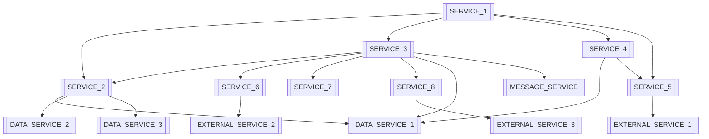

# Backend Service Catalog & Manifest
> **Purpose:** Comprehensive backend service catalog following 2025 best practices for microservices documentation, API governance, and developer portal integration. This manifest serves as the single source of truth for all backend services, their dependencies, and operational characteristics.

**Document Type:** Service Catalog & Architecture Inventory  
**Version:** 2.0 - Enhanced with 2025 Best Practices  
**Last Updated:** 2025-01-15  
**Template Status:** Production Ready

---

## Document Control
| Field | Value |
|-------|-------|
| **Project Name** | [PROJECT_NAME] |
| **System Architect** | [SYSTEM_ARCHITECT_NAME] |
| **Service Owner** | [SERVICE_OWNER_NAME] |
| **Last Updated** | [YYYY-MM-DD] |
| **Next Review** | [YYYY-MM-DD] |
| **Total Services** | [SERVICE_COUNT] |

---

## 📋 Table of Contents
- [🎯 Service Catalog Overview](#-service-catalog-overview)
- [🏗️ Architecture Domains](#️-architecture-domains)
- [🔧 Core Services](#-core-services)
- [🌐 API Gateway & External Interfaces](#-api-gateway--external-interfaces)
- [💾 Data Services](#-data-services)
- [🔐 Security & Authentication Services](#-security--authentication-services)
- [📊 Observability & Monitoring](#-observability--monitoring)
- [🚀 Infrastructure Services](#-infrastructure-services)
- [📈 Service Dependencies](#-service-dependencies)
- [🔄 Service Lifecycle Management](#-service-lifecycle-management)
- [📚 Developer Resources](#-developer-resources)
- [🎯 Service Standards & Governance](#-service-standards--governance)

---

## 🎯 Service Catalog Overview

### Service Catalog Philosophy

[SERVICE_CATALOG_DESCRIPTION] follows [ARCHITECTURE_PRINCIPLES] and serves as [CATALOG_PURPOSE]. This catalog enables:

#### 🔍 **[DISCOVERY_CATEGORY_TITLE]**
- **[DISCOVERY_FEATURE_1]** with [FEATURE_1_SCOPE]
- **[DISCOVERY_FEATURE_2]** and [FEATURE_2_CAPABILITY]
- **[DISCOVERY_FEATURE_3]** and [FEATURE_3_PURPOSE]
- **[DISCOVERY_FEATURE_4]** and [FEATURE_4_MANAGEMENT]

#### 🚀 **[SELFSERVICE_CATEGORY_TITLE]**
- **[SELFSERVICE_FEATURE_1]** with [FEATURE_1_TYPE]
- **[SELFSERVICE_FEATURE_2]** pipelines and [FEATURE_2_SCOPE]
- **[SELFSERVICE_FEATURE_3]** and [FEATURE_3_HANDLING]
- **[SELFSERVICE_FEATURE_4]** frameworks

#### 📊 **[OPERATIONAL_CATEGORY_TITLE]**
- **[OPERATIONAL_FEATURE_1]** and [FEATURE_1_TRACKING]
- **[OPERATIONAL_FEATURE_2]** and [FEATURE_2_METRICS]
- **[OPERATIONAL_FEATURE_3]** and [FEATURE_3_PROCEDURES]
- **[OPERATIONAL_FEATURE_4]** and [FEATURE_4_OPTIMIZATION]

### Service Classification

[SERVICE_ORGANIZATION_DESCRIPTION]:

#### **[TIERS_SECTION_TITLE]**
- **[TIER_1_NAME]:** [TIER_1_DESCRIPTION] with [TIER_1_SLA]
- **[TIER_2_NAME]:** [TIER_2_DESCRIPTION] with [TIER_2_SLA]
- **[TIER_3_NAME]:** [TIER_3_DESCRIPTION] with [TIER_3_SLA]
- **[TIER_4_NAME]:** [TIER_4_DESCRIPTION]

#### **[TYPES_SECTION_TITLE]**
- **[SERVICE_TYPE_1]:** [TYPE_1_DESCRIPTION]
- **[SERVICE_TYPE_2]:** [TYPE_2_DESCRIPTION]
- **[SERVICE_TYPE_3]:** [TYPE_3_DESCRIPTION]
- **[SERVICE_TYPE_4]:** [TYPE_4_DESCRIPTION]

---

## 🏗️ Architecture Domains

### Domain-Driven Service Organization

[BACKEND_ORGANIZATION_DESCRIPTION] following [DESIGN_METHODOLOGY]:

#### **Core Business Domains**

##### 🛒 **[DOMAIN_1_NAME]**
```yaml
domain: [DOMAIN_1_ID]
services:
  - [DOMAIN_1_SERVICE_1]
  - [DOMAIN_1_SERVICE_2]
  - [DOMAIN_1_SERVICE_3]
  - [DOMAIN_1_SERVICE_4]
  - [DOMAIN_1_SERVICE_5]
bounded_context: "[DOMAIN_1_CONTEXT]"
team_owner: "[DOMAIN_1_TEAM]"
```

##### 👤 **[DOMAIN_2_NAME]**
```yaml
domain: [DOMAIN_2_ID]
services:
  - [DOMAIN_2_SERVICE_1]
  - [DOMAIN_2_SERVICE_2]
  - [DOMAIN_2_SERVICE_3]
  - [DOMAIN_2_SERVICE_4]
bounded_context: "[DOMAIN_2_CONTEXT]"
team_owner: "[DOMAIN_2_TEAM]"
```

##### 📊 **[DOMAIN_3_NAME]**
```yaml
domain: [DOMAIN_3_ID]
services:
  - [DOMAIN_3_SERVICE_1]
  - [DOMAIN_3_SERVICE_2]
  - [DOMAIN_3_SERVICE_3]
  - [DOMAIN_3_SERVICE_4]
bounded_context: "[DOMAIN_3_CONTEXT]"
team_owner: "[DOMAIN_3_TEAM]"
```

#### **Supporting Domains**

##### 🔧 **[SUPPORTING_DOMAIN_1_NAME]**
```yaml
domain: [SUPPORTING_DOMAIN_1_ID]
services:
  - [SUPPORTING_DOMAIN_1_SERVICE_1]
  - [SUPPORTING_DOMAIN_1_SERVICE_2]
  - [SUPPORTING_DOMAIN_1_SERVICE_3]
  - [SUPPORTING_DOMAIN_1_SERVICE_4]
bounded_context: "[SUPPORTING_DOMAIN_1_CONTEXT]"
team_owner: "[SUPPORTING_DOMAIN_1_TEAM]"
```

##### 🛡️ **[SUPPORTING_DOMAIN_2_NAME]**
```yaml
domain: [SUPPORTING_DOMAIN_2_ID]
services:
  - [SUPPORTING_DOMAIN_2_SERVICE_1]
  - [SUPPORTING_DOMAIN_2_SERVICE_2]
  - [SUPPORTING_DOMAIN_2_SERVICE_3]
  - [SUPPORTING_DOMAIN_2_SERVICE_4]
bounded_context: "[SUPPORTING_DOMAIN_2_CONTEXT]"
team_owner: "[SUPPORTING_DOMAIN_2_TEAM]"
```

---

## 🔧 Core Services

### Business Logic Services

#### **[CORE_SERVICE_1_NAME]**
```yaml
service_name: [CORE_SERVICE_1_ID]
service_id: [CORE_SERVICE_1_CODE]
tier: [CORE_SERVICE_1_TIER]
domain: [CORE_SERVICE_1_DOMAIN]
description: "[CORE_SERVICE_1_DESCRIPTION]"

technical_details:
  runtime: [CORE_SERVICE_1_RUNTIME]
  framework: [CORE_SERVICE_1_FRAMEWORK]
  database: [CORE_SERVICE_1_DATABASE]
  cache: [CORE_SERVICE_1_CACHE]
  message_queue: [CORE_SERVICE_1_QUEUE]

api_details:
  type: [CORE_SERVICE_1_API_TYPE]
  version: [CORE_SERVICE_1_VERSION]
  base_url: "[CORE_SERVICE_1_BASE_URL]"
  documentation: "[CORE_SERVICE_1_DOCS_URL]"
  openapi_spec: "[CORE_SERVICE_1_OPENAPI_URL]"

ownership:
  team: "[CORE_SERVICE_1_TEAM]"
  primary_contact: "[CORE_SERVICE_1_CONTACT]"
  on_call: "[CORE_SERVICE_1_ONCALL]"
  slack_channel: "[CORE_SERVICE_1_SLACK]"

operational:
  deployment_strategy: "[CORE_SERVICE_1_DEPLOYMENT]"
  scaling: "[CORE_SERVICE_1_SCALING]"
  sla_target: "[CORE_SERVICE_1_SLA]"
  response_time_p95: "[CORE_SERVICE_1_RESPONSE_TIME]"
  
monitoring:
  health_check: "[CORE_SERVICE_1_HEALTH_ENDPOINT]"
  metrics_endpoint: "[CORE_SERVICE_1_METRICS_ENDPOINT]"
  logs: "[CORE_SERVICE_1_LOGGING]"
  tracing: "[CORE_SERVICE_1_TRACING]"
  alerts: "[CORE_SERVICE_1_ALERTS]"

dependencies:
  internal:
    - [CORE_SERVICE_1_INTERNAL_DEP_1]
    - [CORE_SERVICE_1_INTERNAL_DEP_2]
  external:
    - [CORE_SERVICE_1_EXTERNAL_DEP_1]
    - [CORE_SERVICE_1_EXTERNAL_DEP_2]
    
security:
  authentication: "[CORE_SERVICE_1_AUTH]"
  authorization: "[CORE_SERVICE_1_AUTHZ]"
  data_classification: "[CORE_SERVICE_1_DATA_CLASS]"
  compliance: ["[CORE_SERVICE_1_COMPLIANCE_1]", "[CORE_SERVICE_1_COMPLIANCE_2]"]

repository:
  url: "[CORE_SERVICE_1_REPO_URL]"
  main_branch: "[CORE_SERVICE_1_MAIN_BRANCH]"
  ci_cd: "[CORE_SERVICE_1_CICD]"
  deployment_config: "[CORE_SERVICE_1_DEPLOY_CONFIG]"
```

#### **[CORE_SERVICE_2_NAME]**
```yaml
service_name: [CORE_SERVICE_2_ID]
service_id: [CORE_SERVICE_2_CODE]
tier: [CORE_SERVICE_2_TIER]
domain: [CORE_SERVICE_2_DOMAIN]
description: "[CORE_SERVICE_2_DESCRIPTION]"

technical_details:
  runtime: [CORE_SERVICE_2_RUNTIME]
  framework: [CORE_SERVICE_2_FRAMEWORK]
  database: [CORE_SERVICE_2_DATABASE]
  cache: [CORE_SERVICE_2_CACHE]
  message_queue: [CORE_SERVICE_2_QUEUE]

api_details:
  type: [CORE_SERVICE_2_API_TYPE]
  version: [CORE_SERVICE_2_VERSION]
  base_url: "[CORE_SERVICE_2_BASE_URL]"
  graphql_endpoint: "[CORE_SERVICE_2_GRAPHQL_ENDPOINT]"
  documentation: "[CORE_SERVICE_2_DOCS_URL]"

ownership:
  team: "[CORE_SERVICE_2_TEAM]"
  primary_contact: "[CORE_SERVICE_2_CONTACT]"
  on_call: "[CORE_SERVICE_2_ONCALL]"
  slack_channel: "[CORE_SERVICE_2_SLACK]"

operational:
  deployment_strategy: "[CORE_SERVICE_2_DEPLOYMENT]"
  scaling: "[CORE_SERVICE_2_SCALING]"
  sla_target: "[CORE_SERVICE_2_SLA]"
  response_time_p95: "[CORE_SERVICE_2_RESPONSE_TIME]"

dependencies:
  internal:
    - [CORE_SERVICE_2_INTERNAL_DEP_1]
    - [CORE_SERVICE_2_INTERNAL_DEP_2]
    - [CORE_SERVICE_2_INTERNAL_DEP_3]
    - [CORE_SERVICE_2_INTERNAL_DEP_4]
  external:
    - [CORE_SERVICE_2_EXTERNAL_DEP_1]
    - [CORE_SERVICE_2_EXTERNAL_DEP_2]

security:
  authentication: "[CORE_SERVICE_2_AUTH]"
  authorization: "[CORE_SERVICE_2_AUTHZ]"
  data_classification: "[CORE_SERVICE_2_DATA_CLASS]"
  compliance: ["[CORE_SERVICE_2_COMPLIANCE_1]", "[CORE_SERVICE_2_COMPLIANCE_2]", "[CORE_SERVICE_2_COMPLIANCE_3]"]
```

#### **[CORE_SERVICE_3_NAME]**
```yaml
service_name: [CORE_SERVICE_3_ID]
service_id: [CORE_SERVICE_3_CODE]
tier: [CORE_SERVICE_3_TIER]
domain: [CORE_SERVICE_3_DOMAIN]
description: "[CORE_SERVICE_3_DESCRIPTION]"

technical_details:
  runtime: [CORE_SERVICE_3_RUNTIME]
  framework: [CORE_SERVICE_3_FRAMEWORK]
  database: [CORE_SERVICE_3_DATABASE]
  cache: [CORE_SERVICE_3_CACHE]
  search: [CORE_SERVICE_3_SEARCH]

api_details:
  type: [CORE_SERVICE_3_API_TYPE]
  version: [CORE_SERVICE_3_VERSION]
  base_url: "[CORE_SERVICE_3_BASE_URL]"
  documentation: "[CORE_SERVICE_3_DOCS_URL]"

ownership:
  team: "[CORE_SERVICE_3_TEAM]"
  primary_contact: "[CORE_SERVICE_3_CONTACT]"
  on_call: "[CORE_SERVICE_3_ONCALL]"
  slack_channel: "[CORE_SERVICE_3_SLACK]"

operational:
  deployment_strategy: "[CORE_SERVICE_3_DEPLOYMENT]"
  scaling: "[CORE_SERVICE_3_SCALING]"
  sla_target: "[CORE_SERVICE_3_SLA]"
  response_time_p95: "[CORE_SERVICE_3_RESPONSE_TIME]"

dependencies:
  internal:
    - [CORE_SERVICE_3_INTERNAL_DEP_1]
    - [CORE_SERVICE_3_INTERNAL_DEP_2]
  external:
    - [CORE_SERVICE_3_EXTERNAL_DEP_1]
    - [CORE_SERVICE_3_EXTERNAL_DEP_2]

security:
  authentication: "[CORE_SERVICE_3_AUTH]"
  authorization: "[CORE_SERVICE_3_AUTHZ]"
  data_classification: "[CORE_SERVICE_3_DATA_CLASS]"
  compliance: ["[CORE_SERVICE_3_COMPLIANCE_1]", "[CORE_SERVICE_3_COMPLIANCE_2]", "[CORE_SERVICE_3_COMPLIANCE_3]"]
```

---

## 🌐 API Gateway & External Interfaces

### API Gateway Configuration

#### **[API_GATEWAY_NAME]**
```yaml
service_name: [API_GATEWAY_SERVICE_NAME]
service_id: [API_GATEWAY_ID]
tier: [API_GATEWAY_TIER]
domain: [API_GATEWAY_DOMAIN]
description: "[API_GATEWAY_DESCRIPTION]"

technical_details:
  runtime: [API_GATEWAY_RUNTIME]
  framework: [API_GATEWAY_FRAMEWORK]
  load_balancer: [API_GATEWAY_LOAD_BALANCER]
  service_mesh: [API_GATEWAY_SERVICE_MESH]

features:
  - [API_GATEWAY_FEATURE_1]
  - [API_GATEWAY_FEATURE_2]
  - [API_GATEWAY_FEATURE_3]
  - [API_GATEWAY_FEATURE_4]
  - [API_GATEWAY_FEATURE_5]
  - [API_GATEWAY_FEATURE_6]
  - [API_GATEWAY_FEATURE_7]

routing_rules:
  "[API_ROUTE_1]": "[API_SERVICE_1]"
  "[API_ROUTE_2]": "[API_SERVICE_2]"
  "[API_ROUTE_3]": "[API_SERVICE_3]"
  "[API_ROUTE_4]": "[API_SERVICE_4]"
  "[API_ROUTE_5]": "[API_SERVICE_5]"

security_policies:
  - [SECURITY_POLICY_1]
  - [SECURITY_POLICY_2]
  - [SECURITY_POLICY_3]
  - [SECURITY_POLICY_4]
  - [SECURITY_POLICY_5]

monitoring:
  metrics: "[METRICS_STACK]"
  logging: "[LOGGING_STACK]"
  tracing: "[TRACING_STACK]"
  uptime_target: "[UPTIME_TARGET]"
```

### External API Integrations

#### **[EXTERNAL_INTEGRATION_1_NAME]**
```yaml
integration_name: [EXTERNAL_INTEGRATION_1_ID]
service_id: [EXTERNAL_INTEGRATION_1_CODE]
type: [INTEGRATION_TYPE_1]
description: "[EXTERNAL_INTEGRATION_1_DESCRIPTION]"

providers:
  primary: "[PRIMARY_PROVIDER_1]"
  secondary: "[SECONDARY_PROVIDER_1]"
  fallback: "[FALLBACK_PROVIDER_1]"

features:
  - [INTEGRATION_1_FEATURE_1]
  - [INTEGRATION_1_FEATURE_2]
  - [INTEGRATION_1_FEATURE_3]
  - [INTEGRATION_1_FEATURE_4]
  - [INTEGRATION_1_FEATURE_5]

security:
  encryption: "[ENCRYPTION_METHOD_1]"
  key_management: "[KEY_MANAGEMENT_1]"
  audit_logging: "[AUDIT_LOGGING_1]"
  compliance: ["[COMPLIANCE_STANDARD_1]"]
```

#### **[EXTERNAL_INTEGRATION_2_NAME]**
```yaml
integration_name: [EXTERNAL_INTEGRATION_2_ID]
service_id: [EXTERNAL_INTEGRATION_2_CODE]
type: [INTEGRATION_TYPE_2]
description: "[EXTERNAL_INTEGRATION_2_DESCRIPTION]"

providers:
  - "[PROVIDER_2_1]"
  - "[PROVIDER_2_2]"
  - "[PROVIDER_2_3]"
  - "[PROVIDER_2_4]"

features:
  - [INTEGRATION_2_FEATURE_1]
  - [INTEGRATION_2_FEATURE_2]
  - [INTEGRATION_2_FEATURE_3]
  - [INTEGRATION_2_FEATURE_4]
  - [INTEGRATION_2_FEATURE_5]

monitoring:
  sla_tracking: "[SLA_TRACKING_METHOD_2]"
  error_handling: "[ERROR_HANDLING_STRATEGY_2]"
  circuit_breaker: "[CIRCUIT_BREAKER_CONFIG_2]"
```

---

## 💾 Data Services

### Database Services

#### **[DATABASE_CLUSTER_NAME]**
```yaml
service_name: [DATABASE_SERVICE_NAME]
service_id: [DATABASE_SERVICE_ID]
type: [DATABASE_TYPE]
description: "[DATABASE_DESCRIPTION]"

configuration:
  version: "[DATABASE_VERSION]"
  cluster_type: "[CLUSTER_TYPE]"
  instances: [INSTANCE_COUNT]
  storage: "[STORAGE_TYPE]"
  backup_strategy: "[BACKUP_STRATEGY]"

databases:
  - name: "[DATABASE_1_NAME]"
    owner: "[DATABASE_1_OWNER]"
    size: "[DATABASE_1_SIZE]"
    tables: [DATABASE_1_TABLES]
    
  - name: "[DATABASE_2_NAME]"
    owner: "[DATABASE_2_OWNER]"
    size: "[DATABASE_2_SIZE]"
    tables: [DATABASE_2_TABLES]
    
  - name: "[DATABASE_3_NAME]"
    owner: "[DATABASE_3_OWNER]"
    size: "[DATABASE_3_SIZE]"
    tables: [DATABASE_3_TABLES]

performance:
  connection_pooling: "[CONNECTION_POOLING_TOOL]"
  query_optimization: "[QUERY_OPTIMIZATION]"
  monitoring: "[MONITORING_TOOLS]"

security:
  encryption_at_rest: "[ENCRYPTION_AT_REST]"
  encryption_in_transit: "[ENCRYPTION_IN_TRANSIT]"
  access_control: "[ACCESS_CONTROL_METHOD]"
  audit_logging: "[AUDIT_LOGGING_LEVEL]"
```

#### **[CACHE_LAYER_NAME]**
```yaml
service_name: [CACHE_SERVICE_NAME]
service_id: [CACHE_SERVICE_ID]
type: [CACHE_TYPE]
description: "[CACHE_DESCRIPTION]"

configuration:
  version: "[CACHE_VERSION]"
  cluster_mode: "[CLUSTER_MODE]"
  nodes: [NODE_COUNT]
  memory_per_node: "[MEMORY_PER_NODE]"
  persistence: "[PERSISTENCE_STRATEGY]"

usage_patterns:
  - [USAGE_PATTERN_1]
  - [USAGE_PATTERN_2]
  - [USAGE_PATTERN_3]
  - [USAGE_PATTERN_4]
  - [USAGE_PATTERN_5]

performance:
  hit_ratio_target: "[HIT_RATIO_TARGET]"
  latency_p99: "[LATENCY_P99]"
  throughput: "[THROUGHPUT_TARGET]"
```

#### **[SEARCH_ENGINE_NAME]**
```yaml
service_name: [SEARCH_SERVICE_NAME]
service_id: [SEARCH_SERVICE_ID]
type: [SEARCH_ENGINE_TYPE]
description: "[SEARCH_ENGINE_DESCRIPTION]"

configuration:
  version: "[SEARCH_ENGINE_VERSION]"
  nodes: [SEARCH_NODE_COUNT]
  storage_per_node: "[STORAGE_PER_NODE]"
  indices: [INDEX_COUNT]
  total_documents: "[TOTAL_DOCUMENTS]"

use_cases:
  - [USE_CASE_1]
  - [USE_CASE_2]
  - [USE_CASE_3]
  - [USE_CASE_4]

performance:
  search_latency_p95: "[SEARCH_LATENCY_P95]"
  indexing_rate: "[INDEXING_RATE]"
  query_throughput: "[QUERY_THROUGHPUT]"
```

### Message Queue Services

#### **[MESSAGE_QUEUE_NAME]**
```yaml
service_name: [MESSAGE_QUEUE_SERVICE_NAME]
service_id: [MESSAGE_QUEUE_SERVICE_ID]
type: [MESSAGE_QUEUE_TYPE]
description: "[MESSAGE_QUEUE_DESCRIPTION]"

configuration:
  version: "[MESSAGE_QUEUE_VERSION]"
  brokers: [BROKER_COUNT]
  replication_factor: [REPLICATION_FACTOR]
  partitions_per_topic: [PARTITIONS_PER_TOPIC]
  retention_policy: "[RETENTION_POLICY]"

topics:
  - name: "[TOPIC_1_NAME]"
    partitions: [TOPIC_1_PARTITIONS]
    retention: "[TOPIC_1_RETENTION]"
    consumers: ["[CONSUMER_1]", "[CONSUMER_2]", "[CONSUMER_3]"]
    
  - name: "[TOPIC_2_NAME]"
    partitions: [TOPIC_2_PARTITIONS]
    retention: "[TOPIC_2_RETENTION]"
    consumers: ["[CONSUMER_4]", "[CONSUMER_5]", "[CONSUMER_6]"]
    
  - name: "[TOPIC_3_NAME]"
    partitions: [TOPIC_3_PARTITIONS]
    retention: "[TOPIC_3_RETENTION]"
    consumers: ["[CONSUMER_7]", "[CONSUMER_8]", "[CONSUMER_9]"]

monitoring:
  lag_monitoring: "[LAG_MONITORING_TOOL]"
  throughput_tracking: "[THROUGHPUT_TRACKING]"
  consumer_group_monitoring: "[CONSUMER_GROUP_MONITORING]"
```

---

## 🔐 Security & Authentication Services

### Identity and Access Management

#### **[AUTHENTICATION_SERVICE_NAME]**
```yaml
service_name: [AUTH_SERVICE_NAME]
service_id: [AUTH_SERVICE_ID]
tier: [AUTH_SERVICE_TIER]
domain: [AUTH_DOMAIN]
description: "[AUTH_SERVICE_DESCRIPTION]"

technical_details:
  runtime: [AUTH_RUNTIME]
  framework: [AUTH_FRAMEWORK]
  database: [AUTH_DATABASE]
  cache: [AUTH_CACHE]

authentication_methods:
  - [AUTH_METHOD_1]
  - [AUTH_METHOD_2]
  - [AUTH_METHOD_3]
  - [AUTH_METHOD_4]
  - [AUTH_METHOD_5]

token_management:
  access_token_ttl: "[ACCESS_TOKEN_TTL]"
  refresh_token_ttl: "[REFRESH_TOKEN_TTL]"
  token_rotation: "[TOKEN_ROTATION]"
  revocation_support: "[REVOCATION_SUPPORT]"

security_features:
  - [SECURITY_FEATURE_1]
  - [SECURITY_FEATURE_2]
  - [SECURITY_FEATURE_3]
  - [SECURITY_FEATURE_4]
  - [SECURITY_FEATURE_5]

compliance:
  standards: ["[STANDARD_1]", "[STANDARD_2]", "[STANDARD_3]"]
  certifications: ["[CERTIFICATION_1]", "[CERTIFICATION_2]"]
```

#### **[AUTHORIZATION_SERVICE_NAME]**
```yaml
service_name: [AUTHZ_SERVICE_NAME]
service_id: [AUTHZ_SERVICE_ID]
tier: [AUTHZ_SERVICE_TIER]
domain: [AUTHZ_DOMAIN]
description: "[AUTHZ_SERVICE_DESCRIPTION]"

technical_details:
  runtime: [AUTHZ_RUNTIME]
  framework: [AUTHZ_FRAMEWORK]
  database: [AUTHZ_DATABASE]
  policy_engine: "[POLICY_ENGINE]"

authorization_models:
  - [AUTHORIZATION_MODEL_1]
  - [AUTHORIZATION_MODEL_2]
  - [AUTHORIZATION_MODEL_3]
  - [AUTHORIZATION_MODEL_4]

features:
  - [AUTHZ_FEATURE_1]
  - [AUTHZ_FEATURE_2]
  - [AUTHZ_FEATURE_3]
  - [AUTHZ_FEATURE_4]
  - [AUTHZ_FEATURE_5]

performance:
  decision_latency_p95: "[DECISION_LATENCY_P95]"
  throughput: "[AUTHZ_THROUGHPUT]"
  cache_hit_ratio: "[CACHE_HIT_RATIO]"
```

### Security Scanning Services

#### **[SECURITY_SCANNER_SERVICE_NAME]**
```yaml
service_name: [SECURITY_SCANNER_SERVICE_NAME]
service_id: [SECURITY_SCANNER_SERVICE_ID]
tier: [SECURITY_SCANNER_TIER]
domain: [SECURITY_SCANNER_DOMAIN]
description: "[SECURITY_SCANNER_DESCRIPTION]"

scanning_types:
  - [SCANNING_TYPE_1]
  - [SCANNING_TYPE_2]
  - [SCANNING_TYPE_3]
  - [SCANNING_TYPE_4]
  - [SCANNING_TYPE_5]

tools_integration:
  sast: "[SAST_TOOLS]"
  dast: "[DAST_TOOLS]"
  sca: "[SCA_TOOLS]"
  iac: "[IAC_TOOLS]"
  containers: "[CONTAINER_TOOLS]"

automation:
  ci_cd_integration: "[CI_CD_INTEGRATION]"
  scheduled_scans: "[SCHEDULED_SCANS]"
  policy_enforcement: "[POLICY_ENFORCEMENT]"
  reporting: "[REPORTING_METHOD]"
```

---

## 📊 Observability & Monitoring

### Monitoring Stack

#### **[METRICS_COLLECTION_SERVICE_NAME]**
```yaml
service_name: [METRICS_SERVICE_NAME]
service_id: [METRICS_SERVICE_ID]
type: [METRICS_SERVICE_TYPE]
description: "[METRICS_SERVICE_DESCRIPTION]"

configuration:
  version: "[METRICS_VERSION]"
  retention: "[METRICS_RETENTION]"
  scrape_interval: "[SCRAPE_INTERVAL]"
  storage: "[METRICS_STORAGE]"

metrics_sources:
  - [METRICS_SOURCE_1]
  - [METRICS_SOURCE_2]
  - [METRICS_SOURCE_3]
  - [METRICS_SOURCE_4]
  - [METRICS_SOURCE_5]

alerting_rules:
  - [ALERTING_RULE_1]
  - [ALERTING_RULE_2]
  - [ALERTING_RULE_3]
  - [ALERTING_RULE_4]

integration:
  visualization: "[VISUALIZATION_TOOL]"
  alerting: "[ALERTING_TOOL]"
  notification: "[NOTIFICATION_CHANNELS]"
```

#### **[DISTRIBUTED_TRACING_SERVICE_NAME]**
```yaml
service_name: [TRACING_SERVICE_NAME]
service_id: [TRACING_SERVICE_ID]
type: [TRACING_SERVICE_TYPE]
description: "[TRACING_SERVICE_DESCRIPTION]"

configuration:
  version: "[TRACING_VERSION]"
  storage: "[TRACING_STORAGE]"
  retention: "[TRACING_RETENTION]"
  sampling_rate: "[SAMPLING_RATE]"

features:
  - [TRACING_FEATURE_1]
  - [TRACING_FEATURE_2]
  - [TRACING_FEATURE_3]
  - [TRACING_FEATURE_4]
  - [TRACING_FEATURE_5]

integration:
  instrumentation: "[INSTRUMENTATION_TOOL]"
  languages: "[SUPPORTED_LANGUAGES]"
  frameworks: "[FRAMEWORK_SUPPORT]"
```

#### **[LOG_AGGREGATION_SERVICE_NAME]**
```yaml
service_name: [LOG_SERVICE_NAME]
service_id: [LOG_SERVICE_ID]
type: [LOG_SERVICE_TYPE]
description: "[LOG_SERVICE_DESCRIPTION]"

components:
  elasticsearch: "[ELASTICSEARCH_CONFIG]"
  logstash: "[LOGSTASH_CONFIG]"
  kibana: "[KIBANA_CONFIG]"
  filebeat: "[FILEBEAT_CONFIG]"

log_sources:
  - [LOG_SOURCE_1]
  - [LOG_SOURCE_2]
  - [LOG_SOURCE_3]
  - [LOG_SOURCE_4]

features:
  - [LOG_FEATURE_1]
  - [LOG_FEATURE_2]
  - [LOG_FEATURE_3]
  - [LOG_FEATURE_4]
  - [LOG_FEATURE_5]
```

---

## 🚀 Infrastructure Services

### Container Orchestration

#### **[KUBERNETES_CLUSTER_NAME]**
```yaml
service_name: [K8S_SERVICE_NAME]
service_id: [K8S_SERVICE_ID]
type: [ORCHESTRATION_TYPE]
description: "[K8S_DESCRIPTION]"

configuration:
  version: "[K8S_VERSION]"
  nodes: [NODE_COUNT]
  node_types:
    - "[CONTROL_PLANE_NODES]"
    - "[WORKER_NODES]"
  networking: "[NETWORKING_CNI]"
  storage: "[STORAGE_DRIVER]"

features:
  - [K8S_FEATURE_1]
  - [K8S_FEATURE_2]
  - [K8S_FEATURE_3]
  - [K8S_FEATURE_4]
  - [K8S_FEATURE_5]

security:
  rbac: "[RBAC_CONFIG]"
  network_policies: "[NETWORK_POLICIES]"
  pod_security_standards: "[POD_SECURITY_STANDARDS]"
  image_scanning: "[IMAGE_SCANNING]"
```

#### **[SERVICE_MESH_NAME]**
```yaml
service_name: [SERVICE_MESH_SERVICE_NAME]
service_id: [SERVICE_MESH_SERVICE_ID]
type: [SERVICE_MESH_TYPE]
description: "[SERVICE_MESH_DESCRIPTION]"

configuration:
  version: "[SERVICE_MESH_VERSION]"
  components:
    - [COMPONENT_1]
    - [COMPONENT_2]
    - [COMPONENT_3]

features:
  - [MESH_FEATURE_1]
  - [MESH_FEATURE_2]
  - [MESH_FEATURE_3]
  - [MESH_FEATURE_4]
  - [MESH_FEATURE_5]

policies:
  mtls_mode: "[MTLS_MODE]"
  authorization_policies: "[AUTHORIZATION_POLICIES]"
  traffic_encryption: "[TRAFFIC_ENCRYPTION]"
```

### CI/CD Services

#### **[CI_CD_SERVICE_NAME]**
```yaml
service_name: [CI_CD_SERVICE_NAME]
service_id: [CI_CD_SERVICE_ID]
type: [CI_CD_TYPE]
description: "[CI_CD_DESCRIPTION]"

configuration:
  runner_type: "[RUNNER_TYPE]"
  instances: [RUNNER_INSTANCES]
  auto_scaling: "[AUTO_SCALING_CONFIG]"
  runner_image: "[RUNNER_IMAGE]"

capabilities:
  - [CI_CD_CAPABILITY_1]
  - [CI_CD_CAPABILITY_2]
  - [CI_CD_CAPABILITY_3]
  - [CI_CD_CAPABILITY_4]
  - [CI_CD_CAPABILITY_5]

security:
  - [CI_CD_SECURITY_1]
  - [CI_CD_SECURITY_2]
  - [CI_CD_SECURITY_3]
  - [CI_CD_SECURITY_4]
```

---

## 📈 Service Dependencies

### Dependency Mapping

#### **[SERVICE_DEPENDENCY_GRAPH_TITLE]**


#### **[CRITICAL_PATH_ANALYSIS_TITLE]**
```yaml
critical_services:
  tier_1:
    - [CRITICAL_SERVICE_1]
    - [CRITICAL_SERVICE_2]
    - [CRITICAL_SERVICE_3]
    - [CRITICAL_SERVICE_4]
  
  tier_2:
    - [TIER_2_SERVICE_1]
    - [TIER_2_SERVICE_2]
    - [TIER_2_SERVICE_3]
    - [TIER_2_SERVICE_4]

failure_impact:
  [FAILURE_SCENARIO_1]:
    impact: "[IMPACT_DESCRIPTION_1]"
    mitigation: "[MITIGATION_STRATEGY_1]"
    
  [FAILURE_SCENARIO_2]:
    impact: "[IMPACT_DESCRIPTION_2]"
    mitigation: "[MITIGATION_STRATEGY_2]"
    
  [FAILURE_SCENARIO_3]:
    impact: "[IMPACT_DESCRIPTION_3]"
    mitigation: "[MITIGATION_STRATEGY_3]"
```

### External Dependencies

#### **[THIRD_PARTY_SERVICES_TITLE]**
```yaml
external_dependencies:
  [DEPENDENCY_CATEGORY_1]:
    - name: "[PROVIDER_1_NAME]"
      sla: "[PROVIDER_1_SLA]"
      fallback: "[PROVIDER_1_FALLBACK]"
      monitoring: "[PROVIDER_1_MONITORING]"
      
  [DEPENDENCY_CATEGORY_2]:
    - name: "[PROVIDER_2_NAME]"
      sla: "[PROVIDER_2_SLA]"
      fallback: "[PROVIDER_2_FALLBACK]"
      rate_limits: "[PROVIDER_2_RATE_LIMITS]"
      
  [DEPENDENCY_CATEGORY_3]:
    - name: "[PROVIDER_3_NAME]"
      sla: "[PROVIDER_3_SLA]"
      fallback: "[PROVIDER_3_FALLBACK]"
      
  [DEPENDENCY_CATEGORY_4]:
    - name: "[PROVIDER_4_NAME]"
      services: ["[SERVICE_1]", "[SERVICE_2]", "[SERVICE_3]", "[SERVICE_4]"]
      sla: "[PROVIDER_4_SLA]"
      monitoring: "[PROVIDER_4_MONITORING]"
```

---

## 🔄 Service Lifecycle Management

### Service Development Lifecycle

#### **[SERVICE_CREATION_PROCESS_TITLE]**
```yaml
service_scaffolding:
  template_repository: "[TEMPLATE_REPOSITORY_URL]"
  
  templates:
    - name: "[TEMPLATE_1_NAME]"
      description: "[TEMPLATE_1_DESCRIPTION]"
      includes: ["[TEMPLATE_1_INCLUDE_1]", "[TEMPLATE_1_INCLUDE_2]", "[TEMPLATE_1_INCLUDE_3]"]
      
    - name: "[TEMPLATE_2_NAME]"
      description: "[TEMPLATE_2_DESCRIPTION]"
      includes: ["[TEMPLATE_2_INCLUDE_1]", "[TEMPLATE_2_INCLUDE_2]", "[TEMPLATE_2_INCLUDE_3]"]
      
    - name: "[TEMPLATE_3_NAME]"
      description: "[TEMPLATE_3_DESCRIPTION]"
      includes: ["[TEMPLATE_3_INCLUDE_1]", "[TEMPLATE_3_INCLUDE_2]", "[TEMPLATE_3_INCLUDE_3]"]

automated_setup:
  - [AUTOMATED_SETUP_1]
  - [AUTOMATED_SETUP_2]
  - [AUTOMATED_SETUP_3]
  - [AUTOMATED_SETUP_4]
  - [AUTOMATED_SETUP_5]
  - [AUTOMATED_SETUP_6]
```

#### **[DEPLOYMENT_PIPELINE_TITLE]**
```yaml
deployment_stages:
  [ENVIRONMENT_1]:
    trigger: "[TRIGGER_1]"
    environment: "[ENV_1_NAME]"
    tests: ["[TEST_TYPE_1]", "[TEST_TYPE_2]"]
    deployment: "[DEPLOYMENT_STRATEGY_1]"
    
  [ENVIRONMENT_2]:
    trigger: "[TRIGGER_2]"
    environment: "[ENV_2_NAME]"
    tests: ["[TEST_TYPE_3]", "[TEST_TYPE_4]", "[TEST_TYPE_5]"]
    deployment: "[DEPLOYMENT_STRATEGY_2]"
    
  [ENVIRONMENT_3]:
    trigger: "[TRIGGER_3]"
    environment: "[ENV_3_NAME]"
    tests: ["[TEST_TYPE_6]", "[TEST_TYPE_7]"]
    deployment: "[DEPLOYMENT_STRATEGY_3]"
    rollback: "[ROLLBACK_STRATEGY]"

quality_gates:
  - [QUALITY_GATE_1]
  - [QUALITY_GATE_2]
  - [QUALITY_GATE_3]
  - [QUALITY_GATE_4]
  - [QUALITY_GATE_5]
```

### Service Retirement Process

#### **[DEPRECATION_WORKFLOW_TITLE]**
```yaml
deprecation_process:
  announcement:
    timeline: "[ANNOUNCEMENT_TIMELINE]"
    channels: ["[CHANNEL_1]", "[CHANNEL_2]", "[CHANNEL_3]", "[CHANNEL_4]"]
    
  migration_support:
    documentation: "[MIGRATION_DOCUMENTATION]"
    tooling: "[MIGRATION_TOOLING]"
    support: "[MIGRATION_SUPPORT]"
    
  sunset_phases:
    phase_1: "[SUNSET_PHASE_1]"
    phase_2: "[SUNSET_PHASE_2]"
    phase_3: "[SUNSET_PHASE_3]"
    phase_4: "[SUNSET_PHASE_4]"

data_handling:
  backup: "[DATA_BACKUP_STRATEGY]"
  retention: "[DATA_RETENTION_POLICY]"
  deletion: "[DATA_DELETION_METHOD]"
```

---

## 📚 Developer Resources

### Service Documentation

#### **[API_DOCUMENTATION_STANDARDS_TITLE]**
```yaml
documentation_requirements:
  openapi_spec:
    version: "[OPENAPI_VERSION]"
    format: "[OPENAPI_FORMAT]"
    location: "[OPENAPI_LOCATION]"
    
  interactive_docs:
    swagger_ui: "[SWAGGER_UI_LOCATION]"
    redoc: "[REDOC_LOCATION]"
    postman_collection: "[POSTMAN_COLLECTION_STATUS]"
    
  code_examples:
    languages: ["[LANGUAGE_1]", "[LANGUAGE_2]", "[LANGUAGE_3]", "[LANGUAGE_4]"]
    authentication: "[AUTH_EXAMPLES]"
    error_handling: "[ERROR_HANDLING_DOCS]"

documentation_automation:
  generation: "[DOC_GENERATION_METHOD]"
  validation: "[DOC_VALIDATION_METHOD]"
  publishing: "[DOC_PUBLISHING_METHOD]"
  versioning: "[DOC_VERSIONING_STRATEGY]"
```

#### **[SERVICE_RUNBOOKS_TITLE]**
```yaml
runbook_template:
  service_overview:
    - [OVERVIEW_ITEM_1]
    - [OVERVIEW_ITEM_2]
    - [OVERVIEW_ITEM_3]
    
  operational_procedures:
    - [OPERATIONAL_PROCEDURE_1]
    - [OPERATIONAL_PROCEDURE_2]
    - [OPERATIONAL_PROCEDURE_3]
    
  troubleshooting:
    - [TROUBLESHOOTING_ITEM_1]
    - [TROUBLESHOOTING_ITEM_2]
    - [TROUBLESHOOTING_ITEM_3]
    
  monitoring_and_alerting:
    - [MONITORING_ITEM_1]
    - [MONITORING_ITEM_2]
    - [MONITORING_ITEM_3]
```

### Developer Tools

#### **[SDK_TITLE]**
```yaml
sdk_components:
  service_templates:
    - [SDK_TEMPLATE_1]
    - [SDK_TEMPLATE_2]
    - [SDK_TEMPLATE_3]
    - [SDK_TEMPLATE_4]
    
  shared_libraries:
    - [SHARED_LIBRARY_1]
    - [SHARED_LIBRARY_2]
    - [SHARED_LIBRARY_3]
    - [SHARED_LIBRARY_4]
    
  development_tools:
    - [DEV_TOOL_1]
    - [DEV_TOOL_2]
    - [DEV_TOOL_3]
    - [DEV_TOOL_4]
```

#### **[DEVELOPER_PORTAL_INTEGRATION_TITLE]**
```yaml
portal_features:
  service_catalog:
    - [CATALOG_FEATURE_1]
    - [CATALOG_FEATURE_2]
    - [CATALOG_FEATURE_3]
    - [CATALOG_FEATURE_4]
    
  self_service_actions:
    - [SELF_SERVICE_ACTION_1]
    - [SELF_SERVICE_ACTION_2]
    - [SELF_SERVICE_ACTION_3]
    - [SELF_SERVICE_ACTION_4]
    
  team_collaboration:
    - [COLLABORATION_FEATURE_1]
    - [COLLABORATION_FEATURE_2]
    - [COLLABORATION_FEATURE_3]
    - [COLLABORATION_FEATURE_4]
```

---

## 🎯 Service Standards & Governance

### Technical Standards

#### **API Design Standards**
```yaml
api_standards:
  rest_api:
    - RESTful resource naming
    - HTTP status code usage
    - Pagination and filtering
    - Versioning strategy (URL path)
    
  graphql_api:
    - Schema design principles
    - Query complexity limits
    - Caching strategies
    - Error handling patterns
    
  grpc_api:
    - Protocol buffer definitions
    - Service method naming
    - Error code standards
    - Streaming guidelines

data_formats:
  request_response: "JSON (RFC 7159)"
  datetime: "ISO 8601 (UTC)"
  pagination: "Cursor-based"
  error_format: "RFC 7807 Problem Details"
```

#### **Security Standards**
```yaml
security_requirements:
  authentication:
    - JWT tokens with RS256 signing
    - Token expiration (15 min access, 30 day refresh)
    - Multi-factor authentication support
    
  authorization:
    - Fine-grained permissions
    - Principle of least privilege
    - Regular access reviews
    
  data_protection:
    - Encryption at rest (AES-256)
    - Encryption in transit (TLS 1.3)
    - PII data classification
    - GDPR compliance measures

vulnerability_management:
  - Regular security scanning
  - Dependency vulnerability checks
  - Penetration testing (quarterly)
  - Security incident response plan
```

### Operational Standards

#### **Monitoring and Observability**
```yaml
observability_requirements:
  metrics:
    - Business metrics (conversion, revenue)
    - Technical metrics (latency, throughput, errors)
    - Infrastructure metrics (CPU, memory, disk)
    - Custom application metrics
    
  logging:
    - Structured logging (JSON format)
    - Correlation IDs for request tracing
    - Log levels and appropriate usage
    - Sensitive data redaction
    
  tracing:
    - Distributed tracing implementation
    - Span naming conventions
    - Custom span attributes
    - Sampling strategies

alerting_standards:
  - SLO-based alerting
  - Escalation procedures
  - Alert fatigue prevention
  - Runbook automation
```

#### **Performance Standards**
```yaml
performance_requirements:
  response_times:
    - API endpoints: p95 < 200ms
    - Database queries: p95 < 50ms
    - Cache operations: p95 < 5ms
    
  throughput:
    - Minimum: 1000 req/sec per service
    - Peak capacity: 10x minimum
    - Auto-scaling thresholds
    
  availability:
    - Tier 1 services: 99.9% uptime
    - Tier 2 services: 99.5% uptime
    - Tier 3 services: 99% uptime

capacity_planning:
  - Resource utilization targets (70% max)
  - Growth projections (quarterly)
  - Load testing requirements
  - Disaster recovery procedures
```

### Compliance and Governance

#### **Service Governance Framework**
```yaml
governance_structure:
  architecture_review_board:
    - Service design approval
    - Technology stack decisions
    - Security architecture review
    - Performance requirements validation
    
  service_ownership:
    - Clear team ownership
    - On-call responsibilities
    - SLA commitments
    - Documentation maintenance
    
  change_management:
    - Breaking change procedures
    - Deprecation timelines
    - Migration support
    - Communication requirements

compliance_requirements:
  - SOC 2 Type II certification
  - GDPR compliance (EU users)
  - CCPA compliance (CA users)
  - PCI DSS (payment processing)
  - HIPAA (healthcare data)
```

---

## 🔧 Quick Reference

### [SERVICE_REGISTRY_TITLE]
- **[SERVICE_CATALOG_LABEL]:** [SERVICE_CATALOG_URL]
- **[API_DOCS_LABEL]:** [API_DOCS_URL]
- **[HEALTH_DASHBOARD_LABEL]:** [HEALTH_DASHBOARD_URL]
- **[DEPENDENCY_GRAPH_LABEL]:** [DEPENDENCY_GRAPH_URL]

### [EMERGENCY_CONTACTS_TITLE]
- **[PLATFORM_TEAM_LABEL]:** [PLATFORM_TEAM_CONTACT]
- **[SECURITY_TEAM_LABEL]:** [SECURITY_TEAM_CONTACT]
- **[ONCALL_ENGINEER_LABEL]:** [ONCALL_CONTACT]
- **[INCIDENT_COMMANDER_LABEL]:** [INCIDENT_COMMANDER_CONTACT]

### [KEY_TOOLS_TITLE]
- **[SERVICE_MESH_LABEL]:** [SERVICE_MESH_TOOL]
- **[API_GATEWAY_LABEL]:** [API_GATEWAY_TOOL]
- **[MONITORING_LABEL]:** [MONITORING_TOOLS]
- **[LOGGING_LABEL]:** [LOGGING_TOOLS]
- **[TRACING_LABEL]:** [TRACING_TOOL]
- **[CI_CD_LABEL]:** [CI_CD_TOOL]

### [DOCUMENTATION_LINKS_TITLE]
- **[ARCHITECTURE_DIAGRAMS_LABEL]:** [ARCHITECTURE_DOCS_URL]
- **[API_SPECIFICATIONS_LABEL]:** [API_SPECS_URL]
- **[RUNBOOKS_LABEL]:** [RUNBOOKS_URL]
- **[TROUBLESHOOTING_GUIDES_LABEL]:** [TROUBLESHOOTING_URL]

---

*[DOCUMENT_DESCRIPTION]*

---

**[LAST_UPDATED_LABEL]:** [TIMESTAMP]  
**[NEXT_REVIEW_LABEL]:** [NEXT_REVIEW_DATE]  
**[DOCUMENT_OWNER_LABEL]:** [SYSTEM_ARCHITECT]  
**[FEEDBACK_LABEL]:** [FEEDBACK_EMAIL]
