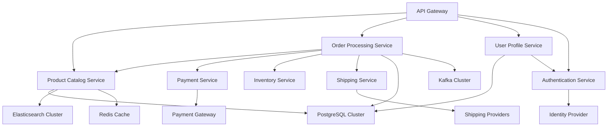

# Backend Service Catalog & Manifest
> **Purpose:** Comprehensive backend service catalog following 2025 best practices for microservices documentation, API governance, and developer portal integration. This manifest serves as the single source of truth for all backend services, their dependencies, and operational characteristics.

**Document Type:** Service Catalog & Architecture Inventory  
**Version:** 2.0 - Enhanced with 2025 Best Practices  
**Last Updated:** 2025-01-15  
**Template Status:** Production Ready

---

## Document Control
| Field | Value |
|-------|-------|
| **Project Name** | [PROJECT_NAME] |
| **System Architect** | [SYSTEM_ARCHITECT_NAME] |
| **Service Owner** | [SERVICE_OWNER_NAME] |
| **Last Updated** | [YYYY-MM-DD] |
| **Next Review** | [YYYY-MM-DD] |
| **Total Services** | [SERVICE_COUNT] |

---

## 📋 Table of Contents
- [🎯 Service Catalog Overview](#-service-catalog-overview)
- [🏗️ Architecture Domains](#️-architecture-domains)
- [🔧 Core Services](#-core-services)
- [🌐 API Gateway & External Interfaces](#-api-gateway--external-interfaces)
- [💾 Data Services](#-data-services)
- [🔐 Security & Authentication Services](#-security--authentication-services)
- [📊 Observability & Monitoring](#-observability--monitoring)
- [🚀 Infrastructure Services](#-infrastructure-services)
- [📈 Service Dependencies](#-service-dependencies)
- [🔄 Service Lifecycle Management](#-service-lifecycle-management)
- [📚 Developer Resources](#-developer-resources)
- [🎯 Service Standards & Governance](#-service-standards--governance)

---

## 🎯 Service Catalog Overview

### Service Catalog Philosophy

Our backend service catalog follows modern microservices architecture principles and serves as the central registry for all backend components. This catalog enables:

#### 🔍 **Service Discovery & Visibility**
- **Unified service registry** with comprehensive metadata
- **Real-time service health** and status monitoring
- **Dependency mapping** and impact analysis
- **API documentation** and contract management

#### 🚀 **Developer Self-Service**
- **Service scaffolding** with standardized templates
- **Automated deployment** pipelines and environments
- **Configuration management** and secret handling
- **Testing and validation** frameworks

#### 📊 **Operational Excellence**
- **Service ownership** and responsibility tracking
- **SLA monitoring** and performance metrics
- **Incident management** and escalation procedures
- **Capacity planning** and resource optimization

### Service Classification

Our services are organized into logical domains and tiers:

#### **Service Tiers**
- **Tier 1 (Critical):** Core business services with 99.9% SLA
- **Tier 2 (Important):** Supporting services with 99.5% SLA  
- **Tier 3 (Standard):** Utility services with 99% SLA
- **Tier 4 (Development):** Development and testing services

#### **Service Types**
- **Business Services:** Core business logic and domain services
- **Platform Services:** Shared infrastructure and utility services
- **Integration Services:** External system integrations and adapters
- **Data Services:** Data processing, storage, and analytics services

---

## 🏗️ Architecture Domains

### Domain-Driven Service Organization

Our backend services are organized around business domains following Domain-Driven Design (DDD) principles:

#### **Core Business Domains**

##### 🛒 **E-Commerce Domain**
```yaml
domain: ecommerce
services:
  - product-catalog-service
  - inventory-management-service
  - order-processing-service
  - payment-service
  - shipping-service
bounded_context: "Product sales and order fulfillment"
team_owner: "E-Commerce Team"
```

##### 👤 **User Management Domain**
```yaml
domain: user-management
services:
  - user-profile-service
  - authentication-service
  - authorization-service
  - notification-service
bounded_context: "User identity and access management"
team_owner: "Identity Team"
```

##### 📊 **Analytics Domain**
```yaml
domain: analytics
services:
  - data-ingestion-service
  - analytics-processing-service
  - reporting-service
  - recommendation-service
bounded_context: "Data analytics and business intelligence"
team_owner: "Data Team"
```

#### **Supporting Domains**

##### 🔧 **Platform Domain**
```yaml
domain: platform
services:
  - api-gateway
  - service-mesh
  - configuration-service
  - feature-flag-service
bounded_context: "Platform infrastructure and shared services"
team_owner: "Platform Team"
```

##### 🛡️ **Security Domain**
```yaml
domain: security
services:
  - security-scanner-service
  - audit-service
  - compliance-service
  - threat-detection-service
bounded_context: "Security, compliance, and risk management"
team_owner: "Security Team"
```

---

## 🔧 Core Services

### Business Logic Services

#### **Product Catalog Service**
```yaml
service_name: product-catalog-service
service_id: pcs-001
tier: 1
domain: ecommerce
description: "Manages product information, categories, and catalog operations"

technical_details:
  runtime: Node.js 20 LTS
  framework: NestJS 10.x
  database: PostgreSQL 15
  cache: Redis 7.x
  message_queue: Apache Kafka

api_details:
  type: REST API
  version: v2.1.0
  base_url: "/api/v2/products"
  documentation: "https://docs.company.com/api/products"
  openapi_spec: "/api/v2/products/openapi.json"

ownership:
  team: "E-Commerce Team"
  primary_contact: "[PRODUCT_TEAM_LEAD]"
  on_call: "[ONCALL_ROTATION_LINK]"
  slack_channel: "#ecommerce-team"

operational:
  deployment_strategy: "Blue-Green"
  scaling: "Horizontal (2-20 instances)"
  sla_target: "99.9% uptime"
  response_time_p95: "<200ms"
  
monitoring:
  health_check: "/health"
  metrics_endpoint: "/metrics"
  logs: "ELK Stack"
  tracing: "Jaeger"
  alerts: "PagerDuty"

dependencies:
  internal:
    - inventory-management-service
    - user-profile-service
  external:
    - elasticsearch-cluster
    - cdn-service
    
security:
  authentication: "JWT Bearer Token"
  authorization: "RBAC"
  data_classification: "Internal"
  compliance: ["GDPR", "SOC2"]

repository:
  url: "https://github.com/company/product-catalog-service"
  main_branch: "main"
  ci_cd: "GitHub Actions"
  deployment_config: "k8s/manifests/"
```

#### **Order Processing Service**
```yaml
service_name: order-processing-service
service_id: ops-001
tier: 1
domain: ecommerce
description: "Handles order lifecycle from creation to fulfillment"

technical_details:
  runtime: Java 21 LTS
  framework: Spring Boot 3.2
  database: PostgreSQL 15
  cache: Redis 7.x
  message_queue: Apache Kafka

api_details:
  type: REST API + GraphQL
  version: v1.5.0
  base_url: "/api/v1/orders"
  graphql_endpoint: "/graphql"
  documentation: "https://docs.company.com/api/orders"

ownership:
  team: "Order Management Team"
  primary_contact: "[ORDER_TEAM_LEAD]"
  on_call: "[ONCALL_ROTATION_LINK]"
  slack_channel: "#order-management"

operational:
  deployment_strategy: "Canary"
  scaling: "Horizontal (3-30 instances)"
  sla_target: "99.95% uptime"
  response_time_p95: "<150ms"

dependencies:
  internal:
    - product-catalog-service
    - payment-service
    - inventory-management-service
    - shipping-service
  external:
    - payment-gateway
    - shipping-providers

security:
  authentication: "OAuth 2.0"
  authorization: "ABAC"
  data_classification: "Confidential"
  compliance: ["PCI-DSS", "GDPR", "SOC2"]
```

#### **User Profile Service**
```yaml
service_name: user-profile-service
service_id: ups-001
tier: 1
domain: user-management
description: "Manages user profiles, preferences, and account information"

technical_details:
  runtime: Python 3.12
  framework: FastAPI 0.104
  database: PostgreSQL 15
  cache: Redis 7.x
  search: Elasticsearch 8.x

api_details:
  type: REST API
  version: v3.0.0
  base_url: "/api/v3/users"
  documentation: "https://docs.company.com/api/users"

ownership:
  team: "Identity Team"
  primary_contact: "[IDENTITY_TEAM_LEAD]"
  on_call: "[ONCALL_ROTATION_LINK]"
  slack_channel: "#identity-team"

operational:
  deployment_strategy: "Rolling Update"
  scaling: "Horizontal (2-15 instances)"
  sla_target: "99.9% uptime"
  response_time_p95: "<100ms"

dependencies:
  internal:
    - authentication-service
    - notification-service
  external:
    - identity-provider
    - email-service

security:
  authentication: "JWT + Refresh Token"
  authorization: "RBAC"
  data_classification: "Personal Data"
  compliance: ["GDPR", "CCPA", "SOC2"]
```

---

## 🌐 API Gateway & External Interfaces

### API Gateway Configuration

#### **Primary API Gateway**
```yaml
service_name: api-gateway
service_id: apigw-001
tier: 1
domain: platform
description: "Central API gateway for all external and internal API traffic"

technical_details:
  runtime: Go 1.21
  framework: Kong Gateway
  load_balancer: NGINX
  service_mesh: Istio

features:
  - Rate limiting and throttling
  - Authentication and authorization
  - Request/response transformation
  - API versioning and routing
  - Circuit breaker patterns
  - Request/response caching
  - API analytics and monitoring

routing_rules:
  "/api/v1/products/*": "product-catalog-service"
  "/api/v1/orders/*": "order-processing-service"
  "/api/v1/users/*": "user-profile-service"
  "/api/v1/auth/*": "authentication-service"
  "/api/v1/payments/*": "payment-service"

security_policies:
  - JWT validation
  - Rate limiting (1000 req/min per user)
  - IP whitelisting for admin endpoints
  - CORS policy enforcement
  - Request size limits (10MB max)

monitoring:
  metrics: "Prometheus + Grafana"
  logging: "ELK Stack"
  tracing: "Jaeger"
  uptime_target: "99.99%"
```

### External API Integrations

#### **Payment Gateway Integration**
```yaml
integration_name: payment-gateway-adapter
service_id: pga-001
type: external_integration
description: "Adapter service for payment processing providers"

providers:
  primary: "Stripe"
  secondary: "PayPal"
  fallback: "Square"

features:
  - Multi-provider support
  - Automatic failover
  - Transaction reconciliation
  - Fraud detection integration
  - PCI-DSS compliance

security:
  encryption: "AES-256"
  key_management: "AWS KMS"
  audit_logging: "Enabled"
  compliance: ["PCI-DSS Level 1"]
```

#### **Shipping Provider Integration**
```yaml
integration_name: shipping-provider-adapter
service_id: spa-001
type: external_integration
description: "Integration with shipping and logistics providers"

providers:
  - "FedEx API"
  - "UPS API"
  - "DHL API"
  - "USPS API"

features:
  - Real-time shipping rates
  - Package tracking
  - Label generation
  - Delivery confirmation
  - Address validation

monitoring:
  sla_tracking: "Per provider"
  error_handling: "Retry with exponential backoff"
  circuit_breaker: "Enabled"
```

---

## 💾 Data Services

### Database Services

#### **Primary Database Cluster**
```yaml
service_name: postgresql-primary-cluster
service_id: pgc-001
type: database
description: "Primary PostgreSQL cluster for transactional data"

configuration:
  version: "PostgreSQL 15.4"
  cluster_type: "Master-Slave with Read Replicas"
  instances: 3
  storage: "SSD, 2TB per instance"
  backup_strategy: "Continuous WAL archiving + Daily snapshots"

databases:
  - name: "ecommerce_db"
    owner: "E-Commerce Team"
    size: "500GB"
    tables: 45
    
  - name: "user_management_db"
    owner: "Identity Team"
    size: "200GB"
    tables: 25
    
  - name: "analytics_db"
    owner: "Data Team"
    size: "1TB"
    tables: 60

performance:
  connection_pooling: "PgBouncer"
  query_optimization: "Automated index suggestions"
  monitoring: "pg_stat_statements + Custom metrics"

security:
  encryption_at_rest: "AES-256"
  encryption_in_transit: "TLS 1.3"
  access_control: "Role-based with row-level security"
  audit_logging: "Full query logging"
```

#### **Cache Layer**
```yaml
service_name: redis-cache-cluster
service_id: rcc-001
type: cache
description: "Distributed Redis cache for application performance"

configuration:
  version: "Redis 7.2"
  cluster_mode: "Enabled"
  nodes: 6
  memory_per_node: "16GB"
  persistence: "RDB + AOF"

usage_patterns:
  - Session storage
  - API response caching
  - Database query result caching
  - Rate limiting counters
  - Real-time analytics

performance:
  hit_ratio_target: ">95%"
  latency_p99: "<1ms"
  throughput: "100K ops/sec"
```

#### **Search Engine**
```yaml
service_name: elasticsearch-cluster
service_id: esc-001
type: search_engine
description: "Elasticsearch cluster for full-text search and analytics"

configuration:
  version: "Elasticsearch 8.11"
  nodes: 5
  storage_per_node: "1TB SSD"
  indices: 25
  total_documents: "50M+"

use_cases:
  - Product catalog search
  - User behavior analytics
  - Log aggregation and analysis
  - Real-time monitoring data

performance:
  search_latency_p95: "<50ms"
  indexing_rate: "10K docs/sec"
  query_throughput: "1K queries/sec"
```

### Message Queue Services

#### **Apache Kafka Cluster**
```yaml
service_name: kafka-message-cluster
service_id: kmc-001
type: message_queue
description: "Apache Kafka cluster for event streaming and messaging"

configuration:
  version: "Apache Kafka 3.6"
  brokers: 5
  replication_factor: 3
  partitions_per_topic: 12
  retention_policy: "7 days default"

topics:
  - name: "order.events"
    partitions: 24
    retention: "30 days"
    consumers: ["order-processing", "analytics", "notification"]
    
  - name: "user.events"
    partitions: 12
    retention: "90 days"
    consumers: ["user-profile", "analytics", "recommendation"]
    
  - name: "product.events"
    partitions: 18
    retention: "14 days"
    consumers: ["catalog", "search", "analytics"]

monitoring:
  lag_monitoring: "Kafka Manager"
  throughput_tracking: "Prometheus metrics"
  consumer_group_monitoring: "Enabled"
```

---

## 🔐 Security & Authentication Services

### Identity and Access Management

#### **Authentication Service**
```yaml
service_name: authentication-service
service_id: auth-001
tier: 1
domain: security
description: "Central authentication service with OAuth 2.0 and JWT support"

technical_details:
  runtime: Java 21 LTS
  framework: Spring Security 6.x
  database: PostgreSQL 15
  cache: Redis 7.x

authentication_methods:
  - Username/Password
  - OAuth 2.0 (Google, GitHub, Microsoft)
  - SAML 2.0 (Enterprise SSO)
  - Multi-Factor Authentication (TOTP, SMS)
  - Biometric authentication (WebAuthn)

token_management:
  access_token_ttl: "15 minutes"
  refresh_token_ttl: "30 days"
  token_rotation: "Enabled"
  revocation_support: "Real-time"

security_features:
  - Account lockout protection
  - Suspicious activity detection
  - Password policy enforcement
  - Session management
  - Audit logging

compliance:
  standards: ["OAuth 2.1", "OpenID Connect", "SAML 2.0"]
  certifications: ["SOC2", "ISO 27001"]
```

#### **Authorization Service**
```yaml
service_name: authorization-service
service_id: authz-001
tier: 1
domain: security
description: "Fine-grained authorization service with RBAC and ABAC support"

technical_details:
  runtime: Go 1.21
  framework: Open Policy Agent (OPA)
  database: PostgreSQL 15
  policy_engine: "Rego"

authorization_models:
  - Role-Based Access Control (RBAC)
  - Attribute-Based Access Control (ABAC)
  - Resource-Based Permissions
  - Dynamic Policy Evaluation

features:
  - Real-time policy evaluation
  - Policy versioning and rollback
  - Audit trail for all decisions
  - Performance caching
  - Policy testing framework

performance:
  decision_latency_p95: "<10ms"
  throughput: "50K decisions/sec"
  cache_hit_ratio: ">98%"
```

### Security Scanning Services

#### **Security Scanner Service**
```yaml
service_name: security-scanner-service
service_id: sss-001
tier: 2
domain: security
description: "Automated security scanning for vulnerabilities and compliance"

scanning_types:
  - Static Application Security Testing (SAST)
  - Dynamic Application Security Testing (DAST)
  - Software Composition Analysis (SCA)
  - Infrastructure as Code (IaC) scanning
  - Container image scanning

tools_integration:
  sast: "SonarQube, Checkmarx"
  dast: "OWASP ZAP, Burp Suite"
  sca: "Snyk, WhiteSource"
  iac: "Checkov, Terrascan"
  containers: "Trivy, Clair"

automation:
  ci_cd_integration: "GitHub Actions, Jenkins"
  scheduled_scans: "Daily, Weekly, Monthly"
  policy_enforcement: "Quality gates"
  reporting: "Automated dashboards"
```

---

## 📊 Observability & Monitoring

### Monitoring Stack

#### **Metrics Collection Service**
```yaml
service_name: prometheus-monitoring
service_id: pms-001
type: monitoring
description: "Prometheus-based metrics collection and alerting"

configuration:
  version: "Prometheus 2.47"
  retention: "30 days"
  scrape_interval: "15s"
  storage: "1TB SSD"

metrics_sources:
  - Application metrics (custom + standard)
  - Infrastructure metrics (node_exporter)
  - Database metrics (postgres_exporter)
  - Cache metrics (redis_exporter)
  - Message queue metrics (kafka_exporter)

alerting_rules:
  - High error rate (>1% for 5 minutes)
  - High latency (p95 >500ms for 10 minutes)
  - Low availability (<99% for 15 minutes)
  - Resource exhaustion (>80% for 30 minutes)

integration:
  visualization: "Grafana"
  alerting: "AlertManager + PagerDuty"
  notification: "Slack, Email, SMS"
```

#### **Distributed Tracing Service**
```yaml
service_name: jaeger-tracing
service_id: jts-001
type: tracing
description: "Distributed tracing for microservices observability"

configuration:
  version: "Jaeger 1.50"
  storage: "Elasticsearch"
  retention: "7 days"
  sampling_rate: "1% (adaptive)"

features:
  - End-to-end request tracing
  - Service dependency mapping
  - Performance bottleneck identification
  - Error correlation across services
  - Custom span annotations

integration:
  instrumentation: "OpenTelemetry"
  languages: "Java, Go, Node.js, Python"
  frameworks: "Auto-instrumentation enabled"
```

#### **Log Aggregation Service**
```yaml
service_name: elk-logging-stack
service_id: els-001
type: logging
description: "Centralized logging with ELK stack"

components:
  elasticsearch: "8.11 (3 nodes, 2TB each)"
  logstash: "8.11 (2 instances)"
  kibana: "8.11 (2 instances)"
  filebeat: "Deployed on all nodes"

log_sources:
  - Application logs (structured JSON)
  - Infrastructure logs (system, network)
  - Security logs (audit, access)
  - Database logs (query, error)

features:
  - Real-time log streaming
  - Advanced search and filtering
  - Custom dashboards and visualizations
  - Alerting on log patterns
  - Log retention policies (90 days)
```

---

## 🚀 Infrastructure Services

### Container Orchestration

#### **Kubernetes Cluster**
```yaml
service_name: kubernetes-production-cluster
service_id: k8s-prod-001
type: orchestration
description: "Production Kubernetes cluster for container orchestration"

configuration:
  version: "Kubernetes 1.28"
  nodes: 15
  node_types:
    - "3x Control Plane (m5.xlarge)"
    - "12x Worker Nodes (m5.2xlarge)"
  networking: "Calico CNI"
  storage: "AWS EBS CSI Driver"

features:
  - Auto-scaling (HPA + VPA)
  - Rolling updates and rollbacks
  - Service mesh (Istio)
  - Ingress controller (NGINX)
  - Certificate management (cert-manager)

security:
  rbac: "Enabled with fine-grained permissions"
  network_policies: "Enforced"
  pod_security_standards: "Restricted"
  image_scanning: "Admission controller"
```

#### **Service Mesh**
```yaml
service_name: istio-service-mesh
service_id: ism-001
type: service_mesh
description: "Istio service mesh for microservices communication"

configuration:
  version: "Istio 1.19"
  components:
    - Istiod (control plane)
    - Envoy proxies (data plane)
    - Istio Gateway (ingress)

features:
  - Traffic management and routing
  - Security policies and mTLS
  - Observability and telemetry
  - Circuit breaker and retry policies
  - Canary deployments

policies:
  mtls_mode: "STRICT"
  authorization_policies: "Enabled"
  traffic_encryption: "End-to-end"
```

### CI/CD Services

#### **Continuous Integration Service**
```yaml
service_name: github-actions-runners
service_id: gar-001
type: ci_cd
description: "Self-hosted GitHub Actions runners for CI/CD pipelines"

configuration:
  runner_type: "Self-hosted on Kubernetes"
  instances: 20
  auto_scaling: "Enabled (5-50 runners)"
  runner_image: "Custom with security tools"

capabilities:
  - Multi-language support (Java, Go, Node.js, Python)
  - Security scanning integration
  - Container image building
  - Kubernetes deployment
  - Test execution and reporting

security:
  - Isolated runner environments
  - Secret management integration
  - Vulnerability scanning
  - Compliance checks
```

---

## 📈 Service Dependencies

### Dependency Mapping

#### **Service Dependency Graph**


#### **Critical Path Analysis**
```yaml
critical_services:
  tier_1:
    - api-gateway
    - authentication-service
    - postgresql-primary-cluster
    - redis-cache-cluster
  
  tier_2:
    - product-catalog-service
    - order-processing-service
    - user-profile-service
    - kafka-message-cluster

failure_impact:
  api_gateway_down:
    impact: "Complete service outage"
    mitigation: "Multi-region deployment + health checks"
    
  database_cluster_down:
    impact: "Data services unavailable"
    mitigation: "Read replicas + automated failover"
    
  kafka_cluster_down:
    impact: "Async processing delayed"
    mitigation: "Message persistence + replay capability"
```

### External Dependencies

#### **Third-Party Services**
```yaml
external_dependencies:
  payment_providers:
    - name: "Stripe"
      sla: "99.9%"
      fallback: "PayPal"
      monitoring: "Real-time health checks"
      
  shipping_providers:
    - name: "FedEx API"
      sla: "99.5%"
      fallback: "UPS API"
      rate_limits: "1000 req/min"
      
  identity_providers:
    - name: "Auth0"
      sla: "99.95%"
      fallback: "Internal auth service"
      
  cloud_services:
    - name: "AWS Services"
      services: ["RDS", "ElastiCache", "EKS", "S3"]
      sla: "99.99%"
      monitoring: "CloudWatch + Custom metrics"
```

---

## 🔄 Service Lifecycle Management

### Service Development Lifecycle

#### **Service Creation Process**
```yaml
service_scaffolding:
  template_repository: "https://github.com/company/service-templates"
  
  templates:
    - name: "microservice-java-spring"
      description: "Spring Boot microservice template"
      includes: ["Dockerfile", "k8s manifests", "CI/CD pipeline"]
      
    - name: "microservice-nodejs-nestjs"
      description: "NestJS microservice template"
      includes: ["TypeScript setup", "Testing framework", "API docs"]
      
    - name: "microservice-python-fastapi"
      description: "FastAPI microservice template"
      includes: ["Poetry setup", "Async support", "OpenAPI integration"]

automated_setup:
  - Repository creation with branch protection
  - CI/CD pipeline configuration
  - Kubernetes namespace and RBAC setup
  - Monitoring and alerting configuration
  - Service mesh integration
  - Documentation site generation
```

#### **Deployment Pipeline**
```yaml
deployment_stages:
  development:
    trigger: "Feature branch push"
    environment: "dev"
    tests: ["unit", "integration"]
    deployment: "Automatic"
    
  staging:
    trigger: "Main branch merge"
    environment: "staging"
    tests: ["e2e", "performance", "security"]
    deployment: "Automatic"
    
  production:
    trigger: "Release tag"
    environment: "prod"
    tests: ["smoke", "health checks"]
    deployment: "Blue-green with approval"
    rollback: "Automatic on failure"

quality_gates:
  - Code coverage >80%
  - Security scan passed
  - Performance regression <5%
  - All tests passed
  - Documentation updated
```

### Service Retirement Process

#### **Deprecation Workflow**
```yaml
deprecation_process:
  announcement:
    timeline: "6 months before retirement"
    channels: ["API docs", "Email", "Slack", "Dashboard"]
    
  migration_support:
    documentation: "Migration guides and examples"
    tooling: "Automated migration scripts"
    support: "Dedicated migration team"
    
  sunset_phases:
    phase_1: "Deprecation notice (6 months)"
    phase_2: "New feature freeze (3 months)"
    phase_3: "Read-only mode (1 month)"
    phase_4: "Service shutdown"

data_handling:
  backup: "Complete data export"
  retention: "As per data retention policy"
  deletion: "Secure data destruction"
```

---

## 📚 Developer Resources

### Service Documentation

#### **API Documentation Standards**
```yaml
documentation_requirements:
  openapi_spec:
    version: "3.1.0"
    format: "YAML"
    location: "/docs/openapi.yaml"
    
  interactive_docs:
    swagger_ui: "Available at /docs"
    redoc: "Available at /redoc"
    postman_collection: "Auto-generated"
    
  code_examples:
    languages: ["curl", "JavaScript", "Python", "Java"]
    authentication: "Include auth examples"
    error_handling: "Document error responses"

documentation_automation:
  generation: "From code annotations"
  validation: "CI/CD pipeline checks"
  publishing: "Automatic on deployment"
  versioning: "Semantic versioning aligned"
```

#### **Service Runbooks**
```yaml
runbook_template:
  service_overview:
    - Purpose and business value
    - Architecture and dependencies
    - Key metrics and SLAs
    
  operational_procedures:
    - Deployment and rollback
    - Scaling and capacity management
    - Configuration management
    
  troubleshooting:
    - Common issues and solutions
    - Debugging procedures
    - Escalation contacts
    
  monitoring_and_alerting:
    - Key metrics to monitor
    - Alert thresholds and responses
    - Dashboard links
```

### Developer Tools

#### **Service Development Kit (SDK)**
```yaml
sdk_components:
  service_templates:
    - Microservice scaffolding
    - Database migration tools
    - Testing frameworks
    - Documentation generators
    
  shared_libraries:
    - Authentication client
    - Logging and metrics
    - Configuration management
    - Circuit breaker patterns
    
  development_tools:
    - Local development environment
    - Service mocking tools
    - API testing utilities
    - Performance profiling
```

#### **Developer Portal Integration**
```yaml
portal_features:
  service_catalog:
    - Service discovery and browsing
    - API documentation and testing
    - Dependency visualization
    - Health status monitoring
    
  self_service_actions:
    - Create new service
    - Deploy to environments
    - Manage configurations
    - View logs and metrics
    
  team_collaboration:
    - Service ownership tracking
    - On-call rotation management
    - Incident response coordination
    - Knowledge sharing
```

---

## 🎯 Service Standards & Governance

### Technical Standards

#### **API Design Standards**
```yaml
api_standards:
  rest_api:
    - RESTful resource naming
    - HTTP status code usage
    - Pagination and filtering
    - Versioning strategy (URL path)
    
  graphql_api:
    - Schema design principles
    - Query complexity limits
    - Caching strategies
    - Error handling patterns
    
  grpc_api:
    - Protocol buffer definitions
    - Service method naming
    - Error code standards
    - Streaming guidelines

data_formats:
  request_response: "JSON (RFC 7159)"
  datetime: "ISO 8601 (UTC)"
  pagination: "Cursor-based"
  error_format: "RFC 7807 Problem Details"
```

#### **Security Standards**
```yaml
security_requirements:
  authentication:
    - JWT tokens with RS256 signing
    - Token expiration (15 min access, 30 day refresh)
    - Multi-factor authentication support
    
  authorization:
    - Fine-grained permissions
    - Principle of least privilege
    - Regular access reviews
    
  data_protection:
    - Encryption at rest (AES-256)
    - Encryption in transit (TLS 1.3)
    - PII data classification
    - GDPR compliance measures

vulnerability_management:
  - Regular security scanning
  - Dependency vulnerability checks
  - Penetration testing (quarterly)
  - Security incident response plan
```

### Operational Standards

#### **Monitoring and Observability**
```yaml
observability_requirements:
  metrics:
    - Business metrics (conversion, revenue)
    - Technical metrics (latency, throughput, errors)
    - Infrastructure metrics (CPU, memory, disk)
    - Custom application metrics
    
  logging:
    - Structured logging (JSON format)
    - Correlation IDs for request tracing
    - Log levels and appropriate usage
    - Sensitive data redaction
    
  tracing:
    - Distributed tracing implementation
    - Span naming conventions
    - Custom span attributes
    - Sampling strategies

alerting_standards:
  - SLO-based alerting
  - Escalation procedures
  - Alert fatigue prevention
  - Runbook automation
```

#### **Performance Standards**
```yaml
performance_requirements:
  response_times:
    - API endpoints: p95 < 200ms
    - Database queries: p95 < 50ms
    - Cache operations: p95 < 5ms
    
  throughput:
    - Minimum: 1000 req/sec per service
    - Peak capacity: 10x minimum
    - Auto-scaling thresholds
    
  availability:
    - Tier 1 services: 99.9% uptime
    - Tier 2 services: 99.5% uptime
    - Tier 3 services: 99% uptime

capacity_planning:
  - Resource utilization targets (70% max)
  - Growth projections (quarterly)
  - Load testing requirements
  - Disaster recovery procedures
```

### Compliance and Governance

#### **Service Governance Framework**
```yaml
governance_structure:
  architecture_review_board:
    - Service design approval
    - Technology stack decisions
    - Security architecture review
    - Performance requirements validation
    
  service_ownership:
    - Clear team ownership
    - On-call responsibilities
    - SLA commitments
    - Documentation maintenance
    
  change_management:
    - Breaking change procedures
    - Deprecation timelines
    - Migration support
    - Communication requirements

compliance_requirements:
  - SOC 2 Type II certification
  - GDPR compliance (EU users)
  - CCPA compliance (CA users)
  - PCI DSS (payment processing)
  - HIPAA (healthcare data)
```

---

## 🔧 Quick Reference

### Service Registry
- **Service Catalog UI:** [SERVICE_CATALOG_URL]
- **API Documentation:** [API_DOCS_URL]
- **Service Health Dashboard:** [HEALTH_DASHBOARD_URL]
- **Dependency Graph:** [DEPENDENCY_GRAPH_URL]

### Emergency Contacts
- **Platform Team:** [PLATFORM_TEAM_CONTACT]
- **Security Team:** [SECURITY_TEAM_CONTACT]
- **On-Call Engineer:** [ONCALL_CONTACT]
- **Incident Commander:** [INCIDENT_COMMANDER_CONTACT]

### Key Tools
- **Service Mesh:** Istio Control Plane
- **API Gateway:** Kong Gateway
- **Monitoring:** Prometheus + Grafana
- **Logging:** ELK Stack
- **Tracing:** Jaeger
- **CI/CD:** GitHub Actions

### Documentation Links
- **Architecture Diagrams:** [ARCHITECTURE_DOCS_URL]
- **API Specifications:** [API_SPECS_URL]
- **Runbooks:** [RUNBOOKS_URL]
- **Troubleshooting Guides:** [TROUBLESHOOTING_URL]

---

*This backend service catalog is a living document that evolves with our architecture and serves as the single source of truth for all backend services and their operational characteristics.*

---

**Last Updated:** [TIMESTAMP]  
**Next Review:** [NEXT_REVIEW_DATE]  
**Document Owner:** [SYSTEM_ARCHITECT]  
**Feedback:** [FEEDBACK_EMAIL]
