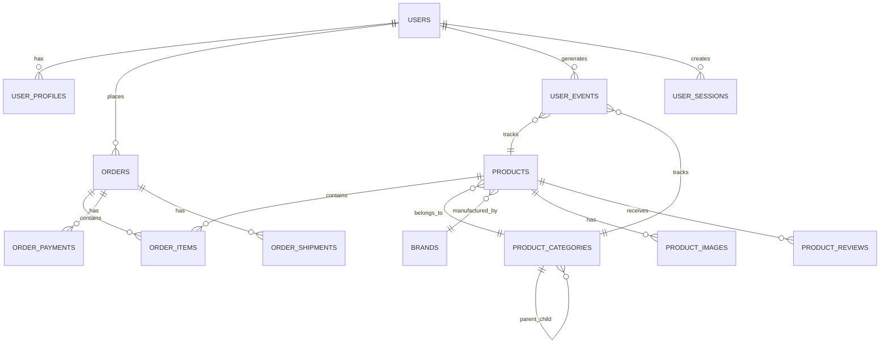
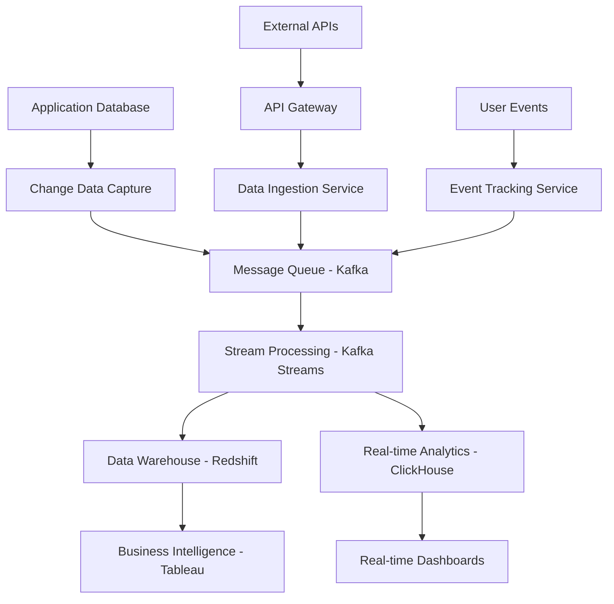

# Database Catalog & Data Manifest
> **Purpose:** Comprehensive database catalog following 2025 best practices for data governance, schema management, and regulatory compliance. This manifest serves as the authoritative source for all database entities, their relationships, and data governance policies.

**Document Type:** Data Catalog & Schema Registry  
**Version:** 2.0 - Enhanced with 2025 Best Practices  
**Last Updated:** 2025-01-15  
**Template Status:** Production Ready

---

## Document Control
| Field | Value |
|-------|-------|
| **Project Name** | [PROJECT_NAME] |
| **Data Architect** | [DATA_ARCHITECT_NAME] |
| **Database Administrator** | [DBA_NAME] |
| **Last Updated** | [YYYY-MM-DD] |
| **Next Review** | [YYYY-MM-DD] |
| **Total Entities** | [ENTITY_COUNT] |

---

## 📋 Table of Contents
- [🎯 Data Catalog Overview](#-data-catalog-overview)
- [🏗️ Database Architecture](#️-database-architecture)
- [📊 Core Data Entities](#-core-data-entities)
- [🔗 Entity Relationships](#-entity-relationships)
- [🔐 Data Security & Privacy](#-data-security--privacy)
- [📈 Data Lineage & Flow](#-data-lineage--flow)
- [🛡️ Compliance & Governance](#️-compliance--governance)
- [🔄 Schema Management](#-schema-management)
- [📊 Data Quality & Monitoring](#-data-quality--monitoring)
- [🚀 Performance Optimization](#-performance-optimization)
- [📚 Data Dictionary](#-data-dictionary)
- [🎯 Data Governance Policies](#-data-governance-policies)

---

## 🎯 Data Catalog Overview

### Data Catalog Philosophy

Our database catalog follows modern data governance principles and serves as the single source of truth for all data assets. This catalog enables:

#### 🔍 **Data Discovery & Understanding**
- **Comprehensive metadata** for all database entities and attributes
- **Business context** and semantic meaning of data elements
- **Data lineage tracking** from source to consumption
- **Impact analysis** for schema changes and dependencies

#### 🛡️ **Data Governance & Compliance**
- **Data classification** and sensitivity labeling
- **Privacy controls** and GDPR/CCPA compliance
- **Access controls** and audit trails
- **Data retention** and lifecycle management

#### 📊 **Data Quality & Reliability**
- **Data quality metrics** and monitoring
- **Schema validation** and constraint enforcement
- **Data profiling** and anomaly detection
- **Performance optimization** and indexing strategies

### Database Classification

Our databases are organized by purpose, sensitivity, and operational characteristics:

#### **Database Tiers**
- **Tier 1 (Critical):** Production transactional databases with 99.9% availability
- **Tier 2 (Important):** Analytics and reporting databases with 99.5% availability
- **Tier 3 (Standard):** Development and testing databases with 99% availability
- **Tier 4 (Archive):** Historical and backup databases with 95% availability

#### **Data Classification Levels**
- **Public:** Non-sensitive data available for general use
- **Internal:** Company-internal data with standard access controls
- **Confidential:** Sensitive business data with restricted access
- **Restricted:** Highly sensitive data with strict access controls and encryption

---

## 🏗️ Database Architecture

### Database Infrastructure Overview

Our database architecture follows modern cloud-native principles with high availability and scalability:

#### **Primary Database Cluster**
```yaml
cluster_name: production-postgresql-cluster
database_engine: PostgreSQL 15.4
cluster_type: Primary-Replica with Read Replicas
high_availability: Multi-AZ deployment with automatic failover
backup_strategy: Continuous WAL archiving + Point-in-time recovery
encryption: AES-256 encryption at rest and in transit

instances:
  primary:
    instance_type: db.r6g.2xlarge
    storage: 2TB GP3 SSD
    iops: 12000
    
  read_replicas:
    count: 3
    instance_type: db.r6g.xlarge
    storage: 2TB GP3 SSD
    regions: [us-east-1a, us-east-1b, us-east-1c]

connection_pooling:
  tool: PgBouncer
  max_connections: 1000
  pool_mode: transaction
```

#### **Analytics Database**
```yaml
cluster_name: analytics-data-warehouse
database_engine: Amazon Redshift
cluster_type: Multi-node cluster
node_type: ra3.4xlarge
node_count: 6
storage: Managed storage with automatic scaling

features:
  - Columnar storage optimization
  - Automatic workload management
  - Result caching
  - Spectrum for S3 data lake queries
  - Concurrency scaling

security:
  encryption_at_rest: AES-256
  encryption_in_transit: SSL/TLS
  vpc_security: Private subnets with security groups
  audit_logging: Comprehensive query and connection logging
```

#### **Cache Layer**
```yaml
cache_cluster: redis-production-cluster
engine: Redis 7.2
cluster_mode: Enabled with sharding
nodes: 6 (3 shards, 2 replicas each)
instance_type: cache.r7g.xlarge
memory_per_node: 26.32 GB
total_memory: 157.92 GB

features:
  - Automatic failover
  - Multi-AZ deployment
  - Backup and restore
  - In-transit and at-rest encryption
  - CloudWatch monitoring
```

---

## 📊 Core Data Entities

### Business Domain Entities

#### **User Management Domain**

##### **Users Table**
```sql
-- Primary user entity storing core user information
CREATE TABLE users (
    user_id UUID PRIMARY KEY DEFAULT gen_random_uuid(),
    email VARCHAR(255) UNIQUE NOT NULL,
    username VARCHAR(50) UNIQUE NOT NULL,
    password_hash VARCHAR(255) NOT NULL,
    first_name VARCHAR(100) NOT NULL,
    last_name VARCHAR(100) NOT NULL,
    date_of_birth DATE,
    phone_number VARCHAR(20),
    profile_image_url TEXT,
    email_verified BOOLEAN DEFAULT FALSE,
    phone_verified BOOLEAN DEFAULT FALSE,
    account_status user_status_enum DEFAULT 'active',
    created_at TIMESTAMP WITH TIME ZONE DEFAULT CURRENT_TIMESTAMP,
    updated_at TIMESTAMP WITH TIME ZONE DEFAULT CURRENT_TIMESTAMP,
    last_login_at TIMESTAMP WITH TIME ZONE,
    
    -- Audit fields
    created_by UUID REFERENCES users(user_id),
    updated_by UUID REFERENCES users(user_id),
    
    -- Soft delete
    deleted_at TIMESTAMP WITH TIME ZONE,
    
    -- Constraints
    CONSTRAINT users_email_format CHECK (email ~* '^[A-Za-z0-9._%+-]+@[A-Za-z0-9.-]+\.[A-Za-z]{2,}$'),
    CONSTRAINT users_username_format CHECK (username ~* '^[a-zA-Z0-9_]{3,50}$'),
    CONSTRAINT users_age_check CHECK (date_of_birth IS NULL OR date_of_birth <= CURRENT_DATE - INTERVAL '13 years')
);

-- Indexes for performance
CREATE INDEX idx_users_email ON users(email) WHERE deleted_at IS NULL;
CREATE INDEX idx_users_username ON users(username) WHERE deleted_at IS NULL;
CREATE INDEX idx_users_status ON users(account_status) WHERE deleted_at IS NULL;
CREATE INDEX idx_users_created_at ON users(created_at);
CREATE INDEX idx_users_last_login ON users(last_login_at);
```

**Entity Metadata:**
```yaml
entity_name: users
domain: user_management
tier: 1
data_classification: confidential
pii_data: true
gdpr_applicable: true
retention_period: 7_years_after_account_closure

business_purpose: "Core user identity and profile management"
data_owner: "Identity Team"
technical_owner: "Platform Engineering"
steward: "[DATA_STEWARD_NAME]"

compliance_requirements:
  - GDPR (EU users)
  - CCPA (California users)
  - SOC2 Type II
  - ISO 27001

data_quality_rules:
  - email_uniqueness: "Email addresses must be unique across active users"
  - email_format: "Valid email format required"
  - username_uniqueness: "Usernames must be unique across active users"
  - age_verification: "Users must be at least 13 years old"

monitoring:
  row_count_alert: "> 10% change in 24h"
  data_quality_score: "> 95%"
  query_performance: "< 100ms for primary key lookups"
```

##### **User Profiles Table**
```sql
-- Extended user profile information
CREATE TABLE user_profiles (
    profile_id UUID PRIMARY KEY DEFAULT gen_random_uuid(),
    user_id UUID NOT NULL REFERENCES users(user_id) ON DELETE CASCADE,
    bio TEXT,
    website_url TEXT,
    location VARCHAR(255),
    timezone VARCHAR(50),
    language_preference VARCHAR(10) DEFAULT 'en',
    currency_preference VARCHAR(3) DEFAULT 'USD',
    notification_preferences JSONB DEFAULT '{}',
    privacy_settings JSONB DEFAULT '{}',
    marketing_consent BOOLEAN DEFAULT FALSE,
    analytics_consent BOOLEAN DEFAULT FALSE,
    created_at TIMESTAMP WITH TIME ZONE DEFAULT CURRENT_TIMESTAMP,
    updated_at TIMESTAMP WITH TIME ZONE DEFAULT CURRENT_TIMESTAMP,
    
    -- Constraints
    CONSTRAINT user_profiles_user_unique UNIQUE(user_id),
    CONSTRAINT user_profiles_website_format CHECK (website_url IS NULL OR website_url ~* '^https?://'),
    CONSTRAINT user_profiles_language_format CHECK (language_preference ~* '^[a-z]{2}(-[A-Z]{2})?$'),
    CONSTRAINT user_profiles_currency_format CHECK (currency_preference ~* '^[A-Z]{3}$')
);

-- Indexes
CREATE INDEX idx_user_profiles_user_id ON user_profiles(user_id);
CREATE INDEX idx_user_profiles_location ON user_profiles(location) WHERE location IS NOT NULL;
CREATE INDEX idx_user_profiles_language ON user_profiles(language_preference);
```

#### **E-Commerce Domain**

##### **Products Table**
```sql
-- Product catalog entity
CREATE TABLE products (
    product_id UUID PRIMARY KEY DEFAULT gen_random_uuid(),
    sku VARCHAR(100) UNIQUE NOT NULL,
    name VARCHAR(255) NOT NULL,
    description TEXT,
    short_description VARCHAR(500),
    category_id UUID REFERENCES product_categories(category_id),
    brand_id UUID REFERENCES brands(brand_id),
    price DECIMAL(10,2) NOT NULL,
    cost DECIMAL(10,2),
    weight DECIMAL(8,3),
    dimensions JSONB, -- {length, width, height, unit}
    status product_status_enum DEFAULT 'draft',
    visibility product_visibility_enum DEFAULT 'private',
    featured BOOLEAN DEFAULT FALSE,
    digital BOOLEAN DEFAULT FALSE,
    downloadable BOOLEAN DEFAULT FALSE,
    inventory_tracked BOOLEAN DEFAULT TRUE,
    stock_quantity INTEGER DEFAULT 0,
    low_stock_threshold INTEGER DEFAULT 10,
    meta_title VARCHAR(255),
    meta_description VARCHAR(500),
    search_keywords TEXT[],
    tags TEXT[],
    created_at TIMESTAMP WITH TIME ZONE DEFAULT CURRENT_TIMESTAMP,
    updated_at TIMESTAMP WITH TIME ZONE DEFAULT CURRENT_TIMESTAMP,
    published_at TIMESTAMP WITH TIME ZONE,
    
    -- Audit fields
    created_by UUID REFERENCES users(user_id),
    updated_by UUID REFERENCES users(user_id),
    
    -- Soft delete
    deleted_at TIMESTAMP WITH TIME ZONE,
    
    -- Constraints
    CONSTRAINT products_price_positive CHECK (price >= 0),
    CONSTRAINT products_cost_positive CHECK (cost IS NULL OR cost >= 0),
    CONSTRAINT products_weight_positive CHECK (weight IS NULL OR weight >= 0),
    CONSTRAINT products_stock_non_negative CHECK (stock_quantity >= 0),
    CONSTRAINT products_threshold_positive CHECK (low_stock_threshold >= 0)
);

-- Indexes for performance and search
CREATE INDEX idx_products_sku ON products(sku) WHERE deleted_at IS NULL;
CREATE INDEX idx_products_category ON products(category_id) WHERE deleted_at IS NULL;
CREATE INDEX idx_products_brand ON products(brand_id) WHERE deleted_at IS NULL;
CREATE INDEX idx_products_status ON products(status) WHERE deleted_at IS NULL;
CREATE INDEX idx_products_featured ON products(featured) WHERE featured = TRUE AND deleted_at IS NULL;
CREATE INDEX idx_products_price ON products(price) WHERE deleted_at IS NULL;
CREATE INDEX idx_products_stock ON products(stock_quantity) WHERE inventory_tracked = TRUE AND deleted_at IS NULL;
CREATE INDEX idx_products_search_keywords ON products USING GIN(search_keywords) WHERE deleted_at IS NULL;
CREATE INDEX idx_products_tags ON products USING GIN(tags) WHERE deleted_at IS NULL;
CREATE INDEX idx_products_text_search ON products USING GIN(to_tsvector('english', name || ' ' || COALESCE(description, '')));
```

**Entity Metadata:**
```yaml
entity_name: products
domain: ecommerce
tier: 1
data_classification: internal
pii_data: false
gdpr_applicable: false
retention_period: indefinite

business_purpose: "Product catalog and inventory management"
data_owner: "E-Commerce Team"
technical_owner: "Product Engineering"
steward: "[PRODUCT_DATA_STEWARD]"

data_quality_rules:
  - sku_uniqueness: "SKU must be unique across all products"
  - price_validation: "Price must be positive"
  - inventory_consistency: "Stock quantity must be non-negative"
  - category_reference: "Category must exist and be active"

search_optimization:
  - full_text_search: "Name and description indexed for search"
  - keyword_search: "Search keywords array for enhanced discoverability"
  - tag_based_filtering: "Tags for faceted search and filtering"
```

##### **Orders Table**
```sql
-- Order management entity
CREATE TABLE orders (
    order_id UUID PRIMARY KEY DEFAULT gen_random_uuid(),
    order_number VARCHAR(50) UNIQUE NOT NULL,
    user_id UUID REFERENCES users(user_id),
    guest_email VARCHAR(255),
    status order_status_enum DEFAULT 'pending',
    payment_status payment_status_enum DEFAULT 'pending',
    fulfillment_status fulfillment_status_enum DEFAULT 'unfulfilled',
    
    -- Financial information
    subtotal DECIMAL(10,2) NOT NULL,
    tax_amount DECIMAL(10,2) DEFAULT 0,
    shipping_amount DECIMAL(10,2) DEFAULT 0,
    discount_amount DECIMAL(10,2) DEFAULT 0,
    total_amount DECIMAL(10,2) NOT NULL,
    currency VARCHAR(3) DEFAULT 'USD',
    
    -- Addresses
    billing_address JSONB NOT NULL,
    shipping_address JSONB,
    
    -- Shipping information
    shipping_method VARCHAR(100),
    tracking_number VARCHAR(100),
    estimated_delivery_date DATE,
    actual_delivery_date DATE,
    
    -- Metadata
    source VARCHAR(50) DEFAULT 'web',
    referrer_url TEXT,
    utm_source VARCHAR(100),
    utm_medium VARCHAR(100),
    utm_campaign VARCHAR(100),
    
    -- Timestamps
    created_at TIMESTAMP WITH TIME ZONE DEFAULT CURRENT_TIMESTAMP,
    updated_at TIMESTAMP WITH TIME ZONE DEFAULT CURRENT_TIMESTAMP,
    confirmed_at TIMESTAMP WITH TIME ZONE,
    shipped_at TIMESTAMP WITH TIME ZONE,
    delivered_at TIMESTAMP WITH TIME ZONE,
    cancelled_at TIMESTAMP WITH TIME ZONE,
    
    -- Audit
    created_by UUID REFERENCES users(user_id),
    updated_by UUID REFERENCES users(user_id),
    
    -- Constraints
    CONSTRAINT orders_user_or_guest CHECK (user_id IS NOT NULL OR guest_email IS NOT NULL),
    CONSTRAINT orders_amounts_positive CHECK (
        subtotal >= 0 AND 
        tax_amount >= 0 AND 
        shipping_amount >= 0 AND 
        discount_amount >= 0 AND 
        total_amount >= 0
    ),
    CONSTRAINT orders_total_calculation CHECK (
        total_amount = subtotal + tax_amount + shipping_amount - discount_amount
    ),
    CONSTRAINT orders_delivery_dates CHECK (
        estimated_delivery_date IS NULL OR 
        actual_delivery_date IS NULL OR 
        actual_delivery_date >= estimated_delivery_date - INTERVAL '7 days'
    )
);

-- Indexes for performance
CREATE INDEX idx_orders_user_id ON orders(user_id) WHERE user_id IS NOT NULL;
CREATE INDEX idx_orders_guest_email ON orders(guest_email) WHERE guest_email IS NOT NULL;
CREATE INDEX idx_orders_status ON orders(status);
CREATE INDEX idx_orders_payment_status ON orders(payment_status);
CREATE INDEX idx_orders_created_at ON orders(created_at);
CREATE INDEX idx_orders_total_amount ON orders(total_amount);
CREATE INDEX idx_orders_tracking ON orders(tracking_number) WHERE tracking_number IS NOT NULL;
```

#### **Analytics Domain**

##### **User Events Table**
```sql
-- User behavior tracking for analytics
CREATE TABLE user_events (
    event_id UUID PRIMARY KEY DEFAULT gen_random_uuid(),
    user_id UUID REFERENCES users(user_id),
    session_id VARCHAR(100) NOT NULL,
    event_type VARCHAR(100) NOT NULL,
    event_name VARCHAR(100) NOT NULL,
    page_url TEXT,
    referrer_url TEXT,
    user_agent TEXT,
    ip_address INET,
    country_code VARCHAR(2),
    city VARCHAR(100),
    device_type VARCHAR(50),
    browser VARCHAR(50),
    operating_system VARCHAR(50),
    
    -- Event properties
    properties JSONB DEFAULT '{}',
    
    -- E-commerce specific
    product_id UUID,
    category_id UUID,
    revenue DECIMAL(10,2),
    currency VARCHAR(3),
    
    -- Timestamps
    event_timestamp TIMESTAMP WITH TIME ZONE DEFAULT CURRENT_TIMESTAMP,
    server_timestamp TIMESTAMP WITH TIME ZONE DEFAULT CURRENT_TIMESTAMP,
    
    -- Partitioning key
    event_date DATE GENERATED ALWAYS AS (event_timestamp::DATE) STORED,
    
    -- Constraints
    CONSTRAINT user_events_revenue_positive CHECK (revenue IS NULL OR revenue >= 0),
    CONSTRAINT user_events_timestamps CHECK (event_timestamp <= server_timestamp + INTERVAL '1 hour')
) PARTITION BY RANGE (event_date);

-- Create partitions for current and future months
CREATE TABLE user_events_2025_01 PARTITION OF user_events
    FOR VALUES FROM ('2025-01-01') TO ('2025-02-01');
CREATE TABLE user_events_2025_02 PARTITION OF user_events
    FOR VALUES FROM ('2025-02-01') TO ('2025-03-01');
-- ... additional partitions

-- Indexes for analytics queries
CREATE INDEX idx_user_events_user_id ON user_events(user_id, event_timestamp);
CREATE INDEX idx_user_events_session ON user_events(session_id, event_timestamp);
CREATE INDEX idx_user_events_type ON user_events(event_type, event_name, event_timestamp);
CREATE INDEX idx_user_events_product ON user_events(product_id, event_timestamp) WHERE product_id IS NOT NULL;
CREATE INDEX idx_user_events_properties ON user_events USING GIN(properties);
```

---

## 🔗 Entity Relationships

### Entity Relationship Diagram



### Relationship Specifications

#### **User Domain Relationships**
```yaml
user_to_profile:
  type: one_to_one
  constraint: CASCADE DELETE
  description: "Each user has exactly one profile"
  
user_to_orders:
  type: one_to_many
  constraint: SET NULL ON DELETE
  description: "Users can have multiple orders, orders preserved if user deleted"
  
user_to_events:
  type: one_to_many
  constraint: SET NULL ON DELETE
  description: "Users generate multiple events, events preserved for analytics"
```

#### **Product Domain Relationships**
```yaml
product_to_category:
  type: many_to_one
  constraint: RESTRICT DELETE
  description: "Products belong to categories, prevent category deletion if products exist"
  
product_to_brand:
  type: many_to_one
  constraint: RESTRICT DELETE
  description: "Products have brands, prevent brand deletion if products exist"
  
category_hierarchy:
  type: self_referencing
  constraint: CASCADE DELETE
  description: "Categories can have parent-child relationships"
```

#### **Order Domain Relationships**
```yaml
order_to_items:
  type: one_to_many
  constraint: CASCADE DELETE
  description: "Orders contain multiple items, items deleted with order"
  
order_to_payments:
  type: one_to_many
  constraint: CASCADE DELETE
  description: "Orders can have multiple payment attempts"
```

---

## 🔐 Data Security & Privacy

### Data Classification Framework

#### **Personal Identifiable Information (PII)**
```yaml
pii_categories:
  direct_identifiers:
    - email addresses
    - phone numbers
    - full names
    - government IDs
    
  quasi_identifiers:
    - date of birth
    - postal codes
    - IP addresses
    - device identifiers
    
  sensitive_attributes:
    - financial information
    - health data
    - biometric data
    - location data

protection_measures:
  encryption_at_rest: "AES-256 encryption for all PII fields"
  encryption_in_transit: "TLS 1.3 for all data transmission"
  access_controls: "Role-based access with principle of least privilege"
  audit_logging: "All PII access logged and monitored"
```

#### **Data Masking and Anonymization**
```sql
-- Data masking functions for non-production environments
CREATE OR REPLACE FUNCTION mask_email(email TEXT)
RETURNS TEXT AS $$
BEGIN
    RETURN CASE 
        WHEN email IS NULL THEN NULL
        ELSE 'user' || abs(hashtext(email)) % 10000 || '@example.com'
    END;
END;
$$ LANGUAGE plpgsql IMMUTABLE;

CREATE OR REPLACE FUNCTION mask_phone(phone TEXT)
RETURNS TEXT AS $$
BEGIN
    RETURN CASE 
        WHEN phone IS NULL THEN NULL
        ELSE '+1-555-' || LPAD((abs(hashtext(phone)) % 10000)::TEXT, 4, '0')
    END;
END;
$$ LANGUAGE plpgsql IMMUTABLE;

-- Anonymization view for analytics
CREATE VIEW users_anonymized AS
SELECT 
    user_id,
    mask_email(email) as email,
    'User' || (abs(hashtext(first_name || last_name)) % 10000) as display_name,
    EXTRACT(YEAR FROM date_of_birth) as birth_year,
    account_status,
    created_at,
    last_login_at
FROM users
WHERE deleted_at IS NULL;
```

### Access Control Matrix

#### **Role-Based Access Control (RBAC)**
```yaml
roles:
  data_analyst:
    permissions:
      - SELECT on anonymized views
      - SELECT on aggregated data
    restrictions:
      - No access to PII
      - No access to individual user records
      
  application_service:
    permissions:
      - SELECT, INSERT, UPDATE on application tables
      - No DELETE permissions (soft delete only)
    restrictions:
      - Row-level security enforced
      - Audit logging required
      
  data_engineer:
    permissions:
      - SELECT on all tables
      - DDL operations on development schemas
    restrictions:
      - No production data modification
      - Masked data in non-production
      
  dba:
    permissions:
      - Full database administration
      - Schema modifications
      - Performance tuning
    restrictions:
      - All actions logged and monitored
      - Requires approval for production changes
```

#### **Row-Level Security (RLS)**
```sql
-- Enable RLS on sensitive tables
ALTER TABLE users ENABLE ROW LEVEL SECURITY;
ALTER TABLE user_profiles ENABLE ROW LEVEL SECURITY;
ALTER TABLE orders ENABLE ROW LEVEL SECURITY;

-- Policy for application services
CREATE POLICY app_service_users_policy ON users
    FOR ALL TO app_service_role
    USING (deleted_at IS NULL);

-- Policy for user self-access
CREATE POLICY user_self_access_policy ON users
    FOR SELECT TO authenticated_user_role
    USING (user_id = current_setting('app.current_user_id')::UUID);

-- Policy for data analysts (anonymized access only)
CREATE POLICY analyst_users_policy ON users
    FOR SELECT TO data_analyst_role
    USING (FALSE); -- Force use of anonymized views
```

---

## 📈 Data Lineage & Flow

### Data Flow Architecture

#### **Data Pipeline Overview**


#### **Data Lineage Tracking**
```yaml
lineage_metadata:
  source_systems:
    - name: "PostgreSQL Production"
      type: "OLTP Database"
      tables: ["users", "products", "orders", "user_events"]
      
    - name: "External Payment API"
      type: "REST API"
      endpoints: ["/payments", "/refunds"]
      
    - name: "User Analytics Events"
      type: "Event Stream"
      topics: ["user.events", "product.events", "order.events"]

  transformation_layers:
    - name: "CDC Processing"
      tool: "Debezium + Kafka Connect"
      transformations: ["Schema evolution", "Data enrichment"]
      
    - name: "Stream Processing"
      tool: "Kafka Streams"
      transformations: ["Aggregation", "Windowing", "Joins"]
      
    - name: "ETL Pipeline"
      tool: "Apache Airflow"
      transformations: ["Data cleaning", "Normalization", "Dimension modeling"]

  target_systems:
    - name: "Data Warehouse"
      type: "Amazon Redshift"
      purpose: "Historical analytics and reporting"
      
    - name: "Real-time Analytics"
      type: "ClickHouse"
      purpose: "Real-time dashboards and monitoring"
      
    - name: "Search Index"
      type: "Elasticsearch"
      purpose: "Product search and recommendations"
```

### Data Quality Monitoring

#### **Data Quality Rules**
```sql
-- Data quality monitoring functions
CREATE OR REPLACE FUNCTION check_data_quality()
RETURNS TABLE(
    table_name TEXT,
    check_name TEXT,
    status TEXT,
    error_count BIGINT,
    total_count BIGINT,
    quality_score DECIMAL(5,2)
) AS $$
BEGIN
    -- Email format validation
    RETURN QUERY
    SELECT 
        'users'::TEXT,
        'email_format'::TEXT,
        CASE WHEN error_cnt = 0 THEN 'PASS' ELSE 'FAIL' END,
        error_cnt,
        total_cnt,
        ROUND((total_cnt - error_cnt) * 100.0 / NULLIF(total_cnt, 0), 2)
    FROM (
        SELECT 
            COUNT(*) FILTER (WHERE email !~* '^[A-Za-z0-9._%+-]+@[A-Za-z0-9.-]+\.[A-Za-z]{2,}$') as error_cnt,
            COUNT(*) as total_cnt
        FROM users 
        WHERE deleted_at IS NULL
    ) q;
    
    -- Price validation
    RETURN QUERY
    SELECT 
        'products'::TEXT,
        'price_positive'::TEXT,
        CASE WHEN error_cnt = 0 THEN 'PASS' ELSE 'FAIL' END,
        error_cnt,
        total_cnt,
        ROUND((total_cnt - error_cnt) * 100.0 / NULLIF(total_cnt, 0), 2)
    FROM (
        SELECT 
            COUNT(*) FILTER (WHERE price <= 0) as error_cnt,
            COUNT(*) as total_cnt
        FROM products 
        WHERE deleted_at IS NULL
    ) q;
    
    -- Order total consistency
    RETURN QUERY
    SELECT 
        'orders'::TEXT,
        'total_calculation'::TEXT,
        CASE WHEN error_cnt = 0 THEN 'PASS' ELSE 'FAIL' END,
        error_cnt,
        total_cnt,
        ROUND((total_cnt - error_cnt) * 100.0 / NULLIF(total_cnt, 0), 2)
    FROM (
        SELECT 
            COUNT(*) FILTER (WHERE ABS(total_amount - (subtotal + tax_amount + shipping_amount - discount_amount)) > 0.01) as error_cnt,
            COUNT(*) as total_cnt
        FROM orders
    ) q;
END;
$$ LANGUAGE plpgsql;
```

---

## 🛡️ Compliance & Governance

### Regulatory Compliance Framework

#### **GDPR Compliance Implementation**
```yaml
gdpr_compliance:
  lawful_basis:
    users_table: "Contract performance (Art. 6(1)(b))"
    user_profiles: "Legitimate interest (Art. 6(1)(f))"
    user_events: "Consent (Art. 6(1)(a))"
    
  data_subject_rights:
    right_of_access:
      implementation: "User portal + API endpoint"
      response_time: "Within 30 days"
      
    right_to_rectification:
      implementation: "User profile editing + admin tools"
      automated: true
      
    right_to_erasure:
      implementation: "Automated deletion workflow"
      retention_override: "Legal obligations (7 years for financial records)"
      
    right_to_portability:
      implementation: "Data export API (JSON format)"
      scope: "User-provided data only"
      
    right_to_object:
      implementation: "Opt-out mechanisms + preference center"
      marketing: "Immediate effect"
      analytics: "Next processing cycle"

  technical_measures:
    pseudonymization:
      - "User IDs are UUIDs, not sequential"
      - "Analytics data uses hashed identifiers"
      
    encryption:
      - "AES-256 encryption at rest"
      - "TLS 1.3 encryption in transit"
      
    access_controls:
      - "Role-based access control (RBAC)"
      - "Multi-factor authentication for admin access"
      
    audit_logging:
      - "All data access logged"
      - "Retention period: 7 years"
```

#### **Data Retention Policies**
```sql
-- Automated data retention implementation
CREATE OR REPLACE FUNCTION apply_retention_policies()
RETURNS void AS $$
BEGIN
    -- Soft delete inactive users after 3 years
    UPDATE users 
    SET deleted_at = CURRENT_TIMESTAMP,
        updated_by = '00000000-0000-0000-0000-000000000000'::UUID
    WHERE last_login_at < CURRENT_TIMESTAMP - INTERVAL '3 years'
      AND deleted_at IS NULL
      AND account_status = 'inactive';
    
    -- Hard delete user events older than 2 years (anonymized)
    DELETE FROM user_events 
    WHERE event_timestamp < CURRENT_TIMESTAMP - INTERVAL '2 years'
      AND user_id IS NULL; -- Only delete already anonymized events
    
    -- Anonymize user events older than 1 year
    UPDATE user_events 
    SET user_id = NULL,
        ip_address = NULL,
        user_agent = 'anonymized',
        properties = properties - 'user_id' - 'email' - 'phone'
    WHERE event_timestamp < CURRENT_TIMESTAMP - INTERVAL '1 year'
      AND user_id IS NOT NULL;
    
    -- Archive completed orders older than 7 years
    INSERT INTO orders_archive 
    SELECT * FROM orders 
    WHERE created_at < CURRENT_TIMESTAMP - INTERVAL '7 years'
      AND status IN ('completed', 'cancelled');
    
    DELETE FROM orders 
    WHERE created_at < CURRENT_TIMESTAMP - INTERVAL '7 years'
      AND status IN ('completed', 'cancelled');
      
END;
$$ LANGUAGE plpgsql;

-- Schedule retention policy execution
SELECT cron.schedule('retention-policies', '0 2 * * 0', 'SELECT apply_retention_policies();');
```

### Audit and Compliance Monitoring

#### **Audit Trail Implementation**
```sql
-- Audit trail table for sensitive operations
CREATE TABLE audit_log (
    audit_id UUID PRIMARY KEY DEFAULT gen_random_uuid(),
    table_name VARCHAR(100) NOT NULL,
    operation VARCHAR(10) NOT NULL, -- INSERT, UPDATE, DELETE
    record_id UUID NOT NULL,
    old_values JSONB,
    new_values JSONB,
    changed_fields TEXT[],
    user_id UUID REFERENCES users(user_id),
    session_id VARCHAR(100),
    ip_address INET,
    user_agent TEXT,
    application VARCHAR(100),
    timestamp TIMESTAMP WITH TIME ZONE DEFAULT CURRENT_TIMESTAMP,
    
    -- Compliance fields
    gdpr_lawful_basis VARCHAR(100),
    data_classification VARCHAR(50),
    retention_date DATE
);

-- Audit trigger function
CREATE OR REPLACE FUNCTION audit_trigger_function()
RETURNS TRIGGER AS $$
DECLARE
    old_data JSONB;
    new_data JSONB;
    changed_fields TEXT[];
BEGIN
    -- Determine operation type and data
    IF TG_OP = 'DELETE' THEN
        old_data = to_jsonb(OLD);
        new_data = NULL;
    ELSIF TG_OP = 'UPDATE' THEN
        old_data = to_jsonb(OLD);
        new_data = to_jsonb(NEW);
        -- Identify changed fields
        SELECT array_agg(key) INTO changed_fields
        FROM jsonb_each(old_data) o
        WHERE o.value IS DISTINCT FROM (new_data->o.key);
    ELSIF TG_OP = 'INSERT' THEN
        old_data = NULL;
        new_data = to_jsonb(NEW);
    END IF;
    
    -- Insert audit record
    INSERT INTO audit_log (
        table_name,
        operation,
        record_id,
        old_values,
        new_values,
        changed_fields,
        user_id,
        session_id,
        ip_address,
        application
    ) VALUES (
        TG_TABLE_NAME,
        TG_OP,
        COALESCE(NEW.user_id, OLD.user_id),
        old_data,
        new_data,
        changed_fields,
        NULLIF(current_setting('app.current_user_id', true), '')::UUID,
        NULLIF(current_setting('app.session_id', true), ''),
        NULLIF(current_setting('app.client_ip', true), '')::INET,
        NULLIF(current_setting('app.application_name', true), '')
    );
    
    RETURN COALESCE(NEW, OLD);
END;
$$ LANGUAGE plpgsql;

-- Apply audit triggers to sensitive tables
CREATE TRIGGER users_audit_trigger
    AFTER INSERT OR UPDATE OR DELETE ON users
    FOR EACH ROW EXECUTE FUNCTION audit_trigger_function();

CREATE TRIGGER orders_audit_trigger
    AFTER INSERT OR UPDATE OR DELETE ON orders
    FOR EACH ROW EXECUTE FUNCTION audit_trigger_function();
```

---

## 🔄 Schema Management

### Schema Evolution Strategy

#### **Database Migration Framework**
```yaml
migration_strategy:
  versioning: "Sequential numbering with timestamps"
  naming_convention: "YYYYMMDD_HHMMSS_description.sql"
  environments: ["development", "staging", "production"]
  
  migration_types:
    - schema_changes: "DDL operations (CREATE, ALTER, DROP)"
    - data_migrations: "DML operations (INSERT, UPDATE, DELETE)"
    - index_operations: "Performance optimizations"
    - constraint_changes: "Data integrity modifications"

  safety_measures:
    - automated_backups: "Before each migration"
    - rollback_scripts: "Required for all migrations"
    - testing_requirements: "All migrations tested in staging"
    - approval_process: "Production migrations require approval"

tools:
  migration_tool: "Flyway"
  version_control: "Git with branch protection"
  ci_cd_integration: "GitHub Actions"
  monitoring: "Migration status and performance tracking"
```

#### **Schema Change Examples**
```sql
-- Migration: 20250115_143000_add_user_preferences.sql
-- Description: Add user preferences table for personalization

BEGIN;

-- Create enum for preference types
CREATE TYPE preference_type AS ENUM (
    'notification',
    'privacy',
    'display',
    'accessibility'
);

-- Create user preferences table
CREATE TABLE user_preferences (
    preference_id UUID PRIMARY KEY DEFAULT gen_random_uuid(),
    user_id UUID NOT NULL REFERENCES users(user_id) ON DELETE CASCADE,
    preference_type preference_type NOT NULL,
    preference_key VARCHAR(100) NOT NULL,
    preference_value JSONB NOT NULL,
    created_at TIMESTAMP WITH TIME ZONE DEFAULT CURRENT_TIMESTAMP,
    updated_at TIMESTAMP WITH TIME ZONE DEFAULT CURRENT_TIMESTAMP,
    
    CONSTRAINT user_preferences_unique UNIQUE(user_id, preference_type, preference_key)
);

-- Create indexes
CREATE INDEX idx_user_preferences_user_id ON user_preferences(user_id);
CREATE INDEX idx_user_preferences_type ON user_preferences(preference_type);

-- Add audit trigger
CREATE TRIGGER user_preferences_audit_trigger
    AFTER INSERT OR UPDATE OR DELETE ON user_preferences
    FOR EACH ROW EXECUTE FUNCTION audit_trigger_function();

-- Update schema version
INSERT INTO schema_migrations (version, description, applied_at)
VALUES ('20250115_143000', 'Add user preferences table', CURRENT_TIMESTAMP);

COMMIT;
```

#### **Rollback Script Example**
```sql
-- Rollback: 20250115_143000_add_user_preferences_rollback.sql
-- Description: Rollback user preferences table creation

BEGIN;

-- Drop audit trigger
DROP TRIGGER IF EXISTS user_preferences_audit_trigger ON user_preferences;

-- Drop table (CASCADE will drop indexes)
DROP TABLE IF EXISTS user_preferences CASCADE;

-- Drop enum type
DROP TYPE IF EXISTS preference_type;

-- Remove from schema migrations
DELETE FROM schema_migrations WHERE version = '20250115_143000';

COMMIT;
```

### Performance Optimization

#### **Index Strategy**
```sql
-- Performance monitoring and index recommendations
CREATE OR REPLACE VIEW slow_queries AS
SELECT 
    query,
    calls,
    total_time,
    mean_time,
    rows,
    100.0 * shared_blks_hit / nullif(shared_blks_hit + shared_blks_read, 0) AS hit_percent
FROM pg_stat_statements 
WHERE mean_time > 100 -- Queries slower than 100ms
ORDER BY mean_time DESC;

-- Index usage analysis
CREATE OR REPLACE VIEW index_usage AS
SELECT 
    schemaname,
    tablename,
    indexname,
    idx_tup_read,
    idx_tup_fetch,
    idx_scan,
    CASE 
        WHEN idx_scan = 0 THEN 'Never used'
        WHEN idx_scan < 100 THEN 'Rarely used'
        ELSE 'Frequently used'
    END as usage_category
FROM pg_stat_user_indexes
ORDER BY idx_scan DESC;

-- Automated index recommendations
CREATE OR REPLACE FUNCTION recommend_indexes()
RETURNS TABLE(
    table_name TEXT,
    column_names TEXT,
    query_pattern TEXT,
    estimated_benefit TEXT
) AS $$
BEGIN
    -- This is a simplified example - real implementations would be more complex
    RETURN QUERY
    SELECT 
        'users'::TEXT,
        'email, account_status'::TEXT,
        'WHERE email = ? AND account_status = ?'::TEXT,
        'High - frequent login queries'::TEXT
    WHERE NOT EXISTS (
        SELECT 1 FROM pg_indexes 
        WHERE tablename = 'users' 
        AND indexdef LIKE '%email%account_status%'
    );
END;
$$ LANGUAGE plpgsql;
```

---

## 📊 Data Quality & Monitoring

### Data Quality Framework

#### **Data Quality Dimensions**
```yaml
quality_dimensions:
  completeness:
    description: "Percentage of non-null values in required fields"
    target: ">95%"
    monitoring: "Daily automated checks"
    
  accuracy:
    description: "Correctness of data values against business rules"
    target: ">99%"
    monitoring: "Real-time validation + daily batch checks"
    
  consistency:
    description: "Data consistency across related tables and systems"
    target: ">99.5%"
    monitoring: "Cross-table validation checks"
    
  timeliness:
    description: "Data freshness and update frequency"
    target: "<5 minutes for critical data"
    monitoring: "Timestamp-based freshness checks"
    
  validity:
    description: "Data conforms to defined formats and constraints"
    target: "100%"
    monitoring: "Database constraints + application validation"
    
  uniqueness:
    description: "No duplicate records where uniqueness is required"
    target: "100%"
    monitoring: "Unique constraint violations + duplicate detection"
```

#### **Automated Data Quality Monitoring**
```sql
-- Data quality monitoring dashboard
CREATE OR REPLACE VIEW data_quality_dashboard AS
WITH quality_metrics AS (
    -- Completeness metrics
    SELECT 
        'users' as table_name,
        'completeness' as metric_type,
        'email' as column_name,
        COUNT(*) as total_records,
        COUNT(email) as valid_records,
        ROUND(COUNT(email) * 100.0 / COUNT(*), 2) as quality_score
    FROM users WHERE deleted_at IS NULL
    
    UNION ALL
    
    SELECT 
        'products',
        'completeness',
        'name',
        COUNT(*),
        COUNT(name),
        ROUND(COUNT(name) * 100.0 / COUNT(*), 2)
    FROM products WHERE deleted_at IS NULL
    
    UNION ALL
    
    -- Accuracy metrics (email format)
    SELECT 
        'users',
        'accuracy',
        'email_format',
        COUNT(*),
        COUNT(*) FILTER (WHERE email ~* '^[A-Za-z0-9._%+-]+@[A-Za-z0-9.-]+\.[A-Za-z]{2,}$'),
        ROUND(COUNT(*) FILTER (WHERE email ~* '^[A-Za-z0-9._%+-]+@[A-Za-z0-9.-]+\.[A-Za-z]{2,}$') * 100.0 / COUNT(*), 2)
    FROM users WHERE deleted_at IS NULL AND email IS NOT NULL
    
    UNION ALL
    
    -- Consistency metrics (order totals)
    SELECT 
        'orders',
        'consistency',
        'total_calculation',
        COUNT(*),
        COUNT(*) FILTER (WHERE ABS(total_amount - (subtotal + tax_amount + shipping_amount - discount_amount)) <= 0.01),
        ROUND(COUNT(*) FILTER (WHERE ABS(total_amount - (subtotal + tax_amount + shipping_amount - discount_amount)) <= 0.01) * 100.0 / COUNT(*), 2)
    FROM orders
)
SELECT 
    table_name,
    metric_type,
    column_name,
    total_records,
    valid_records,
    quality_score,
    CASE 
        WHEN quality_score >= 99 THEN 'Excellent'
        WHEN quality_score >= 95 THEN 'Good'
        WHEN quality_score >= 90 THEN 'Fair'
        ELSE 'Poor'
    END as quality_grade,
    CURRENT_TIMESTAMP as measured_at
FROM quality_metrics;
```

### Monitoring and Alerting

#### **Performance Monitoring**
```sql
-- Database performance monitoring
CREATE OR REPLACE VIEW database_health AS
SELECT 
    'connection_count' as metric,
    COUNT(*) as current_value,
    1000 as threshold,
    CASE WHEN COUNT(*) > 800 THEN 'WARNING' 
         WHEN COUNT(*) > 900 THEN 'CRITICAL' 
         ELSE 'OK' END as status
FROM pg_stat_activity
WHERE state = 'active'

UNION ALL

SELECT 
    'cache_hit_ratio',
    ROUND(100.0 * sum(blks_hit) / (sum(blks_hit) + sum(blks_read)), 2),
    95,
    CASE WHEN ROUND(100.0 * sum(blks_hit) / (sum(blks_hit) + sum(blks_read)), 2) < 90 THEN 'CRITICAL'
         WHEN ROUND(100.0 * sum(blks_hit) / (sum(blks_hit) + sum(blks_read)), 2) < 95 THEN 'WARNING'
         ELSE 'OK' END
FROM pg_stat_database

UNION ALL

SELECT 
    'avg_query_time',
    ROUND(AVG(mean_time), 2),
    100,
    CASE WHEN AVG(mean_time) > 500 THEN 'CRITICAL'
         WHEN AVG(mean_time) > 100 THEN 'WARNING'
         ELSE 'OK' END
FROM pg_stat_statements
WHERE calls > 100;
```

#### **Alerting Configuration**
```yaml
alerts:
  data_quality:
    - name: "Low Data Quality Score"
      condition: "quality_score < 95%"
      severity: "WARNING"
      notification: ["data-team@company.com", "#data-alerts"]
      
    - name: "Critical Data Quality Issue"
      condition: "quality_score < 90%"
      severity: "CRITICAL"
      notification: ["data-team@company.com", "on-call@company.com", "#incidents"]
      
  performance:
    - name: "High Database Connections"
      condition: "active_connections > 800"
      severity: "WARNING"
      notification: ["dba-team@company.com", "#database-alerts"]
      
    - name: "Low Cache Hit Ratio"
      condition: "cache_hit_ratio < 90%"
      severity: "CRITICAL"
      notification: ["dba-team@company.com", "#incidents"]
      
  compliance:
    - name: "GDPR Data Retention Violation"
      condition: "data_age > retention_period"
      severity: "CRITICAL"
      notification: ["legal@company.com", "privacy@company.com", "#compliance"]
```

---

## 🚀 Performance Optimization

### Query Performance Optimization

#### **Query Analysis and Optimization**
```sql
-- Query performance analysis
CREATE OR REPLACE VIEW query_performance_analysis AS
SELECT 
    query,
    calls,
    total_time,
    mean_time,
    stddev_time,
    rows,
    100.0 * shared_blks_hit / nullif(shared_blks_hit + shared_blks_read, 0) AS hit_percent,
    CASE 
        WHEN mean_time > 1000 THEN 'Critical'
        WHEN mean_time > 500 THEN 'High'
        WHEN mean_time > 100 THEN 'Medium'
        ELSE 'Low'
    END as priority
FROM pg_stat_statements 
WHERE calls > 10
ORDER BY mean_time DESC;

-- Index effectiveness analysis
CREATE OR REPLACE VIEW index_effectiveness AS
SELECT 
    schemaname,
    tablename,
    indexname,
    idx_scan,
    idx_tup_read,
    idx_tup_fetch,
    pg_size_pretty(pg_relation_size(indexrelid)) as index_size,
    CASE 
        WHEN idx_scan = 0 THEN 'Unused'
        WHEN idx_scan < 100 THEN 'Low Usage'
        WHEN idx_scan < 1000 THEN 'Medium Usage'
        ELSE 'High Usage'
    END as usage_level
FROM pg_stat_user_indexes
ORDER BY idx_scan DESC;
```

#### **Partitioning Strategy**
```sql
-- Implement table partitioning for large tables
-- Example: Partition user_events by date

-- Create partitioned table
CREATE TABLE user_events_partitioned (
    LIKE user_events INCLUDING ALL
) PARTITION BY RANGE (event_date);

-- Create monthly partitions
CREATE TABLE user_events_2025_01 PARTITION OF user_events_partitioned
    FOR VALUES FROM ('2025-01-01') TO ('2025-02-01');
CREATE TABLE user_events_2025_02 PARTITION OF user_events_partitioned
    FOR VALUES FROM ('2025-02-01') TO ('2025-03-01');
-- ... continue for all months

-- Automated partition management
CREATE OR REPLACE FUNCTION create_monthly_partitions()
RETURNS void AS $$
DECLARE
    start_date DATE;
    end_date DATE;
    partition_name TEXT;
BEGIN
    -- Create partitions for next 3 months
    FOR i IN 0..2 LOOP
        start_date := date_trunc('month', CURRENT_DATE + (i || ' months')::INTERVAL);
        end_date := start_date + INTERVAL '1 month';
        partition_name := 'user_events_' || to_char(start_date, 'YYYY_MM');
        
        -- Check if partition already exists
        IF NOT EXISTS (
            SELECT 1 FROM pg_tables 
            WHERE tablename = partition_name
        ) THEN
            EXECUTE format('CREATE TABLE %I PARTITION OF user_events_partitioned FOR VALUES FROM (%L) TO (%L)',
                partition_name, start_date, end_date);
        END IF;
    END LOOP;
END;
$$ LANGUAGE plpgsql;

-- Schedule partition creation
SELECT cron.schedule('create-partitions', '0 0 1 * *', 'SELECT create_monthly_partitions();');
```

---

## 📚 Data Dictionary

### Comprehensive Data Dictionary

#### **Users Domain**
```yaml
users_table:
  description: "Core user identity and authentication information"
  business_rules:
    - "Email addresses must be unique across active users"
    - "Users must be at least 13 years old (COPPA compliance)"
    - "Usernames must be 3-50 characters, alphanumeric and underscore only"
  
  columns:
    user_id:
      type: "UUID"
      nullable: false
      description: "Unique identifier for user"
      business_meaning: "Primary key for user identification across all systems"
      
    email:
      type: "VARCHAR(255)"
      nullable: false
      unique: true
      description: "User's email address for authentication and communication"
      business_meaning: "Primary contact method and login identifier"
      pii: true
      gdpr_category: "contact_data"
      
    username:
      type: "VARCHAR(50)"
      nullable: false
      unique: true
      description: "User's chosen display name"
      business_meaning: "Public identifier for user in application"
      
    password_hash:
      type: "VARCHAR(255)"
      nullable: false
      description: "Bcrypt hash of user's password"
      business_meaning: "Authentication credential (hashed for security)"
      security_level: "high"
      
    first_name:
      type: "VARCHAR(100)"
      nullable: false
      description: "User's first name"
      business_meaning: "Personal identification for communication"
      pii: true
      gdpr_category: "identity_data"
      
    last_name:
      type: "VARCHAR(100)"
      nullable: false
      description: "User's last name"
      business_meaning: "Personal identification for communication"
      pii: true
      gdpr_category: "identity_data"
      
    date_of_birth:
      type: "DATE"
      nullable: true
      description: "User's date of birth"
      business_meaning: "Age verification and personalization"
      pii: true
      gdpr_category: "identity_data"
      retention_rule: "Delete 1 year after account closure"
```

#### **Products Domain**
```yaml
products_table:
  description: "Product catalog with inventory and pricing information"
  business_rules:
    - "SKU must be unique across all products"
    - "Price must be positive"
    - "Stock quantity cannot be negative"
    - "Products must belong to an active category"
  
  columns:
    product_id:
      type: "UUID"
      nullable: false
      description: "Unique identifier for product"
      business_meaning: "Primary key for product identification"
      
    sku:
      type: "VARCHAR(100)"
      nullable: false
      unique: true
      description: "Stock Keeping Unit - unique product identifier"
      business_meaning: "Inventory tracking and identification code"
      
    name:
      type: "VARCHAR(255)"
      nullable: false
      description: "Product display name"
      business_meaning: "Customer-facing product title"
      searchable: true
      
    description:
      type: "TEXT"
      nullable: true
      description: "Detailed product description"
      business_meaning: "Marketing copy and product details for customers"
      searchable: true
      
    price:
      type: "DECIMAL(10,2)"
      nullable: false
      description: "Current selling price in base currency"
      business_meaning: "Customer price for purchase decisions"
      validation: "Must be positive"
      
    stock_quantity:
      type: "INTEGER"
      nullable: false
      default: 0
      description: "Current inventory count"
      business_meaning: "Available units for sale"
      validation: "Cannot be negative"
      monitoring: "Alert when below low_stock_threshold"
```

---

## 🎯 Data Governance Policies

### Data Governance Framework

#### **Data Stewardship Model**
```yaml
governance_structure:
  data_governance_council:
    chair: "Chief Data Officer"
    members:
      - "VP Engineering"
      - "VP Product"
      - "Legal Counsel"
      - "Security Officer"
      - "Privacy Officer"
    responsibilities:
      - "Data strategy and policy approval"
      - "Data classification standards"
      - "Compliance oversight"
      - "Conflict resolution"
      
  domain_data_stewards:
    user_management:
      steward: "[USER_DATA_STEWARD]"
      responsibilities:
        - "User data quality and integrity"
        - "Privacy compliance for user data"
        - "Access control policies"
        
    ecommerce:
      steward: "[ECOMMERCE_DATA_STEWARD]"
      responsibilities:
        - "Product and order data quality"
        - "Financial data accuracy"
        - "Inventory data integrity"
        
    analytics:
      steward: "[ANALYTICS_DATA_STEWARD]"
      responsibilities:
        - "Event data quality and consistency"
        - "Analytics data privacy"
        - "Reporting data accuracy"
```

#### **Data Quality Standards**
```yaml
quality_standards:
  completeness:
    critical_fields: "Must be 100% complete"
    important_fields: "Must be >95% complete"
    optional_fields: "No minimum requirement"
    
  accuracy:
    validation_rules: "All data must pass business rule validation"
    reference_data: "Must match authoritative sources"
    cross_validation: "Related data must be consistent"
    
  timeliness:
    real_time_data: "Must be updated within 5 minutes"
    batch_data: "Must be updated within 24 hours"
    historical_data: "Immutable once finalized"
    
  consistency:
    cross_table: "Related data must be consistent across tables"
    cross_system: "Data must be consistent across systems"
    temporal: "Historical data must remain consistent"
```

### Data Access Governance

#### **Data Access Request Process**
```yaml
access_request_workflow:
  request_submission:
    requester: "Employee or contractor"
    information_required:
      - "Business justification"
      - "Data elements needed"
      - "Access duration"
      - "Intended use case"
      
  approval_workflow:
    level_1: "Data steward approval"
    level_2: "Data owner approval (for sensitive data)"
    level_3: "Legal approval (for PII/regulated data)"
    
  access_provisioning:
    technical_implementation: "DBA or system administrator"
    access_review: "Quarterly access reviews"
    access_revocation: "Automatic upon role change or termination"
    
  monitoring:
    access_logging: "All data access logged and monitored"
    anomaly_detection: "Unusual access patterns flagged"
    compliance_reporting: "Regular access compliance reports"
```

---

## 🔧 Quick Reference

### Database Connections
- **Production Primary:** [PROD_DB_PRIMARY_ENDPOINT]
- **Production Read Replica:** [PROD_DB_REPLICA_ENDPOINT]
- **Analytics Warehouse:** [ANALYTICS_DB_ENDPOINT]
- **Development Database:** [DEV_DB_ENDPOINT]

### Emergency Contacts
- **Database Administrator:** [DBA_CONTACT]
- **Data Architect:** [DATA_ARCHITECT_CONTACT]
- **Data Steward:** [DATA_STEWARD_CONTACT]
- **On-Call Engineer:** [ONCALL_CONTACT]

### Key Tools
- **Database Management:** pgAdmin, DataGrip
- **Migration Tool:** Flyway
- **Monitoring:** Prometheus + Grafana
- **Data Catalog:** [DATA_CATALOG_TOOL]
- **Query Performance:** pg_stat_statements

### Documentation Links
- **Schema Documentation:** [SCHEMA_DOCS_URL]
- **Data Lineage:** [LINEAGE_TOOL_URL]
- **Performance Dashboards:** [PERFORMANCE_DASHBOARD_URL]
- **Compliance Reports:** [COMPLIANCE_DASHBOARD_URL]

---

*This database catalog is a living document that evolves with our data architecture and serves as the authoritative source for all database entities, governance policies, and operational procedures.*

---

**Last Updated:** [TIMESTAMP]  
**Next Review:** [NEXT_REVIEW_DATE]  
**Document Owner:** [DATA_ARCHITECT]  
**Feedback:** [FEEDBACK_EMAIL]
