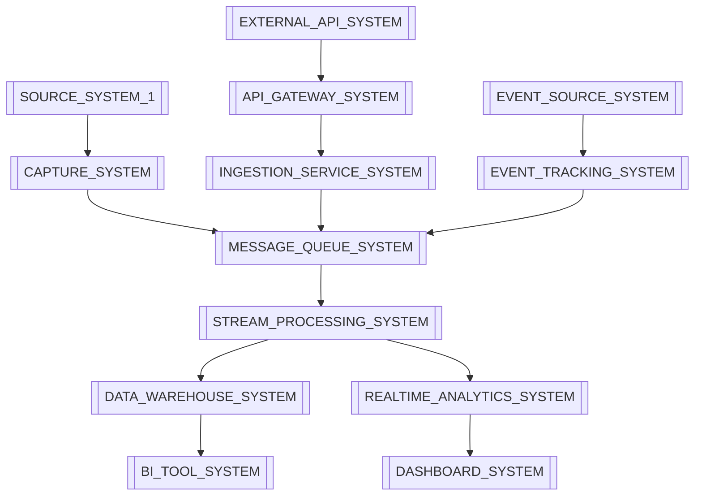

# Database Catalog & Data Manifest
> **Purpose:** Comprehensive database catalog following 2025 best practices for data governance, schema management, and regulatory compliance. This manifest serves as the authoritative source for all database entities, their relationships, and data governance policies.

**Document Type:** Data Catalog & Schema Registry  
**Version:** 2.0 - Enhanced with 2025 Best Practices  
**Last Updated:** 2025-01-15  
**Template Status:** Production Ready

---

## Document Control
| Field | Value |
|-------|-------|
| **Project Name** | [PROJECT_NAME] |
| **Data Architect** | [DATA_ARCHITECT_NAME] |
| **Database Administrator** | [DBA_NAME] |
| **Last Updated** | [YYYY-MM-DD] |
| **Next Review** | [YYYY-MM-DD] |
| **Total Entities** | [ENTITY_COUNT] |

---

## 📋 Table of Contents
- [🎯 Data Catalog Overview](#-data-catalog-overview)
- [🏗️ Database Architecture](#️-database-architecture)
- [📊 Core Data Entities](#-core-data-entities)
- [🔗 Entity Relationships](#-entity-relationships)
- [🔐 Data Security & Privacy](#-data-security--privacy)
- [📈 Data Lineage & Flow](#-data-lineage--flow)
- [🛡️ Compliance & Governance](#️-compliance--governance)
- [🔄 Schema Management](#-schema-management)
- [📊 Data Quality & Monitoring](#-data-quality--monitoring)
- [🚀 Performance Optimization](#-performance-optimization)
- [📚 Data Dictionary](#-data-dictionary)
- [🎯 Data Governance Policies](#-data-governance-policies)

---

## 🎯 Data Catalog Overview

### Data Catalog Philosophy

[DATABASE_CATALOG_DESCRIPTION] follows [DATA_GOVERNANCE_PRINCIPLES] and serves as [CATALOG_PURPOSE]. This catalog enables:

#### 🔍 **[DATA_DISCOVERY_CATEGORY_TITLE]**
- **[DISCOVERY_FEATURE_1]** for [FEATURE_1_SCOPE]
- **[DISCOVERY_FEATURE_2]** and [FEATURE_2_PURPOSE]
- **[DISCOVERY_FEATURE_3]** from [FEATURE_3_SOURCE] to [FEATURE_3_TARGET]
- **[DISCOVERY_FEATURE_4]** for [FEATURE_4_CHANGES] and [FEATURE_4_DEPENDENCIES]

#### 🛡️ **[DATA_GOVERNANCE_CATEGORY_TITLE]**
- **[GOVERNANCE_FEATURE_1]** and [FEATURE_1_CLASSIFICATION]
- **[GOVERNANCE_FEATURE_2]** and [FEATURE_2_ACCESS]
- **[GOVERNANCE_FEATURE_3]** and [FEATURE_3_MONITORING]
- **[GOVERNANCE_FEATURE_4]** and [FEATURE_4_ARCHIVING]

#### 📊 **[DATA_QUALITY_CATEGORY_TITLE]**
- **[QUALITY_FEATURE_1]** and [FEATURE_1_MONITORING]
- **[QUALITY_FEATURE_2]** and [FEATURE_2_ENFORCEMENT]
- **[QUALITY_FEATURE_3]** and [FEATURE_3_DETECTION]
- **[QUALITY_FEATURE_4]** and [FEATURE_4_STRATEGIES]

### Database Classification

[DATABASE_ORGANIZATION_DESCRIPTION]:

#### **[DATABASE_TIERS_TITLE]**
- **[DB_TIER_1_NAME]:** [DB_TIER_1_DESCRIPTION] with [DB_TIER_1_AVAILABILITY]
- **[DB_TIER_2_NAME]:** [DB_TIER_2_DESCRIPTION] with [DB_TIER_2_AVAILABILITY]
- **[DB_TIER_3_NAME]:** [DB_TIER_3_DESCRIPTION] with [DB_TIER_3_AVAILABILITY]
- **[DB_TIER_4_NAME]:** [DB_TIER_4_DESCRIPTION] with [DB_TIER_4_AVAILABILITY]

#### **[DATA_CLASSIFICATION_TITLE]**
- **[CLASSIFICATION_LEVEL_1]:** [LEVEL_1_DESCRIPTION]
- **[CLASSIFICATION_LEVEL_2]:** [LEVEL_2_DESCRIPTION]
- **[CLASSIFICATION_LEVEL_3]:** [LEVEL_3_DESCRIPTION]
- **[CLASSIFICATION_LEVEL_4]:** [LEVEL_4_DESCRIPTION]

---

## 🏗️ Database Architecture

### Database Infrastructure Overview

[DATABASE_ARCHITECTURE_DESCRIPTION] follows [ARCHITECTURE_PRINCIPLES] with [ARCHITECTURE_CHARACTERISTICS]:

#### **[PRIMARY_CLUSTER_TITLE]**
```yaml
cluster_name: [CLUSTER_NAME]
database_engine: [DATABASE_ENGINE]
cluster_type: [CLUSTER_TYPE]
high_availability: [HA_STRATEGY]
backup_strategy: [BACKUP_STRATEGY]
encryption: [ENCRYPTION_DETAILS]

instances:
  primary:
    instance_type: [PRIMARY_INSTANCE_TYPE]
    storage: [PRIMARY_STORAGE]
    iops: 12000
    
  read_replicas:
    count: [REPLICA_COUNT]
    instance_type: [REPLICA_INSTANCE_TYPE]
    storage: [REPLICA_STORAGE]
    regions: [[REGION_1], [REGION_2], [REGION_3]]

connection_pooling:
  tool: [CONNECTION_POOLING_TOOL]
  max_connections: [MAX_CONNECTIONS]
  pool_mode: [POOL_MODE]
```

#### **[ANALYTICS_DATABASE_TITLE]**
```yaml
cluster_name: [ANALYTICS_CLUSTER_NAME]
database_engine: [ANALYTICS_ENGINE]
cluster_type: [ANALYTICS_CLUSTER_TYPE]
node_type: [ANALYTICS_NODE_TYPE]
node_count: [ANALYTICS_NODE_COUNT]
storage: [ANALYTICS_STORAGE]

features:
  - [ANALYTICS_FEATURE_1]
  - [ANALYTICS_FEATURE_2]
  - [ANALYTICS_FEATURE_3]
  - [ANALYTICS_FEATURE_4]
  - [ANALYTICS_FEATURE_5]

security:
  encryption_at_rest: [ENCRYPTION_AT_REST]
  encryption_in_transit: [ENCRYPTION_IN_TRANSIT]
  vpc_security: [VPC_SECURITY]
  audit_logging: [AUDIT_LOGGING]
```

#### **[CACHE_LAYER_TITLE]**
```yaml
cache_cluster: [CACHE_CLUSTER_NAME]
engine: [CACHE_ENGINE]
cluster_mode: [CACHE_CLUSTER_MODE]
nodes: [CACHE_NODE_COUNT]
instance_type: [CACHE_INSTANCE_TYPE]
memory_per_node: [MEMORY_PER_NODE]
total_memory: [TOTAL_MEMORY]

features:
  - [CACHE_FEATURE_1]
  - [CACHE_FEATURE_2]
  - [CACHE_FEATURE_3]
  - [CACHE_FEATURE_4]
  - [CACHE_FEATURE_5]
```

---

## 📊 Core Data Entities

### Business Domain Entities

#### **[DOMAIN_1_NAME]**

##### **[TABLE_1_NAME]**
```sql
-- [TABLE_1_DESCRIPTION]
CREATE TABLE [TABLE_1_NAME_LOWER] (
    [PRIMARY_KEY_FIELD] [PRIMARY_KEY_TYPE] PRIMARY KEY DEFAULT [PRIMARY_KEY_DEFAULT],
    [FIELD_1] [FIELD_1_TYPE] [FIELD_1_CONSTRAINTS],
    [FIELD_2] [FIELD_2_TYPE] [FIELD_2_CONSTRAINTS],
    [FIELD_3] [FIELD_3_TYPE] [FIELD_3_CONSTRAINTS],
    [FIELD_4] [FIELD_4_TYPE] [FIELD_4_CONSTRAINTS],
    [FIELD_5] [FIELD_5_TYPE] [FIELD_5_CONSTRAINTS],
    [FIELD_6] [FIELD_6_TYPE],
    [FIELD_7] [FIELD_7_TYPE],
    [FIELD_8] [FIELD_8_TYPE],
    [FIELD_9] [FIELD_9_TYPE] DEFAULT [FIELD_9_DEFAULT],
    [FIELD_10] [FIELD_10_TYPE] DEFAULT [FIELD_10_DEFAULT],
    [STATUS_FIELD] [STATUS_ENUM_TYPE] DEFAULT '[STATUS_DEFAULT]',
    [CREATED_AT_FIELD] TIMESTAMP WITH TIME ZONE DEFAULT CURRENT_TIMESTAMP,
    [UPDATED_AT_FIELD] TIMESTAMP WITH TIME ZONE DEFAULT CURRENT_TIMESTAMP,
    [LAST_ACCESS_FIELD] TIMESTAMP WITH TIME ZONE,
    
    -- Audit fields
    [CREATED_BY_FIELD] [REFERENCE_TYPE] REFERENCES [REFERENCE_TABLE]([REFERENCE_FIELD]),
    [UPDATED_BY_FIELD] [REFERENCE_TYPE] REFERENCES [REFERENCE_TABLE]([REFERENCE_FIELD]),
    
    -- Soft delete
    [DELETED_AT_FIELD] TIMESTAMP WITH TIME ZONE,
    
    -- Constraints
    CONSTRAINT [CONSTRAINT_1_NAME] CHECK ([CONSTRAINT_1_CONDITION]),
    CONSTRAINT [CONSTRAINT_2_NAME] CHECK ([CONSTRAINT_2_CONDITION]),
    CONSTRAINT [CONSTRAINT_3_NAME] CHECK ([CONSTRAINT_3_CONDITION])
);

-- Indexes for performance
CREATE INDEX [INDEX_1_NAME] ON [TABLE_1_NAME_LOWER]([INDEX_1_FIELD]) WHERE [INDEX_1_CONDITION];
CREATE INDEX [INDEX_2_NAME] ON [TABLE_1_NAME_LOWER]([INDEX_2_FIELD]) WHERE [INDEX_2_CONDITION];
CREATE INDEX [INDEX_3_NAME] ON [TABLE_1_NAME_LOWER]([INDEX_3_FIELD]) WHERE [INDEX_3_CONDITION];
CREATE INDEX [INDEX_4_NAME] ON [TABLE_1_NAME_LOWER]([INDEX_4_FIELD]);
CREATE INDEX [INDEX_5_NAME] ON [TABLE_1_NAME_LOWER]([INDEX_5_FIELD]);
```

**[ENTITY_METADATA_TITLE]:**
```yaml
entity_name: [ENTITY_NAME]
domain: [ENTITY_DOMAIN]
tier: [ENTITY_TIER]
data_classification: [DATA_CLASSIFICATION]
pii_data: [PII_DATA_FLAG]
gdpr_applicable: [GDPR_APPLICABLE_FLAG]
retention_period: [RETENTION_PERIOD]

business_purpose: "[BUSINESS_PURPOSE]"
data_owner: "[DATA_OWNER_TEAM]"
technical_owner: "[TECHNICAL_OWNER_TEAM]"
steward: "[DATA_STEWARD_NAME]"

compliance_requirements:
  - [COMPLIANCE_REQ_1]
  - [COMPLIANCE_REQ_2]
  - [COMPLIANCE_REQ_3]
  - [COMPLIANCE_REQ_4]

data_quality_rules:
  - [QUALITY_RULE_1]: "[QUALITY_RULE_1_DESCRIPTION]"
  - [QUALITY_RULE_2]: "[QUALITY_RULE_2_DESCRIPTION]"
  - [QUALITY_RULE_3]: "[QUALITY_RULE_3_DESCRIPTION]"
  - [QUALITY_RULE_4]: "[QUALITY_RULE_4_DESCRIPTION]"

monitoring:
  row_count_alert: "[ROW_COUNT_ALERT_THRESHOLD]"
  data_quality_score: "[DATA_QUALITY_THRESHOLD]"
  query_performance: "[QUERY_PERFORMANCE_THRESHOLD]"
```

##### **[TABLE_2_NAME]**
```sql
-- [TABLE_2_DESCRIPTION]
CREATE TABLE [TABLE_2_NAME_LOWER] (
    [TABLE_2_PRIMARY_KEY] [PRIMARY_KEY_TYPE] PRIMARY KEY DEFAULT [PRIMARY_KEY_DEFAULT],
    [FOREIGN_KEY_FIELD] [FOREIGN_KEY_TYPE] NOT NULL REFERENCES [PARENT_TABLE]([PARENT_KEY]) ON DELETE CASCADE,
    [TEXT_FIELD_1] TEXT,
    [TEXT_FIELD_2] TEXT,
    [VARCHAR_FIELD_1] VARCHAR([VARCHAR_LENGTH]),
    [VARCHAR_FIELD_2] VARCHAR([VARCHAR_LENGTH_2]),
    [PREFERENCE_FIELD_1] VARCHAR([PREF_LENGTH]) DEFAULT '[DEFAULT_VALUE_1]',
    [PREFERENCE_FIELD_2] VARCHAR([PREF_LENGTH_2]) DEFAULT '[DEFAULT_VALUE_2]',
    [JSON_FIELD_1] JSONB DEFAULT '{}',
    [JSON_FIELD_2] JSONB DEFAULT '{}',
    [BOOLEAN_FIELD_1] BOOLEAN DEFAULT [BOOLEAN_DEFAULT_1],
    [BOOLEAN_FIELD_2] BOOLEAN DEFAULT [BOOLEAN_DEFAULT_2],
    [CREATED_AT_FIELD] TIMESTAMP WITH TIME ZONE DEFAULT CURRENT_TIMESTAMP,
    [UPDATED_AT_FIELD] TIMESTAMP WITH TIME ZONE DEFAULT CURRENT_TIMESTAMP,
    
    -- Constraints
    CONSTRAINT [UNIQUE_CONSTRAINT_NAME] UNIQUE([UNIQUE_FIELD]),
    CONSTRAINT [FORMAT_CONSTRAINT_1] CHECK ([FORMAT_CHECK_1]),
    CONSTRAINT [FORMAT_CONSTRAINT_2] CHECK ([FORMAT_CHECK_2]),
    CONSTRAINT [FORMAT_CONSTRAINT_3] CHECK ([FORMAT_CHECK_3])
);

-- Indexes
CREATE INDEX [TABLE_2_INDEX_1] ON [TABLE_2_NAME_LOWER]([INDEX_FIELD_1]);
CREATE INDEX [TABLE_2_INDEX_2] ON [TABLE_2_NAME_LOWER]([INDEX_FIELD_2]) WHERE [INDEX_CONDITION];
CREATE INDEX [TABLE_2_INDEX_3] ON [TABLE_2_NAME_LOWER]([INDEX_FIELD_3]);
```

#### **[DOMAIN_2_NAME]**

##### **[TABLE_3_NAME]**
```sql
-- [TABLE_3_DESCRIPTION]
CREATE TABLE [TABLE_3_NAME_LOWER] (
    [TABLE_3_PRIMARY_KEY] [PRIMARY_KEY_TYPE] PRIMARY KEY DEFAULT [PRIMARY_KEY_DEFAULT],
    [UNIQUE_IDENTIFIER] VARCHAR([IDENTIFIER_LENGTH]) UNIQUE NOT NULL,
    [NAME_FIELD] VARCHAR([NAME_LENGTH]) NOT NULL,
    [DESCRIPTION_FIELD] TEXT,
    [SHORT_DESC_FIELD] VARCHAR([SHORT_DESC_LENGTH]),
    [CATEGORY_FK] [FOREIGN_KEY_TYPE] REFERENCES [CATEGORY_TABLE]([CATEGORY_KEY]),
    [BRAND_FK] [FOREIGN_KEY_TYPE] REFERENCES [BRAND_TABLE]([BRAND_KEY]),
    [PRICE_FIELD] DECIMAL([PRICE_PRECISION],[PRICE_SCALE]) NOT NULL,
    [COST_FIELD] DECIMAL([COST_PRECISION],[COST_SCALE]),
    [WEIGHT_FIELD] DECIMAL([WEIGHT_PRECISION],[WEIGHT_SCALE]),
    [DIMENSIONS_FIELD] JSONB, -- [DIMENSIONS_COMMENT]
    [STATUS_FIELD] [STATUS_ENUM] DEFAULT '[STATUS_DEFAULT]',
    [VISIBILITY_FIELD] [VISIBILITY_ENUM] DEFAULT '[VISIBILITY_DEFAULT]',
    [FEATURED_FIELD] BOOLEAN DEFAULT [FEATURED_DEFAULT],
    [DIGITAL_FIELD] BOOLEAN DEFAULT [DIGITAL_DEFAULT],
    [DOWNLOADABLE_FIELD] BOOLEAN DEFAULT [DOWNLOADABLE_DEFAULT],
    [INVENTORY_TRACKED_FIELD] BOOLEAN DEFAULT [INVENTORY_TRACKED_DEFAULT],
    [STOCK_FIELD] INTEGER DEFAULT [STOCK_DEFAULT],
    [THRESHOLD_FIELD] INTEGER DEFAULT [THRESHOLD_DEFAULT],
    [META_TITLE_FIELD] VARCHAR([META_TITLE_LENGTH]),
    [META_DESC_FIELD] VARCHAR([META_DESC_LENGTH]),
    [KEYWORDS_FIELD] TEXT[],
    [TAGS_FIELD] TEXT[],
    [CREATED_AT_FIELD] TIMESTAMP WITH TIME ZONE DEFAULT CURRENT_TIMESTAMP,
    [UPDATED_AT_FIELD] TIMESTAMP WITH TIME ZONE DEFAULT CURRENT_TIMESTAMP,
    [PUBLISHED_AT_FIELD] TIMESTAMP WITH TIME ZONE,
    
    -- Audit fields
    [CREATED_BY_FIELD] [REFERENCE_TYPE] REFERENCES [REFERENCE_TABLE]([REFERENCE_FIELD]),
    [UPDATED_BY_FIELD] [REFERENCE_TYPE] REFERENCES [REFERENCE_TABLE]([REFERENCE_FIELD]),
    
    -- Soft delete
    [DELETED_AT_FIELD] TIMESTAMP WITH TIME ZONE,
    
    -- Constraints
    CONSTRAINT [PRICE_CONSTRAINT] CHECK ([PRICE_CHECK_CONDITION]),
    CONSTRAINT [COST_CONSTRAINT] CHECK ([COST_CHECK_CONDITION]),
    CONSTRAINT [WEIGHT_CONSTRAINT] CHECK ([WEIGHT_CHECK_CONDITION]),
    CONSTRAINT [STOCK_CONSTRAINT] CHECK ([STOCK_CHECK_CONDITION]),
    CONSTRAINT [THRESHOLD_CONSTRAINT] CHECK ([THRESHOLD_CHECK_CONDITION])
);

-- Indexes for performance and search
CREATE INDEX [TABLE_3_INDEX_1] ON [TABLE_3_NAME_LOWER]([INDEX_FIELD_1]) WHERE [INDEX_CONDITION_1];
CREATE INDEX [TABLE_3_INDEX_2] ON [TABLE_3_NAME_LOWER]([INDEX_FIELD_2]) WHERE [INDEX_CONDITION_2];
CREATE INDEX [TABLE_3_INDEX_3] ON [TABLE_3_NAME_LOWER]([INDEX_FIELD_3]) WHERE [INDEX_CONDITION_3];
CREATE INDEX [TABLE_3_INDEX_4] ON [TABLE_3_NAME_LOWER]([INDEX_FIELD_4]) WHERE [INDEX_CONDITION_4];
CREATE INDEX [TABLE_3_INDEX_5] ON [TABLE_3_NAME_LOWER]([INDEX_FIELD_5]) WHERE [INDEX_CONDITION_5];
CREATE INDEX [TABLE_3_INDEX_6] ON [TABLE_3_NAME_LOWER]([INDEX_FIELD_6]) WHERE [INDEX_CONDITION_6];
CREATE INDEX [TABLE_3_INDEX_7] ON [TABLE_3_NAME_LOWER]([INDEX_FIELD_7]) WHERE [INDEX_CONDITION_7];
CREATE INDEX [TABLE_3_INDEX_8] ON [TABLE_3_NAME_LOWER] USING GIN([GIN_INDEX_FIELD_1]) WHERE [GIN_INDEX_CONDITION_1];
CREATE INDEX [TABLE_3_INDEX_9] ON [TABLE_3_NAME_LOWER] USING GIN([GIN_INDEX_FIELD_2]) WHERE [GIN_INDEX_CONDITION_2];
CREATE INDEX [TABLE_3_INDEX_10] ON [TABLE_3_NAME_LOWER] USING GIN([TEXT_SEARCH_EXPRESSION]);
```

**[ENTITY_METADATA_TITLE_2]:**
```yaml
entity_name: [ENTITY_NAME_2]
domain: [ENTITY_DOMAIN_2]
tier: [ENTITY_TIER_2]
data_classification: [DATA_CLASSIFICATION_2]
pii_data: [PII_DATA_FLAG_2]
gdpr_applicable: [GDPR_APPLICABLE_FLAG_2]
retention_period: [RETENTION_PERIOD_2]

business_purpose: "[BUSINESS_PURPOSE_2]"
data_owner: "[DATA_OWNER_TEAM_2]"
technical_owner: "[TECHNICAL_OWNER_TEAM_2]"
steward: "[DATA_STEWARD_NAME_2]"

data_quality_rules:
  - [QUALITY_RULE_2_1]: "[QUALITY_RULE_2_1_DESCRIPTION]"
  - [QUALITY_RULE_2_2]: "[QUALITY_RULE_2_2_DESCRIPTION]"
  - [QUALITY_RULE_2_3]: "[QUALITY_RULE_2_3_DESCRIPTION]"
  - [QUALITY_RULE_2_4]: "[QUALITY_RULE_2_4_DESCRIPTION]"

search_optimization:
  - [SEARCH_OPT_1]: "[SEARCH_OPT_1_DESCRIPTION]"
  - [SEARCH_OPT_2]: "[SEARCH_OPT_2_DESCRIPTION]"
  - [SEARCH_OPT_3]: "[SEARCH_OPT_3_DESCRIPTION]"
```

##### **[TABLE_4_NAME]**
```sql
-- [TABLE_4_DESCRIPTION]
CREATE TABLE [TABLE_4_NAME_LOWER] (
    [TABLE_4_PRIMARY_KEY] [PRIMARY_KEY_TYPE] PRIMARY KEY DEFAULT [PRIMARY_KEY_DEFAULT],
    [ORDER_NUMBER_FIELD] VARCHAR([ORDER_NUMBER_LENGTH]) UNIQUE NOT NULL,
    [USER_FK_FIELD] [FOREIGN_KEY_TYPE] REFERENCES [USER_TABLE]([USER_KEY]),
    [GUEST_EMAIL_FIELD] VARCHAR([EMAIL_LENGTH]),
    [STATUS_FIELD] [ORDER_STATUS_ENUM] DEFAULT '[STATUS_DEFAULT]',
    [PAYMENT_STATUS_FIELD] [PAYMENT_STATUS_ENUM] DEFAULT '[PAYMENT_STATUS_DEFAULT]',
    [FULFILLMENT_STATUS_FIELD] [FULFILLMENT_STATUS_ENUM] DEFAULT '[FULFILLMENT_STATUS_DEFAULT]',
    
    -- Financial information
    [SUBTOTAL_FIELD] DECIMAL([DECIMAL_PRECISION],[DECIMAL_SCALE]) NOT NULL,
    [TAX_FIELD] DECIMAL([DECIMAL_PRECISION],[DECIMAL_SCALE]) DEFAULT [TAX_DEFAULT],
    [SHIPPING_FIELD] DECIMAL([DECIMAL_PRECISION],[DECIMAL_SCALE]) DEFAULT [SHIPPING_DEFAULT],
    [DISCOUNT_FIELD] DECIMAL([DECIMAL_PRECISION],[DECIMAL_SCALE]) DEFAULT [DISCOUNT_DEFAULT],
    [TOTAL_FIELD] DECIMAL([DECIMAL_PRECISION],[DECIMAL_SCALE]) NOT NULL,
    [CURRENCY_FIELD] VARCHAR([CURRENCY_LENGTH]) DEFAULT '[CURRENCY_DEFAULT]',
    
    -- Addresses
    [BILLING_ADDRESS_FIELD] JSONB NOT NULL,
    [SHIPPING_ADDRESS_FIELD] JSONB,
    
    -- Shipping information
    [SHIPPING_METHOD_FIELD] VARCHAR([SHIPPING_METHOD_LENGTH]),
    [TRACKING_NUMBER_FIELD] VARCHAR([TRACKING_LENGTH]),
    [ESTIMATED_DELIVERY_FIELD] DATE,
    [ACTUAL_DELIVERY_FIELD] DATE,
    
    -- Metadata
    [SOURCE_FIELD] VARCHAR([SOURCE_LENGTH]) DEFAULT '[SOURCE_DEFAULT]',
    [REFERRER_FIELD] TEXT,
    [UTM_SOURCE_FIELD] VARCHAR([UTM_LENGTH]),
    [UTM_MEDIUM_FIELD] VARCHAR([UTM_LENGTH]),
    [UTM_CAMPAIGN_FIELD] VARCHAR([UTM_LENGTH]),
    
    -- Timestamps
    [CREATED_AT_FIELD] TIMESTAMP WITH TIME ZONE DEFAULT CURRENT_TIMESTAMP,
    [UPDATED_AT_FIELD] TIMESTAMP WITH TIME ZONE DEFAULT CURRENT_TIMESTAMP,
    [CONFIRMED_AT_FIELD] TIMESTAMP WITH TIME ZONE,
    [SHIPPED_AT_FIELD] TIMESTAMP WITH TIME ZONE,
    [DELIVERED_AT_FIELD] TIMESTAMP WITH TIME ZONE,
    [CANCELLED_AT_FIELD] TIMESTAMP WITH TIME ZONE,
    
    -- Audit
    [CREATED_BY_FIELD] [REFERENCE_TYPE] REFERENCES [REFERENCE_TABLE]([REFERENCE_FIELD]),
    [UPDATED_BY_FIELD] [REFERENCE_TYPE] REFERENCES [REFERENCE_TABLE]([REFERENCE_FIELD]),
    
    -- Constraints
    CONSTRAINT [USER_OR_GUEST_CONSTRAINT] CHECK ([USER_OR_GUEST_CONDITION]),
    CONSTRAINT [AMOUNTS_POSITIVE_CONSTRAINT] CHECK ([AMOUNTS_POSITIVE_CONDITION]),
    CONSTRAINT [TOTAL_CALCULATION_CONSTRAINT] CHECK ([TOTAL_CALCULATION_CONDITION]),
    CONSTRAINT [DELIVERY_DATES_CONSTRAINT] CHECK ([DELIVERY_DATES_CONDITION])
);

-- Indexes for performance
CREATE INDEX [TABLE_4_INDEX_1] ON [TABLE_4_NAME_LOWER]([INDEX_FIELD_1]) WHERE [INDEX_CONDITION_1];
CREATE INDEX [TABLE_4_INDEX_2] ON [TABLE_4_NAME_LOWER]([INDEX_FIELD_2]) WHERE [INDEX_CONDITION_2];
CREATE INDEX [TABLE_4_INDEX_3] ON [TABLE_4_NAME_LOWER]([INDEX_FIELD_3]);
CREATE INDEX [TABLE_4_INDEX_4] ON [TABLE_4_NAME_LOWER]([INDEX_FIELD_4]);
CREATE INDEX [TABLE_4_INDEX_5] ON [TABLE_4_NAME_LOWER]([INDEX_FIELD_5]);
CREATE INDEX [TABLE_4_INDEX_6] ON [TABLE_4_NAME_LOWER]([INDEX_FIELD_6]);
CREATE INDEX [TABLE_4_INDEX_7] ON [TABLE_4_NAME_LOWER]([INDEX_FIELD_7]) WHERE [INDEX_CONDITION_7];
```

#### **[DOMAIN_3_NAME]**

##### **[TABLE_5_NAME]**
```sql
-- [TABLE_5_DESCRIPTION]
CREATE TABLE [TABLE_5_NAME_LOWER] (
    [TABLE_5_PRIMARY_KEY] [PRIMARY_KEY_TYPE] PRIMARY KEY DEFAULT [PRIMARY_KEY_DEFAULT],
    [USER_FK_FIELD] [FOREIGN_KEY_TYPE] REFERENCES [USER_TABLE]([USER_KEY]),
    [SESSION_ID_FIELD] VARCHAR([SESSION_ID_LENGTH]) NOT NULL,
    [EVENT_TYPE_FIELD] VARCHAR([EVENT_TYPE_LENGTH]) NOT NULL,
    [EVENT_NAME_FIELD] VARCHAR([EVENT_NAME_LENGTH]) NOT NULL,
    [PAGE_URL_FIELD] TEXT,
    [REFERRER_URL_FIELD] TEXT,
    [USER_AGENT_FIELD] TEXT,
    [IP_ADDRESS_FIELD] INET,
    [COUNTRY_CODE_FIELD] VARCHAR([COUNTRY_CODE_LENGTH]),
    [CITY_FIELD] VARCHAR([CITY_LENGTH]),
    [DEVICE_TYPE_FIELD] VARCHAR([DEVICE_TYPE_LENGTH]),
    [BROWSER_FIELD] VARCHAR([BROWSER_LENGTH]),
    [OS_FIELD] VARCHAR([OS_LENGTH]),
    
    -- Event properties
    [PROPERTIES_FIELD] JSONB DEFAULT '{}',
    
    -- Domain specific
    [PRODUCT_ID_FIELD] [FOREIGN_KEY_TYPE],
    [CATEGORY_ID_FIELD] [FOREIGN_KEY_TYPE],
    [REVENUE_FIELD] DECIMAL([REVENUE_PRECISION],[REVENUE_SCALE]),
    [CURRENCY_FIELD] VARCHAR([CURRENCY_LENGTH]),
    
    -- Timestamps
    [EVENT_TIMESTAMP_FIELD] TIMESTAMP WITH TIME ZONE DEFAULT CURRENT_TIMESTAMP,
    [SERVER_TIMESTAMP_FIELD] TIMESTAMP WITH TIME ZONE DEFAULT CURRENT_TIMESTAMP,
    
    -- Partitioning key
    [EVENT_DATE_FIELD] DATE GENERATED ALWAYS AS ([EVENT_TIMESTAMP_FIELD]::DATE) STORED,
    
    -- Constraints
    CONSTRAINT [REVENUE_POSITIVE_CONSTRAINT] CHECK ([REVENUE_POSITIVE_CONDITION]),
    CONSTRAINT [TIMESTAMPS_CONSTRAINT] CHECK ([TIMESTAMPS_CONDITION])
) PARTITION BY RANGE ([PARTITION_FIELD]);

-- Create partitions for current and future periods
CREATE TABLE [PARTITION_TABLE_1] PARTITION OF [TABLE_5_NAME_LOWER]
    FOR VALUES FROM ('[PARTITION_START_1]') TO ('[PARTITION_END_1]');
CREATE TABLE [PARTITION_TABLE_2] PARTITION OF [TABLE_5_NAME_LOWER]
    FOR VALUES FROM ('[PARTITION_START_2]') TO ('[PARTITION_END_2]');
-- ... [ADDITIONAL_PARTITIONS_COMMENT]

-- Indexes for analytics queries
CREATE INDEX [TABLE_5_INDEX_1] ON [TABLE_5_NAME_LOWER]([INDEX_FIELD_1], [INDEX_FIELD_2]);
CREATE INDEX [TABLE_5_INDEX_2] ON [TABLE_5_NAME_LOWER]([INDEX_FIELD_3], [INDEX_FIELD_4]);
CREATE INDEX [TABLE_5_INDEX_3] ON [TABLE_5_NAME_LOWER]([INDEX_FIELD_5], [INDEX_FIELD_6], [INDEX_FIELD_7]);
CREATE INDEX [TABLE_5_INDEX_4] ON [TABLE_5_NAME_LOWER]([INDEX_FIELD_8], [INDEX_FIELD_9]) WHERE [INDEX_CONDITION_4];
CREATE INDEX [TABLE_5_INDEX_5] ON [TABLE_5_NAME_LOWER] USING GIN([GIN_INDEX_FIELD]);
```

---

## 🔗 Entity Relationships

### Entity Relationship Diagram

```mermaid
erDiagram
    [ENTITY_1] ||--o{ [ENTITY_2] : [RELATIONSHIP_1]
    [ENTITY_1] ||--o{ [ENTITY_3] : [RELATIONSHIP_2]
    [ENTITY_1] ||--o{ [ENTITY_4] : [RELATIONSHIP_3]
    [ENTITY_1] ||--o{ [ENTITY_5] : [RELATIONSHIP_4]
    
    [ENTITY_6] ||--o{ [ENTITY_7] : [RELATIONSHIP_5]
    [ENTITY_6] }o--|| [ENTITY_8] : [RELATIONSHIP_6]
    [ENTITY_6] }o--|| [ENTITY_9] : [RELATIONSHIP_7]
    [ENTITY_6] ||--o{ [ENTITY_10] : [RELATIONSHIP_8]
    [ENTITY_6] ||--o{ [ENTITY_11] : [RELATIONSHIP_9]
    
    [ENTITY_3] ||--o{ [ENTITY_7] : [RELATIONSHIP_10]
    [ENTITY_3] ||--o{ [ENTITY_12] : [RELATIONSHIP_11]
    [ENTITY_3] ||--o{ [ENTITY_13] : [RELATIONSHIP_12]
    
    [ENTITY_8] ||--o{ [ENTITY_8] : [SELF_RELATIONSHIP]
    
    [ENTITY_4] }o--|| [ENTITY_6] : [RELATIONSHIP_13]
    [ENTITY_4] }o--|| [ENTITY_8] : [RELATIONSHIP_14]
```

### Relationship Specifications

#### **[DOMAIN_1_NAME] Relationships**
```yaml
[RELATIONSHIP_SPEC_1]:
  type: [RELATIONSHIP_TYPE_1]
  constraint: [CONSTRAINT_TYPE_1]
  description: "[RELATIONSHIP_DESCRIPTION_1]"
  
[RELATIONSHIP_SPEC_2]:
  type: [RELATIONSHIP_TYPE_2]
  constraint: [CONSTRAINT_TYPE_2]
  description: "[RELATIONSHIP_DESCRIPTION_2]"
  
[RELATIONSHIP_SPEC_3]:
  type: [RELATIONSHIP_TYPE_3]
  constraint: [CONSTRAINT_TYPE_3]
  description: "[RELATIONSHIP_DESCRIPTION_3]"
```

#### **[DOMAIN_2_NAME] Relationships**
```yaml
[RELATIONSHIP_SPEC_4]:
  type: [RELATIONSHIP_TYPE_4]
  constraint: [CONSTRAINT_TYPE_4]
  description: "[RELATIONSHIP_DESCRIPTION_4]"
  
[RELATIONSHIP_SPEC_5]:
  type: [RELATIONSHIP_TYPE_5]
  constraint: [CONSTRAINT_TYPE_5]
  description: "[RELATIONSHIP_DESCRIPTION_5]"
  
[RELATIONSHIP_SPEC_6]:
  type: [RELATIONSHIP_TYPE_6]
  constraint: [CONSTRAINT_TYPE_6]
  description: "[RELATIONSHIP_DESCRIPTION_6]"
```

#### **[DOMAIN_3_NAME] Relationships**
```yaml
[RELATIONSHIP_SPEC_7]:
  type: [RELATIONSHIP_TYPE_7]
  constraint: [CONSTRAINT_TYPE_7]
  description: "[RELATIONSHIP_DESCRIPTION_7]"
  
[RELATIONSHIP_SPEC_8]:
  type: [RELATIONSHIP_TYPE_8]
  constraint: [CONSTRAINT_TYPE_8]
  description: "[RELATIONSHIP_DESCRIPTION_8]"
```

---

## 🔐 Data Security & Privacy

### Data Classification Framework

#### **[PII_SECTION_TITLE]**
```yaml
[PII_CATEGORIES_KEY]:
  [DIRECT_IDENTIFIERS_KEY]:
    - [DIRECT_IDENTIFIER_1]
    - [DIRECT_IDENTIFIER_2]
    - [DIRECT_IDENTIFIER_3]
    - [DIRECT_IDENTIFIER_4]
    
  [QUASI_IDENTIFIERS_KEY]:
    - [QUASI_IDENTIFIER_1]
    - [QUASI_IDENTIFIER_2]
    - [QUASI_IDENTIFIER_3]
    - [QUASI_IDENTIFIER_4]
    
  [SENSITIVE_ATTRIBUTES_KEY]:
    - [SENSITIVE_ATTRIBUTE_1]
    - [SENSITIVE_ATTRIBUTE_2]
    - [SENSITIVE_ATTRIBUTE_3]
    - [SENSITIVE_ATTRIBUTE_4]

[PROTECTION_MEASURES_KEY]:
  [ENCRYPTION_AT_REST_KEY]: "[ENCRYPTION_AT_REST_VALUE]"
  [ENCRYPTION_IN_TRANSIT_KEY]: "[ENCRYPTION_IN_TRANSIT_VALUE]"
  [ACCESS_CONTROLS_KEY]: "[ACCESS_CONTROLS_VALUE]"
  [AUDIT_LOGGING_KEY]: "[AUDIT_LOGGING_VALUE]"
```

#### **[DATA_MASKING_SECTION_TITLE]**
```sql
-- [MASKING_FUNCTIONS_COMMENT]
CREATE OR REPLACE FUNCTION [MASK_EMAIL_FUNCTION]([EMAIL_PARAM] TEXT)
RETURNS TEXT AS $$
BEGIN
    RETURN CASE 
        WHEN [EMAIL_PARAM] IS NULL THEN NULL
        ELSE '[MASKED_EMAIL_PREFIX]' || abs(hashtext([EMAIL_PARAM])) % [HASH_MODULO] || '[MASKED_EMAIL_SUFFIX]'
    END;
END;
$$ LANGUAGE plpgsql IMMUTABLE;

CREATE OR REPLACE FUNCTION [MASK_PHONE_FUNCTION]([PHONE_PARAM] TEXT)
RETURNS TEXT AS $$
BEGIN
    RETURN CASE 
        WHEN [PHONE_PARAM] IS NULL THEN NULL
        ELSE '[MASKED_PHONE_PREFIX]' || LPAD((abs(hashtext([PHONE_PARAM])) % [PHONE_HASH_MODULO])::TEXT, [PHONE_PAD_LENGTH], '[PHONE_PAD_CHAR]')
    END;
END;
$$ LANGUAGE plpgsql IMMUTABLE;

-- [ANONYMIZATION_VIEW_COMMENT]
CREATE VIEW [ANONYMIZED_VIEW_NAME] AS
SELECT 
    [USER_ID_FIELD],
    [MASK_EMAIL_FUNCTION]([EMAIL_FIELD]) as [EMAIL_ALIAS],
    '[DISPLAY_NAME_PREFIX]' || (abs(hashtext([FIRST_NAME_FIELD] || [LAST_NAME_FIELD])) % [DISPLAY_NAME_MODULO]) as [DISPLAY_NAME_ALIAS],
    EXTRACT(YEAR FROM [DOB_FIELD]) as [BIRTH_YEAR_ALIAS],
    [ACCOUNT_STATUS_FIELD],
    [CREATED_AT_FIELD],
    [LAST_LOGIN_FIELD]
FROM [SOURCE_TABLE]
WHERE [FILTER_CONDITION];
```

### Access Control Matrix

#### **[RBAC_SECTION_TITLE]**
```yaml
[ROLES_KEY]:
  [ROLE_1_NAME]:
    [PERMISSIONS_KEY]:
      - [PERMISSION_1_1]
      - [PERMISSION_1_2]
    [RESTRICTIONS_KEY]:
      - [RESTRICTION_1_1]
      - [RESTRICTION_1_2]
      
  [ROLE_2_NAME]:
    [PERMISSIONS_KEY]:
      - [PERMISSION_2_1]
      - [PERMISSION_2_2]
    [RESTRICTIONS_KEY]:
      - [RESTRICTION_2_1]
      - [RESTRICTION_2_2]
      
  [ROLE_3_NAME]:
    [PERMISSIONS_KEY]:
      - [PERMISSION_3_1]
      - [PERMISSION_3_2]
    [RESTRICTIONS_KEY]:
      - [RESTRICTION_3_1]
      - [RESTRICTION_3_2]
      
  [ROLE_4_NAME]:
    [PERMISSIONS_KEY]:
      - [PERMISSION_4_1]
      - [PERMISSION_4_2]
      - [PERMISSION_4_3]
    [RESTRICTIONS_KEY]:
      - [RESTRICTION_4_1]
      - [RESTRICTION_4_2]
```

#### **[RLS_SECTION_TITLE]**
```sql
-- [RLS_ENABLE_COMMENT]
ALTER TABLE [TABLE_1_NAME] ENABLE ROW LEVEL SECURITY;
ALTER TABLE [TABLE_2_NAME] ENABLE ROW LEVEL SECURITY;
ALTER TABLE [TABLE_3_NAME] ENABLE ROW LEVEL SECURITY;

-- [POLICY_1_COMMENT]
CREATE POLICY [POLICY_1_NAME] ON [POLICY_1_TABLE]
    FOR [POLICY_1_OPERATION] TO [POLICY_1_ROLE]
    USING ([POLICY_1_CONDITION]);

-- [POLICY_2_COMMENT]
CREATE POLICY [POLICY_2_NAME] ON [POLICY_2_TABLE]
    FOR [POLICY_2_OPERATION] TO [POLICY_2_ROLE]
    USING ([POLICY_2_CONDITION]);

-- [POLICY_3_COMMENT]
CREATE POLICY [POLICY_3_NAME] ON [POLICY_3_TABLE]
    FOR [POLICY_3_OPERATION] TO [POLICY_3_ROLE]
    USING ([POLICY_3_CONDITION]);
```

---

## 📈 Data Lineage & Flow

### Data Flow Architecture

#### **[DATA_PIPELINE_TITLE]**


#### **[DATA_LINEAGE_TITLE]**
```yaml
[LINEAGE_METADATA_KEY]:
  [SOURCE_SYSTEMS_KEY]:
    - name: "[SOURCE_SYSTEM_1_NAME]"
      type: "[SOURCE_SYSTEM_1_TYPE]"
      tables: ["[SOURCE_TABLE_1]", "[SOURCE_TABLE_2]", "[SOURCE_TABLE_3]", "[SOURCE_TABLE_4]"]
      
    - name: "[SOURCE_SYSTEM_2_NAME]"
      type: "[SOURCE_SYSTEM_2_TYPE]"
      endpoints: ["[ENDPOINT_1]", "[ENDPOINT_2]"]
      
    - name: "[SOURCE_SYSTEM_3_NAME]"
      type: "[SOURCE_SYSTEM_3_TYPE]"
      topics: ["[TOPIC_1]", "[TOPIC_2]", "[TOPIC_3]"]

  [TRANSFORMATION_LAYERS_KEY]:
    - name: "[TRANSFORMATION_1_NAME]"
      tool: "[TRANSFORMATION_1_TOOL]"
      transformations: ["[TRANSFORMATION_1_1]", "[TRANSFORMATION_1_2]"]
      
    - name: "[TRANSFORMATION_2_NAME]"
      tool: "[TRANSFORMATION_2_TOOL]"
      transformations: ["[TRANSFORMATION_2_1]", "[TRANSFORMATION_2_2]", "[TRANSFORMATION_2_3]"]
      
    - name: "[TRANSFORMATION_3_NAME]"
      tool: "[TRANSFORMATION_3_TOOL]"
      transformations: ["[TRANSFORMATION_3_1]", "[TRANSFORMATION_3_2]", "[TRANSFORMATION_3_3]"]

  [TARGET_SYSTEMS_KEY]:
    - name: "[TARGET_SYSTEM_1_NAME]"
      type: "[TARGET_SYSTEM_1_TYPE]"
      purpose: "[TARGET_SYSTEM_1_PURPOSE]"
      
    - name: "[TARGET_SYSTEM_2_NAME]"
      type: "[TARGET_SYSTEM_2_TYPE]"
      purpose: "[TARGET_SYSTEM_2_PURPOSE]"
      
    - name: "[TARGET_SYSTEM_3_NAME]"
      type: "[TARGET_SYSTEM_3_TYPE]"
      purpose: "[TARGET_SYSTEM_3_PURPOSE]"
```

### Data Quality Monitoring

#### **Data Quality Rules**
```sql
-- [DATA_QUALITY_FUNCTIONS_COMMENT]
CREATE OR REPLACE FUNCTION [DATA_QUALITY_FUNCTION_NAME]()
RETURNS TABLE(
    [TABLE_NAME_COLUMN] TEXT,
    [CHECK_NAME_COLUMN] TEXT,
    [STATUS_COLUMN] TEXT,
    [ERROR_COUNT_COLUMN] BIGINT,
    [TOTAL_COUNT_COLUMN] BIGINT,
    [QUALITY_SCORE_COLUMN] DECIMAL([SCORE_PRECISION],[SCORE_SCALE])
) AS $$
BEGIN
    -- [VALIDATION_1_COMMENT]
    RETURN QUERY
    SELECT 
        '[TABLE_1_NAME]'::TEXT,
        '[CHECK_1_NAME]'::TEXT,
        CASE WHEN error_cnt = 0 THEN '[PASS_STATUS]' ELSE '[FAIL_STATUS]' END,
        error_cnt,
        total_cnt,
        ROUND((total_cnt - error_cnt) * [PERCENTAGE_MULTIPLIER] / NULLIF(total_cnt, 0), [ROUND_PRECISION])
    FROM (
        SELECT 
            COUNT(*) FILTER (WHERE [FIELD_1] !~* '[VALIDATION_REGEX_1]') as error_cnt,
            COUNT(*) as total_cnt
        FROM [TABLE_1_NAME] 
        WHERE [FILTER_CONDITION_1]
    ) q;
    
    -- [VALIDATION_2_COMMENT]
    RETURN QUERY
    SELECT 
        '[TABLE_2_NAME]'::TEXT,
        '[CHECK_2_NAME]'::TEXT,
        CASE WHEN error_cnt = 0 THEN '[PASS_STATUS]' ELSE '[FAIL_STATUS]' END,
        error_cnt,
        total_cnt,
        ROUND((total_cnt - error_cnt) * [PERCENTAGE_MULTIPLIER] / NULLIF(total_cnt, 0), [ROUND_PRECISION])
    FROM (
        SELECT 
            COUNT(*) FILTER (WHERE [FIELD_2] [VALIDATION_CONDITION_2]) as error_cnt,
            COUNT(*) as total_cnt
        FROM [TABLE_2_NAME] 
        WHERE [FILTER_CONDITION_2]
    ) q;
    
    -- [VALIDATION_3_COMMENT]
    RETURN QUERY
    SELECT 
        '[TABLE_3_NAME]'::TEXT,
        '[CHECK_3_NAME]'::TEXT,
        CASE WHEN error_cnt = 0 THEN '[PASS_STATUS]' ELSE '[FAIL_STATUS]' END,
        error_cnt,
        total_cnt,
        ROUND((total_cnt - error_cnt) * [PERCENTAGE_MULTIPLIER] / NULLIF(total_cnt, 0), [ROUND_PRECISION])
    FROM (
        SELECT 
            COUNT(*) FILTER (WHERE [VALIDATION_EXPRESSION_3]) as error_cnt,
            COUNT(*) as total_cnt
        FROM [TABLE_3_NAME]
    ) q;
END;
$$ LANGUAGE plpgsql;
```

---

## 🛡️ Compliance & Governance

### Regulatory Compliance Framework

#### **[COMPLIANCE_FRAMEWORK_TITLE]**
```yaml
[COMPLIANCE_KEY]:
  [LAWFUL_BASIS_KEY]:
    [TABLE_1_COMPLIANCE]: "[LAWFUL_BASIS_1]"
    [TABLE_2_COMPLIANCE]: "[LAWFUL_BASIS_2]"
    [TABLE_3_COMPLIANCE]: "[LAWFUL_BASIS_3]"
    
  [DATA_SUBJECT_RIGHTS_KEY]:
    [RIGHT_OF_ACCESS_KEY]:
      [IMPLEMENTATION_KEY]: "[ACCESS_IMPLEMENTATION]"
      [RESPONSE_TIME_KEY]: "[ACCESS_RESPONSE_TIME]"
      
    [RIGHT_TO_RECTIFICATION_KEY]:
      [IMPLEMENTATION_KEY]: "[RECTIFICATION_IMPLEMENTATION]"
      [AUTOMATED_KEY]: [RECTIFICATION_AUTOMATED]
      
    [RIGHT_TO_ERASURE_KEY]:
      [IMPLEMENTATION_KEY]: "[ERASURE_IMPLEMENTATION]"
      [RETENTION_OVERRIDE_KEY]: "[ERASURE_RETENTION_OVERRIDE]"
      
    [RIGHT_TO_PORTABILITY_KEY]:
      [IMPLEMENTATION_KEY]: "[PORTABILITY_IMPLEMENTATION]"
      [SCOPE_KEY]: "[PORTABILITY_SCOPE]"
      
    [RIGHT_TO_OBJECT_KEY]:
      [IMPLEMENTATION_KEY]: "[OBJECTION_IMPLEMENTATION]"
      [MARKETING_KEY]: "[OBJECTION_MARKETING_EFFECT]"
      [ANALYTICS_KEY]: "[OBJECTION_ANALYTICS_EFFECT]"

  [TECHNICAL_MEASURES_KEY]:
    [PSEUDONYMIZATION_KEY]:
      - "[PSEUDONYMIZATION_MEASURE_1]"
      - "[PSEUDONYMIZATION_MEASURE_2]"
      
    [ENCRYPTION_KEY]:
      - "[ENCRYPTION_AT_REST_MEASURE]"
      - "[ENCRYPTION_IN_TRANSIT_MEASURE]"
      
    [ACCESS_CONTROLS_KEY]:
      - "[ACCESS_CONTROL_MEASURE_1]"
      - "[ACCESS_CONTROL_MEASURE_2]"
      
    [AUDIT_LOGGING_KEY]:
      - "[AUDIT_LOGGING_MEASURE]"
      - "[AUDIT_RETENTION_MEASURE]"
```

#### **Data Retention Policies**
```sql
-- Automated data retention implementation
CREATE OR REPLACE FUNCTION apply_retention_policies()
RETURNS void AS $$
BEGIN
    -- Soft delete inactive users after 3 years
    UPDATE users 
    SET deleted_at = CURRENT_TIMESTAMP,
        updated_by = '00000000-0000-0000-0000-000000000000'::UUID
    WHERE last_login_at < CURRENT_TIMESTAMP - INTERVAL '3 years'
      AND deleted_at IS NULL
      AND account_status = 'inactive';
    
    -- Hard delete user events older than 2 years (anonymized)
    DELETE FROM user_events 
    WHERE event_timestamp < CURRENT_TIMESTAMP - INTERVAL '2 years'
      AND user_id IS NULL; -- Only delete already anonymized events
    
    -- Anonymize user events older than 1 year
    UPDATE user_events 
    SET user_id = NULL,
        ip_address = NULL,
        user_agent = 'anonymized',
        properties = properties - 'user_id' - 'email' - 'phone'
    WHERE event_timestamp < CURRENT_TIMESTAMP - INTERVAL '1 year'
      AND user_id IS NOT NULL;
    
    -- Archive completed orders older than 7 years
    INSERT INTO orders_archive 
    SELECT * FROM orders 
    WHERE created_at < CURRENT_TIMESTAMP - INTERVAL '7 years'
      AND status IN ('completed', 'cancelled');
    
    DELETE FROM orders 
    WHERE created_at < CURRENT_TIMESTAMP - INTERVAL '7 years'
      AND status IN ('completed', 'cancelled');
      
END;
$$ LANGUAGE plpgsql;

-- Schedule retention policy execution
SELECT cron.schedule('retention-policies', '0 2 * * 0', 'SELECT apply_retention_policies();');
```

### Audit and Compliance Monitoring

#### **Audit Trail Implementation**
```sql
-- Audit trail table for sensitive operations
CREATE TABLE audit_log (
    audit_id UUID PRIMARY KEY DEFAULT gen_random_uuid(),
    table_name VARCHAR(100) NOT NULL,
    operation VARCHAR(10) NOT NULL, -- INSERT, UPDATE, DELETE
    record_id UUID NOT NULL,
    old_values JSONB,
    new_values JSONB,
    changed_fields TEXT[],
    user_id UUID REFERENCES users(user_id),
    session_id VARCHAR(100),
    ip_address INET,
    user_agent TEXT,
    application VARCHAR(100),
    timestamp TIMESTAMP WITH TIME ZONE DEFAULT CURRENT_TIMESTAMP,
    
    -- Compliance fields
    gdpr_lawful_basis VARCHAR(100),
    data_classification VARCHAR(50),
    retention_date DATE
);

-- Audit trigger function
CREATE OR REPLACE FUNCTION audit_trigger_function()
RETURNS TRIGGER AS $$
DECLARE
    old_data JSONB;
    new_data JSONB;
    changed_fields TEXT[];
BEGIN
    -- Determine operation type and data
    IF TG_OP = 'DELETE' THEN
        old_data = to_jsonb(OLD);
        new_data = NULL;
    ELSIF TG_OP = 'UPDATE' THEN
        old_data = to_jsonb(OLD);
        new_data = to_jsonb(NEW);
        -- Identify changed fields
        SELECT array_agg(key) INTO changed_fields
        FROM jsonb_each(old_data) o
        WHERE o.value IS DISTINCT FROM (new_data->o.key);
    ELSIF TG_OP = 'INSERT' THEN
        old_data = NULL;
        new_data = to_jsonb(NEW);
    END IF;
    
    -- Insert audit record
    INSERT INTO audit_log (
        table_name,
        operation,
        record_id,
        old_values,
        new_values,
        changed_fields,
        user_id,
        session_id,
        ip_address,
        application
    ) VALUES (
        TG_TABLE_NAME,
        TG_OP,
        COALESCE(NEW.user_id, OLD.user_id),
        old_data,
        new_data,
        changed_fields,
        NULLIF(current_setting('app.current_user_id', true), '')::UUID,
        NULLIF(current_setting('app.session_id', true), ''),
        NULLIF(current_setting('app.client_ip', true), '')::INET,
        NULLIF(current_setting('app.application_name', true), '')
    );
    
    RETURN COALESCE(NEW, OLD);
END;
$$ LANGUAGE plpgsql;

-- Apply audit triggers to sensitive tables
CREATE TRIGGER users_audit_trigger
    AFTER INSERT OR UPDATE OR DELETE ON users
    FOR EACH ROW EXECUTE FUNCTION audit_trigger_function();

CREATE TRIGGER orders_audit_trigger
    AFTER INSERT OR UPDATE OR DELETE ON orders
    FOR EACH ROW EXECUTE FUNCTION audit_trigger_function();
```

---

## 🔄 Schema Management

### Schema Evolution Strategy

#### **Database Migration Framework**
```yaml
migration_strategy:
  versioning: "Sequential numbering with timestamps"
  naming_convention: "YYYYMMDD_HHMMSS_description.sql"
  environments: ["development", "staging", "production"]
  
  migration_types:
    - schema_changes: "DDL operations (CREATE, ALTER, DROP)"
    - data_migrations: "DML operations (INSERT, UPDATE, DELETE)"
    - index_operations: "Performance optimizations"
    - constraint_changes: "Data integrity modifications"

  safety_measures:
    - automated_backups: "Before each migration"
    - rollback_scripts: "Required for all migrations"
    - testing_requirements: "All migrations tested in staging"
    - approval_process: "Production migrations require approval"

tools:
  migration_tool: "Flyway"
  version_control: "Git with branch protection"
  ci_cd_integration: "GitHub Actions"
  monitoring: "Migration status and performance tracking"
```

#### **Schema Change Examples**
```sql
-- Migration: 20250115_143000_add_user_preferences.sql
-- Description: Add user preferences table for personalization

BEGIN;

-- Create enum for preference types
CREATE TYPE preference_type AS ENUM (
    'notification',
    'privacy',
    'display',
    'accessibility'
);

-- Create user preferences table
CREATE TABLE user_preferences (
    preference_id UUID PRIMARY KEY DEFAULT gen_random_uuid(),
    user_id UUID NOT NULL REFERENCES users(user_id) ON DELETE CASCADE,
    preference_type preference_type NOT NULL,
    preference_key VARCHAR(100) NOT NULL,
    preference_value JSONB NOT NULL,
    created_at TIMESTAMP WITH TIME ZONE DEFAULT CURRENT_TIMESTAMP,
    updated_at TIMESTAMP WITH TIME ZONE DEFAULT CURRENT_TIMESTAMP,
    
    CONSTRAINT user_preferences_unique UNIQUE(user_id, preference_type, preference_key)
);

-- Create indexes
CREATE INDEX idx_user_preferences_user_id ON user_preferences(user_id);
CREATE INDEX idx_user_preferences_type ON user_preferences(preference_type);

-- Add audit trigger
CREATE TRIGGER user_preferences_audit_trigger
    AFTER INSERT OR UPDATE OR DELETE ON user_preferences
    FOR EACH ROW EXECUTE FUNCTION audit_trigger_function();

-- Update schema version
INSERT INTO schema_migrations (version, description, applied_at)
VALUES ('20250115_143000', 'Add user preferences table', CURRENT_TIMESTAMP);

COMMIT;
```

#### **Rollback Script Example**
```sql
-- Rollback: 20250115_143000_add_user_preferences_rollback.sql
-- Description: Rollback user preferences table creation

BEGIN;

-- Drop audit trigger
DROP TRIGGER IF EXISTS user_preferences_audit_trigger ON user_preferences;

-- Drop table (CASCADE will drop indexes)
DROP TABLE IF EXISTS user_preferences CASCADE;

-- Drop enum type
DROP TYPE IF EXISTS preference_type;

-- Remove from schema migrations
DELETE FROM schema_migrations WHERE version = '20250115_143000';

COMMIT;
```

### Performance Optimization

#### **Index Strategy**
```sql
-- Performance monitoring and index recommendations
CREATE OR REPLACE VIEW slow_queries AS
SELECT 
    query,
    calls,
    total_time,
    mean_time,
    rows,
    100.0 * shared_blks_hit / nullif(shared_blks_hit + shared_blks_read, 0) AS hit_percent
FROM pg_stat_statements 
WHERE mean_time > 100 -- Queries slower than 100ms
ORDER BY mean_time DESC;

-- Index usage analysis
CREATE OR REPLACE VIEW index_usage AS
SELECT 
    schemaname,
    tablename,
    indexname,
    idx_tup_read,
    idx_tup_fetch,
    idx_scan,
    CASE 
        WHEN idx_scan = 0 THEN 'Never used'
        WHEN idx_scan < 100 THEN 'Rarely used'
        ELSE 'Frequently used'
    END as usage_category
FROM pg_stat_user_indexes
ORDER BY idx_scan DESC;

-- Automated index recommendations
CREATE OR REPLACE FUNCTION recommend_indexes()
RETURNS TABLE(
    table_name TEXT,
    column_names TEXT,
    query_pattern TEXT,
    estimated_benefit TEXT
) AS $$
BEGIN
    -- This is a simplified example - real implementations would be more complex
    RETURN QUERY
    SELECT 
        'users'::TEXT,
        'email, account_status'::TEXT,
        'WHERE email = ? AND account_status = ?'::TEXT,
        'High - frequent login queries'::TEXT
    WHERE NOT EXISTS (
        SELECT 1 FROM pg_indexes 
        WHERE tablename = 'users' 
        AND indexdef LIKE '%email%account_status%'
    );
END;
$$ LANGUAGE plpgsql;
```

---

## 📊 Data Quality & Monitoring

### Data Quality Framework

#### **Data Quality Dimensions**
```yaml
quality_dimensions:
  completeness:
    description: "Percentage of non-null values in required fields"
    target: ">95%"
    monitoring: "Daily automated checks"
    
  accuracy:
    description: "Correctness of data values against business rules"
    target: ">99%"
    monitoring: "Real-time validation + daily batch checks"
    
  consistency:
    description: "Data consistency across related tables and systems"
    target: ">99.5%"
    monitoring: "Cross-table validation checks"
    
  timeliness:
    description: "Data freshness and update frequency"
    target: "<5 minutes for critical data"
    monitoring: "Timestamp-based freshness checks"
    
  validity:
    description: "Data conforms to defined formats and constraints"
    target: "100%"
    monitoring: "Database constraints + application validation"
    
  uniqueness:
    description: "No duplicate records where uniqueness is required"
    target: "100%"
    monitoring: "Unique constraint violations + duplicate detection"
```

#### **Automated Data Quality Monitoring**
```sql
-- Data quality monitoring dashboard
CREATE OR REPLACE VIEW data_quality_dashboard AS
WITH quality_metrics AS (
    -- Completeness metrics
    SELECT 
        'users' as table_name,
        'completeness' as metric_type,
        'email' as column_name,
        COUNT(*) as total_records,
        COUNT(email) as valid_records,
        ROUND(COUNT(email) * 100.0 / COUNT(*), 2) as quality_score
    FROM users WHERE deleted_at IS NULL
    
    UNION ALL
    
    SELECT 
        'products',
        'completeness',
        'name',
        COUNT(*),
        COUNT(name),
        ROUND(COUNT(name) * 100.0 / COUNT(*), 2)
    FROM products WHERE deleted_at IS NULL
    
    UNION ALL
    
    -- Accuracy metrics (email format)
    SELECT 
        'users',
        'accuracy',
        'email_format',
        COUNT(*),
        COUNT(*) FILTER (WHERE email ~* '^[A-Za-z0-9._%+-]+@[A-Za-z0-9.-]+\.[A-Za-z]{2,}$'),
        ROUND(COUNT(*) FILTER (WHERE email ~* '^[A-Za-z0-9._%+-]+@[A-Za-z0-9.-]+\.[A-Za-z]{2,}$') * 100.0 / COUNT(*), 2)
    FROM users WHERE deleted_at IS NULL AND email IS NOT NULL
    
    UNION ALL
    
    -- Consistency metrics (order totals)
    SELECT 
        'orders',
        'consistency',
        'total_calculation',
        COUNT(*),
        COUNT(*) FILTER (WHERE ABS(total_amount - (subtotal + tax_amount + shipping_amount - discount_amount)) <= 0.01),
        ROUND(COUNT(*) FILTER (WHERE ABS(total_amount - (subtotal + tax_amount + shipping_amount - discount_amount)) <= 0.01) * 100.0 / COUNT(*), 2)
    FROM orders
)
SELECT 
    table_name,
    metric_type,
    column_name,
    total_records,
    valid_records,
    quality_score,
    CASE 
        WHEN quality_score >= 99 THEN 'Excellent'
        WHEN quality_score >= 95 THEN 'Good'
        WHEN quality_score >= 90 THEN 'Fair'
        ELSE 'Poor'
    END as quality_grade,
    CURRENT_TIMESTAMP as measured_at
FROM quality_metrics;
```

### Monitoring and Alerting

#### **Performance Monitoring**
```sql
-- Database performance monitoring
CREATE OR REPLACE VIEW database_health AS
SELECT 
    'connection_count' as metric,
    COUNT(*) as current_value,
    1000 as threshold,
    CASE WHEN COUNT(*) > 800 THEN 'WARNING' 
         WHEN COUNT(*) > 900 THEN 'CRITICAL' 
         ELSE 'OK' END as status
FROM pg_stat_activity
WHERE state = 'active'

UNION ALL

SELECT 
    'cache_hit_ratio',
    ROUND(100.0 * sum(blks_hit) / (sum(blks_hit) + sum(blks_read)), 2),
    95,
    CASE WHEN ROUND(100.0 * sum(blks_hit) / (sum(blks_hit) + sum(blks_read)), 2) < 90 THEN 'CRITICAL'
         WHEN ROUND(100.0 * sum(blks_hit) / (sum(blks_hit) + sum(blks_read)), 2) < 95 THEN 'WARNING'
         ELSE 'OK' END
FROM pg_stat_database

UNION ALL

SELECT 
    'avg_query_time',
    ROUND(AVG(mean_time), 2),
    100,
    CASE WHEN AVG(mean_time) > 500 THEN 'CRITICAL'
         WHEN AVG(mean_time) > 100 THEN 'WARNING'
         ELSE 'OK' END
FROM pg_stat_statements
WHERE calls > 100;
```

#### **Alerting Configuration**
```yaml
alerts:
  data_quality:
    - name: "Low Data Quality Score"
      condition: "quality_score < 95%"
      severity: "WARNING"
      notification: ["data-team@company.com", "#data-alerts"]
      
    - name: "Critical Data Quality Issue"
      condition: "quality_score < 90%"
      severity: "CRITICAL"
      notification: ["data-team@company.com", "on-call@company.com", "#incidents"]
      
  performance:
    - name: "High Database Connections"
      condition: "active_connections > 800"
      severity: "WARNING"
      notification: ["dba-team@company.com", "#database-alerts"]
      
    - name: "Low Cache Hit Ratio"
      condition: "cache_hit_ratio < 90%"
      severity: "CRITICAL"
      notification: ["dba-team@company.com", "#incidents"]
      
  compliance:
    - name: "GDPR Data Retention Violation"
      condition: "data_age > retention_period"
      severity: "CRITICAL"
      notification: ["legal@company.com", "privacy@company.com", "#compliance"]
```

---

## 🚀 Performance Optimization

### Query Performance Optimization

#### **Query Analysis and Optimization**
```sql
-- Query performance analysis
CREATE OR REPLACE VIEW query_performance_analysis AS
SELECT 
    query,
    calls,
    total_time,
    mean_time,
    stddev_time,
    rows,
    100.0 * shared_blks_hit / nullif(shared_blks_hit + shared_blks_read, 0) AS hit_percent,
    CASE 
        WHEN mean_time > 1000 THEN 'Critical'
        WHEN mean_time > 500 THEN 'High'
        WHEN mean_time > 100 THEN 'Medium'
        ELSE 'Low'
    END as priority
FROM pg_stat_statements 
WHERE calls > 10
ORDER BY mean_time DESC;

-- Index effectiveness analysis
CREATE OR REPLACE VIEW index_effectiveness AS
SELECT 
    schemaname,
    tablename,
    indexname,
    idx_scan,
    idx_tup_read,
    idx_tup_fetch,
    pg_size_pretty(pg_relation_size(indexrelid)) as index_size,
    CASE 
        WHEN idx_scan = 0 THEN 'Unused'
        WHEN idx_scan < 100 THEN 'Low Usage'
        WHEN idx_scan < 1000 THEN 'Medium Usage'
        ELSE 'High Usage'
    END as usage_level
FROM pg_stat_user_indexes
ORDER BY idx_scan DESC;
```

#### **Partitioning Strategy**
```sql
-- Implement table partitioning for large tables
-- Example: Partition user_events by date

-- Create partitioned table
CREATE TABLE user_events_partitioned (
    LIKE user_events INCLUDING ALL
) PARTITION BY RANGE (event_date);

-- Create monthly partitions
CREATE TABLE user_events_2025_01 PARTITION OF user_events_partitioned
    FOR VALUES FROM ('2025-01-01') TO ('2025-02-01');
CREATE TABLE user_events_2025_02 PARTITION OF user_events_partitioned
    FOR VALUES FROM ('2025-02-01') TO ('2025-03-01');
-- ... continue for all months

-- Automated partition management
CREATE OR REPLACE FUNCTION create_monthly_partitions()
RETURNS void AS $$
DECLARE
    start_date DATE;
    end_date DATE;
    partition_name TEXT;
BEGIN
    -- Create partitions for next 3 months
    FOR i IN 0..2 LOOP
        start_date := date_trunc('month', CURRENT_DATE + (i || ' months')::INTERVAL);
        end_date := start_date + INTERVAL '1 month';
        partition_name := 'user_events_' || to_char(start_date, 'YYYY_MM');
        
        -- Check if partition already exists
        IF NOT EXISTS (
            SELECT 1 FROM pg_tables 
            WHERE tablename = partition_name
        ) THEN
            EXECUTE format('CREATE TABLE %I PARTITION OF user_events_partitioned FOR VALUES FROM (%L) TO (%L)',
                partition_name, start_date, end_date);
        END IF;
    END LOOP;
END;
$$ LANGUAGE plpgsql;

-- Schedule partition creation
SELECT cron.schedule('create-partitions', '0 0 1 * *', 'SELECT create_monthly_partitions();');
```

---

## 📚 Data Dictionary

### Comprehensive Data Dictionary

#### **Users Domain**
```yaml
users_table:
  description: "Core user identity and authentication information"
  business_rules:
    - "Email addresses must be unique across active users"
    - "Users must be at least 13 years old (COPPA compliance)"
    - "Usernames must be 3-50 characters, alphanumeric and underscore only"
  
  columns:
    user_id:
      type: "UUID"
      nullable: false
      description: "Unique identifier for user"
      business_meaning: "Primary key for user identification across all systems"
      
    email:
      type: "VARCHAR(255)"
      nullable: false
      unique: true
      description: "User's email address for authentication and communication"
      business_meaning: "Primary contact method and login identifier"
      pii: true
      gdpr_category: "contact_data"
      
    username:
      type: "VARCHAR(50)"
      nullable: false
      unique: true
      description: "User's chosen display name"
      business_meaning: "Public identifier for user in application"
      
    password_hash:
      type: "VARCHAR(255)"
      nullable: false
      description: "Bcrypt hash of user's password"
      business_meaning: "Authentication credential (hashed for security)"
      security_level: "high"
      
    first_name:
      type: "VARCHAR(100)"
      nullable: false
      description: "User's first name"
      business_meaning: "Personal identification for communication"
      pii: true
      gdpr_category: "identity_data"
      
    last_name:
      type: "VARCHAR(100)"
      nullable: false
      description: "User's last name"
      business_meaning: "Personal identification for communication"
      pii: true
      gdpr_category: "identity_data"
      
    date_of_birth:
      type: "DATE"
      nullable: true
      description: "User's date of birth"
      business_meaning: "Age verification and personalization"
      pii: true
      gdpr_category: "identity_data"
      retention_rule: "Delete 1 year after account closure"
```

#### **Products Domain**
```yaml
products_table:
  description: "Product catalog with inventory and pricing information"
  business_rules:
    - "SKU must be unique across all products"
    - "Price must be positive"
    - "Stock quantity cannot be negative"
    - "Products must belong to an active category"
  
  columns:
    product_id:
      type: "UUID"
      nullable: false
      description: "Unique identifier for product"
      business_meaning: "Primary key for product identification"
      
    sku:
      type: "VARCHAR(100)"
      nullable: false
      unique: true
      description: "Stock Keeping Unit - unique product identifier"
      business_meaning: "Inventory tracking and identification code"
      
    name:
      type: "VARCHAR(255)"
      nullable: false
      description: "Product display name"
      business_meaning: "Customer-facing product title"
      searchable: true
      
    description:
      type: "TEXT"
      nullable: true
      description: "Detailed product description"
      business_meaning: "Marketing copy and product details for customers"
      searchable: true
      
    price:
      type: "DECIMAL(10,2)"
      nullable: false
      description: "Current selling price in base currency"
      business_meaning: "Customer price for purchase decisions"
      validation: "Must be positive"
      
    stock_quantity:
      type: "INTEGER"
      nullable: false
      default: 0
      description: "Current inventory count"
      business_meaning: "Available units for sale"
      validation: "Cannot be negative"
      monitoring: "Alert when below low_stock_threshold"
```

---

## 🎯 Data Governance Policies

### Data Governance Framework

#### **Data Stewardship Model**
```yaml
governance_structure:
  data_governance_council:
    chair: "Chief Data Officer"
    members:
      - "VP Engineering"
      - "VP Product"
      - "Legal Counsel"
      - "Security Officer"
      - "Privacy Officer"
    responsibilities:
      - "Data strategy and policy approval"
      - "Data classification standards"
      - "Compliance oversight"
      - "Conflict resolution"
      
  domain_data_stewards:
    user_management:
      steward: "[USER_DATA_STEWARD]"
      responsibilities:
        - "User data quality and integrity"
        - "Privacy compliance for user data"
        - "Access control policies"
        
    ecommerce:
      steward: "[ECOMMERCE_DATA_STEWARD]"
      responsibilities:
        - "Product and order data quality"
        - "Financial data accuracy"
        - "Inventory data integrity"
        
    analytics:
      steward: "[ANALYTICS_DATA_STEWARD]"
      responsibilities:
        - "Event data quality and consistency"
        - "Analytics data privacy"
        - "Reporting data accuracy"
```

#### **Data Quality Standards**
```yaml
quality_standards:
  completeness:
    critical_fields: "Must be 100% complete"
    important_fields: "Must be >95% complete"
    optional_fields: "No minimum requirement"
    
  accuracy:
    validation_rules: "All data must pass business rule validation"
    reference_data: "Must match authoritative sources"
    cross_validation: "Related data must be consistent"
    
  timeliness:
    real_time_data: "Must be updated within 5 minutes"
    batch_data: "Must be updated within 24 hours"
    historical_data: "Immutable once finalized"
    
  consistency:
    cross_table: "Related data must be consistent across tables"
    cross_system: "Data must be consistent across systems"
    temporal: "Historical data must remain consistent"
```

### Data Access Governance

#### **Data Access Request Process**
```yaml
access_request_workflow:
  request_submission:
    requester: "Employee or contractor"
    information_required:
      - "Business justification"
      - "Data elements needed"
      - "Access duration"
      - "Intended use case"
      
  approval_workflow:
    level_1: "Data steward approval"
    level_2: "Data owner approval (for sensitive data)"
    level_3: "Legal approval (for PII/regulated data)"
    
  access_provisioning:
    technical_implementation: "DBA or system administrator"
    access_review: "Quarterly access reviews"
    access_revocation: "Automatic upon role change or termination"
    
  monitoring:
    access_logging: "All data access logged and monitored"
    anomaly_detection: "Unusual access patterns flagged"
    compliance_reporting: "Regular access compliance reports"
```

---

## 🔧 Quick Reference

### Database Connections
- **Production Primary:** [PROD_DB_PRIMARY_ENDPOINT]
- **Production Read Replica:** [PROD_DB_REPLICA_ENDPOINT]
- **Analytics Warehouse:** [ANALYTICS_DB_ENDPOINT]
- **Development Database:** [DEV_DB_ENDPOINT]

### Emergency Contacts
- **Database Administrator:** [DBA_CONTACT]
- **Data Architect:** [DATA_ARCHITECT_CONTACT]
- **Data Steward:** [DATA_STEWARD_CONTACT]
- **On-Call Engineer:** [ONCALL_CONTACT]

### Key Tools
- **Database Management:** pgAdmin, DataGrip
- **Migration Tool:** Flyway
- **Monitoring:** Prometheus + Grafana
- **Data Catalog:** [DATA_CATALOG_TOOL]
- **Query Performance:** pg_stat_statements

### Documentation Links
- **Schema Documentation:** [SCHEMA_DOCS_URL]
- **Data Lineage:** [LINEAGE_TOOL_URL]
- **Performance Dashboards:** [PERFORMANCE_DASHBOARD_URL]
- **Compliance Reports:** [COMPLIANCE_DASHBOARD_URL]

---

*This database catalog is a living document that evolves with our data architecture and serves as the authoritative source for all database entities, governance policies, and operational procedures.*

---

**Last Updated:** [TIMESTAMP]  
**Next Review:** [NEXT_REVIEW_DATE]  
**Document Owner:** [DATA_ARCHITECT]  
**Feedback:** [FEEDBACK_EMAIL]
