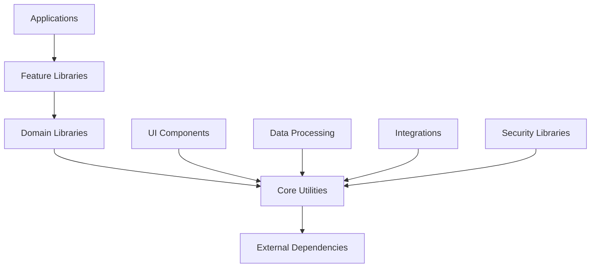

# [SHARED_LIBRARIES_MANIFEST_TITLE]
> **Purpose:** [MANIFEST_PURPOSE_DESCRIPTION] following [BEST_PRACTICES_YEAR] best practices for [MANAGEMENT_SCOPE]. This manifest serves as [MANIFEST_ROLE] for [ECOSYSTEM_SCOPE].

**Document Type:** [DOCUMENT_TYPE]  
**Version:** [VERSION_NUMBER] - [VERSION_DESCRIPTION]  
**Last Updated:** [LAST_UPDATED_DATE]  
**Template Status:** [TEMPLATE_STATUS]

---

## Document Control
| Field | Value |
|-------|-------|
| **[PROJECT_NAME_FIELD]** | [PROJECT_NAME] |
| **[LIBRARY_ARCHITECT_FIELD]** | [LIBRARY_ARCHITECT_NAME] |
| **[PACKAGE_MANAGER_FIELD]** | [PACKAGE_MANAGER_NAME] |
| **[LAST_UPDATED_FIELD]** | [YYYY-MM-DD] |
| **[NEXT_REVIEW_FIELD]** | [YYYY-MM-DD] |
| **[TOTAL_LIBRARIES_FIELD]** | [LIBRARY_COUNT] |

---

## 📋 Table of Contents
- [🎯 Shared Libraries Overview](#-shared-libraries-overview)
- [🏗️ Library Architecture](#️-library-architecture)
- [📦 Core Utility Libraries](#-core-utility-libraries)
- [🎨 UI Component Libraries](#-ui-component-libraries)
- [🔧 Development Tools & Utilities](#-development-tools--utilities)
- [📊 Data Processing Libraries](#-data-processing-libraries)
- [🔐 Security & Authentication Libraries](#-security--authentication-libraries)
- [🌐 API & Integration Libraries](#-api--integration-libraries)
- [🧪 Testing & Quality Libraries](#-testing--quality-libraries)
- [📚 Documentation & Standards](#-documentation--standards)
- [🔄 Dependency Management](#-dependency-management)
- [🎯 Library Governance](#-library-governance)

---

## 🎯 Shared Libraries Overview

### Library Management Philosophy

[LIBRARY_MANAGEMENT_DESCRIPTION] follows modern monorepo and package management principles for scalable code sharing:

#### 🔍 **Library Discovery & Cataloging**
- **Centralized Registry** with searchable library catalog and metadata
- **Automated Documentation** through code analysis and API extraction
- **Usage Analytics** enabling data-driven library adoption decisions
- **Dependency Visualization** supporting impact analysis and planning

#### 🚀 **Code Reusability & Standardization**
- **Consistent APIs** across similar functionality domains
- **Semantic Versioning** with backward compatibility guarantees
- **Modular Design** through well-defined interfaces and abstractions
- **Cross-Platform Support** ensuring universal library adoption

#### 🛡️ **Library Governance & Quality**
- **Code Review Process** with mandatory peer review for library changes
- **Automated Testing** through comprehensive test suites and CI/CD integration
- **Security Scanning** ensuring vulnerability-free library distributions
- **Performance Monitoring** maintaining optimal library performance standards

### Library Classification System

[LIBRARY_CLASSIFICATION_DESCRIPTION] organizes libraries by domain and functionality:

#### **Core Library Categories**
- **Utility Libraries:** Common functions, data structures, and helper utilities
- **UI Component Libraries:** Reusable interface components and design systems
- **Data Processing Libraries:** Data transformation, validation, and manipulation tools
- **Integration Libraries:** API clients, service connectors, and protocol implementations
- **Development Tools:** Build utilities, testing frameworks, and development aids

---

## 🏗️ Library Architecture

### Monorepo Package Organization

[PACKAGE_STRUCTURE_DESCRIPTION] implements domain-driven library organization:

#### **Package Structure Pattern**
```
[SHARED_LIBS_ROOT]/
├── [CORE_UTILITIES]/
│   ├── [COMMON_UTILS]/           # General utility functions
│   ├── [DATA_STRUCTURES]/        # Custom data structures
│   ├── [VALIDATION_LIB]/         # Input validation utilities
│   └── [LOGGING_LIB]/            # Logging and monitoring
├── [UI_COMPONENTS]/
│   ├── [DESIGN_SYSTEM]/          # Design tokens and themes
│   ├── [BASIC_COMPONENTS]/       # Buttons, inputs, layouts
│   ├── [COMPLEX_COMPONENTS]/     # Tables, forms, modals
│   └── [CHARTS_VISUALIZATION]/   # Data visualization components
├── [DATA_PROCESSING]/
│   ├── [PARSERS]/                # Data parsing utilities
│   ├── [TRANSFORMERS]/           # Data transformation tools
│   ├── [VALIDATORS]/             # Data validation libraries
│   └── [SERIALIZERS]/            # Data serialization utilities
├── [INTEGRATIONS]/
│   ├── [API_CLIENTS]/            # External API clients
│   ├── [DATABASE_ADAPTERS]/      # Database connection utilities
│   ├── [MESSAGE_QUEUES]/         # Message queue integrations
│   └── [THIRD_PARTY_SERVICES]/   # External service connectors
├── [DEVELOPMENT_TOOLS]/
│   ├── [BUILD_UTILITIES]/        # Build and bundling tools
│   ├── [TESTING_FRAMEWORKS]/     # Testing utilities and mocks
│   ├── [CODE_GENERATORS]/        # Code generation tools
│   └── [DEVELOPMENT_SERVERS]/    # Development server utilities
└── [SECURITY_LIBS]/
    ├── [AUTHENTICATION]/         # Auth utilities and middleware
    ├── [AUTHORIZATION]/          # Permission and role management
    ├── [ENCRYPTION]/             # Cryptographic utilities
    └── [SECURITY_VALIDATORS]/    # Security validation tools
```

### Library Dependency Management

#### **Dependency Hierarchy**


#### **Dependency Rules**
- **Core Utilities** have minimal external dependencies
- **Domain Libraries** can depend on Core Utilities only
- **Feature Libraries** can depend on Domain and Core libraries
- **Applications** can depend on any library layer
- **Circular Dependencies** are strictly prohibited

---

## 📦 Core Utility Libraries

### Common Utilities Library
```yaml
library_name: [COMMON_UTILS_LIB_ID]
version: [COMMON_UTILS_VERSION]
category: [CORE_UTILITIES_CATEGORY]
description: "[COMMON_UTILS_DESCRIPTION]"

technical_details:
  language: [PROGRAMMING_LANGUAGE]
  framework: [FRAMEWORK_NAME]
  build_system: [BUILD_TOOL]
  package_manager: [PACKAGE_MANAGER]

api_surface:
  main_exports: [UTILITY_FUNCTIONS_LIST]
  types_included: [TYPE_DEFINITIONS_INCLUDED]
  documentation: "[UTILS_DOCS_URL]"

key_features:
  - [FEATURE_1_NAME]: [FEATURE_1_DESCRIPTION]
  - [FEATURE_2_NAME]: [FEATURE_2_DESCRIPTION]
  - [FEATURE_3_NAME]: [FEATURE_3_DESCRIPTION]

consumers:
  primary: [PRIMARY_CONSUMER_APPS]
  secondary: [SECONDARY_CONSUMER_LIBS]

maintenance:
  owner_team: "[UTILS_OWNER_TEAM]"
  maintainer: "[UTILS_MAINTAINER]"
  support_channel: "[UTILS_SUPPORT_CHANNEL]"

repository:
  location: "[UTILS_REPO_PATH]"
  ci_cd: "[UTILS_CICD_CONFIG]"
  release_process: "[UTILS_RELEASE_PROCESS]"
```

### Data Structures Library
```yaml
library_name: [DATA_STRUCTURES_LIB_ID]
version: [DATA_STRUCTURES_VERSION]
category: [CORE_UTILITIES_CATEGORY]
description: "[DATA_STRUCTURES_DESCRIPTION]"

technical_details:
  language: [PROGRAMMING_LANGUAGE]
  dependencies: [MINIMAL_DEPENDENCIES]
  peer_dependencies: [PEER_DEPENDENCIES_LIST]

key_structures:
  - [STRUCTURE_1_NAME]: [STRUCTURE_1_DESCRIPTION]
  - [STRUCTURE_2_NAME]: [STRUCTURE_2_DESCRIPTION]
  - [STRUCTURE_3_NAME]: [STRUCTURE_3_DESCRIPTION]

performance_characteristics:
  time_complexity: [TIME_COMPLEXITY_ANALYSIS]
  space_complexity: [SPACE_COMPLEXITY_ANALYSIS]
  benchmarks: "[PERFORMANCE_BENCHMARKS_URL]"

consumers:
  applications: [DATA_STRUCT_APP_CONSUMERS]
  libraries: [DATA_STRUCT_LIB_CONSUMERS]

maintenance:
  owner_team: "[DATA_STRUCT_OWNER_TEAM]"
  release_cadence: "[DATA_STRUCT_RELEASE_CADENCE]"
  performance_monitoring: "[PERF_MONITORING_ENABLED]"
```

---

## 🎨 UI Component Libraries

### Design System Library
```yaml
library_name: [DESIGN_SYSTEM_LIB_ID]
version: [DESIGN_SYSTEM_VERSION]
category: [UI_COMPONENTS_CATEGORY]
description: "[DESIGN_SYSTEM_DESCRIPTION]"

design_tokens:
  colors: [COLOR_PALETTE_DEFINITION]
  typography: [TYPOGRAPHY_SCALE]
  spacing: [SPACING_SYSTEM]
  breakpoints: [RESPONSIVE_BREAKPOINTS]

component_coverage:
  basic_components: [BASIC_COMPONENT_COUNT]
  complex_components: [COMPLEX_COMPONENT_COUNT]
  layout_components: [LAYOUT_COMPONENT_COUNT]

accessibility:
  wcag_compliance: [WCAG_LEVEL]
  screen_reader_support: [SCREEN_READER_COMPATIBLE]
  keyboard_navigation: [KEYBOARD_NAV_SUPPORT]

theming:
  theme_variants: [AVAILABLE_THEMES]
  custom_theming: [CUSTOM_THEME_SUPPORT]
  dark_mode: [DARK_MODE_AVAILABLE]

maintenance:
  design_team: "[DESIGN_TEAM_NAME]"
  frontend_team: "[FRONTEND_TEAM_NAME]"
  style_guide: "[STYLE_GUIDE_URL]"
```

### Component Library
```yaml
library_name: [COMPONENT_LIB_ID]
version: [COMPONENT_LIB_VERSION]
category: [UI_COMPONENTS_CATEGORY]
description: "[COMPONENT_LIB_DESCRIPTION]"

component_categories:
  form_controls:
    - [FORM_COMPONENT_1]
    - [FORM_COMPONENT_2]
    - [FORM_COMPONENT_3]
  navigation:
    - [NAV_COMPONENT_1]
    - [NAV_COMPONENT_2]
  data_display:
    - [DATA_COMPONENT_1]
    - [DATA_COMPONENT_2]
  feedback:
    - [FEEDBACK_COMPONENT_1]
    - [FEEDBACK_COMPONENT_2]

framework_support:
  - [FRAMEWORK_1]: [FRAMEWORK_1_VERSION]
  - [FRAMEWORK_2]: [FRAMEWORK_2_VERSION]
  - [FRAMEWORK_3]: [FRAMEWORK_3_VERSION]

testing:
  unit_tests: [UNIT_TEST_COVERAGE]
  visual_regression: [VISUAL_TEST_ENABLED]
  accessibility_tests: [A11Y_TEST_COVERAGE]

documentation:
  storybook: "[STORYBOOK_URL]"
  api_docs: "[API_DOCS_URL]"
  examples: "[EXAMPLES_REPO_URL]"
```

---

## 🔧 Development Tools & Utilities

### Build Utilities Library
```yaml
library_name: [BUILD_UTILS_LIB_ID]
version: [BUILD_UTILS_VERSION]
category: [DEVELOPMENT_TOOLS_CATEGORY]
description: "[BUILD_UTILS_DESCRIPTION]"

build_tools:
  bundlers:
    - [BUNDLER_1]: [BUNDLER_1_CONFIG]
    - [BUNDLER_2]: [BUNDLER_2_CONFIG]
  transpilers:
    - [TRANSPILER_1]: [TRANSPILER_1_CONFIG]
    - [TRANSPILER_2]: [TRANSPILER_2_CONFIG]
  optimizers:
    - [OPTIMIZER_1]: [OPTIMIZER_1_PURPOSE]
    - [OPTIMIZER_2]: [OPTIMIZER_2_PURPOSE]

configuration_templates:
  - [CONFIG_TEMPLATE_1]: [TEMPLATE_1_DESCRIPTION]
  - [CONFIG_TEMPLATE_2]: [TEMPLATE_2_DESCRIPTION]
  - [CONFIG_TEMPLATE_3]: [TEMPLATE_3_DESCRIPTION]

supported_environments:
  development: [DEV_ENV_FEATURES]
  staging: [STAGING_ENV_FEATURES]
  production: [PROD_ENV_FEATURES]

maintenance:
  devops_team: "[DEVOPS_TEAM_NAME]"
  build_engineer: "[BUILD_ENGINEER_NAME]"
  automation_level: "[AUTOMATION_PERCENTAGE]"
```

### Testing Framework Library
```yaml
library_name: [TESTING_FRAMEWORK_LIB_ID]
version: [TESTING_FRAMEWORK_VERSION]
category: [DEVELOPMENT_TOOLS_CATEGORY]
description: "[TESTING_FRAMEWORK_DESCRIPTION]"

testing_capabilities:
  unit_testing:
    framework: [UNIT_TEST_FRAMEWORK]
    mocking: [MOCKING_LIBRARY]
    assertions: [ASSERTION_LIBRARY]
  integration_testing:
    framework: [INTEGRATION_TEST_FRAMEWORK]
    database_testing: [DB_TEST_UTILITIES]
    api_testing: [API_TEST_UTILITIES]
  e2e_testing:
    framework: [E2E_TEST_FRAMEWORK]
    browser_automation: [BROWSER_AUTOMATION_TOOL]
    mobile_testing: [MOBILE_TEST_SUPPORT]

test_utilities:
  data_factories: [TEST_DATA_FACTORIES]
  fixtures: [TEST_FIXTURES_AVAILABLE]
  helpers: [TEST_HELPER_FUNCTIONS]

reporting:
  coverage_reports: [COVERAGE_REPORTING_TOOL]
  test_reports: [TEST_REPORTING_FORMAT]
  ci_integration: [CI_INTEGRATION_SUPPORT]
```

---

## 📊 Data Processing Libraries

### Data Validation Library
```yaml
library_name: [DATA_VALIDATION_LIB_ID]
version: [DATA_VALIDATION_VERSION]
category: [DATA_PROCESSING_CATEGORY]
description: "[DATA_VALIDATION_DESCRIPTION]"

validation_types:
  schema_validation:
    - [SCHEMA_TYPE_1]: [SCHEMA_1_FEATURES]
    - [SCHEMA_TYPE_2]: [SCHEMA_2_FEATURES]
  data_type_validation:
    - [DATA_TYPE_1]: [TYPE_1_VALIDATORS]
    - [DATA_TYPE_2]: [TYPE_2_VALIDATORS]
  business_rule_validation:
    - [RULE_TYPE_1]: [RULE_1_IMPLEMENTATION]
    - [RULE_TYPE_2]: [RULE_2_IMPLEMENTATION]

performance:
  validation_speed: [VALIDATION_PERFORMANCE_METRICS]
  memory_usage: [MEMORY_USAGE_PROFILE]
  scalability: [SCALABILITY_CHARACTERISTICS]

error_handling:
  error_types: [VALIDATION_ERROR_TYPES]
  error_messages: [ERROR_MESSAGE_LOCALIZATION]
  error_reporting: [ERROR_REPORTING_FORMAT]

integration:
  form_libraries: [FORM_LIBRARY_INTEGRATIONS]
  api_frameworks: [API_FRAMEWORK_INTEGRATIONS]
  database_orms: [ORM_INTEGRATIONS]
```

### Data Transformation Library
```yaml
library_name: [DATA_TRANSFORM_LIB_ID]
version: [DATA_TRANSFORM_VERSION]
category: [DATA_PROCESSING_CATEGORY]
description: "[DATA_TRANSFORM_DESCRIPTION]"

transformation_capabilities:
  data_mapping:
    - [MAPPING_TYPE_1]: [MAPPING_1_FEATURES]
    - [MAPPING_TYPE_2]: [MAPPING_2_FEATURES]
  data_filtering:
    - [FILTER_TYPE_1]: [FILTER_1_CAPABILITIES]
    - [FILTER_TYPE_2]: [FILTER_2_CAPABILITIES]
  data_aggregation:
    - [AGGREGATION_TYPE_1]: [AGG_1_FUNCTIONS]
    - [AGGREGATION_TYPE_2]: [AGG_2_FUNCTIONS]

supported_formats:
  input_formats: [INPUT_DATA_FORMATS]
  output_formats: [OUTPUT_DATA_FORMATS]
  streaming_support: [STREAMING_DATA_SUPPORT]

performance_optimization:
  batch_processing: [BATCH_PROCESSING_SUPPORT]
  parallel_processing: [PARALLEL_PROCESSING_ENABLED]
  memory_efficiency: [MEMORY_OPTIMIZATION_FEATURES]
```

---

## 🔐 Security & Authentication Libraries

### Authentication Library
```yaml
library_name: [AUTH_LIB_ID]
version: [AUTH_LIB_VERSION]
category: [SECURITY_CATEGORY]
description: "[AUTH_LIB_DESCRIPTION]"

authentication_methods:
  - [AUTH_METHOD_1]: [METHOD_1_IMPLEMENTATION]
  - [AUTH_METHOD_2]: [METHOD_2_IMPLEMENTATION]
  - [AUTH_METHOD_3]: [METHOD_3_IMPLEMENTATION]

security_features:
  token_management: [TOKEN_MANAGEMENT_FEATURES]
  session_handling: [SESSION_HANDLING_APPROACH]
  password_security: [PASSWORD_SECURITY_MEASURES]
  multi_factor_auth: [MFA_SUPPORT_LEVEL]

compliance:
  standards: [SECURITY_STANDARDS_COMPLIANCE]
  certifications: [SECURITY_CERTIFICATIONS]
  audit_logging: [AUDIT_LOGGING_CAPABILITIES]

integration_points:
  identity_providers: [SUPPORTED_IDENTITY_PROVIDERS]
  frameworks: [FRAMEWORK_INTEGRATIONS]
  protocols: [SUPPORTED_AUTH_PROTOCOLS]
```

### Authorization Library
```yaml
library_name: [AUTHZ_LIB_ID]
version: [AUTHZ_LIB_VERSION]
category: [SECURITY_CATEGORY]
description: "[AUTHZ_LIB_DESCRIPTION]"

authorization_models:
  - [AUTHZ_MODEL_1]: [MODEL_1_DESCRIPTION]
  - [AUTHZ_MODEL_2]: [MODEL_2_DESCRIPTION]
  - [AUTHZ_MODEL_3]: [MODEL_3_DESCRIPTION]

permission_management:
  role_based: [RBAC_IMPLEMENTATION]
  attribute_based: [ABAC_IMPLEMENTATION]
  policy_based: [POLICY_ENGINE_FEATURES]

security_controls:
  access_control: [ACCESS_CONTROL_MECHANISMS]
  resource_protection: [RESOURCE_PROTECTION_FEATURES]
  privilege_escalation: [PRIVILEGE_ESCALATION_PREVENTION]
```

---

## 🌐 API & Integration Libraries

### API Client Library
```yaml
library_name: [API_CLIENT_LIB_ID]
version: [API_CLIENT_VERSION]
category: [INTEGRATION_CATEGORY]
description: "[API_CLIENT_DESCRIPTION]"

supported_protocols:
  - [PROTOCOL_1]: [PROTOCOL_1_FEATURES]
  - [PROTOCOL_2]: [PROTOCOL_2_FEATURES]
  - [PROTOCOL_3]: [PROTOCOL_3_FEATURES]

client_features:
  request_handling: [REQUEST_HANDLING_CAPABILITIES]
  response_processing: [RESPONSE_PROCESSING_FEATURES]
  error_handling: [ERROR_HANDLING_STRATEGIES]
  retry_logic: [RETRY_MECHANISM_CONFIG]

performance:
  connection_pooling: [CONNECTION_POOLING_ENABLED]
  caching: [CACHING_STRATEGIES]
  rate_limiting: [RATE_LIMITING_SUPPORT]

monitoring:
  metrics_collection: [METRICS_COLLECTED]
  logging: [LOGGING_CONFIGURATION]
  tracing: [DISTRIBUTED_TRACING_SUPPORT]
```

---

## 🧪 Testing & Quality Libraries

### Test Utilities Library
```yaml
library_name: [TEST_UTILS_LIB_ID]
version: [TEST_UTILS_VERSION]
category: [TESTING_CATEGORY]
description: "[TEST_UTILS_DESCRIPTION]"

utility_categories:
  test_data_generation:
    - [DATA_GEN_UTIL_1]: [UTIL_1_PURPOSE]
    - [DATA_GEN_UTIL_2]: [UTIL_2_PURPOSE]
  mocking_utilities:
    - [MOCK_UTIL_1]: [MOCK_1_CAPABILITIES]
    - [MOCK_UTIL_2]: [MOCK_2_CAPABILITIES]
  assertion_helpers:
    - [ASSERTION_HELPER_1]: [HELPER_1_FUNCTIONS]
    - [ASSERTION_HELPER_2]: [HELPER_2_FUNCTIONS]

test_environment_support:
  database_testing: [DB_TEST_UTILITIES]
  api_testing: [API_TEST_HELPERS]
  ui_testing: [UI_TEST_UTILITIES]

integration_support:
  ci_cd_integration: [CI_CD_INTEGRATION_FEATURES]
  reporting_tools: [REPORTING_TOOL_INTEGRATIONS]
  coverage_tools: [COVERAGE_TOOL_SUPPORT]
```

---

## 📚 Documentation & Standards

### Library Documentation Standards

[DOCUMENTATION_STANDARDS_DESCRIPTION] ensures consistent library documentation:

#### **Required Documentation**
- **README.md** with installation, usage, and examples
- **API Documentation** with complete function/class references
- **Changelog** following semantic versioning principles
- **Contributing Guidelines** for external contributors

#### **Documentation Structure**
```
[LIBRARY_ROOT]/
├── README.md                     # Primary library documentation
├── CHANGELOG.md                  # Version history and changes
├── CONTRIBUTING.md               # Contribution guidelines
├── docs/
│   ├── [API_REFERENCE]/          # Detailed API documentation
│   ├── [EXAMPLES]/               # Usage examples and tutorials
│   ├── [GUIDES]/                 # How-to guides and best practices
│   └── [ARCHITECTURE]/           # Library architecture documentation
└── examples/
    ├── [BASIC_EXAMPLES]/         # Simple usage examples
    ├── [ADVANCED_EXAMPLES]/      # Complex implementation examples
    └── [INTEGRATION_EXAMPLES]/   # Integration with other libraries
```

#### **Documentation Quality Standards**
- **Code Examples** must be tested and working
- **API Coverage** requires 100% public API documentation
- **Version Compatibility** documented for all breaking changes
- **Performance Notes** included for performance-critical libraries

---

## 🔄 Dependency Management

### Dependency Strategy

[DEPENDENCY_MANAGEMENT_DESCRIPTION] implements strict dependency governance:

#### **Dependency Categories**
- **Production Dependencies** - Required for library functionality
- **Development Dependencies** - Required for development and testing
- **Peer Dependencies** - Expected to be provided by consuming applications
- **Optional Dependencies** - Enhance functionality when available

#### **Version Management**
```yaml
dependency_rules:
  version_pinning:
    major_versions: [MAJOR_VERSION_STRATEGY]
    minor_versions: [MINOR_VERSION_STRATEGY]
    patch_versions: [PATCH_VERSION_STRATEGY]
  
  update_policy:
    security_updates: [SECURITY_UPDATE_POLICY]
    feature_updates: [FEATURE_UPDATE_POLICY]
    breaking_changes: [BREAKING_CHANGE_POLICY]
  
  compatibility_matrix:
    node_versions: [SUPPORTED_NODE_VERSIONS]
    browser_support: [SUPPORTED_BROWSERS]
    framework_versions: [SUPPORTED_FRAMEWORK_VERSIONS]
```

#### **Dependency Monitoring**
- **Security Scanning** for known vulnerabilities
- **License Compliance** checking for compatible licenses
- **Update Notifications** for available dependency updates
- **Impact Analysis** for dependency changes

---

## 🎯 Library Governance

### Governance Framework

[LIBRARY_GOVERNANCE_DESCRIPTION] establishes clear ownership and processes:

#### **Ownership Model**
```yaml
governance_structure:
  library_council:
    chair: "[LIBRARY_COUNCIL_CHAIR]"
    members: [COUNCIL_MEMBER_LIST]
    responsibilities: [COUNCIL_RESPONSIBILITIES]
  
  library_owners:
    core_utilities: "[CORE_UTILS_OWNER_TEAM]"
    ui_components: "[UI_COMPONENTS_OWNER_TEAM]"
    data_processing: "[DATA_PROCESSING_OWNER_TEAM]"
    integrations: "[INTEGRATIONS_OWNER_TEAM]"
    security: "[SECURITY_LIBS_OWNER_TEAM]"
```

#### **Development Process**
1. **RFC Process** for major library changes
2. **Code Review** mandatory for all changes
3. **Testing Requirements** comprehensive test coverage
4. **Documentation Updates** synchronized with code changes
5. **Release Approval** by library owners

#### **Quality Gates**
- **Automated Testing** with minimum coverage thresholds
- **Security Scanning** for vulnerabilities and compliance
- **Performance Benchmarks** to prevent performance regressions
- **API Compatibility** checks for breaking changes

### Library Lifecycle Management

#### **Library States**
- **Experimental** - Early development, unstable API
- **Beta** - Feature complete, API stabilizing
- **Stable** - Production ready, stable API
- **Deprecated** - Superseded, maintenance only
- **Archived** - No longer maintained

#### **Deprecation Process**
1. **Deprecation Notice** with migration timeline
2. **Migration Guide** with step-by-step instructions
3. **Support Period** for existing consumers
4. **Final Removal** after adequate transition time

---

## 📋 Library Registry

### Active Libraries Summary

| Library Name | Version | Category | Status | Owner Team |
|---|---|---|---|---|
| **[LIB_1_NAME]** | [LIB_1_VERSION] | [LIB_1_CATEGORY] | [LIB_1_STATUS] | [LIB_1_OWNER] |
| **[LIB_2_NAME]** | [LIB_2_VERSION] | [LIB_2_CATEGORY] | [LIB_2_STATUS] | [LIB_2_OWNER] |
| **[LIB_3_NAME]** | [LIB_3_VERSION] | [LIB_3_CATEGORY] | [LIB_3_STATUS] | [LIB_3_OWNER] |
| **[LIB_4_NAME]** | [LIB_4_VERSION] | [LIB_4_CATEGORY] | [LIB_4_STATUS] | [LIB_4_OWNER] |
| **[LIB_5_NAME]** | [LIB_5_VERSION] | [LIB_5_CATEGORY] | [LIB_5_STATUS] | [LIB_5_OWNER] |

### Usage Analytics

#### **Library Adoption Metrics**
- **Total Libraries**: [TOTAL_LIBRARY_COUNT]
- **Active Libraries**: [ACTIVE_LIBRARY_COUNT]
- **Deprecated Libraries**: [DEPRECATED_LIBRARY_COUNT]
- **Average Library Age**: [AVERAGE_LIBRARY_AGE]

#### **Consumption Patterns**
- **Most Used Libraries**: [TOP_USED_LIBRARIES]
- **Fastest Growing**: [FASTEST_GROWING_LIBRARIES]
- **Critical Dependencies**: [CRITICAL_DEPENDENCY_LIBRARIES]

---

## 🔧 Quick Reference

### Essential Commands

```bash
# [LIBRARY_MANAGEMENT_COMMANDS]
[LIB_INSTALL_COMMAND]            # [INSTALL_COMMAND_DESCRIPTION]
[LIB_UPDATE_COMMAND]             # [UPDATE_COMMAND_DESCRIPTION]
[LIB_AUDIT_COMMAND]              # [AUDIT_COMMAND_DESCRIPTION]

# [DEVELOPMENT_COMMANDS]
[LIB_BUILD_COMMAND]              # [BUILD_COMMAND_DESCRIPTION]
[LIB_TEST_COMMAND]               # [TEST_COMMAND_DESCRIPTION]
[LIB_PUBLISH_COMMAND]            # [PUBLISH_COMMAND_DESCRIPTION]

# [MAINTENANCE_COMMANDS]
[LIB_LINT_COMMAND]               # [LINT_COMMAND_DESCRIPTION]
[LIB_DOCS_COMMAND]               # [DOCS_COMMAND_DESCRIPTION]
[LIB_SECURITY_COMMAND]           # [SECURITY_COMMAND_DESCRIPTION]
```

### Library Discovery

| Resource | URL | Purpose |
|---|---|---|
| **Library Catalog** | [LIBRARY_CATALOG_URL] | [CATALOG_PURPOSE] |
| **API Documentation** | [API_DOCS_URL] | [API_DOCS_PURPOSE] |
| **Usage Examples** | [EXAMPLES_URL] | [EXAMPLES_PURPOSE] |
| **Support Channel** | [SUPPORT_CHANNEL_URL] | [SUPPORT_PURPOSE] |

---

**Document Status:** [DOCUMENT_STATUS] | **Last Updated:** [LAST_UPDATED] | **Next Review:** [NEXT_REVIEW_DATE]
