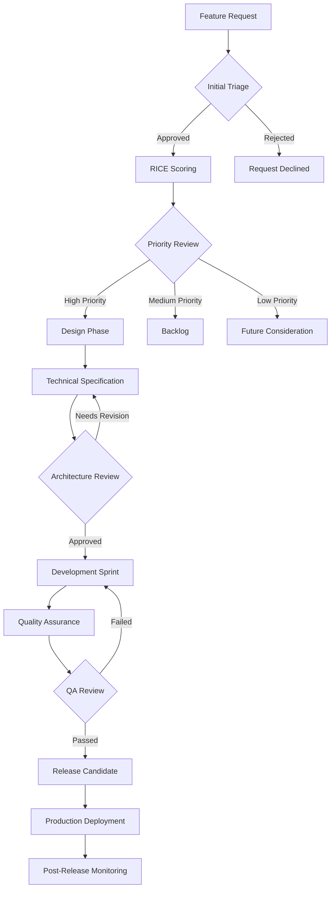

# Comprehensive Feature Management Index

> **Purpose:** Strategic feature tracking and management system following 2025 product management best practices for feature lifecycle, prioritization, and delivery optimization.
> **Playbook Reference:** `[FEATURE_PLAYBOOK_PATH]`

**Document Type:** Feature Management Index  
**Version:** 2.0 - Enhanced with 2025 Best Practices  
**Last Updated:** 2025-01-15  
**Template Status:** Production Ready

---

## Document Control
| Field | Value |
|-------|---------|
| **Product Name** | [PRODUCT_NAME] |
| **Feature Manager** | [FEATURE_MANAGER_NAME] |
| **Product Owner** | [PRODUCT_OWNER_NAME] |
| **Last Updated** | [YYYY-MM-DD] |
| **Next Review** | [YYYY-MM-DD] |
| **Total Features** | [TOTAL_FEATURE_COUNT] |

---

## 📋 Table of Contents
- [🎯 Feature Strategy & Vision](#-feature-strategy--vision)
- [📊 Feature Portfolio Overview](#-feature-portfolio-overview)
- [🔄 Feature Lifecycle Management](#-feature-lifecycle-management)
- [📈 Feature Metrics & Analytics](#-feature-metrics--analytics)
- [⚖️ Feature Prioritization Framework](#️-feature-prioritization-framework)
- [🏗️ Feature Governance & Process](#️-feature-governance--process)
- [🚀 Feature Delivery Pipeline](#-feature-delivery-pipeline)
- [📞 Stakeholder Communication](#-stakeholder-communication)

---

## 🎯 Feature Strategy & Vision

### Strategic Alignment Framework

#### **Product Vision Integration**
- **Vision Statement:** [PRODUCT_VISION_STATEMENT]
- **Strategic Pillars:** [STRATEGIC_PILLAR_1], [STRATEGIC_PILLAR_2], [STRATEGIC_PILLAR_3]
- **Feature Alignment Score:** [ALIGNMENT_SCORE_TARGET]
- **Success Criteria:** [VISION_SUCCESS_CRITERIA]

#### **Feature Strategy Themes**

##### **[THEME_1_NAME] - [THEME_1_FOCUS]**
- **Objective:** [THEME_1_OBJECTIVE]
- **Key Features:** [THEME_1_KEY_FEATURES]
- **Success Metrics:** [THEME_1_METRICS]
- **Timeline:** [THEME_1_TIMELINE]

##### **[THEME_2_NAME] - [THEME_2_FOCUS]**
- **Objective:** [THEME_2_OBJECTIVE]
- **Key Features:** [THEME_2_KEY_FEATURES]
- **Success Metrics:** [THEME_2_METRICS]
- **Timeline:** [THEME_2_TIMELINE]

##### **[THEME_3_NAME] - [THEME_3_FOCUS]**
- **Objective:** [THEME_3_OBJECTIVE]
- **Key Features:** [THEME_3_KEY_FEATURES]
- **Success Metrics:** [THEME_3_METRICS]
- **Timeline:** [THEME_3_TIMELINE]

---

## 📊 Feature Portfolio Overview

### Feature Status Dashboard (2025 Framework)

#### **Current Portfolio Metrics**
- **Total Features:** [TOTAL_FEATURES_COUNT]
- **Active Development:** [ACTIVE_DEV_COUNT]
- **In Testing:** [TESTING_COUNT]
- **Released:** [RELEASED_COUNT]
- **Backlog:** [BACKLOG_COUNT]

#### **Feature Categories by Business Value**

##### **🚀 Core Features - [CORE_CATEGORY_DESCRIPTION]**
- **[CORE_FEATURE_1]:** [CORE_FEATURE_1_DESCRIPTION] - Status: [CORE_STATUS_1]
- **[CORE_FEATURE_2]:** [CORE_FEATURE_2_DESCRIPTION] - Status: [CORE_STATUS_2]
- **[CORE_FEATURE_3]:** [CORE_FEATURE_3_DESCRIPTION] - Status: [CORE_STATUS_3]
- **[CORE_FEATURE_4]:** [CORE_FEATURE_4_DESCRIPTION] - Status: [CORE_STATUS_4]

##### **⭐ Enhancement Features - [ENHANCEMENT_CATEGORY_DESCRIPTION]**
- **[ENHANCEMENT_FEATURE_1]:** [ENHANCEMENT_FEATURE_1_DESCRIPTION] - Status: [ENHANCEMENT_STATUS_1]
- **[ENHANCEMENT_FEATURE_2]:** [ENHANCEMENT_FEATURE_2_DESCRIPTION] - Status: [ENHANCEMENT_STATUS_2]
- **[ENHANCEMENT_FEATURE_3]:** [ENHANCEMENT_FEATURE_3_DESCRIPTION] - Status: [ENHANCEMENT_STATUS_3]
- **[ENHANCEMENT_FEATURE_4]:** [ENHANCEMENT_FEATURE_4_DESCRIPTION] - Status: [ENHANCEMENT_STATUS_4]

##### **🔧 Technical Features - [TECHNICAL_CATEGORY_DESCRIPTION]**
- **[TECHNICAL_FEATURE_1]:** [TECHNICAL_FEATURE_1_DESCRIPTION] - Status: [TECHNICAL_STATUS_1]
- **[TECHNICAL_FEATURE_2]:** [TECHNICAL_FEATURE_2_DESCRIPTION] - Status: [TECHNICAL_STATUS_2]
- **[TECHNICAL_FEATURE_3]:** [TECHNICAL_FEATURE_3_DESCRIPTION] - Status: [TECHNICAL_STATUS_3]
- **[TECHNICAL_FEATURE_4]:** [TECHNICAL_FEATURE_4_DESCRIPTION] - Status: [TECHNICAL_STATUS_4]

##### **🎨 UX/UI Features - [UX_CATEGORY_DESCRIPTION]**
- **[UX_FEATURE_1]:** [UX_FEATURE_1_DESCRIPTION] - Status: [UX_STATUS_1]
- **[UX_FEATURE_2]:** [UX_FEATURE_2_DESCRIPTION] - Status: [UX_STATUS_2]
- **[UX_FEATURE_3]:** [UX_FEATURE_3_DESCRIPTION] - Status: [UX_STATUS_3]
- **[UX_FEATURE_4]:** [UX_FEATURE_4_DESCRIPTION] - Status: [UX_STATUS_4]

---

## 📋 Comprehensive Feature Matrix

### Master Feature Tracking Table

| Feature ID | Feature Title | Status | Priority | Owner | RICE Score | Spec Link |
|:-----------|:--------------|:-------|:---------|:------|:-----------|:----------|
| `[FEATURE_ID_1]` | `[FEATURE_TITLE_1]` | `[FEATURE_STATUS_1]` | `[FEATURE_PRIORITY_1]` | `[FEATURE_OWNER_1]` | `[RICE_SCORE_1]` | `[SPEC_LINK_1]` |
| `[FEATURE_ID_2]` | `[FEATURE_TITLE_2]` | `[FEATURE_STATUS_2]` | `[FEATURE_PRIORITY_2]` | `[FEATURE_OWNER_2]` | `[RICE_SCORE_2]` | `[SPEC_LINK_2]` |
| `[FEATURE_ID_3]` | `[FEATURE_TITLE_3]` | `[FEATURE_STATUS_3]` | `[FEATURE_PRIORITY_3]` | `[FEATURE_OWNER_3]` | `[RICE_SCORE_3]` | `[SPEC_LINK_3]` |
| `[FEATURE_ID_4]` | `[FEATURE_TITLE_4]` | `[FEATURE_STATUS_4]` | `[FEATURE_PRIORITY_4]` | `[FEATURE_OWNER_4]` | `[RICE_SCORE_4]` | `[SPEC_LINK_4]` |
| `[FEATURE_ID_5]` | `[FEATURE_TITLE_5]` | `[FEATURE_STATUS_5]` | `[FEATURE_PRIORITY_5]` | `[FEATURE_OWNER_5]` | `[RICE_SCORE_5]` | `[SPEC_LINK_5]` |
| `[FEATURE_ID_6]` | `[FEATURE_TITLE_6]` | `[FEATURE_STATUS_6]` | `[FEATURE_PRIORITY_6]` | `[FEATURE_OWNER_6]` | `[RICE_SCORE_6]` | `[SPEC_LINK_6]` |
| `[FEATURE_ID_7]` | `[FEATURE_TITLE_7]` | `[FEATURE_STATUS_7]` | `[FEATURE_PRIORITY_7]` | `[FEATURE_OWNER_7]` | `[RICE_SCORE_7]` | `[SPEC_LINK_7]` |
| `[FEATURE_ID_8]` | `[FEATURE_TITLE_8]` | `[FEATURE_STATUS_8]` | `[FEATURE_PRIORITY_8]` | `[FEATURE_OWNER_8]` | `[RICE_SCORE_8]` | `[SPEC_LINK_8]` |

### Feature Status Legend

| Status | Description | Color Code |
|:-------|:------------|:-----------|
| `[STATUS_CONCEPT]` | [CONCEPT_DESCRIPTION] | 🔵 |
| `[STATUS_DESIGN]` | [DESIGN_DESCRIPTION] | 🟡 |
| `[STATUS_DEVELOPMENT]` | [DEVELOPMENT_DESCRIPTION] | 🟠 |
| `[STATUS_TESTING]` | [TESTING_DESCRIPTION] | 🟣 |
| `[STATUS_RELEASED]` | [RELEASED_DESCRIPTION] | 🟢 |
| `[STATUS_DEPRECATED]` | [DEPRECATED_DESCRIPTION] | ⚫ |

### Priority Classification Framework

| Priority Level | Criteria | Response Time | Resource Allocation |
|:---------------|:---------|:--------------|:-------------------|
| `[PRIORITY_P0]` | [P0_CRITERIA] | [P0_RESPONSE_TIME] | [P0_RESOURCES] |
| `[PRIORITY_P1]` | [P1_CRITERIA] | [P1_RESPONSE_TIME] | [P1_RESOURCES] |
| `[PRIORITY_P2]` | [P2_CRITERIA] | [P2_RESPONSE_TIME] | [P2_RESOURCES] |
| `[PRIORITY_P3]` | [P3_CRITERIA] | [P3_RESPONSE_TIME] | [P3_RESOURCES] |

---

## 🔄 Feature Lifecycle Management

### Feature Development Stages (2025 Framework)

Modern feature lifecycle management following agile and lean product development principles:

#### **Discovery & Ideation**
```yaml
stage: discovery
description: "Feature concept validation and initial research phase"
criteria:
  - [DISCOVERY_CRITERIA_1]
  - [DISCOVERY_CRITERIA_2] 
  - [DISCOVERY_CRITERIA_3]
deliverables:
  - [DISCOVERY_DELIVERABLE_1]
  - [DISCOVERY_DELIVERABLE_2]
duration: [DISCOVERY_DURATION]
next_stage: design
```

#### **Design & Specification**
```yaml
stage: design
description: "Detailed feature design and technical specification"
criteria:
  - [DESIGN_CRITERIA_1]
  - [DESIGN_CRITERIA_2]
  - [DESIGN_CRITERIA_3]
deliverables:
  - [DESIGN_DELIVERABLE_1]
  - [DESIGN_DELIVERABLE_2]
  - [DESIGN_DELIVERABLE_3]
duration: [DESIGN_DURATION]
next_stage: development
```

#### **Development & Implementation**
```yaml
stage: development
description: "Feature coding, unit testing, and integration"
criteria:
  - [DEVELOPMENT_CRITERIA_1]
  - [DEVELOPMENT_CRITERIA_2]
  - [DEVELOPMENT_CRITERIA_3]
deliverables:
  - [DEVELOPMENT_DELIVERABLE_1]
  - [DEVELOPMENT_DELIVERABLE_2]
duration: [DEVELOPMENT_DURATION]
next_stage: testing
```

#### **Testing & Quality Assurance**
```yaml
stage: testing
description: "Comprehensive testing and quality validation"
criteria:
  - [TESTING_CRITERIA_1]
  - [TESTING_CRITERIA_2]
  - [TESTING_CRITERIA_3]
deliverables:
  - [TESTING_DELIVERABLE_1]
  - [TESTING_DELIVERABLE_2]
duration: [TESTING_DURATION]
next_stage: release
```

#### **Release & Deployment**
```yaml
stage: release
description: "Feature deployment and rollout to users"
criteria:
  - [RELEASE_CRITERIA_1]
  - [RELEASE_CRITERIA_2]
  - [RELEASE_CRITERIA_3]
deliverables:
  - [RELEASE_DELIVERABLE_1]
  - [RELEASE_DELIVERABLE_2]
duration: [RELEASE_DURATION]
next_stage: monitoring
```

#### **Monitoring & Optimization**
```yaml
stage: monitoring
description: "Post-release monitoring and performance optimization"
criteria:
  - [MONITORING_CRITERIA_1]
  - [MONITORING_CRITERIA_2]
  - [MONITORING_CRITERIA_3]
deliverables:
  - [MONITORING_DELIVERABLE_1]
  - [MONITORING_DELIVERABLE_2]
duration: [MONITORING_DURATION]
next_stage: complete
```

---

## 📈 Feature Metrics & Analytics

### Performance Tracking Dashboard

Comprehensive metrics framework for feature management optimization:

#### **Portfolio Health Metrics**
```yaml
portfolio_metrics:
  total_features: [TOTAL_FEATURES_COUNT]
  active_features: [ACTIVE_FEATURES_COUNT]
  completed_features: [COMPLETED_FEATURES_COUNT]
  in_progress_features: [IN_PROGRESS_FEATURES_COUNT]
  planned_features: [PLANNED_FEATURES_COUNT]
  completion_rate: "[COMPLETION_PERCENTAGE]%"
  velocity_trend: "[VELOCITY_TREND]"
```

#### **Development Performance Metrics**
```yaml
development_metrics:
  average_development_time: "[AVG_DEV_TIME]"
  feature_velocity: "[FEATURES_PER_SPRINT]"
  cycle_time: "[CYCLE_TIME_DAYS]"
  lead_time: "[LEAD_TIME_DAYS]"
  defect_rate: "[DEFECT_RATE_PERCENTAGE]%"
  rework_rate: "[REWORK_RATE_PERCENTAGE]%"
```

#### **Business Impact Metrics**
```yaml
business_metrics:
  user_adoption_rate: "[ADOPTION_RATE_PERCENTAGE]%"
  feature_usage_rate: "[USAGE_RATE_PERCENTAGE]%"
  customer_satisfaction: "[CSAT_SCORE]/10"
  business_value_delivered: "[BUSINESS_VALUE_SCORE]"
  roi_per_feature: "[ROI_PERCENTAGE]%"
```

#### **Quality Metrics**
```yaml
quality_metrics:
  code_coverage: "[CODE_COVERAGE_PERCENTAGE]%"
  test_pass_rate: "[TEST_PASS_RATE]%"
  security_score: "[SECURITY_SCORE]/10"
  performance_score: "[PERFORMANCE_SCORE]/10"
  accessibility_score: "[ACCESSIBILITY_SCORE]/10"
```

---

## ⚖️ Feature Prioritization Framework

### RICE Scoring Model (2025 Best Practices)

#### **RICE Components**
- **Reach:** [REACH_DEFINITION] - Scale: [REACH_SCALE]
- **Impact:** [IMPACT_DEFINITION] - Scale: [IMPACT_SCALE]  
- **Confidence:** [CONFIDENCE_DEFINITION] - Scale: [CONFIDENCE_SCALE]
- **Effort:** [EFFORT_DEFINITION] - Scale: [EFFORT_SCALE]

#### **Prioritization Matrix**

| Feature Category | Reach Weight | Impact Weight | Confidence Weight | Effort Weight |
|:-----------------|:-------------|:--------------|:------------------|:--------------|
| [CATEGORY_1] | [REACH_WEIGHT_1] | [IMPACT_WEIGHT_1] | [CONFIDENCE_WEIGHT_1] | [EFFORT_WEIGHT_1] |
| [CATEGORY_2] | [REACH_WEIGHT_2] | [IMPACT_WEIGHT_2] | [CONFIDENCE_WEIGHT_2] | [EFFORT_WEIGHT_2] |
| [CATEGORY_3] | [REACH_WEIGHT_3] | [IMPACT_WEIGHT_3] | [CONFIDENCE_WEIGHT_3] | [EFFORT_WEIGHT_3] |

### Value vs. Effort Analysis

#### **Quadrant Classification**
- **Quick Wins:** [QUICK_WINS_CRITERIA]
- **Major Projects:** [MAJOR_PROJECTS_CRITERIA]
- **Fill-ins:** [FILL_INS_CRITERIA]
- **Money Pits:** [MONEY_PITS_CRITERIA]

---

## 🏗️ Feature Governance & Process

### Feature Approval Workflow (2025 Framework)

Modern feature governance following agile and lean principles:

#### **Feature Request Process**


#### **Governance Roles & Responsibilities**
```yaml
governance_structure:
  product_owner:
    name: "[PRODUCT_OWNER_NAME]"
    responsibilities:
      - [PO_RESPONSIBILITY_1]
      - [PO_RESPONSIBILITY_2]
      - [PO_RESPONSIBILITY_3]
    decision_authority: [PO_AUTHORITY_LEVEL]
  
  technical_lead:
    name: "[TECHNICAL_LEAD_NAME]"
    responsibilities:
      - [TECH_LEAD_RESPONSIBILITY_1]
      - [TECH_LEAD_RESPONSIBILITY_2]
      - [TECH_LEAD_RESPONSIBILITY_3]
    decision_authority: [TECH_LEAD_AUTHORITY_LEVEL]
  
  qa_lead:
    name: "[QA_LEAD_NAME]"
    responsibilities:
      - [QA_RESPONSIBILITY_1]
      - [QA_RESPONSIBILITY_2]
      - [QA_RESPONSIBILITY_3]
    decision_authority: [QA_AUTHORITY_LEVEL]
  
  ux_designer:
    name: "[UX_DESIGNER_NAME]"
    responsibilities:
      - [UX_RESPONSIBILITY_1]
      - [UX_RESPONSIBILITY_2]
      - [UX_RESPONSIBILITY_3]
    decision_authority: [UX_AUTHORITY_LEVEL]

  feature_manager:
    name: "[FEATURE_MANAGER_NAME]"
    responsibilities:
      - [FM_RESPONSIBILITY_1]
      - [FM_RESPONSIBILITY_2]
      - [FM_RESPONSIBILITY_3]
    decision_authority: [FM_AUTHORITY_LEVEL]
```

### Decision Framework

#### **Decision Levels**
- **Level 1:** [L1_DECISIONS] - Authority: [L1_AUTHORITY]
- **Level 2:** [L2_DECISIONS] - Authority: [L2_AUTHORITY]
- **Level 3:** [L3_DECISIONS] - Authority: [L3_AUTHORITY]

#### **Escalation Process**
- **Technical Issues:** [TECH_ESCALATION_PROCESS]
- **Business Conflicts:** [BUSINESS_ESCALATION_PROCESS]
- **Resource Constraints:** [RESOURCE_ESCALATION_PROCESS]

---

## 🚀 Feature Delivery Pipeline

### Continuous Integration & Deployment

#### **CI/CD Pipeline Stages**
- **Build Stage:** [BUILD_STAGE_DESCRIPTION]
- **Test Stage:** [TEST_STAGE_DESCRIPTION]
- **Security Scan:** [SECURITY_SCAN_DESCRIPTION]
- **Deploy Stage:** [DEPLOY_STAGE_DESCRIPTION]

#### **Feature Flags & Rollout Strategy**
- **Feature Flag Framework:** [FEATURE_FLAG_FRAMEWORK]
- **Rollout Percentage:** [ROLLOUT_PERCENTAGE_STRATEGY]
- **Canary Deployment:** [CANARY_DEPLOYMENT_PROCESS]
- **Blue-Green Deployment:** [BLUE_GREEN_PROCESS]

---

## 📞 Stakeholder Communication

### Communication Matrix

#### **Feature Team Contacts**

| Role | Contact | Primary Responsibility | Communication Frequency |
|:-----|:--------|:----------------------|:------------------------|
| [ROLE_1] | [CONTACT_1] | [RESPONSIBILITY_1] | [FREQUENCY_1] |
| [ROLE_2] | [CONTACT_2] | [RESPONSIBILITY_2] | [FREQUENCY_2] |
| [ROLE_3] | [CONTACT_3] | [RESPONSIBILITY_3] | [FREQUENCY_3] |
| [ROLE_4] | [CONTACT_4] | [RESPONSIBILITY_4] | [FREQUENCY_4] |
| [ROLE_5] | [CONTACT_5] | [RESPONSIBILITY_5] | [FREQUENCY_5] |

#### **Feature Management Tools**

| Tool | Purpose | Access Link | Owner |
|:-----|:--------|:------------|:------|
| [TOOL_1] | [PURPOSE_1] | [ACCESS_LINK_1] | [TOOL_OWNER_1] |
| [TOOL_2] | [PURPOSE_2] | [ACCESS_LINK_2] | [TOOL_OWNER_2] |
| [TOOL_3] | [PURPOSE_3] | [ACCESS_LINK_3] | [TOOL_OWNER_3] |
| [TOOL_4] | [PURPOSE_4] | [ACCESS_LINK_4] | [TOOL_OWNER_4] |
| [TOOL_5] | [PURPOSE_5] | [ACCESS_LINK_5] | [TOOL_OWNER_5] |

### Communication Templates

#### **Feature Status Update**
```
Subject: [FEATURE_NAME] - Status Update [DATE]

Current Status: [CURRENT_STATUS]
Progress: [PROGRESS_PERCENTAGE]%
Next Milestone: [NEXT_MILESTONE]
Blockers: [CURRENT_BLOCKERS]
ETA: [ESTIMATED_COMPLETION]

Key Metrics:
- [METRIC_1]: [VALUE_1]
- [METRIC_2]: [VALUE_2]
- [METRIC_3]: [VALUE_3]

Next Steps:
1. [NEXT_STEP_1]
2. [NEXT_STEP_2]
3. [NEXT_STEP_3]
```

#### **Feature Release Announcement**
```
Subject: 🚀 [FEATURE_NAME] Released - [RELEASE_VERSION]

We're excited to announce the release of [FEATURE_NAME]!

What's New:
- [NEW_CAPABILITY_1]
- [NEW_CAPABILITY_2]
- [NEW_CAPABILITY_3]

Benefits:
- [BENEFIT_1]
- [BENEFIT_2]
- [BENEFIT_3]

Getting Started:
[GETTING_STARTED_INSTRUCTIONS]

Support:
For questions or issues, contact [SUPPORT_CONTACT]
```

### Documentation & Resources

#### **Feature Documentation Links**

- **[DOC_LINK_1_TITLE]:** [DOC_LINK_1_URL]
- **[DOC_LINK_2_TITLE]:** [DOC_LINK_2_URL]
- **[DOC_LINK_3_TITLE]:** [DOC_LINK_3_URL]
- **[DOC_LINK_4_TITLE]:** [DOC_LINK_4_URL]
- **[DOC_LINK_5_TITLE]:** [DOC_LINK_5_URL]

#### **Training & Support Resources**

- **Feature Training:** [TRAINING_RESOURCE_URL]
- **API Documentation:** [API_DOCS_URL]
- **User Guides:** [USER_GUIDE_URL]
- **Troubleshooting:** [TROUBLESHOOTING_URL]
- **Community Forum:** [COMMUNITY_FORUM_URL]

---

**Document Information:**
- **Template Version:** [TEMPLATE_VERSION] - Enhanced with 2025 Feature Management Best Practices
- **Last Updated:** [LAST_UPDATED_DATE]
- **Next Review:** [NEXT_REVIEW_DATE]
- **Compliance:** Agile Manifesto, RICE Framework, Modern Product Management, Feature Flag Best Practices
- **Research Sources:** Product School Feature Management Guide, Atlassian Feature Development, ClickUp Product Templates, Modern Feature Management Frameworks
