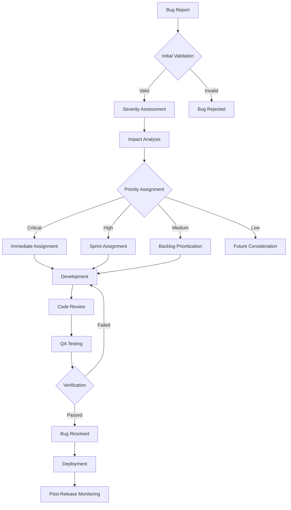

# Comprehensive Bug Tracking & Defect Management Index

> **Purpose:** Centralized bug tracking and defect management system following 2025 software quality best practices for issue identification, prioritization, resolution, and prevention.
> **Playbook Reference:** `[BUG_PLAYBOOK_PATH]`

**Document Type:** Bug Tracking Index  
**Version:** 2.0 - Enhanced with 2025 Best Practices  
**Last Updated:** 2025-01-15  
**Template Status:** Production Ready

---

## Document Control
| Field | Value |
|-------|-------|
| **Product Name** | [PRODUCT_NAME] |
| **QA Manager** | [QA_MANAGER_NAME] |
| **Bug Triage Lead** | [BUG_TRIAGE_LEAD_NAME] |
| **Last Updated** | [YYYY-MM-DD] |
| **Next Review** | [YYYY-MM-DD] |
| **Total Bugs** | [TOTAL_BUG_COUNT] |

---

## 📋 Table of Contents
- [🎯 Bug Management Strategy](#-bug-management-strategy)
- [📊 Bug Portfolio Dashboard](#-bug-portfolio-dashboard)
- [🔄 Bug Lifecycle Management](#-bug-lifecycle-management)
- [📈 Bug Metrics & Analytics](#-bug-metrics--analytics)
- [⚖️ Bug Prioritization Framework](#️-bug-prioritization-framework)
- [🏗️ Bug Triage & Resolution Process](#️-bug-triage--resolution-process)
- [🚀 Quality Assurance Pipeline](#-quality-assurance-pipeline)
- [📞 Bug Communication & Escalation](#-bug-communication--escalation)

---

## 🎯 Bug Management Strategy

### Quality Assurance Framework (2025 Standards)

#### **Quality Objectives**
- **Zero Critical Bugs:** [ZERO_CRITICAL_TARGET]
- **Bug Resolution Time:** [RESOLUTION_TIME_TARGET]
- **Customer Impact Minimization:** [IMPACT_MINIMIZATION_STRATEGY]
- **Defect Prevention:** [PREVENTION_STRATEGY]

#### **Bug Classification Strategy**

##### **🔴 Critical Bugs - [CRITICAL_DEFINITION]**
- **Impact:** [CRITICAL_IMPACT_DESCRIPTION]
- **Response Time:** [CRITICAL_RESPONSE_TIME]
- **Escalation:** [CRITICAL_ESCALATION_PROCESS]
- **Resolution SLA:** [CRITICAL_RESOLUTION_SLA]

##### **🟠 High Priority Bugs - [HIGH_DEFINITION]**
- **Impact:** [HIGH_IMPACT_DESCRIPTION]
- **Response Time:** [HIGH_RESPONSE_TIME]
- **Escalation:** [HIGH_ESCALATION_PROCESS]
- **Resolution SLA:** [HIGH_RESOLUTION_SLA]

##### **🟡 Medium Priority Bugs - [MEDIUM_DEFINITION]**
- **Impact:** [MEDIUM_IMPACT_DESCRIPTION]
- **Response Time:** [MEDIUM_RESPONSE_TIME]
- **Escalation:** [MEDIUM_ESCALATION_PROCESS]
- **Resolution SLA:** [MEDIUM_RESOLUTION_SLA]

##### **🟢 Low Priority Bugs - [LOW_DEFINITION]**
- **Impact:** [LOW_IMPACT_DESCRIPTION]
- **Response Time:** [LOW_RESPONSE_TIME]
- **Escalation:** [LOW_ESCALATION_PROCESS]
- **Resolution SLA:** [LOW_RESOLUTION_SLA]

---

## 📊 Bug Portfolio Dashboard

### Current Bug Status Overview

#### **Bug Count by Status**
- **Open Bugs:** [OPEN_BUG_COUNT]
- **In Progress:** [IN_PROGRESS_COUNT]
- **Under Review:** [UNDER_REVIEW_COUNT]
- **Resolved:** [RESOLVED_COUNT]
- **Closed:** [CLOSED_COUNT]
- **Reopened:** [REOPENED_COUNT]

#### **Bug Count by Severity**
- **Critical:** [CRITICAL_COUNT] 🔴
- **High:** [HIGH_COUNT] 🟠
- **Medium:** [MEDIUM_COUNT] 🟡
- **Low:** [LOW_COUNT] 🟢

### Master Bug Tracking Table

| Bug ID | Title | Severity | Priority | Status | Assignee | Reporter | Created | Last Updated | Resolution Target |
|:-------|:------|:---------|:---------|:-------|:---------|:---------|:--------|:-------------|:------------------|
| `[BUG_ID_1]` | `[BUG_TITLE_1]` | `[SEVERITY_1]` | `[PRIORITY_1]` | `[STATUS_1]` | `[ASSIGNEE_1]` | `[REPORTER_1]` | `[CREATED_1]` | `[UPDATED_1]` | `[TARGET_1]` |
| `[BUG_ID_2]` | `[BUG_TITLE_2]` | `[SEVERITY_2]` | `[PRIORITY_2]` | `[STATUS_2]` | `[ASSIGNEE_2]` | `[REPORTER_2]` | `[CREATED_2]` | `[UPDATED_2]` | `[TARGET_2]` |
| `[BUG_ID_3]` | `[BUG_TITLE_3]` | `[SEVERITY_3]` | `[PRIORITY_3]` | `[STATUS_3]` | `[ASSIGNEE_3]` | `[REPORTER_3]` | `[CREATED_3]` | `[UPDATED_3]` | `[TARGET_3]` |
| `[BUG_ID_4]` | `[BUG_TITLE_4]` | `[SEVERITY_4]` | `[PRIORITY_4]` | `[STATUS_4]` | `[ASSIGNEE_4]` | `[REPORTER_4]` | `[CREATED_4]` | `[UPDATED_4]` | `[TARGET_4]` |
| `[BUG_ID_5]` | `[BUG_TITLE_5]` | `[SEVERITY_5]` | `[PRIORITY_5]` | `[STATUS_5]` | `[ASSIGNEE_5]` | `[REPORTER_5]` | `[CREATED_5]` | `[UPDATED_5]` | `[TARGET_5]` |
| `[BUG_ID_6]` | `[BUG_TITLE_6]` | `[SEVERITY_6]` | `[PRIORITY_6]` | `[STATUS_6]` | `[ASSIGNEE_6]` | `[REPORTER_6]` | `[CREATED_6]` | `[UPDATED_6]` | `[TARGET_6]` |
| `[BUG_ID_7]` | `[BUG_TITLE_7]` | `[SEVERITY_7]` | `[PRIORITY_7]` | `[STATUS_7]` | `[ASSIGNEE_7]` | `[REPORTER_7]` | `[CREATED_7]` | `[UPDATED_7]` | `[TARGET_7]` |
| `[BUG_ID_8]` | `[BUG_TITLE_8]` | `[SEVERITY_8]` | `[PRIORITY_8]` | `[STATUS_8]` | `[ASSIGNEE_8]` | `[REPORTER_8]` | `[CREATED_8]` | `[UPDATED_8]` | `[TARGET_8]` |

### Bug Status Legend

| Status | Description | Color Code |
|:-------|:------------|:-----------|
| `[STATUS_NEW]` | [NEW_DESCRIPTION] | 🔵 |
| `[STATUS_ASSIGNED]` | [ASSIGNED_DESCRIPTION] | 🟡 |
| `[STATUS_IN_PROGRESS]` | [IN_PROGRESS_DESCRIPTION] | 🟠 |
| `[STATUS_TESTING]` | [TESTING_DESCRIPTION] | 🟣 |
| `[STATUS_RESOLVED]` | [RESOLVED_DESCRIPTION] | 🟢 |
| `[STATUS_CLOSED]` | [CLOSED_DESCRIPTION] | ⚫ |
| `[STATUS_REOPENED]` | [REOPENED_DESCRIPTION] | 🔴 |

---

## 🔄 Bug Lifecycle Management

### Bug Workflow Process (2025 Framework)

Modern bug lifecycle following agile and DevOps best practices:

#### **Bug Discovery & Reporting**
```yaml
stage: discovery
description: "Bug identification and initial reporting"
criteria:
  - [DISCOVERY_CRITERIA_1]
  - [DISCOVERY_CRITERIA_2]
  - [DISCOVERY_CRITERIA_3]
deliverables:
  - [DISCOVERY_DELIVERABLE_1]
  - [DISCOVERY_DELIVERABLE_2]
duration: [DISCOVERY_DURATION]
next_stage: triage
```

#### **Bug Triage & Assignment**
```yaml
stage: triage
description: "Bug prioritization and resource assignment"
criteria:
  - [TRIAGE_CRITERIA_1]
  - [TRIAGE_CRITERIA_2]
  - [TRIAGE_CRITERIA_3]
deliverables:
  - [TRIAGE_DELIVERABLE_1]
  - [TRIAGE_DELIVERABLE_2]
duration: [TRIAGE_DURATION]
next_stage: investigation
```

#### **Investigation & Root Cause Analysis**
```yaml
stage: investigation
description: "Detailed bug analysis and root cause identification"
criteria:
  - [INVESTIGATION_CRITERIA_1]
  - [INVESTIGATION_CRITERIA_2]
  - [INVESTIGATION_CRITERIA_3]
deliverables:
  - [INVESTIGATION_DELIVERABLE_1]
  - [INVESTIGATION_DELIVERABLE_2]
duration: [INVESTIGATION_DURATION]
next_stage: resolution
```

#### **Bug Resolution & Fix Implementation**
```yaml
stage: resolution
description: "Bug fix development and implementation"
criteria:
  - [RESOLUTION_CRITERIA_1]
  - [RESOLUTION_CRITERIA_2]
  - [RESOLUTION_CRITERIA_3]
deliverables:
  - [RESOLUTION_DELIVERABLE_1]
  - [RESOLUTION_DELIVERABLE_2]
duration: [RESOLUTION_DURATION]
next_stage: verification
```

#### **Verification & Testing**
```yaml
stage: verification
description: "Bug fix validation and regression testing"
criteria:
  - [VERIFICATION_CRITERIA_1]
  - [VERIFICATION_CRITERIA_2]
  - [VERIFICATION_CRITERIA_3]
deliverables:
  - [VERIFICATION_DELIVERABLE_1]
  - [VERIFICATION_DELIVERABLE_2]
duration: [VERIFICATION_DURATION]
next_stage: closure
```

#### **Bug Closure & Documentation**
```yaml
stage: closure
description: "Bug closure and knowledge documentation"
criteria:
  - [CLOSURE_CRITERIA_1]
  - [CLOSURE_CRITERIA_2]
  - [CLOSURE_CRITERIA_3]
deliverables:
  - [CLOSURE_DELIVERABLE_1]
  - [CLOSURE_DELIVERABLE_2]
duration: [CLOSURE_DURATION]
next_stage: complete
```

---

## 📈 Bug Metrics & Analytics

### Quality Metrics Dashboard

Comprehensive bug tracking metrics for quality improvement:

#### **Bug Discovery Metrics**
```yaml
discovery_metrics:
  bugs_found_per_sprint: [BUGS_PER_SPRINT]
  defect_detection_rate: "[DETECTION_RATE_PERCENTAGE]%"
  escaped_defects: [ESCAPED_DEFECTS_COUNT]
  customer_reported_bugs: [CUSTOMER_BUGS_COUNT]
  internal_bugs_ratio: "[INTERNAL_BUGS_PERCENTAGE]%"
```

#### **Bug Resolution Metrics**
```yaml
resolution_metrics:
  average_resolution_time: "[AVG_RESOLUTION_TIME]"
  first_time_fix_rate: "[FIRST_TIME_FIX_PERCENTAGE]%"
  bug_reopen_rate: "[REOPEN_RATE_PERCENTAGE]%"
  sla_compliance_rate: "[SLA_COMPLIANCE_PERCENTAGE]%"
  resolution_velocity: "[BUGS_RESOLVED_PER_WEEK]"
```

#### **Quality Impact Metrics**
```yaml
quality_metrics:
  defect_density: "[DEFECTS_PER_KLOC]"
  defect_removal_efficiency: "[REMOVAL_EFFICIENCY_PERCENTAGE]%"
  customer_satisfaction_impact: "[CSAT_IMPACT_SCORE]"
  production_incidents: [PRODUCTION_INCIDENTS_COUNT]
  hotfix_deployment_rate: "[HOTFIX_RATE_PERCENTAGE]%"
```

#### **Team Performance Metrics**
```yaml
team_metrics:
  bug_assignment_balance: "[ASSIGNMENT_BALANCE_SCORE]"
  triage_efficiency: "[TRIAGE_TIME_AVG]"
  developer_bug_fix_rate: "[DEV_FIX_RATE]"
  qa_verification_time: "[QA_VERIFICATION_TIME]"
  cross_team_collaboration_score: "[COLLABORATION_SCORE]"
```

---

## ⚖️ Bug Prioritization Framework

### Priority Matrix (2025 Best Practices)

#### **Impact vs. Urgency Matrix**

| Impact Level | Urgency High | Urgency Medium | Urgency Low |
|:-------------|:-------------|:---------------|:------------|
| **High Impact** | [HIGH_HIGH_PRIORITY] | [HIGH_MEDIUM_PRIORITY] | [HIGH_LOW_PRIORITY] |
| **Medium Impact** | [MEDIUM_HIGH_PRIORITY] | [MEDIUM_MEDIUM_PRIORITY] | [MEDIUM_LOW_PRIORITY] |
| **Low Impact** | [LOW_HIGH_PRIORITY] | [LOW_MEDIUM_PRIORITY] | [LOW_LOW_PRIORITY] |

#### **Business Impact Assessment**
- **Revenue Impact:** [REVENUE_IMPACT_CRITERIA]
- **User Experience Impact:** [UX_IMPACT_CRITERIA]
- **Security Impact:** [SECURITY_IMPACT_CRITERIA]
- **Compliance Impact:** [COMPLIANCE_IMPACT_CRITERIA]

#### **Technical Complexity Assessment**
- **Fix Complexity:** [FIX_COMPLEXITY_SCALE]
- **Testing Requirements:** [TESTING_REQUIREMENTS_SCALE]
- **Deployment Risk:** [DEPLOYMENT_RISK_SCALE]
- **Dependencies:** [DEPENDENCY_COMPLEXITY_SCALE]

---

## 🏗️ Bug Triage & Resolution Process

### Triage Workflow (2025 Framework)

Modern bug triage following industry best practices:

#### **Bug Triage Process**


#### **Triage Team Structure**
```yaml
triage_team:
  triage_lead:
    name: "[TRIAGE_LEAD_NAME]"
    responsibilities:
      - [TRIAGE_LEAD_RESP_1]
      - [TRIAGE_LEAD_RESP_2]
      - [TRIAGE_LEAD_RESP_3]
    authority_level: [TRIAGE_LEAD_AUTHORITY]
  
  product_owner:
    name: "[PRODUCT_OWNER_NAME]"
    responsibilities:
      - [PO_TRIAGE_RESP_1]
      - [PO_TRIAGE_RESP_2]
    authority_level: [PO_TRIAGE_AUTHORITY]
  
  technical_lead:
    name: "[TECH_LEAD_NAME]"
    responsibilities:
      - [TECH_LEAD_RESP_1]
      - [TECH_LEAD_RESP_2]
    authority_level: [TECH_LEAD_AUTHORITY]
  
  qa_representative:
    name: "[QA_REP_NAME]"
    responsibilities:
      - [QA_REP_RESP_1]
      - [QA_REP_RESP_2]
    authority_level: [QA_REP_AUTHORITY]
```

### Resolution SLA Framework

#### **Resolution Time Targets**
- **Critical Bugs:** [CRITICAL_SLA_TARGET]
- **High Priority:** [HIGH_SLA_TARGET]
- **Medium Priority:** [MEDIUM_SLA_TARGET]
- **Low Priority:** [LOW_SLA_TARGET]

#### **Escalation Triggers**
- **SLA Breach:** [SLA_BREACH_ESCALATION]
- **Resource Constraints:** [RESOURCE_ESCALATION]
- **Technical Blockers:** [TECHNICAL_ESCALATION]
- **Business Impact:** [BUSINESS_ESCALATION]

---

## 🚀 Quality Assurance Pipeline

### Automated Testing Integration

#### **Bug Prevention Measures**
- **Static Code Analysis:** [STATIC_ANALYSIS_TOOLS]
- **Unit Test Coverage:** [UNIT_TEST_COVERAGE_TARGET]
- **Integration Testing:** [INTEGRATION_TEST_STRATEGY]
- **End-to-End Testing:** [E2E_TEST_FRAMEWORK]

#### **Continuous Quality Monitoring**
- **Code Quality Gates:** [QUALITY_GATES_CRITERIA]
- **Performance Monitoring:** [PERFORMANCE_MONITORING_TOOLS]
- **Security Scanning:** [SECURITY_SCANNING_TOOLS]
- **Accessibility Testing:** [ACCESSIBILITY_TEST_TOOLS]

### Bug Prevention Strategy

#### **Proactive Measures**
- **Code Review Process:** [CODE_REVIEW_PROCESS]
- **Pair Programming:** [PAIR_PROGRAMMING_GUIDELINES]
- **Test-Driven Development:** [TDD_IMPLEMENTATION]
- **Continuous Integration:** [CI_PIPELINE_SETUP]

#### **Quality Training & Education**
- **Developer Training:** [DEVELOPER_TRAINING_PROGRAM]
- **QA Best Practices:** [QA_TRAINING_PROGRAM]
- **Bug Analysis Sessions:** [BUG_ANALYSIS_SESSIONS]
- **Knowledge Sharing:** [KNOWLEDGE_SHARING_PROCESS]

---

## 📞 Bug Communication & Escalation

### Communication Framework

#### **Bug Reporting Templates**

##### **Critical Bug Alert**
```
Subject: 🚨 CRITICAL BUG - [BUG_TITLE] - [BUG_ID]

Severity: Critical
Impact: [IMPACT_DESCRIPTION]
Affected Users: [AFFECTED_USERS_COUNT]
Business Impact: [BUSINESS_IMPACT]

Immediate Actions Required:
1. [IMMEDIATE_ACTION_1]
2. [IMMEDIATE_ACTION_2]
3. [IMMEDIATE_ACTION_3]

Assigned To: [ASSIGNEE_NAME]
ETA for Fix: [ETA_ESTIMATE]
Status Updates: Every [UPDATE_FREQUENCY]

War Room: [WAR_ROOM_LINK]
Incident Commander: [INCIDENT_COMMANDER]
```

##### **Bug Status Update**
```
Subject: Bug Update - [BUG_TITLE] - [BUG_ID]

Current Status: [CURRENT_STATUS]
Progress: [PROGRESS_DESCRIPTION]
Blockers: [CURRENT_BLOCKERS]
Next Steps: [NEXT_STEPS]

Timeline:
- Started: [START_DATE]
- Current ETA: [CURRENT_ETA]
- Last Updated: [LAST_UPDATE_DATE]

Team: [ASSIGNED_TEAM]
Contact: [PRIMARY_CONTACT]
```

#### **Stakeholder Communication Matrix**

| Stakeholder Group | Communication Method | Frequency | Information Level |
|:------------------|:---------------------|:----------|:------------------|
| [STAKEHOLDER_1] | [COMM_METHOD_1] | [FREQUENCY_1] | [INFO_LEVEL_1] |
| [STAKEHOLDER_2] | [COMM_METHOD_2] | [FREQUENCY_2] | [INFO_LEVEL_2] |
| [STAKEHOLDER_3] | [COMM_METHOD_3] | [FREQUENCY_3] | [INFO_LEVEL_3] |
| [STAKEHOLDER_4] | [COMM_METHOD_4] | [FREQUENCY_4] | [INFO_LEVEL_4] |

### Escalation Procedures

#### **Escalation Levels**
- **Level 1:** [L1_ESCALATION_CRITERIA] - Contact: [L1_CONTACT]
- **Level 2:** [L2_ESCALATION_CRITERIA] - Contact: [L2_CONTACT]
- **Level 3:** [L3_ESCALATION_CRITERIA] - Contact: [L3_CONTACT]
- **Executive:** [EXEC_ESCALATION_CRITERIA] - Contact: [EXEC_CONTACT]

#### **Bug Management Tools & Resources**

| Tool | Purpose | Access Link | Owner |
|:-----|:--------|:------------|:------|
| [BUG_TOOL_1] | [TOOL_PURPOSE_1] | [TOOL_LINK_1] | [TOOL_OWNER_1] |
| [BUG_TOOL_2] | [TOOL_PURPOSE_2] | [TOOL_LINK_2] | [TOOL_OWNER_2] |
| [BUG_TOOL_3] | [TOOL_PURPOSE_3] | [TOOL_LINK_3] | [TOOL_OWNER_3] |
| [BUG_TOOL_4] | [TOOL_PURPOSE_4] | [TOOL_LINK_4] | [TOOL_OWNER_4] |

#### **Documentation & Knowledge Base**

- **Bug Reporting Guidelines:** [BUG_REPORTING_GUIDE_URL]
- **Triage Process Documentation:** [TRIAGE_PROCESS_URL]
- **Resolution Playbooks:** [RESOLUTION_PLAYBOOKS_URL]
- **Quality Standards:** [QUALITY_STANDARDS_URL]
- **Training Materials:** [TRAINING_MATERIALS_URL]

---

**Document Information:**
- **Template Version:** [TEMPLATE_VERSION] - Enhanced with 2025 Bug Management Best Practices
- **Last Updated:** [LAST_UPDATED_DATE]
- **Next Review:** [NEXT_REVIEW_DATE]
- **Compliance:** ISTQB Standards, Agile Testing Practices, DevOps Quality Gates, Modern Defect Management
- **Research Sources:** ClickUp Bug Tracking Guide, BrowserStack Testing Best Practices, Monday.com Bug Management, Modern QA Frameworks