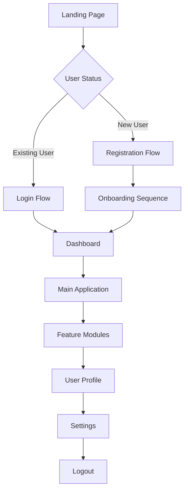

# Frontend Screen Flow & User Journey Mapping

> **Purpose:** Comprehensive frontend screen flow documentation following 2025 UX design best practices for user journey mapping, component architecture, and seamless navigation experiences.
> **Playbook Reference:** `[SCREEN_FLOW_PLAYBOOK_PATH]`

**Document Type:** Frontend Screen Flow & User Journey Map  
**Version:** 2.0 - Enhanced with 2025 UX Best Practices  
**Last Updated:** 2025-01-15  
**Template Status:** Production Ready

---

## Document Control
| Field | Value |
|-------|-------|
| **Product Name** | [PRODUCT_NAME] |
| **UX Designer** | [UX_DESIGNER_NAME] |
| **Frontend Lead** | [FRONTEND_LEAD_NAME] |
| **Last Updated** | [YYYY-MM-DD] |
| **Next Review** | [YYYY-MM-DD] |
| **Total Screens** | [TOTAL_SCREEN_COUNT] |

---

## 📋 Table of Contents
- [🎯 User Journey Strategy](#-user-journey-strategy)
- [🗺️ Screen Flow Architecture](#️-screen-flow-architecture)
- [📱 Screen Inventory & Mapping](#-screen-inventory--mapping)
- [🔄 Navigation Patterns](#-navigation-patterns)
- [📊 User Flow Analytics](#-user-flow-analytics)
- [🎨 Component Architecture](#-component-architecture)
- [🚀 Performance & Optimization](#-performance--optimization)
- [📞 Integration & API Mapping](#-integration--api-mapping)

---

## 🎯 User Journey Strategy

### User Experience Framework (2025 Standards)

#### **Primary User Personas**
- **[PERSONA_1_NAME]:** [PERSONA_1_DESCRIPTION]
- **[PERSONA_2_NAME]:** [PERSONA_2_DESCRIPTION]
- **[PERSONA_3_NAME]:** [PERSONA_3_DESCRIPTION]
- **[PERSONA_4_NAME]:** [PERSONA_4_DESCRIPTION]

#### **Critical User Journeys**

##### **🎯 Primary Journey: [PRIMARY_JOURNEY_NAME]**
```yaml
journey_name: "[PRIMARY_JOURNEY_NAME]"
user_goal: "[PRIMARY_USER_GOAL]"
entry_points:
  - [ENTRY_POINT_1]
  - [ENTRY_POINT_2]
  - [ENTRY_POINT_3]
success_metrics:
  - [SUCCESS_METRIC_1]
  - [SUCCESS_METRIC_2]
  - [SUCCESS_METRIC_3]
conversion_target: "[CONVERSION_TARGET_PERCENTAGE]%"
```

##### **🔄 Secondary Journey: [SECONDARY_JOURNEY_NAME]**
```yaml
journey_name: "[SECONDARY_JOURNEY_NAME]"
user_goal: "[SECONDARY_USER_GOAL]"
entry_points:
  - [ENTRY_POINT_1]
  - [ENTRY_POINT_2]
success_metrics:
  - [SUCCESS_METRIC_1]
  - [SUCCESS_METRIC_2]
conversion_target: "[CONVERSION_TARGET_PERCENTAGE]%"
```

---

## 🗺️ Screen Flow Architecture

### Application Flow Overview

#### **High-Level User Flow**


#### **Navigation Hierarchy**
```yaml
navigation_structure:
  level_1_primary:
    - name: "[NAV_ITEM_1]"
      route: "[ROUTE_1]"
      access_level: "[ACCESS_LEVEL_1]"
    - name: "[NAV_ITEM_2]"
      route: "[ROUTE_2]"
      access_level: "[ACCESS_LEVEL_2]"
  
  level_2_secondary:
    - parent: "[PARENT_NAV_1]"
      children:
        - name: "[CHILD_NAV_1]"
          route: "[CHILD_ROUTE_1]"
        - name: "[CHILD_NAV_2]"
          route: "[CHILD_ROUTE_2]"
```

---

## 📱 Screen Inventory & Mapping

### Master Screen Registry

#### **Authentication Screens**

##### **🔐 Login Screen - [LOGIN_SCREEN_ID]**
```yaml
screen_details:
  name: "[LOGIN_SCREEN_NAME]"
  route: "[LOGIN_ROUTE]"
  component_path: "[LOGIN_COMPONENT_PATH]"
  access_level: "[LOGIN_ACCESS_LEVEL]"
  
components:
  primary: "[LOGIN_PRIMARY_COMPONENT]"
  secondary:
    - "[LOGIN_SECONDARY_1]"
    - "[LOGIN_SECONDARY_2]"
    - "[LOGIN_SECONDARY_3]"
  
api_integrations:
  - endpoint: "[LOGIN_API_ENDPOINT]"
    method: "[LOGIN_API_METHOD]"
    purpose: "[LOGIN_API_PURPOSE]"
  - endpoint: "[PROFILE_API_ENDPOINT]"
    method: "[PROFILE_API_METHOD]"
    purpose: "[PROFILE_API_PURPOSE]"

navigation_flow:
  success_redirect: "[SUCCESS_REDIRECT_ROUTE]"
  failure_action: "[FAILURE_ACTION]"
  error_handling: "[ERROR_COMPONENT_PATH]"
  
ux_considerations:
  loading_states: "[LOADING_STATE_COMPONENT]"
  validation_rules: "[VALIDATION_RULES]"
  accessibility: "[ACCESSIBILITY_FEATURES]"
```

##### **📝 Registration Screen - [REGISTRATION_SCREEN_ID]**
```yaml
screen_details:
  name: "[REGISTRATION_SCREEN_NAME]"
  route: "[REGISTRATION_ROUTE]"
  component_path: "[REGISTRATION_COMPONENT_PATH]"
  access_level: "[REGISTRATION_ACCESS_LEVEL]"
  
components:
  primary: "[REGISTRATION_PRIMARY_COMPONENT]"
  secondary:
    - "[REGISTRATION_SECONDARY_1]"
    - "[REGISTRATION_SECONDARY_2]"
    - "[REGISTRATION_SECONDARY_3]"
  
api_integrations:
  - endpoint: "[REGISTRATION_API_ENDPOINT]"
    method: "[REGISTRATION_API_METHOD]"
    purpose: "[REGISTRATION_API_PURPOSE]"

navigation_flow:
  success_redirect: "[SUCCESS_REDIRECT_ROUTE]"
  failure_action: "[FAILURE_ACTION]"
  validation_steps: "[VALIDATION_STEPS]"
```

#### **Core Application Screens**

##### **🏠 Dashboard Screen - [DASHBOARD_SCREEN_ID]**
```yaml
screen_details:
  name: "[DASHBOARD_SCREEN_NAME]"
  route: "[DASHBOARD_ROUTE]"
  component_path: "[DASHBOARD_COMPONENT_PATH]"
  access_level: "[DASHBOARD_ACCESS_LEVEL]"
  
components:
  primary: "[DASHBOARD_PRIMARY_COMPONENT]"
  secondary:
    - "[DASHBOARD_SECONDARY_1]"
    - "[DASHBOARD_SECONDARY_2]"
    - "[DASHBOARD_SECONDARY_3]"
    - "[DASHBOARD_SECONDARY_4]"
  
api_integrations:
  - endpoint: "[DASHBOARD_API_ENDPOINT_1]"
    method: "[DASHBOARD_API_METHOD_1]"
    purpose: "[DASHBOARD_API_PURPOSE_1]"
  - endpoint: "[DASHBOARD_API_ENDPOINT_2]"
    method: "[DASHBOARD_API_METHOD_2]"
    purpose: "[DASHBOARD_API_PURPOSE_2]"

navigation_flow:
  primary_actions:
    - action: "[PRIMARY_ACTION_1]"
      redirect: "[PRIMARY_REDIRECT_1]"
    - action: "[PRIMARY_ACTION_2]"
      redirect: "[PRIMARY_REDIRECT_2]"
  
data_requirements:
  - "[DATA_REQUIREMENT_1]"
  - "[DATA_REQUIREMENT_2]"
  - "[DATA_REQUIREMENT_3]"
```

##### **📋 Feature Module Screen - [FEATURE_SCREEN_ID]**
```yaml
screen_details:
  name: "[FEATURE_SCREEN_NAME]"
  route: "[FEATURE_ROUTE]"
  component_path: "[FEATURE_COMPONENT_PATH]"
  access_level: "[FEATURE_ACCESS_LEVEL]"
  
components:
  primary: "[FEATURE_PRIMARY_COMPONENT]"
  secondary:
    - "[FEATURE_SECONDARY_1]"
    - "[FEATURE_SECONDARY_2]"
    - "[FEATURE_SECONDARY_3]"
  
api_integrations:
  - endpoint: "[FEATURE_API_ENDPOINT]"
    method: "[FEATURE_API_METHOD]"
    purpose: "[FEATURE_API_PURPOSE]"

navigation_flow:
  breadcrumb_path: "[BREADCRUMB_PATH]"
  back_navigation: "[BACK_NAVIGATION_ROUTE]"
  related_screens:
    - "[RELATED_SCREEN_1]"
    - "[RELATED_SCREEN_2]"
```

#### **User Management Screens**

##### **👤 User Profile Screen - [PROFILE_SCREEN_ID]**
```yaml
screen_details:
  name: "[PROFILE_SCREEN_NAME]"
  route: "[PROFILE_ROUTE]"
  component_path: "[PROFILE_COMPONENT_PATH]"
  access_level: "[PROFILE_ACCESS_LEVEL]"
  
components:
  primary: "[PROFILE_PRIMARY_COMPONENT]"
  secondary:
    - "[PROFILE_SECONDARY_1]"
    - "[PROFILE_SECONDARY_2]"
  
api_integrations:
  - endpoint: "[PROFILE_GET_ENDPOINT]"
    method: "[PROFILE_GET_METHOD]"
    purpose: "[PROFILE_GET_PURPOSE]"
  - endpoint: "[PROFILE_UPDATE_ENDPOINT]"
    method: "[PROFILE_UPDATE_METHOD]"
    purpose: "[PROFILE_UPDATE_PURPOSE]"

navigation_flow:
  edit_mode: "[EDIT_MODE_COMPONENT]"
  save_actions: "[SAVE_ACTION_FLOW]"
  cancel_actions: "[CANCEL_ACTION_FLOW]"
```

##### **⚙️ Settings Screen - [SETTINGS_SCREEN_ID]**
```yaml
screen_details:
  name: "[SETTINGS_SCREEN_NAME]"
  route: "[SETTINGS_ROUTE]"
  component_path: "[SETTINGS_COMPONENT_PATH]"
  access_level: "[SETTINGS_ACCESS_LEVEL]"
  
components:
  primary: "[SETTINGS_PRIMARY_COMPONENT]"
  secondary:
    - "[SETTINGS_SECONDARY_1]"
    - "[SETTINGS_SECONDARY_2]"
    - "[SETTINGS_SECONDARY_3]"
  
api_integrations:
  - endpoint: "[SETTINGS_API_ENDPOINT]"
    method: "[SETTINGS_API_METHOD]"
    purpose: "[SETTINGS_API_PURPOSE]"

navigation_flow:
  settings_categories:
    - category: "[SETTINGS_CATEGORY_1]"
      route: "[SETTINGS_ROUTE_1]"
    - category: "[SETTINGS_CATEGORY_2]"
      route: "[SETTINGS_ROUTE_2]"
```

---

## 🔄 Navigation Patterns

### Modern Navigation Framework (2025 UX Standards)

#### **Primary Navigation Patterns**

##### **🧭 Main Navigation Structure**
```yaml
navigation_types:
  primary_nav:
    type: "[PRIMARY_NAV_TYPE]"
    position: "[PRIMARY_NAV_POSITION]"
    components:
      - "[PRIMARY_NAV_COMPONENT_1]"
      - "[PRIMARY_NAV_COMPONENT_2]"
    responsive_behavior: "[RESPONSIVE_BEHAVIOR]"
  
  secondary_nav:
    type: "[SECONDARY_NAV_TYPE]"
    position: "[SECONDARY_NAV_POSITION]"
    components:
      - "[SECONDARY_NAV_COMPONENT_1]"
      - "[SECONDARY_NAV_COMPONENT_2]"
    conditional_display: "[CONDITIONAL_DISPLAY_RULES]"
```

##### **📱 Mobile Navigation Patterns**
```yaml
mobile_navigation:
  pattern_type: "[MOBILE_NAV_PATTERN]"
  breakpoints:
    - size: "[BREAKPOINT_1]"
      behavior: "[BEHAVIOR_1]"
    - size: "[BREAKPOINT_2]"
      behavior: "[BEHAVIOR_2]"
  
  gestures:
    - gesture: "[GESTURE_1]"
      action: "[GESTURE_ACTION_1]"
    - gesture: "[GESTURE_2]"
      action: "[GESTURE_ACTION_2]"
```

#### **Navigation State Management**

##### **🔄 Route Guards & Protection**
```yaml
route_protection:
  authentication_guards:
    - route_pattern: "[PROTECTED_ROUTE_1]"
      guard_type: "[GUARD_TYPE_1]"
      redirect_on_fail: "[REDIRECT_ROUTE_1]"
    - route_pattern: "[PROTECTED_ROUTE_2]"
      guard_type: "[GUARD_TYPE_2]"
      redirect_on_fail: "[REDIRECT_ROUTE_2]"
  
  authorization_guards:
    - route_pattern: "[AUTHORIZED_ROUTE_1]"
      required_role: "[REQUIRED_ROLE_1]"
      fallback_route: "[FALLBACK_ROUTE_1]"
```

##### **📍 Breadcrumb Navigation**
```yaml
breadcrumb_config:
  enabled_routes:
    - "[BREADCRUMB_ROUTE_1]"
    - "[BREADCRUMB_ROUTE_2]"
    - "[BREADCRUMB_ROUTE_3]"
  
  custom_labels:
    "[ROUTE_PATH_1]": "[CUSTOM_LABEL_1]"
    "[ROUTE_PATH_2]": "[CUSTOM_LABEL_2]"
  
  separator: "[BREADCRUMB_SEPARATOR]"
  max_depth: [MAX_BREADCRUMB_DEPTH]
```

---

## 📊 User Flow Analytics

### Flow Performance Metrics

#### **Conversion Funnel Analysis**
```yaml
conversion_funnels:
  primary_funnel:
    name: "[PRIMARY_FUNNEL_NAME]"
    steps:
      - step: "[FUNNEL_STEP_1]"
        screen: "[FUNNEL_SCREEN_1]"
        target_conversion: "[TARGET_CONVERSION_1]%"
      - step: "[FUNNEL_STEP_2]"
        screen: "[FUNNEL_SCREEN_2]"
        target_conversion: "[TARGET_CONVERSION_2]%"
      - step: "[FUNNEL_STEP_3]"
        screen: "[FUNNEL_SCREEN_3]"
        target_conversion: "[TARGET_CONVERSION_3]%"
    
    drop_off_analysis:
      critical_points:
        - "[CRITICAL_POINT_1]"
        - "[CRITICAL_POINT_2]"
      optimization_targets:
        - "[OPTIMIZATION_TARGET_1]"
        - "[OPTIMIZATION_TARGET_2]"
```

#### **User Engagement Metrics**
```yaml
engagement_tracking:
  screen_metrics:
    - screen: "[SCREEN_NAME_1]"
      avg_time_on_screen: "[AVG_TIME_1]"
      bounce_rate: "[BOUNCE_RATE_1]%"
      interaction_rate: "[INTERACTION_RATE_1]%"
    - screen: "[SCREEN_NAME_2]"
      avg_time_on_screen: "[AVG_TIME_2]"
      bounce_rate: "[BOUNCE_RATE_2]%"
      interaction_rate: "[INTERACTION_RATE_2]%"
  
  user_journey_metrics:
    avg_session_duration: "[AVG_SESSION_DURATION]"
    screens_per_session: "[SCREENS_PER_SESSION]"
    return_user_rate: "[RETURN_USER_RATE]%"
```

---

## 🎨 Component Architecture

### Reusable Component Library

#### **UI Component Hierarchy**

##### **🧩 Atomic Components**
```yaml
atomic_components:
  buttons:
    - name: "[BUTTON_COMPONENT_1]"
      path: "[BUTTON_PATH_1]"
      variants: ["[VARIANT_1]", "[VARIANT_2]", "[VARIANT_3]"]
    - name: "[BUTTON_COMPONENT_2]"
      path: "[BUTTON_PATH_2]"
      variants: ["[VARIANT_1]", "[VARIANT_2]"]
  
  inputs:
    - name: "[INPUT_COMPONENT_1]"
      path: "[INPUT_PATH_1]"
      types: ["[TYPE_1]", "[TYPE_2]", "[TYPE_3]"]
    - name: "[INPUT_COMPONENT_2]"
      path: "[INPUT_PATH_2]"
      types: ["[TYPE_1]", "[TYPE_2]"]
```

##### **🔧 Molecular Components**
```yaml
molecular_components:
  forms:
    - name: "[FORM_COMPONENT_1]"
      path: "[FORM_PATH_1]"
      atomic_dependencies:
        - "[ATOMIC_DEPENDENCY_1]"
        - "[ATOMIC_DEPENDENCY_2]"
    - name: "[FORM_COMPONENT_2]"
      path: "[FORM_PATH_2]"
      atomic_dependencies:
        - "[ATOMIC_DEPENDENCY_1]"
        - "[ATOMIC_DEPENDENCY_3]"
  
  cards:
    - name: "[CARD_COMPONENT_1]"
      path: "[CARD_PATH_1]"
      use_cases: ["[USE_CASE_1]", "[USE_CASE_2]"]
```

##### **🏗️ Organism Components**
```yaml
organism_components:
  navigation:
    - name: "[NAV_COMPONENT_1]"
      path: "[NAV_PATH_1]"
      molecular_dependencies:
        - "[MOLECULAR_DEPENDENCY_1]"
        - "[MOLECULAR_DEPENDENCY_2]"
  
  sections:
    - name: "[SECTION_COMPONENT_1]"
      path: "[SECTION_PATH_1]"
      molecular_dependencies:
        - "[MOLECULAR_DEPENDENCY_1]"
        - "[MOLECULAR_DEPENDENCY_3]"
```

#### **Component State Management**

##### **🔄 State Architecture**
```yaml
state_management:
  global_state:
    store_type: "[STORE_TYPE]"
    modules:
      - name: "[STATE_MODULE_1]"
        path: "[STATE_PATH_1]"
        responsibilities: ["[RESPONSIBILITY_1]", "[RESPONSIBILITY_2]"]
      - name: "[STATE_MODULE_2]"
        path: "[STATE_PATH_2]"
        responsibilities: ["[RESPONSIBILITY_1]", "[RESPONSIBILITY_3]"]
  
  local_state:
    patterns:
      - pattern: "[LOCAL_STATE_PATTERN_1]"
        use_cases: ["[USE_CASE_1]", "[USE_CASE_2]"]
      - pattern: "[LOCAL_STATE_PATTERN_2]"
        use_cases: ["[USE_CASE_3]", "[USE_CASE_4]"]
```

---

## 🚀 Performance & Optimization

### Frontend Performance Strategy

#### **Loading & Performance Optimization**

##### **⚡ Code Splitting Strategy**
```yaml
code_splitting:
  route_based:
    - route: "[ROUTE_1]"
      chunk_name: "[CHUNK_NAME_1]"
      priority: "[PRIORITY_1]"
    - route: "[ROUTE_2]"
      chunk_name: "[CHUNK_NAME_2]"
      priority: "[PRIORITY_2]"
  
  component_based:
    - component: "[COMPONENT_1]"
      lazy_load: [LAZY_LOAD_BOOLEAN_1]
      conditions: "[LOAD_CONDITIONS_1]"
    - component: "[COMPONENT_2]"
      lazy_load: [LAZY_LOAD_BOOLEAN_2]
      conditions: "[LOAD_CONDITIONS_2]"
```

##### **🔄 Caching Strategy**
```yaml
caching_strategy:
  api_caching:
    - endpoint: "[API_ENDPOINT_1]"
      cache_duration: "[CACHE_DURATION_1]"
      invalidation_triggers: ["[TRIGGER_1]", "[TRIGGER_2]"]
    - endpoint: "[API_ENDPOINT_2]"
      cache_duration: "[CACHE_DURATION_2]"
      invalidation_triggers: ["[TRIGGER_1]", "[TRIGGER_3]"]
  
  asset_caching:
    - asset_type: "[ASSET_TYPE_1]"
      cache_policy: "[CACHE_POLICY_1]"
    - asset_type: "[ASSET_TYPE_2]"
      cache_policy: "[CACHE_POLICY_2]"
```

#### **User Experience Optimization**

##### **🎯 Loading States & Feedback**
```yaml
loading_states:
  global_loading:
    component: "[GLOBAL_LOADING_COMPONENT]"
    triggers: ["[TRIGGER_1]", "[TRIGGER_2]"]
  
  screen_loading:
    - screen: "[SCREEN_1]"
      loading_component: "[LOADING_COMPONENT_1]"
      skeleton_loader: "[SKELETON_LOADER_1]"
    - screen: "[SCREEN_2]"
      loading_component: "[LOADING_COMPONENT_2]"
      skeleton_loader: "[SKELETON_LOADER_2]"
  
  progressive_loading:
    - content_type: "[CONTENT_TYPE_1]"
      strategy: "[LOADING_STRATEGY_1]"
    - content_type: "[CONTENT_TYPE_2]"
      strategy: "[LOADING_STRATEGY_2]"
```

---

## 📞 Integration & API Mapping

### API Integration Architecture

#### **API Endpoint Mapping**

##### **🔗 Authentication APIs**
```yaml
auth_apis:
  login:
    endpoint: "[LOGIN_ENDPOINT]"
    method: "[LOGIN_METHOD]"
    screens: ["[LOGIN_SCREEN]", "[MODAL_LOGIN_SCREEN]"]
    request_format: "[LOGIN_REQUEST_FORMAT]"
    response_format: "[LOGIN_RESPONSE_FORMAT]"
    error_handling: "[LOGIN_ERROR_HANDLING]"
  
  logout:
    endpoint: "[LOGOUT_ENDPOINT]"
    method: "[LOGOUT_METHOD]"
    screens: ["[LOGOUT_TRIGGER_SCREEN_1]", "[LOGOUT_TRIGGER_SCREEN_2]"]
    cleanup_actions: ["[CLEANUP_ACTION_1]", "[CLEANUP_ACTION_2]"]
```

##### **📊 Data APIs**
```yaml
data_apis:
  user_data:
    - endpoint: "[USER_DATA_ENDPOINT_1]"
      method: "[USER_DATA_METHOD_1]"
      screens: ["[SCREEN_1]", "[SCREEN_2]"]
      caching: "[CACHING_STRATEGY_1]"
    - endpoint: "[USER_DATA_ENDPOINT_2]"
      method: "[USER_DATA_METHOD_2]"
      screens: ["[SCREEN_3]", "[SCREEN_4]"]
      caching: "[CACHING_STRATEGY_2]"
  
  application_data:
    - endpoint: "[APP_DATA_ENDPOINT_1]"
      method: "[APP_DATA_METHOD_1]"
      screens: ["[SCREEN_1]", "[SCREEN_3]"]
      real_time: [REAL_TIME_BOOLEAN_1]
    - endpoint: "[APP_DATA_ENDPOINT_2]"
      method: "[APP_DATA_METHOD_2]"
      screens: ["[SCREEN_2]", "[SCREEN_4]"]
      real_time: [REAL_TIME_BOOLEAN_2]
```

#### **Error Handling & Resilience**

##### **🛡️ Error Management Strategy**
```yaml
error_handling:
  global_error_handler:
    component: "[GLOBAL_ERROR_COMPONENT]"
    fallback_screens: ["[FALLBACK_SCREEN_1]", "[FALLBACK_SCREEN_2]"]
  
  api_error_handling:
    - error_type: "[ERROR_TYPE_1]"
      handler: "[ERROR_HANDLER_1]"
      user_message: "[USER_MESSAGE_1]"
      retry_strategy: "[RETRY_STRATEGY_1]"
    - error_type: "[ERROR_TYPE_2]"
      handler: "[ERROR_HANDLER_2]"
      user_message: "[USER_MESSAGE_2]"
      retry_strategy: "[RETRY_STRATEGY_2]"
  
  offline_handling:
    detection: "[OFFLINE_DETECTION_METHOD]"
    fallback_behavior: "[OFFLINE_FALLBACK_BEHAVIOR]"
    sync_strategy: "[OFFLINE_SYNC_STRATEGY]"
```

#### **Real-time Communication**

##### **🔄 WebSocket Integration**
```yaml
websocket_integration:
  connection_management:
    endpoint: "[WEBSOCKET_ENDPOINT]"
    reconnection_strategy: "[RECONNECTION_STRATEGY]"
    heartbeat_interval: "[HEARTBEAT_INTERVAL]"
  
  event_handling:
    - event_type: "[EVENT_TYPE_1]"
      handler: "[EVENT_HANDLER_1]"
      affected_screens: ["[SCREEN_1]", "[SCREEN_2]"]
    - event_type: "[EVENT_TYPE_2]"
      handler: "[EVENT_HANDLER_2]"
      affected_screens: ["[SCREEN_3]", "[SCREEN_4]"]
```

---

**Document Information:**
- **Template Version:** [TEMPLATE_VERSION] - Enhanced with 2025 UX Design Best Practices
- **Last Updated:** [LAST_UPDATED_DATE]
- **Next Review:** [NEXT_REVIEW_DATE]
- **Compliance:** WCAG 2.1 AA, Modern UX Standards, Component-Driven Development, Performance Best Practices
- **Research Sources:** UX Design Institute, Product School User Journey Guide, Interaction Design Foundation, Modern Frontend Architecture Patterns