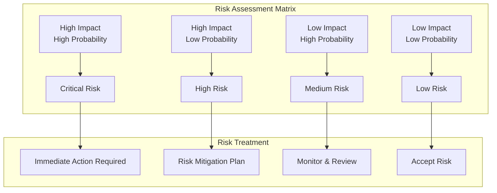
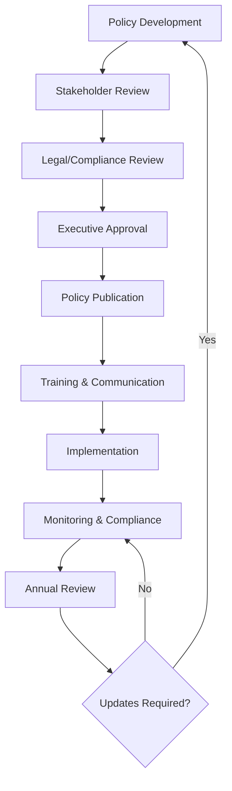
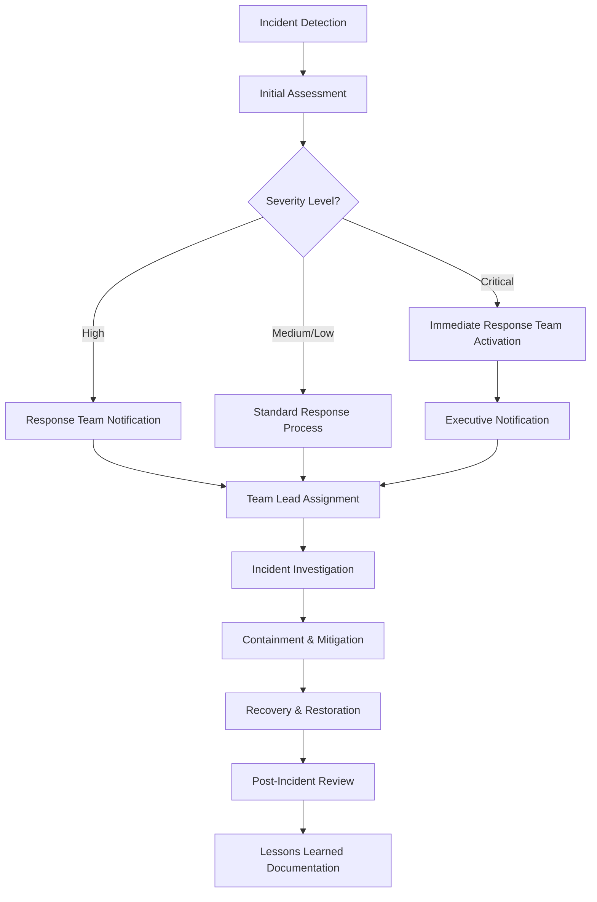

# SOC 2 Compliance Framework & Security Controls

> **Purpose:** Comprehensive SOC 2 compliance framework following 2025 security standards for demonstrating effective controls over security, availability, processing integrity, confidentiality, and privacy of customer data.
> **Playbook Reference:** `[SOC2_PLAYBOOK_PATH]`

**Document Type:** SOC 2 Compliance Framework  
**Version:** 2.0 - Enhanced with 2025 Security Standards  
**Last Updated:** 2025-01-15  
**Template Status:** Production Ready

---

## Document Control
| Field | Value |
|-------|-------|
| **Organization Name** | [ORGANIZATION_NAME] |
| **CISO/Security Lead** | [CISO_NAME] |
| **Compliance Manager** | [COMPLIANCE_MANAGER_NAME] |
| **Last Updated** | [YYYY-MM-DD] |
| **Next Review** | [YYYY-MM-DD] |
| **Audit Firm** | [AUDIT_FIRM_NAME] |

---

## 📋 Table of Contents
- [🎯 SOC 2 Strategy & Framework](#-soc-2-strategy--framework)
- [🛡️ Trust Services Criteria](#️-trust-services-criteria)
- [🏗️ Organizational Structure](#️-organizational-structure)
- [🔍 Risk Assessment & Controls](#-risk-assessment--controls)
- [📜 Policies & Procedures](#-policies--procedures)
- [📊 Evidence Management](#-evidence-management)
- [🔍 Audit Process](#-audit-process)
- [🚨 Incident Response](#-incident-response)
- [📊 Continuous Monitoring](#-continuous-monitoring)
- [🚀 Implementation Roadmap](#-implementation-roadmap)

---

## 🎯 SOC 2 Strategy & Framework

### SOC 2 Compliance Overview (2025 Standards)

SOC 2 is a voluntary compliance framework developed by the American Institute of Certified Public Accountants (AICPA) that evaluates service organization controls related to security, availability, processing integrity, confidentiality, and privacy of systems used to process customer data.

#### **Strategic Objectives**
- **Customer Trust:** [CUSTOMER_TRUST_OBJECTIVE]
- **Market Differentiation:** [MARKET_DIFFERENTIATION_STRATEGY]
- **Risk Mitigation:** [RISK_MITIGATION_APPROACH]
- **Regulatory Compliance:** [REGULATORY_COMPLIANCE_REQUIREMENTS]
- **Business Growth:** [BUSINESS_GROWTH_ENABLEMENT]

#### **SOC 2 Report Configuration**
```yaml
soc2_configuration:
  report_type: "[SOC2_REPORT_TYPE]" # Type I or Type II
  audit_period: "[AUDIT_PERIOD_DURATION]"
  report_date: "[REPORT_DATE]"
  
  trust_services_criteria:
    security: [SECURITY_ENABLED] # Mandatory
    availability: [AVAILABILITY_ENABLED]
    processing_integrity: [PROCESSING_INTEGRITY_ENABLED]
    confidentiality: [CONFIDENTIALITY_ENABLED]
    privacy: [PRIVACY_ENABLED]
```

#### **System Boundary & Scope**
```yaml
system_scope:
  included_systems:
    - system_name: "[SYSTEM_NAME_1]"
      description: "[SYSTEM_DESCRIPTION_1]"
      criticality: "[SYSTEM_CRITICALITY_1]"
    - system_name: "[SYSTEM_NAME_2]"
      description: "[SYSTEM_DESCRIPTION_2]"
      criticality: "[SYSTEM_CRITICALITY_2]"
  
  excluded_systems:
    - system_name: "[EXCLUDED_SYSTEM_1]"
      exclusion_reason: "[EXCLUSION_REASON_1]"
    - system_name: "[EXCLUDED_SYSTEM_2]"
      exclusion_reason: "[EXCLUSION_REASON_2]"
  
  system_boundaries:
    physical_boundaries: "[PHYSICAL_BOUNDARIES_DESCRIPTION]"
    logical_boundaries: "[LOGICAL_BOUNDARIES_DESCRIPTION]"
    network_boundaries: "[NETWORK_BOUNDARIES_DESCRIPTION]"

---

## 🛡️ Trust Services Criteria

### Trust Services Criteria Framework (2025 Enhanced)

Comprehensive implementation of AICPA Trust Services Criteria with modern security controls.

#### **Security (Mandatory) - [SECURITY_TSC_STATUS]**
```yaml
security_criteria:
  description: "Information and systems are protected against unauthorized access"
  implementation_status: "[SECURITY_IMPLEMENTATION_STATUS]"
  
  key_controls:
    access_controls:
      - control_id: "[ACCESS_CONTROL_ID_1]"
        description: "[ACCESS_CONTROL_DESCRIPTION_1]"
        implementation: "[ACCESS_CONTROL_IMPLEMENTATION_1]"
      - control_id: "[ACCESS_CONTROL_ID_2]"
        description: "[ACCESS_CONTROL_DESCRIPTION_2]"
        implementation: "[ACCESS_CONTROL_IMPLEMENTATION_2]"
    
    identity_management:
      - control_id: "[IDENTITY_CONTROL_ID_1]"
        description: "[IDENTITY_CONTROL_DESCRIPTION_1]"
        implementation: "[IDENTITY_CONTROL_IMPLEMENTATION_1]"
    
    network_security:
      - control_id: "[NETWORK_CONTROL_ID_1]"
        description: "[NETWORK_CONTROL_DESCRIPTION_1]"
        implementation: "[NETWORK_CONTROL_IMPLEMENTATION_1]"
    
    vulnerability_management:
      - control_id: "[VULN_CONTROL_ID_1]"
        description: "[VULN_CONTROL_DESCRIPTION_1]"
        implementation: "[VULN_CONTROL_IMPLEMENTATION_1]"
```

#### **Availability (Optional) - [AVAILABILITY_TSC_STATUS]**
```yaml
availability_criteria:
  description: "Systems are available for operation and use as committed or agreed"
  implementation_status: "[AVAILABILITY_IMPLEMENTATION_STATUS]"
  
  key_controls:
    system_monitoring:
      - control_id: "[MONITORING_CONTROL_ID_1]"
        description: "[MONITORING_CONTROL_DESCRIPTION_1]"
        sla_target: "[SLA_TARGET_1]"
    
    capacity_planning:
      - control_id: "[CAPACITY_CONTROL_ID_1]"
        description: "[CAPACITY_CONTROL_DESCRIPTION_1]"
        planning_horizon: "[PLANNING_HORIZON_1]"
    
    backup_recovery:
      - control_id: "[BACKUP_CONTROL_ID_1]"
        description: "[BACKUP_CONTROL_DESCRIPTION_1]"
        rto_target: "[RTO_TARGET_1]"
        rpo_target: "[RPO_TARGET_1]"
```

#### **Processing Integrity (Optional) - [PROCESSING_INTEGRITY_TSC_STATUS]**
```yaml
processing_integrity_criteria:
  description: "System processing is complete, valid, accurate, timely, and authorized"
  implementation_status: "[PROCESSING_INTEGRITY_IMPLEMENTATION_STATUS]"
  
  key_controls:
    data_validation:
      - control_id: "[VALIDATION_CONTROL_ID_1]"
        description: "[VALIDATION_CONTROL_DESCRIPTION_1]"
        validation_rules: "[VALIDATION_RULES_1]"
    
    transaction_processing:
      - control_id: "[TRANSACTION_CONTROL_ID_1]"
        description: "[TRANSACTION_CONTROL_DESCRIPTION_1]"
        processing_controls: "[PROCESSING_CONTROLS_1]"
    
    error_handling:
      - control_id: "[ERROR_CONTROL_ID_1]"
        description: "[ERROR_CONTROL_DESCRIPTION_1]"
        error_procedures: "[ERROR_PROCEDURES_1]"
```

#### **Confidentiality (Optional) - [CONFIDENTIALITY_TSC_STATUS]**
```yaml
confidentiality_criteria:
  description: "Information designated as confidential is protected as committed or agreed"
  implementation_status: "[CONFIDENTIALITY_IMPLEMENTATION_STATUS]"
  
  key_controls:
    data_classification:
      - control_id: "[CLASSIFICATION_CONTROL_ID_1]"
        description: "[CLASSIFICATION_CONTROL_DESCRIPTION_1]"
        classification_levels: ["[LEVEL_1]", "[LEVEL_2]", "[LEVEL_3]"]
    
    encryption:
      - control_id: "[ENCRYPTION_CONTROL_ID_1]"
        description: "[ENCRYPTION_CONTROL_DESCRIPTION_1]"
        encryption_standards: "[ENCRYPTION_STANDARDS_1]"
    
    key_management:
      - control_id: "[KEY_MGMT_CONTROL_ID_1]"
        description: "[KEY_MGMT_CONTROL_DESCRIPTION_1]"
        key_rotation_policy: "[KEY_ROTATION_POLICY_1]"
```

#### **Privacy (Optional) - [PRIVACY_TSC_STATUS]**
```yaml
privacy_criteria:
  description: "Personal information is collected, used, retained, disclosed, and disposed of in conformity with commitments"
  implementation_status: "[PRIVACY_IMPLEMENTATION_STATUS]"
  
  key_controls:
    privacy_notice:
      - control_id: "[PRIVACY_NOTICE_CONTROL_ID_1]"
        description: "[PRIVACY_NOTICE_CONTROL_DESCRIPTION_1]"
        notice_mechanisms: ["[MECHANISM_1]", "[MECHANISM_2]"]
    
    data_lifecycle:
      - control_id: "[LIFECYCLE_CONTROL_ID_1]"
        description: "[LIFECYCLE_CONTROL_DESCRIPTION_1]"
        retention_periods: "[RETENTION_PERIODS_1]"
    
    data_subject_rights:
      - control_id: "[RIGHTS_CONTROL_ID_1]"
        description: "[RIGHTS_CONTROL_DESCRIPTION_1]"
        supported_rights: ["[RIGHT_1]", "[RIGHT_2]", "[RIGHT_3]"]
```

---

## 🏗️ Organizational Structure

### SOC 2 Governance Framework (2025 Model)

Modern governance structure for effective SOC 2 compliance management.

#### **SOC 2 Steering Committee**
```yaml
steering_committee:
  executive_sponsor:
    name: "[EXECUTIVE_SPONSOR_NAME]"
    title: "[EXECUTIVE_SPONSOR_TITLE]"
    responsibilities:
      - "[EXEC_RESPONSIBILITY_1]"
      - "[EXEC_RESPONSIBILITY_2]"
      - "[EXEC_RESPONSIBILITY_3]"
  
  program_leader:
    name: "[PROGRAM_LEADER_NAME]"
    title: "[PROGRAM_LEADER_TITLE]"
    responsibilities:
      - "[LEADER_RESPONSIBILITY_1]"
      - "[LEADER_RESPONSIBILITY_2]"
      - "[LEADER_RESPONSIBILITY_3]"
  
  committee_members:
    - role: "[COMMITTEE_ROLE_1]"
      name: "[COMMITTEE_MEMBER_1]"
      department: "[DEPARTMENT_1]"
      responsibilities: ["[RESP_1]", "[RESP_2]"]
    - role: "[COMMITTEE_ROLE_2]"
      name: "[COMMITTEE_MEMBER_2]"
      department: "[DEPARTMENT_2]"
      responsibilities: ["[RESP_3]", "[RESP_4]"]
```

#### **RACI Matrix - SOC 2 Responsibilities**

| Activity | CISO | Compliance Manager | Control Owners | IT Operations | Legal |
|:---------|:-----|:-------------------|:---------------|:--------------|:------|
| **Policy Development** | [CISO_POLICY_ROLE] | [CM_POLICY_ROLE] | [CO_POLICY_ROLE] | [IT_POLICY_ROLE] | [LEGAL_POLICY_ROLE] |
| **Control Implementation** | [CISO_IMPL_ROLE] | [CM_IMPL_ROLE] | [CO_IMPL_ROLE] | [IT_IMPL_ROLE] | [LEGAL_IMPL_ROLE] |
| **Evidence Collection** | [CISO_EVIDENCE_ROLE] | [CM_EVIDENCE_ROLE] | [CO_EVIDENCE_ROLE] | [IT_EVIDENCE_ROLE] | [LEGAL_EVIDENCE_ROLE] |
| **Audit Coordination** | [CISO_AUDIT_ROLE] | [CM_AUDIT_ROLE] | [CO_AUDIT_ROLE] | [IT_AUDIT_ROLE] | [LEGAL_AUDIT_ROLE] |
| **Incident Response** | [CISO_INCIDENT_ROLE] | [CM_INCIDENT_ROLE] | [CO_INCIDENT_ROLE] | [IT_INCIDENT_ROLE] | [LEGAL_INCIDENT_ROLE] |

#### **Control Ownership Matrix**
```yaml
control_ownership:
  security_controls:
    - control_family: "[CONTROL_FAMILY_1]"
      primary_owner: "[PRIMARY_OWNER_1]"
      secondary_owner: "[SECONDARY_OWNER_1]"
      review_frequency: "[REVIEW_FREQUENCY_1]"
    - control_family: "[CONTROL_FAMILY_2]"
      primary_owner: "[PRIMARY_OWNER_2]"
      secondary_owner: "[SECONDARY_OWNER_2]"
      review_frequency: "[REVIEW_FREQUENCY_2]"
  
  operational_controls:
    - control_family: "[OP_CONTROL_FAMILY_1]"
      primary_owner: "[OP_PRIMARY_OWNER_1]"
      secondary_owner: "[OP_SECONDARY_OWNER_1]"
      review_frequency: "[OP_REVIEW_FREQUENCY_1]"
```

---

## 🔍 Risk Assessment & Controls

### Risk Management Framework (2025 Enhanced)

Comprehensive risk assessment methodology aligned with modern security frameworks.

#### **Risk Assessment Methodology**
```yaml
risk_framework:
  methodology: "[RISK_METHODOLOGY]" # NIST, ISO 27005, FAIR, etc.
  assessment_frequency: "[ASSESSMENT_FREQUENCY]"
  risk_appetite: "[ORGANIZATIONAL_RISK_APPETITE]"
  
  assessment_process:
    asset_identification:
      - step: "[ASSET_ID_STEP_1]"
        description: "[ASSET_ID_DESCRIPTION_1]"
        deliverable: "[ASSET_ID_DELIVERABLE_1]"
    
    threat_analysis:
      - step: "[THREAT_ANALYSIS_STEP_1]"
        description: "[THREAT_ANALYSIS_DESCRIPTION_1]"
        deliverable: "[THREAT_ANALYSIS_DELIVERABLE_1]"
    
    vulnerability_assessment:
      - step: "[VULN_ASSESSMENT_STEP_1]"
        description: "[VULN_ASSESSMENT_DESCRIPTION_1]"
        deliverable: "[VULN_ASSESSMENT_DELIVERABLE_1]"
    
    impact_probability:
      - step: "[IMPACT_PROB_STEP_1]"
        description: "[IMPACT_PROB_DESCRIPTION_1]"
        deliverable: "[IMPACT_PROB_DELIVERABLE_1]"
```

#### **Control Registry & Inventory**
```yaml
control_registry:
  security_controls:
    - control_id: "[SECURITY_CONTROL_ID_1]"
      description: "[SECURITY_CONTROL_DESCRIPTION_1]"
      tsc_criteria: "[TSC_CRITERIA_1]"
      control_owner: "[CONTROL_OWNER_1]"
      implementation_status: "[IMPLEMENTATION_STATUS_1]"
      testing_frequency: "[TESTING_FREQUENCY_1]"
      last_tested: "[LAST_TESTED_DATE_1]"
      effectiveness_rating: "[EFFECTIVENESS_RATING_1]"
    
    - control_id: "[SECURITY_CONTROL_ID_2]"
      description: "[SECURITY_CONTROL_DESCRIPTION_2]"
      tsc_criteria: "[TSC_CRITERIA_2]"
      control_owner: "[CONTROL_OWNER_2]"
      implementation_status: "[IMPLEMENTATION_STATUS_2]"
      testing_frequency: "[TESTING_FREQUENCY_2]"
      last_tested: "[LAST_TESTED_DATE_2]"
      effectiveness_rating: "[EFFECTIVENESS_RATING_2]"
  
  availability_controls:
    - control_id: "[AVAILABILITY_CONTROL_ID_1]"
      description: "[AVAILABILITY_CONTROL_DESCRIPTION_1]"
      tsc_criteria: "Availability"
      control_owner: "[AVAILABILITY_CONTROL_OWNER_1]"
      implementation_status: "[AVAILABILITY_IMPLEMENTATION_STATUS_1]"
      testing_frequency: "[AVAILABILITY_TESTING_FREQUENCY_1]"
      sla_target: "[AVAILABILITY_SLA_TARGET_1]"
```

#### **TSC Criteria Mapping Matrix**

| Control Family | Security | Availability | Processing Integrity | Confidentiality | Privacy |
|:---------------|:---------|:-------------|:-------------------|:----------------|:--------|
| **Access Controls** | [SECURITY_ACCESS_MAPPING] | [AVAILABILITY_ACCESS_MAPPING] | [PI_ACCESS_MAPPING] | [CONFIDENTIALITY_ACCESS_MAPPING] | [PRIVACY_ACCESS_MAPPING] |
| **System Operations** | [SECURITY_OPS_MAPPING] | [AVAILABILITY_OPS_MAPPING] | [PI_OPS_MAPPING] | [CONFIDENTIALITY_OPS_MAPPING] | [PRIVACY_OPS_MAPPING] |
| **Change Management** | [SECURITY_CHANGE_MAPPING] | [AVAILABILITY_CHANGE_MAPPING] | [PI_CHANGE_MAPPING] | [CONFIDENTIALITY_CHANGE_MAPPING] | [PRIVACY_CHANGE_MAPPING] |
| **Logical & Physical Access** | [SECURITY_PHYSICAL_MAPPING] | [AVAILABILITY_PHYSICAL_MAPPING] | [PI_PHYSICAL_MAPPING] | [CONFIDENTIALITY_PHYSICAL_MAPPING] | [PRIVACY_PHYSICAL_MAPPING] |

#### **Risk Heat Map & Assessment**


#### **Control Effectiveness Testing**
```yaml
testing_framework:
  testing_methodology: "[TESTING_METHODOLOGY]"
  testing_schedule: "[TESTING_SCHEDULE]"
  
  testing_types:
    design_effectiveness:
      description: "[DESIGN_EFFECTIVENESS_DESCRIPTION]"
      frequency: "[DESIGN_TESTING_FREQUENCY]"
      responsible_party: "[DESIGN_TESTING_RESPONSIBLE]"
    
    operating_effectiveness:
      description: "[OPERATING_EFFECTIVENESS_DESCRIPTION]"
      frequency: "[OPERATING_TESTING_FREQUENCY]"
      responsible_party: "[OPERATING_TESTING_RESPONSIBLE]"
  
  testing_results:
    - control_id: "[TESTED_CONTROL_ID_1]"
      test_date: "[TEST_DATE_1]"
      test_result: "[TEST_RESULT_1]"
      deficiencies: "[DEFICIENCIES_1]"
      remediation_plan: "[REMEDIATION_PLAN_1]"
```

---

## 📜 Policies & Procedures

### SOC 2 Policy Framework (2025 Standards)

Comprehensive policy suite aligned with Trust Services Criteria and modern security frameworks.

#### **Required Policy Portfolio**
```yaml
policy_framework:
  information_security:
    policy_name: "[INFORMATION_SECURITY_POLICY_NAME]"
    policy_owner: "[INFORMATION_SECURITY_POLICY_OWNER]"
    last_reviewed: "[LAST_REVIEWED_DATE_1]"
    next_review: "[NEXT_REVIEW_DATE_1]"
    approval_authority: "[APPROVAL_AUTHORITY_1]"
    tsc_mapping: ["Security", "Confidentiality"]
    
  access_control:
    policy_name: "[ACCESS_CONTROL_POLICY_NAME]"
    policy_owner: "[ACCESS_CONTROL_POLICY_OWNER]"
    last_reviewed: "[LAST_REVIEWED_DATE_2]"
    next_review: "[NEXT_REVIEW_DATE_2]"
    approval_authority: "[APPROVAL_AUTHORITY_2]"
    tsc_mapping: ["Security", "Confidentiality", "Privacy"]
    
  incident_management:
    policy_name: "[INCIDENT_MANAGEMENT_POLICY_NAME]"
    policy_owner: "[INCIDENT_MANAGEMENT_POLICY_OWNER]"
    last_reviewed: "[LAST_REVIEWED_DATE_3]"
    next_review: "[NEXT_REVIEW_DATE_3]"
    approval_authority: "[APPROVAL_AUTHORITY_3]"
    tsc_mapping: ["Security", "Availability"]
    
  business_continuity:
    policy_name: "[BUSINESS_CONTINUITY_POLICY_NAME]"
    policy_owner: "[BUSINESS_CONTINUITY_POLICY_OWNER]"
    last_reviewed: "[LAST_REVIEWED_DATE_4]"
    next_review: "[NEXT_REVIEW_DATE_4]"
    approval_authority: "[APPROVAL_AUTHORITY_4]"
    tsc_mapping: ["Availability"]
    
  change_management:
    policy_name: "[CHANGE_MANAGEMENT_POLICY_NAME]"
    policy_owner: "[CHANGE_MANAGEMENT_POLICY_OWNER]"
    last_reviewed: "[LAST_REVIEWED_DATE_5]"
    next_review: "[NEXT_REVIEW_DATE_5]"
    approval_authority: "[APPROVAL_AUTHORITY_5]"
    tsc_mapping: ["Security", "Availability", "Processing Integrity"]
```

#### **Operational Procedures Framework**
```yaml
operational_procedures:
  user_access_management:
    procedure_id: "[USER_ACCESS_PROC_ID]"
    description: "[USER_ACCESS_PROC_DESCRIPTION]"
    frequency: "[USER_ACCESS_PROC_FREQUENCY]"
    responsible_role: "[USER_ACCESS_RESPONSIBLE_ROLE]"
    steps:
      - step_number: 1
        description: "[USER_ACCESS_STEP_1]"
        controls: ["[CONTROL_1]", "[CONTROL_2]"]
      - step_number: 2
        description: "[USER_ACCESS_STEP_2]"
        controls: ["[CONTROL_3]", "[CONTROL_4]"]
    
  system_monitoring:
    procedure_id: "[SYSTEM_MONITORING_PROC_ID]"
    description: "[SYSTEM_MONITORING_PROC_DESCRIPTION]"
    frequency: "[SYSTEM_MONITORING_PROC_FREQUENCY]"
    responsible_role: "[SYSTEM_MONITORING_RESPONSIBLE_ROLE]"
    monitoring_tools: ["[MONITORING_TOOL_1]", "[MONITORING_TOOL_2]"]
    alert_thresholds:
      - metric: "[METRIC_1]"
        threshold: "[THRESHOLD_1]"
        action: "[ACTION_1]"
    
  backup_recovery:
    procedure_id: "[BACKUP_RECOVERY_PROC_ID]"
    description: "[BACKUP_RECOVERY_PROC_DESCRIPTION]"
    frequency: "[BACKUP_RECOVERY_PROC_FREQUENCY]"
    responsible_role: "[BACKUP_RECOVERY_RESPONSIBLE_ROLE]"
    backup_schedule:
      - backup_type: "[BACKUP_TYPE_1]"
        frequency: "[BACKUP_FREQUENCY_1]"
        retention: "[BACKUP_RETENTION_1]"
```

#### **Policy Management Lifecycle**


---

## 📊 Evidence Management

### SOC 2 Evidence Framework (2025 Enhanced)

Comprehensive evidence collection, management, and audit trail system.

#### **Evidence Classification & Types**
```yaml
evidence_framework:
  design_evidence:
    - evidence_type: "[DESIGN_EVIDENCE_TYPE_1]"
      description: "[DESIGN_EVIDENCE_DESCRIPTION_1]"
      collection_method: "[DESIGN_COLLECTION_METHOD_1]"
      responsible_party: "[DESIGN_RESPONSIBLE_PARTY_1]"
      retention_period: "[DESIGN_RETENTION_PERIOD_1]"
    
    - evidence_type: "[DESIGN_EVIDENCE_TYPE_2]"
      description: "[DESIGN_EVIDENCE_DESCRIPTION_2]"
      collection_method: "[DESIGN_COLLECTION_METHOD_2]"
      responsible_party: "[DESIGN_RESPONSIBLE_PARTY_2]"
      retention_period: "[DESIGN_RETENTION_PERIOD_2]"
  
  operating_evidence:
    - evidence_type: "[OPERATING_EVIDENCE_TYPE_1]"
      description: "[OPERATING_EVIDENCE_DESCRIPTION_1]"
      collection_frequency: "[OPERATING_COLLECTION_FREQUENCY_1]"
      automated_collection: "[OPERATING_AUTOMATED_1]"
      storage_location: "[OPERATING_STORAGE_LOCATION_1]"
    
    - evidence_type: "[OPERATING_EVIDENCE_TYPE_2]"
      description: "[OPERATING_EVIDENCE_DESCRIPTION_2]"
      collection_frequency: "[OPERATING_COLLECTION_FREQUENCY_2]"
      automated_collection: "[OPERATING_AUTOMATED_2]"
      storage_location: "[OPERATING_STORAGE_LOCATION_2]"
```

#### **Evidence Collection Matrix**

| Control ID | Evidence Type | Collection Method | Frequency | Responsible Party | Storage Location |
|:-----------|:--------------|:------------------|:----------|:------------------|:-----------------|
| [CONTROL_ID_1] | [EVIDENCE_TYPE_1] | [COLLECTION_METHOD_1] | [FREQUENCY_1] | [RESPONSIBLE_1] | [STORAGE_1] |
| [CONTROL_ID_2] | [EVIDENCE_TYPE_2] | [COLLECTION_METHOD_2] | [FREQUENCY_2] | [RESPONSIBLE_2] | [STORAGE_2] |
| [CONTROL_ID_3] | [EVIDENCE_TYPE_3] | [COLLECTION_METHOD_3] | [FREQUENCY_3] | [RESPONSIBLE_3] | [STORAGE_3] |

#### **Evidence Management System**
```yaml
evidence_management:
  collection_platform: "[EVIDENCE_COLLECTION_PLATFORM]"
  storage_system: "[EVIDENCE_STORAGE_SYSTEM]"
  access_controls: "[EVIDENCE_ACCESS_CONTROLS]"
  
  automated_collection:
    - system: "[AUTOMATED_SYSTEM_1]"
      evidence_types: ["[AUTO_EVIDENCE_1]", "[AUTO_EVIDENCE_2]"]
      collection_schedule: "[AUTO_COLLECTION_SCHEDULE_1]"
    
    - system: "[AUTOMATED_SYSTEM_2]"
      evidence_types: ["[AUTO_EVIDENCE_3]", "[AUTO_EVIDENCE_4]"]
      collection_schedule: "[AUTO_COLLECTION_SCHEDULE_2]"
  
  manual_collection:
    - process: "[MANUAL_PROCESS_1]"
      evidence_types: ["[MANUAL_EVIDENCE_1]", "[MANUAL_EVIDENCE_2]"]
      responsible_role: "[MANUAL_RESPONSIBLE_1]"
      collection_frequency: "[MANUAL_FREQUENCY_1]"
```

#### **Evidence Audit Trail**
```yaml
audit_trail:
  evidence_lifecycle:
    creation:
      timestamp: "[CREATION_TIMESTAMP]"
      created_by: "[CREATED_BY]"
      source_system: "[SOURCE_SYSTEM]"
    
    modification:
      last_modified: "[LAST_MODIFIED_TIMESTAMP]"
      modified_by: "[MODIFIED_BY]"
      modification_reason: "[MODIFICATION_REASON]"
    
    access_log:
      - accessed_by: "[ACCESSED_BY_1]"
        access_timestamp: "[ACCESS_TIMESTAMP_1]"
        access_purpose: "[ACCESS_PURPOSE_1]"
      - accessed_by: "[ACCESSED_BY_2]"
        access_timestamp: "[ACCESS_TIMESTAMP_2]"
        access_purpose: "[ACCESS_PURPOSE_2]"
```

---

## 🔍 Audit Process

### SOC 2 Audit Management (2025 Framework)

Comprehensive audit coordination and management framework for successful SOC 2 engagements.

#### **Audit Planning & Preparation**
```yaml
audit_preparation:
  audit_firm_selection:
    selection_criteria:
      - criterion: "[SELECTION_CRITERION_1]"
        weight: "[CRITERION_WEIGHT_1]"
        evaluation_method: "[EVALUATION_METHOD_1]"
    
    selected_firm:
      firm_name: "[AUDIT_FIRM_NAME]"
      lead_auditor: "[LEAD_AUDITOR_NAME]"
      engagement_partner: "[ENGAGEMENT_PARTNER_NAME]"
      audit_team_size: "[AUDIT_TEAM_SIZE]"
  
  audit_scope:
    audit_period_start: "[AUDIT_PERIOD_START]"
    audit_period_end: "[AUDIT_PERIOD_END]"
    systems_in_scope: ["[SYSTEM_1]", "[SYSTEM_2]", "[SYSTEM_3]"]
    locations_in_scope: ["[LOCATION_1]", "[LOCATION_2]"]
    
  pre_audit_activities:
    - activity: "[PRE_AUDIT_ACTIVITY_1]"
      responsible_party: "[PRE_AUDIT_RESPONSIBLE_1]"
      due_date: "[PRE_AUDIT_DUE_DATE_1]"
      status: "[PRE_AUDIT_STATUS_1]"
```

#### **Audit Execution Timeline**
```mermaid
gantt
    title SOC 2 Audit Timeline
    dateFormat  YYYY-MM-DD
    section Planning
    Audit Firm Selection    :milestone, m1, [AUDIT_FIRM_SELECTION_DATE], 0d
    Scope Definition       :a1, [SCOPE_DEFINITION_START], [SCOPE_DEFINITION_DURATION]d
    Evidence Preparation   :a2, after a1, [EVIDENCE_PREP_DURATION]d
    
    section Fieldwork
    Opening Meeting        :milestone, m2, [OPENING_MEETING_DATE], 0d
    Control Testing        :b1, [CONTROL_TESTING_START], [CONTROL_TESTING_DURATION]d
    Management Interviews  :b2, [INTERVIEW_START], [INTERVIEW_DURATION]d
    
    section Reporting
    Draft Report Review    :c1, [DRAFT_REVIEW_START], [DRAFT_REVIEW_DURATION]d
    Management Response    :c2, [MGMT_RESPONSE_START], [MGMT_RESPONSE_DURATION]d
    Final Report          :milestone, m3, [FINAL_REPORT_DATE], 0d
```

#### **Audit Communication Plan**
```yaml
communication_framework:
  stakeholder_matrix:
    - stakeholder: "[STAKEHOLDER_1]"
      role: "[STAKEHOLDER_ROLE_1]"
      communication_frequency: "[COMM_FREQUENCY_1]"
      communication_method: "[COMM_METHOD_1]"
      key_topics: ["[TOPIC_1]", "[TOPIC_2]"]
    
    - stakeholder: "[STAKEHOLDER_2]"
      role: "[STAKEHOLDER_ROLE_2]"
      communication_frequency: "[COMM_FREQUENCY_2]"
      communication_method: "[COMM_METHOD_2]"
      key_topics: ["[TOPIC_3]", "[TOPIC_4]"]
  
  meeting_schedule:
    - meeting_type: "[MEETING_TYPE_1]"
      frequency: "[MEETING_FREQUENCY_1]"
      attendees: ["[ATTENDEE_1]", "[ATTENDEE_2]"]
      agenda_template: "[AGENDA_TEMPLATE_1]"
```
---

## 🚨 Incident Response

### SOC 2 Incident Management Framework (2025 Enhanced)

Comprehensive incident response framework aligned with SOC 2 requirements and modern security practices.

#### **Incident Response Strategy**
```yaml
incident_response_framework:
  incident_classification:
    - severity_level: "[SEVERITY_LEVEL_1]"
      description: "[SEVERITY_DESCRIPTION_1]"
      response_time: "[RESPONSE_TIME_1]"
      escalation_criteria: "[ESCALATION_CRITERIA_1]"
      notification_requirements: ["[NOTIFICATION_1]", "[NOTIFICATION_2]"]
    
    - severity_level: "[SEVERITY_LEVEL_2]"
      description: "[SEVERITY_DESCRIPTION_2]"
      response_time: "[RESPONSE_TIME_2]"
      escalation_criteria: "[ESCALATION_CRITERIA_2]"
      notification_requirements: ["[NOTIFICATION_3]", "[NOTIFICATION_4]"]
  
  incident_types:
    security_incidents:
      - type: "[SECURITY_INCIDENT_TYPE_1]"
        definition: "[SECURITY_INCIDENT_DEFINITION_1]"
        tsc_impact: ["Security", "Confidentiality"]
        response_team: "[SECURITY_RESPONSE_TEAM_1]"
    
    availability_incidents:
      - type: "[AVAILABILITY_INCIDENT_TYPE_1]"
        definition: "[AVAILABILITY_INCIDENT_DEFINITION_1]"
        tsc_impact: ["Availability"]
        response_team: "[AVAILABILITY_RESPONSE_TEAM_1]"
```

#### **Incident Response Workflow**


#### **Incident Communication Matrix**
```yaml
communication_matrix:
  internal_stakeholders:
    - stakeholder: "[INTERNAL_STAKEHOLDER_1]"
      notification_trigger: "[NOTIFICATION_TRIGGER_1]"
      communication_method: "[COMMUNICATION_METHOD_1]"
      message_template: "[MESSAGE_TEMPLATE_1]"
    
    - stakeholder: "[INTERNAL_STAKEHOLDER_2]"
      notification_trigger: "[NOTIFICATION_TRIGGER_2]"
      communication_method: "[COMMUNICATION_METHOD_2]"
      message_template: "[MESSAGE_TEMPLATE_2]"
  
  external_stakeholders:
    - stakeholder: "[EXTERNAL_STAKEHOLDER_1]"
      notification_criteria: "[EXTERNAL_NOTIFICATION_CRITERIA_1]"
      notification_timeframe: "[EXTERNAL_TIMEFRAME_1]"
      communication_channel: "[EXTERNAL_CHANNEL_1]"
```

---

## 📊 Continuous Monitoring

### SOC 2 Monitoring Framework (2025 Standards)

Real-time monitoring and continuous compliance assessment system.

#### **Monitoring Strategy & Architecture**
```yaml
monitoring_framework:
  monitoring_objectives:
    - objective: "[MONITORING_OBJECTIVE_1]"
      tsc_criteria: "[TSC_CRITERIA_1]"
      monitoring_frequency: "[MONITORING_FREQUENCY_1]"
      automated_tools: ["[TOOL_1]", "[TOOL_2]"]
    
    - objective: "[MONITORING_OBJECTIVE_2]"
      tsc_criteria: "[TSC_CRITERIA_2]"
      monitoring_frequency: "[MONITORING_FREQUENCY_2]"
      automated_tools: ["[TOOL_3]", "[TOOL_4]"]
  
  monitoring_tools:
    security_monitoring:
      - tool_name: "[SECURITY_TOOL_1]"
        purpose: "[SECURITY_PURPOSE_1]"
        monitored_metrics: ["[SECURITY_METRIC_1]", "[SECURITY_METRIC_2]"]
        alert_thresholds: "[SECURITY_THRESHOLDS_1]"
    
    availability_monitoring:
      - tool_name: "[AVAILABILITY_TOOL_1]"
        purpose: "[AVAILABILITY_PURPOSE_1]"
        monitored_metrics: ["[AVAILABILITY_METRIC_1]", "[AVAILABILITY_METRIC_2]"]
        alert_thresholds: "[AVAILABILITY_THRESHOLDS_1]"
```

#### **Compliance Dashboard & KPIs**
```yaml
compliance_dashboard:
  key_metrics:
    - metric_name: "[KPI_NAME_1]"
      description: "[KPI_DESCRIPTION_1]"
      target_value: "[KPI_TARGET_1]"
      current_value: "[KPI_CURRENT_1]"
      trend: "[KPI_TREND_1]"
      tsc_mapping: "[KPI_TSC_MAPPING_1]"
    
    - metric_name: "[KPI_NAME_2]"
      description: "[KPI_DESCRIPTION_2]"
      target_value: "[KPI_TARGET_2]"
      current_value: "[KPI_CURRENT_2]"
      trend: "[KPI_TREND_2]"
      tsc_mapping: "[KPI_TSC_MAPPING_2]"
  
  reporting_schedule:
    - report_type: "[REPORT_TYPE_1]"
      frequency: "[REPORT_FREQUENCY_1]"
      recipients: ["[RECIPIENT_1]", "[RECIPIENT_2]"]
      delivery_method: "[DELIVERY_METHOD_1]"
```

---

## 🚀 Implementation Roadmap

### SOC 2 Implementation Strategy (2025 Accelerated)

Comprehensive roadmap for SOC 2 compliance implementation and maintenance.

#### **Implementation Phases**
```yaml
implementation_roadmap:
  phase_1_foundation:
    duration: "[PHASE_1_DURATION]"
    objectives: ["[PHASE_1_OBJECTIVE_1]", "[PHASE_1_OBJECTIVE_2]"]
    deliverables:
      - deliverable: "[PHASE_1_DELIVERABLE_1]"
        responsible_party: "[PHASE_1_RESPONSIBLE_1]"
        due_date: "[PHASE_1_DUE_DATE_1]"
    
    key_activities:
      - activity: "[PHASE_1_ACTIVITY_1]"
        description: "[PHASE_1_ACTIVITY_DESCRIPTION_1]"
        dependencies: ["[PHASE_1_DEPENDENCY_1]"]
  
  phase_2_implementation:
    duration: "[PHASE_2_DURATION]"
    objectives: ["[PHASE_2_OBJECTIVE_1]", "[PHASE_2_OBJECTIVE_2]"]
    deliverables:
      - deliverable: "[PHASE_2_DELIVERABLE_1]"
        responsible_party: "[PHASE_2_RESPONSIBLE_1]"
        due_date: "[PHASE_2_DUE_DATE_1]"
  
  phase_3_audit_readiness:
    duration: "[PHASE_3_DURATION]"
    objectives: ["[PHASE_3_OBJECTIVE_1]", "[PHASE_3_OBJECTIVE_2]"]
    deliverables:
      - deliverable: "[PHASE_3_DELIVERABLE_1]"
        responsible_party: "[PHASE_3_RESPONSIBLE_1]"
        due_date: "[PHASE_3_DUE_DATE_1]"
```

#### **Budget & Resource Planning**
```yaml
resource_planning:
  budget_allocation:
    - category: "[BUDGET_CATEGORY_1]"
      allocated_amount: "[BUDGET_AMOUNT_1]"
      percentage_of_total: "[BUDGET_PERCENTAGE_1]"
      justification: "[BUDGET_JUSTIFICATION_1]"
    
    - category: "[BUDGET_CATEGORY_2]"
      allocated_amount: "[BUDGET_AMOUNT_2]"
      percentage_of_total: "[BUDGET_PERCENTAGE_2]"
      justification: "[BUDGET_JUSTIFICATION_2]"
  
  human_resources:
    - role: "[RESOURCE_ROLE_1]"
      fte_allocation: "[FTE_ALLOCATION_1]"
      duration: "[RESOURCE_DURATION_1]"
      skill_requirements: ["[SKILL_1]", "[SKILL_2]"]
```

#### **Risk Mitigation & Contingency**
```yaml
risk_mitigation:
  identified_risks:
    - risk_id: "[RISK_ID_1]"
      description: "[RISK_DESCRIPTION_1]"
      probability: "[RISK_PROBABILITY_1]"
      impact: "[RISK_IMPACT_1]"
      mitigation_strategy: "[MITIGATION_STRATEGY_1]"
      contingency_plan: "[CONTINGENCY_PLAN_1]"
    
    - risk_id: "[RISK_ID_2]"
      description: "[RISK_DESCRIPTION_2]"
      probability: "[RISK_PROBABILITY_2]"
      impact: "[RISK_IMPACT_2]"
      mitigation_strategy: "[MITIGATION_STRATEGY_2]"
      contingency_plan: "[CONTINGENCY_PLAN_2]"
```

---

## 📋 Document Control & Approvals

### Document Management Framework

#### **Document Control Information**
- **Document Owner:** [DOCUMENT_OWNER_NAME]
- **Document Custodian:** [DOCUMENT_CUSTODIAN_NAME]
- **Classification:** [DOCUMENT_CLASSIFICATION]
- **Distribution List:** [DISTRIBUTION_LIST]

#### **Approval Matrix**

| Role | Name | Signature | Date |
|:-----|:-----|:----------|:-----|
| **CISO** | [CISO_NAME] | [CISO_SIGNATURE] | [CISO_APPROVAL_DATE] |
| **Compliance Manager** | [COMPLIANCE_MANAGER_NAME] | [COMPLIANCE_MANAGER_SIGNATURE] | [COMPLIANCE_MANAGER_APPROVAL_DATE] |
| **Executive Sponsor** | [EXECUTIVE_SPONSOR_NAME] | [EXECUTIVE_SPONSOR_SIGNATURE] | [EXECUTIVE_SPONSOR_APPROVAL_DATE] |
| **Legal Counsel** | [LEGAL_COUNSEL_NAME] | [LEGAL_COUNSEL_SIGNATURE] | [LEGAL_COUNSEL_APPROVAL_DATE] |

#### **Revision History**

| Version | Date | Author | Changes |
|:--------|:-----|:-------|:--------|
| [VERSION_1] | [DATE_1] | [AUTHOR_1] | [CHANGES_1] |
| [VERSION_2] | [DATE_2] | [AUTHOR_2] | [CHANGES_2] |
| [VERSION_3] | [DATE_3] | [AUTHOR_3] | [CHANGES_3] |

---

**Document Footer:**
- **Next Review Date:** [NEXT_REVIEW_DATE]
- **Document ID:** [DOCUMENT_ID]
- **Page:** [PAGE_NUMBER] of [TOTAL_PAGES]
├── Control_Evidence/
│   ├── Security/
│   ├── Availability/
│   ├── Processing_Integrity/
│   ├── Confidentiality/
│   └── Privacy/
├── Testing_Results/
└── Audit_Communications/
```

### 6.3 Retención y Gestión de Evidencia

- **Período de Retención:** [Especificar período]
- **Responsable de Gestión:** [Especificar rol]
- **Controles de Acceso:** [Especificar restricciones]
- **Procedimientos de Respaldo:** [Especificar procedimientos]

## 7. Proceso de Auditoría

### 7.1 Selección del Auditor

**Criterios de Selección:**
- Certificación CPA con experiencia en SOC 2
- Experiencia en la industria
- Referencias de clientes similares
- Costo y cronograma
- Metodología de auditoría

**Auditor Seleccionado:** [Nombre de la firma]
**Auditor Principal:** [Nombre del auditor]

### 7.2 Cronograma de Auditoría

| Fase | Actividades | Duración | Responsable |
|------|-------------|----------|-------------|
| **Planificación** | Definición de alcance, cronograma | [Duración] | [Responsable] |
| **Evaluación de Diseño** | Revisión de controles, políticas | [Duración] | [Responsable] |
| **Pruebas Operativas** | Pruebas de efectividad de controles | [Duración] | [Responsable] |
| **Reporte** | Preparación del informe SOC 2 | [Duración] | [Responsable] |

### 7.3 Comunicación con Auditores

**Punto de Contacto Principal:** [Nombre y cargo]
**Canales de Comunicación:** [Email, reuniones, portal]
**Frecuencia de Reuniones:** [Especificar frecuencia]

## 8. Gestión de Deficiencias

### 8.1 Proceso de Identificación

- Autoevaluaciones internas
- Pruebas de controles
- Hallazgos de auditoría externa
- Incidentes de seguridad
- Cambios en el entorno

### 8.2 Clasificación de Deficiencias

| Tipo | Descripción | Tiempo de Resolución |
|------|-------------|---------------------|
| **Deficiencia de Diseño** | Control no diseñado adecuadamente | [Tiempo] |
| **Deficiencia Operativa** | Control no opera efectivamente | [Tiempo] |
| **Deficiencia Material** | Impacto significativo en objetivos | [Tiempo] |

### 8.3 Plan de Remediación

**Proceso:**
1. Análisis de causa raíz
2. Desarrollo del plan de acción
3. Asignación de responsabilidades
4. Implementación de correcciones
5. Validación de efectividad
6. Documentación de resolución

## 9. Monitoreo Continuo

### 9.1 Programa de Monitoreo

**Objetivos:**
- Asegurar operación efectiva de controles
- Identificar deficiencias tempranamente
- Mantener preparación para auditoría
- Demostrar mejora continua

### 9.2 Métricas y KPIs

| Métrica | Descripción | Frecuencia | Meta |
|---------|-------------|------------|------|
| **Disponibilidad del Sistema** | Tiempo de actividad de sistemas críticos | Mensual | >99.9% |
| **Tiempo de Resolución de Incidentes** | Tiempo promedio de resolución | Mensual | <4 horas |
| **Cumplimiento de Controles** | % de controles operando efectivamente | Mensual | 100% |
| **Deficiencias Abiertas** | Número de deficiencias pendientes | Mensual | <5 |

### 9.3 Reportes de Cumplimiento

**Audiencia:** Comité ejecutivo, junta directiva
**Frecuencia:** Trimestral
**Contenido:**
- Estado general del programa SOC 2
- Resultados de pruebas de controles
- Deficiencias identificadas y remediadas
- Métricas de rendimiento
- Próximos pasos y recomendaciones

## 10. Gestión de Cambios

### 10.1 Impacto en SOC 2

Todos los cambios significativos deben evaluarse por su impacto en:
- Alcance de la auditoría SOC 2
- Efectividad de controles existentes
- Necesidad de controles adicionales
- Cronograma de auditoría

### 10.2 Proceso de Evaluación

1. **Identificación:** Cambios que pueden afectar SOC 2
2. **Evaluación:** Análisis de impacto en controles
3. **Aprobación:** Revisión por comité de cumplimiento
4. **Implementación:** Ejecución con consideraciones SOC 2
5. **Validación:** Verificación de efectividad de controles

## 11. Capacitación y Concientización

### 11.1 Programa de Capacitación

**Audiencia Objetivo:**
- Todo el personal
- Propietarios de controles
- Equipos de TI y seguridad
- Liderazgo ejecutivo

**Temas de Capacitación:**
- Fundamentos de SOC 2
- Responsabilidades específicas por rol
- Políticas y procedimientos relevantes
- Manejo de incidentes de seguridad
- Mejores prácticas de seguridad

### 11.2 Cronograma de Capacitación

| Audiencia | Tipo de Capacitación | Frecuencia | Duración |
|-----------|---------------------|------------|----------|
| **Nuevos Empleados** | Orientación SOC 2 | Al ingreso | 2 horas |
| **Todo el Personal** | Concientización general | Anual | 1 hora |
| **Propietarios de Controles** | Capacitación específica | Semestral | 4 horas |
| **Equipo de Cumplimiento** | Capacitación avanzada | Trimestral | 8 horas |

## 12. Gestión de Proveedores

### 12.1 Evaluación de Proveedores

**Criterios de Evaluación:**
- Certificaciones de seguridad (SOC 2, ISO 27001)
- Políticas de seguridad y privacidad
- Controles de acceso y cifrado
- Procedimientos de respuesta a incidentes
- Ubicación de datos y jurisdicción

### 12.2 Contratos y SLAs

**Cláusulas Requeridas:**
- Requisitos de seguridad específicos
- Derechos de auditoría
- Notificación de incidentes
- Terminación por incumplimiento
- Retorno/destrucción de datos

### 12.3 Monitoreo Continuo

- Revisiones periódicas de cumplimiento
- Evaluación de reportes SOC 2 de proveedores
- Pruebas de controles de proveedores
- Gestión de incidentes de proveedores

## 13. Respuesta a Incidentes

### 13.1 Clasificación de Incidentes

| Severidad | Descripción | Tiempo de Respuesta |
|-----------|-------------|---------------------|
| **Crítica** | Brecha de seguridad con exposición de datos | 1 hora |
| **Alta** | Incidente que afecta disponibilidad crítica | 4 horas |
| **Media** | Incidente con impacto limitado | 24 horas |
| **Baja** | Incidente menor sin impacto en clientes | 72 horas |

### 13.2 Proceso de Respuesta

1. **Detección y Reporte**
2. **Evaluación Inicial**
3. **Contención y Mitigación**
4. **Investigación y Análisis**
5. **Recuperación y Restauración**
6. **Lecciones Aprendidas**
7. **Documentación y Reporte**

### 13.3 Comunicación de Incidentes

**Stakeholders Internos:**
- Equipo de respuesta a incidentes
- Liderazgo ejecutivo
- Equipos afectados
- Departamento legal

**Stakeholders Externos:**
- Clientes afectados
- Reguladores (si aplica)
- Auditores SOC 2
- Socios comerciales

## 14. Mejora Continua

### 14.1 Revisiones Periódicas

**Frecuencia:** Trimestral
**Participantes:** Comité de cumplimiento SOC 2
**Agenda:**
- Revisión de métricas y KPIs
- Análisis de deficiencias y tendencias
- Evaluación de cambios en el entorno
- Identificación de oportunidades de mejora

### 14.2 Actualizaciones del Programa

**Triggers para Actualización:**
- Cambios en criterios TSC
- Nuevas amenazas de seguridad
- Cambios organizacionales
- Lecciones aprendidas de auditorías
- Feedback de stakeholders

### 14.3 Benchmarking

- Comparación con mejores prácticas de la industria
- Participación en grupos de trabajo de seguridad
- Revisión de marcos de referencia actualizados
- Análisis de tendencias de cumplimiento

## 15. Documentación y Registros

### 15.1 Documentos Maestros

- Plan de cumplimiento SOC 2
- Políticas y procedimientos
- Matriz de controles
- Plan de respuesta a incidentes
- Procedimientos de gestión de evidencia

### 15.2 Registros Operativos

- Logs de sistemas y aplicaciones
- Registros de acceso y autenticación
- Documentación de pruebas de controles
- Reportes de incidentes
- Comunicaciones con auditores

### 15.3 Control de Versiones

**Sistema:** [Especificar sistema de gestión documental]
**Responsable:** [Especificar rol responsable]
**Proceso de Aprobación:** [Especificar proceso]
**Distribución:** [Especificar proceso de distribución]

## 16. Cronograma de Implementación

### Fase 1: Preparación (Meses 1-2)
- [ ] Definición de alcance y objetivos
- [ ] Formación del equipo de cumplimiento
- [ ] Evaluación inicial de riesgos
- [ ] Selección del auditor

### Fase 2: Implementación (Meses 3-6)
- [ ] Desarrollo de políticas y procedimientos
- [ ] Implementación de controles
- [ ] Capacitación del personal
- [ ] Establecimiento de procesos de monitoreo

### Fase 3: Preparación para Auditoría (Meses 7-9)
- [ ] Recolección de evidencia
- [ ] Pruebas internas de controles
- [ ] Remediación de deficiencias
- [ ] Preparación de documentación

### Fase 4: Auditoría (Meses 10-12)
- [ ] Ejecución de auditoría SOC 2
- [ ] Respuesta a hallazgos
- [ ] Obtención del reporte SOC 2
- [ ] Comunicación de resultados

## 17. Presupuesto y Recursos

### 17.1 Costos Estimados

| Categoría | Descripción | Costo Estimado |
|-----------|-------------|----------------|
| **Auditoría Externa** | Honorarios del auditor CPA | $[Monto] |
| **Herramientas de Cumplimiento** | Software de gestión GRC | $[Monto] |
| **Capacitación** | Programas de capacitación | $[Monto] |
| **Consultoría** | Apoyo externo especializado | $[Monto] |
| **Recursos Internos** | Tiempo del personal interno | $[Monto] |
| **Total** | | $[Monto Total] |

### 17.2 Recursos Humanos

| Rol | Dedicación | Duración |
|-----|------------|----------|
| **Líder del Programa** | 50% | 12 meses |
| **Especialista en Cumplimiento** | 100% | 12 meses |
| **Propietarios de Controles** | 20% | 12 meses |
| **Soporte de TI** | 30% | 6 meses |

## 18. Riesgos y Mitigaciones

### 18.1 Riesgos del Programa

| Riesgo | Probabilidad | Impacto | Mitigación |
|--------|--------------|---------|------------|
| **Retrasos en implementación** | Media | Alto | Gestión proactiva de proyecto |
| **Falta de recursos** | Baja | Alto | Compromiso ejecutivo y presupuesto |
| **Cambios en alcance** | Media | Medio | Gestión de cambios estructurada |
| **Deficiencias en auditoría** | Media | Alto | Pruebas internas rigurosas |

### 18.2 Plan de Contingencia

- Recursos adicionales para remediación urgente
- Comunicación proactiva con stakeholders
- Planes alternativos para cronograma
- Escalación a liderazgo ejecutivo

## 19. Comunicación y Reporte

### 19.1 Plan de Comunicación

| Audiencia | Mensaje | Frecuencia | Canal |
|-----------|---------|------------|-------|
| **Empleados** | Progreso del programa | Mensual | Email, intranet |
| **Liderazgo** | Estado y métricas | Mensual | Reuniones ejecutivas |
| **Clientes** | Compromiso con seguridad | Según necesidad | Comunicación formal |
| **Junta Directiva** | Resultados de auditoría | Anual | Presentación formal |

### 19.2 Plantillas de Comunicación

- Actualizaciones de progreso
- Reportes de incidentes
- Comunicación de resultados de auditoría
- Notificaciones de cambios en políticas

## 20. Conclusiones y Próximos Pasos

### 20.1 Beneficios Esperados

- Demostración de compromiso con la seguridad
- Mejora en la postura de seguridad organizacional
- Ventaja competitiva en el mercado
- Cumplimiento con requisitos contractuales
- Reducción de riesgos de seguridad

### 20.2 Próximos Pasos

1. **Aprobación del Plan:** Obtener aprobación ejecutiva
2. **Asignación de Recursos:** Confirmar presupuesto y personal
3. **Inicio de Implementación:** Comenzar Fase 1 del cronograma
4. **Monitoreo de Progreso:** Establecer reuniones de seguimiento
5. **Comunicación Inicial:** Anunciar el programa a la organización

---

**Documento Preparado Por:** [Nombre]  
**Fecha de Preparación:** [Fecha]  
**Próxima Revisión:** [Fecha]  
**Versión:** 1.0

**Aprobaciones:**
- [ ] CISO/Líder de Seguridad
- [ ] CTO/Líder de Tecnología  
- [ ] CEO/Liderazgo Ejecutivo
- [ ] Comité de Cumplimiento