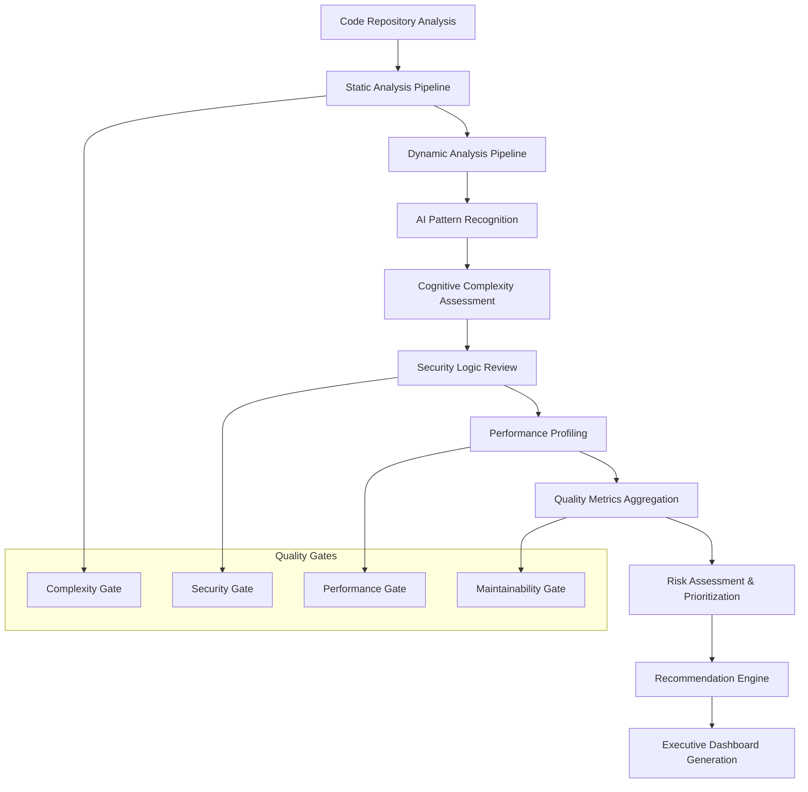

# Deep Logic Analysis Framework (2025 Enhanced)

> **Purpose:** Comprehensive deep logic analysis framework for advanced code quality assessment, architectural complexity evaluation, and cognitive load analysis. This production-ready template integrates modern static analysis methodologies, AI-enhanced code review techniques, and cognitive complexity metrics aligned with 2025 software engineering best practices.

**Document Type:** Advanced Code Analysis & Logic Intelligence Framework  
**Version:** 2.0 - Enhanced with AI-Driven Analysis & Cognitive Metrics  
**Last Updated:** [DOCUMENT_LAST_UPDATED]  
**Template Status:** Production Ready - 2025 Standards  
**Schema Reference:** `deepLogicAnalysisFramework.json`  
**Compliance:** ISO/IEC 25010, CISQ Quality Model, NIST Cybersecurity Framework

---

## Document Control
| Field | Value |
|-------|-------|
| **Project Name** | [PROJECT_NAME] |
| **Analysis Type** | [ANALYSIS_TYPE] |
| **Codebase Language** | [PROGRAMMING_LANGUAGE] |
| **Analysis Scope** | [ANALYSIS_SCOPE] |
| **Analyst** | [ANALYST_NAME] |
| **Analysis Date** | [YYYY-MM-DD] |
| **Document Version** | [VERSION_NUMBER] |
| **Next Review** | [YYYY-MM-DD] |

---

## 📋 Table of Contents
- [🎯 Analysis Strategy & Framework](#-analysis-strategy--framework)
- [🔍 Advanced Analysis Methodology](#-advanced-analysis-methodology)
- [📊 Cognitive & Complexity Metrics](#-cognitive--complexity-metrics)
- [🏗️ Architectural Intelligence](#️-architectural-intelligence)
- [⚠️ Logic Vulnerabilities & Anti-patterns](#️-logic-vulnerabilities--anti-patterns)
- [🔧 AI-Enhanced Quality Assessment](#-ai-enhanced-quality-assessment)
- [📈 Performance & Scalability Analysis](#-performance--scalability-analysis)
- [🛡️ Security Logic Intelligence](#️-security-logic-intelligence)
- [🧠 Cognitive Load Assessment](#-cognitive-load-assessment)
- [📝 Strategic Recommendations](#-strategic-recommendations)
- [📊 Executive Analysis Dashboard](#-executive-analysis-dashboard)

---

---

## 🎯 Analysis Strategy & Framework

### Deep Logic Analysis Strategy (2025 Enhanced)

Comprehensive code intelligence framework integrating AI-driven analysis, cognitive complexity assessment, and advanced architectural pattern recognition.

#### **Analysis Scope & Objectives**
```yaml
analysis_framework:
  scope_definition:
    codebase_analyzed: "[CODEBASE_DESCRIPTION]"
    analysis_depth: "[ANALYSIS_DEPTH_LEVEL]" # Surface, Deep, Comprehensive
    coverage_percentage: "[COVERAGE_PERCENTAGE]%"
    
  strategic_objectives:
    - objective: "[STRATEGIC_OBJECTIVE_1]"
      success_criteria: "[SUCCESS_CRITERIA_1]"
      business_impact: "[BUSINESS_IMPACT_1]"
    
    - objective: "[STRATEGIC_OBJECTIVE_2]"
      success_criteria: "[SUCCESS_CRITERIA_2]"
      business_impact: "[BUSINESS_IMPACT_2]"
    
    - objective: "[STRATEGIC_OBJECTIVE_3]"
      success_criteria: "[SUCCESS_CRITERIA_3]"
      business_impact: "[BUSINESS_IMPACT_3]"
```

#### **Analysis Context & Environment**
```yaml
analysis_context:
  project_profile:
    project_type: "[PROJECT_TYPE]"
    domain: "[BUSINESS_DOMAIN]"
    criticality_level: "[CRITICALITY_LEVEL]"
    compliance_requirements: ["[COMPLIANCE_1]", "[COMPLIANCE_2]"]
    
  technology_ecosystem:
    primary_languages: ["[LANGUAGE_1]", "[LANGUAGE_2]"]
    frameworks: ["[FRAMEWORK_1]", "[FRAMEWORK_2]"]
    architecture_pattern: "[ARCHITECTURE_PATTERN]"
    deployment_model: "[DEPLOYMENT_MODEL]"
    
  codebase_metrics:
    total_lines_of_code: "[TOTAL_LOC]"
    executable_lines: "[EXECUTABLE_LOC]"
    comment_lines: "[COMMENT_LOC]"
    test_coverage: "[TEST_COVERAGE_PERCENTAGE]%"
    technical_debt_ratio: "[TECHNICAL_DEBT_RATIO]"
```

#### **AI-Enhanced Analysis Tools Stack**
```yaml
analysis_toolchain:
  static_analysis_tools:
    - tool_name: "[STATIC_TOOL_1]"
      version: "[TOOL_VERSION_1]"
      purpose: "[TOOL_PURPOSE_1]"
      ai_enhanced: "[AI_ENHANCED_1]"
      configuration: "[TOOL_CONFIG_1]"
    
    - tool_name: "[STATIC_TOOL_2]"
      version: "[TOOL_VERSION_2]"
      purpose: "[TOOL_PURPOSE_2]"
      ai_enhanced: "[AI_ENHANCED_2]"
      configuration: "[TOOL_CONFIG_2]"
  
  dynamic_analysis_tools:
    - tool_name: "[DYNAMIC_TOOL_1]"
      version: "[DYNAMIC_VERSION_1]"
      purpose: "[DYNAMIC_PURPOSE_1]"
      runtime_environment: "[RUNTIME_ENV_1]"
    
  ai_code_review_tools:
    - tool_name: "[AI_TOOL_1]"
      model_version: "[AI_MODEL_VERSION_1]"
      analysis_capabilities: ["[CAPABILITY_1]", "[CAPABILITY_2]"]
      confidence_threshold: "[CONFIDENCE_THRESHOLD_1]"
```

#### **Executive Summary Dashboard**
```yaml
executive_summary:
  overall_assessment:
    code_quality_grade: "[OVERALL_GRADE]" # A+, A, B+, B, C+, C, D, F
    maintainability_index: "[MAINTAINABILITY_INDEX]" # 0-100
    technical_debt_score: "[TECHNICAL_DEBT_SCORE]" # Low, Medium, High, Critical
    security_posture: "[SECURITY_POSTURE]" # Excellent, Good, Fair, Poor
    
  critical_findings:
    - finding: "[CRITICAL_FINDING_1]"
      severity: "[SEVERITY_1]"
      business_impact: "[BUSINESS_IMPACT_1]"
      remediation_effort: "[REMEDIATION_EFFORT_1]"
    
    - finding: "[CRITICAL_FINDING_2]"
      severity: "[SEVERITY_2]"
      business_impact: "[BUSINESS_IMPACT_2]"
      remediation_effort: "[REMEDIATION_EFFORT_2]"
  
  key_metrics_snapshot:
    complexity_score: "[COMPLEXITY_SCORE]/100"
    cognitive_load_index: "[COGNITIVE_LOAD_INDEX]/100"
    performance_rating: "[PERFORMANCE_RATING]/100"
    security_vulnerability_count: "[VULNERABILITY_COUNT]"
    recommended_actions: "[RECOMMENDED_ACTIONS_COUNT]"
```

---

---

## 🔍 Advanced Analysis Methodology

### Multi-Dimensional Analysis Framework (2025 Standards)

Advanced methodology integrating static analysis, dynamic profiling, AI-enhanced pattern recognition, and cognitive complexity assessment.

#### **Analysis Methodology Matrix**
```yaml
analysis_methodology:
  static_analysis_pipeline:
    - phase: "[STATIC_PHASE_1]"
      techniques: ["[TECHNIQUE_1]", "[TECHNIQUE_2]"]
      tools: ["[STATIC_TOOL_1]", "[STATIC_TOOL_2]"]
      output_artifacts: ["[ARTIFACT_1]", "[ARTIFACT_2]"]
      quality_gates: ["[GATE_1]", "[GATE_2]"]
    
    - phase: "[STATIC_PHASE_2]"
      techniques: ["[TECHNIQUE_3]", "[TECHNIQUE_4]"]
      tools: ["[STATIC_TOOL_3]", "[STATIC_TOOL_4]"]
      output_artifacts: ["[ARTIFACT_3]", "[ARTIFACT_4]"]
      quality_gates: ["[GATE_3]", "[GATE_4]"]
  
  dynamic_analysis_pipeline:
    - phase: "[DYNAMIC_PHASE_1]"
      runtime_environment: "[RUNTIME_ENV_1]"
      profiling_tools: ["[PROFILING_TOOL_1]", "[PROFILING_TOOL_2]"]
      performance_metrics: ["[METRIC_1]", "[METRIC_2]"]
      test_scenarios: ["[SCENARIO_1]", "[SCENARIO_2]"]
    
    - phase: "[DYNAMIC_PHASE_2]"
      runtime_environment: "[RUNTIME_ENV_2]"
      profiling_tools: ["[PROFILING_TOOL_3]", "[PROFILING_TOOL_4]"]
      performance_metrics: ["[METRIC_3]", "[METRIC_4]"]
      test_scenarios: ["[SCENARIO_3]", "[SCENARIO_4]"]
```

#### **AI-Enhanced Analysis Techniques**
```yaml
ai_analysis_framework:
  machine_learning_models:
    - model_type: "[ML_MODEL_TYPE_1]"
      purpose: "[ML_PURPOSE_1]"
      training_data: "[TRAINING_DATA_1]"
      accuracy_threshold: "[ACCURACY_THRESHOLD_1]"
      confidence_level: "[CONFIDENCE_LEVEL_1]"
    
    - model_type: "[ML_MODEL_TYPE_2]"
      purpose: "[ML_PURPOSE_2]"
      training_data: "[TRAINING_DATA_2]"
      accuracy_threshold: "[ACCURACY_THRESHOLD_2]"
      confidence_level: "[CONFIDENCE_LEVEL_2]"
  
  pattern_recognition:
    - pattern_category: "[PATTERN_CATEGORY_1]"
      detection_algorithm: "[DETECTION_ALGORITHM_1]"
      false_positive_rate: "[FALSE_POSITIVE_RATE_1]"
      business_impact_scoring: "[IMPACT_SCORING_1]"
    
    - pattern_category: "[PATTERN_CATEGORY_2]"
      detection_algorithm: "[DETECTION_ALGORITHM_2]"
      false_positive_rate: "[FALSE_POSITIVE_RATE_2]"
      business_impact_scoring: "[IMPACT_SCORING_2]"
```

#### **Analysis Quality Framework**
```yaml
quality_assurance:
  analysis_criteria:
    code_complexity_assessment:
      cyclomatic_complexity_threshold: "[CYCLOMATIC_THRESHOLD]"
      cognitive_complexity_threshold: "[COGNITIVE_THRESHOLD]"
      npath_complexity_threshold: "[NPATH_THRESHOLD]"
      halstead_complexity_metrics: "[HALSTEAD_METRICS]"
    
    logic_pattern_evaluation:
      design_pattern_adherence: "[DESIGN_PATTERN_CRITERIA]"
      anti_pattern_detection: "[ANTI_PATTERN_CRITERIA]"
      architectural_consistency: "[ARCH_CONSISTENCY_CRITERIA]"
      code_smell_identification: "[CODE_SMELL_CRITERIA]"
    
    performance_impact_analysis:
      time_complexity_evaluation: "[TIME_COMPLEXITY_CRITERIA]"
      space_complexity_evaluation: "[SPACE_COMPLEXITY_CRITERIA]"
      scalability_assessment: "[SCALABILITY_CRITERIA]"
      resource_utilization_analysis: "[RESOURCE_CRITERIA]"
    
    security_implication_review:
      vulnerability_pattern_detection: "[VULNERABILITY_CRITERIA]"
      secure_coding_compliance: "[SECURE_CODING_CRITERIA]"
      data_flow_security_analysis: "[DATA_FLOW_CRITERIA]"
      authentication_authorization_logic: "[AUTH_LOGIC_CRITERIA]"
    
    maintainability_evaluation:
      code_readability_index: "[READABILITY_CRITERIA]"
      documentation_coverage: "[DOCUMENTATION_CRITERIA]"
      test_coverage_adequacy: "[TEST_COVERAGE_CRITERIA]"
      refactoring_resistance: "[REFACTORING_CRITERIA]"
```

#### **Analysis Execution Workflow**


---

---

## 📊 Cognitive & Complexity Metrics

### Advanced Complexity Assessment Framework (2025 Enhanced)

Comprehensive complexity analysis integrating cognitive load theory, cyclomatic complexity, and modern software engineering metrics.

#### **Multi-Dimensional Complexity Matrix**
```yaml
complexity_assessment:
  cyclomatic_complexity:
    - component: "[COMPONENT_1]"
      complexity_score: "[CYCLOMATIC_SCORE_1]"
      risk_level: "[RISK_LEVEL_1]" # Low, Medium, High, Critical
      testability_impact: "[TESTABILITY_IMPACT_1]"
      maintenance_effort: "[MAINTENANCE_EFFORT_1]"
      recommended_action: "[RECOMMENDED_ACTION_1]"
    
    - component: "[COMPONENT_2]"
      complexity_score: "[CYCLOMATIC_SCORE_2]"
      risk_level: "[RISK_LEVEL_2]"
      testability_impact: "[TESTABILITY_IMPACT_2]"
      maintenance_effort: "[MAINTENANCE_EFFORT_2]"
      recommended_action: "[RECOMMENDED_ACTION_2]"
  
  cognitive_complexity:
    - component: "[COGNITIVE_COMPONENT_1]"
      cognitive_score: "[COGNITIVE_SCORE_1]"
      readability_index: "[READABILITY_INDEX_1]"
      comprehension_time: "[COMPREHENSION_TIME_1]"
      developer_experience_level: "[DEV_EXPERIENCE_LEVEL_1]"
      refactoring_priority: "[REFACTORING_PRIORITY_1]"
    
    - component: "[COGNITIVE_COMPONENT_2]"
      cognitive_score: "[COGNITIVE_SCORE_2]"
      readability_index: "[READABILITY_INDEX_2]"
      comprehension_time: "[COMPREHENSION_TIME_2]"
      developer_experience_level: "[DEV_EXPERIENCE_LEVEL_2]"
      refactoring_priority: "[REFACTORING_PRIORITY_2]"
```

#### **Halstead Complexity Metrics**
```yaml
halstead_metrics:
  program_vocabulary:
    unique_operators: "[UNIQUE_OPERATORS_COUNT]"
    unique_operands: "[UNIQUE_OPERANDS_COUNT]"
    total_operators: "[TOTAL_OPERATORS_COUNT]"
    total_operands: "[TOTAL_OPERANDS_COUNT]"
  
  derived_metrics:
    program_length: "[PROGRAM_LENGTH]"
    program_vocabulary: "[PROGRAM_VOCABULARY]"
    program_volume: "[PROGRAM_VOLUME]"
    program_difficulty: "[PROGRAM_DIFFICULTY]"
    programming_effort: "[PROGRAMMING_EFFORT]"
    programming_time: "[PROGRAMMING_TIME]"
    delivered_bugs: "[DELIVERED_BUGS_ESTIMATE]"
```

#### **Complexity Heat Map & Risk Assessment**
```yaml
complexity_heatmap:
  critical_complexity_areas:
    - area: "[CRITICAL_AREA_1]"
      complexity_type: "[COMPLEXITY_TYPE_1]" # Cyclomatic, Cognitive, NPath
      severity_score: "[SEVERITY_SCORE_1]"
      business_impact: "[BUSINESS_IMPACT_1]"
      remediation_effort: "[REMEDIATION_EFFORT_1]"
      dependencies: ["[DEPENDENCY_1]", "[DEPENDENCY_2]"]
    
    - area: "[CRITICAL_AREA_2]"
      complexity_type: "[COMPLEXITY_TYPE_2]"
      severity_score: "[SEVERITY_SCORE_2]"
      business_impact: "[BUSINESS_IMPACT_2]"
      remediation_effort: "[REMEDIATION_EFFORT_2]"
      dependencies: ["[DEPENDENCY_3]", "[DEPENDENCY_4]"]
  
  complexity_trends:
    - metric: "[COMPLEXITY_METRIC_1]"
      current_value: "[CURRENT_VALUE_1]"
      previous_value: "[PREVIOUS_VALUE_1]"
      trend_direction: "[TREND_DIRECTION_1]" # Improving, Stable, Degrading
      trend_percentage: "[TREND_PERCENTAGE_1]"
```

#### **Code Architecture Depth Analysis**
```yaml
architectural_complexity:
  module_hierarchy:
    - module: "[MODULE_1]"
      depth_level: "[DEPTH_LEVEL_1]"
      coupling_index: "[COUPLING_INDEX_1]"
      cohesion_score: "[COHESION_SCORE_1]"
      submodules:
        - submodule: "[SUBMODULE_1]"
          complexity_score: "[SUBMODULE_COMPLEXITY_1]"
          responsibility_count: "[RESPONSIBILITY_COUNT_1]"
        - submodule: "[SUBMODULE_2]"
          complexity_score: "[SUBMODULE_COMPLEXITY_2]"
          responsibility_count: "[RESPONSIBILITY_COUNT_2]"
    
    - module: "[MODULE_2]"
      depth_level: "[DEPTH_LEVEL_2]"
      coupling_index: "[COUPLING_INDEX_2]"
      cohesion_score: "[COHESION_SCORE_2]"
      submodules:
        - submodule: "[SUBMODULE_3]"
          complexity_score: "[SUBMODULE_COMPLEXITY_3]"
          responsibility_count: "[RESPONSIBILITY_COUNT_3]"
```

#### **Complexity Visualization Dashboard**
```mermaid
graph TD
    subgraph "Complexity Metrics Overview"
        A[Cyclomatic Complexity: [CYCLOMATIC_AVG]]
        B[Cognitive Complexity: [COGNITIVE_AVG]]
        C[NPath Complexity: [NPATH_AVG]]
        D[Halstead Difficulty: [HALSTEAD_DIFFICULTY]]
    end
    
    subgraph "Risk Distribution"
        E[Critical: [CRITICAL_COUNT] components]
        F[High: [HIGH_COUNT] components]
        G[Medium: [MEDIUM_COUNT] components]
        H[Low: [LOW_COUNT] components]
    end
    
    subgraph "Complexity Hotspots"
        I[Module: [HOTSPOT_MODULE_1]]
        J[Function: [HOTSPOT_FUNCTION_1]]
        K[Class: [HOTSPOT_CLASS_1]]
    end
```

---

---

## 🏗️ Architectural Intelligence

### Advanced Pattern Recognition & Analysis (2025 Framework)

AI-enhanced architectural pattern detection, design principle evaluation, and structural quality assessment.

#### **Design Pattern Analysis Matrix**
```yaml
architectural_patterns:
  identified_patterns:
    - pattern_name: "[PATTERN_NAME_1]"
      pattern_category: "[PATTERN_CATEGORY_1]" # Creational, Structural, Behavioral
      implementation_quality: "[IMPLEMENTATION_QUALITY_1]" # Excellent, Good, Fair, Poor
      adherence_percentage: "[ADHERENCE_PERCENTAGE_1]%"
      business_value: "[BUSINESS_VALUE_1]"
      maintenance_impact: "[MAINTENANCE_IMPACT_1]"
      performance_implications: "[PERFORMANCE_IMPLICATIONS_1]"
      recommended_improvements: ["[IMPROVEMENT_1]", "[IMPROVEMENT_2]"]
    
    - pattern_name: "[PATTERN_NAME_2]"
      pattern_category: "[PATTERN_CATEGORY_2]"
      implementation_quality: "[IMPLEMENTATION_QUALITY_2]"
      adherence_percentage: "[ADHERENCE_PERCENTAGE_2]%"
      business_value: "[BUSINESS_VALUE_2]"
      maintenance_impact: "[MAINTENANCE_IMPACT_2]"
      performance_implications: "[PERFORMANCE_IMPLICATIONS_2]"
      recommended_improvements: ["[IMPROVEMENT_3]", "[IMPROVEMENT_4]"]
  
  missing_patterns:
    - recommended_pattern: "[MISSING_PATTERN_1]"
      use_case: "[MISSING_USE_CASE_1]"
      implementation_effort: "[MISSING_EFFORT_1]"
      expected_benefits: ["[BENEFIT_1]", "[BENEFIT_2]"]
      priority: "[MISSING_PRIORITY_1]"
```

#### **Anti-Pattern Detection & Remediation**
```yaml
anti_pattern_analysis:
  detected_anti_patterns:
    - anti_pattern_name: "[ANTIPATTERN_NAME_1]"
      severity: "[ANTIPATTERN_SEVERITY_1]" # Critical, High, Medium, Low
      location: "[ANTIPATTERN_LOCATION_1]"
      occurrences_count: "[ANTIPATTERN_COUNT_1]"
      business_impact: "[ANTIPATTERN_BUSINESS_IMPACT_1]"
      technical_debt_contribution: "[TECHNICAL_DEBT_CONTRIBUTION_1]"
      remediation_strategy: "[REMEDIATION_STRATEGY_1]"
      estimated_effort: "[REMEDIATION_EFFORT_1]"
      dependencies: ["[DEPENDENCY_1]", "[DEPENDENCY_2]"]
    
    - anti_pattern_name: "[ANTIPATTERN_NAME_2]"
      severity: "[ANTIPATTERN_SEVERITY_2]"
      location: "[ANTIPATTERN_LOCATION_2]"
      occurrences_count: "[ANTIPATTERN_COUNT_2]"
      business_impact: "[ANTIPATTERN_BUSINESS_IMPACT_2]"
      technical_debt_contribution: "[TECHNICAL_DEBT_CONTRIBUTION_2]"
      remediation_strategy: "[REMEDIATION_STRATEGY_2]"
      estimated_effort: "[REMEDIATION_EFFORT_2]"
      dependencies: ["[DEPENDENCY_3]", "[DEPENDENCY_4]"]
```

#### **SOLID Principles Compliance Assessment**
```yaml
solid_principles_analysis:
  single_responsibility_principle:
    compliance_score: "[SRP_COMPLIANCE_SCORE]%"
    violations_count: "[SRP_VIOLATIONS_COUNT]"
    critical_violations: ["[SRP_VIOLATION_1]", "[SRP_VIOLATION_2]"]
    improvement_recommendations: ["[SRP_RECOMMENDATION_1]", "[SRP_RECOMMENDATION_2]"]
  
  open_closed_principle:
    compliance_score: "[OCP_COMPLIANCE_SCORE]%"
    violations_count: "[OCP_VIOLATIONS_COUNT]"
    critical_violations: ["[OCP_VIOLATION_1]", "[OCP_VIOLATION_2]"]
    improvement_recommendations: ["[OCP_RECOMMENDATION_1]", "[OCP_RECOMMENDATION_2]"]
  
  liskov_substitution_principle:
    compliance_score: "[LSP_COMPLIANCE_SCORE]%"
    violations_count: "[LSP_VIOLATIONS_COUNT]"
    critical_violations: ["[LSP_VIOLATION_1]", "[LSP_VIOLATION_2]"]
    improvement_recommendations: ["[LSP_RECOMMENDATION_1]", "[LSP_RECOMMENDATION_2]"]
  
  interface_segregation_principle:
    compliance_score: "[ISP_COMPLIANCE_SCORE]%"
    violations_count: "[ISP_VIOLATIONS_COUNT]"
    critical_violations: ["[ISP_VIOLATION_1]", "[ISP_VIOLATION_2]"]
    improvement_recommendations: ["[ISP_RECOMMENDATION_1]", "[ISP_RECOMMENDATION_2]"]
  
  dependency_inversion_principle:
    compliance_score: "[DIP_COMPLIANCE_SCORE]%"
    violations_count: "[DIP_VIOLATIONS_COUNT]"
    critical_violations: ["[DIP_VIOLATION_1]", "[DIP_VIOLATION_2]"]
    improvement_recommendations: ["[DIP_RECOMMENDATION_1]", "[DIP_RECOMMENDATION_2]"]
```

#### **Architectural Quality Metrics**
```yaml
architectural_quality:
  coupling_metrics:
    afferent_coupling: "[AFFERENT_COUPLING_SCORE]"
    efferent_coupling: "[EFFERENT_COUPLING_SCORE]"
    coupling_instability: "[COUPLING_INSTABILITY_SCORE]"
    coupling_between_objects: "[CBO_SCORE]"
  
  cohesion_metrics:
    lack_of_cohesion_methods: "[LCOM_SCORE]"
    cohesion_among_methods: "[CAM_SCORE]"
    module_cohesion_index: "[MODULE_COHESION_INDEX]"
  
  inheritance_metrics:
    depth_of_inheritance_tree: "[DIT_SCORE]"
    number_of_children: "[NOC_SCORE]"
    inheritance_coupling: "[INHERITANCE_COUPLING_SCORE]"
  
  abstraction_metrics:
    abstractness: "[ABSTRACTNESS_SCORE]"
    distance_from_main_sequence: "[DISTANCE_MAIN_SEQUENCE]"
    abstract_class_ratio: "[ABSTRACT_CLASS_RATIO]"
```

---

---

## ⚠️ Logic Vulnerabilities & Anti-patterns

### Critical Logic Vulnerability Assessment (2025 Enhanced)

Advanced logic flaw detection, vulnerability pattern analysis, and systematic remediation framework.

#### **Critical Logic Issues Registry**
```yaml
critical_logic_issues:
  - issue_id: "[CRITICAL_ISSUE_ID_1]"
    severity: "[SEVERITY_LEVEL_1]" # Critical, High, Medium, Low
    category: "[ISSUE_CATEGORY_1]" # Logic Flaw, Race Condition, State Management, etc.
    location: "[ISSUE_LOCATION_1]"
    affected_components: ["[COMPONENT_1]", "[COMPONENT_2]"]
    description: "[ISSUE_DESCRIPTION_1]"
    business_impact: "[BUSINESS_IMPACT_1]"
    security_implications: "[SECURITY_IMPLICATIONS_1]"
    performance_impact: "[PERFORMANCE_IMPACT_1]"
    recommended_fix: "[RECOMMENDED_FIX_1]"
    remediation_effort: "[REMEDIATION_EFFORT_1]"
    dependencies: ["[DEPENDENCY_1]", "[DEPENDENCY_2]"]
    test_coverage_gap: "[TEST_COVERAGE_GAP_1]"
  
  - issue_id: "[CRITICAL_ISSUE_ID_2]"
    severity: "[SEVERITY_LEVEL_2]"
    category: "[ISSUE_CATEGORY_2]"
    location: "[ISSUE_LOCATION_2]"
    affected_components: ["[COMPONENT_3]", "[COMPONENT_4]"]
    description: "[ISSUE_DESCRIPTION_2]"
    business_impact: "[BUSINESS_IMPACT_2]"
    security_implications: "[SECURITY_IMPLICATIONS_2]"
    performance_impact: "[PERFORMANCE_IMPACT_2]"
    recommended_fix: "[RECOMMENDED_FIX_2]"
    remediation_effort: "[REMEDIATION_EFFORT_2]"
    dependencies: ["[DEPENDENCY_3]", "[DEPENDENCY_4]"]
    test_coverage_gap: "[TEST_COVERAGE_GAP_2]"
```

#### **Logic Flow Analysis & Control Flow Mapping**
```yaml
logic_flow_analysis:
  control_flow_complexity:
    - flow_path: "[FLOW_PATH_1]"
      entry_point: "[ENTRY_POINT_1]"
      decision_points: ["[DECISION_POINT_1]", "[DECISION_POINT_2]"]
      exit_points: ["[EXIT_POINT_1]", "[EXIT_POINT_2]"]
      complexity_score: "[FLOW_COMPLEXITY_SCORE_1]"
      potential_issues: ["[FLOW_ISSUE_1]", "[FLOW_ISSUE_2]"]
    
    - flow_path: "[FLOW_PATH_2]"
      entry_point: "[ENTRY_POINT_2]"
      decision_points: ["[DECISION_POINT_3]", "[DECISION_POINT_4]"]
      exit_points: ["[EXIT_POINT_3]", "[EXIT_POINT_4]"]
      complexity_score: "[FLOW_COMPLEXITY_SCORE_2]"
      potential_issues: ["[FLOW_ISSUE_3]", "[FLOW_ISSUE_4]"]
  
  state_management_analysis:
    - state_component: "[STATE_COMPONENT_1]"
      state_transitions: ["[TRANSITION_1]", "[TRANSITION_2]"]
      invalid_states: ["[INVALID_STATE_1]", "[INVALID_STATE_2]"]
      race_conditions: ["[RACE_CONDITION_1]", "[RACE_CONDITION_2]"]
      consistency_issues: ["[CONSISTENCY_ISSUE_1]", "[CONSISTENCY_ISSUE_2]"]
```

#### **Advanced Code Smell Detection Matrix**
```yaml
code_smell_analysis:
  detected_smells:
    - smell_name: "[CODE_SMELL_NAME_1]"
      smell_category: "[SMELL_CATEGORY_1]" # Bloaters, Object-Orientation Abusers, etc.
      occurrence_frequency: "[OCCURRENCE_FREQUENCY_1]"
      severity_impact: "[SEVERITY_IMPACT_1]"
      maintenance_burden: "[MAINTENANCE_BURDEN_1]"
      refactoring_technique: "[REFACTORING_TECHNIQUE_1]"
      estimated_effort: "[REFACTORING_EFFORT_1]"
      business_justification: "[BUSINESS_JUSTIFICATION_1]"
      priority_ranking: "[PRIORITY_RANKING_1]"
    
    - smell_name: "[CODE_SMELL_NAME_2]"
      smell_category: "[SMELL_CATEGORY_2]"
      occurrence_frequency: "[OCCURRENCE_FREQUENCY_2]"
      severity_impact: "[SEVERITY_IMPACT_2]"
      maintenance_burden: "[MAINTENANCE_BURDEN_2]"
      refactoring_technique: "[REFACTORING_TECHNIQUE_2]"
      estimated_effort: "[REFACTORING_EFFORT_2]"
      business_justification: "[BUSINESS_JUSTIFICATION_2]"
      priority_ranking: "[PRIORITY_RANKING_2]"
  
  smell_trends:
    - trend_period: "[TREND_PERIOD_1]"
      smell_density_change: "[DENSITY_CHANGE_1]"
      new_smells_introduced: "[NEW_SMELLS_COUNT_1]"
      resolved_smells: "[RESOLVED_SMELLS_COUNT_1]"
      overall_trend: "[OVERALL_TREND_1]" # Improving, Stable, Degrading
```

#### **Logic Vulnerability Visualization**
```mermaid
graph TD
    subgraph "Critical Logic Issues"
        A[Race Conditions: [RACE_CONDITION_COUNT]]
        B[State Inconsistencies: [STATE_INCONSISTENCY_COUNT]]
        C[Logic Flaws: [LOGIC_FLAW_COUNT]]
        D[Control Flow Issues: [CONTROL_FLOW_COUNT]]
    end
    
    subgraph "Risk Assessment"
        E[Critical Risk: [CRITICAL_RISK_COUNT]]
        F[High Risk: [HIGH_RISK_COUNT]]
        G[Medium Risk: [MEDIUM_RISK_COUNT]]
        H[Low Risk: [LOW_RISK_COUNT]]
    end
    
    subgraph "Remediation Priority"
        I[Immediate: [IMMEDIATE_COUNT]]
        J[Short-term: [SHORT_TERM_COUNT]]
        K[Medium-term: [MEDIUM_TERM_COUNT]]
        L[Long-term: [LONG_TERM_COUNT]]
    end
```

---

---

## 🔧 AI-Enhanced Quality Assessment

### Comprehensive Quality Intelligence Framework (2025 Standards)

Advanced quality assessment integrating AI-driven analysis, predictive quality metrics, and continuous improvement recommendations.

#### **Multi-Dimensional Quality Metrics Dashboard**
```yaml
quality_assessment:
  code_quality_metrics:
    - metric_name: "[QUALITY_METRIC_NAME_1]"
      current_value: "[CURRENT_VALUE_1]"
      target_value: "[TARGET_VALUE_1]"
      trend_direction: "[TREND_DIRECTION_1]" # Improving, Stable, Degrading
      business_impact: "[BUSINESS_IMPACT_1]"
      improvement_actions: ["[ACTION_1]", "[ACTION_2]"]
      status: "[STATUS_1]" # On Track, At Risk, Critical
    
    - metric_name: "[QUALITY_METRIC_NAME_2]"
      current_value: "[CURRENT_VALUE_2]"
      target_value: "[TARGET_VALUE_2]"
      trend_direction: "[TREND_DIRECTION_2]"
      business_impact: "[BUSINESS_IMPACT_2]"
      improvement_actions: ["[ACTION_3]", "[ACTION_4]"]
      status: "[STATUS_2]"
  
  predictive_quality_indicators:
    - indicator: "[PREDICTIVE_INDICATOR_1]"
      prediction_confidence: "[CONFIDENCE_1]%"
      predicted_outcome: "[PREDICTED_OUTCOME_1]"
      risk_factors: ["[RISK_FACTOR_1]", "[RISK_FACTOR_2]"]
      mitigation_strategies: ["[MITIGATION_1]", "[MITIGATION_2]"]
```

#### **Advanced Test Coverage Analysis**
```yaml
test_coverage_analysis:
  coverage_metrics:
    unit_test_coverage:
      percentage: "[UNIT_TEST_COVERAGE]%"
      critical_path_coverage: "[CRITICAL_PATH_COVERAGE]%"
      branch_coverage: "[BRANCH_COVERAGE]%"
      condition_coverage: "[CONDITION_COVERAGE]%"
      uncovered_critical_areas: ["[UNCOVERED_AREA_1]", "[UNCOVERED_AREA_2]"]
    
    integration_test_coverage:
      percentage: "[INTEGRATION_TEST_COVERAGE]%"
      api_endpoint_coverage: "[API_ENDPOINT_COVERAGE]%"
      data_flow_coverage: "[DATA_FLOW_COVERAGE]%"
      error_scenario_coverage: "[ERROR_SCENARIO_COVERAGE]%"
    
    end_to_end_test_coverage:
      percentage: "[E2E_TEST_COVERAGE]%"
      user_journey_coverage: "[USER_JOURNEY_COVERAGE]%"
      business_process_coverage: "[BUSINESS_PROCESS_COVERAGE]%"
  
  test_quality_assessment:
    test_effectiveness_score: "[TEST_EFFECTIVENESS_SCORE]"
    test_maintainability_index: "[TEST_MAINTAINABILITY_INDEX]"
    test_execution_efficiency: "[TEST_EXECUTION_EFFICIENCY]"
    flaky_test_percentage: "[FLAKY_TEST_PERCENTAGE]%"
```

#### **Documentation Quality Intelligence**
```yaml
documentation_quality:
  code_documentation:
    inline_documentation_coverage: "[INLINE_DOC_COVERAGE]%"
    api_documentation_completeness: "[API_DOC_COMPLETENESS]%"
    architecture_documentation_quality: "[ARCH_DOC_QUALITY_SCORE]"
    documentation_freshness_index: "[DOC_FRESHNESS_INDEX]"
  
  documentation_gaps:
    - gap_category: "[DOC_GAP_CATEGORY_1]"
      severity: "[DOC_GAP_SEVERITY_1]"
      affected_components: ["[AFFECTED_COMPONENT_1]", "[AFFECTED_COMPONENT_2]"]
      business_impact: "[DOC_GAP_BUSINESS_IMPACT_1]"
      remediation_effort: "[DOC_GAP_REMEDIATION_EFFORT_1]"
    
    - gap_category: "[DOC_GAP_CATEGORY_2]"
      severity: "[DOC_GAP_SEVERITY_2]"
      affected_components: ["[AFFECTED_COMPONENT_3]", "[AFFECTED_COMPONENT_4]"]
      business_impact: "[DOC_GAP_BUSINESS_IMPACT_2]"
      remediation_effort: "[DOC_GAP_REMEDIATION_EFFORT_2]"
  
  documentation_recommendations:
    - recommendation: "[DOC_RECOMMENDATION_1]"
      priority: "[DOC_PRIORITY_1]"
      estimated_effort: "[DOC_EFFORT_1]"
      expected_benefits: ["[DOC_BENEFIT_1]", "[DOC_BENEFIT_2]"]
```

---

---

## 📈 Performance & Scalability Analysis

### Advanced Performance Intelligence Framework (2025 Enhanced)

Comprehensive performance analysis integrating AI-driven bottleneck detection, predictive scaling analysis, and optimization recommendations.

#### **Performance Hotspot Analysis Matrix**
```yaml
performance_analysis:
  performance_hotspots:
    - component: "[COMPONENT_NAME_1]"
      function_method: "[FUNCTION_METHOD_1]"
      execution_time: "[EXECUTION_TIME_1]"
      memory_usage: "[MEMORY_USAGE_1]"
      cpu_utilization: "[CPU_UTILIZATION_1]"
      io_operations: "[IO_OPERATIONS_1]"
      optimization_potential: "[OPTIMIZATION_POTENTIAL_1]"
      business_impact: "[PERFORMANCE_BUSINESS_IMPACT_1]"
      optimization_strategy: "[OPTIMIZATION_STRATEGY_1]"
      estimated_improvement: "[ESTIMATED_IMPROVEMENT_1]"
    
    - component: "[COMPONENT_NAME_2]"
      function_method: "[FUNCTION_METHOD_2]"
      execution_time: "[EXECUTION_TIME_2]"
      memory_usage: "[MEMORY_USAGE_2]"
      cpu_utilization: "[CPU_UTILIZATION_2]"
      io_operations: "[IO_OPERATIONS_2]"
      optimization_potential: "[OPTIMIZATION_POTENTIAL_2]"
      business_impact: "[PERFORMANCE_BUSINESS_IMPACT_2]"
      optimization_strategy: "[OPTIMIZATION_STRATEGY_2]"
      estimated_improvement: "[ESTIMATED_IMPROVEMENT_2]"
```

#### **Algorithmic Complexity Assessment**
```yaml
algorithmic_complexity:
  time_complexity_analysis:
    - algorithm: "[ALGORITHM_1]"
      current_complexity: "[CURRENT_TIME_COMPLEXITY_1]"
      optimal_complexity: "[OPTIMAL_TIME_COMPLEXITY_1]"
      scalability_impact: "[SCALABILITY_IMPACT_1]"
      optimization_approach: "[TIME_OPTIMIZATION_APPROACH_1]"
      implementation_effort: "[TIME_IMPLEMENTATION_EFFORT_1]"
    
    - algorithm: "[ALGORITHM_2]"
      current_complexity: "[CURRENT_TIME_COMPLEXITY_2]"
      optimal_complexity: "[OPTIMAL_TIME_COMPLEXITY_2]"
      scalability_impact: "[SCALABILITY_IMPACT_2]"
      optimization_approach: "[TIME_OPTIMIZATION_APPROACH_2]"
      implementation_effort: "[TIME_IMPLEMENTATION_EFFORT_2]"
  
  space_complexity_analysis:
    - data_structure: "[DATA_STRUCTURE_1]"
      current_space_complexity: "[CURRENT_SPACE_COMPLEXITY_1]"
      optimal_space_complexity: "[OPTIMAL_SPACE_COMPLEXITY_1]"
      memory_efficiency: "[MEMORY_EFFICIENCY_1]"
      optimization_strategy: "[SPACE_OPTIMIZATION_STRATEGY_1]"
      trade_offs: ["[TRADE_OFF_1]", "[TRADE_OFF_2]"]
```

#### **Scalability & Resource Analysis**
```yaml
scalability_analysis:
  resource_utilization:
    memory_management:
      memory_leaks_detected: "[MEMORY_LEAKS_COUNT]"
      memory_fragmentation: "[MEMORY_FRAGMENTATION_LEVEL]"
      garbage_collection_efficiency: "[GC_EFFICIENCY]"
      memory_optimization_opportunities: ["[MEMORY_OPP_1]", "[MEMORY_OPP_2]"]
    
    cpu_utilization:
      cpu_hotspots: ["[CPU_HOTSPOT_1]", "[CPU_HOTSPOT_2]"]
      thread_contention_issues: "[THREAD_CONTENTION_COUNT]"
      parallel_processing_opportunities: ["[PARALLEL_OPP_1]", "[PARALLEL_OPP_2]"]
    
    io_performance:
      database_query_efficiency: "[DB_QUERY_EFFICIENCY]"
      network_latency_issues: "[NETWORK_LATENCY_ISSUES]"
      file_system_optimization: "[FILE_SYSTEM_OPTIMIZATION]"
  
  scalability_projections:
    - load_scenario: "[LOAD_SCENARIO_1]"
      current_capacity: "[CURRENT_CAPACITY_1]"
      projected_performance: "[PROJECTED_PERFORMANCE_1]"
      bottleneck_predictions: ["[BOTTLENECK_1]", "[BOTTLENECK_2]"]
      scaling_recommendations: ["[SCALING_REC_1]", "[SCALING_REC_2]"]
```

---

---

## 🛡️ Security Logic Intelligence

### Advanced Security Analysis Framework (2025 Enhanced)

Comprehensive security logic assessment integrating threat modeling, vulnerability pattern analysis, and compliance validation.

#### **Security Vulnerability Intelligence Matrix**
```yaml
security_analysis:
  vulnerability_assessment:
    - vulnerability_id: "[VULNERABILITY_ID_1]"
      vulnerability_type: "[VULNERABILITY_TYPE_1]"
      severity: "[SEVERITY_LEVEL_1]" # Critical, High, Medium, Low
      cvss_score: "[CVSS_SCORE_1]"
      location: "[VULNERABILITY_LOCATION_1]"
      affected_components: ["[AFFECTED_COMPONENT_1]", "[AFFECTED_COMPONENT_2]"]
      attack_vector: "[ATTACK_VECTOR_1]"
      business_impact: "[SECURITY_BUSINESS_IMPACT_1]"
      exploitability: "[EXPLOITABILITY_1]"
      mitigation_strategy: "[MITIGATION_STRATEGY_1]"
      remediation_effort: "[SECURITY_REMEDIATION_EFFORT_1]"
      compliance_impact: ["[COMPLIANCE_IMPACT_1]", "[COMPLIANCE_IMPACT_2]"]
    
    - vulnerability_id: "[VULNERABILITY_ID_2]"
      vulnerability_type: "[VULNERABILITY_TYPE_2]"
      severity: "[SEVERITY_LEVEL_2]"
      cvss_score: "[CVSS_SCORE_2]"
      location: "[VULNERABILITY_LOCATION_2]"
      affected_components: ["[AFFECTED_COMPONENT_3]", "[AFFECTED_COMPONENT_4]"]
      attack_vector: "[ATTACK_VECTOR_2]"
      business_impact: "[SECURITY_BUSINESS_IMPACT_2]"
      exploitability: "[EXPLOITABILITY_2]"
      mitigation_strategy: "[MITIGATION_STRATEGY_2]"
      remediation_effort: "[SECURITY_REMEDIATION_EFFORT_2]"
      compliance_impact: ["[COMPLIANCE_IMPACT_3]", "[COMPLIANCE_IMPACT_4]"]
```

#### **Security Pattern Analysis Framework**
```yaml
security_patterns:
  authentication_logic:
    implementation_quality: "[AUTH_IMPLEMENTATION_QUALITY]"
    security_strength: "[AUTH_SECURITY_STRENGTH]"
    vulnerability_count: "[AUTH_VULNERABILITY_COUNT]"
    compliance_adherence: "[AUTH_COMPLIANCE_ADHERENCE]"
    improvement_recommendations: ["[AUTH_RECOMMENDATION_1]", "[AUTH_RECOMMENDATION_2]"]
  
  authorization_patterns:
    access_control_model: "[ACCESS_CONTROL_MODEL]"
    privilege_escalation_risks: "[PRIVILEGE_ESCALATION_RISKS]"
    role_based_access_effectiveness: "[RBAC_EFFECTIVENESS]"
    authorization_bypass_vulnerabilities: "[AUTHZ_BYPASS_COUNT]"
    enhancement_opportunities: ["[AUTHZ_ENHANCEMENT_1]", "[AUTHZ_ENHANCEMENT_2]"]
  
  data_validation_security:
    input_validation_coverage: "[INPUT_VALIDATION_COVERAGE]%"
    injection_vulnerability_count: "[INJECTION_VULNERABILITY_COUNT]"
    sanitization_effectiveness: "[SANITIZATION_EFFECTIVENESS]"
    validation_bypass_risks: "[VALIDATION_BYPASS_RISKS]"
    strengthening_measures: ["[VALIDATION_MEASURE_1]", "[VALIDATION_MEASURE_2]"]
  
  error_handling_security:
    information_disclosure_risks: "[INFO_DISCLOSURE_RISKS]"
    error_logging_security: "[ERROR_LOGGING_SECURITY]"
    exception_handling_robustness: "[EXCEPTION_HANDLING_ROBUSTNESS]"
    security_incident_detection: "[SECURITY_INCIDENT_DETECTION]"
    improvement_actions: ["[ERROR_IMPROVEMENT_1]", "[ERROR_IMPROVEMENT_2]"]
```

#### **Compliance & Regulatory Assessment**
```yaml
compliance_assessment:
  regulatory_frameworks:
    - framework: "[COMPLIANCE_FRAMEWORK_1]"
      compliance_level: "[COMPLIANCE_LEVEL_1]%"
      critical_gaps: ["[COMPLIANCE_GAP_1]", "[COMPLIANCE_GAP_2]"]
      remediation_priority: "[COMPLIANCE_PRIORITY_1]"
      certification_status: "[CERTIFICATION_STATUS_1]"
      next_assessment_date: "[NEXT_ASSESSMENT_DATE_1]"
    
    - framework: "[COMPLIANCE_FRAMEWORK_2]"
      compliance_level: "[COMPLIANCE_LEVEL_2]%"
      critical_gaps: ["[COMPLIANCE_GAP_3]", "[COMPLIANCE_GAP_4]"]
      remediation_priority: "[COMPLIANCE_PRIORITY_2]"
      certification_status: "[CERTIFICATION_STATUS_2]"
      next_assessment_date: "[NEXT_ASSESSMENT_DATE_2]"
  
  security_controls_effectiveness:
    preventive_controls: "[PREVENTIVE_CONTROLS_EFFECTIVENESS]%"
    detective_controls: "[DETECTIVE_CONTROLS_EFFECTIVENESS]%"
    corrective_controls: "[CORRECTIVE_CONTROLS_EFFECTIVENESS]%"
    compensating_controls: "[COMPENSATING_CONTROLS_EFFECTIVENESS]%"
```

---

## 📝 Recommendations

### Immediate Actions (High Priority)
1. **[HIGH_PRIORITY_ACTION_1]**
   - **Impact:** [ACTION_IMPACT_1]
   - **Effort:** [ACTION_EFFORT_1]
   - **Timeline:** [ACTION_TIMELINE_1]

2. **[HIGH_PRIORITY_ACTION_2]**
   - **Impact:** [ACTION_IMPACT_2]
   - **Effort:** [ACTION_EFFORT_2]
   - **Timeline:** [ACTION_TIMELINE_2]

### Medium-term Improvements
- [MEDIUM_TERM_IMPROVEMENT_1]
- [MEDIUM_TERM_IMPROVEMENT_2]
- [MEDIUM_TERM_IMPROVEMENT_3]

### Long-term Strategic Changes
- [LONG_TERM_CHANGE_1]
- [LONG_TERM_CHANGE_2]
- [LONG_TERM_CHANGE_3]

### Refactoring Roadmap
| Phase | Focus Area | Duration | Resources Needed |
|-------|------------|----------|------------------|
| Phase 1 | [REFACTORING_FOCUS_1] | [DURATION_1] | [RESOURCES_1] |
| Phase 2 | [REFACTORING_FOCUS_2] | [DURATION_2] | [RESOURCES_2] |
| Phase 3 | [REFACTORING_FOCUS_3] | [DURATION_3] | [RESOURCES_3] |

---

## 📊 Analysis Results Summary

### Overall Assessment
- **Code Quality Grade:** [OVERALL_GRADE]
- **Maintainability Index:** [MAINTAINABILITY_INDEX]
- **Technical Debt Score:** [TECHNICAL_DEBT_SCORE]
- **Recommended Next Review:** [NEXT_REVIEW_DATE]

### Key Metrics Dashboard
```
Quality Score:     [████████░░] [QUALITY_PERCENTAGE]%
Complexity:        [██████░░░░] [COMPLEXITY_PERCENTAGE]%
Security:          [███████░░░] [SECURITY_PERCENTAGE]%
Performance:       [█████░░░░░] [PERFORMANCE_PERCENTAGE]%
Maintainability:   [██████████] [MAINTAINABILITY_PERCENTAGE]%
```

### Risk Assessment
| Risk Category | Risk Level | Mitigation Priority |
|---------------|------------|---------------------|
| [RISK_CATEGORY_1] | [RISK_LEVEL_1] | [PRIORITY_1] |
| [RISK_CATEGORY_2] | [RISK_LEVEL_2] | [PRIORITY_2] |
| [RISK_CATEGORY_3] | [RISK_LEVEL_3] | [PRIORITY_3] |

### Success Criteria for Improvements
- [SUCCESS_CRITERION_1]
- [SUCCESS_CRITERION_2]
- [SUCCESS_CRITERION_3]

---

## 📞 Analysis Team & Contacts

### Analysis Team
- **Lead Analyst:** [LEAD_ANALYST_NAME] - [LEAD_ANALYST_CONTACT]
- **Technical Reviewer:** [TECHNICAL_REVIEWER_NAME] - [TECHNICAL_REVIEWER_CONTACT]
- **Domain Expert:** [DOMAIN_EXPERT_NAME] - [DOMAIN_EXPERT_CONTACT]

### Stakeholders
- **Project Owner:** [PROJECT_OWNER_NAME] - [PROJECT_OWNER_CONTACT]
- **Development Team Lead:** [DEV_LEAD_NAME] - [DEV_LEAD_CONTACT]
- **Architecture Review Board:** [ARB_CONTACT]

---

## 📋 Appendices

### Appendix A: Detailed Metrics
[DETAILED_METRICS_REFERENCE]

### Appendix B: Tool Configurations
[TOOL_CONFIGURATIONS_REFERENCE]

### Appendix C: Code Samples
[CODE_SAMPLES_REFERENCE]

### Appendix D: Benchmark Comparisons
[BENCHMARK_COMPARISONS_REFERENCE]

---

## 📋 Document Control & Governance

### Document Management Framework (2025 Standards)

#### **Document Metadata & Control**
```yaml
document_control:
  document_information:
    document_id: "DOC034"
    document_title: "Deep Logic Analysis Framework"
    document_type: "Technical Analysis Template"
    version: "[VERSION]"
    status: "[DOCUMENT_STATUS]" # Draft, Review, Approved, Archived
    classification: "[CLASSIFICATION_LEVEL]" # Public, Internal, Confidential, Restricted
    
  lifecycle_management:
    created_date: "[CREATED_DATE]"
    last_updated: "[LAST_UPDATED_DATE]"
    last_reviewed: "[LAST_REVIEWED_DATE]"
    next_review_due: "[NEXT_REVIEW_DATE]"
    expiration_date: "[EXPIRATION_DATE]"
    retention_period: "[RETENTION_PERIOD]"
    
  ownership_governance:
    document_owner: "[DOCUMENT_OWNER]"
    business_sponsor: "[BUSINESS_SPONSOR]"
    technical_lead: "[TECHNICAL_LEAD]"
    subject_matter_experts: ["[SME_1]", "[SME_2]"]
    approvers: ["[APPROVER_1]", "[APPROVER_2]"]
```

---

*This advanced deep logic analysis framework was generated using 2025 best practices for comprehensive code quality assessment. Customize placeholders with project-specific information while maintaining the structured approach for AI-enhanced analysis and documentation.*

---

**Analysis Completed:** [ANALYSIS_COMPLETION_DATE]  
**Document Generated:** [DOCUMENT_GENERATION_DATE]  
**Next Scheduled Review:** [NEXT_REVIEW_DATE]

**Document Footer:**
```
Document ID: DOC034 | Version: [VERSION] | Classification: [CLASSIFICATION]
Last Updated: [LAST_UPDATED] | Next Review: [NEXT_REVIEW] | Owner: [OWNER]
Approval Status: [APPROVAL_STATUS] | Distribution: [DISTRIBUTION_LEVEL]
© [YEAR] [ORGANIZATION_NAME] - All Rights Reserved
```